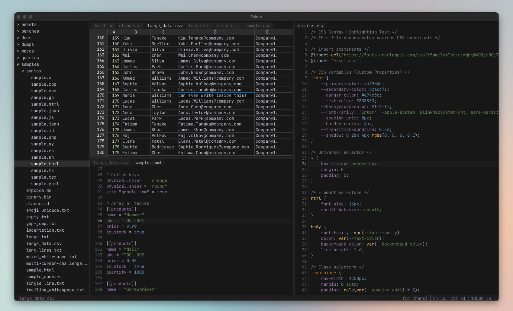

# Token - A Multi-Cursor Text Editor

**Multi-cursor, code editor inspired by JetBrains IDEs, Vibe-coded in Rust, using Amp Code.**
<br>
Most(ish) of the threads, prompts and conversations with the agent is available to view on
my [Amp profile](https://ampcode.com/@helgesverre).


[](https://ampcode.com/@helgesverre)




---

## Building from source

To build Token from source, you will need the [Rust toolchain](https://rustup.rs/) installed.
The `makefile setup` takes care of installing any other dependencies.

```shell
git clone https://github.com/HelgeSverre/token
cd token

# Install dependencies (and misc tools)
make setup

# Build and run with Makefile
make dev

# Or run seperately
make build
make run

# Or build and run manually with cargo,
# like a regular boring person...
cargo build --release
cargo run
```

## Commands

List them with `make help`

### Build & Run

| Command        | Description                                      |
| -------------- | ------------------------------------------------ |
| `make build`   | Build debug binary                               |
| `make release` | Build optimized release binary                   |
| `make run`     | Run with default sample file (indentation.txt)   |
| `make dev`     | Run debug build (faster compile, slower runtime) |
| `make csv`     | Run with large CSV file (tests CSV viewer)       |
| `make clean`   | Remove build artifacts                           |
| `make fmt`     | Format Rust code and markdown files              |

### Testing

| Command             | Description                            |
| ------------------- | -------------------------------------- |
| `make test`         | Run all tests                          |
| `make test-verbose` | Run tests with output                  |
| `make test-fast`    | Run tests faster using `cargo nextest` |

### Features

| Feature                  | Description                                                                  |
| ------------------------ | ---------------------------------------------------------------------------- |
| Multi-cursor editing     | Option+Click to add cursors, Option+Option+Arrow to add above/below          |
| Split views              | Horizontal and vertical splits with independent viewports                    |
| Syntax highlighting      | Tree-sitter based, 17 languages supported                                    |
| **CSV Viewer**           | Spreadsheet view for CSV/TSV/PSV files (Command Palette → "Toggle CSV View") |
| Configurable keybindings | YAML-based keymap with context-aware bindings                                |
| Themes                   | Dark and light themes with full customization                                |

---

## The Hidden Complexity of Text Editors

You use a text editor every day. But do you actually understand what it's doing?

On the surface, an editor is "just" text on a screen with a blinking cursor. Underneath, it's a small physics engine for
glyphs, pixels, and input events—quietly solving dozens of problems every time you press a key.

Consider a few things you rely on constantly but probably don't think about:

- **Cursor + selection choreography** — Hold Shift and press arrow keys: the cursor moves, the selection grows or
  shrinks, and the viewport sometimes nudges just enough to keep everything visible. Double-click a word, then
  Shift+Click somewhere else. The rules feel obvious—until you try to implement them.

- **Keyboard modifier edge cases** — What's the "right" behavior for Ctrl+Left on a line with emoji, snake_case, and
  camelCase? What happens to your selection when you hit Cmd+Z, then Cmd+Shift+Z, then type? When should Alt extend
  selection, Cmd jump by word, or Option+Option+Arrow add a new cursor?

- **Glyphs that don't behave like characters** — A single "character" on screen might be multiple codepoints: combining
  accents, zero-width joiners, ligatures. The cursor should snap to visually sensible positions, not halfway through a
  grapheme cluster. Column count, byte offset, and rendered width all disagree—and the editor must reconcile them.

- **Viewport scrolling that feels "natural"** — Page Down doesn't simply add `viewportHeight` to `scrollY`. It decides
  which line becomes the new top, keeps the cursor in a "safe zone," and handles partial lines at edges. Mouse wheel,
  scrollbar drag, and "Go to Line" all produce subtly different scroll behavior—but never feel inconsistent when done
  right.

All of this hides behind a UI that's supposed to feel invisible. That's exactly why it's easy to underestimate the
complexity.

**Why this matters for AI-assisted development:** If you want AI agents to help design, debug, or extend an editor, they
need more than "there's a cursor and some lines." They need a precise, shared vocabulary for scroll offsets, viewports,
cursor modes, selection semantics, and edge cases. The same is true for humans: explicit documentation is how you
sanity-check your own assumptions and avoid rediscovering tricky behaviors through trial and error.

Token is built around that idea: make geometry, behavior, and edge cases **fully explicit**—for both humans and
machines. See [EDITOR_UI_REFERENCE.md](docs/EDITOR_UI_REFERENCE.md) for our attempt to turn "obvious" editor behavior
into a concrete, testable spec.

---

## AI-Assisted Development: A Framework for Complex Projects

Token was built primarily through conversations with [Amp Code](https://ampcode.com/@helgesverre). This section
documents the methodology that made it work—applicable to any non-trivial project where you're collaborating with AI
agents.

### The Core Principle

AI agents excel at focused, well-defined tasks. The human's job is to provide **structure**: clear phases, written
specifications, and explicit invariants. The more complex your project, the more this structure pays off.

---

### Three Modes of Work

Before each session, explicitly state which mode you're in:

| Mode        | Purpose                                       | Inputs                       | Example                          |
| ----------- | --------------------------------------------- | ---------------------------- | -------------------------------- |
| **Build**   | New behavior that didn't exist                | Feature spec, reference docs | "Implement split view (Phase 3)" |
| **Improve** | Better architecture without changing behavior | Organization docs, roadmap   | "Extract modules from main.rs"   |
| **Sweep**   | Fix a cluster of related bugs                 | Bug tracker, gap doc         | "Multi-cursor selection bugs"    |

This prevents scope creep and keeps AI contributions coherent across sessions.

---

### Design Before Code

For complex features, invest in upfront documentation:

**1. Reference Documentation**  
Create a "document of truth" for cross-cutting concerns. [EDITOR_UI_REFERENCE.md](docs/EDITOR_UI_REFERENCE.md) defines
viewport math, coordinate systems, and scrolling behavior—used across split view, selection, and overlay
implementations.

**2. Feature Specifications**  
Before implementing multi-cursor, we wrote [SELECTION_MULTICURSOR.md](docs/archived/SELECTION_MULTICURSOR.md):

- Data structures and invariants
- Keyboard shortcuts table
- Message enums and expected behavior
- Multi-phase implementation plan

**3. Gap Documents**  
When a feature is 60-90% complete, create a gap
doc. [MULTI_CURSOR_SELECTION_GAPS.md](docs/archived/MULTI_CURSOR_SELECTION_GAPS.md) lists:

- What's implemented vs. missing
- Design decisions for each gap
- Tests and success criteria

This turns "vague incompleteness" into concrete, actionable tasks.

---

### The Multi-Cursor Migration: A Case Study

Adding multi-cursor to a single-cursor editor touched nearly every file. Here's how we avoided chaos:

**1. Wrote invariants upfront:**

```rust
// MUST maintain: cursors.len() == selections.len()
// MUST maintain: cursors[i].to_position() == selections[i].head
```

**2. Created migration helpers:**

```rust
// Old code still works via accessor
impl AppModel {
    pub fn cursor(&self) -> &Cursor { &self.editor.cursors[0] }
}
```

**3. Implemented in phases:**

- Phase 0: Per-cursor primitives (`move_cursor_left_at(idx)`)
- Phase 1: All-cursor wrappers (`move_all_cursors_left()`)
- Phase 2-4: Update handlers, add tests
- Phase 5: Bug sweep for edge cases

**4. Ran targeted sweeps:**
When bugs emerged, we created a focused tracker and fixed them systematically—not one-off. This leverages AI's strength
at "apply this pattern everywhere."

---

### Agent Configuration

Tell agents how to work in your codebase:

| File        | Purpose                                         |
| ----------- | ----------------------------------------------- |
| `AGENTS.md` | Build commands, architecture, conventions       |
| `CLAUDE.md` | Same (symlink or duplicate for different tools) |

Key: specify your Makefile/scripts so agents use `make test` instead of inventing
`cargo test --all-features --no-fail-fast`.

---

### Documentation Structure

| Path                                                       | Purpose                                             |
| ---------------------------------------------------------- | --------------------------------------------------- |
| [docs/ROADMAP.md](docs/ROADMAP.md)                         | Planned features with design doc links              |
| [docs/CHANGELOG.md](docs/CHANGELOG.md)                     | Completed work (reference when things break)        |
| [docs/EDITOR_UI_REFERENCE.md](docs/EDITOR_UI_REFERENCE.md) | Domain reference (geometry, coordinates, scrolling) |
| `docs/feature/`                                            | Design specs for planned features                   |
| `docs/archived/`                                           | Completed feature specs (kept for reference)        |

---

### Agent Workflow Patterns

**Research → Synthesize → Implement:**

1. Use **Librarian** to research how VSCode/Zed/Helix solve a problem
2. Use **Oracle** to review findings and produce a design doc
3. Implement in phases with tests

**Review Before Implementation:**
Having Oracle review [EDITOR_UI_REFERENCE.md](docs/EDITOR_UI_REFERENCE.md) caught 15+ issues (off-by-one errors,
division-by-zero edge cases) before they became bugs in code.

---

## Development Timeline

Token's development followed distinct phases, each with focused objectives:

| Phase               | Dates          | Focus                                           |
| ------------------- | -------------- | ----------------------------------------------- |
| Foundation          | Sep 26 - Dec 5 | Setup, reference docs, architecture             |
| Research Sprint     | Dec 6          | Performance, keymaps, testing infrastructure    |
| Feature Development | Dec 5-6        | Split view, undo/redo, multi-cursor selection   |
| Codebase Refactor   | Dec 6          | Extract modules from main.rs (3100→20 lines)    |
| Research & Polish   | Dec 7          | Zed research, cursor API fixes, test extraction |
| Maintenance         | Dec 7          | Bugfixes, benchmarks, documentation             |

---

### Notable Threads

<details>
<summary><strong>🔮 Oracle: UI Reference Deep Review</strong> | <a href="https://ampcode.com/threads/T-7b92a860-a2f7-4397-985c-73b2fa3e9582">T-7b92a860</a></summary>

**Date**: 2025-12-03

The Oracle performed a comprehensive technical review of EDITOR_UI_REFERENCE.md and identified **15+ issues**:

**Critical Bugs Found**:

- Off-by-one error in viewport calculations: `lastVisibleLine` should be `firstVisibleLine + visibleLines - 1`
- Division-by-zero edge cases in scrollbar thumb calculations
- `preferredColumn` was documented as column index but code used pixel X values

**Semantic Issues**:

- Selection struct uses `anchor/head` internally but docs said `start/end`
- Missing coverage for folding, soft-wrap interaction, IME composition, BiDi text

**Impact**: Created systematic AMP_REPORT.md with prioritized fixes. Prevented 1-3h of debugging per issue.

**Lesson Learned**: Always have oracle review reference docs before implementation - catches subtle algorithmic bugs
that tests miss.

</details>

<details>
<summary><strong>📚 Librarian: Keymap System Design</strong> | <a href="https://ampcode.com/threads/T-35b11d40-96b0-4177-9c75-4c723dfd8f80">T-35b11d40</a></summary>

**Date**: 2025-12-06

**Research Question**: How do major editors implement configurable keyboard mappings?

**Projects Studied**:
| Editor | Pattern | Key Insight |
|--------|---------|-------------|
| VSCode | Flat vector + context | User overrides predictable via insertion order |
| Helix | Trie-based | Efficient for prefix matching in modal editors |
| Zed | Flat with depth indexing | Context depth + insertion order for precedence |
| Neovim | Lua-based | Full scripting for complex mappings |

**Key Finding**: Two dominant patterns - **trie-based** for modal editors (Helix) vs **flat vector with indexing** for
context-rich editors (Zed, VSCode).

**Outcome**: Created [docs/feature/KEYMAPPING.md](docs/feature/KEYMAPPING.md) design doc with data structures, TOML
config format, and phased implementation plan.

</details>

<details>
<summary><strong>🐛 Critical Bug: Cmd+Z Was Typing 'z'!</strong> | <a href="https://ampcode.com/threads/T-519a8c9d-b94f-45e5-98e0-5bfc34c77cbf">T-519a8c9d</a></summary>

**Date**: 2025-12-06

**The Bug**: Undo/redo keyboard shortcuts were completely broken on macOS. Pressing Cmd+Z inserted the letter 'z' into
the document instead of undoing!

**Root Cause**: Key handler only checked `control_key()` modifier, not `super_key()` (macOS Command key).

**The Fix**:

```rust
// Before (broken on macOS)
if modifiers.control_key() & & key == "z" { ... }

// After (cross-platform)
if (modifiers.control_key() | | modifiers.super_key()) & & key == "z" { ... }
```

**Lesson Learned**: Always handle both `control_key()` AND `super_key()` for cross-platform keyboard shortcuts. The
macOS Command key is a completely different modifier than Ctrl.

</details>

<details>
<summary><strong>🏗️ Split View: EditorArea Architecture</strong> | <a href="https://ampcode.com/threads/T-29b1dd08-eee1-44fb-abd5-eb982d6bcd52">T-29b1dd08</a></summary>

**Date**: 2025-12-06

**Problem**: Implement multi-pane editing with tabs, splits, and shared documents.

**Architectural Decisions**:

1. **Shared documents, independent editors**: Documents stored in `HashMap<DocumentId, Document>`, editors in
   `HashMap<EditorId, EditorState>`. Multiple editors can view the same document with independent cursors/viewports.

2. **Layout tree structure**: `LayoutNode` is either `Group(GroupId)` or `Split(SplitContainer)`. Recursive structure
   allows arbitrary nesting.

3. **Migration helper**: `EditorArea::single_document()` provides backward compatibility:

```rust
impl AppModel {
    pub fn document(&self) -> &Document {
        self.editor_area.focused_document()  // Hides complexity
    }
}
```

**Lesson Learned**: Migration helpers like `single_document()` are crucial for phased refactoring. The pattern of "
replace two fields with one complex struct + accessors" worked smoothly.

</details>

<details>
<summary><strong>🖱️ Multi-Cursor: Only Primary Cursor Moved!</strong> | <a href="https://ampcode.com/threads/T-d4c75d42-c0c1-4746-a609-593bff88db6d">T-d4c75d42</a></summary>

**Date**: 2025-12-06

**The Bug**: Arrow keys and all movement operations only affected the primary cursor. Secondary cursors were frozen!

**Root Cause**: All movement handlers assumed single cursor - `move_cursor_up()` operated on `cursor_mut()` which only
returned `cursors[0]`.

**The Fix - Per-Cursor Primitives Pattern**:

```rust
// Low-level: operates on one cursor
fn move_cursor_left_at(&mut self, doc: &Document, idx: usize) { ... }

// High-level: iterates all cursors
fn move_all_cursors_left(&mut self, doc: &Document) {
    for idx in 0..self.cursors.len() {
        self.move_cursor_left_at(doc, idx);
    }
}
```

**Critical Invariant**:

```rust
// MUST maintain: cursors.len() == selections.len()
// MUST maintain: cursors[i].to_position() == selections[i].head
```

**Lesson Learned**: Always question single-item assumptions when adding multi-item support. The "per-item primitive +
all-items wrapper" pattern scales well.

</details>

<details>
<summary><strong>🔀 Selection Merging: merge_overlapping_selections()</strong> | <a href="https://ampcode.com/threads/T-e751be48-ab56-4b90-a196-d5df892d955b">T-e751be48</a></summary>

**Date**: 2025-12-06

**The Problem**: After SelectWord with multiple cursors on adjacent words, selections would overlap and cause rendering
bugs.

**The Solution**: `merge_overlapping_selections()` maintains the parallel array invariant:

```rust
pub fn merge_overlapping_selections(&mut self) {
    // 1. Sort by start position
    // 2. Merge consecutive overlapping/touching ranges
    // 3. Update both cursors and selections arrays in lockstep
}
```

**Key Insight**: "Touching" selections like `[0,5)` and `[5,10)` should merge into `[0,10)` - matches user expectations
for continuous selections.

</details>

<details>
<summary><strong>📦 Module Extraction Sprint</strong> (7 threads, Dec 6)</summary>

**Date**: 2025-12-06

Systematic extraction from monolithic files:

| Before      | After                                      | Lines            |
| ----------- | ------------------------------------------ | ---------------- |
| `main.rs`   | `app.rs`, `input.rs`, `view.rs`, `perf.rs` | 3100 → 20        |
| `update.rs` | `update/` module directory (5 submodules)  | 2900 → organized |

**Threads**: T-ce688bab → T-072af2cb (7 sequential extractions)

**Result**: 669 tests passing, cleaner architecture, easier navigation.

**Commits**: [`f602368`](https://github.com/HelgeSverre/token/commit/f602368), [
`71a3b87`](https://github.com/HelgeSverre/token/commit/71a3b87)

</details>

<details>
<summary><strong>🔬 Librarian: Zed GPUI Deep Dive</strong> | <a href="https://ampcode.com/threads/T-c764b2bc-4b0b-4a2a-8c65-c11460405741">T-c764b2bc</a></summary>

**Date**: 2025-12-07

**Research Topic**: How does Zed's GPUI framework handle rendering and state?

**Key Discoveries**:

- **Three-phase render cycle**: `request_layout` → `prepaint` → `paint`
- **Entity-based state**: Reference-counted handles with `notify()` for reactivity
- **DispatchTree**: Hierarchical focus management and event routing
- **Taffy layout engine**: Flexbox-style layout calculations

**Patterns for Token**:

- Modal/overlay system with hitbox blocking
- Deferred draw for overlays
- Focus trapping with hitbox system

</details>

---

<details>
<summary><strong>📋 Full Thread Reference (58 threads)</strong></summary>

All conversations are public. Sorted by timestamp (oldest first).

| Date/Time        | Thread                                                                                          | Type     | Summary                                                                                                |
| ---------------- | ----------------------------------------------------------------------------------------------- | -------- | ------------------------------------------------------------------------------------------------------ |
| 2025-12-03 21:26 | [UI Reference Review](https://ampcode.com/threads/T-7b92a860-a2f7-4397-985c-73b2fa3e9582)       | Research | Generated [Technical Reference Document](docs/EDITOR_UI_REFERENCE.md) based on research from Librarian |
| 2025-12-04 09:56 | [Reference Doc Polish](https://ampcode.com/threads/T-750a0e44-2302-4b5e-8cdc-70b14c3f7930)      | Research | Continuing reference doc review and rewrite                                                            |
| 2025-12-05 23:01 | [Status Bar Separators](https://ampcode.com/threads/T-ce8edd72-f084-4fba-8c86-276df333de96)     | Feature  | Design 1px separator segment for status bar                                                            |
| 2025-12-06 00:10 | [Selection Arrow Keys](https://ampcode.com/threads/T-de4eaf86-9b34-489a-b6c8-e5c0154f1aff)      | Bugfix   | Fix arrow keys with selection behavior                                                                 |
| 2025-12-06 01:27 | [Undo/Redo Gaps](https://ampcode.com/threads/T-519a8c9d-b94f-45e5-98e0-5bfc34c77cbf)            | Bugfix   | Fix undo/redo for selection delete, Cmd+Z handling                                                     |
| 2025-12-06 03:03 | [Undo/Redo Continued](https://ampcode.com/threads/T-60e201bf-322a-4190-8671-3afe9ad7500e)       | Feature  | Split view phases 1-2, undo/redo completion                                                            |
| 2025-12-06 03:25 | [Codebase Analysis](https://ampcode.com/threads/T-57a3ad00-4185-48a7-b12d-5ffb295c84ab)         | Setup    | Fresh codebase analysis and AGENTS.md update                                                           |
| 2025-12-06 03:53 | [Perf Tooling Research](https://ampcode.com/threads/T-6ff7dc54-9991-41fe-b168-f328b499a904)     | Research | Performance profiling and benchmarking tooling                                                         |
| 2025-12-06 04:08 | [Split View Phases 3-7](https://ampcode.com/threads/T-29b1dd08-eee1-44fb-abd5-eb982d6bcd52)     | Feature  | Implement split view AppModel, handlers, rendering                                                     |
| 2025-12-06 04:17 | [Keymap Design](https://ampcode.com/threads/T-35b11d40-96b0-4177-9c75-4c723dfd8f80)             | Research | Research configurable keyboard mapping systems                                                         |
| 2025-12-06 04:17 | [Test Infrastructure](https://ampcode.com/threads/T-39bdb354-08b2-4e0a-973d-75aeecab8a89)       | Research | Review test patterns, identify improvements                                                            |
| 2025-12-06 04:17 | [Rendering Performance](https://ampcode.com/threads/T-4272a15a-a0e8-4a74-9870-d793d36c33a0)     | Research | Analyze fontdue/softbuffer rendering hot paths                                                         |
| 2025-12-06 04:17 | [DX Improvements](https://ampcode.com/threads/T-88cd73c6-0f23-461e-ae99-48b1d9908c0e)           | Research | Developer experience improvement opportunities                                                         |
| 2025-12-06 04:17 | [Perf Infrastructure](https://ampcode.com/threads/T-9ff4cbc0-231e-4cbb-8abb-867de74409c4)       | Research | Audit existing PerfStats and monitoring                                                                |
| 2025-12-06 04:17 | [Text Hot Paths](https://ampcode.com/threads/T-ac8b817c-ee1c-49ea-af20-4fd2766ad531)            | Research | Identify text operations needing benchmarks                                                            |
| 2025-12-06 04:25 | [Fix update.rs](https://ampcode.com/threads/T-4d426fd5-17f4-48a1-8c5a-6d72f57536c2)             | Refactor | Fix compilation after model accessor change                                                            |
| 2025-12-06 04:33 | [Fix main.rs](https://ampcode.com/threads/T-34c36886-50c9-4fc3-a97a-304bb6ba6bf4)               | Refactor | Fix compilation after model accessor change                                                            |
| 2025-12-06 04:40 | [Fix Tests](https://ampcode.com/threads/T-4948f549-c762-4fe3-b1b6-65219754ffb8)                 | Refactor | Fix test files after model accessor change                                                             |
| 2025-12-06 06:17 | [Feedback Update](https://ampcode.com/threads/T-778bf91f-b35b-4e11-a895-4ccc9a28feed)           | Docs     | Update FEEDBACK.md with current progress                                                               |
| 2025-12-06 06:18 | [Multi-Group Render](https://ampcode.com/threads/T-f7453e71-4877-49df-b174-d3ec2534f601)        | Feature  | Refactor rendering for split view groups                                                               |
| 2025-12-06 08:08 | [Split View Polish](https://ampcode.com/threads/T-e982211e-9ad0-465b-b65e-288965968077)         | Feature  | Split view edge cases and layout tests                                                                 |
| 2025-12-06 10:26 | [GUI Library Review](https://ampcode.com/threads/T-82acac63-89cb-4bb0-bad7-bcc4f76af3cd)        | Research | Review areweguiyet.com, abstraction layer design                                                       |
| 2025-12-06 11:17 | [Bugfix Session](https://ampcode.com/threads/T-803561f4-2bd4-4545-9e0a-ff08d3e15e04)            | Bugfix   | Selection bugs, delete line, duplicate line                                                            |
| 2025-12-06 11:27 | [Codebase Reorg](https://ampcode.com/threads/T-5d9034ac-734a-4edd-9060-e28ad9572736)            | Docs     | Roadmap cleanup, changelog, organization plan                                                          |
| 2025-12-06 12:39 | [Expand/Shrink Select](https://ampcode.com/threads/T-568febc8-2f67-408d-b7ee-32dc212e88f6)      | Feature  | Implement expand/shrink selection with history                                                         |
| 2025-12-06 15:04 | [Multi-Cursor Movement](https://ampcode.com/threads/T-d4c75d42-c0c1-4746-a609-593bff88db6d)     | Feature  | All cursors move together, deduplicate on collide                                                      |
| 2025-12-06 16:14 | [Selection Gaps](https://ampcode.com/threads/T-6c1b5841-b5f3-4936-b875-338fd101a179)            | Feature  | SelectWord/Line/All with multi-cursor                                                                  |
| 2025-12-06 19:23 | [Selection Gaps Final](https://ampcode.com/threads/T-e751be48-ab56-4b90-a196-d5df892d955b)      | Feature  | Merge overlapping selections, final polish                                                             |
| 2025-12-06 21:39 | [Clean mod.rs](https://ampcode.com/threads/T-ce688bab-2373-4b8e-bf65-436948e19853)              | Refactor | Remove update_layout and helpers from mod.rs                                                           |
| 2025-12-06 21:43 | [Extract Document Helpers](https://ampcode.com/threads/T-5f9d93ca-4b90-4ca2-ba57-0925802c538c)  | Refactor | Extract update_document and undo/redo helpers                                                          |
| 2025-12-06 21:48 | [Extract editor.rs](https://ampcode.com/threads/T-0277253e-020d-4640-9edf-792c62d7aed3)         | Refactor | Extract update_editor and helpers to editor.rs                                                         |
| 2025-12-06 21:53 | [Extract view.rs](https://ampcode.com/threads/T-ed799761-6162-4aba-9890-51be6d4af3d2)           | Refactor | Extract Renderer and rendering code to view.rs                                                         |
| 2025-12-06 22:02 | [Extract perf.rs](https://ampcode.com/threads/T-ac15e777-123b-4dee-900d-aff8492dad6a)           | Refactor | Extract PerfStats and render_perf_overlay to perf.rs                                                   |
| 2025-12-06 22:06 | [Extract input.rs](https://ampcode.com/threads/T-0f78844c-deb2-46f5-b35b-f8f55e3122d5)          | Refactor | Extract handle_key to input.rs                                                                         |
| 2025-12-06 22:09 | [Extract app.rs](https://ampcode.com/threads/T-072af2cb-28ed-4086-8bc2-f3b5c5a74ab7)            | Refactor | Extract App struct and ApplicationHandler to app.rs                                                    |
| 2025-12-07 03:05 | [Code Analysis](https://ampcode.com/threads/T-1d4cb53e-ed6c-4df6-ae7c-47d1632af2f5)             | Research | Code analysis session                                                                                  |
| 2025-12-07 05:35 | [Zed Rendering Research](https://ampcode.com/threads/T-c764b2bc-4b0b-4a2a-8c65-c11460405741)    | Research | Research Zed's rendering pipeline and GPUI architecture                                                |
| 2025-12-07 06:03 | [Debug Tracing Research](https://ampcode.com/threads/T-c312fd74-c321-4e15-bce8-e01a2c1a5813)    | Research | Research debug tracing patterns from Zed/Helix/Lapce                                                   |
| 2025-12-07 06:10 | [Refactor Planning](https://ampcode.com/threads/T-da41379b-072f-4d46-a1b4-60d13467e7b4)         | Research | EditorState API refactor planning                                                                      |
| 2025-12-07 06:28 | [OVERVIEW.md Creation](https://ampcode.com/threads/T-aceb9dee-98e5-4caa-a443-8887376fe169)      | Docs     | Created OVERVIEW.md documentation                                                                      |
| 2025-12-07 06:46 | [Saturating Add Q&A](https://ampcode.com/threads/T-1b5a1a14-682d-4336-892e-136c9655e991)        | Research | Question about saturating_add usage                                                                    |
| 2025-12-07 07:24 | [Fix document.rs Cursors](https://ampcode.com/threads/T-3fbd1bfd-099a-4fe7-aaee-4d4ba8e0ca01)   | Bugfix   | Fix cursor calls in update/document.rs                                                                 |
| 2025-12-07 07:24 | [Fix main.rs Cursors](https://ampcode.com/threads/T-56fe4a38-f638-448a-82d3-34fbb36750e5)       | Bugfix   | Fix cursor calls in main.rs                                                                            |
| 2025-12-07 07:24 | [Fix Model Cursors](https://ampcode.com/threads/T-5f24afb8-5458-4e89-944e-7307ad791b0e)         | Bugfix   | Fix cursor calls in model/, view.rs, app.rs                                                            |
| 2025-12-07 07:24 | [Fix editor.rs Cursors](https://ampcode.com/threads/T-c46bc701-e073-4bcf-b48e-5a1269e80015)     | Bugfix   | Fix cursor calls in update/editor.rs                                                                   |
| 2025-12-07 07:24 | [Fix input.rs Cursors](https://ampcode.com/threads/T-e937d255-b14c-4c09-bef2-f791dfdc0b6f)      | Bugfix   | Fix cursor calls in input.rs                                                                           |
| 2025-12-07 08:34 | [Indent/Unindent Fix](https://ampcode.com/threads/T-9003f81f-0d48-4502-bf3f-a630929eb7d3)       | Bugfix   | Fix indent/unindent operations for multi-cursor                                                        |
| 2025-12-07 09:01 | [Extract editor_area Tests](https://ampcode.com/threads/T-03d86baf-afcc-45f0-b0d2-9a8b39f3b3d3) | Refactor | Extract editor_area.rs tests                                                                           |
| 2025-12-07 09:01 | [Analyze main.rs Tests](https://ampcode.com/threads/T-55a92c93-b66b-4adf-9183-6fd138d93028)     | Research | Analyze main.rs tests                                                                                  |
| 2025-12-07 09:01 | [Extract theme.rs Tests](https://ampcode.com/threads/T-cc1f1709-0fc1-438d-bf17-d6a189fbff5a)    | Refactor | Extract theme.rs tests                                                                                 |
| 2025-12-07 09:01 | [Extract overlay.rs Tests](https://ampcode.com/threads/T-f37a7ab6-b215-48d4-96a5-b4cde8cec3bf)  | Refactor | Extract overlay.rs tests                                                                               |
| 2025-12-07 10:00 | [Cross Compilation](https://ampcode.com/threads/T-c07e689b-8ec7-437e-ae97-6837a90e0893)         | Setup    | Setup cross compilation locally                                                                        |
| 2025-12-07 10:35 | [Duplication Analysis](https://ampcode.com/threads/T-e2bf6523-008d-498a-90b5-e8c0f733c3cf)      | Bugfix   | Multi-line duplication cursor offset analysis                                                          |
| 2025-12-07 10:42 | [Renderer Benchmark](https://ampcode.com/threads/T-4d6395e5-38be-4dd2-9c68-bb9b0e727c72)        | Research | Create pure renderer for benchmarking view.rs                                                          |
| 2025-12-07 11:26 | [Unified PerfStats](https://ampcode.com/threads/T-612ca421-647d-4483-b4c6-92e38527d0a1)         | Feature  | Create unified PerfStats (no-op in release)                                                            |
| 2025-12-07 12:05 | [DeleteBackward Fix](https://ampcode.com/threads/T-7c00a046-9808-407e-b176-807270a6c15e)        | Bugfix   | Fix DeleteBackward multi-cursor newline adjustment                                                     |

</details>

## License

This project is licensed under the [MIT License](LICENSE.md)

The included font, [JetBrains Mono](assets/JetBrainsMono.ttf), is licensed under the [OFL-1.1](assets/OFL.txt).
