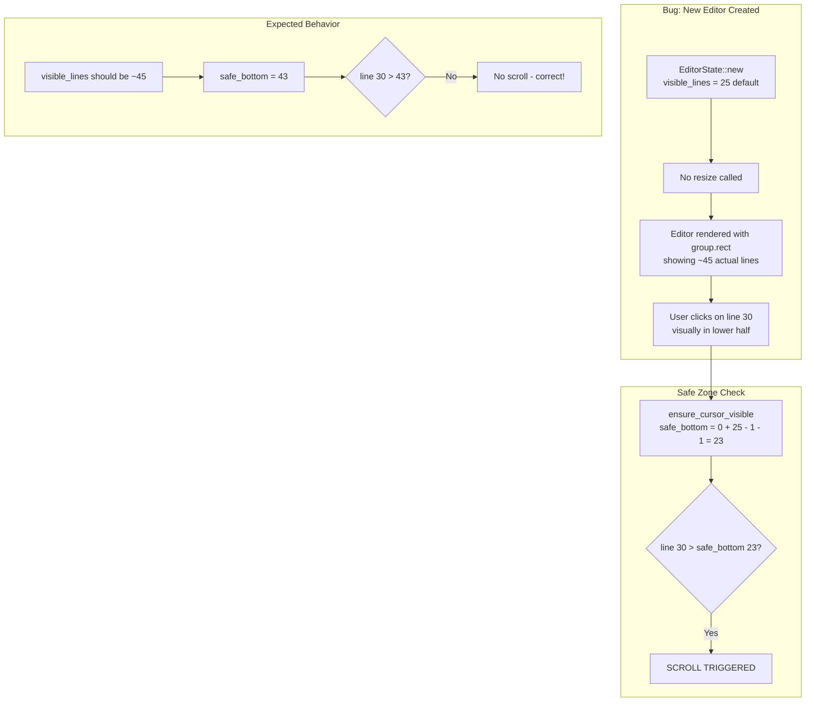

# AI-Assisted Development: Building Token

Token is a multi-cursor text editor written in Rust—around 15,000 lines of code built primarily through 173+ conversations with [Amp Code](https://ampcode.com/@helgesverre).

This document describes the methodology that made sustained AI collaboration work on a project that doesn't fit in a single context window. It's not about what AI can do in a demo; it's about what actually works across months of development.

The core insight: **AI agents excel at focused, well-defined tasks. The human's job is to provide structure—clear phases, written specifications, and explicit invariants.** The more complex your project, the more this structure pays off.

Text editors are a good stress test for this approach. They look simple but hide real complexity: cursor choreography with selection, keyboard modifier edge cases across platforms, grapheme cluster handling, viewport scrolling that "feels right." Getting these details consistent across dozens of AI sessions requires explicit documentation that both humans and machines can reference. See [EDITOR_UI_REFERENCE.md](EDITOR_UI_REFERENCE.md) for what that looks like in practice.

---

## The Framework

### Three Modes of Work

Before each session, explicitly state which mode you're in:

| Mode        | Purpose                                       | Inputs                       | Example                          |
| ----------- | --------------------------------------------- | ---------------------------- | -------------------------------- |
| **Build**   | New behavior that didn't exist                | Feature spec, reference docs | "Implement split view (Phase 3)" |
| **Improve** | Better architecture without changing behavior | Organization docs, roadmap   | "Extract modules from main.rs"   |
| **Sweep**   | Fix a cluster of related bugs                 | Bug tracker, gap doc         | "Multi-cursor selection bugs"    |

This prevents scope creep and keeps AI contributions coherent across sessions.

---

### Design Before Code

For complex features, invest in upfront documentation:

**1. Reference Documentation**
Create a "document of truth" for cross-cutting concerns. [EDITOR_UI_REFERENCE.md](EDITOR_UI_REFERENCE.md) defines viewport math, coordinate systems, and scrolling behavior—used across split view, selection, and overlay implementations.

**2. Feature Specifications**
Before implementing multi-cursor, we wrote [SELECTION_MULTICURSOR.md](archived/SELECTION_MULTICURSOR.md):

- Data structures and invariants
- Keyboard shortcuts table
- Message enums and expected behavior
- Multi-phase implementation plan

**3. Gap Documents**
When a feature is 60-90% complete, create a gap doc. [MULTI_CURSOR_SELECTION_GAPS.md](archived/MULTI_CURSOR_SELECTION_GAPS.md) lists:

- What's implemented vs. missing
- Design decisions for each gap
- Tests and success criteria

This turns "vague incompleteness" into concrete, actionable tasks.

---

### The Multi-Cursor Migration: A Case Study

Adding multi-cursor to a single-cursor editor touched nearly every file. Here's how we avoided chaos:

**1. Wrote invariants upfront:**

```rust
// MUST maintain: cursors.len() == selections.len()
// MUST maintain: cursors[i].to_position() == selections[i].head
```

**2. Created migration helpers:**

```rust
// Old code still works via accessor
impl AppModel {
    pub fn cursor(&self) -> &Cursor { &self.editor.cursors[0] }
}
```

**3. Implemented in phases:**

- Phase 0: Per-cursor primitives (`move_cursor_left_at(idx)`)
- Phase 1: All-cursor wrappers (`move_all_cursors_left()`)
- Phase 2-4: Update handlers, add tests
- Phase 5: Bug sweep for edge cases

**4. Ran targeted sweeps:**
When bugs emerged, we created a focused tracker and fixed them systematically—not one-off. This leverages AI's strength at "apply this pattern everywhere."

---

### Agent Configuration

Tell agents how to work in your codebase:

| File        | Purpose                                         |
| ----------- | ----------------------------------------------- |
| `AGENTS.md` | Build commands, architecture, conventions       |
| `CLAUDE.md` | Same (symlink or duplicate for different tools) |

Key: specify your Makefile/scripts so agents use `make test` instead of inventing `cargo test --all-features --no-fail-fast`.

---

### Documentation Structure

| Path                                             | Purpose                                             |
| ------------------------------------------------ | --------------------------------------------------- |
| [docs/ROADMAP.md](ROADMAP.md)                    | Planned features with design doc links              |
| [docs/CHANGELOG.md](CHANGELOG.md)                | Completed work (reference when things break)        |
| [docs/EDITOR_UI_REFERENCE.md](EDITOR_UI_REFERENCE.md) | Domain reference (geometry, coordinates, scrolling) |
| `docs/feature/`                                  | Design specs for planned features                   |
| `docs/archived/`                                 | Completed feature specs (kept for reference)        |

---

### Agent Workflow Patterns

**Research → Synthesize → Implement:**

1. Use **Librarian** to research how VSCode/Zed/Helix solve a problem
2. Use **Oracle** to review findings and produce a design doc
3. Implement in phases with tests

**Review Before Implementation:**
Having Oracle review [EDITOR_UI_REFERENCE.md](EDITOR_UI_REFERENCE.md) caught 15+ issues (off-by-one errors, division-by-zero edge cases) before they became bugs in code.

---

## Development Timeline

Token's development followed distinct phases, each with focused objectives:

| Phase                | Dates          | Focus                                                 |
| -------------------- | -------------- | ----------------------------------------------------- |
| Foundation           | Sep 26 - Dec 5 | Setup, reference docs, architecture                   |
| Research Sprint      | Dec 6          | Performance, keymaps, testing infrastructure          |
| Feature Development  | Dec 5-6        | Split view, undo/redo, multi-cursor selection         |
| Codebase Refactor    | Dec 6          | Extract modules from main.rs (3100→20 lines)          |
| Research & Polish    | Dec 7          | Zed research, cursor API fixes, test extraction       |
| Maintenance          | Dec 7          | Bugfixes, benchmarks, documentation                   |
| Keymapping System    | Dec 15         | Configurable YAML keybindings, 74 default bindings    |
| Syntax Highlighting  | Dec 15         | Tree-sitter integration, 17 languages supported       |
| CSV Viewer/Editor    | Dec 16         | Spreadsheet view with cell editing (Phases 1-2)       |
| HiDPI Fixes          | Dec 16         | Display switching, ScaledMetrics system               |
| Workspace Management | Dec 17         | Sidebar file tree, focus system, global shortcuts     |
| Unified Text Editing | Dec 19         | EditableState system, modal/CSV clipboard & selection |
| Perf & Find/Replace  | Dec 19-20      | Event loop fix (7→60 FPS), find/replace modal         |
| File Dialogs         | Jan 6-7        | Native open/save dialogs, config hot-reload           |
| Markdown Preview     | Jan 7-8        | Docked panels, webview preview, HTML preview          |
| Mouse Refactor       | Jan 8          | Hit-test system, unified mouse event handling         |
| Dock Panels          | Jan 8-9        | Editor area resizing, scroll isolation, z-order fixes |
| v0.3.15 Release      | Jan 9          | HTML preview, dock fixes, viewport layout             |
| Sema Language        | Feb 17         | Custom sema-lisp syntax support                       |
| Website v4           | Feb 17-18      | Complete website redesign with Astro                  |
| New Themes           | Feb 18         | Dracula, Catppuccin, Nord, Tokyo Night, Gruvbox Dark  |
| Bracket Matching     | Feb 18         | Auto-surround selection, bracket highlighting         |
| Syntax Perf          | Feb 19         | Highlight pipeline rewrite, deadline timers, shift-on-edit |
| Recent Files         | Feb 19         | Cmd+E modal, persistent MRU list, fuzzy filtering     |
| Code Outline Panel   | Feb 19         | Tree-sitter symbol extraction, 10 languages, dock panel |

---

## Notable Threads

<details>
<summary><strong>Oracle: UI Reference Deep Review</strong> | <a href="https://ampcode.com/threads/T-7b92a860-a2f7-4397-985c-73b2fa3e9582">T-7b92a860</a></summary>

**Date**: 2025-12-03

The Oracle performed a comprehensive technical review of EDITOR_UI_REFERENCE.md and identified **15+ issues**:

**Critical Bugs Found**:

- Off-by-one error in viewport calculations: `lastVisibleLine` should be `firstVisibleLine + visibleLines - 1`
- Division-by-zero edge cases in scrollbar thumb calculations
- `preferredColumn` was documented as column index but code used pixel X values

**Semantic Issues**:

- Selection struct uses `anchor/head` internally but docs said `start/end`
- Missing coverage for folding, soft-wrap interaction, IME composition, BiDi text

**Impact**: Created systematic AMP_REPORT.md with prioritized fixes. Prevented 1-3h of debugging per issue.

**Lesson Learned**: Always have oracle review reference docs before implementation - catches subtle algorithmic bugs that tests miss.

</details>

<details>
<summary><strong>Librarian: Keymap System Design</strong> | <a href="https://ampcode.com/threads/T-35b11d40-96b0-4177-9c75-4c723dfd8f80">T-35b11d40</a></summary>

**Date**: 2025-12-06

**Research Question**: How do major editors implement configurable keyboard mappings?

**Projects Studied**:
| Editor | Pattern | Key Insight |
|--------|---------|-------------|
| VSCode | Flat vector + context | User overrides predictable via insertion order |
| Helix | Trie-based | Efficient for prefix matching in modal editors |
| Zed | Flat with depth indexing | Context depth + insertion order for precedence |
| Neovim | Lua-based | Full scripting for complex mappings |

**Key Finding**: Two dominant patterns - **trie-based** for modal editors (Helix) vs **flat vector with indexing** for context-rich editors (Zed, VSCode).

**Outcome**: Created [docs/feature/KEYMAPPING.md](archived/KEYMAPPING.md) design doc with data structures, TOML config format, and phased implementation plan.

</details>

<details>
<summary><strong>Critical Bug: Cmd+Z Was Typing 'z'!</strong> | <a href="https://ampcode.com/threads/T-519a8c9d-b94f-45e5-98e0-5bfc34c77cbf">T-519a8c9d</a></summary>

**Date**: 2025-12-06

**The Bug**: Undo/redo keyboard shortcuts were completely broken on macOS. Pressing Cmd+Z inserted the letter 'z' into the document instead of undoing!

**Root Cause**: Key handler only checked `control_key()` modifier, not `super_key()` (macOS Command key).

**The Fix**:

```rust
// Before (broken on macOS)
if modifiers.control_key() && key == "z" { ... }

// After (cross-platform)
if (modifiers.control_key() || modifiers.super_key()) && key == "z" { ... }
```

**Lesson Learned**: Always handle both `control_key()` AND `super_key()` for cross-platform keyboard shortcuts. The macOS Command key is a completely different modifier than Ctrl.

</details>

<details>
<summary><strong>Split View: EditorArea Architecture</strong> | <a href="https://ampcode.com/threads/T-29b1dd08-eee1-44fb-abd5-eb982d6bcd52">T-29b1dd08</a></summary>

**Date**: 2025-12-06

**Problem**: Implement multi-pane editing with tabs, splits, and shared documents.

**Architectural Decisions**:

1. **Shared documents, independent editors**: Documents stored in `HashMap<DocumentId, Document>`, editors in `HashMap<EditorId, EditorState>`. Multiple editors can view the same document with independent cursors/viewports.

2. **Layout tree structure**: `LayoutNode` is either `Group(GroupId)` or `Split(SplitContainer)`. Recursive structure allows arbitrary nesting.

3. **Migration helper**: `EditorArea::single_document()` provides backward compatibility:

```rust
impl AppModel {
    pub fn document(&self) -> &Document {
        self.editor_area.focused_document()  // Hides complexity
    }
}
```

**Lesson Learned**: Migration helpers like `single_document()` are crucial for phased refactoring. The pattern of "replace two fields with one complex struct + accessors" worked smoothly.

</details>

<details>
<summary><strong>Multi-Cursor: Only Primary Cursor Moved!</strong> | <a href="https://ampcode.com/threads/T-d4c75d42-c0c1-4746-a609-593bff88db6d">T-d4c75d42</a></summary>

**Date**: 2025-12-06

**The Bug**: Arrow keys and all movement operations only affected the primary cursor. Secondary cursors were frozen!

**Root Cause**: All movement handlers assumed single cursor - `move_cursor_up()` operated on `cursor_mut()` which only returned `cursors[0]`.

**The Fix - Per-Cursor Primitives Pattern**:

```rust
// Low-level: operates on one cursor
fn move_cursor_left_at(&mut self, doc: &Document, idx: usize) { ... }

// High-level: iterates all cursors
fn move_all_cursors_left(&mut self, doc: &Document) {
    for idx in 0..self.cursors.len() {
        self.move_cursor_left_at(doc, idx);
    }
}
```

**Critical Invariant**:

```rust
// MUST maintain: cursors.len() == selections.len()
// MUST maintain: cursors[i].to_position() == selections[i].head
```

**Lesson Learned**: Always question single-item assumptions when adding multi-item support. The "per-item primitive + all-items wrapper" pattern scales well.

</details>

<details>
<summary><strong>Selection Merging: merge_overlapping_selections()</strong> | <a href="https://ampcode.com/threads/T-e751be48-ab56-4b90-a196-d5df892d955b">T-e751be48</a></summary>

**Date**: 2025-12-06

**The Problem**: After SelectWord with multiple cursors on adjacent words, selections would overlap and cause rendering bugs.

**The Solution**: `merge_overlapping_selections()` maintains the parallel array invariant:

```rust
pub fn merge_overlapping_selections(&mut self) {
    // 1. Sort by start position
    // 2. Merge consecutive overlapping/touching ranges
    // 3. Update both cursors and selections arrays in lockstep
}
```

**Key Insight**: "Touching" selections like `[0,5)` and `[5,10)` should merge into `[0,10)` - matches user expectations for continuous selections.

</details>

<details>
<summary><strong>Module Extraction Sprint</strong> (7 threads, Dec 6)</summary>

**Date**: 2025-12-06

Systematic extraction from monolithic files:

| Before      | After                                      | Lines            |
| ----------- | ------------------------------------------ | ---------------- |
| `main.rs`   | `app.rs`, `input.rs`, `view.rs`, `perf.rs` | 3100 → 20        |
| `update.rs` | `update/` module directory (5 submodules)  | 2900 → organized |

**Threads**: T-ce688bab → T-072af2cb (7 sequential extractions)

**Result**: 669 tests passing, cleaner architecture, easier navigation.

**Commits**: [`f602368`](https://github.com/HelgeSverre/token/commit/f602368), [`71a3b87`](https://github.com/HelgeSverre/token/commit/71a3b87)

</details>

<details>
<summary><strong>Librarian: Zed GPUI Deep Dive</strong> | <a href="https://ampcode.com/threads/T-c764b2bc-4b0b-4a2a-8c65-c11460405741">T-c764b2bc</a></summary>

**Date**: 2025-12-07

**Research Topic**: How does Zed's GPUI framework handle rendering and state?

**Key Discoveries**:

- **Three-phase render cycle**: `request_layout` → `prepaint` → `paint`
- **Entity-based state**: Reference-counted handles with `notify()` for reactivity
- **DispatchTree**: Hierarchical focus management and event routing
- **Taffy layout engine**: Flexbox-style layout calculations

**Patterns for Token**:

- Modal/overlay system with hitbox blocking
- Deferred draw for overlays
- Focus trapping with hitbox system

</details>

<details>
<summary><strong>Keymapping System v0.2.0</strong> | <a href="https://ampcode.com/threads/T-019b217e-cd52-76ce-bdf5-f17b8d46105d">T-019b217e</a></summary>

**Date**: 2025-12-15

**Problem**: Hardcoded keybindings in input.rs made customization impossible and led to precedence issues.

**Solution**: Complete migration to YAML-configurable keymapping system:

```yaml
# keymap.yaml - platform-aware, context-sensitive bindings
- key: cmd+s
  command: Save
- key: tab
  command: Indent
  when: [has_selection]
- key: tab
  command: InsertTab
  when: [no_selection]
```

**Key Implementation Details**:

- 74 default bindings embedded at compile time via `include_str!()`
- Platform-aware `cmd` modifier (Cmd on macOS, Ctrl elsewhere)
- Context conditions: `has_selection`, `has_multiple_cursors`, `modal_active`, etc.
- Chord support with `KeyAction::{Execute, AwaitMore, NoMatch}`
- `command: Unbound` pattern to disable default bindings

**Threads in this feature**: T-019b0309, T-019b0323, T-019b2111, T-019b2125, T-019b217e

</details>

<details>
<summary><strong>Syntax Highlighting with Tree-sitter</strong> | <a href="https://ampcode.com/threads/T-019b22cc-7eae-750e-92dc-a62e57a18d8f">T-019b22cc</a></summary>

**Date**: 2025-12-15

**Problem**: No syntax highlighting - all code displayed as plain text.

**Solution**: Async tree-sitter-based syntax highlighting with 17 language support:

- **Background worker thread** with mpsc channels for non-blocking parsing
- **30ms debounce** prevents parsing on every keystroke
- **Revision tracking** discards stale parse results
- **Incremental parsing** with `tree.edit()` for efficient updates

**Supported Languages**: Rust, YAML, Markdown, HTML, CSS, JavaScript, TypeScript, JSON, TOML, Python, Go, PHP, C, C++, Java, Bash

**Architecture**:

```
Edit → DebouncedSyntaxParse → ParseReady → Worker Thread → ParseCompleted → Apply Highlights
```

**Threads in this feature**: T-019b2280, T-019b22cc, T-019b22f1, T-019b2307, T-019b230f, T-019b238a, T-019b239e

</details>

<details>
<summary><strong>CSV Viewer with Cell Editing</strong> | <a href="https://ampcode.com/threads/T-019b2783-7db1-73cf-b7de-2373fcbb61f0">T-019b2783</a></summary>

**Date**: 2025-12-16

**Problem**: CSV files displayed as raw text with no structure.

**Solution**: Spreadsheet-style CSV viewer with cell editing:

- **Phase 1**: Grid rendering, row/column headers, cell navigation, mouse wheel scrolling
- **Phase 2**: Cell editing with proper CSV escaping (RFC 4180), document synchronization

**Key Features**:

- Toggle via Command Palette: "Toggle CSV View"
- Delimiter detection from file extension or content (CSV, TSV, PSV)
- Keyboard navigation: Arrow keys, Tab/Shift+Tab, Page Up/Down, Cmd+Home/End
- Edit with Enter or start typing, Escape to cancel

**Stress Tested**: Handles 10k+ row files with virtual scrolling

**Threads in this feature**: T-019b22bd, T-019b2734, T-019b274f, T-019b275d, T-019b2783, T-019b2794

</details>

<details>
<summary><strong>Workspace Management & File Tree</strong> | <a href="https://ampcode.com/threads/T-019b2b7a-8dd7-763a-9ab7-3132ddcf516a">T-019b2b7a</a></summary>

**Date**: 2025-12-17

**Problem**: No file browser - users had to open files via command line or dialogs.

**Solution**: Full workspace management with sidebar file tree:

- **File tree sidebar** with expand/collapse folders, file icons
- **Focus management system**: `FocusTarget` enum (Editor, Sidebar, Modal)
- **Mouse interaction**: Double-click to open files, single-click chevron for folders
- **Keyboard navigation**: Arrow keys, Enter to open, Escape to return to editor
- **Theming**: Full sidebar color customization in theme YAML

**Architecture**:

```rust
struct Workspace {
    root: PathBuf,
    file_tree: FileTree,
    sidebar_visible: bool,
    sidebar_width: f32,
}
```

**Threads in this feature**: T-019b2b7a, T-019b2bc5, T-019b2be7, T-019b2c40, T-019b2c8a, T-019b2ca6

</details>

<details>
<summary><strong>HiDPI Display Scaling Fixes</strong> | <a href="https://ampcode.com/threads/T-019b2476-55a8-7058-9ba9-9360a9280c1b">T-019b2476</a></summary>

**Date**: 2025-12-16

**Problem**: Tab area too small on Retina displays, debug overlay misaligned - scaling broken on HiDPI.

**Root Cause Investigation**:

- Metrics calculated in logical units but used as physical pixels
- Font sizes not scaled by DPI factor
- Inconsistent coordinate systems between rendering and hit testing

**The Fix - ScaledMetrics**:

```rust
pub struct ScaledMetrics {
    pub tab_bar_height: u32,      // Pre-scaled by scale_factor
    pub status_bar_height: u32,
    pub line_height: u32,
    pub char_width: u32,
    // ... all measurements pre-scaled
}
```

**Key Insight**: Scale once at metrics creation, use physical pixels everywhere else.

**Threads in this feature**: T-019b2476, T-019b26ca, T-019b26e5

</details>

<details>
<summary><strong>Unified Text Editing System</strong> | <a href="https://ampcode.com/threads/T-019b3643-79af-7573-bb69-18dac832eb94">T-019b3643</a></summary>

**Date**: 2025-12-19

**Problem**: 5 separate text editing implementations (main editor, command palette, go-to-line, find/replace, CSV cells) with duplicated logic and inconsistent behavior.

**Solution**: Created unified `src/editable/` module with:

```rust
// Core abstraction for all text editing
pub struct EditableState<B: TextBuffer> {
    pub buffer: B,                    // StringBuffer or RopeBuffer
    pub cursors: Vec<Cursor>,
    pub selections: Vec<Selection>,
    pub constraints: EditConstraints,  // Context-specific rules
    history: EditHistory,              // Undo/redo
}

// Unified message type
pub enum TextEditMsg {
    Move(MoveTarget),
    MoveWithSelection(MoveTarget),
    InsertChar(char),
    DeleteBackward,
    SelectAll,
    Undo,
    Redo,
    // ...
}
```

**Key Insight**: Abstract buffer operations behind traits, share editing logic across all contexts.

**Benefits**:
- All modals now have full cursor navigation, selection, word movement
- CSV cell editing has undo/redo, selection, clipboard support
- Bridge pattern maps `TextEditMsg` to existing editor messages for gradual migration

**Threads in this feature**: T-019b3643, T-019b3664, T-019b3671, T-019b367e, T-019b3688, T-019b368e, T-019b369a

</details>

<details>
<summary><strong>Event Loop Spinning: 7 FPS → 60 FPS</strong> | <a href="https://ampcode.com/threads/T-019b3bbd-d4fd-75df-81a0-c94a5e693227">T-019b3bbd</a></summary>

**Date**: 2025-12-20

**Problem**: Multi-split view caused ~7 FPS with 100% CPU usage even when idle.

**Root Cause**: `ControlFlow::Poll` was spinning the event loop constantly.

**The Fix**:

```rust
// Before: spinning at 100% CPU
ControlFlow::Poll

// After: sleep until next event or cursor blink
ControlFlow::WaitUntil(next_cursor_blink)
```

**Performance Profile (30-second live session)**:
| Category | Time |
|----------|------|
| Idle/Waiting | 77.6% |
| Event Handling | 21.5% |
| Rendering | ~0.9% |

**Key Insight**: Investigate the event loop first when debugging rendering performance — it's often not the rendering that's slow.

**Threads in this feature**: T-019b3bbd, T-019b3bd7, T-019b3c03

</details>

<details>
<summary><strong>Markdown Preview & Docked Panels</strong> | <a href="https://ampcode.com/threads/T-019b9893-43cd-72ea-bcb4-9e0e1494e517">T-019b9893</a></summary>

**Date**: 2026-01-07

**Problem**: No way to preview markdown or HTML files within the editor.

**Solution**: Full docked panel system with webview-based preview:

- **DockPanel abstraction**: `DockPosition` enum (Bottom, Right), resizable panels
- **Webview integration**: WKWebView on macOS with custom `token://` protocol for local resources
- **HTML preview**: Both markdown-to-HTML rendering and direct HTML file preview
- **Live updates**: Preview refreshes on tab switch if new file supports preview

**Architecture**:

```rust
struct Dock {
    panels: Vec<DockPanel>,
    position: DockPosition,
    size: f32,
    visible: bool,
}
```

**Key Insight**: Building a docked panel abstraction first (rather than hardcoding markdown preview) made it trivial to add HTML preview later — just implement `supports_preview()`.

**Threads in this feature**: T-019b9856, T-019b9893, T-019b98ae, T-019b98be, T-019b98dd, T-019b9eec, T-019b9efa, T-019b9f4b, T-019ba01a

</details>

<details>
<summary><strong>Mouse Event Handling Refactor</strong> | <a href="https://ampcode.com/threads/T-019b9d40-e7f7-760c-81ce-7dcc1796705e">T-019b9d40</a></summary>

**Date**: 2026-01-08

**Problem**: Mouse event handling was ad-hoc if/else chains checking pixel coordinates. Adding new clickable regions (dock panels, sidebar, tabs) required modifying a growing chain of conditionals.

**Solution**: Priority-ordered hit-test system:

```rust
enum HitTarget {
    DockResizeHandle,
    DockPanel,
    Modal,
    TabBar(EditorId),
    Sidebar,
    EditorGutter(EditorId),
    Editor(EditorId),
    StatusBar,
}
```

**Key Insight**: A `HitTarget` enum + priority-ordered hit testing replaces coordinate-checking spaghetti. Each target knows its bounds, and the first match wins.

**Threads in this feature**: T-019b9cbb, T-019b9d40

</details>

<details>
<summary><strong>Bracket Matching & Auto-Surround</strong> | <a href="https://ampcode.com/threads/T-019c7293-f967-73f6-b6b4-e3c2e946dfad">T-019c7293</a></summary>

**Date**: 2026-02-18

**Problem**: No visual feedback for matching brackets, and no auto-surround when typing brackets with selected text.

**Solution**: Two complementary features:

- **Bracket matching**: When cursor is adjacent to `()`, `[]`, or `{}`, both brackets are highlighted
- **Auto-surround**: Select text and type `(`, `[`, `{`, `"`, `'`, or `` ` `` to wrap it. Works with multi-cursor.

Both features are configurable (`auto_surround`, `bracket_matching` in config.yaml) and have theme support (`bracket_match_background`).

**Key Insight**: Auto-surround with multi-cursor required careful reverse-order processing — same pattern as multi-cursor text insertion.

</details>

<details>
<summary><strong>Scroll Bug: Viewport Thought It Was Half-Size</strong> | <a href="https://ampcode.com/threads/T-019c7311-dbee-7068-b3cc-ecc6f22d04af">T-019c7311</a></summary>

**Date**: 2026-02-18

**Problem**: Clicking below the midpoint of the editor caused the viewport to scroll unexpectedly, centering the cursor. Should only scroll when clicking the last visible line or when cursor is outside the viewport.

**Root Cause**: New editors initialized with `visible_lines = 25` (hardcoded default) but the actual viewport showed ~45 lines on a Retina display. The model thought line 30 was "off-screen" and scrolled to compensate.

**Diagnosis via Mermaid Diagram**:



**The Fix**:
1. `ensure_cursor_visible_no_padding()` for mouse clicks — only scroll if cursor is strictly outside viewport
2. `sync_viewports` called after tab/split creation so new editors inherit correct dimensions
3. Fixed `sync_all_viewports` to subtract `tab_bar_height` from group height

**Key Insight**: Visualizing model state vs. rendered state with a diagram made the mismatch immediately obvious — the model "saw" 25 lines while the screen showed 45.

</details>

<details>
<summary><strong>Syntax Perf: Pipeline Rewrite</strong> | <a href="https://ampcode.com/threads/T-019c7326-f328-7330-b888-426528b60efe">T-019c7326</a></summary>

**Date**: 2026-02-19

**Problem**: Every keystroke spawned a new thread for syntax highlighting debouncing. This was wasteful and caused visible highlight flashing — old highlights were cleared before new ones arrived.

**Solution**: Two complementary fixes:

1. **Event-loop deadline timers**: Replaced thread-per-debounce with `ControlFlow::WaitUntil` deadline timers integrated into the existing event loop. No new threads spawned per keystroke.

2. **Immediate highlight shifting**: On edits like `InsertNewline`, `DeleteBackward`, or `Paste`, existing highlights are immediately shifted by the edit delta before the background parse completes. This eliminates the flash of unstyled text.

```rust
// Before: spawn a thread per keystroke
std::thread::spawn(move || {
    std::thread::sleep(Duration::from_millis(50));
    // send parse request
});

// After: set a deadline in the event loop
self.syntax_deadline = Some(Instant::now() + Duration::from_millis(50));
// ControlFlow::WaitUntil(deadline) handles the rest
```

**Key Insight**: When you already have an event loop with `WaitUntil` support, use it for debouncing instead of spawning threads. Shifting existing highlights by the edit delta provides instant visual feedback while the real parse runs in the background.

</details>

<details>
<summary><strong>Recent Files: Cmd+E Modal</strong> | <a href="https://ampcode.com/threads/T-019c736c-b9dd-7227-a190-de497ef7f2d0">T-019c736c</a></summary>

**Date**: 2026-02-19

**Problem**: No way to quickly switch between recently opened files. Users had to use the file tree or Cmd+O every time.

**Solution**: Persistent recent files list with a dedicated modal (Cmd+E), implemented across 5 phases:

- **Persistence**: `RecentFiles` struct saved to `~/.config/token-editor/recent.json`, tracking up to 50 entries with open counts and timestamps
- **Modal UI**: Reuses the existing `file_finder_layout` for consistent fuzzy-search UX with file type icons and "time ago" timestamps
- **MRU ordering**: Most recently used files appear first; pressing Cmd+E then Enter instantly swaps to the previous file
- **Tracking**: Files opened via any method (CLI, file dialog, quick open, drag-and-drop, sidebar) are automatically tracked

**Key Insight**: Reusing the existing modal infrastructure (`ModalState`, `file_finder_layout`) meant the UI was consistent with other modals and required minimal new rendering code. The feature was mostly about state management and persistence.

**Threads in this feature**: T-019c7344, T-019c736c, T-019c737e

</details>

<details>
<summary><strong>Code Outline Panel</strong> | <a href="https://ampcode.com/threads/T-019c736a-5e58-75bc-978d-9f6a6f1ee57a">T-019c736a</a></summary>

**Date**: 2026-02-19

**Problem**: No structural overview of the current file. Navigating large files required scrolling or using find.

**Solution**: Tree-sitter-based symbol extraction rendered as a collapsible tree in the right dock panel:

- **Symbol extraction**: Walks the tree-sitter AST using a range-containment algorithm for code languages and level-based hierarchy for Markdown headings
- **10 languages**: Rust, TypeScript, JavaScript, Python, Go, Java, PHP, C, C++, Markdown, YAML
- **Dock integration**: Rendered in the existing right dock panel system with scroll support, click-to-navigate, and collapsible nodes
- **Worker thread**: Outline extraction runs alongside syntax highlighting on the syntax worker thread — `OutlineData` is returned with `SyntaxHighlights` in `ParseCompleted`

```rust
pub struct OutlineNode {
    pub name: String,
    pub kind: OutlineKind,  // Function, Struct, Enum, Method, ...
    pub range: OutlineRange,
    pub children: Vec<OutlineNode>,
}
```

**Critical Bug Found**: Clicks on the dock panel fell through to the editor because editor group rectangles overlapped the dock area in coordinate space. Fixed by adding `hit_test_docks` before `hit_test_editor` in the priority chain.

**Key Insight**: UI regions that overlap in coordinate space (like docks over editors) must be hit-tested in strict priority order. The existing `HitTarget` system made this a clean fix — just add the dock check before the editor check.

**Threads in this feature**: T-019c7342, T-019c736a

</details>

---

## Full Thread Reference (173+ threads)

All conversations are public. Sorted by timestamp (oldest first).

| Date/Time        | Thread                                                                                          | Type     | Summary                                                                                                |
| ---------------- | ----------------------------------------------------------------------------------------------- | -------- | ------------------------------------------------------------------------------------------------------ |
| 2025-12-03 21:26 | [UI Reference Review](https://ampcode.com/threads/T-7b92a860-a2f7-4397-985c-73b2fa3e9582)       | Research | Generated [Technical Reference Document](EDITOR_UI_REFERENCE.md) based on research from Librarian |
| 2025-12-04 09:56 | [Reference Doc Polish](https://ampcode.com/threads/T-750a0e44-2302-4b5e-8cdc-70b14c3f7930)      | Research | Continuing reference doc review and rewrite                                                            |
| 2025-12-05 23:01 | [Status Bar Separators](https://ampcode.com/threads/T-ce8edd72-f084-4fba-8c86-276df333de96)     | Feature  | Design 1px separator segment for status bar                                                            |
| 2025-12-06 00:10 | [Selection Arrow Keys](https://ampcode.com/threads/T-de4eaf86-9b34-489a-b6c8-e5c0154f1aff)      | Bugfix   | Fix arrow keys with selection behavior                                                                 |
| 2025-12-06 01:27 | [Undo/Redo Gaps](https://ampcode.com/threads/T-519a8c9d-b94f-45e5-98e0-5bfc34c77cbf)            | Bugfix   | Fix undo/redo for selection delete, Cmd+Z handling                                                     |
| 2025-12-06 03:03 | [Undo/Redo Continued](https://ampcode.com/threads/T-60e201bf-322a-4190-8671-3afe9ad7500e)       | Feature  | Split view phases 1-2, undo/redo completion                                                            |
| 2025-12-06 03:25 | [Codebase Analysis](https://ampcode.com/threads/T-57a3ad00-4185-48a7-b12d-5ffb295c84ab)         | Setup    | Fresh codebase analysis and AGENTS.md update                                                           |
| 2025-12-06 03:53 | [Perf Tooling Research](https://ampcode.com/threads/T-6ff7dc54-9991-41fe-b168-f328b499a904)     | Research | Performance profiling and benchmarking tooling                                                         |
| 2025-12-06 04:08 | [Split View Phases 3-7](https://ampcode.com/threads/T-29b1dd08-eee1-44fb-abd5-eb982d6bcd52)     | Feature  | Implement split view AppModel, handlers, rendering                                                     |
| 2025-12-06 04:17 | [Keymap Design](https://ampcode.com/threads/T-35b11d40-96b0-4177-9c75-4c723dfd8f80)             | Research | Research configurable keyboard mapping systems                                                         |
| 2025-12-06 04:17 | [Test Infrastructure](https://ampcode.com/threads/T-39bdb354-08b2-4e0a-973d-75aeecab8a89)       | Research | Review test patterns, identify improvements                                                            |
| 2025-12-06 04:17 | [Rendering Performance](https://ampcode.com/threads/T-4272a15a-a0e8-4a74-9870-d793d36c33a0)     | Research | Analyze fontdue/softbuffer rendering hot paths                                                         |
| 2025-12-06 04:17 | [DX Improvements](https://ampcode.com/threads/T-88cd73c6-0f23-461e-ae99-48b1d9908c0e)           | Research | Developer experience improvement opportunities                                                         |
| 2025-12-06 04:17 | [Perf Infrastructure](https://ampcode.com/threads/T-9ff4cbc0-231e-4cbb-8abb-867de74409c4)       | Research | Audit existing PerfStats and monitoring                                                                |
| 2025-12-06 04:17 | [Text Hot Paths](https://ampcode.com/threads/T-ac8b817c-ee1c-49ea-af20-4fd2766ad531)            | Research | Identify text operations needing benchmarks                                                            |
| 2025-12-06 04:25 | [Fix update.rs](https://ampcode.com/threads/T-4d426fd5-17f4-48a1-8c5a-6d72f57536c2)             | Refactor | Fix compilation after model accessor change                                                            |
| 2025-12-06 04:33 | [Fix main.rs](https://ampcode.com/threads/T-34c36886-50c9-4fc3-a97a-304bb6ba6bf4)               | Refactor | Fix compilation after model accessor change                                                            |
| 2025-12-06 04:40 | [Fix Tests](https://ampcode.com/threads/T-4948f549-c762-4fe3-b1b6-65219754ffb8)                 | Refactor | Fix test files after model accessor change                                                             |
| 2025-12-06 06:17 | [Feedback Update](https://ampcode.com/threads/T-778bf91f-b35b-4e11-a895-4ccc9a28feed)           | Docs     | Update FEEDBACK.md with current progress                                                               |
| 2025-12-06 06:18 | [Multi-Group Render](https://ampcode.com/threads/T-f7453e71-4877-49df-b174-d3ec2534f601)        | Feature  | Refactor rendering for split view groups                                                               |
| 2025-12-06 08:08 | [Split View Polish](https://ampcode.com/threads/T-e982211e-9ad0-465b-b65e-288965968077)         | Feature  | Split view edge cases and layout tests                                                                 |
| 2025-12-06 10:26 | [GUI Library Review](https://ampcode.com/threads/T-82acac63-89cb-4bb0-bad7-bcc4f76af3cd)        | Research | Review areweguiyet.com, abstraction layer design                                                       |
| 2025-12-06 11:17 | [Bugfix Session](https://ampcode.com/threads/T-803561f4-2bd4-4545-9e0a-ff08d3e15e04)            | Bugfix   | Selection bugs, delete line, duplicate line                                                            |
| 2025-12-06 11:27 | [Codebase Reorg](https://ampcode.com/threads/T-5d9034ac-734a-4edd-9060-e28ad9572736)            | Docs     | Roadmap cleanup, changelog, organization plan                                                          |
| 2025-12-06 12:39 | [Expand/Shrink Select](https://ampcode.com/threads/T-568febc8-2f67-408d-b7ee-32dc212e88f6)      | Feature  | Implement expand/shrink selection with history                                                         |
| 2025-12-06 15:04 | [Multi-Cursor Movement](https://ampcode.com/threads/T-d4c75d42-c0c1-4746-a609-593bff88db6d)     | Feature  | All cursors move together, deduplicate on collide                                                      |
| 2025-12-06 16:14 | [Selection Gaps](https://ampcode.com/threads/T-6c1b5841-b5f3-4936-b875-338fd101a179)            | Feature  | SelectWord/Line/All with multi-cursor                                                                  |
| 2025-12-06 19:23 | [Selection Gaps Final](https://ampcode.com/threads/T-e751be48-ab56-4b90-a196-d5df892d955b)      | Feature  | Merge overlapping selections, final polish                                                             |
| 2025-12-06 21:39 | [Clean mod.rs](https://ampcode.com/threads/T-ce688bab-2373-4b8e-bf65-436948e19853)              | Refactor | Remove update_layout and helpers from mod.rs                                                           |
| 2025-12-06 21:43 | [Extract Document Helpers](https://ampcode.com/threads/T-5f9d93ca-4b90-4ca2-ba57-0925802c538c)  | Refactor | Extract update_document and undo/redo helpers                                                          |
| 2025-12-06 21:48 | [Extract editor.rs](https://ampcode.com/threads/T-0277253e-020d-4640-9edf-792c62d7aed3)         | Refactor | Extract update_editor and helpers to editor.rs                                                         |
| 2025-12-06 21:53 | [Extract view.rs](https://ampcode.com/threads/T-ed799761-6162-4aba-9890-51be6d4af3d2)           | Refactor | Extract Renderer and rendering code to view.rs                                                         |
| 2025-12-06 22:02 | [Extract perf.rs](https://ampcode.com/threads/T-ac15e777-123b-4dee-900d-aff8492dad6a)           | Refactor | Extract PerfStats and render_perf_overlay to perf.rs                                                   |
| 2025-12-06 22:06 | [Extract input.rs](https://ampcode.com/threads/T-0f78844c-deb2-46f5-b35b-f8f55e3122d5)          | Refactor | Extract handle_key to input.rs                                                                         |
| 2025-12-06 22:09 | [Extract app.rs](https://ampcode.com/threads/T-072af2cb-28ed-4086-8bc2-f3b5c5a74ab7)            | Refactor | Extract App struct and ApplicationHandler to app.rs                                                    |
| 2025-12-07 03:05 | [Code Analysis](https://ampcode.com/threads/T-1d4cb53e-ed6c-4df6-ae7c-47d1632af2f5)             | Research | Code analysis session                                                                                  |
| 2025-12-07 05:35 | [Zed Rendering Research](https://ampcode.com/threads/T-c764b2bc-4b0b-4a2a-8c65-c11460405741)    | Research | Research Zed's rendering pipeline and GPUI architecture                                                |
| 2025-12-07 06:03 | [Debug Tracing Research](https://ampcode.com/threads/T-c312fd74-c321-4e15-bce8-e01a2c1a5813)    | Research | Research debug tracing patterns from Zed/Helix/Lapce                                                   |
| 2025-12-07 06:10 | [Refactor Planning](https://ampcode.com/threads/T-da41379b-072f-4d46-a1b4-60d13467e7b4)         | Research | EditorState API refactor planning                                                                      |
| 2025-12-07 06:28 | [OVERVIEW.md Creation](https://ampcode.com/threads/T-aceb9dee-98e5-4caa-a443-8887376fe169)      | Docs     | Created OVERVIEW.md documentation                                                                      |
| 2025-12-07 06:46 | [Saturating Add Q&A](https://ampcode.com/threads/T-1b5a1a14-682d-4336-892e-136c9655e991)        | Research | Question about saturating_add usage                                                                    |
| 2025-12-07 07:24 | [Fix document.rs Cursors](https://ampcode.com/threads/T-3fbd1bfd-099a-4fe7-aaee-4d4ba8e0ca01)   | Bugfix   | Fix cursor calls in update/document.rs                                                                 |
| 2025-12-07 07:24 | [Fix main.rs Cursors](https://ampcode.com/threads/T-56fe4a38-f638-448a-82d3-34fbb36750e5)       | Bugfix   | Fix cursor calls in main.rs                                                                            |
| 2025-12-07 07:24 | [Fix Model Cursors](https://ampcode.com/threads/T-5f24afb8-5458-4e89-944e-7307ad791b0e)         | Bugfix   | Fix cursor calls in model/, view.rs, app.rs                                                            |
| 2025-12-07 07:24 | [Fix editor.rs Cursors](https://ampcode.com/threads/T-c46bc701-e073-4bcf-b48e-5a1269e80015)     | Bugfix   | Fix cursor calls in update/editor.rs                                                                   |
| 2025-12-07 07:24 | [Fix input.rs Cursors](https://ampcode.com/threads/T-e937d255-b14c-4c09-bef2-f791dfdc0b6f)      | Bugfix   | Fix cursor calls in input.rs                                                                           |
| 2025-12-07 08:34 | [Indent/Unindent Fix](https://ampcode.com/threads/T-9003f81f-0d48-4502-bf3f-a630929eb7d3)       | Bugfix   | Fix indent/unindent operations for multi-cursor                                                        |
| 2025-12-07 09:01 | [Extract editor_area Tests](https://ampcode.com/threads/T-03d86baf-afcc-45f0-b0d2-9a8b39f3b3d3) | Refactor | Extract editor_area.rs tests                                                                           |
| 2025-12-07 09:01 | [Analyze main.rs Tests](https://ampcode.com/threads/T-55a92c93-b66b-4adf-9183-6fd138d93028)     | Research | Analyze main.rs tests                                                                                  |
| 2025-12-07 09:01 | [Extract theme.rs Tests](https://ampcode.com/threads/T-cc1f1709-0fc1-438d-bf17-d6a189fbff5a)    | Refactor | Extract theme.rs tests                                                                                 |
| 2025-12-07 09:01 | [Extract overlay.rs Tests](https://ampcode.com/threads/T-f37a7ab6-b215-48d4-96a5-b4cde8cec3bf)  | Refactor | Extract overlay.rs tests                                                                               |
| 2025-12-07 10:00 | [Cross Compilation](https://ampcode.com/threads/T-c07e689b-8ec7-437e-ae97-6837a90e0893)         | Setup    | Setup cross compilation locally                                                                        |
| 2025-12-07 10:35 | [Duplication Analysis](https://ampcode.com/threads/T-e2bf6523-008d-498a-90b5-e8c0f733c3cf)      | Bugfix   | Multi-line duplication cursor offset analysis                                                          |
| 2025-12-07 10:42 | [Renderer Benchmark](https://ampcode.com/threads/T-4d6395e5-38be-4dd2-9c68-bb9b0e727c72)        | Research | Create pure renderer for benchmarking view.rs                                                          |
| 2025-12-07 11:26 | [Unified PerfStats](https://ampcode.com/threads/T-612ca421-647d-4483-b4c6-92e38527d0a1)         | Feature  | Create unified PerfStats (no-op in release)                                                            |
| 2025-12-07 12:05 | [DeleteBackward Fix](https://ampcode.com/threads/T-7c00a046-9808-407e-b176-807270a6c15e)        | Bugfix   | Fix DeleteBackward multi-cursor newline adjustment                                                     |
| 2025-12-07 22:41 | [Tracing Instrumentation](https://ampcode.com/threads/T-653bca39-d3a2-4296-a101-8aa3b5557bbe)   | Feature  | Implement tracing/logging instrumentation                                                              |
| 2025-12-07 23:01 | [One-Pager Website](https://ampcode.com/threads/T-74f6c6a1-4935-4a89-a1c7-2e7df37eef1f)         | Feature  | Create minimal HTML landing page                                                                       |
| 2025-12-08 10:03 | [Frame Abstraction](https://ampcode.com/threads/T-b63f7909-6744-49cd-a978-0f7f2e9c79f4)         | Refactor | Migrate render code to Frame/TextPainter abstractions                                                  |
| 2025-12-08 13:36 | [README Rewrite](https://ampcode.com/threads/T-5dacbe13-29ee-4035-a383-bc43630d7f92)            | Docs     | Rewrite README with AI development guide                                                               |
| 2025-12-09 09:55 | [GUI Phase 2](https://ampcode.com/threads/T-019b025e-956c-766f-b7b1-9b98280e99cd)               | Refactor | Widget extraction and geometry centralization                                                          |
| 2025-12-09 10:22 | [Modal/Focus System](https://ampcode.com/threads/T-019b02a2-7bee-7428-ac95-c814a48d1182)        | Feature  | Phase 3 GUI cleanup - modal focus system                                                               |
| 2025-12-09 11:02 | [Modal Keybindings](https://ampcode.com/threads/T-019b02c5-f407-7489-a431-b25e60556bb3)         | Feature  | Modal input handling and keybinding refinements                                                        |
| 2025-12-09 12:19 | [Keymapping Plan](https://ampcode.com/threads/T-019b0309-e9b1-77dc-a891-243357a55774)           | Feature  | Plan keymapping file system implementation                                                             |
| 2025-12-09 12:43 | [Keymapping Phases 1-5](https://ampcode.com/threads/T-019b0323-2114-7077-b10c-d1814a7c9fcf)     | Feature  | Implement keymapping system phases 1-5                                                                 |
| 2025-12-15 08:12 | [Keymap Verification](https://ampcode.com/threads/T-019b2111-88c9-7559-ac60-62e15c4bef76)       | Feature  | Verify keymap system and update documentation                                                          |
| 2025-12-15 08:34 | [Expand Selection Fix](https://ampcode.com/threads/T-019b2125-7a74-7079-b62c-bb68a4d58788)      | Bugfix   | Fix expand selection behavior, prepare release                                                         |
| 2025-12-15 10:12 | [Keymapping v0.2.0](https://ampcode.com/threads/T-019b217e-cd52-76ce-bdf5-f17b8d46105d)         | Feature  | Complete keymapping system, release v0.2.0                                                             |
| 2025-12-15 12:55 | [Theme Loading](https://ampcode.com/threads/T-019b2214-3280-75a2-b06f-2d679f5f087b)             | Feature  | Plan theme loading from user config directory                                                          |
| 2025-12-15 13:31 | [AGENTS.md Creation](https://ampcode.com/threads/T-019b2235-6273-7522-aa2a-312acf106816)        | Setup    | Create AGENTS.md documentation file                                                                    |
| 2025-12-15 13:54 | [File I/O Planning](https://ampcode.com/threads/T-019b2247-2375-774c-85ec-d26ecef8e7cc)         | Feature  | Plan file I/O dialogs and workspace management                                                         |
| 2025-12-15 13:55 | [Damage Tracking Plan](https://ampcode.com/threads/T-019b224a-777f-72dc-bcd0-8acde7ba4234)      | Feature  | Plan damage tracking feature implementation                                                            |
| 2025-12-15 14:16 | [Multi-Cursor Undo/Redo](https://ampcode.com/threads/T-019b225e-8947-72b8-b1d3-1351de3812ce)    | Bugfix   | Investigate multi-cursor undo/redo test coverage                                                       |
| 2025-12-15 14:42 | [Config Path Cleanup](https://ampcode.com/threads/T-019b2276-da67-753e-a8cc-9b6dc1c61a1e)       | Refactor | Centralize config paths and consolidate tests                                                          |
| 2025-12-15 14:54 | [Syntax Highlighting Plan](https://ampcode.com/threads/T-019b2280-72a0-71c8-bb79-c045e147d126)  | Feature  | Syntax highlighting implementation plan for YAML/Markdown                                              |
| 2025-12-15 15:18 | [CLI Arguments](https://ampcode.com/threads/T-019b2297-3977-721f-bef1-d8734472a45a)             | Feature  | CLI args, duplicate detection, drag-hover feedback                                                     |
| 2025-12-15 15:39 | [File Ops Release](https://ampcode.com/threads/T-019b22ab-0d03-753a-b68c-5db45442a4c0)          | Feature  | Commit file operations features and tag release                                                        |
| 2025-12-15 15:49 | [Benchmark Analysis](https://ampcode.com/threads/T-019b22b2-f8f5-77ce-9b3e-d88042e91c9d)        | Research | Investigate benchmarking validity and optimization                                                     |
| 2025-12-15 15:59 | [Selection Rect Preview](https://ampcode.com/threads/T-019b22bb-bddd-71aa-9118-dc0137f7aeea)    | Bugfix   | Investigate selection rect preview drawing feature                                                     |
| 2025-12-15 16:09 | [CSV Viewer Design](https://ampcode.com/threads/T-019b22bd-974e-72e4-9c1e-86526b4b55d0)         | Feature  | Design CSV viewer mode with spreadsheet UI                                                             |
| 2025-12-15 16:16 | [Syntax Highlighting MVP](https://ampcode.com/threads/T-019b22cc-7eae-750e-92dc-a62e57a18d8f)   | Feature  | Complete syntax highlighting MVP, update roadmap                                                       |
| 2025-12-15 16:56 | [Syntax Highlight Fixes](https://ampcode.com/threads/T-019b22f1-86d3-74a0-a9a8-fd7ab44fba88)    | Bugfix   | Fix syntax highlighting updates after document edits                                                   |
| 2025-12-15 17:08 | [Benchmark Improvements](https://ampcode.com/threads/T-019b22fb-81c8-704a-ad89-efa242661c0b)    | Feature  | Implement benchmark improvements and text layout                                                       |
| 2025-12-15 17:21 | [Syntax Debug Runtime](https://ampcode.com/threads/T-019b2307-cd6f-70ba-8ef2-142b0add0f35)      | Bugfix   | Debug syntax highlighting rendering and runtime flow                                                   |
| 2025-12-15 17:29 | [Syntax Debug Events](https://ampcode.com/threads/T-019b230f-339a-75fd-83ed-72df6fe91f70)       | Bugfix   | Debug syntax highlighting update events                                                                |
| 2025-12-15 19:44 | [Incremental Parsing](https://ampcode.com/threads/T-019b238a-cfc7-75ed-9b30-d9bfb119e56d)       | Feature  | Syntax highlighting with tree-sitter incremental parsing                                               |
| 2025-12-15 20:05 | [Language Support 3-5](https://ampcode.com/threads/T-019b239e-0f2f-71ce-b793-63a784c6aa4f)      | Feature  | Implement Phase 3, 4, 5 language support (17 languages)                                                |
| 2025-12-15 20:36 | [Syntax Sample Testing](https://ampcode.com/threads/T-019b23ba-ed60-74c4-af98-bb3013d8bdad)     | Feature  | Add Makefile target for syntax sample testing                                                          |
| 2025-12-15 23:47 | [UI Code Review](https://ampcode.com/threads/T-019b2469-6390-75e7-bdd0-c31937d9e607)            | Refactor | Identify next 10 actionable review items                                                               |
| 2025-12-16 00:03 | [HiDPI Scaling](https://ampcode.com/threads/T-019b2476-55a8-7058-9ba9-9360a9280c1b)             | Bugfix   | High DPI display scaling issues investigation                                                          |
| 2025-12-16 10:53 | [UI Scaling Impl](https://ampcode.com/threads/T-019b26ca-a72d-7188-94e8-76964795edb5)           | Bugfix   | Verify UI scaling claims and implement suggestions                                                     |
| 2025-12-16 11:22 | [Display Switching](https://ampcode.com/threads/T-019b26e5-8bec-70dd-90d8-0c8a84da7555)         | Bugfix   | HiDPI display switching fixes (v0.3.4)                                                                 |
| 2025-12-16 12:48 | [CSV Gap Analysis](https://ampcode.com/threads/T-019b2734-d942-72ca-a572-1c3d1ee4036e)          | Feature  | Merge CSV editor gap analysis into design doc                                                          |
| 2025-12-16 13:12 | [Workspace vs Scaling](https://ampcode.com/threads/T-019b274a-3264-738c-96e0-53f0be6ffa30)      | Feature  | Review workspace management plan against UI scaling                                                    |
| 2025-12-16 13:18 | [CSV Implementation](https://ampcode.com/threads/T-019b274f-d35e-7014-9c1f-979b1452722a)        | Feature  | CSV editor design consolidation and implementation                                                     |
| 2025-12-16 13:33 | [CSV Sample Data](https://ampcode.com/threads/T-019b275d-95a8-747c-8296-9ac1df203a6d)           | Feature  | Generate large CSV file and add make target                                                            |
| 2025-12-16 14:14 | [CSV Phase 2](https://ampcode.com/threads/T-019b2783-7db1-73cf-b7de-2373fcbb61f0)               | Feature  | CSV viewer phase 2 cell editing implementation                                                         |
| 2025-12-16 14:33 | [CSV v0.3.6 Release](https://ampcode.com/threads/T-019b2794-20a6-703c-b2b4-621b5f1c832f)        | Feature  | Release Phase 2 CSV cell editing feature                                                               |
| 2025-12-17 08:43 | [Workspace Implementation](https://ampcode.com/threads/T-019b2b7a-8dd7-763a-9ab7-3132ddcf516a)  | Feature  | Workspace management feature implementation                                                            |
| 2025-12-17 10:05 | [Sidebar Hit Testing](https://ampcode.com/threads/T-019b2bc5-dd85-7066-a46c-2e14bb039078)       | Bugfix   | Sidebar hit test offset and visual alignment fixes                                                     |
| 2025-12-17 10:42 | [Editor Hit Testing](https://ampcode.com/threads/T-019b2be7-48a3-720c-b0bd-efa4ec347fb3)        | Bugfix   | Editor hit testing not offset by sidebar width                                                         |
| 2025-12-17 12:19 | [Cursor Icon Cleanup](https://ampcode.com/threads/T-019b2c40-3b31-764a-a3c9-31369108ef99)       | Refactor | Cursor icon handling cleanup for UI consistency                                                        |
| 2025-12-17 13:40 | [Focus Management](https://ampcode.com/threads/T-019b2c8a-b043-70ee-b7c6-5576369d38f3)          | Feature  | Focus and scrolling in sidebar implementation                                                          |
| 2025-12-17 14:11 | [Sidebar Navigation](https://ampcode.com/threads/T-019b2ca6-720c-759f-896d-29eb7d047b2e)        | Bugfix   | Sidebar arrow key navigation not working after click                                                   |
| 2025-12-19 10:59 | [Unified Editing Analysis](https://ampcode.com/threads/T-019b3643-79af-7573-bb69-18dac832eb94)  | Feature  | Analysis of duplicated text editing logic across contexts                                              |
| 2025-12-19 11:36 | [Unified Editing Phase 1](https://ampcode.com/threads/T-019b3664-f5b5-7006-824b-db413f42a0be)   | Feature  | Implementing unified text editing architecture foundation                                              |
| 2025-12-19 11:50 | [Unified Editing Phase 2](https://ampcode.com/threads/T-019b3671-fd6b-779e-91ed-1ab285ee4deb)   | Feature  | Unified text editing system phase 2 implementation                                                     |
| 2025-12-19 12:04 | [Unified Editing Phase 4d](https://ampcode.com/threads/T-019b367e-dad9-730f-b44a-230362166a89)  | Feature  | Phase 4d: wiring text edit handler routing                                                             |
| 2025-12-19 12:14 | [Unified Editing Milestone 3](https://ampcode.com/threads/T-019b3688-6a6f-70cf-9978-6f6214b6366d) | Feature | Unified text editing system milestone 3 (CSV cell migration)                                           |
| 2025-12-19 12:21 | [Main Editor Bridge](https://ampcode.com/threads/T-019b368e-76e6-73f0-9bdc-55889e4a801a)        | Feature  | Main editor bridge for unified text editing                                                            |
| 2025-12-19 12:34 | [Implementation Gaps](https://ampcode.com/threads/T-019b369a-6bd2-76de-9d1c-121e3bd78e2c)       | Feature  | Fix sidebar symbols and identify stubbed methods                                                       |
| 2025-12-19 12:48 | [Workspace Docs Review](https://ampcode.com/threads/T-019b36a9-87ed-71be-b624-ac38c44c5186)     | Docs     | Review workspace management docs and implementation                                                    |
| 2025-12-19 13:02 | [Tests & Benchmarks](https://ampcode.com/threads/T-019b36b4-071f-715c-9c40-e838c331c5a3)        | Feature  | Add tests and benchmarks for new features                                                              |
| 2025-12-19 19:25 | [Documentation Review](https://ampcode.com/threads/T-019b37f4-c1c2-7415-aa0e-e0591b1d09ae)      | Docs     | Review new documentation for codebase accuracy                                                         |
| 2025-12-19 19:50 | [Blog Post Adaptation](https://ampcode.com/threads/T-019b381d-d35f-7200-92b0-1aa8c548a507)      | Docs     | Adapt blog post to MDX with humanized tone                                                             |
| 2025-12-19 20:07 | [Release Build Mode](https://ampcode.com/threads/T-019b3837-05a1-7408-91fd-e34c87b02d55)        | Setup    | Go build release mode                                                                                  |
| 2025-12-20 11:17 | [Macro System Design](https://ampcode.com/threads/T-019b3b6c-b844-7795-946e-9efe7d9023ae)       | Feature  | Sketch macro system feature design doc                                                                 |
| 2025-12-20 11:45 | [Release Links](https://ampcode.com/threads/T-019b3b86-0660-738e-b71a-768b93a1f404)             | Feature  | Link to latest releases automatically                                                                  |
| 2025-12-20 11:48 | [Terminal & Indent Design](https://ampcode.com/threads/T-019b3b95-6389-74aa-a273-ddaa5fa57da1)   | Feature  | Feature design for terminal panel and indent visualization                                             |
| 2025-12-20 12:11 | [Benchmark Gaps](https://ampcode.com/threads/T-019b3bab-48e9-710e-9849-9bf4a2a94d24)            | Research | Investigate benchmark gaps and optimize performance                                                    |
| 2025-12-20 12:31 | [Perf Degradation](https://ampcode.com/threads/T-019b3bbd-d4fd-75df-81a0-c94a5e693227)          | Bugfix   | Multi-split rendering performance degradation investigation                                            |
| 2025-12-20 13:40 | [Perf Optimization](https://ampcode.com/threads/T-019b3bd7-8ecb-7506-b600-29c1acfe818d)         | Bugfix   | Multi-split rendering optimization performance analysis                                                |
| 2025-12-20 14:06 | [Profiling Docs](https://ampcode.com/threads/T-019b3c03-2f5c-774f-9cfb-7e322874dbb7)            | Docs     | Performance optimization pass and profiling workflow documentation                                     |
| 2025-12-20 16:26 | [Find/Replace Review](https://ampcode.com/threads/T-019b3c4f-763e-765e-a805-52778800fd5a)       | Feature  | Check find implementation with oracle                                                                  |
| 2026-01-06 21:53 | [Cursor Blink Config](https://ampcode.com/threads/T-019b9547-b9f5-773a-b13a-0e0b381759c4)       | Feature  | Cursor blink interval configuration                                                                    |
| 2026-01-07 00:29 | [File Dialog Merge](https://ampcode.com/threads/T-019b95c6-b857-75cc-9cb8-d73f77125980)          | Feature  | Combine open file and folder dialogs                                                                   |
| 2026-01-07 01:43 | [File Dialogs](https://ampcode.com/threads/T-019b95e4-e674-71af-8851-ac2c0f33d83a)              | Feature  | Implement file dialogs feature                                                                         |
| 2026-01-07 12:39 | [Context Menu Spec](https://ampcode.com/threads/T-019b9869-8a1a-75db-ad80-8aba2e37d6cb)          | Feature  | Context menu abstraction spec and implementation                                                       |
| 2026-01-07 13:14 | [Dock Panel Design](https://ampcode.com/threads/T-019b9856-c43e-75b8-b946-2a5011617081)          | Feature  | Design docked panels UI abstraction for workspace                                                      |
| 2026-01-07 13:36 | [Markdown Preview](https://ampcode.com/threads/T-019b9893-43cd-72ea-bcb4-9e0e1494e517)           | Feature  | Implement markdown preview feature                                                                     |
| 2026-01-07 13:47 | [Website v2 Redesign](https://ampcode.com/threads/T-019b98aa-170b-726b-8380-c3c4b52a21d8)        | Feature  | Redesign website inspired by modern dev tools                                                          |
| 2026-01-07 13:57 | [MSI Bundle Fix](https://ampcode.com/threads/T-019b9897-f550-7128-b305-40e861733e89)             | Bugfix   | MSI bundle build fails with resource file error                                                        |
| 2026-01-07 14:20 | [Preview Cont.](https://ampcode.com/threads/T-019b98be-6e9a-745b-bb1d-3285f1ec1460)              | Feature  | Continue markdown preview implementation                                                               |
| 2026-01-07 15:04 | [Pane Widget](https://ampcode.com/threads/T-019b98dd-95f9-742a-b1e3-654662ebd344)                | Refactor | Extract reusable pane widget from preview                                                              |
| 2026-01-08 09:42 | [Click Handling Review](https://ampcode.com/threads/T-019b9cbb-c371-7048-b075-b5b202595bfd)      | Refactor | Review markdown preview and propose click handling abstraction                                         |
| 2026-01-08 13:37 | [Mouse Refactor](https://ampcode.com/threads/T-019b9d40-e7f7-760c-81ce-7dcc1796705e)             | Refactor | Mouse event handling system refactoring complete                                                       |
| 2026-01-08 18:26 | [Panel Abstraction](https://ampcode.com/threads/T-019b98ae-4cd9-752a-99ac-a07571944a38)           | Feature  | Implement panel UI abstraction with commit review                                                      |
| 2026-01-08 18:44 | [Preview Keybindings](https://ampcode.com/threads/T-019b9eec-b4b2-7369-a1fb-80c1a2dc4d69)        | Bugfix   | Debug keybindings and refactor markdown preview rendering                                              |
| 2026-01-08 20:03 | [Dock Toggle Fix](https://ampcode.com/threads/T-019b9efa-2028-711b-9fd0-9739b34832e6)            | Bugfix   | Fix dock toggle, preview z-order, and editor area sizing                                               |
| 2026-01-08 23:46 | [Dock Scroll Fix](https://ampcode.com/threads/T-019b9f4b-9090-766e-b6f4-d494ada06e87)            | Bugfix   | Fix markdown preview and dock scroll event leaking                                                     |
| 2026-01-09 03:50 | [Editor Area Sizing](https://ampcode.com/threads/T-019ba01a-cde5-759e-ada6-216faba0e70b)          | Bugfix   | Editor area not shrinking for terminal dock                                                            |
| 2026-01-09 05:43 | [v0.3.15 Release](https://ampcode.com/threads/T-019ba0ed-dfdb-71cf-8dec-291fcca7a783)             | Setup    | Update docs and tag patch release v0.3.15                                                              |
| 2026-02-17 18:52 | [Sema Language](https://ampcode.com/threads/T-019c6c9a-ee2a-74cc-81b3-c189a725500e)              | Feature  | Add language support for sema lisp                                                                     |
| 2026-02-17 18:14 | [Website v4](https://ampcode.com/threads/T-019c6cb5-43bb-7490-8480-0f76d1372a6f)                 | Feature  | Redesign v3 website to v4 with improved styling                                                        |
| 2026-02-18 10:56 | [Keybindings Viewer Fix](https://ampcode.com/threads/T-019c6cf3-ecb6-72cb-8af0-d69f8d562206)     | Bugfix   | Keybindings viewer broken in Astro v4                                                                  |
| 2026-02-18 10:57 | [Screenshot Pipeline](https://ampcode.com/threads/T-019c7065-499e-7489-a60e-dc4beea24ac2)         | Feature  | Execute screenshot pipeline and homepage redesign plan                                                 |
| 2026-02-18 13:17 | [Reveal in Finder](https://ampcode.com/threads/T-019c6fef-7f25-7798-b5b9-ac7bb537f73e)           | Feature  | Reveal file in finder and copy path actions                                                            |
| 2026-02-18 15:39 | [Screenshot Fixes](https://ampcode.com/threads/T-019c708b-a2bb-70f6-a62b-27f9005c95a8)           | Bugfix   | Fix screenshot syntax highlighting and CSV viewer mode                                                 |
| 2026-02-18 15:55 | [Hero Layout](https://ampcode.com/threads/T-019c7168-8448-7204-85b1-649d05d97a65)                 | Feature  | Hero section screenshot layout styling                                                                 |
| 2026-02-18 16:26 | [Astro Syntax Fix](https://ampcode.com/threads/T-019c7178-4034-778a-b7fd-660267f87de8)            | Bugfix   | Fix Astro template curly brace syntax error                                                            |
| 2026-02-18 16:39 | [WASM Feasibility](https://ampcode.com/threads/T-019c7199-18ea-7381-ba20-66b1a9ae4898)            | Research | Feasibility of compiling token to WASM                                                                 |
| 2026-02-18 17:25 | [Docs Verification](https://ampcode.com/threads/T-019c7193-e8a5-7462-93e6-95cce054e7a8)           | Docs     | Verify docs accuracy for keybindings and themes                                                        |
| 2026-02-18 19:07 | [Theme Research](https://ampcode.com/threads/T-019c720c-21c5-703a-8403-d5410ff72006)              | Research | Research editor themes and suggest new ones                                                            |
| 2026-02-18 19:20 | [OpenGraph Image](https://ampcode.com/threads/T-019c7212-52b0-77cb-bb71-f619c7e6ca43)             | Feature  | Generate opengraph image with website branding                                                         |
| 2026-02-18 20:10 | [Status Bar Mirror](https://ampcode.com/threads/T-019c7228-2bde-77e1-bef0-ab2b38afb197)           | Feature  | Mirror token editor status bar layout                                                                  |
| 2026-02-18 20:21 | [Tab Overflow Fix](https://ampcode.com/threads/T-019c7265-e37a-712e-ab03-408801ac7cb9)             | Bugfix   | Fix YAML tab overflow and duplicate scrollbars                                                         |
| 2026-02-18 20:52 | [Gallery Pages](https://ampcode.com/threads/T-019c726b-c3fd-72c8-be61-06cdc86e123b)               | Feature  | Website pages and screenshots gallery ideas                                                            |
| 2026-02-18 20:54 | [LinkedIn Blurb](https://ampcode.com/threads/T-019c7286-7786-71d9-8437-6021fb6646fc)              | Docs     | Create LinkedIn blurb for AI building content                                                          |
| 2026-02-18 21:25 | [Pagination & Nav](https://ampcode.com/threads/T-019c728c-6859-7749-be87-ff6ef98ee8c9)             | Feature  | Remove pagination, add text-pretty, keyboard navigation                                                |
| 2026-02-18 21:41 | [Website Infrastructure](https://ampcode.com/threads/T-019c7289-a2ff-762d-bbde-80da4e731a2d)       | Feature  | Expanding website and screenshot infrastructure                                                        |
| 2026-02-18 22:11 | [Bracket Matching](https://ampcode.com/threads/T-019c7293-f967-73f6-b6b4-e3c2e946dfad)            | Feature  | Character wrapping and bracket matching features                                                       |
| 2026-02-18 22:45 | [Image Optimization](https://ampcode.com/threads/T-019c72ca-af84-70be-a5ad-2471b923288c)           | Feature  | Astro image optimization for screenshot gallery                                                        |
| 2026-02-18 22:51 | [Thread Audit](https://ampcode.com/threads/T-019c72f2-0c78-756c-ab6c-9e1eead1c641)                | Docs     | Audit and publish project threads securely                                                             |
| 2026-02-18 23:47 | [Find Modal Fixes](https://ampcode.com/threads/T-019c7304-3f79-72ed-ab9d-22122cd4ad71)             | Bugfix   | Find modal rendering issues and scroll offset fixes                                                    |
| 2026-02-18 23:47 | [Scroll Into View Bug](https://ampcode.com/threads/T-019c7311-dbee-7068-b3cc-ecc6f22d04af)         | Bugfix   | Viewport thought it was half-size — Mermaid diagram diagnosis                                          |
| 2026-02-19 00:07 | [Syntax Perf](https://ampcode.com/threads/T-019c7326-f328-7330-b888-426528b60efe)               | Perf     | Rewrite syntax highlighting pipeline with deadline timers and highlight shifting                        |
| 2026-02-19 00:37 | [Outline Panel Design](https://ampcode.com/threads/T-019c7342-a5df-7201-86ae-198e1c9aebb4)      | Feature  | Review outline panel design against codebase                                                           |
| 2026-02-19 01:00 | [Release v0.3.18](https://ampcode.com/threads/T-019c7344-1f23-716e-be3f-442b8d29a8a1)           | Setup    | Update changelog and prepare release v0.3.18                                                           |
| 2026-02-19 01:07 | [Outline Panel](https://ampcode.com/threads/T-019c736a-5e58-75bc-978d-9f6a6f1ee57a)             | Feature  | Code outline panel with tree-sitter symbol extraction                                                  |
| 2026-02-19 01:17 | [Recent Files](https://ampcode.com/threads/T-019c736c-b9dd-7227-a190-de497ef7f2d0)              | Feature  | Recent files list with Cmd+E modal (Phases 1-5)                                                        |
| 2026-02-19 01:36 | [Recent Files Tests](https://ampcode.com/threads/T-019c737e-2714-7069-8ed7-071d7b19ffa5)        | Feature  | Test coverage and deduplication for recent files                                                        |

---

## Lessons Learned

Key takeaways from building Token with AI assistance:

1. **Structure enables autonomy**: The more explicit your documentation, the more independently AI agents can work. Vague requirements produce vague code.

2. **Modes prevent scope creep**: Explicitly declaring Build/Improve/Sweep mode at session start keeps both human and AI focused on one type of work.

3. **Gap docs are underrated**: When a feature is "mostly done," a gap document transforms fuzzy incompleteness into a concrete checklist.

4. **Review docs before code**: Having an AI review reference documentation catches algorithmic bugs before they become code bugs.

5. **Per-item primitives scale**: When extending single-item code to multi-item (e.g., single cursor → multi-cursor), the "primitive + wrapper" pattern works reliably.

6. **Parallel arrays need invariants**: If you maintain parallel arrays (cursors, selections), document the invariant explicitly and check it often.

7. **Migration helpers enable incremental refactoring**: Accessor methods like `cursor()` that delegate to the new structure let you migrate call sites gradually.
