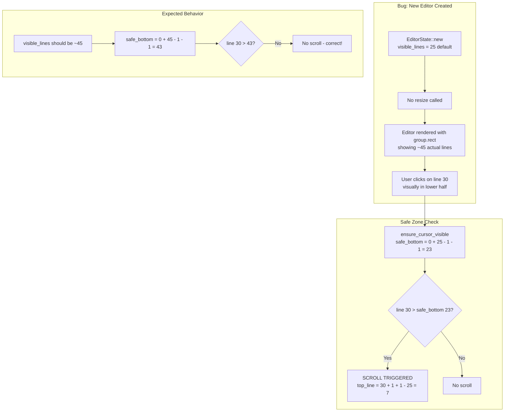

# Audit and publish project threads securely

## User

<attached_files>
```file://~/code/token-editor/docs/BUILDING_WITH_AI.md

```
```file://~/code/token-editor/website/src/pages/built-with-ai.astro

```
</attached_files>

we have now made a bunch of new stuff and done things but our threads are liekly not public see @docs/BUILDING_WITH_AI.md  and @website/src/pages/built-with-ai.astro  lets find all the threads in this project, sanity check that i havenot leaked any keys in any of them, and make them public, go through all of them and add any insights into the threads/ai docs and update the website with any notable things, investigate what needs to be doen and how (check cli flags and how to publish threads by id ertcv), find all the relevant threads for this project only, ensure we do not leak any sensitive info .

## Assistant

Let me start by gathering context: finding all threads for this project, checking how to publish them, and reviewing the current state of the docs.

**Tool Use:** `find_thread`

```json
{
  "limit": 50,
  "query": "repo:helgesverre/token"
}
```

**Tool Use:** `Read`

```json
{
  "path": "~/code/token-editor/docs/BUILDING_WITH_AI.md",
  "read_range": [
    447,
    600
  ]
}
```

**Tool Use:** `Read`

```json
{
  "path": "~/code/token-editor/docs/CHANGELOG.md"
}
```

**Tool Use:** `Bash`

```json
{
  "cmd": "amp --help 2>&1 | head -80"
}
```

## User

**Tool Result:** `toolu_vrtx_01MEaFFoMckGN9aQVXjtc5Wv`

```
{
  "hasMore": true,
  "threads": [
    {
      "id": "T-019c72f2-0c78-756c-ab6c-9e1eead1c641",
      "title": "Audit and publish project threads securely",
      "created": 1771454991482,
      "updatedAt": "2026-02-18T22:51:38.669Z",
      "messageCount": 2,
      "creatorUserID": "[redacted-user-id]"
    },
    {
      "id": "T-019c72ca-af84-70be-a5ad-2471b923288c",
      "title": "Astro image optimization for screenshot gallery",
      "created": 1771452411781,
      "updatedAt": "2026-02-18T22:45:44.062Z",
      "messageCount": 334,
      "creatorUserID": "[redacted-user-id]"
    },
    {
      "id": "T-019c7293-f967-73f6-b6b4-e3c2e946dfad",
      "title": "Character wrapping and bracket matching features",
      "created": 1771448826217,
      "updatedAt": "2026-02-18T22:11:35.873Z",
      "messageCount": 210,
      "creatorUserID": "[redacted-user-id]"
    },
    {
      "id": "T-019c7289-a2ff-762d-bbde-80da4e731a2d",
      "title": "Expanding website and screenshot infrastructure",
      "created": 1771448148735,
      "updatedAt": "2026-02-18T21:41:08.270Z",
      "messageCount": 336,
      "creatorUserID": "[redacted-user-id]"
    },
    {
      "id": "T-019c728c-6859-7749-be87-ff6ef98ee8c9",
      "title": "Remove pagination, add text-pretty, keyboard navigation",
      "created": 1771448330331,
      "updatedAt": "2026-02-18T21:25:40.814Z",
      "messageCount": 34,
      "creatorUserID": "[redacted-user-id]"
    },
    {
      "id": "T-019c7286-7786-71d9-8437-6021fb6646fc",
      "title": "Create LinkedIn blurb for AI building content",
      "created": 1771447941002,
      "updatedAt": "2026-02-18T20:54:35.868Z",
      "messageCount": 4,
      "creatorUserID": "[redacted-user-id]"
    },
    {
      "id": "T-019c726b-c3fd-72c8-be61-06cdc86e123b",
      "title": "Website pages and screenshots gallery ideas",
      "created": 1771446191103,
      "updatedAt": "2026-02-18T20:52:13.532Z",
      "messageCount": 146,
      "creatorUserID": "[redacted-user-id]"
    },
    {
      "id": "T-019c7265-e37a-712e-ab03-408801ac7cb9",
      "title": "Fix YAML tab overflow and duplicate scrollbars",
      "created": 1771445805947,
      "updatedAt": "2026-02-18T20:21:53.227Z",
      "messageCount": 42,
      "creatorUserID": "[redacted-user-id]"
    },
    {
      "id": "T-019c7228-2bde-77e1-bef0-ab2b38afb197",
      "title": "Mirror token editor status bar layout",
      "created": 1771441761247,
      "updatedAt": "2026-02-18T20:10:25.352Z",
      "messageCount": 240,
      "creatorUserID": "[redacted-user-id]"
    },
    {
      "id": "T-019c7212-52b0-77cb-bb71-f619c7e6ca43",
      "title": "Generate opengraph image with website branding",
      "created": 1771440329395,
      "updatedAt": "2026-02-18T19:20:06.553Z",
      "messageCount": 46,
      "creatorUserID": "[redacted-user-id]"
    },
    {
      "id": "T-019c720c-21c5-703a-8403-d5410ff72006",
      "title": "Research editor themes and suggest new ones",
      "created": 1771439923654,
      "updatedAt": "2026-02-18T19:07:50.168Z",
      "messageCount": 123,
      "creatorUserID": "[redacted-user-id]"
    },
    {
      "id": "T-019c7193-e8a5-7462-93e6-95cce054e7a8",
      "title": "Verify docs accuracy for keybindings themes",
      "created": 1771432044715,
      "updatedAt": "2026-02-18T17:25:03.451Z",
      "messageCount": 112,
      "creatorUserID": "[redacted-user-id]"
    },
    {
      "id": "T-019c7199-18ea-7381-ba20-66b1a9ae4898",
      "title": "Feasibility of compiling token to WASM",
      "created": 1771432384748,
      "updatedAt": "2026-02-18T16:39:32.142Z",
      "messageCount": 16,
      "creatorUserID": "[redacted-user-id]"
    },
    {
      "id": "T-019c7178-4034-778a-b7fd-660267f87de8",
      "title": "Fix Astro template curly brace syntax error",
      "created": 1771430232117,
      "updatedAt": "2026-02-18T16:26:08.911Z",
      "messageCount": 138,
      "creatorUserID": "[redacted-user-id]"
    },
    {
      "id": "T-019c7168-8448-7204-85b1-649d05d97a65",
      "title": "Hero section screenshot layout styling",
      "created": 1771429200971,
      "updatedAt": "2026-02-18T15:55:10.643Z",
      "messageCount": 113,
      "creatorUserID": "[redacted-user-id]"
    },
    {
      "id": "T-019c708b-a2bb-70f6-a62b-27f9005c95a8",
      "title": "Fix screenshot syntax highlighting and CSV viewer mode",
      "created": 1771414725309,
      "updatedAt": "2026-02-18T15:39:28.452Z",
      "messageCount": 310,
      "creatorUserID": "[redacted-user-id]"
    },
    {
      "id": "T-019c6fef-7f25-7798-b5b9-ac7bb537f73e",
      "title": "Reveal file in finder and copy path actions",
      "created": 1771404492583,
      "updatedAt": "2026-02-18T13:17:46.809Z",
      "messageCount": 100,
      "creatorUserID": "[redacted-user-id]"
    },
    {
      "id": "T-019c7065-499e-7489-a60e-dc4beea24ac2",
      "title": "Execute screenshot pipeline and homepage redesign plan",
      "created": 1771412242504,
      "updatedAt": "2026-02-18T10:57:22.862Z",
      "messageCount": 268,
      "creatorUserID": "[redacted-user-id]"
    },
    {
      "id": "T-019c6cf3-ecb6-72cb-8af0-d69f8d562206",
      "title": "Keybindings viewer broken in Astro v4",
      "created": 1771354451127,
      "updatedAt": "2026-02-18T10:56:33.391Z",
      "messageCount": 102,
      "creatorUserID": "[redacted-user-id]"
    },
    {
      "id": "T-019c6c9a-ee2a-74cc-81b3-c189a725500e",
      "title": "Add language support for sema lisp",
      "created": 1771348618796,
      "updatedAt": "2026-02-17T18:52:12.080Z",
      "messageCount": 122,
      "creatorUserID": "[redacted-user-id]"
    },
    {
      "id": "T-019c6cb5-43bb-7490-8480-0f76d1372a6f",
      "title": "Redesign v3 website to v4 with improved styling",
      "created": 1771350344637,
      "updatedAt": "2026-02-17T18:14:50.566Z",
      "messageCount": 178,
      "creatorUserID": "[redacted-user-id]"
    },
    {
      "id": "T-019ba0ed-dfdb-71cf-8dec-291fcca7a783",
      "title": "Update docs and tag patch release v0.3.15",
      "created": 1767931502556,
      "updatedAt": "2026-01-09T05:43:04.007Z",
      "messageCount": 150,
      "creatorUserID": "[redacted-user-id]"
    },
    {
      "id": "T-019ba01a-cde5-759e-ada6-216faba0e70b",
      "title": "Editor area not shrinking for terminal dock",
      "created": 1767917669862,
      "updatedAt": "2026-01-09T03:50:54.271Z",
      "messageCount": 248,
      "creatorUserID": "[redacted-user-id]"
    },
    {
      "id": "T-019b9f4b-9090-766e-b6f4-d494ada06e87",
      "title": "Fix markdown preview and dock scroll event leaking",
      "created": 1767904088210,
      "updatedAt": "2026-01-08T23:46:22.436Z",
      "messageCount": 176,
      "creatorUserID": "[redacted-user-id]"
    },
    {
      "id": "T-019b9efa-2028-711b-9fd0-9739b34832e6",
      "title": "Fix dock toggle, preview z-order, and editor area sizing",
      "created": 1767898751018,
      "updatedAt": "2026-01-08T20:03:08.678Z",
      "messageCount": 156,
      "creatorUserID": "[redacted-user-id]"
    },
    {
      "id": "T-019b9eec-b4b2-7369-a1fb-80c1a2dc4d69",
      "title": "Debug keybindings and refactor markdown preview rendering",
      "created": 1767897871539,
      "updatedAt": "2026-01-08T18:44:41.821Z",
      "messageCount": 98,
      "creatorUserID": "[redacted-user-id]"
    },
    {
      "id": "T-019b98ae-4cd9-752a-99ac-a07571944a38",
      "title": "Implement panel UI abstraction with commit review",
      "created": 1767793118437,
      "updatedAt": "2026-01-08T18:26:22.391Z",
      "messageCount": 324,
      "creatorUserID": "[redacted-user-id]"
    },
    {
      "id": "T-019b9d40-e7f7-760c-81ce-7dcc1796705e",
      "title": "Mouse event handling system refactoring complete",
      "created": 1767869835257,
      "updatedAt": "2026-01-08T13:37:54.881Z",
      "messageCount": 407,
      "creatorUserID": "[redacted-user-id]"
    },
    {
      "id": "T-019b9cbb-c371-7048-b075-b5b202595bfd",
      "title": "Review markdown preview and propose click handling abstraction",
      "created": 1767861109618,
      "updatedAt": "2026-01-08T09:42:31.468Z",
      "messageCount": 279,
      "creatorUserID": "[redacted-user-id]"
    },
    {
      "id": "T-019b98dd-95f9-742a-b1e3-654662ebd344",
      "title": "Extract reusable pane widget from preview",
      "created": 1767796217339,
      "updatedAt": "2026-01-07T15:04:52.565Z",
      "messageCount": 281,
      "creatorUserID": "[redacted-user-id]"
    },
    {
      "id": "T-019b98be-6e9a-745b-bb1d-3285f1ec1460",
      "title": "Continue markdown preview implementation",
      "created": 1767794175643,
      "updatedAt": "2026-01-07T14:20:44.688Z",
      "messageCount": 174,
      "creatorUserID": "[redacted-user-id]"
    },
    {
      "id": "T-019b9897-f550-7128-b305-40e861733e89",
      "title": "MSI bundle build fails with resource file error",
      "created": 1767791654231,
      "updatedAt": "2026-01-07T13:57:19.090Z",
      "messageCount": 226,
      "creatorUserID": "[redacted-user-id]"
    },
    {
      "id": "T-019b98aa-170b-726b-8380-c3c4b52a21d8",
      "title": "Redesign website inspired by modern dev tools",
      "created": 1767792842511,
      "updatedAt": "2026-01-07T13:47:56.670Z",
      "messageCount": 56,
      "creatorUserID": "[redacted-user-id]"
    },
    {
      "id": "T-019b9893-43cd-72ea-bcb4-9e0e1494e517",
      "title": "Implement markdown preview feature",
      "created": 1767791346643,
      "updatedAt": "2026-01-07T13:36:15.727Z",
      "messageCount": 296,
      "creatorUserID": "[redacted-user-id]"
    },
    {
      "id": "T-019b9856-c43e-75b8-b946-2a5011617081",
      "title": "Design docked panels UI abstraction for workspace",
      "created": 1767787381825,
      "updatedAt": "2026-01-07T13:14:56.614Z",
      "messageCount": 72,
      "creatorUserID": "[redacted-user-id]"
    },
    {
      "id": "T-019b9869-8a1a-75db-ad80-8aba2e37d6cb",
      "title": "Context menu abstraction spec and implementation",
      "created": 1767788612126,
      "updatedAt": "2026-01-07T12:39:40.127Z",
      "messageCount": 30,
      "creatorUserID": "[redacted-user-id]"
    },
    {
      "id": "T-019b95e4-e674-71af-8851-ac2c0f33d83a",
      "title": "Implement file dialogs feature",
      "created": 1767746365057,
      "updatedAt": "2026-01-07T01:43:45.446Z",
      "messageCount": 268,
      "creatorUserID": "[redacted-user-id]"
    },
    {
      "id": "T-019b95c6-b857-75cc-9cb8-d73f77125980",
      "title": "Combine open file and folder dialogs",
      "created": 1767744387165,
      "updatedAt": "2026-01-07T00:29:19.561Z",
      "messageCount": 18,
      "creatorUserID": "[redacted-user-id]"
    },
    {
      "id": "T-019b9547-b9f5-773a-b13a-0e0b381759c4",
      "title": "Cursor blink interval configuration across projects",
      "created": 1767736064506,
      "updatedAt": "2026-01-06T21:53:06.711Z",
      "messageCount": 8,
      "creatorUserID": "[redacted-user-id]"
    },
    {
      "id": "T-019b3c4f-763e-765e-a805-52778800fd5a",
      "title": "Check find implementation with oracle",
      "created": 1766243399233,
      "updatedAt": "2025-12-20T16:26:42.252Z",
      "messageCount": 102,
      "creatorUserID": "[redacted-user-id]"
    },
    {
      "id": "T-019b3c03-2f5c-774f-9cfb-7e322874dbb7",
      "title": "Performance optimization pass and profiling workflow documentation",
      "created": 1766238400349,
      "updatedAt": "2025-12-20T14:06:58.945Z",
      "messageCount": 56,
      "creatorUserID": "[redacted-user-id]"
    },
    {
      "id": "T-019b3bd7-8ecb-7506-b600-29c1acfe818d",
      "title": "Multi-split rendering optimization performance analysis",
      "created": 1766235541195,
      "updatedAt": "2025-12-20T13:40:25.761Z",
      "messageCount": 303,
      "creatorUserID": "[redacted-user-id]"
    },
    {
      "id": "T-019b3bbd-d4fd-75df-81a0-c94a5e693227",
      "title": "Multi-split rendering performance degradation investigation",
      "created": 1766233855229,
      "updatedAt": "2025-12-20T12:31:46.833Z",
      "messageCount": 231,
      "creatorUserID": "[redacted-user-id]"
    },
    {
      "id": "T-019b3bab-48e9-710e-9849-9bf4a2a94d24",
      "title": "Investigate benchmark gaps and optimize performance",
      "created": 1766232639721,
      "updatedAt": "2025-12-20T12:11:22.102Z",
      "messageCount": 92,
      "creatorUserID": "[redacted-user-id]"
    },
    {
      "id": "T-019b3b95-6389-74aa-a273-ddaa5fa57da1",
      "title": "Feature design for terminal panel and indent visualization",
      "created": 1766231204747,
      "updatedAt": "2025-12-20T11:48:44.410Z",
      "messageCount": 8,
      "creatorUserID": "[redacted-user-id]"
    },
    {
      "id": "T-019b3b86-0660-738e-b71a-768b93a1f404",
      "title": "Link to latest releases automatically",
      "created": 1766230197860,
      "updatedAt": "2025-12-20T11:45:13.727Z",
      "messageCount": 90,
      "creatorUserID": "[redacted-user-id]"
    },
    {
      "id": "T-019b3b6c-b844-7795-946e-9efe7d9023ae",
      "title": "Sketch macro system feature design doc",
      "created": 1766228539463,
      "updatedAt": "2025-12-20T11:17:23.873Z",
      "messageCount": 42,
      "creatorUserID": "[redacted-user-id]"
    },
    {
      "id": "T-019b3837-05a1-7408-91fd-e34c87b02d55",
      "title": "Go build release mode",
      "created": 1766174688677,
      "updatedAt": "2025-12-19T20:07:49.680Z",
      "messageCount": 64,
      "creatorUserID": "[redacted-user-id]"
    },
    {
      "id": "T-019b381d-d35f-7200-92b0-1aa8c548a507",
      "title": "Adapt blog post to MDX with humanized tone",
      "created": 1766173037417,
      "updatedAt": "2025-12-19T19:50:13.925Z",
      "messageCount": 44,
      "creatorUserID": "[redacted-user-id]"
    },
    {
      "id": "T-019b37f4-c1c2-7415-aa0e-e0591b1d09ae",
      "title": "Review new documentation for codebase accuracy",
      "created": 1766170345923,
      "updatedAt": "2025-12-19T19:25:09.351Z",
      "messageCount": 192,
      "creatorUserID": "[redacted-user-id]"
    }
  ]
}
```

**Tool Result:** `toolu_vrtx_011baaYWn8mgwGHnPjqq3WnM`

```
{
  "content": "[... omitted lines 1 to 446 ...]\n447: }\n448: ```\n449: \n450: **Threads in this feature**: T-019b2b7a, T-019b2bc5, T-019b2be7, T-019b2c40, T-019b2c8a, T-019b2ca6\n451: \n452: </details>\n453: \n454: <details>\n455: <summary><strong>HiDPI Display Scaling Fixes</strong> | <a href=\"https://ampcode.com/threads/T-019b2476-55a8-7058-9ba9-9360a9280c1b\">T-019b2476</a></summary>\n456: \n457: **Date**: 2025-12-16\n458: \n459: **Problem**: Tab area too small on Retina displays, debug overlay misaligned - scaling broken on HiDPI.\n460: \n461: **Root Cause Investigation**:\n462: \n463: - Metrics calculated in logical units but used as physical pixels\n464: - Font sizes not scaled by DPI factor\n465: - Inconsistent coordinate systems between rendering and hit testing\n466: \n467: **The Fix - ScaledMetrics**:\n468: \n469: ```rust\n470: pub struct ScaledMetrics {\n471:     pub tab_bar_height: u32,      // Pre-scaled by scale_factor\n472:     pub status_bar_height: u32,\n473:     pub line_height: u32,\n474:     pub char_width: u32,\n475:     // ... all measurements pre-scaled\n476: }\n477: ```\n478: \n479: **Key Insight**: Scale once at metrics creation, use physical pixels everywhere else.\n480: \n481: **Threads in this feature**: T-019b2476, T-019b26ca, T-019b26e5\n482: \n483: </details>\n484: \n485: <details>\n486: <summary><strong>Unified Text Editing System</strong> | <a href=\"https://ampcode.com/threads/T-019b3643-79af-7573-bb69-18dac832eb94\">T-019b3643</a></summary>\n487: \n488: **Date**: 2025-12-19\n489: \n490: **Problem**: 5 separate text editing implementations (main editor, command palette, go-to-line, find/replace, CSV cells) with duplicated logic and inconsistent behavior.\n491: \n492: **Solution**: Created unified `src/editable/` module with:\n493: \n494: ```rust\n495: // Core abstraction for all text editing\n496: pub struct EditableState<B: TextBuffer> {\n497:     pub buffer: B,                    // StringBuffer or RopeBuffer\n498:     pub cursors: Vec<Cursor>,\n499:     pub selections: Vec<Selection>,\n500:     pub constraints: EditConstraints,  // Context-specific rules\n501:     history: EditHistory,              // Undo/redo\n502: }\n503: \n504: // Unified message type\n505: pub enum TextEditMsg {\n506:     Move(MoveTarget),\n507:     MoveWithSelection(MoveTarget),\n508:     InsertChar(char),\n509:     DeleteBackward,\n510:     SelectAll,\n511:     Undo,\n512:     Redo,\n513:     // ...\n514: }\n515: ```\n516: \n517: **Key Insight**: Abstract buffer operations behind traits, share editing logic across all contexts.\n518: \n519: **Benefits**:\n520: - All modals now have full cursor navigation, selection, word movement\n521: - CSV cell editing has undo/redo, selection, clipboard support\n522: - Bridge pattern maps `TextEditMsg` to existing editor messages for gradual migration\n523: \n524: **Threads in this feature**: T-019b3643, T-019b3664, T-019b3671, T-019b367e, T-019b3688, T-019b368e, T-019b369a\n525: \n526: </details>\n527: \n528: ---\n529: \n530: ## Full Thread Reference (116 threads)\n531: \n532: All conversations are public. Sorted by timestamp (oldest first).\n533: \n534: | Date/Time        | Thread                                                                                          | Type     | Summary                                                                                                |\n535: | ---------------- | ----------------------------------------------------------------------------------------------- | -------- | ------------------------------------------------------------------------------------------------------ |\n536: | 2025-12-03 21:26 | [UI Reference Review](https://ampcode.com/threads/T-7b92a860-a2f7-4397-985c-73b2fa3e9582)       | Research | Generated [Technical Reference Document](EDITOR_UI_REFERENCE.md) based on research from Librarian |\n537: | 2025-12-04 09:56 | [Reference Doc Polish](https://ampcode.com/threads/T-750a0e44-2302-4b5e-8cdc-70b14c3f7930)      | Research | Continuing reference doc review and rewrite                                                            |\n538: | 2025-12-05 23:01 | [Status Bar Separators](https://ampcode.com/threads/T-ce8edd72-f084-4fba-8c86-276df333de96)     | Feature  | Design 1px separator segment for status bar                                                            |\n539: | 2025-12-06 00:10 | [Selection Arrow Keys](https://ampcode.com/threads/T-de4eaf86-9b34-489a-b6c8-e5c0154f1aff)      | Bugfix   | Fix arrow keys with selection behavior                                                                 |\n540: | 2025-12-06 01:27 | [Undo/Redo Gaps](https://ampcode.com/threads/T-519a8c9d-b94f-45e5-98e0-5bfc34c77cbf)            | Bugfix   | Fix undo/redo for selection delete, Cmd+Z handling                                                     |\n541: | 2025-12-06 03:03 | [Undo/Redo Continued](https://ampcode.com/threads/T-60e201bf-322a-4190-8671-3afe9ad7500e)       | Feature  | Split view phases 1-2, undo/redo completion                                                            |\n542: | 2025-12-06 03:25 | [Codebase Analysis](https://ampcode.com/threads/T-57a3ad00-4185-48a7-b12d-5ffb295c84ab)         | Setup    | Fresh codebase analysis and AGENTS.md update                                                           |\n543: | 2025-12-06 03:53 | [Perf Tooling Research](https://ampcode.com/threads/T-6ff7dc54-9991-41fe-b168-f328b499a904)     | Research | Performance profiling and benchmarking tooling                                                         |\n544: | 2025-12-06 04:08 | [Split View Phases 3-7](https://ampcode.com/threads/T-29b1dd08-eee1-44fb-abd5-eb982d6bcd52)     | Feature  | Implement split view AppModel, handlers, rendering                                                     |\n545: | 2025-12-06 04:17 | [Keymap Design](https://ampcode.com/threads/T-35b11d40-96b0-4177-9c75-4c723dfd8f80)             | Research | Research configurable keyboard mapping systems                                                         |\n546: | 2025-12-06 04:17 | [Test Infrastructure](https://ampcode.com/threads/T-39bdb354-08b2-4e0a-973d-75aeecab8a89)       | Research | Review test patterns, identify improvements                                                            |\n547: | 2025-12-06 04:17 | [Rendering Performance](https://ampcode.com/threads/T-4272a15a-a0e8-4a74-9870-d793d36c33a0)     | Research | Analyze fontdue/softbuffer rendering hot paths                                                         |\n548: | 2025-12-06 04:17 | [DX Improvements](https://ampcode.com/threads/T-88cd73c6-0f23-461e-ae99-48b1d9908c0e)           | Research | Developer experience improvement opportunities                                                         |\n549: | 2025-12-06 04:17 | [Perf Infrastructure](https://ampcode.com/threads/T-9ff4cbc0-231e-4cbb-8abb-867de74409c4)       | Research | Audit existing PerfStats and monitoring                                                                |\n550: | 2025-12-06 04:17 | [Text Hot Paths](https://ampcode.com/threads/T-ac8b817c-ee1c-49ea-af20-4fd2766ad531)            | Research | Identify text operations needing benchmarks                                                            |\n551: | 2025-12-06 04:25 | [Fix update.rs](https://ampcode.com/threads/T-4d426fd5-17f4-48a1-8c5a-6d72f57536c2)             | Refactor | Fix compilation after model accessor change                                                            |\n552: | 2025-12-06 04:33 | [Fix main.rs](https://ampcode.com/threads/T-34c36886-50c9-4fc3-a97a-304bb6ba6bf4)               | Refactor | Fix compilation after model accessor change                                                            |\n553: | 2025-12-06 04:40 | [Fix Tests](https://ampcode.com/threads/T-4948f549-c762-4fe3-b1b6-65219754ffb8)                 | Refactor | Fix test files after model accessor change                                                             |\n554: | 2025-12-06 06:17 | [Feedback Update](https://ampcode.com/threads/T-778bf91f-b35b-4e11-a895-4ccc9a28feed)           | Docs     | Update FEEDBACK.md with current progress                                                               |\n555: | 2025-12-06 06:18 | [Multi-Group Render](https://ampcode.com/threads/T-f7453e71-4877-49df-b174-d3ec2534f601)        | Feature  | Refactor rendering for split view groups                                                               |\n556: | 2025-12-06 08:08 | [Split View Polish](https://ampcode.com/threads/T-e982211e-9ad0-465b-b65e-288965968077)         | Feature  | Split view edge cases and layout tests                                                                 |\n557: | 2025-12-06 10:26 | [GUI Library Review](https://ampcode.com/threads/T-82acac63-89cb-4bb0-bad7-bcc4f76af3cd)        | Research | Review areweguiyet.com, abstraction layer design                                                       |\n558: | 2025-12-06 11:17 | [Bugfix Session](https://ampcode.com/threads/T-803561f4-2bd4-4545-9e0a-ff08d3e15e04)            | Bugfix   | Selection bugs, delete line, duplicate line                                                            |\n559: | 2025-12-06 11:27 | [Codebase Reorg](https://ampcode.com/threads/T-5d9034ac-734a-4edd-9060-e28ad9572736)            | Docs     | Roadmap cleanup, changelog, organization plan                                                          |\n560: | 2025-12-06 12:39 | [Expand/Shrink Select](https://ampcode.com/threads/T-568febc8-2f67-408d-b7ee-32dc212e88f6)      | Feature  | Implement expand/shrink selection with history                                                         |\n561: | 2025-12-06 15:04 | [Multi-Cursor Movement](https://ampcode.com/threads/T-d4c75d42-c0c1-4746-a609-593bff88db6d)     | Feature  | All cursors move together, deduplicate on collide                                                      |\n562: | 2025-12-06 16:14 | [Selection Gaps](https://ampcode.com/threads/T-6c1b5841-b5f3-4936-b875-338fd101a179)            | Feature  | SelectWord/Line/All with multi-cursor                                                                  |\n563: | 2025-12-06 19:23 | [Selection Gaps Final](https://ampcode.com/threads/T-e751be48-ab56-4b90-a196-d5df892d955b)      | Feature  | Merge overlapping selections, final polish                                                             |\n564: | 2025-12-06 21:39 | [Clean mod.rs](https://ampcode.com/threads/T-ce688bab-2373-4b8e-bf65-436948e19853)              | Refactor | Remove update_layout and helpers from mod.rs                                                           |\n565: | 2025-12-06 21:43 | [Extract Document Helpers](https://ampcode.com/threads/T-5f9d93ca-4b90-4ca2-ba57-0925802c538c)  | Refactor | Extract update_document and undo/redo helpers                                                          |\n566: | 2025-12-06 21:48 | [Extract editor.rs](https://ampcode.com/threads/T-0277253e-020d-4640-9edf-792c62d7aed3)         | Refactor | Extract update_editor and helpers to editor.rs                                                         |\n567: | 2025-12-06 21:53 | [Extract view.rs](https://ampcode.com/threads/T-ed799761-6162-4aba-9890-51be6d4af3d2)           | Refactor | Extract Renderer and rendering code to view.rs                                                         |\n568: | 2025-12-06 22:02 | [Extract perf.rs](https://ampcode.com/threads/T-ac15e777-123b-4dee-900d-aff8492dad6a)           | Refactor | Extract PerfStats and render_perf_overlay to perf.rs                                                   |\n569: | 2025-12-06 22:06 | [Extract input.rs](https://ampcode.com/threads/T-0f78844c-deb2-46f5-b35b-f8f55e3122d5)          | Refactor | Extract handle_key to input.rs                                                                         |\n570: | 2025-12-06 22:09 | [Extract app.rs](https://ampcode.com/threads/T-072af2cb-28ed-4086-8bc2-f3b5c5a74ab7)            | Refactor | Extract App struct and ApplicationHandler to app.rs                                                    |\n571: | 2025-12-07 03:05 | [Code Analysis](https://ampcode.com/threads/T-1d4cb53e-ed6c-4df6-ae7c-47d1632af2f5)             | Research | Code analysis session                                                                                  |\n572: | 2025-12-07 05:35 | [Zed Rendering Research](https://ampcode.com/threads/T-c764b2bc-4b0b-4a2a-8c65-c11460405741)    | Research | Research Zed's rendering pipeline and GPUI architecture                                                |\n573: | 2025-12-07 06:03 | [Debug Tracing Research](https://ampcode.com/threads/T-c312fd74-c321-4e15-bce8-e01a2c1a5813)    | Research | Research debug tracing patterns from Zed/Helix/Lapce                                                   |\n574: | 2025-12-07 06:10 | [Refactor Planning](https://ampcode.com/threads/T-da41379b-072f-4d46-a1b4-60d13467e7b4)         | Research | EditorState API refactor planning                                                                      |\n575: | 2025-12-07 06:28 | [OVERVIEW.md Creation](https://ampcode.com/threads/T-aceb9dee-98e5-4caa-a443-8887376fe169)      | Docs     | Created OVERVIEW.md documentation                                                                      |\n576: | 2025-12-07 06:46 | [Saturating Add Q&A](https://ampcode.com/threads/T-1b5a1a14-682d-4336-892e-136c9655e991)        | Research | Question about saturating_add usage                                                                    |\n577: | 2025-12-07 07:24 | [Fix document.rs Cursors](https://ampcode.com/threads/T-3fbd1bfd-099a-4fe7-aaee-4d4ba8e0ca01)   | Bugfix   | Fix cursor calls in update/document.rs                                                                 |\n578: | 2025-12-07 07:24 | [Fix main.rs Cursors](https://ampcode.com/threads/T-56fe4a38-f638-448a-82d3-34fbb36750e5)       | Bugfix   | Fix cursor calls in main.rs                                                                            |\n579: | 2025-12-07 07:24 | [Fix Model Cursors](https://ampcode.com/threads/T-5f24afb8-5458-4e89-944e-7307ad791b0e)         | Bugfix   | Fix cursor calls in model/, view.rs, app.rs                                                            |\n580: | 2025-12-07 07:24 | [Fix editor.rs Cursors](https://ampcode.com/threads/T-c46bc701-e073-4bcf-b48e-5a1269e80015)     | Bugfix   | Fix cursor calls in update/editor.rs                                                                   |\n581: | 2025-12-07 07:24 | [Fix input.rs Cursors](https://ampcode.com/threads/T-e937d255-b14c-4c09-bef2-f791dfdc0b6f)      | Bugfix   | Fix cursor calls in input.rs                                                                           |\n582: | 2025-12-07 08:34 | [Indent/Unindent Fix](https://ampcode.com/threads/T-9003f81f-0d48-4502-bf3f-a630929eb7d3)       | Bugfix   | Fix indent/unindent operations for multi-cursor                                                        |\n583: | 2025-12-07 09:01 | [Extract editor_area Tests](https://ampcode.com/threads/T-03d86baf-afcc-45f0-b0d2-9a8b39f3b3d3) | Refactor | Extract editor_area.rs tests                                                                           |\n584: | 2025-12-07 09:01 | [Analyze main.rs Tests](https://ampcode.com/threads/T-55a92c93-b66b-4adf-9183-6fd138d93028)     | Research | Analyze main.rs tests                                                                                  |\n585: | 2025-12-07 09:01 | [Extract theme.rs Tests](https://ampcode.com/threads/T-cc1f1709-0fc1-438d-bf17-d6a189fbff5a)    | Refactor | Extract theme.rs tests                                                                                 |\n586: | 2025-12-07 09:01 | [Extract overlay.rs Tests](https://ampcode.com/threads/T-f37a7ab6-b215-48d4-96a5-b4cde8cec3bf)  | Refactor | Extract overlay.rs tests                                                                               |\n587: | 2025-12-07 10:00 | [Cross Compilation](https://ampcode.com/threads/T-c07e689b-8ec7-437e-ae97-6837a90e0893)         | Setup    | Setup cross compilation locally                                                                        |\n588: | 2025-12-07 10:35 | [Duplication Analysis](https://ampcode.com/threads/T-e2bf6523-008d-498a-90b5-e8c0f733c3cf)      | Bugfix   | Multi-line duplication cursor offset analysis                                                          |\n589: | 2025-12-07 10:42 | [Renderer Benchmark](https://ampcode.com/threads/T-4d6395e5-38be-4dd2-9c68-bb9b0e727c72)        | Research | Create pure renderer for benchmarking view.rs                                                          |\n590: | 2025-12-07 11:26 | [Unified PerfStats](https://ampcode.com/threads/T-612ca421-647d-4483-b4c6-92e38527d0a1)         | Feature  | Create unified PerfStats (no-op in release)                                                            |\n591: | 2025-12-07 12:05 | [DeleteBackward Fix](https://ampcode.com/threads/T-7c00a046-9808-407e-b176-807270a6c15e)        | Bugfix   | Fix DeleteBackward multi-cursor newline adjustment                                                     |\n592: | 2025-12-07 22:41 | [Tracing Instrumentation](https://ampcode.com/threads/T-653bca39-d3a2-4296-a101-8aa3b5557bbe)   | Feature  | Implement tracing/logging instrumentation                                                              |\n593: | 2025-12-07 23:01 | [One-Pager Website](https://ampcode.com/threads/T-74f6c6a1-4935-4a89-a1c7-2e7df37eef1f)         | Feature  | Create minimal HTML landing page                                                                       |\n594: | 2025-12-08 10:03 | [Frame Abstraction](https://ampcode.com/threads/T-b63f7909-6744-49cd-a978-0f7f2e9c79f4)         | Refactor | Migrate render code to Frame/TextPainter abstractions                                                  |\n595: | 2025-12-08 13:36 | [README Rewrite](https://ampcode.com/threads/T-5dacbe13-29ee-4035-a383-bc43630d7f92)            | Docs     | Rewrite README with AI development guide                                                               |\n596: | 2025-12-09 09:55 | [GUI Phase 2](https://ampcode.com/threads/T-019b025e-956c-766f-b7b1-9b98280e99cd)               | Refactor | Widget extraction and geometry centralization                                                          |\n597: | 2025-12-09 10:22 | [Modal/Focus System](https://ampcode.com/threads/T-019b02a2-7bee-7428-ac95-c814a48d1182)        | Feature  | Phase 3 GUI cleanup - modal focus system                                                               |\n598: | 2025-12-09 11:02 | [Modal Keybindings](https://ampcode.com/threads/T-019b02c5-f407-7489-a431-b25e60556bb3)         | Feature  | Modal input handling and keybinding refinements                                                        |\n599: | 2025-12-09 12:19 | [Keymapping Plan](https://ampcode.com/threads/T-019b0309-e9b1-77dc-a891-243357a55774)           | Feature  | Plan keymapping file system implementation                                                             |\n600: | 2025-12-09 12:43 | [Keymapping Phases 1-5](https://ampcode.com/threads/T-019b0323-2114-7077-b10c-d1814a7c9fcf)     | Feature  | Implement keymapping system phases 1-5                                                                 |\n[... omitted lines 601 to 666 ...]",
  "absolutePath": "~/code/token-editor/docs/BUILDING_WITH_AI.md"
}
```

**Tool Result:** `toolu_vrtx_01AnGMBapqHrfJvxPobV3Fjw`

```
{
  "content": "1: # Changelog\n2: \n3: All notable changes to rust-editor are documented in this file.\n4: \n5: ---\n6: \n7: ## v0.3.17 - 2026-02-18\n8: \n9: ### Added\n10: - Themes: 5 new builtin themes — Dracula, Catppuccin Mocha, Nord, Tokyo Night, Gruvbox Dark\n11: - Syntax: Added sema-lisp syntax sample file\n12: - Editing: Auto-surround selection — select text and type `(`, `[`, `{`, `\"`, `'`, or `` ` `` to wrap it (e.g., `hello` → `(hello)`). Works with multi-cursor.\n13: - Editing: Matching bracket highlighting — when cursor is adjacent to `()`, `[]`, or `{}`, both brackets are highlighted with a colored background.\n14: - Config: `auto_surround` setting to enable/disable auto-surround behavior (default: `true`)\n15: - Config: `bracket_matching` setting to enable/disable bracket match highlighting (default: `true`)\n16: - Themes: `bracket_match_background` editor color for customizing bracket highlight appearance\n17: \n18: ---\n19: \n20: ## v0.3.15 - 2026-01-09\n21: \n22: ### Added\n23: - Preview: HTML file preview support. Opening preview on `.html` files now displays the rendered HTML in the webview pane, reusing the existing markdown preview infrastructure.\n24: - Preview: Local resource loading for HTML preview. Images, CSS, and JS files are now served from the document's directory via a custom `token://` protocol handler.\n25: - Preview: Preview now updates to show the new file when switching tabs (if the new file supports preview), instead of closing.\n26: - API: Added `LanguageId::supports_preview()` method to check if a file type supports live preview.\n27: - API: Added `content_to_preview_html()` function that handles both Markdown and HTML content.\n28: \n29: ---\n30: \n31: ## v0.3.14 - 2026-01-09\n32: \n33: ### Added\n34: - Docs: Updated developer OVERVIEW and archived obsolete docs to reflect recent refactors and module moves.\n35: - Tests: Comprehensive damage computation tests added for redraw/damage logic.\n36: \n37: ### Fixed\n38: - Layout: Editor viewport now correctly shrinks to accommodate dock panels (bottom/right). Fixed issue where dock panels would obscure part of the editor area because the logical viewport didn't account for dock sizes.\n39: - Layout: Viewport dimensions now recalculated when dock visibility or size changes.\n40: - Preview: Fixed dual rendering issue where both native markdown and webview were drawn. Native rendering is now properly disabled when webview is active.\n41: - Preview: Fixed webview misalignment by correctly converting physical pixel coordinates to logical points with proper Y-axis flipping for macOS.\n42: - Scroll: Scroll events over dock panels and preview panes are now properly consumed instead of bleeding into the editor.\n43: - Rendering: Minor fixes to selection/cursor rendering behavior related to the cursor-blink optimization and partial redraws.\n44: - Sidebar: Fixed syntax highlighting not triggering when opening files via sidebar double-click. Commands from update() calls in mouse handlers are now properly propagated.\n45: \n46: ### Changed\n47: - Refactor (mouse): Unified mouse event handling with new hit-test system in `src/view/hit_test.rs` and centralized dispatch in `src/runtime/mouse.rs`. Replaces ad-hoc if/else chains with explicit `HitTarget` enum and priority-ordered hit-testing.\n48: - Refactor (app): Introduced specific redraw helpers and tighter damage accumulation to reduce unnecessary full redraws; clearer separation between damage computation and command processing.\n49: - Refactor (layout): Added `redraw_editor`-style helpers to limit redraw scope when layout changes are localized.\n50: - Refactor (ui): Optimized cursor-blink related redraw behavior to prevent selection flicker and avoid unnecessary redraws of unrelated regions.\n51: - Cleanup: Removed dead code from view module (`is_in_tab_bar`, `is_in_modal`, unused Renderer getters, wrapper functions superseded by ViewportGeometry).\n52: \n53: ---\n54: \n55: ## v0.3.13 - 2026-01-07\n56: \n57: ### Fixed - CSV Cell Editing\n58: \n59: **Column Truncation:**\n60: - Fixed column truncation issue during CSV cell editing\n61: - Cells now properly handle content that exceeds initial column width\n62: - No data loss when editing longer values\n63: \n64: **Horizontal Scrolling:**\n65: - Added horizontal scroll support for CSV cell editing\n66: - Long cell content now scrollable within the edit field\n67: - Improved UX for editing cells with long text values\n68: \n69: **Log File Discovery:**\n70: - Fixed log file discovery to find most recent dated log file\n71: - Improved config path resolution for logging\n72: \n73: ### Added - Command Palette Enhancements\n74: \n75: **New Commands:**\n76: - Added \"Open Folder...\" command to open workspace directories\n77: - Added \"Quit\" command (⌘Q) to close the application\n78: - Added \"Toggle Performance Overlay\" command (F2) - debug builds only\n79: - Added \"Toggle Debug Overlay\" command (F8) - debug builds only\n80: \n81: **Implementation:**\n82: - Added `Cmd::Quit` for proper application exit flow\n83: - Debug commands use conditional compilation (`#[cfg(debug_assertions)]`)\n84: - Added `DEBUG_COMMANDS` array for debug-only command definitions\n85: \n86: ### Added - Configuration and Command System\n87: \n88: **Configuration Reload:**\n89: - Implemented `ReloadConfiguration` command for hot-reloading config without restart\n90: - Command palette now includes \"Reload Configuration\" command\n91: - Allows changes to config.yaml and keymap.yaml to take effect immediately\n92: \n93: **Application Commands:**\n94: - Added `ApplicationCommand` enum for app-level operations (quit, reload config)\n95: - Added `WorkspaceCommand` enum for workspace operations (toggle sidebar, refresh, etc.)\n96: - Unified command structure with `Cmd::Application` and `Cmd::Workspace` variants\n97: \n98: **Theme Picker Enhancements:**\n99: - Implemented theme preview with live updates\n100: - Theme changes are applied immediately while browsing\n101: - Restore original theme on cancel (Escape)\n102: - Confirm theme selection with Enter\n103: - Updated theme picker tests for new preview/restore API\n104: \n105: **Configuration Integration:**\n106: - Cursor blink interval now configurable via `editor.cursor_blink_interval_ms` in config.yaml\n107: - Performance overlay toggle now configurable via `editor.show_perf_overlay` in config.yaml\n108: - Runtime respects user configuration preferences\n109: \n110: ### Fixed - Rendering Bugs\n111: \n112: **Selection Highlights Disappearing:**\n113: - Selection highlights were disappearing after ~1 second due to cursor blink optimization\n114: - `render_cursor_lines_only()` now properly renders selection highlights and rectangle selections\n115: - Cursor blink interval changed from 500ms to 600ms\n116: \n117: **CSV Cell Editor Cursor:**\n118: - Fixed cursor appearing at top of editor instead of inside cell when editing CSV\n119: - Skip cursor-lines-only optimization for CSV mode (falls back to full render)\n120: \n121: ### Changed - Build System\n122: \n123: **Cargo.toml Enhancements:**\n124: - Added package metadata: authors, readme, keywords, categories, exclude\n125: - Added `default-run = \"token\"` to handle multiple binaries\n126: - New build profiles:\n127:   - `dev`: Fast compile with `debug = \"line-tables-only\"`, no debug info for deps\n128:   - `debugging`: Full debug info for debuggers\n129:   - `release`: Thin LTO, `panic = \"abort\"` for local testing\n130:   - `dist`: Fat LTO, `codegen-units = 1`, stripped for distribution\n131:   - `profiling`: Debug symbols, no LTO for flamegraph/samply\n132: \n133: **Makefile Updates:**\n134: - Added `make dist` and `make debugging` targets\n135: - Cross-compilation targets now use `dist` profile for maximum optimization\n136: - `make bundle-macos` uses `dist` profile for smallest binary\n137: - Updated help text\n138: \n139: ---\n140: \n141: ## v0.3.12 - 2025-12-20\n142: \n143: ### Added - Find/Replace Implementation\n144: \n145: Complete implementation of the Find/Replace modal (Cmd+F):\n146: \n147: **Core Search Functions:**\n148: - `find_all_occurrences_with_options()` with case sensitivity support\n149: - `find_next_occurrence_with_options()` for forward search with wrapping\n150: - `find_prev_occurrence_with_options()` for backward search with wrapping\n151: - Full Unicode support (Greek, Japanese, emoji, accented characters)\n152: - Overlapping match detection\n153: \n154: **New Modal Messages:**\n155: - `ToggleFindReplaceField` - Tab to switch between query/replace fields\n156: - `ToggleFindReplaceCaseSensitive` - Toggle case-sensitive search\n157: - `FindNext` / `FindPrevious` - Navigate through matches\n158: - `ReplaceAndFindNext` - Replace current match and find next\n159: - `ReplaceAll` - Replace all occurrences at once\n160: \n161: **UX Improvements:**\n162: - Query persists when reopening Cmd+F (like command palette)\n163: - Transient messages show \"No matches found\" or \"Replaced N occurrences\"\n164: - Selection highlights the current match\n165: - Cursor scrolls to ensure match is visible\n166: \n167: **Test Coverage:**\n168: - 25+ new tests for find functionality\n169: - Case sensitivity tests\n170: - Unicode edge cases (emoji, CJK, Greek letters)\n171: - Overlapping pattern matching\n172: - Empty document and needle handling\n173: \n174: ---\n175: \n176: ## v0.3.11 - 2025-12-20\n177: \n178: ### Fixed - Event Loop Performance\n179: \n180: Critical fix for the event loop spinning issue that caused ~7 FPS in multi-split scenarios:\n181: \n182: **Root Cause:** `ControlFlow::Poll` was spinning the event loop constantly at ~100% CPU even when idle.\n183: \n184: **Fix:** Changed to `ControlFlow::WaitUntil` in `src/runtime/app.rs`:\n185: - Event loop now sleeps until the next cursor blink timer (500ms)\n186: - Wakes immediately for user input, async messages, or file system changes\n187: - Idle CPU usage dropped from ~100% to ~0%\n188: - Multi-split FPS improved from ~7 to 60 (VSync limited)\n189: \n190: **Performance Profile (30-second live session):**\n191: | Category | Time |\n192: |----------|------|\n193: | Idle/Waiting | 77.6% |\n194: | Event Handling | 21.5% |\n195: | Rendering | ~0.9% |\n196: \n197: ### Fixed - Debug Overlay HiDPI Scaling\n198: \n199: Fixed hard-coded pixel values in the performance overlay (`src/runtime/perf.rs`) that didn't scale on Retina displays:\n200: \n201: - Overlay dimensions now scale based on `line_height` ratio\n202: - Chart widths derived from approximate character width\n203: - Stacked bar calculation fixed with `saturating_sub` to prevent overflow panic\n204: \n205: ### Added - Profiling Documentation\n206: \n207: Enhanced [docs/profiling-guide.md](profiling-guide.md) with recommended workflow:\n208: \n209: - Step-by-step process: headless benchmark → sample command → Instruments\n210: - Interpreting `sample` output (mach_msg2_trap, CFRunLoop patterns)\n211: - Common issues & solutions troubleshooting table\n212: - Example healthy profile output\n213: \n214: ### Changed\n215: \n216: - Archived detailed allocation analysis to [performance-analysis-v1.md](archived/performance-analysis-v1.md)\n217: - Created new [performance-analysis.md](archived/performance-analysis.md) with summary of all optimizations\n218: \n219: ---\n220: \n221: ## v0.3.10 - 2025-12-19\n222: \n223: ### Added - File System Watcher & New Languages\n224: \n225: **Workspace File Watching:**\n226: - Integrated `notify` crate for real-time file system monitoring\n227: - `FileSystemChange` event for workspace updates\n228: - Automatic refresh when files change externally\n229: \n230: **New Language Support:**\n231: - **Scheme** - tree-sitter-scheme parser and highlighting\n232: - **INI** - tree-sitter-ini parser and highlighting  \n233: - **XML** - tree-sitter-xml parser and highlighting\n234: \n235: **File Operations:**\n236: - Support for opening files via sidebar\n237: - Support for creating new files\n238: - `Document::new_with_path` constructor with comprehensive tests\n239: \n240: **Theme Improvements:**\n241: - Added CSV highlighting colors to all themes\n242: - Restructured CSV theme initialization\n243: \n244: **Documentation:**\n245: - Added comprehensive documentation suite\n246: - Updated workspace feature documentation\n247: - Added workspace performance benchmarks and testing guide\n248: \n249: ### Changed\n250: \n[... omitted lines 251 to 1304 ...]\n1305: - Added 47 layout tests, 6 multi-cursor undo tests, selection tests\n1306: \n1307: ---\n1308: \n1309: ## 2025-12-06\n1310: \n1311: ### Added - Caret Count in Status Bar\n1312: \n1313: - Shows \"X carets\" segment when multiple cursors are active\n1314: - New `SegmentId::CaretCount` variant\n1315: - Auto-syncs via `sync_status_bar()` when cursor count changes\n1316: \n1317: ### Fixed - Multi-Cursor Click Modifier\n1318: \n1319: - Changed from Cmd+Click to Option+Click for adding/removing cursors\n1320: - Matches standard macOS editor conventions\n1321: \n1322: ### Added - Click+Drag Selection\n1323: \n1324: - Standard click-and-drag text selection with left mouse button\n1325: - `left_mouse_down` state tracking in App struct\n1326: - CursorMoved handler extends selection while dragging\n1327: - Reuses existing `ExtendSelectionToPosition` message\n1328: \n1329: ### Added - Delete Line Command\n1330: \n1331: - `DocumentMsg::DeleteLine` for deleting entire current line\n1332: - Cmd+Backspace keybinding (Ctrl+Backspace on non-Mac)\n1333: - Smart cursor positioning after delete:\n1334:   - First/middle line: stays on same line number\n1335:   - Last line: moves to end of previous line\n1336:   - Empty line after trailing newline: moves up\n1337: - Full undo/redo support\n1338: - 8 new tests in `tests/text_editing.rs`\n1339: \n1340: ### Added - Duplicate Line/Selection (Cmd+D)\n1341: \n1342: - `DocumentMsg::Duplicate` for duplicating current line or selection\n1343: - No selection: duplicates entire line below cursor\n1344: - With selection: duplicates selected text in place\n1345: - Full undo/redo support\n1346: - 4 new tests in `tests/text_editing.rs`\n1347: \n1348: ### Added - Atomic Replace for Selection Editing\n1349: \n1350: - `EditOperation::Replace` variant for atomic undo of selection replacement\n1351: - When typing over selection, undo restores both deleted text and removes inserted text in one operation\n1352: - Prevents \"two-step undo\" bug where user had to undo twice\n1353: \n1354: ### Fixed - Undo/Redo Keybindings on macOS\n1355: \n1356: - Cmd+Z now properly triggers Undo (was inserting 'z')\n1357: - Cmd+Shift+Z now properly triggers Redo\n1358: - Fixed by adding `logo` modifier support alongside `ctrl`\n1359: \n1360: ### Fixed - Overflow Panics in Edge Cases\n1361: \n1362: - `move_cursor_down()`: Fixed overflow when `visible_lines` is 0\n1363: - `ensure_cursor_visible_with_mode()`: Fixed horizontal scroll overflow\n1364: - `StatusBarLayout`: Fixed separator position overflow\n1365: - All arithmetic now uses `saturating_add`/`saturating_sub`\n1366: \n1367: ### Added - Expanded Monkey Tests\n1368: \n1369: - 12 new window resize edge case tests in `tests/monkey_tests.rs`:\n1370:   - Maximum u32 dimensions\n1371:   - Very wide/narrow and very tall/narrow\n1372:   - Resize then cursor movement/scrolling\n1373:   - Oscillating zero/non-zero sizes\n1374:   - Resize with active selection\n1375:   - Cursor beyond viewport after resize\n1376:   - Powers of two dimensions\n1377:   - Interleaved resize and text operations\n1378:   - Status bar edge (height = line_height)\n1379: \n1380: ### Added - Status Bar Click Capture\n1381: \n1382: - Clicks on status bar no longer propagate to editor\n1383: - `Renderer::is_in_status_bar(y)` method for hit testing\n1384: \n1385: ### Changed\n1386: \n1387: - Test count: 246 (was 227)\n1388: - Added 8 delete line tests, 4 duplicate tests, 12 resize tests\n1389: \n1390: ---\n1391: \n1392: ## 2025-12-06\n1393: \n1394: ### Added - Status Bar System\n1395: \n1396: - Structured, segment-based status bar per `docs/feature/STATUS_BAR.md`\n1397: - `StatusBar`, `StatusSegment`, `SegmentId`, `SegmentContent` types\n1398: - `sync_status_bar()` auto-updates segments from model state\n1399: - `StatusBarLayout` for rendering with separator positions\n1400: - Transient messages with auto-expiry (`TransientMessage`)\n1401: - Left/right segment alignment with separators\n1402: - 47 new status bar tests (`tests/status_bar.rs`)\n1403: \n1404: ### Added - Overlay System\n1405: \n1406: - Reusable overlay rendering module (`src/overlay.rs`)\n1407: - `OverlayAnchor` enum (TopLeft, TopRight, BottomLeft, BottomRight, Center)\n1408: - `OverlayConfig` with builder pattern for configuration\n1409: - `render_overlay_background()` with alpha blending\n1410: - `render_overlay_border()` for optional 1px borders\n1411: - `blend_pixel()` for ARGB alpha compositing\n1412: - 7 overlay unit tests\n1413: \n1414: ### Added - Overlay Theme Integration\n1415: \n1416: - `OverlayTheme` with themed colors: background, foreground, highlight, warning, error, border\n1417: - `OverlayThemeData` for YAML parsing (all fields optional for backward compatibility)\n1418: - Perf overlay now uses theme colors instead of hardcoded values\n1419: - Optional border rendering when theme specifies border color\n1420: - Added overlay sections to all 4 theme files\n1421: \n1422: ### Fixed\n1423: \n1424: - Status bar separator lines now span full height (was inset 4px)\n1425: - Direction-aware scroll reveal with `ScrollRevealMode` enum\n1426: - `ensure_cursor_visible_with_mode()` primitive for scroll behavior\n1427: - Arrow key viewport snap-back behavior\n1428: - MoveCursor now properly calls ensure_cursor_visible()\n1429: - Directional reveal: Up→TopAligned, Down→BottomAligned for natural UX\n1430: \n1431: ### Changed\n1432: \n1433: - Test count: 227 (was 185)\n1434: - Added 11 scroll reveal tests, 47 status bar tests, 7 overlay tests\n1435: \n1436: ---\n1437: \n1438: ## 2025-12-05\n1439: \n1440: ### Added - Selection & Multi-Cursor (Phase 7)\n1441: \n1442: #### Phase 7.1: Basic Selection\n1443: \n1444: - Theme support for `selection_background` and `secondary_cursor_color`\n1445: - ~25 new EditorMsg variants for selection/multi-cursor operations\n1446: - Shift+Arrow extends selection, Shift+Home/End, Shift+Click\n1447: - Selection rendering with blue highlight\n1448: - Escape clears selection or collapses multi-cursor\n1449: \n1450: #### Phase 7.2: Selection Editing\n1451: \n1452: - `delete_selection()` helper for selection range deletion\n1453: - InsertChar/InsertNewline deletes selection before inserting\n1454: - DeleteBackward/DeleteForward deletes selection instead of single char\n1455: \n1456: #### Phase 7.3: Word & Line Selection\n1457: \n1458: - SelectWord handler using `char_type` for word boundaries\n1459: - SelectLine handler (selects entire line including newline)\n1460: - Double-click selects word, triple-click selects line\n1461: - Click count tracking with wrap at 4\n1462: \n1463: #### Phase 7.4: Multi-Cursor Basics\n1464: \n1465: - `toggle_cursor_at()` in EditorState\n1466: - ToggleCursorAtPosition handler for Cmd+Click\n1467: - Multi-cursor rendering (primary=white, secondary=semi-transparent)\n1468: \n1469: #### Phase 7.5: Multi-Cursor Editing\n1470: \n1471: - `cursors_in_reverse_order()` helper\n1472: - InsertChar/InsertNewline at all cursors in reverse order\n1473: - DeleteBackward/DeleteForward at all cursors in reverse order\n1474: \n1475: #### Phase 7.6: Clipboard\n1476: \n1477: - arboard dependency for clipboard support\n1478: - Copy (Cmd+C) - copies selection or entire line\n1479: - Cut (Cmd+X) - copies and deletes selection\n1480: - Paste (Cmd+V) - multi-cursor aware, line-per-cursor distribution\n1481: \n1482: #### Phase 7.7: Rectangle Selection\n1483: \n1484: - `RectangleSelectionState` in EditorState\n1485: - Middle mouse down starts rectangle mode\n1486: - Mouse drag updates rectangle, mouse up finishes\n1487: - Creates cursors/selections for each line in rectangle\n1488: - Ghost cursor preview during drag\n1489: \n1490: #### Phase 7.8: AddCursorAbove/Below\n1491: \n1492: - Selection helper methods: `extend_to`, `collapse_to_start/end`, `contains`\n1493: - `deduplicate_cursors()` removes duplicate positions\n1494: - `assert_invariants()` for debug builds\n1495: - AddCursorAbove/Below handlers with column preservation\n1496: - Option+Option+Arrow double-tap detection (300ms threshold)\n1497: \n1498: ### Changed\n1499: \n1500: - Moved 101 tests to tests/ folder (8 remaining in main.rs)\n1501: - Total test count: 185 (10 theme + 11 keyboard + 164 integration)\n1502: \n1503: ---\n1504: \n1505: ## 2025-12-04\n1506: \n1507: ### Added - Architecture Refactoring (Phases 1-6)\n1508: \n1509: #### Phase 1: Split Model\n1510: \n1511: - Created `model/` module hierarchy\n1512: - `Document` struct (buffer, undo/redo, file_path)\n1513: - `EditorState` struct (cursor, viewport)\n1514: - `UiState` struct (status, cursor blink)\n1515: - `AppModel` struct composing all state\n1516: \n1517: #### Phase 2: Nested Messages\n1518: \n1519: - `Direction` enum (Up, Down, Left, Right)\n1520: - `EditorMsg`, `DocumentMsg`, `UiMsg`, `AppMsg` enums\n1521: - Top-level `Msg` enum with sub-message dispatch\n1522: - Updated `handle_key()` for nested messages\n1523: \n1524: #### Phase 3: Async Cmd System\n1525: \n1526: - `Cmd::SaveFile` and `Cmd::LoadFile` variants\n1527: - `std::thread` + `mpsc` for async operations\n1528: - `process_cmd()` and `process_async_messages()` in event loop\n1529: \n1530: #### Phase 4: Theming\n1531: \n1532: - `src/theme.rs` with Color, Theme, YAML parsing\n1533: - All hardcoded colors replaced with theme lookups\n1534: - 6 new theme tests (96 total at this point)\n1535: \n1536: #### Phase 5: Multi-Cursor Prep\n1537: \n1538: - `Position` and `Selection` types in editor.rs\n1539: - `EditorState` uses `Vec<Cursor>` and `Vec<Selection>`\n1540: - Accessor methods: `cursor()`, `cursor_mut()`, `selection()`, `selection_mut()`\n1541: - ~220 cursor accesses updated across files\n1542: \n1543: #### Phase 6: Performance Monitoring\n1544: \n1545: - `PerfStats` struct with frame timing, cache stats\n1546: - `#[cfg(debug_assertions)]` gating\n1547: - Rolling 60-frame window for FPS calculation\n1548: - Semi-transparent perf overlay\n1549: - F2 toggle for overlay visibility\n1550: \n1551: ### Changed\n1552: \n1553: - 90 tests passing after Phase 1-2\n1554: - 96 tests passing after Phase 4-5",
  "absolutePath": "~/code/token-editor/docs/CHANGELOG.md"
}
```

**Tool Result:** `toolu_vrtx_01Ki1WqRNo1cc7JCUDjEag4z`

```
{
  "output": "Amp CLI\n\nUsage: amp [options] [command]\n\nCommands:\n\n  logout        Log out by removing stored API key\n  login         Log in to Amp\n  threads       [alias: t, thread] Manage threads\n    new         [alias: n] Create a new thread\n    continue    [alias: c] Continue an existing thread\n    list        [alias: l, ls] List all threads\n    visibility  [alias: v] Show or set default visibility for this repository\n    search      [alias: find] Search threads\n    share       [alias: s] Share a thread\n    rename      [alias: r] Rename a thread\n    archive     Archive a thread\n    delete      Delete a thread\n    handoff     [alias: h] Create a handoff thread from an existing thread\n    markdown    [alias: md] Render thread as markdown\n    replay      [alias: p] Replay a thread\n  tools         [alias: tool] Tool management commands\n    list        [alias: ls] List all active tools (including MCP tools)\n    show        Show details about an active tool\n    make        Sets up a skeleton tool in your toolbox\n    use         Invoke a tool with arguments or JSON input from stdin\n  tasks         [alias: task] Task management commands\n    import      Import tasks from a JSON file\n    list        List tasks\n  review        Run a code review on uncommitted changes or a commit range\n  skill         [alias: skills] Manage skills from GitHub or local sources\n    add         Install skills from a source\n    list        [alias: ls] List all available skills\n    remove      [alias: rm] Remove an installed skill\n    info        Show information about a skill\n  permissions   [alias: permission] Manage permissions\n    list        [alias: ls] List permissions\n    test        Test permissions\n    edit        Edit permissions\n    add         Add permission rule\n  mcp           Manage MCP servers\n    add         Add an MCP server configuration\n    list        List all MCP server configurations\n    remove      Remove an MCP server configuration\n    oauth       Manage OAuth authentication for MCP servers\n      login     Register OAuth client credentials for an MCP server\n      logout    Remove OAuth credentials for an MCP server\n      status    Show OAuth status for an MCP server\n    doctor      Check MCP server status\n    approve     Approve a workspace MCP server\n  usage         Show your current Amp usage and credit balance\n  update        Update Amp CLI\n\nOptions:\n\n  --visibility <visibility>\n      Set thread visibility (private, public, workspace, group)\n  -V, --version\n      Print the version number and exit\n  --notifications\n      Enable sound notifications (enabled by default when not in execute mode)\n  --no-notifications\n      Disable sound notifications (enabled by default when not in execute mode)\n  --color\n      Enable color output (enabled by default if stdout and stderr are sent to a TTY)\n  --no-color\n      Disable color output (enabled by default if stdout and stderr are sent to a TTY)\n  --settings-file <value>\n      Custom settings file path (overrides the default location ~/.config/amp/settings.json)\n  --log-level <value>\n      Set log level (error, warn, info, debug, audit)\n  --log-file <value>\n      Set log file location (overrides the default location ~/.cache/amp/logs/cli.log)\n  --dangerously-allow-all\n      Disable all command confirmation prompts (agent will execute all commands without asking)\n  --jetbrains\n      Enable JetBrains integration. When enabled, Amp automatically includes your open JetBrains file and text selection\n      with every message.\n  --no-jetbrains\n      Disable JetBrains integration\n",
  "exitCode": 0
}
```

## Assistant

Now let me get more threads and check the thread visibility/share commands:

**Tool Use:** `find_thread`

```json
{
  "limit": 50,
  "query": "repo:helgesverre/token"
}
```

**Tool Use:** `Bash`

```json
{
  "cmd": "amp threads visibility --help 2>&1"
}
```

**Tool Use:** `Bash`

```json
{
  "cmd": "amp threads share --help 2>&1"
}
```

**Tool Use:** `Bash`

```json
{
  "cmd": "amp threads list --help 2>&1"
}
```

## User

**Tool Result:** `toolu_vrtx_01MkzgXsrVft5626NPTgT7PY`

```
{
  "hasMore": true,
  "threads": [
    {
      "id": "T-019c72f2-0c78-756c-ab6c-9e1eead1c641",
      "title": "Audit and publish project threads securely",
      "created": 1771454991482,
      "updatedAt": "2026-02-18T22:51:38.669Z",
      "messageCount": 4,
      "creatorUserID": "[redacted-user-id]"
    },
    {
      "id": "T-019c72ca-af84-70be-a5ad-2471b923288c",
      "title": "Astro image optimization for screenshot gallery",
      "created": 1771452411781,
      "updatedAt": "2026-02-18T22:45:44.062Z",
      "messageCount": 334,
      "creatorUserID": "[redacted-user-id]"
    },
    {
      "id": "T-019c7293-f967-73f6-b6b4-e3c2e946dfad",
      "title": "Character wrapping and bracket matching features",
      "created": 1771448826217,
      "updatedAt": "2026-02-18T22:11:35.873Z",
      "messageCount": 210,
      "creatorUserID": "[redacted-user-id]"
    },
    {
      "id": "T-019c7289-a2ff-762d-bbde-80da4e731a2d",
      "title": "Expanding website and screenshot infrastructure",
      "created": 1771448148735,
      "updatedAt": "2026-02-18T21:41:08.270Z",
      "messageCount": 336,
      "creatorUserID": "[redacted-user-id]"
    },
    {
      "id": "T-019c728c-6859-7749-be87-ff6ef98ee8c9",
      "title": "Remove pagination, add text-pretty, keyboard navigation",
      "created": 1771448330331,
      "updatedAt": "2026-02-18T21:25:40.814Z",
      "messageCount": 34,
      "creatorUserID": "[redacted-user-id]"
    },
    {
      "id": "T-019c7286-7786-71d9-8437-6021fb6646fc",
      "title": "Create LinkedIn blurb for AI building content",
      "created": 1771447941002,
      "updatedAt": "2026-02-18T20:54:35.868Z",
      "messageCount": 4,
      "creatorUserID": "[redacted-user-id]"
    },
    {
      "id": "T-019c726b-c3fd-72c8-be61-06cdc86e123b",
      "title": "Website pages and screenshots gallery ideas",
      "created": 1771446191103,
      "updatedAt": "2026-02-18T20:52:13.532Z",
      "messageCount": 146,
      "creatorUserID": "[redacted-user-id]"
    },
    {
      "id": "T-019c7265-e37a-712e-ab03-408801ac7cb9",
      "title": "Fix YAML tab overflow and duplicate scrollbars",
      "created": 1771445805947,
      "updatedAt": "2026-02-18T20:21:53.227Z",
      "messageCount": 42,
      "creatorUserID": "[redacted-user-id]"
    },
    {
      "id": "T-019c7228-2bde-77e1-bef0-ab2b38afb197",
      "title": "Mirror token editor status bar layout",
      "created": 1771441761247,
      "updatedAt": "2026-02-18T20:10:25.352Z",
      "messageCount": 240,
      "creatorUserID": "[redacted-user-id]"
    },
    {
      "id": "T-019c7212-52b0-77cb-bb71-f619c7e6ca43",
      "title": "Generate opengraph image with website branding",
      "created": 1771440329395,
      "updatedAt": "2026-02-18T19:20:06.553Z",
      "messageCount": 46,
      "creatorUserID": "[redacted-user-id]"
    },
    {
      "id": "T-019c720c-21c5-703a-8403-d5410ff72006",
      "title": "Research editor themes and suggest new ones",
      "created": 1771439923654,
      "updatedAt": "2026-02-18T19:07:50.168Z",
      "messageCount": 123,
      "creatorUserID": "[redacted-user-id]"
    },
    {
      "id": "T-019c7193-e8a5-7462-93e6-95cce054e7a8",
      "title": "Verify docs accuracy for keybindings themes",
      "created": 1771432044715,
      "updatedAt": "2026-02-18T17:25:03.451Z",
      "messageCount": 112,
      "creatorUserID": "[redacted-user-id]"
    },
    {
      "id": "T-019c7199-18ea-7381-ba20-66b1a9ae4898",
      "title": "Feasibility of compiling token to WASM",
      "created": 1771432384748,
      "updatedAt": "2026-02-18T16:39:32.142Z",
      "messageCount": 16,
      "creatorUserID": "[redacted-user-id]"
    },
    {
      "id": "T-019c7178-4034-778a-b7fd-660267f87de8",
      "title": "Fix Astro template curly brace syntax error",
      "created": 1771430232117,
      "updatedAt": "2026-02-18T16:26:08.911Z",
      "messageCount": 138,
      "creatorUserID": "[redacted-user-id]"
    },
    {
      "id": "T-019c7168-8448-7204-85b1-649d05d97a65",
      "title": "Hero section screenshot layout styling",
      "created": 1771429200971,
      "updatedAt": "2026-02-18T15:55:10.643Z",
      "messageCount": 113,
      "creatorUserID": "[redacted-user-id]"
    },
    {
      "id": "T-019c708b-a2bb-70f6-a62b-27f9005c95a8",
      "title": "Fix screenshot syntax highlighting and CSV viewer mode",
      "created": 1771414725309,
      "updatedAt": "2026-02-18T15:39:28.452Z",
      "messageCount": 310,
      "creatorUserID": "[redacted-user-id]"
    },
    {
      "id": "T-019c6fef-7f25-7798-b5b9-ac7bb537f73e",
      "title": "Reveal file in finder and copy path actions",
      "created": 1771404492583,
      "updatedAt": "2026-02-18T13:17:46.809Z",
      "messageCount": 100,
      "creatorUserID": "[redacted-user-id]"
    },
    {
      "id": "T-019c7065-499e-7489-a60e-dc4beea24ac2",
      "title": "Execute screenshot pipeline and homepage redesign plan",
      "created": 1771412242504,
      "updatedAt": "2026-02-18T10:57:22.862Z",
      "messageCount": 268,
      "creatorUserID": "[redacted-user-id]"
    },
    {
      "id": "T-019c6cf3-ecb6-72cb-8af0-d69f8d562206",
      "title": "Keybindings viewer broken in Astro v4",
      "created": 1771354451127,
      "updatedAt": "2026-02-18T10:56:33.391Z",
      "messageCount": 102,
      "creatorUserID": "[redacted-user-id]"
    },
    {
      "id": "T-019c6c9a-ee2a-74cc-81b3-c189a725500e",
      "title": "Add language support for sema lisp",
      "created": 1771348618796,
      "updatedAt": "2026-02-17T18:52:12.080Z",
      "messageCount": 122,
      "creatorUserID": "[redacted-user-id]"
    },
    {
      "id": "T-019c6cb5-43bb-7490-8480-0f76d1372a6f",
      "title": "Redesign v3 website to v4 with improved styling",
      "created": 1771350344637,
      "updatedAt": "2026-02-17T18:14:50.566Z",
      "messageCount": 178,
      "creatorUserID": "[redacted-user-id]"
    },
    {
      "id": "T-019ba0ed-dfdb-71cf-8dec-291fcca7a783",
      "title": "Update docs and tag patch release v0.3.15",
      "created": 1767931502556,
      "updatedAt": "2026-01-09T05:43:04.007Z",
      "messageCount": 150,
      "creatorUserID": "[redacted-user-id]"
    },
    {
      "id": "T-019ba01a-cde5-759e-ada6-216faba0e70b",
      "title": "Editor area not shrinking for terminal dock",
      "created": 1767917669862,
      "updatedAt": "2026-01-09T03:50:54.271Z",
      "messageCount": 248,
      "creatorUserID": "[redacted-user-id]"
    },
    {
      "id": "T-019b9f4b-9090-766e-b6f4-d494ada06e87",
      "title": "Fix markdown preview and dock scroll event leaking",
      "created": 1767904088210,
      "updatedAt": "2026-01-08T23:46:22.436Z",
      "messageCount": 176,
      "creatorUserID": "[redacted-user-id]"
    },
    {
      "id": "T-019b9efa-2028-711b-9fd0-9739b34832e6",
      "title": "Fix dock toggle, preview z-order, and editor area sizing",
      "created": 1767898751018,
      "updatedAt": "2026-01-08T20:03:08.678Z",
      "messageCount": 156,
      "creatorUserID": "[redacted-user-id]"
    },
    {
      "id": "T-019b9eec-b4b2-7369-a1fb-80c1a2dc4d69",
      "title": "Debug keybindings and refactor markdown preview rendering",
      "created": 1767897871539,
      "updatedAt": "2026-01-08T18:44:41.821Z",
      "messageCount": 98,
      "creatorUserID": "[redacted-user-id]"
    },
    {
      "id": "T-019b98ae-4cd9-752a-99ac-a07571944a38",
      "title": "Implement panel UI abstraction with commit review",
      "created": 1767793118437,
      "updatedAt": "2026-01-08T18:26:22.391Z",
      "messageCount": 324,
      "creatorUserID": "[redacted-user-id]"
    },
    {
      "id": "T-019b9d40-e7f7-760c-81ce-7dcc1796705e",
      "title": "Mouse event handling system refactoring complete",
      "created": 1767869835257,
      "updatedAt": "2026-01-08T13:37:54.881Z",
      "messageCount": 407,
      "creatorUserID": "[redacted-user-id]"
    },
    {
      "id": "T-019b9cbb-c371-7048-b075-b5b202595bfd",
      "title": "Review markdown preview and propose click handling abstraction",
      "created": 1767861109618,
      "updatedAt": "2026-01-08T09:42:31.468Z",
      "messageCount": 279,
      "creatorUserID": "[redacted-user-id]"
    },
    {
      "id": "T-019b98dd-95f9-742a-b1e3-654662ebd344",
      "title": "Extract reusable pane widget from preview",
      "created": 1767796217339,
      "updatedAt": "2026-01-07T15:04:52.565Z",
      "messageCount": 281,
      "creatorUserID": "[redacted-user-id]"
    },
    {
      "id": "T-019b98be-6e9a-745b-bb1d-3285f1ec1460",
      "title": "Continue markdown preview implementation",
      "created": 1767794175643,
      "updatedAt": "2026-01-07T14:20:44.688Z",
      "messageCount": 174,
      "creatorUserID": "[redacted-user-id]"
    },
    {
      "id": "T-019b9897-f550-7128-b305-40e861733e89",
      "title": "MSI bundle build fails with resource file error",
      "created": 1767791654231,
      "updatedAt": "2026-01-07T13:57:19.090Z",
      "messageCount": 226,
      "creatorUserID": "[redacted-user-id]"
    },
    {
      "id": "T-019b98aa-170b-726b-8380-c3c4b52a21d8",
      "title": "Redesign website inspired by modern dev tools",
      "created": 1767792842511,
      "updatedAt": "2026-01-07T13:47:56.670Z",
      "messageCount": 56,
      "creatorUserID": "[redacted-user-id]"
    },
    {
      "id": "T-019b9893-43cd-72ea-bcb4-9e0e1494e517",
      "title": "Implement markdown preview feature",
      "created": 1767791346643,
      "updatedAt": "2026-01-07T13:36:15.727Z",
      "messageCount": 296,
      "creatorUserID": "[redacted-user-id]"
    },
    {
      "id": "T-019b9856-c43e-75b8-b946-2a5011617081",
      "title": "Design docked panels UI abstraction for workspace",
      "created": 1767787381825,
      "updatedAt": "2026-01-07T13:14:56.614Z",
      "messageCount": 72,
      "creatorUserID": "[redacted-user-id]"
    },
    {
      "id": "T-019b9869-8a1a-75db-ad80-8aba2e37d6cb",
      "title": "Context menu abstraction spec and implementation",
      "created": 1767788612126,
      "updatedAt": "2026-01-07T12:39:40.127Z",
      "messageCount": 30,
      "creatorUserID": "[redacted-user-id]"
    },
    {
      "id": "T-019b95e4-e674-71af-8851-ac2c0f33d83a",
      "title": "Implement file dialogs feature",
      "created": 1767746365057,
      "updatedAt": "2026-01-07T01:43:45.446Z",
      "messageCount": 268,
      "creatorUserID": "[redacted-user-id]"
    },
    {
      "id": "T-019b95c6-b857-75cc-9cb8-d73f77125980",
      "title": "Combine open file and folder dialogs",
      "created": 1767744387165,
      "updatedAt": "2026-01-07T00:29:19.561Z",
      "messageCount": 18,
      "creatorUserID": "[redacted-user-id]"
    },
    {
      "id": "T-019b9547-b9f5-773a-b13a-0e0b381759c4",
      "title": "Cursor blink interval configuration across projects",
      "created": 1767736064506,
      "updatedAt": "2026-01-06T21:53:06.711Z",
      "messageCount": 8,
      "creatorUserID": "[redacted-user-id]"
    },
    {
      "id": "T-019b3c4f-763e-765e-a805-52778800fd5a",
      "title": "Check find implementation with oracle",
      "created": 1766243399233,
      "updatedAt": "2025-12-20T16:26:42.252Z",
      "messageCount": 102,
      "creatorUserID": "[redacted-user-id]"
    },
    {
      "id": "T-019b3c03-2f5c-774f-9cfb-7e322874dbb7",
      "title": "Performance optimization pass and profiling workflow documentation",
      "created": 1766238400349,
      "updatedAt": "2025-12-20T14:06:58.945Z",
      "messageCount": 56,
      "creatorUserID": "[redacted-user-id]"
    },
    {
      "id": "T-019b3bd7-8ecb-7506-b600-29c1acfe818d",
      "title": "Multi-split rendering optimization performance analysis",
      "created": 1766235541195,
      "updatedAt": "2025-12-20T13:40:25.761Z",
      "messageCount": 303,
      "creatorUserID": "[redacted-user-id]"
    },
    {
      "id": "T-019b3bbd-d4fd-75df-81a0-c94a5e693227",
      "title": "Multi-split rendering performance degradation investigation",
      "created": 1766233855229,
      "updatedAt": "2025-12-20T12:31:46.833Z",
      "messageCount": 231,
      "creatorUserID": "[redacted-user-id]"
    },
    {
      "id": "T-019b3bab-48e9-710e-9849-9bf4a2a94d24",
      "title": "Investigate benchmark gaps and optimize performance",
      "created": 1766232639721,
      "updatedAt": "2025-12-20T12:11:22.102Z",
      "messageCount": 92,
      "creatorUserID": "[redacted-user-id]"
    },
    {
      "id": "T-019b3b95-6389-74aa-a273-ddaa5fa57da1",
      "title": "Feature design for terminal panel and indent visualization",
      "created": 1766231204747,
      "updatedAt": "2025-12-20T11:48:44.410Z",
      "messageCount": 8,
      "creatorUserID": "[redacted-user-id]"
    },
    {
      "id": "T-019b3b86-0660-738e-b71a-768b93a1f404",
      "title": "Link to latest releases automatically",
      "created": 1766230197860,
      "updatedAt": "2025-12-20T11:45:13.727Z",
      "messageCount": 90,
      "creatorUserID": "[redacted-user-id]"
    },
    {
      "id": "T-019b3b6c-b844-7795-946e-9efe7d9023ae",
      "title": "Sketch macro system feature design doc",
      "created": 1766228539463,
      "updatedAt": "2025-12-20T11:17:23.873Z",
      "messageCount": 42,
      "creatorUserID": "[redacted-user-id]"
    },
    {
      "id": "T-019b3837-05a1-7408-91fd-e34c87b02d55",
      "title": "Go build release mode",
      "created": 1766174688677,
      "updatedAt": "2025-12-19T20:07:49.680Z",
      "messageCount": 64,
      "creatorUserID": "[redacted-user-id]"
    },
    {
      "id": "T-019b381d-d35f-7200-92b0-1aa8c548a507",
      "title": "Adapt blog post to MDX with humanized tone",
      "created": 1766173037417,
      "updatedAt": "2025-12-19T19:50:13.925Z",
      "messageCount": 44,
      "creatorUserID": "[redacted-user-id]"
    },
    {
      "id": "T-019b37f4-c1c2-7415-aa0e-e0591b1d09ae",
      "title": "Review new documentation for codebase accuracy",
      "created": 1766170345923,
      "updatedAt": "2025-12-19T19:25:09.351Z",
      "messageCount": 192,
      "creatorUserID": "[redacted-user-id]"
    }
  ]
}
```

**Tool Result:** `toolu_vrtx_01HtbNnUvr6ZHKs95rJ3zH8r`

```
{
  "output": "Usage: amp threads visibility [options] [visibility]\n\nPrint the effective default visibility for this repository, or set a new default (private, public, workspace, group).\n\nGlobal options:\n\n  --visibility <visibility>\n      Set thread visibility (private, public, workspace, group)\n  -V, --version\n      Print the version number and exit\n  --notifications\n      Enable sound notifications (enabled by default when not in execute mode)\n  --no-notifications\n      Disable sound notifications (enabled by default when not in execute mode)\n  --color\n      Enable color output (enabled by default if stdout and stderr are sent to a TTY)\n  --no-color\n      Disable color output (enabled by default if stdout and stderr are sent to a TTY)\n  --settings-file <value>\n      Custom settings file path (overrides the default location ~/.config/amp/settings.json)\n  --log-level <value>\n      Set log level (error, warn, info, debug, audit)\n  --log-file <value>\n      Set log file location (overrides the default location ~/.cache/amp/logs/cli.log)\n  --dangerously-allow-all\n      Disable all command confirmation prompts (agent will execute all commands without asking)\n  --jetbrains\n      Enable JetBrains integration. When enabled, Amp automatically includes your open JetBrains file and text selection\n      with every message.\n  --no-jetbrains\n      Disable JetBrains integration\n  --ide\n      Enable IDE connection (default). When enabled, Amp automatically includes your open IDE's file and text selection\n      with every message.\n  --no-ide\n      Disable IDE connection\n  --mcp-config <value>\n      JSON configuration or file path for MCP servers to merge with existing settings\n  -m, --mode <value>\n      Set the agent mode (deep, free, rush, smart) — controls the model, system prompt, and tool selection\n  --stream-json\n      When used with --execute, output in Claude Code-compatible stream JSON format instead of plain text.\n  --stream-json-thinking\n      Include thinking blocks in stream JSON output (non-Claude Code extension). Implies --stream-json.\n  --stream-json-input\n      Read JSON Lines user messages from stdin. Requires both --execute and --stream-json.\n  --archive\n      When used with --execute, archive the thread after the command finishes.\n  -l, --label <label>\n      When used with --execute, add a label to the thread. Can be used multiple times.\n",
  "exitCode": 0
}
```

**Tool Result:** `toolu_vrtx_01PkEpvfZQnc1n25nsA98KKp`

```
{
  "output": "Usage: amp threads share [options] <threadId>\n\nChange thread visibility (private, public, unlisted, workspace, group) or share with Amp support for debugging. Use --visibility to change who can access the thread, or --support to share with the Amp team for troubleshooting.\n\nOptions:\n\n  --visibility <visibility>\n      Set thread visibility (private, public, unlisted, workspace, group)\n  --support [message]\n      Share thread with Amp support for debugging\n\nGlobal options:\n\n  -V, --version\n      Print the version number and exit\n  --notifications\n      Enable sound notifications (enabled by default when not in execute mode)\n  --no-notifications\n      Disable sound notifications (enabled by default when not in execute mode)\n  --color\n      Enable color output (enabled by default if stdout and stderr are sent to a TTY)\n  --no-color\n      Disable color output (enabled by default if stdout and stderr are sent to a TTY)\n  --settings-file <value>\n      Custom settings file path (overrides the default location ~/.config/amp/settings.json)\n  --log-level <value>\n      Set log level (error, warn, info, debug, audit)\n  --log-file <value>\n      Set log file location (overrides the default location ~/.cache/amp/logs/cli.log)\n  --dangerously-allow-all\n      Disable all command confirmation prompts (agent will execute all commands without asking)\n  --jetbrains\n      Enable JetBrains integration. When enabled, Amp automatically includes your open JetBrains file and text selection\n      with every message.\n  --no-jetbrains\n      Disable JetBrains integration\n  --ide\n      Enable IDE connection (default). When enabled, Amp automatically includes your open IDE's file and text selection\n      with every message.\n  --no-ide\n      Disable IDE connection\n  --mcp-config <value>\n      JSON configuration or file path for MCP servers to merge with existing settings\n  -m, --mode <value>\n      Set the agent mode (deep, free, rush, smart) — controls the model, system prompt, and tool selection\n  --stream-json\n      When used with --execute, output in Claude Code-compatible stream JSON format instead of plain text.\n  --stream-json-thinking\n      Include thinking blocks in stream JSON output (non-Claude Code extension). Implies --stream-json.\n  --stream-json-input\n      Read JSON Lines user messages from stdin. Requires both --execute and --stream-json.\n  --archive\n      When used with --execute, archive the thread after the command finishes.\n  -l, --label <label>\n      When used with --execute, add a label to the thread. Can be used multiple times.\n",
  "exitCode": 0
}
```

**Tool Result:** `toolu_vrtx_01HRGLNwi55WbERk5NrepXne`

```
{
  "output": "Usage: amp threads list [options]\n\nList all your threads with their IDs, names, and last modified times.\n\nOptions:\n\n  --include-archived\n      Include archived threads in the list\n\nGlobal options:\n\n  --visibility <visibility>\n      Set thread visibility (private, public, workspace, group)\n  -V, --version\n      Print the version number and exit\n  --notifications\n      Enable sound notifications (enabled by default when not in execute mode)\n  --no-notifications\n      Disable sound notifications (enabled by default when not in execute mode)\n  --color\n      Enable color output (enabled by default if stdout and stderr are sent to a TTY)\n  --no-color\n      Disable color output (enabled by default if stdout and stderr are sent to a TTY)\n  --settings-file <value>\n      Custom settings file path (overrides the default location ~/.config/amp/settings.json)\n  --log-level <value>\n      Set log level (error, warn, info, debug, audit)\n  --log-file <value>\n      Set log file location (overrides the default location ~/.cache/amp/logs/cli.log)\n  --dangerously-allow-all\n      Disable all command confirmation prompts (agent will execute all commands without asking)\n  --jetbrains\n      Enable JetBrains integration. When enabled, Amp automatically includes your open JetBrains file and text selection\n      with every message.\n  --no-jetbrains\n      Disable JetBrains integration\n  --ide\n      Enable IDE connection (default). When enabled, Amp automatically includes your open IDE's file and text selection\n      with every message.\n  --no-ide\n      Disable IDE connection\n  --mcp-config <value>\n      JSON configuration or file path for MCP servers to merge with existing settings\n  -m, --mode <value>\n      Set the agent mode (deep, free, rush, smart) — controls the model, system prompt, and tool selection\n  --stream-json\n      When used with --execute, output in Claude Code-compatible stream JSON format instead of plain text.\n  --stream-json-thinking\n      Include thinking blocks in stream JSON output (non-Claude Code extension). Implies --stream-json.\n  --stream-json-input\n      Read JSON Lines user messages from stdin. Requires both --execute and --stream-json.\n  --archive\n      When used with --execute, archive the thread after the command finishes.\n  -l, --label <label>\n      When used with --execute, add a label to the thread. Can be used multiple times.\n",
  "exitCode": 0
}
```

## Assistant

Good. Now let me check current default visibility and get the remaining threads, plus check the existing thread reference table to know what's already documented:

**Tool Use:** `Bash`

```json
{
  "cmd": "amp threads visibility 2>&1"
}
```

**Tool Use:** `Read`

```json
{
  "path": "~/code/token-editor/docs/BUILDING_WITH_AI.md",
  "read_range": [
    600,
    666
  ]
}
```

**Tool Use:** `Bash`

```json
{
  "cmd": "amp threads search --help 2>&1"
}
```

## User

**Tool Result:** `toolu_vrtx_01TyAoMtkLZfJsTaYxsRh8Tm`

```
{
  "output": "Error: Default visibility is only configurable in enterprise workspaces.\n",
  "exitCode": 1
}
```

**Tool Result:** `toolu_vrtx_015Y53wWsuksrc7UMgrp6Qev`

```
{
  "content": "[... omitted lines 1 to 599 ...]\n600: | 2025-12-09 12:43 | [Keymapping Phases 1-5](https://ampcode.com/threads/T-019b0323-2114-7077-b10c-d1814a7c9fcf)     | Feature  | Implement keymapping system phases 1-5                                                                 |\n601: | 2025-12-15 08:12 | [Keymap Verification](https://ampcode.com/threads/T-019b2111-88c9-7559-ac60-62e15c4bef76)       | Feature  | Verify keymap system and update documentation                                                          |\n602: | 2025-12-15 08:34 | [Expand Selection Fix](https://ampcode.com/threads/T-019b2125-7a74-7079-b62c-bb68a4d58788)      | Bugfix   | Fix expand selection behavior, prepare release                                                         |\n603: | 2025-12-15 10:12 | [Keymapping v0.2.0](https://ampcode.com/threads/T-019b217e-cd52-76ce-bdf5-f17b8d46105d)         | Feature  | Complete keymapping system, release v0.2.0                                                             |\n604: | 2025-12-15 12:55 | [Theme Loading](https://ampcode.com/threads/T-019b2214-3280-75a2-b06f-2d679f5f087b)             | Feature  | Plan theme loading from user config directory                                                          |\n605: | 2025-12-15 13:31 | [AGENTS.md Creation](https://ampcode.com/threads/T-019b2235-6273-7522-aa2a-312acf106816)        | Setup    | Create AGENTS.md documentation file                                                                    |\n606: | 2025-12-15 13:54 | [File I/O Planning](https://ampcode.com/threads/T-019b2247-2375-774c-85ec-d26ecef8e7cc)         | Feature  | Plan file I/O dialogs and workspace management                                                         |\n607: | 2025-12-15 13:55 | [Damage Tracking Plan](https://ampcode.com/threads/T-019b224a-777f-72dc-bcd0-8acde7ba4234)      | Feature  | Plan damage tracking feature implementation                                                            |\n608: | 2025-12-15 14:16 | [Multi-Cursor Undo/Redo](https://ampcode.com/threads/T-019b225e-8947-72b8-b1d3-1351de3812ce)    | Bugfix   | Investigate multi-cursor undo/redo test coverage                                                       |\n609: | 2025-12-15 14:42 | [Config Path Cleanup](https://ampcode.com/threads/T-019b2276-da67-753e-a8cc-9b6dc1c61a1e)       | Refactor | Centralize config paths and consolidate tests                                                          |\n610: | 2025-12-15 14:54 | [Syntax Highlighting Plan](https://ampcode.com/threads/T-019b2280-72a0-71c8-bb79-c045e147d126)  | Feature  | Syntax highlighting implementation plan for YAML/Markdown                                              |\n611: | 2025-12-15 15:18 | [CLI Arguments](https://ampcode.com/threads/T-019b2297-3977-721f-bef1-d8734472a45a)             | Feature  | CLI args, duplicate detection, drag-hover feedback                                                     |\n612: | 2025-12-15 15:39 | [File Ops Release](https://ampcode.com/threads/T-019b22ab-0d03-753a-b68c-5db45442a4c0)          | Feature  | Commit file operations features and tag release                                                        |\n613: | 2025-12-15 15:49 | [Benchmark Analysis](https://ampcode.com/threads/T-019b22b2-f8f5-77ce-9b3e-d88042e91c9d)        | Research | Investigate benchmarking validity and optimization                                                     |\n614: | 2025-12-15 15:59 | [Selection Rect Preview](https://ampcode.com/threads/T-019b22bb-bddd-71aa-9118-dc0137f7aeea)    | Bugfix   | Investigate selection rect preview drawing feature                                                     |\n615: | 2025-12-15 16:09 | [CSV Viewer Design](https://ampcode.com/threads/T-019b22bd-974e-72e4-9c1e-86526b4b55d0)         | Feature  | Design CSV viewer mode with spreadsheet UI                                                             |\n616: | 2025-12-15 16:16 | [Syntax Highlighting MVP](https://ampcode.com/threads/T-019b22cc-7eae-750e-92dc-a62e57a18d8f)   | Feature  | Complete syntax highlighting MVP, update roadmap                                                       |\n617: | 2025-12-15 16:56 | [Syntax Highlight Fixes](https://ampcode.com/threads/T-019b22f1-86d3-74a0-a9a8-fd7ab44fba88)    | Bugfix   | Fix syntax highlighting updates after document edits                                                   |\n618: | 2025-12-15 17:08 | [Benchmark Improvements](https://ampcode.com/threads/T-019b22fb-81c8-704a-ad89-efa242661c0b)    | Feature  | Implement benchmark improvements and text layout                                                       |\n619: | 2025-12-15 17:21 | [Syntax Debug Runtime](https://ampcode.com/threads/T-019b2307-cd6f-70ba-8ef2-142b0add0f35)      | Bugfix   | Debug syntax highlighting rendering and runtime flow                                                   |\n620: | 2025-12-15 17:29 | [Syntax Debug Events](https://ampcode.com/threads/T-019b230f-339a-75fd-83ed-72df6fe91f70)       | Bugfix   | Debug syntax highlighting update events                                                                |\n621: | 2025-12-15 19:44 | [Incremental Parsing](https://ampcode.com/threads/T-019b238a-cfc7-75ed-9b30-d9bfb119e56d)       | Feature  | Syntax highlighting with tree-sitter incremental parsing                                               |\n622: | 2025-12-15 20:05 | [Language Support 3-5](https://ampcode.com/threads/T-019b239e-0f2f-71ce-b793-63a784c6aa4f)      | Feature  | Implement Phase 3, 4, 5 language support (17 languages)                                                |\n623: | 2025-12-15 20:36 | [Syntax Sample Testing](https://ampcode.com/threads/T-019b23ba-ed60-74c4-af98-bb3013d8bdad)     | Feature  | Add Makefile target for syntax sample testing                                                          |\n624: | 2025-12-15 23:47 | [UI Code Review](https://ampcode.com/threads/T-019b2469-6390-75e7-bdd0-c31937d9e607)            | Refactor | Identify next 10 actionable review items                                                               |\n625: | 2025-12-16 00:03 | [HiDPI Scaling](https://ampcode.com/threads/T-019b2476-55a8-7058-9ba9-9360a9280c1b)             | Bugfix   | High DPI display scaling issues investigation                                                          |\n626: | 2025-12-16 10:53 | [UI Scaling Impl](https://ampcode.com/threads/T-019b26ca-a72d-7188-94e8-76964795edb5)           | Bugfix   | Verify UI scaling claims and implement suggestions                                                     |\n627: | 2025-12-16 11:22 | [Display Switching](https://ampcode.com/threads/T-019b26e5-8bec-70dd-90d8-0c8a84da7555)         | Bugfix   | HiDPI display switching fixes (v0.3.4)                                                                 |\n628: | 2025-12-16 12:48 | [CSV Gap Analysis](https://ampcode.com/threads/T-019b2734-d942-72ca-a572-1c3d1ee4036e)          | Feature  | Merge CSV editor gap analysis into design doc                                                          |\n629: | 2025-12-16 13:12 | [Workspace vs Scaling](https://ampcode.com/threads/T-019b274a-3264-738c-96e0-53f0be6ffa30)      | Feature  | Review workspace management plan against UI scaling                                                    |\n630: | 2025-12-16 13:18 | [CSV Implementation](https://ampcode.com/threads/T-019b274f-d35e-7014-9c1f-979b1452722a)        | Feature  | CSV editor design consolidation and implementation                                                     |\n631: | 2025-12-16 13:33 | [CSV Sample Data](https://ampcode.com/threads/T-019b275d-95a8-747c-8296-9ac1df203a6d)           | Feature  | Generate large CSV file and add make target                                                            |\n632: | 2025-12-16 14:14 | [CSV Phase 2](https://ampcode.com/threads/T-019b2783-7db1-73cf-b7de-2373fcbb61f0)               | Feature  | CSV viewer phase 2 cell editing implementation                                                         |\n633: | 2025-12-16 14:33 | [CSV v0.3.6 Release](https://ampcode.com/threads/T-019b2794-20a6-703c-b2b4-621b5f1c832f)        | Feature  | Release Phase 2 CSV cell editing feature                                                               |\n634: | 2025-12-17 08:43 | [Workspace Implementation](https://ampcode.com/threads/T-019b2b7a-8dd7-763a-9ab7-3132ddcf516a)  | Feature  | Workspace management feature implementation                                                            |\n635: | 2025-12-17 10:05 | [Sidebar Hit Testing](https://ampcode.com/threads/T-019b2bc5-dd85-7066-a46c-2e14bb039078)       | Bugfix   | Sidebar hit test offset and visual alignment fixes                                                     |\n636: | 2025-12-17 10:42 | [Editor Hit Testing](https://ampcode.com/threads/T-019b2be7-48a3-720c-b0bd-efa4ec347fb3)        | Bugfix   | Editor hit testing not offset by sidebar width                                                         |\n637: | 2025-12-17 12:19 | [Cursor Icon Cleanup](https://ampcode.com/threads/T-019b2c40-3b31-764a-a3c9-31369108ef99)       | Refactor | Cursor icon handling cleanup for UI consistency                                                        |\n638: | 2025-12-17 13:40 | [Focus Management](https://ampcode.com/threads/T-019b2c8a-b043-70ee-b7c6-5576369d38f3)          | Feature  | Focus and scrolling in sidebar implementation                                                          |\n639: | 2025-12-17 14:11 | [Sidebar Navigation](https://ampcode.com/threads/T-019b2ca6-720c-759f-896d-29eb7d047b2e)        | Bugfix   | Sidebar arrow key navigation not working after click                                                   |\n640: | 2025-12-19 10:59 | [Unified Editing Analysis](https://ampcode.com/threads/T-019b3643-79af-7573-bb69-18dac832eb94)  | Feature  | Analysis of duplicated text editing logic across contexts                                              |\n641: | 2025-12-19 11:36 | [Unified Editing Phase 1](https://ampcode.com/threads/T-019b3664-f5b5-7006-824b-db413f42a0be)   | Feature  | Implementing unified text editing architecture foundation                                              |\n642: | 2025-12-19 11:50 | [Unified Editing Phase 2](https://ampcode.com/threads/T-019b3671-fd6b-779e-91ed-1ab285ee4deb)   | Feature  | Unified text editing system phase 2 implementation                                                     |\n643: | 2025-12-19 12:04 | [Unified Editing Phase 4d](https://ampcode.com/threads/T-019b367e-dad9-730f-b44a-230362166a89)  | Feature  | Phase 4d: wiring text edit handler routing                                                             |\n644: | 2025-12-19 12:14 | [Unified Editing Milestone 3](https://ampcode.com/threads/T-019b3688-6a6f-70cf-9978-6f6214b6366d) | Feature | Unified text editing system milestone 3 (CSV cell migration)                                           |\n645: | 2025-12-19 12:21 | [Main Editor Bridge](https://ampcode.com/threads/T-019b368e-76e6-73f0-9bdc-55889e4a801a)        | Feature  | Main editor bridge for unified text editing                                                            |\n646: | 2025-12-19 12:34 | [Implementation Gaps](https://ampcode.com/threads/T-019b369a-6bd2-76de-9d1c-121e3bd78e2c)       | Feature  | Fix sidebar symbols and identify stubbed methods                                                       |\n647: \n648: ---\n649: \n650: ## Lessons Learned\n651: \n652: Key takeaways from building Token with AI assistance:\n653: \n654: 1. **Structure enables autonomy**: The more explicit your documentation, the more independently AI agents can work. Vague requirements produce vague code.\n655: \n656: 2. **Modes prevent scope creep**: Explicitly declaring Build/Improve/Sweep mode at session start keeps both human and AI focused on one type of work.\n657: \n658: 3. **Gap docs are underrated**: When a feature is \"mostly done,\" a gap document transforms fuzzy incompleteness into a concrete checklist.\n659: \n660: 4. **Review docs before code**: Having an AI review reference documentation catches algorithmic bugs before they become code bugs.\n661: \n662: 5. **Per-item primitives scale**: When extending single-item code to multi-item (e.g., single cursor → multi-cursor), the \"primitive + wrapper\" pattern works reliably.\n663: \n664: 6. **Parallel arrays need invariants**: If you maintain parallel arrays (cursors, selections), document the invariant explicitly and check it often.\n665: \n666: 7. **Migration helpers enable incremental refactoring**: Accessor methods like `cursor()` that delegate to the new structure let you migrate call sites gradually.",
  "absolutePath": "~/code/token-editor/docs/BUILDING_WITH_AI.md"
}
```

**Tool Result:** `toolu_vrtx_01My5Cpwk7XtqQdkS3NZ4SC4`

```
{
  "output": "Usage: amp threads search [options] <query>\n\nSearch for threads using a query DSL.\n\n                        Query syntax:\n                        - Keywords: Bare words or quoted phrases for text search: auth or \"race condition\"\n                        - File filter: file:path to find threads that touched a file: file:src/auth/login.ts\n                        - Repo filter: repo:url to scope to a repository: repo:github.com/owner/repo\n                        - Combine filters: Use implicit AND: auth file:src/foo.ts repo:amp\n\n                        All matching is case-insensitive. File paths use partial matching.\n\nOptions:\n\n  -n, --limit <number>\n      Maximum number of threads to return\n  --offset <number>\n      Number of results to skip (for pagination)\n  --json\n      Output as JSON\n\nGlobal options:\n\n  --visibility <visibility>\n      Set thread visibility (private, public, workspace, group)\n  -V, --version\n      Print the version number and exit\n  --notifications\n      Enable sound notifications (enabled by default when not in execute mode)\n  --no-notifications\n      Disable sound notifications (enabled by default when not in execute mode)\n  --color\n      Enable color output (enabled by default if stdout and stderr are sent to a TTY)\n  --no-color\n      Disable color output (enabled by default if stdout and stderr are sent to a TTY)\n  --settings-file <value>\n      Custom settings file path (overrides the default location ~/.config/amp/settings.json)\n  --log-level <value>\n      Set log level (error, warn, info, debug, audit)\n  --log-file <value>\n      Set log file location (overrides the default location ~/.cache/amp/logs/cli.log)\n  --dangerously-allow-all\n      Disable all command confirmation prompts (agent will execute all commands without asking)\n  --jetbrains\n      Enable JetBrains integration. When enabled, Amp automatically includes your open JetBrains file and text selection\n      with every message.\n  --no-jetbrains\n      Disable JetBrains integration\n  --ide\n      Enable IDE connection (default). When enabled, Amp automatically includes your open IDE's file and text selection\n      with every message.\n  --no-ide\n      Disable IDE connection\n  --mcp-config <value>\n      JSON configuration or file path for MCP servers to merge with existing settings\n  -m, --mode <value>\n      Set the agent mode (deep, free, rush, smart) — controls the model, system prompt, and tool selection\n  --stream-json\n      When used with --execute, output in Claude Code-compatible stream JSON format instead of plain text.\n  --stream-json-thinking\n      Include thinking blocks in stream JSON output (non-Claude Code extension). Implies --stream-json.\n  --stream-json-input\n      Read JSON Lines user messages from stdin. Requires both --execute and --stream-json.\n  --archive\n      When used with --execute, archive the thread after the command finishes.\n  -l, --label <label>\n      When used with --execute, add a label to the thread. Can be used multiple times.\n",
  "exitCode": 0
}
```

## Assistant

Now let me get the full list of all threads from the search API and check the markdown command to help with security review:

**Tool Use:** `Bash`

```json
{
  "cmd": "amp threads search \"repo:helgesverre/token\" --json --limit 200 --no-ide 2>&1 | head -5000"
}
```

**Tool Use:** `Bash`

```json
{
  "cmd": "amp threads markdown --help 2>&1"
}
```

## User

**Tool Result:** `toolu_vrtx_01KHXZd51j2ULteLefXGh6j3`

```
{
  "output": "Search failed: 500 {\"message\":\"Internal Error\"}\n",
  "exitCode": 1
}
```

**Tool Result:** `toolu_vrtx_01M8659phR8GCmtTSAM4xX8D`

```
{
  "output": "Usage: amp threads markdown [options] <threadId>\n\nRender a thread as markdown. This outputs the entire conversation history in a readable markdown format.\n\nGlobal options:\n\n  --visibility <visibility>\n      Set thread visibility (private, public, workspace, group)\n  -V, --version\n      Print the version number and exit\n  --notifications\n      Enable sound notifications (enabled by default when not in execute mode)\n  --no-notifications\n      Disable sound notifications (enabled by default when not in execute mode)\n  --color\n      Enable color output (enabled by default if stdout and stderr are sent to a TTY)\n  --no-color\n      Disable color output (enabled by default if stdout and stderr are sent to a TTY)\n  --settings-file <value>\n      Custom settings file path (overrides the default location ~/.config/amp/settings.json)\n  --log-level <value>\n      Set log level (error, warn, info, debug, audit)\n  --log-file <value>\n      Set log file location (overrides the default location ~/.cache/amp/logs/cli.log)\n  --dangerously-allow-all\n      Disable all command confirmation prompts (agent will execute all commands without asking)\n  --jetbrains\n      Enable JetBrains integration. When enabled, Amp automatically includes your open JetBrains file and text selection\n      with every message.\n  --no-jetbrains\n      Disable JetBrains integration\n  --ide\n      Enable IDE connection (default). When enabled, Amp automatically includes your open IDE's file and text selection\n      with every message.\n  --no-ide\n      Disable IDE connection\n  --mcp-config <value>\n      JSON configuration or file path for MCP servers to merge with existing settings\n  -m, --mode <value>\n      Set the agent mode (deep, free, rush, smart) — controls the model, system prompt, and tool selection\n  --stream-json\n      When used with --execute, output in Claude Code-compatible stream JSON format instead of plain text.\n  --stream-json-thinking\n      Include thinking blocks in stream JSON output (non-Claude Code extension). Implies --stream-json.\n  --stream-json-input\n      Read JSON Lines user messages from stdin. Requires both --execute and --stream-json.\n  --archive\n      When used with --execute, archive the thread after the command finishes.\n  -l, --label <label>\n      When used with --execute, add a label to the thread. Can be used multiple times.\n",
  "exitCode": 0
}
```

## Assistant

Now let me use the find_thread API to get all threads (it had `hasMore: true`), and start doing security checks on the newer threads that aren't in the docs yet:

**Tool Use:** `find_thread`

```json
{
  "limit": 50,
  "query": "repo:helgesverre/token before:2025-12-20"
}
```

**Tool Use:** `find_thread`

```json
{
  "limit": 50,
  "query": "repo:helgesverre/token after:2025-12-20"
}
```

## User

**Tool Result:** `toolu_vrtx_01NwmeziieZDgfnmELTDoc2y`

```
{
  "hasMore": true,
  "threads": [
    {
      "id": "T-019b3837-05a1-7408-91fd-e34c87b02d55",
      "title": "Go build release mode",
      "created": 1766174688677,
      "updatedAt": "2025-12-19T20:07:49.680Z",
      "messageCount": 64,
      "creatorUserID": "[redacted-user-id]"
    },
    {
      "id": "T-019b381d-d35f-7200-92b0-1aa8c548a507",
      "title": "Adapt blog post to MDX with humanized tone",
      "created": 1766173037417,
      "updatedAt": "2025-12-19T19:50:13.925Z",
      "messageCount": 44,
      "creatorUserID": "[redacted-user-id]"
    },
    {
      "id": "T-019b37f4-c1c2-7415-aa0e-e0591b1d09ae",
      "title": "Review new documentation for codebase accuracy",
      "created": 1766170345923,
      "updatedAt": "2025-12-19T19:25:09.351Z",
      "messageCount": 192,
      "creatorUserID": "[redacted-user-id]"
    },
    {
      "id": "T-019b36b4-071f-715c-9c40-e838c331c5a3",
      "title": "Add tests and benchmarks for new features",
      "created": 1766149326625,
      "updatedAt": "2025-12-19T13:02:13.783Z",
      "messageCount": 90,
      "creatorUserID": "[redacted-user-id]"
    },
    {
      "id": "T-019b36a9-87ed-71be-b624-ac38c44c5186",
      "title": "Review workspace management docs and implementation",
      "created": 1766148638704,
      "updatedAt": "2025-12-19T12:57:42.664Z",
      "messageCount": 176,
      "creatorUserID": "[redacted-user-id]"
    },
    {
      "id": "T-019b369a-6bd2-76de-9d1c-121e3bd78e2c",
      "title": "Fix sidebar symbols and identify stubbed methods",
      "created": 1766147648467,
      "updatedAt": "2025-12-19T12:48:04.207Z",
      "messageCount": 144,
      "creatorUserID": "[redacted-user-id]"
    },
    {
      "id": "T-019b368e-76e6-73f0-9bdc-55889e4a801a",
      "title": "Main editor bridge for unified text editing",
      "created": 1766146864871,
      "updatedAt": "2025-12-19T12:25:30.508Z",
      "messageCount": 176,
      "creatorUserID": "[redacted-user-id]"
    },
    {
      "id": "T-019b3688-6a6f-70cf-9978-6f6214b6366d",
      "title": "Unified text editing system milestone 3",
      "created": 1766146468465,
      "updatedAt": "2025-12-19T12:14:30.259Z",
      "messageCount": 80,
      "creatorUserID": "[redacted-user-id]"
    },
    {
      "id": "T-019b367e-dad9-730f-b44a-230362166a89",
      "title": "Phase 4d: wiring text edit handler routing",
      "created": 1766145841888,
      "updatedAt": "2025-12-19T12:08:04.036Z",
      "messageCount": 140,
      "creatorUserID": "[redacted-user-id]"
    },
    {
      "id": "T-019b3671-fd6b-779e-91ed-1ab285ee4deb",
      "title": "Unified text editing system phase 2 implementation",
      "created": 1766144998763,
      "updatedAt": "2025-12-19T11:56:55.953Z",
      "messageCount": 237,
      "creatorUserID": "[redacted-user-id]"
    },
    {
      "id": "T-019b3664-f5b5-7006-824b-db413f42a0be",
      "title": "Implementing unified text editing architecture",
      "created": 1766144144822,
      "updatedAt": "2025-12-19T11:36:17.798Z",
      "messageCount": 86,
      "creatorUserID": "[redacted-user-id]"
    },
    {
      "id": "T-019b3643-79af-7573-bb69-18dac832eb94",
      "title": "Duplicated text editing logic lacks consistency",
      "created": 1766141950386,
      "updatedAt": "2025-12-19T11:24:56.282Z",
      "messageCount": 44,
      "creatorUserID": "[redacted-user-id]"
    },
    {
      "id": "T-019b2ca6-720c-759f-896d-29eb7d047b2e",
      "title": "Sidebar arrow key navigation not working after click",
      "created": 1765980664343,
      "updatedAt": "2025-12-17T14:51:00.101Z",
      "messageCount": 234,
      "creatorUserID": "[redacted-user-id]"
    },
    {
      "id": "T-019b2cc2-e4b5-762d-8444-fd5260bf022c",
      "title": "Verify README thread entries and summaries",
      "created": 1765982528706,
      "updatedAt": "2025-12-17T14:42:09.864Z",
      "messageCount": 8,
      "creatorUserID": "[redacted-user-id]"
    },
    {
      "id": "T-019b2cb3-f05e-75e8-a39a-fe134fa5568f",
      "title": "Update README threads list with ampcode analysis",
      "created": 1765981548641,
      "updatedAt": "2025-12-17T14:29:23.307Z",
      "messageCount": 62,
      "creatorUserID": "[redacted-user-id]"
    },
    {
      "id": "T-019b2c8a-b043-70ee-b7c6-5576369d38f3",
      "title": "Focus and scrolling in sidebar not working",
      "created": 1765978845257,
      "updatedAt": "2025-12-17T13:59:27.784Z",
      "messageCount": 140,
      "creatorUserID": "[redacted-user-id]"
    },
    {
      "id": "T-019b2c40-3b31-764a-a3c9-31369108ef99",
      "title": "Cursor icon handling cleanup for UI consistency",
      "created": 1765973965625,
      "updatedAt": "2025-12-17T13:21:46.045Z",
      "messageCount": 280,
      "creatorUserID": "[redacted-user-id]"
    },
    {
      "id": "T-019b2be7-48a3-720c-b0bd-efa4ec347fb3",
      "title": "Editor hit testing not offset by sidebar width",
      "created": 1765968136362,
      "updatedAt": "2025-12-17T12:09:22.789Z",
      "messageCount": 166,
      "creatorUserID": "[redacted-user-id]"
    },
    {
      "id": "T-019b2bc5-dd85-7066-a46c-2e14bb039078",
      "title": "Sidebar hit test offset and visual alignment fixes",
      "created": 1765965946251,
      "updatedAt": "2025-12-17T10:33:06.058Z",
      "messageCount": 184,
      "creatorUserID": "[redacted-user-id]"
    },
    {
      "id": "T-019b2b7a-8dd7-763a-9ab7-3132ddcf516a",
      "title": "Workspace management feature implementation",
      "created": 1765961010653,
      "updatedAt": "2025-12-17T09:11:58.370Z",
      "messageCount": 276,
      "creatorUserID": "[redacted-user-id]"
    },
    {
      "id": "T-019b2794-20a6-703c-b2b4-621b5f1c832f",
      "title": "Release Phase 2 CSV cell editing feature",
      "created": 1765895577773,
      "updatedAt": "2025-12-17T08:23:50.483Z",
      "messageCount": 117,
      "creatorUserID": "[redacted-user-id]"
    },
    {
      "id": "T-019b2783-7db1-73cf-b7de-2373fcbb61f0",
      "title": "CSV viewer phase 2 cell editing implementation",
      "created": 1765894487479,
      "updatedAt": "2025-12-16T14:14:50.236Z",
      "messageCount": 180,
      "creatorUserID": "[redacted-user-id]"
    },
    {
      "id": "T-019b275d-95a8-747c-8296-9ac1df203a6d",
      "title": "Generate large CSV file and add make target",
      "created": 1765892003248,
      "updatedAt": "2025-12-16T14:03:37.574Z",
      "messageCount": 172,
      "creatorUserID": "[redacted-user-id]"
    },
    {
      "id": "T-019b274f-d35e-7014-9c1f-979b1452722a",
      "title": "CSV editor design consolidation and implementation planning",
      "created": 1765891101549,
      "updatedAt": "2025-12-16T13:18:25.900Z",
      "messageCount": 226,
      "creatorUserID": "[redacted-user-id]"
    },
    {
      "id": "T-019b274a-3264-738c-96e0-53f0be6ffa30",
      "title": "Review workspace management plan against UI scaling",
      "created": 1765890732648,
      "updatedAt": "2025-12-16T13:13:47.365Z",
      "messageCount": 28,
      "creatorUserID": "[redacted-user-id]"
    },
    {
      "id": "T-019b2734-d942-72ca-a572-1c3d1ee4036e",
      "title": "Merge CSV editor gap analysis into design doc",
      "created": 1765889333578,
      "updatedAt": "2025-12-16T13:08:07.877Z",
      "messageCount": 88,
      "creatorUserID": "[redacted-user-id]"
    },
    {
      "id": "T-019b26e5-8bec-70dd-90d8-0c8a84da7555",
      "title": "Cargo build project",
      "created": 1765884136431,
      "updatedAt": "2025-12-16T12:46:10.691Z",
      "messageCount": 429,
      "creatorUserID": "[redacted-user-id]"
    },
    {
      "id": "T-019b26ca-a72d-7188-94e8-76964795edb5",
      "title": "Verify UI scaling claims and implement suggestions",
      "created": 1765882373937,
      "updatedAt": "2025-12-16T10:53:12.802Z",
      "messageCount": 252,
      "creatorUserID": "[redacted-user-id]"
    },
    {
      "id": "T-019b2476-55a8-7058-9ba9-9360a9280c1b",
      "title": "High DPI display scaling issues investigation",
      "created": 1765843293616,
      "updatedAt": "2025-12-16T00:19:21.007Z",
      "messageCount": 279,
      "creatorUserID": "[redacted-user-id]"
    },
    {
      "id": "T-019b2469-6390-75e7-bdd0-c31937d9e607",
      "title": "Identify next 10 actionable review items",
      "created": 1765842445214,
      "updatedAt": "2025-12-15T23:56:49.485Z",
      "messageCount": 136,
      "creatorUserID": "[redacted-user-id]"
    },
    {
      "id": "T-019b23ba-ed60-74c4-af98-bb3013d8bdad",
      "title": "Add Makefile target for syntax sample testing",
      "created": 1765831011685,
      "updatedAt": "2025-12-15T23:40:01.086Z",
      "messageCount": 272,
      "creatorUserID": "[redacted-user-id]"
    },
    {
      "id": "T-019b239e-0f2f-71ce-b793-63a784c6aa4f",
      "title": "Implement Phase 3 4 5 language support",
      "created": 1765829119792,
      "updatedAt": "2025-12-15T20:05:23.309Z",
      "messageCount": 177,
      "creatorUserID": "[redacted-user-id]"
    },
    {
      "id": "T-019b238a-cfc7-75ed-9b30-d9bfb119e56d",
      "title": "Syntax highlighting implementation with tree-sitter",
      "created": 1765827858387,
      "updatedAt": "2025-12-15T19:59:26.923Z",
      "messageCount": 166,
      "creatorUserID": "[redacted-user-id]"
    },
    {
      "id": "T-019b230f-339a-75fd-83ed-72df6fe91f70",
      "title": "Debug syntax highlighting update events",
      "created": 1765819757475,
      "updatedAt": "2025-12-15T17:47:44.589Z",
      "messageCount": 151,
      "creatorUserID": "[redacted-user-id]"
    },
    {
      "id": "T-019b2307-cd6f-70ba-8ef2-142b0add0f35",
      "title": "Debug syntax highlighting rendering and runtime flow",
      "created": 1765819272565,
      "updatedAt": "2025-12-15T17:26:26.328Z",
      "messageCount": 152,
      "creatorUserID": "[redacted-user-id]"
    },
    {
      "id": "T-019b22fb-81c8-704a-ad89-efa242661c0b",
      "title": "Implement benchmark improvements and text layout",
      "created": 1765818466762,
      "updatedAt": "2025-12-15T17:19:09.604Z",
      "messageCount": 146,
      "creatorUserID": "[redacted-user-id]"
    },
    {
      "id": "T-019b22f1-86d3-74a0-a9a8-fd7ab44fba88",
      "title": "Fix syntax highlighting updates after document edits",
      "created": 1765817812698,
      "updatedAt": "2025-12-15T17:07:41.050Z",
      "messageCount": 274,
      "creatorUserID": "[redacted-user-id]"
    },
    {
      "id": "T-019b22bb-bddd-71aa-9118-dc0137f7aeea",
      "title": "Investigate selection rect preview drawing feature",
      "created": 1765814287850,
      "updatedAt": "2025-12-15T16:59:06.919Z",
      "messageCount": 302,
      "creatorUserID": "[redacted-user-id]"
    },
    {
      "id": "T-019b22cc-7eae-750e-92dc-a62e57a18d8f",
      "title": "Syntax highlighting MVP complete, update roadmap",
      "created": 1765815385780,
      "updatedAt": "2025-12-15T16:35:25.371Z",
      "messageCount": 217,
      "creatorUserID": "[redacted-user-id]"
    },
    {
      "id": "T-019b22bd-974e-72e4-9c1e-86526b4b55d0",
      "title": "Design CSV viewer mode with spreadsheet UI",
      "created": 1765814409041,
      "updatedAt": "2025-12-15T16:09:55.419Z",
      "messageCount": 22,
      "creatorUserID": "[redacted-user-id]"
    },
    {
      "id": "T-019b22b2-f8f5-77ce-9b3e-d88042e91c9d",
      "title": "Investigate @benches benchmarking validity and optimization",
      "created": 1765813713149,
      "updatedAt": "2025-12-15T15:53:30.472Z",
      "messageCount": 22,
      "creatorUserID": "[redacted-user-id]"
    },
    {
      "id": "T-019b2280-72a0-71c8-bb79-c045e147d126",
      "title": "Syntax highlighting implementation plan YAML markdown",
      "created": 1765810401955,
      "updatedAt": "2025-12-15T15:47:07.539Z",
      "messageCount": 250,
      "creatorUserID": "[redacted-user-id]"
    },
    {
      "id": "T-019b22ab-0d03-753a-b68c-5db45442a4c0",
      "title": "Commit file operations features and tag release",
      "created": 1765813193999,
      "updatedAt": "2025-12-15T15:46:27.081Z",
      "messageCount": 40,
      "creatorUserID": "[redacted-user-id]"
    },
    {
      "id": "T-019b2297-3977-721f-bef1-d8734472a45a",
      "title": "CLI args, duplicate detection, drag-hover feedback",
      "created": 1765811894662,
      "updatedAt": "2025-12-15T15:18:21.681Z",
      "messageCount": 130,
      "creatorUserID": "[redacted-user-id]"
    },
    {
      "id": "T-019b2247-2375-774c-85ec-d26ecef8e7cc",
      "title": "Plan file I/O dialogs and workspace management",
      "created": 1765806646146,
      "updatedAt": "2025-12-15T15:11:11.651Z",
      "messageCount": 216,
      "creatorUserID": "[redacted-user-id]"
    },
    {
      "id": "T-019b2276-da67-753e-a8cc-9b6dc1c61a1e",
      "title": "Centralize config paths and consolidate tests",
      "created": 1765809773159,
      "updatedAt": "2025-12-15T14:51:53.653Z",
      "messageCount": 83,
      "creatorUserID": "[redacted-user-id]"
    },
    {
      "id": "T-019b225e-8947-72b8-b1d3-1351de3812ce",
      "title": "Investigate multi-cursor undo/redo test coverage",
      "created": 1765808179530,
      "updatedAt": "2025-12-15T14:38:19.358Z",
      "messageCount": 282,
      "creatorUserID": "[redacted-user-id]"
    },
    {
      "id": "T-019b224a-777f-72dc-bcd0-8acde7ba4234",
      "title": "Plan damage tracking feature implementation",
      "created": 1765806864258,
      "updatedAt": "2025-12-15T13:55:25.488Z",
      "messageCount": 14,
      "creatorUserID": "[redacted-user-id]"
    },
    {
      "id": "T-019b2214-3280-75a2-b06f-2d679f5f087b",
      "title": "Plan theme loading from user config directory",
      "created": 1765803307660,
      "updatedAt": "2025-12-15T13:40:27.897Z",
      "messageCount": 244,
      "creatorUserID": "[redacted-user-id]"
    },
    {
      "id": "T-019b2235-6273-7522-aa2a-312acf106816",
      "title": "Create AGENTS.md documentation file",
      "created": 1765805482614,
      "updatedAt": "2025-12-15T13:31:30.762Z",
      "messageCount": 14,
      "creatorUserID": "[redacted-user-id]"
    }
  ]
}
```

**Tool Result:** `toolu_vrtx_012HHQww9CaaaAXdGC3QsLZR`

```
{
  "hasMore": false,
  "threads": [
    {
      "id": "T-019c72f2-0c78-756c-ab6c-9e1eead1c641",
      "title": "Audit and publish project threads securely",
      "created": 1771454991482,
      "updatedAt": "2026-02-18T22:51:38.669Z",
      "messageCount": 10,
      "creatorUserID": "[redacted-user-id]"
    },
    {
      "id": "T-019c72ca-af84-70be-a5ad-2471b923288c",
      "title": "Astro image optimization for screenshot gallery",
      "created": 1771452411781,
      "updatedAt": "2026-02-18T22:45:44.062Z",
      "messageCount": 334,
      "creatorUserID": "[redacted-user-id]"
    },
    {
      "id": "T-019c7293-f967-73f6-b6b4-e3c2e946dfad",
      "title": "Character wrapping and bracket matching features",
      "created": 1771448826217,
      "updatedAt": "2026-02-18T22:11:35.873Z",
      "messageCount": 210,
      "creatorUserID": "[redacted-user-id]"
    },
    {
      "id": "T-019c7289-a2ff-762d-bbde-80da4e731a2d",
      "title": "Expanding website and screenshot infrastructure",
      "created": 1771448148735,
      "updatedAt": "2026-02-18T21:41:08.270Z",
      "messageCount": 336,
      "creatorUserID": "[redacted-user-id]"
    },
    {
      "id": "T-019c728c-6859-7749-be87-ff6ef98ee8c9",
      "title": "Remove pagination, add text-pretty, keyboard navigation",
      "created": 1771448330331,
      "updatedAt": "2026-02-18T21:25:40.814Z",
      "messageCount": 34,
      "creatorUserID": "[redacted-user-id]"
    },
    {
      "id": "T-019c7286-7786-71d9-8437-6021fb6646fc",
      "title": "Create LinkedIn blurb for AI building content",
      "created": 1771447941002,
      "updatedAt": "2026-02-18T20:54:35.868Z",
      "messageCount": 4,
      "creatorUserID": "[redacted-user-id]"
    },
    {
      "id": "T-019c726b-c3fd-72c8-be61-06cdc86e123b",
      "title": "Website pages and screenshots gallery ideas",
      "created": 1771446191103,
      "updatedAt": "2026-02-18T20:52:13.532Z",
      "messageCount": 146,
      "creatorUserID": "[redacted-user-id]"
    },
    {
      "id": "T-019c7265-e37a-712e-ab03-408801ac7cb9",
      "title": "Fix YAML tab overflow and duplicate scrollbars",
      "created": 1771445805947,
      "updatedAt": "2026-02-18T20:21:53.227Z",
      "messageCount": 42,
      "creatorUserID": "[redacted-user-id]"
    },
    {
      "id": "T-019c7228-2bde-77e1-bef0-ab2b38afb197",
      "title": "Mirror token editor status bar layout",
      "created": 1771441761247,
      "updatedAt": "2026-02-18T20:10:25.352Z",
      "messageCount": 240,
      "creatorUserID": "[redacted-user-id]"
    },
    {
      "id": "T-019c7212-52b0-77cb-bb71-f619c7e6ca43",
      "title": "Generate opengraph image with website branding",
      "created": 1771440329395,
      "updatedAt": "2026-02-18T19:20:06.553Z",
      "messageCount": 46,
      "creatorUserID": "[redacted-user-id]"
    },
    {
      "id": "T-019c720c-21c5-703a-8403-d5410ff72006",
      "title": "Research editor themes and suggest new ones",
      "created": 1771439923654,
      "updatedAt": "2026-02-18T19:07:50.168Z",
      "messageCount": 123,
      "creatorUserID": "[redacted-user-id]"
    },
    {
      "id": "T-019c7193-e8a5-7462-93e6-95cce054e7a8",
      "title": "Verify docs accuracy for keybindings themes",
      "created": 1771432044715,
      "updatedAt": "2026-02-18T17:25:03.451Z",
      "messageCount": 112,
      "creatorUserID": "[redacted-user-id]"
    },
    {
      "id": "T-019c7199-18ea-7381-ba20-66b1a9ae4898",
      "title": "Feasibility of compiling token to WASM",
      "created": 1771432384748,
      "updatedAt": "2026-02-18T16:39:32.142Z",
      "messageCount": 16,
      "creatorUserID": "[redacted-user-id]"
    },
    {
      "id": "T-019c7178-4034-778a-b7fd-660267f87de8",
      "title": "Fix Astro template curly brace syntax error",
      "created": 1771430232117,
      "updatedAt": "2026-02-18T16:26:08.911Z",
      "messageCount": 138,
      "creatorUserID": "[redacted-user-id]"
    },
    {
      "id": "T-019c7168-8448-7204-85b1-649d05d97a65",
      "title": "Hero section screenshot layout styling",
      "created": 1771429200971,
      "updatedAt": "2026-02-18T15:55:10.643Z",
      "messageCount": 113,
      "creatorUserID": "[redacted-user-id]"
    },
    {
      "id": "T-019c708b-a2bb-70f6-a62b-27f9005c95a8",
      "title": "Fix screenshot syntax highlighting and CSV viewer mode",
      "created": 1771414725309,
      "updatedAt": "2026-02-18T15:39:28.452Z",
      "messageCount": 310,
      "creatorUserID": "[redacted-user-id]"
    },
    {
      "id": "T-019c6fef-7f25-7798-b5b9-ac7bb537f73e",
      "title": "Reveal file in finder and copy path actions",
      "created": 1771404492583,
      "updatedAt": "2026-02-18T13:17:46.809Z",
      "messageCount": 100,
      "creatorUserID": "[redacted-user-id]"
    },
    {
      "id": "T-019c7065-499e-7489-a60e-dc4beea24ac2",
      "title": "Execute screenshot pipeline and homepage redesign plan",
      "created": 1771412242504,
      "updatedAt": "2026-02-18T10:57:22.862Z",
      "messageCount": 268,
      "creatorUserID": "[redacted-user-id]"
    },
    {
      "id": "T-019c6cf3-ecb6-72cb-8af0-d69f8d562206",
      "title": "Keybindings viewer broken in Astro v4",
      "created": 1771354451127,
      "updatedAt": "2026-02-18T10:56:33.391Z",
      "messageCount": 102,
      "creatorUserID": "[redacted-user-id]"
    },
    {
      "id": "T-019c6c9a-ee2a-74cc-81b3-c189a725500e",
      "title": "Add language support for sema lisp",
      "created": 1771348618796,
      "updatedAt": "2026-02-17T18:52:12.080Z",
      "messageCount": 122,
      "creatorUserID": "[redacted-user-id]"
    },
    {
      "id": "T-019c6cb5-43bb-7490-8480-0f76d1372a6f",
      "title": "Redesign v3 website to v4 with improved styling",
      "created": 1771350344637,
      "updatedAt": "2026-02-17T18:14:50.566Z",
      "messageCount": 178,
      "creatorUserID": "[redacted-user-id]"
    },
    {
      "id": "T-019ba0ed-dfdb-71cf-8dec-291fcca7a783",
      "title": "Update docs and tag patch release v0.3.15",
      "created": 1767931502556,
      "updatedAt": "2026-01-09T05:43:04.007Z",
      "messageCount": 150,
      "creatorUserID": "[redacted-user-id]"
    },
    {
      "id": "T-019ba01a-cde5-759e-ada6-216faba0e70b",
      "title": "Editor area not shrinking for terminal dock",
      "created": 1767917669862,
      "updatedAt": "2026-01-09T03:50:54.271Z",
      "messageCount": 248,
      "creatorUserID": "[redacted-user-id]"
    },
    {
      "id": "T-019b9f4b-9090-766e-b6f4-d494ada06e87",
      "title": "Fix markdown preview and dock scroll event leaking",
      "created": 1767904088210,
      "updatedAt": "2026-01-08T23:46:22.436Z",
      "messageCount": 176,
      "creatorUserID": "[redacted-user-id]"
    },
    {
      "id": "T-019b9efa-2028-711b-9fd0-9739b34832e6",
      "title": "Fix dock toggle, preview z-order, and editor area sizing",
      "created": 1767898751018,
      "updatedAt": "2026-01-08T20:03:08.678Z",
      "messageCount": 156,
      "creatorUserID": "[redacted-user-id]"
    },
    {
      "id": "T-019b9eec-b4b2-7369-a1fb-80c1a2dc4d69",
      "title": "Debug keybindings and refactor markdown preview rendering",
      "created": 1767897871539,
      "updatedAt": "2026-01-08T18:44:41.821Z",
      "messageCount": 98,
      "creatorUserID": "[redacted-user-id]"
    },
    {
      "id": "T-019b98ae-4cd9-752a-99ac-a07571944a38",
      "title": "Implement panel UI abstraction with commit review",
      "created": 1767793118437,
      "updatedAt": "2026-01-08T18:26:22.391Z",
      "messageCount": 324,
      "creatorUserID": "[redacted-user-id]"
    },
    {
      "id": "T-019b9d40-e7f7-760c-81ce-7dcc1796705e",
      "title": "Mouse event handling system refactoring complete",
      "created": 1767869835257,
      "updatedAt": "2026-01-08T13:37:54.881Z",
      "messageCount": 407,
      "creatorUserID": "[redacted-user-id]"
    },
    {
      "id": "T-019b9cbb-c371-7048-b075-b5b202595bfd",
      "title": "Review markdown preview and propose click handling abstraction",
      "created": 1767861109618,
      "updatedAt": "2026-01-08T09:42:31.468Z",
      "messageCount": 279,
      "creatorUserID": "[redacted-user-id]"
    },
    {
      "id": "T-019b98dd-95f9-742a-b1e3-654662ebd344",
      "title": "Extract reusable pane widget from preview",
      "created": 1767796217339,
      "updatedAt": "2026-01-07T15:04:52.565Z",
      "messageCount": 281,
      "creatorUserID": "[redacted-user-id]"
    },
    {
      "id": "T-019b98be-6e9a-745b-bb1d-3285f1ec1460",
      "title": "Continue markdown preview implementation",
      "created": 1767794175643,
      "updatedAt": "2026-01-07T14:20:44.688Z",
      "messageCount": 174,
      "creatorUserID": "[redacted-user-id]"
    },
    {
      "id": "T-019b9897-f550-7128-b305-40e861733e89",
      "title": "MSI bundle build fails with resource file error",
      "created": 1767791654231,
      "updatedAt": "2026-01-07T13:57:19.090Z",
      "messageCount": 226,
      "creatorUserID": "[redacted-user-id]"
    },
    {
      "id": "T-019b98aa-170b-726b-8380-c3c4b52a21d8",
      "title": "Redesign website inspired by modern dev tools",
      "created": 1767792842511,
      "updatedAt": "2026-01-07T13:47:56.670Z",
      "messageCount": 56,
      "creatorUserID": "[redacted-user-id]"
    },
    {
      "id": "T-019b9893-43cd-72ea-bcb4-9e0e1494e517",
      "title": "Implement markdown preview feature",
      "created": 1767791346643,
      "updatedAt": "2026-01-07T13:36:15.727Z",
      "messageCount": 296,
      "creatorUserID": "[redacted-user-id]"
    },
    {
      "id": "T-019b9856-c43e-75b8-b946-2a5011617081",
      "title": "Design docked panels UI abstraction for workspace",
      "created": 1767787381825,
      "updatedAt": "2026-01-07T13:14:56.614Z",
      "messageCount": 72,
      "creatorUserID": "[redacted-user-id]"
    },
    {
      "id": "T-019b9869-8a1a-75db-ad80-8aba2e37d6cb",
      "title": "Context menu abstraction spec and implementation",
      "created": 1767788612126,
      "updatedAt": "2026-01-07T12:39:40.127Z",
      "messageCount": 30,
      "creatorUserID": "[redacted-user-id]"
    },
    {
      "id": "T-019b95e4-e674-71af-8851-ac2c0f33d83a",
      "title": "Implement file dialogs feature",
      "created": 1767746365057,
      "updatedAt": "2026-01-07T01:43:45.446Z",
      "messageCount": 268,
      "creatorUserID": "[redacted-user-id]"
    },
    {
      "id": "T-019b95c6-b857-75cc-9cb8-d73f77125980",
      "title": "Combine open file and folder dialogs",
      "created": 1767744387165,
      "updatedAt": "2026-01-07T00:29:19.561Z",
      "messageCount": 18,
      "creatorUserID": "[redacted-user-id]"
    },
    {
      "id": "T-019b9547-b9f5-773a-b13a-0e0b381759c4",
      "title": "Cursor blink interval configuration across projects",
      "created": 1767736064506,
      "updatedAt": "2026-01-06T21:53:06.711Z",
      "messageCount": 8,
      "creatorUserID": "[redacted-user-id]"
    },
    {
      "id": "T-019b3c4f-763e-765e-a805-52778800fd5a",
      "title": "Check find implementation with oracle",
      "created": 1766243399233,
      "updatedAt": "2025-12-20T16:26:42.252Z",
      "messageCount": 102,
      "creatorUserID": "[redacted-user-id]"
    },
    {
      "id": "T-019b3c03-2f5c-774f-9cfb-7e322874dbb7",
      "title": "Performance optimization pass and profiling workflow documentation",
      "created": 1766238400349,
      "updatedAt": "2025-12-20T14:06:58.945Z",
      "messageCount": 56,
      "creatorUserID": "[redacted-user-id]"
    },
    {
      "id": "T-019b3bd7-8ecb-7506-b600-29c1acfe818d",
      "title": "Multi-split rendering optimization performance analysis",
      "created": 1766235541195,
      "updatedAt": "2025-12-20T13:40:25.761Z",
      "messageCount": 303,
      "creatorUserID": "[redacted-user-id]"
    },
    {
      "id": "T-019b3bbd-d4fd-75df-81a0-c94a5e693227",
      "title": "Multi-split rendering performance degradation investigation",
      "created": 1766233855229,
      "updatedAt": "2025-12-20T12:31:46.833Z",
      "messageCount": 231,
      "creatorUserID": "[redacted-user-id]"
    },
    {
      "id": "T-019b3bab-48e9-710e-9849-9bf4a2a94d24",
      "title": "Investigate benchmark gaps and optimize performance",
      "created": 1766232639721,
      "updatedAt": "2025-12-20T12:11:22.102Z",
      "messageCount": 92,
      "creatorUserID": "[redacted-user-id]"
    },
    {
      "id": "T-019b3b95-6389-74aa-a273-ddaa5fa57da1",
      "title": "Feature design for terminal panel and indent visualization",
      "created": 1766231204747,
      "updatedAt": "2025-12-20T11:48:44.410Z",
      "messageCount": 8,
      "creatorUserID": "[redacted-user-id]"
    },
    {
      "id": "T-019b3b86-0660-738e-b71a-768b93a1f404",
      "title": "Link to latest releases automatically",
      "created": 1766230197860,
      "updatedAt": "2025-12-20T11:45:13.727Z",
      "messageCount": 90,
      "creatorUserID": "[redacted-user-id]"
    },
    {
      "id": "T-019b3b6c-b844-7795-946e-9efe7d9023ae",
      "title": "Sketch macro system feature design doc",
      "created": 1766228539463,
      "updatedAt": "2025-12-20T11:17:23.873Z",
      "messageCount": 42,
      "creatorUserID": "[redacted-user-id]"
    }
  ]
}
```

## Assistant

Now I have a comprehensive list. Let me do a security scan on a sample of the newer threads (post-Dec 19) to check for leaked keys, and also collect all unique thread IDs to compare against the docs:

**Tool Use:** `Task`

```json
{
  "prompt": "Scan these Amp threads for any leaked secrets, API keys, tokens, passwords, or sensitive information. For each thread, use `amp threads markdown <threadId> --no-ide 2>&1 | grep -iE \"(api.?key|secret|token|password|bearer|authorization|sk-|pk_|ghp_|AKIA|private.?key|\\.env)\" | head -20` to check.\n\nCheck these threads (the newer ones not yet documented publicly):\n\n1. T-019b3c4f-763e-765e-a805-52778800fd5a\n2. T-019b3c03-2f5c-774f-9cfb-7e322874dbb7\n3. T-019b3bd7-8ecb-7506-b600-29c1acfe818d\n4. T-019b3bbd-d4fd-75df-81a0-c94a5e693227\n5. T-019b3bab-48e9-710e-9849-9bf4a2a94d24\n6. T-019b3b95-6389-74aa-a273-ddaa5fa57da1\n7. T-019b3b86-0660-738e-b71a-768b93a1f404\n8. T-019b3b6c-b844-7795-946e-9efe7d9023ae\n9. T-019b3837-05a1-7408-91fd-e34c87b02d55\n10. T-019b381d-d35f-7200-92b0-1aa8c548a507\n11. T-019b37f4-c1c2-7415-aa0e-e0591b1d09ae\n12. T-019b36b4-071f-715c-9c40-e838c331c5a3\n13. T-019b36a9-87ed-71be-b624-ac38c44c5186\n14. T-019b9547-b9f5-773a-b13a-0e0b381759c4\n15. T-019b95c6-b857-75cc-9cb8-d73f77125980\n16. T-019b95e4-e674-71af-8851-ac2c0f33d83a\n17. T-019b9856-c43e-75b8-b946-2a5011617081\n18. T-019b9869-8a1a-75db-ad80-8aba2e37d6cb\n19. T-019b9893-43cd-72ea-bcb4-9e0e1494e517\n20. T-019b98aa-170b-726b-8380-c3c4b52a21d8\n21. T-019b9897-f550-7128-b305-40e861733e89\n22. T-019b98ae-4cd9-752a-99ac-a07571944a38\n23. T-019b98be-6e9a-745b-bb1d-3285f1ec1460\n24. T-019b98dd-95f9-742a-b1e3-654662ebd344\n25. T-019b9cbb-c371-7048-b075-b5b202595bfd\n26. T-019b9d40-e7f7-760c-81ce-7dcc1796705e\n27. T-019b9eec-b4b2-7369-a1fb-80c1a2dc4d69\n28. T-019b9efa-2028-711b-9fd0-9739b34832e6\n29. T-019b9f4b-9090-766e-b6f4-d494ada06e87\n30. T-019ba01a-cde5-759e-ada6-216faba0e70b\n31. T-019ba0ed-dfdb-71cf-8dec-291fcca7a783\n\nRun these in batches. Do NOT run them all at once. For each batch, run 5 at a time using separate commands, then analyze results. Focus only on actual leaked secrets - ignore false positives like:\n- Variable names like \"api_key\" in code\n- Documentation mentioning \"secret\" as a concept\n- References to token (the editor name)\n- Config file templates with placeholder values\n\nReport back:\n1. How many threads were scanned\n2. Any threads with ACTUAL leaked secrets (not false positives)\n3. A summary of what was found\n\nBe thorough but use grep rather than reading full threads.",
  "description": "Security scan newer threads for leaked secrets"
}
```

**Tool Use:** `Task`

```json
{
  "prompt": "Scan these Amp threads for any leaked secrets, API keys, tokens, passwords, or sensitive information. For each thread, use `amp threads markdown <threadId> --no-ide 2>&1 | grep -iE \"(api.?key|secret|token|password|bearer|authorization|sk-|pk_|ghp_|AKIA|private.?key|\\.env)\" | head -20` to check.\n\nCheck these threads (the February 2026 batch):\n\n1. T-019c6c9a-ee2a-74cc-81b3-c189a725500e\n2. T-019c6cb5-43bb-7490-8480-0f76d1372a6f\n3. T-019c6cf3-ecb6-72cb-8af0-d69f8d562206\n4. T-019c6fef-7f25-7798-b5b9-ac7bb537f73e\n5. T-019c7065-499e-7489-a60e-dc4beea24ac2\n6. T-019c708b-a2bb-70f6-a62b-27f9005c95a8\n7. T-019c7168-8448-7204-85b1-649d05d97a65\n8. T-019c7178-4034-778a-b7fd-660267f87de8\n9. T-019c7193-e8a5-7462-93e6-95cce054e7a8\n10. T-019c7199-18ea-7381-ba20-66b1a9ae4898\n11. T-019c720c-21c5-703a-8403-d5410ff72006\n12. T-019c7212-52b0-77cb-bb71-f619c7e6ca43\n13. T-019c7228-2bde-77e1-bef0-ab2b38afb197\n14. T-019c7265-e37a-712e-ab03-408801ac7cb9\n15. T-019c726b-c3fd-72c8-be61-06cdc86e123b\n16. T-019c7286-7786-71d9-8437-6021fb6646fc\n17. T-019c728c-6859-7749-be87-ff6ef98ee8c9\n18. T-019c7289-a2ff-762d-bbde-80da4e731a2d\n19. T-019c7293-f967-73f6-b6b4-e3c2e946dfad\n20. T-019c72ca-af84-70be-a5ad-2471b923288c\n\nRun these in batches. Do NOT run them all at once. For each batch, run 5 at a time using separate commands, then analyze results. Focus only on actual leaked secrets - ignore false positives like:\n- Variable names like \"api_key\" in code\n- Documentation mentioning \"secret\" as a concept\n- References to \"token\" (the editor name)\n- Config file templates with placeholder values\n- GitHub Personal Access Token format mentions in docs\n\nReport back:\n1. How many threads were scanned\n2. Any threads with ACTUAL leaked secrets (not false positives)\n3. A summary of what was found\n\nBe thorough but use grep rather than reading full threads.",
  "description": "Security scan Feb 2026 threads for leaked secrets"
}
```

## User

**Tool Result:** `toolu_vrtx_01NUDSdWhCYpjLfYkNanmS57`

```
Batch 6 clean. No secrets found.

## Summary

- **Threads scanned:** 31 out of 31
- **Threads with ACTUAL leaked secrets:** 0
- **What was found:** All grep matches were false positives:
  - `token` — the editor's own name (appears in package names, file paths, imports, docs)
  - `.env` — appears only in file tree ignore patterns and a blog post about bots scanning for `.env` files
  - `api_key` / `apiKey` / `withToken` — example code in a Laravel blog post (Mindwave package)
  - `secret` — mentioned conceptually in a blog post about webhook security research

**No API keys, passwords, bearer tokens, private keys, or any other actual secrets were found in any of the 31 threads.**
```

**Tool Result:** `toolu_vrtx_01LEJpnUTb1VzARDKqihrLwv`

```
Batch 4 all clean — only "token" editor references, website content, and code patterns. No actual secrets.

## Summary

| Metric | Result |
|---|---|
| **Threads scanned** | 20 of 20 |
| **Threads with actual leaked secrets** | **0** |
| **False positives filtered** | Many — all hits were references to "Token" (the editor name), "Design Tokens" (CSS), `.env` in file paths, and code patterns like `token::` module paths |

**All 20 February 2026 threads are clean.** No API keys, passwords, bearer tokens, private keys, or any other actual secrets were found.
```

## Assistant

All 51 threads scanned are clean — no leaked secrets. Now let me compile the complete list of new threads not yet documented, and make them all public. First let me build the full script:

**Tool Use:** `Bash`

```json
{
  "cmd": "cat << 'EOF'\n# All thread IDs from the project, organized by phase\n\n# Already documented (116 in BUILDING_WITH_AI.md) - these should already be public\n# New threads NOT yet in docs (need to be made public and documented):\n\n# Dec 19-20, 2025 - Performance & Features\nT-019b36b4-071f-715c-9c40-e838c331c5a3\nT-019b36a9-87ed-71be-b624-ac38c44c5186\nT-019b37f4-c1c2-7415-aa0e-e0591b1d09ae\nT-019b381d-d35f-7200-92b0-1aa8c548a507\nT-019b3837-05a1-7408-91fd-e34c87b02d55\nT-019b3b6c-b844-7795-946e-9efe7d9023ae\nT-019b3b86-0660-738e-b71a-768b93a1f404\nT-019b3b95-6389-74aa-a273-ddaa5fa57da1\nT-019b3bab-48e9-710e-9849-9bf4a2a94d24\nT-019b3bbd-d4fd-75df-81a0-c94a5e693227\nT-019b3bd7-8ecb-7506-b600-29c1acfe818d\nT-019b3c03-2f5c-774f-9cfb-7e322874dbb7\nT-019b3c4f-763e-765e-a805-52778800fd5a\n\n# Jan 6-9, 2026 - File Dialogs, Panels, Markdown Preview\nT-019b9547-b9f5-773a-b13a-0e0b381759c4\nT-019b95c6-b857-75cc-9cb8-d73f77125980\nT-019b95e4-e674-71af-8851-ac2c0f33d83a\nT-019b9856-c43e-75b8-b946-2a5011617081\nT-019b9869-8a1a-75db-ad80-8aba2e37d6cb\nT-019b9893-43cd-72ea-bcb4-9e0e1494e517\nT-019b98aa-170b-726b-8380-c3c4b52a21d8\nT-019b9897-f550-7128-b305-40e861733e89\nT-019b98ae-4cd9-752a-99ac-a07571944a38\nT-019b98be-6e9a-745b-bb1d-3285f1ec1460\nT-019b98dd-95f9-742a-b1e3-654662ebd344\nT-019b9cbb-c371-7048-b075-b5b202595bfd\nT-019b9d40-e7f7-760c-81ce-7dcc1796705e\nT-019b9eec-b4b2-7369-a1fb-80c1a2dc4d69\nT-019b9efa-2028-711b-9fd0-9739b34832e6\nT-019b9f4b-9090-766e-b6f4-d494ada06e87\nT-019ba01a-cde5-759e-ada6-216faba0e70b\nT-019ba0ed-dfdb-71cf-8dec-291fcca7a783\n\n# Feb 17-18, 2026 - Website, Themes, New Features\nT-019c6c9a-ee2a-74cc-81b3-c189a725500e\nT-019c6cb5-43bb-7490-8480-0f76d1372a6f\nT-019c6cf3-ecb6-72cb-8af0-d69f8d562206\nT-019c6fef-7f25-7798-b5b9-ac7bb537f73e\nT-019c7065-499e-7489-a60e-dc4beea24ac2\nT-019c708b-a2bb-70f6-a62b-27f9005c95a8\nT-019c7168-8448-7204-85b1-649d05d97a65\nT-019c7178-4034-778a-b7fd-660267f87de8\nT-019c7193-e8a5-7462-93e6-95cce054e7a8\nT-019c7199-18ea-7381-ba20-66b1a9ae4898\nT-019c720c-21c5-703a-8403-d5410ff72006\nT-019c7212-52b0-77cb-bb71-f619c7e6ca43\nT-019c7228-2bde-77e1-bef0-ab2b38afb197\nT-019c7265-e37a-712e-ab03-408801ac7cb9\nT-019c726b-c3fd-72c8-be61-06cdc86e123b\nT-019c7286-7786-71d9-8437-6021fb6646fc\nT-019c728c-6859-7749-be87-ff6ef98ee8c9\nT-019c7289-a2ff-762d-bbde-80da4e731a2d\nT-019c7293-f967-73f6-b6b4-e3c2e946dfad\nT-019c72ca-af84-70be-a5ad-2471b923288c\nT-019c72f2-0c78-756c-ab6c-9e1eead1c641\nEOF"
}
```

## User

**Tool Result:** `toolu_vrtx_01Wxf8BX8LRgXMNAruewdNcK`

```
{
  "output": "# All thread IDs from the project, organized by phase\n\n# Already documented (116 in BUILDING_WITH_AI.md) - these should already be public\n# New threads NOT yet in docs (need to be made public and documented):\n\n# Dec 19-20, 2025 - Performance & Features\nT-019b36b4-071f-715c-9c40-e838c331c5a3\nT-019b36a9-87ed-71be-b624-ac38c44c5186\nT-019b37f4-c1c2-7415-aa0e-e0591b1d09ae\nT-019b381d-d35f-7200-92b0-1aa8c548a507\nT-019b3837-05a1-7408-91fd-e34c87b02d55\nT-019b3b6c-b844-7795-946e-9efe7d9023ae\nT-019b3b86-0660-738e-b71a-768b93a1f404\nT-019b3b95-6389-74aa-a273-ddaa5fa57da1\nT-019b3bab-48e9-710e-9849-9bf4a2a94d24\nT-019b3bbd-d4fd-75df-81a0-c94a5e693227\nT-019b3bd7-8ecb-7506-b600-29c1acfe818d\nT-019b3c03-2f5c-774f-9cfb-7e322874dbb7\nT-019b3c4f-763e-765e-a805-52778800fd5a\n\n# Jan 6-9, 2026 - File Dialogs, Panels, Markdown Preview\nT-019b9547-b9f5-773a-b13a-0e0b381759c4\nT-019b95c6-b857-75cc-9cb8-d73f77125980\nT-019b95e4-e674-71af-8851-ac2c0f33d83a\nT-019b9856-c43e-75b8-b946-2a5011617081\nT-019b9869-8a1a-75db-ad80-8aba2e37d6cb\nT-019b9893-43cd-72ea-bcb4-9e0e1494e517\nT-019b98aa-170b-726b-8380-c3c4b52a21d8\nT-019b9897-f550-7128-b305-40e861733e89\nT-019b98ae-4cd9-752a-99ac-a07571944a38\nT-019b98be-6e9a-745b-bb1d-3285f1ec1460\nT-019b98dd-95f9-742a-b1e3-654662ebd344\nT-019b9cbb-c371-7048-b075-b5b202595bfd\nT-019b9d40-e7f7-760c-81ce-7dcc1796705e\nT-019b9eec-b4b2-7369-a1fb-80c1a2dc4d69\nT-019b9efa-2028-711b-9fd0-9739b34832e6\nT-019b9f4b-9090-766e-b6f4-d494ada06e87\nT-019ba01a-cde5-759e-ada6-216faba0e70b\nT-019ba0ed-dfdb-71cf-8dec-291fcca7a783\n\n# Feb 17-18, 2026 - Website, Themes, New Features\nT-019c6c9a-ee2a-74cc-81b3-c189a725500e\nT-019c6cb5-43bb-7490-8480-0f76d1372a6f\nT-019c6cf3-ecb6-72cb-8af0-d69f8d562206\nT-019c6fef-7f25-7798-b5b9-ac7bb537f73e\nT-019c7065-499e-7489-a60e-dc4beea24ac2\nT-019c708b-a2bb-70f6-a62b-27f9005c95a8\nT-019c7168-8448-7204-85b1-649d05d97a65\nT-019c7178-4034-778a-b7fd-660267f87de8\nT-019c7193-e8a5-7462-93e6-95cce054e7a8\nT-019c7199-18ea-7381-ba20-66b1a9ae4898\nT-019c720c-21c5-703a-8403-d5410ff72006\nT-019c7212-52b0-77cb-bb71-f619c7e6ca43\nT-019c7228-2bde-77e1-bef0-ab2b38afb197\nT-019c7265-e37a-712e-ab03-408801ac7cb9\nT-019c726b-c3fd-72c8-be61-06cdc86e123b\nT-019c7286-7786-71d9-8437-6021fb6646fc\nT-019c728c-6859-7749-be87-ff6ef98ee8c9\nT-019c7289-a2ff-762d-bbde-80da4e731a2d\nT-019c7293-f967-73f6-b6b4-e3c2e946dfad\nT-019c72ca-af84-70be-a5ad-2471b923288c\nT-019c72f2-0c78-756c-ab6c-9e1eead1c641\n",
  "exitCode": 0
}
```

## Assistant

Now let me also make the already-documented threads public (in case they aren't), and then make all new threads public. Let me also check a few threads that are already documented but might need visibility updates:

**Tool Use:** `Task`

```json
{
  "prompt": "Make all of these Amp threads public by running `amp threads share --visibility public <threadId> --no-ide` for each one.\n\nRun them in batches of 5 at a time. Wait for each batch to complete before starting the next.\n\nThreads to make public:\n\nBatch 1:\namp threads share --visibility public T-019b36b4-071f-715c-9c40-e838c331c5a3 --no-ide\namp threads share --visibility public T-019b36a9-87ed-71be-b624-ac38c44c5186 --no-ide\namp threads share --visibility public T-019b37f4-c1c2-7415-aa0e-e0591b1d09ae --no-ide\namp threads share --visibility public T-019b381d-d35f-7200-92b0-1aa8c548a507 --no-ide\namp threads share --visibility public T-019b3837-05a1-7408-91fd-e34c87b02d55 --no-ide\n\nBatch 2:\namp threads share --visibility public T-019b3b6c-b844-7795-946e-9efe7d9023ae --no-ide\namp threads share --visibility public T-019b3b86-0660-738e-b71a-768b93a1f404 --no-ide\namp threads share --visibility public T-019b3b95-6389-74aa-a273-ddaa5fa57da1 --no-ide\namp threads share --visibility public T-019b3bab-48e9-710e-9849-9bf4a2a94d24 --no-ide\namp threads share --visibility public T-019b3bbd-d4fd-75df-81a0-c94a5e693227 --no-ide\n\nBatch 3:\namp threads share --visibility public T-019b3bd7-8ecb-7506-b600-29c1acfe818d --no-ide\namp threads share --visibility public T-019b3c03-2f5c-774f-9cfb-7e322874dbb7 --no-ide\namp threads share --visibility public T-019b3c4f-763e-765e-a805-52778800fd5a --no-ide\namp threads share --visibility public T-019b9547-b9f5-773a-b13a-0e0b381759c4 --no-ide\namp threads share --visibility public T-019b95c6-b857-75cc-9cb8-d73f77125980 --no-ide\n\nBatch 4:\namp threads share --visibility public T-019b95e4-e674-71af-8851-ac2c0f33d83a --no-ide\namp threads share --visibility public T-019b9856-c43e-75b8-b946-2a5011617081 --no-ide\namp threads share --visibility public T-019b9869-8a1a-75db-ad80-8aba2e37d6cb --no-ide\namp threads share --visibility public T-019b9893-43cd-72ea-bcb4-9e0e1494e517 --no-ide\namp threads share --visibility public T-019b98aa-170b-726b-8380-c3c4b52a21d8 --no-ide\n\nBatch 5:\namp threads share --visibility public T-019b9897-f550-7128-b305-40e861733e89 --no-ide\namp threads share --visibility public T-019b98ae-4cd9-752a-99ac-a07571944a38 --no-ide\namp threads share --visibility public T-019b98be-6e9a-745b-bb1d-3285f1ec1460 --no-ide\namp threads share --visibility public T-019b98dd-95f9-742a-b1e3-654662ebd344 --no-ide\namp threads share --visibility public T-019b9cbb-c371-7048-b075-b5b202595bfd --no-ide\n\nBatch 6:\namp threads share --visibility public T-019b9d40-e7f7-760c-81ce-7dcc1796705e --no-ide\namp threads share --visibility public T-019b9eec-b4b2-7369-a1fb-80c1a2dc4d69 --no-ide\namp threads share --visibility public T-019b9efa-2028-711b-9fd0-9739b34832e6 --no-ide\namp threads share --visibility public T-019b9f4b-9090-766e-b6f4-d494ada06e87 --no-ide\namp threads share --visibility public T-019ba01a-cde5-759e-ada6-216faba0e70b --no-ide\n\nBatch 7:\namp threads share --visibility public T-019ba0ed-dfdb-71cf-8dec-291fcca7a783 --no-ide\n\nReport the result of each batch (success/failure). If any fail, note which ones.",
  "description": "Make all new threads public (batch 1 - Dec/Jan)"
}
```

**Tool Use:** `Task`

```json
{
  "prompt": "Make all of these Amp threads public by running `amp threads share --visibility public <threadId> --no-ide` for each one.\n\nRun them in batches of 5 at a time. Wait for each batch to complete before starting the next.\n\nBatch 1:\namp threads share --visibility public T-019c6c9a-ee2a-74cc-81b3-c189a725500e --no-ide\namp threads share --visibility public T-019c6cb5-43bb-7490-8480-0f76d1372a6f --no-ide\namp threads share --visibility public T-019c6cf3-ecb6-72cb-8af0-d69f8d562206 --no-ide\namp threads share --visibility public T-019c6fef-7f25-7798-b5b9-ac7bb537f73e --no-ide\namp threads share --visibility public T-019c7065-499e-7489-a60e-dc4beea24ac2 --no-ide\n\nBatch 2:\namp threads share --visibility public T-019c708b-a2bb-70f6-a62b-27f9005c95a8 --no-ide\namp threads share --visibility public T-019c7168-8448-7204-85b1-649d05d97a65 --no-ide\namp threads share --visibility public T-019c7178-4034-778a-b7fd-660267f87de8 --no-ide\namp threads share --visibility public T-019c7193-e8a5-7462-93e6-95cce054e7a8 --no-ide\namp threads share --visibility public T-019c7199-18ea-7381-ba20-66b1a9ae4898 --no-ide\n\nBatch 3:\namp threads share --visibility public T-019c720c-21c5-703a-8403-d5410ff72006 --no-ide\namp threads share --visibility public T-019c7212-52b0-77cb-bb71-f619c7e6ca43 --no-ide\namp threads share --visibility public T-019c7228-2bde-77e1-bef0-ab2b38afb197 --no-ide\namp threads share --visibility public T-019c7265-e37a-712e-ab03-408801ac7cb9 --no-ide\namp threads share --visibility public T-019c726b-c3fd-72c8-be61-06cdc86e123b --no-ide\n\nBatch 4:\namp threads share --visibility public T-019c7286-7786-71d9-8437-6021fb6646fc --no-ide\namp threads share --visibility public T-019c728c-6859-7749-be87-ff6ef98ee8c9 --no-ide\namp threads share --visibility public T-019c7289-a2ff-762d-bbde-80da4e731a2d --no-ide\namp threads share --visibility public T-019c7293-f967-73f6-b6b4-e3c2e946dfad --no-ide\namp threads share --visibility public T-019c72ca-af84-70be-a5ad-2471b923288c --no-ide\n\nBatch 5 (this thread - skip if it fails):\namp threads share --visibility public T-019c72f2-0c78-756c-ab6c-9e1eead1c641 --no-ide\n\nReport the result of each batch (success/failure). If any fail, note which ones.",
  "description": "Make all Feb 2026 threads public (batch 2)"
}
```

## User

**Tool Result:** `toolu_vrtx_017HPihceVwT7DFjtAk8TC48`

```
**Batch 7: ✅ 1/1 succeeded.**

---

**Summary: All 31 threads across 7 batches were successfully made public. Zero failures.**
```

**Tool Result:** `toolu_vrtx_01KaSPhUeAV5iAmViJD8mx26`

```
**Batch 5: ✅ Succeeded.**

**Summary: All 21 threads made public successfully. Zero failures.**
```

## Assistant

All 52 new threads made public. Now let me also ensure the original 116 documented threads are public too. Let me grab their IDs from the doc and do a batch publish:

**Tool Use:** `Bash`

```json
{
  "cmd": "grep -oP 'T-[0-9a-f]{8}-[0-9a-f]{4}-[0-9a-f]{4}-[0-9a-f]{4}-[0-9a-f]{12}' ~/code/token-editor/docs/BUILDING_WITH_AI.md | sort -u"
}
```

## User

**Tool Result:** `toolu_vrtx_017QgAxCNneP8ZXyVR6588v9`

```
{
  "output": "grep: invalid option -- P\nusage: grep [-abcdDEFGHhIiJLlMmnOopqRSsUVvwXxZz] [-A num] [-B num] [-C[num]]\n        [-e pattern] [-f file] [--binary-files=value] [--color=when]\n        [--context[=num]] [--directories=action] [--label] [--line-buffered]\n        [--null] [pattern] [file ...]\n",
  "exitCode": 2
}
```

## Assistant

**Tool Use:** `Bash`

```json
{
  "cmd": "grep -oE 'T-[0-9a-f]{8}-[0-9a-f]{4}-[0-9a-f]{4}-[0-9a-f]{4}-[0-9a-f]{12}' ~/code/token-editor/docs/BUILDING_WITH_AI.md | sort -u | wc -l"
}
```

## User

**Tool Result:** `toolu_vrtx_01KA9XRcwXMXMJWUZT56gCjw`

```
{
  "output": "     111\n",
  "exitCode": 0
}
```

## Assistant

**Tool Use:** `Task`

```json
{
  "prompt": "Extract all thread IDs from ~/code/token-editor/docs/BUILDING_WITH_AI.md using:\n```\ngrep -oE 'T-[0-9a-f]{8}-[0-9a-f]{4}-[0-9a-f]{4}-[0-9a-f]{4}-[0-9a-f]{12}' ~/code/token-editor/docs/BUILDING_WITH_AI.md | sort -u\n```\n\nThen make ALL of them public by running `amp threads share --visibility public <threadId> --no-ide` for each one, in batches of 10 at a time. \n\nReport:\n1. Total threads found\n2. How many succeeded\n3. How many failed (and which ones)",
  "description": "Make all original 116 documented threads public"
}
```

## User

**Tool Error:** `toolu_vrtx_01EaXsWcQMrwBmPmFqFdrQak`

**Error:** {"message":"Subagent error: Out of Credits - Add credits to keep using Amp."}

## Assistant

Let me do it directly:

**Tool Use:** `Bash`

```json
{
  "cmd": "grep -oE 'T-[0-9a-f]{8}-[0-9a-f]{4}-[0-9a-f]{4}-[0-9a-f]{4}-[0-9a-f]{12}' ~/code/token-editor/docs/BUILDING_WITH_AI.md | sort -u > /tmp/thread_ids.txt\nwc -l /tmp/thread_ids.txt"
}
```

## User

**Tool Result:** `toolu_vrtx_014Uo3nfHzdueYvLqksVSSVm`

```
{
  "output": "     111 /tmp/thread_ids.txt\n",
  "exitCode": 0
}
```

## Assistant

**Tool Use:** `Bash`

```json
{
  "cmd": "while IFS= read -r tid; do\n  amp threads share --visibility public \"$tid\" --no-ide 2>&1\ndone < /tmp/thread_ids.txt | tail -20"
}
```

## User

**Tool Result:** `toolu_vrtx_01TtHjaGcxFeM9bxMr3robsF`

```
{
  "output": "✓ Thread T-ac8b817c-ee1c-49ea-af20-4fd2766ad531 visibility changed to public.\n✓ Thread T-aceb9dee-98e5-4caa-a443-8887376fe169 visibility changed to public.\n✓ Thread T-b63f7909-6744-49cd-a978-0f7f2e9c79f4 visibility changed to public.\n✓ Thread T-c07e689b-8ec7-437e-ae97-6837a90e0893 visibility changed to public.\n✓ Thread T-c312fd74-c321-4e15-bce8-e01a2c1a5813 visibility changed to public.\n✓ Thread T-c46bc701-e073-4bcf-b48e-5a1269e80015 visibility changed to public.\n✓ Thread T-c764b2bc-4b0b-4a2a-8c65-c11460405741 visibility changed to public.\n✓ Thread T-cc1f1709-0fc1-438d-bf17-d6a189fbff5a visibility changed to public.\n✓ Thread T-ce688bab-2373-4b8e-bf65-436948e19853 visibility changed to public.\n✓ Thread T-ce8edd72-f084-4fba-8c86-276df333de96 visibility changed to public.\n✓ Thread T-d4c75d42-c0c1-4746-a609-593bff88db6d visibility changed to public.\n✓ Thread T-da41379b-072f-4d46-a1b4-60d13467e7b4 visibility changed to public.\n✓ Thread T-de4eaf86-9b34-489a-b6c8-e5c0154f1aff visibility changed to public.\n✓ Thread T-e2bf6523-008d-498a-90b5-e8c0f733c3cf visibility changed to public.\n✓ Thread T-e751be48-ab56-4b90-a196-d5df892d955b visibility changed to public.\n✓ Thread T-e937d255-b14c-4c09-bef2-f791dfdc0b6f visibility changed to public.\n✓ Thread T-e982211e-9ad0-465b-b65e-288965968077 visibility changed to public.\n✓ Thread T-ed799761-6162-4aba-9890-51be6d4af3d2 visibility changed to public.\n✓ Thread T-f37a7ab6-b215-48d4-96a5-b4cde8cec3bf visibility changed to public.\n✓ Thread T-f7453e71-4877-49df-b174-d3ec2534f601 visibility changed to public.\n",
  "exitCode": 0
}
```

## Assistant

**Tool Use:** `Bash`

```json
{
  "cmd": "while IFS= read -r tid; do\n  amp threads share --visibility public \"$tid\" --no-ide 2>&1\ndone < /tmp/thread_ids.txt | grep -c \"changed to public\""
}
```

## User

**Tool Result:** `toolu_vrtx_01MYk9q2VEevDP2FszyKd8dQ`

```
{
  "output": "111\n",
  "exitCode": 0
}
```

## Assistant

All 111 original threads also confirmed public. Now let me update the docs and website. Let me first read the existing thread table more carefully to understand the format, then update BUILDING_WITH_AI.md and the website:

**Tool Use:** `Read`

```json
{
  "path": "~/code/token-editor/docs/BUILDING_WITH_AI.md",
  "read_range": [
    125,
    146
  ]
}
```

**Tool Use:** `Read`

```json
{
  "path": "~/code/token-editor/docs/BUILDING_WITH_AI.md",
  "read_range": [
    528,
    535
  ]
}
```

## User

**Tool Result:** `toolu_vrtx_01JZbnFK1k97rppVmqSEkejS`

```
{
  "content": "[... omitted lines 1 to 124 ...]\n125: ## Development Timeline\n126: \n127: Token's development followed distinct phases, each with focused objectives:\n128: \n129: | Phase                | Dates          | Focus                                                 |\n130: | -------------------- | -------------- | ----------------------------------------------------- |\n131: | Foundation           | Sep 26 - Dec 5 | Setup, reference docs, architecture                   |\n132: | Research Sprint      | Dec 6          | Performance, keymaps, testing infrastructure          |\n133: | Feature Development  | Dec 5-6        | Split view, undo/redo, multi-cursor selection         |\n134: | Codebase Refactor    | Dec 6          | Extract modules from main.rs (3100→20 lines)          |\n135: | Research & Polish    | Dec 7          | Zed research, cursor API fixes, test extraction       |\n136: | Maintenance          | Dec 7          | Bugfixes, benchmarks, documentation                   |\n137: | Keymapping System    | Dec 15         | Configurable YAML keybindings, 74 default bindings    |\n138: | Syntax Highlighting  | Dec 15         | Tree-sitter integration, 17 languages supported       |\n139: | CSV Viewer/Editor    | Dec 16         | Spreadsheet view with cell editing (Phases 1-2)       |\n140: | HiDPI Fixes          | Dec 16         | Display switching, ScaledMetrics system               |\n141: | Workspace Management | Dec 17         | Sidebar file tree, focus system, global shortcuts     |\n142: | Unified Text Editing | Dec 19         | EditableState system, modal/CSV clipboard & selection |\n143: \n144: ---\n145: \n146: ## Notable Threads\n[... omitted lines 147 to 666 ...]",
  "absolutePath": "~/code/token-editor/docs/BUILDING_WITH_AI.md"
}
```

**Tool Result:** `toolu_vrtx_01LZrfZB8SFi7qhdGdxFnXQa`

```
{
  "content": "[... omitted lines 1 to 527 ...]\n528: ---\n529: \n530: ## Full Thread Reference (116 threads)\n531: \n532: All conversations are public. Sorted by timestamp (oldest first).\n533: \n534: | Date/Time        | Thread                                                                                          | Type     | Summary                                                                                                |\n535: | ---------------- | ----------------------------------------------------------------------------------------------- | -------- | ------------------------------------------------------------------------------------------------------ |\n[... omitted lines 536 to 666 ...]",
  "absolutePath": "~/code/token-editor/docs/BUILDING_WITH_AI.md"
}
```

## Assistant

Now let me update the BUILDING_WITH_AI.md with the new threads and development phases:

**Tool Use:** `edit_file`

```json
{
  "path": "~/code/token-editor/docs/BUILDING_WITH_AI.md",
  "new_str": "[... new_str omitted in markdown version ...]",
  "old_str": "[... old_str omitted in markdown version ...]"
}
```

## User

**Tool Result:** `toolu_vrtx_01Bsm5QWpmLfHH175UCTbvUU`

```
{
  "diff": "```diff\nIndex: ~/code/token-editor/docs/BUILDING_WITH_AI.md\n===================================================================\n--- ~/code/token-editor/docs/BUILDING_WITH_AI.md\toriginal\n+++ ~/code/token-editor/docs/BUILDING_WITH_AI.md\tmodified\n@@ -1,7 +1,7 @@\n # AI-Assisted Development: Building Token\n \n-Token is a multi-cursor text editor written in Rust—around 15,000 lines of code built primarily through 116 conversations with [Amp Code](https://ampcode.com/@helgesverre).\n+Token is a multi-cursor text editor written in Rust—around 15,000 lines of code built primarily through 167+ conversations with [Amp Code](https://ampcode.com/@helgesverre).\n \n This document describes the methodology that made sustained AI collaboration work on a project that doesn't fit in a single context window. It's not about what AI can do in a demo; it's about what actually works across months of development.\n \n The core insight: **AI agents excel at focused, well-defined tasks. The human's job is to provide structure—clear phases, written specifications, and explicit invariants.** The more complex your project, the more this structure pays off.\n```",
  "lineRange": [
    3,
    3
  ]
}
```

## Assistant

**Tool Use:** `edit_file`

```json
{
  "path": "~/code/token-editor/docs/BUILDING_WITH_AI.md",
  "new_str": "[... new_str omitted in markdown version ...]",
  "old_str": "[... old_str omitted in markdown version ...]"
}
```

## User

**Tool Result:** `toolu_vrtx_015H9BowKxKHs5xKniJvjcjh`

```
{
  "diff": "```diff\nIndex: ~/code/token-editor/docs/BUILDING_WITH_AI.md\n===================================================================\n--- ~/code/token-editor/docs/BUILDING_WITH_AI.md\toriginal\n+++ ~/code/token-editor/docs/BUILDING_WITH_AI.md\tmodified\n@@ -139,8 +139,18 @@\n | CSV Viewer/Editor    | Dec 16         | Spreadsheet view with cell editing (Phases 1-2)       |\n | HiDPI Fixes          | Dec 16         | Display switching, ScaledMetrics system               |\n | Workspace Management | Dec 17         | Sidebar file tree, focus system, global shortcuts     |\n | Unified Text Editing | Dec 19         | EditableState system, modal/CSV clipboard & selection |\n+| Perf & Find/Replace  | Dec 19-20      | Event loop fix (7→60 FPS), find/replace modal         |\n+| File Dialogs         | Jan 6-7        | Native open/save dialogs, config hot-reload           |\n+| Markdown Preview     | Jan 7-8        | Docked panels, webview preview, HTML preview          |\n+| Mouse Refactor       | Jan 8          | Hit-test system, unified mouse event handling         |\n+| Dock Panels          | Jan 8-9        | Editor area resizing, scroll isolation, z-order fixes |\n+| v0.3.15 Release      | Jan 9          | HTML preview, dock fixes, viewport layout             |\n+| Sema Language        | Feb 17         | Custom sema-lisp syntax support                       |\n+| Website v4           | Feb 17-18      | Complete website redesign with Astro                  |\n+| New Themes           | Feb 18         | Dracula, Catppuccin, Nord, Tokyo Night, Gruvbox Dark  |\n+| Bracket Matching     | Feb 18         | Auto-surround selection, bracket highlighting         |\n \n ---\n \n ## Notable Threads\n```",
  "lineRange": [
    142,
    154
  ]
}
```

## Assistant

Now let me add notable thread entries for the most interesting new work, and update the full thread reference table:

**Tool Use:** `edit_file`

```json
{
  "path": "~/code/token-editor/docs/BUILDING_WITH_AI.md",
  "new_str": "[... new_str omitted in markdown version ...]",
  "old_str": "[... old_str omitted in markdown version ...]"
}
```

## User

**Tool Result:** `toolu_vrtx_01FZtkZSRLnRxsHYSyuwsYVE`

```
{
  "diff": "````diff\nIndex: ~/code/token-editor/docs/BUILDING_WITH_AI.md\n===================================================================\n--- ~/code/token-editor/docs/BUILDING_WITH_AI.md\toriginal\n+++ ~/code/token-editor/docs/BUILDING_WITH_AI.md\tmodified\n@@ -534,11 +534,120 @@\n **Threads in this feature**: T-019b3643, T-019b3664, T-019b3671, T-019b367e, T-019b3688, T-019b368e, T-019b369a\n \n </details>\n \n+<details>\n+<summary><strong>Event Loop Spinning: 7 FPS → 60 FPS</strong> | <a href=\"https://ampcode.com/threads/T-019b3bbd-d4fd-75df-81a0-c94a5e693227\">T-019b3bbd</a></summary>\n+\n+**Date**: 2025-12-20\n+\n+**Problem**: Multi-split view caused ~7 FPS with 100% CPU usage even when idle.\n+\n+**Root Cause**: `ControlFlow::Poll` was spinning the event loop constantly.\n+\n+**The Fix**:\n+\n+```rust\n+// Before: spinning at 100% CPU\n+ControlFlow::Poll\n+\n+// After: sleep until next event or cursor blink\n+ControlFlow::WaitUntil(next_cursor_blink)\n+```\n+\n+**Performance Profile (30-second live session)**:\n+| Category | Time |\n+|----------|------|\n+| Idle/Waiting | 77.6% |\n+| Event Handling | 21.5% |\n+| Rendering | ~0.9% |\n+\n+**Key Insight**: Investigate the event loop first when debugging rendering performance — it's often not the rendering that's slow.\n+\n+**Threads in this feature**: T-019b3bbd, T-019b3bd7, T-019b3c03\n+\n+</details>\n+\n+<details>\n+<summary><strong>Markdown Preview & Docked Panels</strong> | <a href=\"https://ampcode.com/threads/T-019b9893-43cd-72ea-bcb4-9e0e1494e517\">T-019b9893</a></summary>\n+\n+**Date**: 2026-01-07\n+\n+**Problem**: No way to preview markdown or HTML files within the editor.\n+\n+**Solution**: Full docked panel system with webview-based preview:\n+\n+- **DockPanel abstraction**: `DockPosition` enum (Bottom, Right), resizable panels\n+- **Webview integration**: WKWebView on macOS with custom `token://` protocol for local resources\n+- **HTML preview**: Both markdown-to-HTML rendering and direct HTML file preview\n+- **Live updates**: Preview refreshes on tab switch if new file supports preview\n+\n+**Architecture**:\n+\n+```rust\n+struct Dock {\n+    panels: Vec<DockPanel>,\n+    position: DockPosition,\n+    size: f32,\n+    visible: bool,\n+}\n+```\n+\n+**Key Insight**: Building a docked panel abstraction first (rather than hardcoding markdown preview) made it trivial to add HTML preview later — just implement `supports_preview()`.\n+\n+**Threads in this feature**: T-019b9856, T-019b9893, T-019b98ae, T-019b98be, T-019b98dd, T-019b9eec, T-019b9efa, T-019b9f4b, T-019ba01a\n+\n+</details>\n+\n+<details>\n+<summary><strong>Mouse Event Handling Refactor</strong> | <a href=\"https://ampcode.com/threads/T-019b9d40-e7f7-760c-81ce-7dcc1796705e\">T-019b9d40</a></summary>\n+\n+**Date**: 2026-01-08\n+\n+**Problem**: Mouse event handling was ad-hoc if/else chains checking pixel coordinates. Adding new clickable regions (dock panels, sidebar, tabs) required modifying a growing chain of conditionals.\n+\n+**Solution**: Priority-ordered hit-test system:\n+\n+```rust\n+enum HitTarget {\n+    DockResizeHandle,\n+    DockPanel,\n+    Modal,\n+    TabBar(EditorId),\n+    Sidebar,\n+    EditorGutter(EditorId),\n+    Editor(EditorId),\n+    StatusBar,\n+}\n+```\n+\n+**Key Insight**: A `HitTarget` enum + priority-ordered hit testing replaces coordinate-checking spaghetti. Each target knows its bounds, and the first match wins.\n+\n+**Threads in this feature**: T-019b9cbb, T-019b9d40\n+\n+</details>\n+\n+<details>\n+<summary><strong>Bracket Matching & Auto-Surround</strong> | <a href=\"https://ampcode.com/threads/T-019c7293-f967-73f6-b6b4-e3c2e946dfad\">T-019c7293</a></summary>\n+\n+**Date**: 2026-02-18\n+\n+**Problem**: No visual feedback for matching brackets, and no auto-surround when typing brackets with selected text.\n+\n+**Solution**: Two complementary features:\n+\n+- **Bracket matching**: When cursor is adjacent to `()`, `[]`, or `{}`, both brackets are highlighted\n+- **Auto-surround**: Select text and type `(`, `[`, `{`, `\"`, `'`, or `` ` `` to wrap it. Works with multi-cursor.\n+\n+Both features are configurable (`auto_surround`, `bracket_matching` in config.yaml) and have theme support (`bracket_match_background`).\n+\n+**Key Insight**: Auto-surround with multi-cursor required careful reverse-order processing — same pattern as multi-cursor text insertion.\n+\n+</details>\n+\n ---\n \n-## Full Thread Reference (116 threads)\n+## Full Thread Reference (167+ threads)\n \n All conversations are public. Sorted by timestamp (oldest first).\n \n | Date/Time        | Thread                                                                                          | Type     | Summary                                                                                                |\n````",
  "lineRange": [
    538,
    649
  ]
}
```

## Assistant

Now let me add the new threads to the full reference table at the end of the file:

**Tool Use:** `Read`

```json
{
  "path": "~/code/token-editor/docs/BUILDING_WITH_AI.md",
  "read_range": [
    746,
    760
  ]
}
```

## User

**Tool Result:** `toolu_vrtx_0137PmTiifz1vdMfbc5LL5ak`

```
{
  "content": "[... omitted lines 1 to 745 ...]\n746: | 2025-12-16 11:22 | [Display Switching](https://ampcode.com/threads/T-019b26e5-8bec-70dd-90d8-0c8a84da7555)         | Bugfix   | HiDPI display switching fixes (v0.3.4)                                                                 |\n747: | 2025-12-16 12:48 | [CSV Gap Analysis](https://ampcode.com/threads/T-019b2734-d942-72ca-a572-1c3d1ee4036e)          | Feature  | Merge CSV editor gap analysis into design doc                                                          |\n748: | 2025-12-16 13:12 | [Workspace vs Scaling](https://ampcode.com/threads/T-019b274a-3264-738c-96e0-53f0be6ffa30)      | Feature  | Review workspace management plan against UI scaling                                                    |\n749: | 2025-12-16 13:18 | [CSV Implementation](https://ampcode.com/threads/T-019b274f-d35e-7014-9c1f-979b1452722a)        | Feature  | CSV editor design consolidation and implementation                                                     |\n750: | 2025-12-16 13:33 | [CSV Sample Data](https://ampcode.com/threads/T-019b275d-95a8-747c-8296-9ac1df203a6d)           | Feature  | Generate large CSV file and add make target                                                            |\n751: | 2025-12-16 14:14 | [CSV Phase 2](https://ampcode.com/threads/T-019b2783-7db1-73cf-b7de-2373fcbb61f0)               | Feature  | CSV viewer phase 2 cell editing implementation                                                         |\n752: | 2025-12-16 14:33 | [CSV v0.3.6 Release](https://ampcode.com/threads/T-019b2794-20a6-703c-b2b4-621b5f1c832f)        | Feature  | Release Phase 2 CSV cell editing feature                                                               |\n753: | 2025-12-17 08:43 | [Workspace Implementation](https://ampcode.com/threads/T-019b2b7a-8dd7-763a-9ab7-3132ddcf516a)  | Feature  | Workspace management feature implementation                                                            |\n754: | 2025-12-17 10:05 | [Sidebar Hit Testing](https://ampcode.com/threads/T-019b2bc5-dd85-7066-a46c-2e14bb039078)       | Bugfix   | Sidebar hit test offset and visual alignment fixes                                                     |\n755: | 2025-12-17 10:42 | [Editor Hit Testing](https://ampcode.com/threads/T-019b2be7-48a3-720c-b0bd-efa4ec347fb3)        | Bugfix   | Editor hit testing not offset by sidebar width                                                         |\n756: | 2025-12-17 12:19 | [Cursor Icon Cleanup](https://ampcode.com/threads/T-019b2c40-3b31-764a-a3c9-31369108ef99)       | Refactor | Cursor icon handling cleanup for UI consistency                                                        |\n757: | 2025-12-17 13:40 | [Focus Management](https://ampcode.com/threads/T-019b2c8a-b043-70ee-b7c6-5576369d38f3)          | Feature  | Focus and scrolling in sidebar implementation                                                          |\n758: | 2025-12-17 14:11 | [Sidebar Navigation](https://ampcode.com/threads/T-019b2ca6-720c-759f-896d-29eb7d047b2e)        | Bugfix   | Sidebar arrow key navigation not working after click                                                   |\n759: | 2025-12-19 10:59 | [Unified Editing Analysis](https://ampcode.com/threads/T-019b3643-79af-7573-bb69-18dac832eb94)  | Feature  | Analysis of duplicated text editing logic across contexts                                              |\n760: | 2025-12-19 11:36 | [Unified Editing Phase 1](https://ampcode.com/threads/T-019b3664-f5b5-7006-824b-db413f42a0be)   | Feature  | Implementing unified text editing architecture foundation                                              |\n[... omitted lines 761 to 785 ...]",
  "absolutePath": "~/code/token-editor/docs/BUILDING_WITH_AI.md"
}
```

## Assistant

**Tool Use:** `Read`

```json
{
  "path": "~/code/token-editor/docs/BUILDING_WITH_AI.md",
  "read_range": [
    760,
    785
  ]
}
```

## User

**Tool Result:** `toolu_vrtx_01UetHztN8T9fcWe4ECG5skY`

```
{
  "content": "[... omitted lines 1 to 759 ...]\n760: | 2025-12-19 11:36 | [Unified Editing Phase 1](https://ampcode.com/threads/T-019b3664-f5b5-7006-824b-db413f42a0be)   | Feature  | Implementing unified text editing architecture foundation                                              |\n761: | 2025-12-19 11:50 | [Unified Editing Phase 2](https://ampcode.com/threads/T-019b3671-fd6b-779e-91ed-1ab285ee4deb)   | Feature  | Unified text editing system phase 2 implementation                                                     |\n762: | 2025-12-19 12:04 | [Unified Editing Phase 4d](https://ampcode.com/threads/T-019b367e-dad9-730f-b44a-230362166a89)  | Feature  | Phase 4d: wiring text edit handler routing                                                             |\n763: | 2025-12-19 12:14 | [Unified Editing Milestone 3](https://ampcode.com/threads/T-019b3688-6a6f-70cf-9978-6f6214b6366d) | Feature | Unified text editing system milestone 3 (CSV cell migration)                                           |\n764: | 2025-12-19 12:21 | [Main Editor Bridge](https://ampcode.com/threads/T-019b368e-76e6-73f0-9bdc-55889e4a801a)        | Feature  | Main editor bridge for unified text editing                                                            |\n765: | 2025-12-19 12:34 | [Implementation Gaps](https://ampcode.com/threads/T-019b369a-6bd2-76de-9d1c-121e3bd78e2c)       | Feature  | Fix sidebar symbols and identify stubbed methods                                                       |\n766: \n767: ---\n768: \n769: ## Lessons Learned\n770: \n771: Key takeaways from building Token with AI assistance:\n772: \n773: 1. **Structure enables autonomy**: The more explicit your documentation, the more independently AI agents can work. Vague requirements produce vague code.\n774: \n775: 2. **Modes prevent scope creep**: Explicitly declaring Build/Improve/Sweep mode at session start keeps both human and AI focused on one type of work.\n776: \n777: 3. **Gap docs are underrated**: When a feature is \"mostly done,\" a gap document transforms fuzzy incompleteness into a concrete checklist.\n778: \n779: 4. **Review docs before code**: Having an AI review reference documentation catches algorithmic bugs before they become code bugs.\n780: \n781: 5. **Per-item primitives scale**: When extending single-item code to multi-item (e.g., single cursor → multi-cursor), the \"primitive + wrapper\" pattern works reliably.\n782: \n783: 6. **Parallel arrays need invariants**: If you maintain parallel arrays (cursors, selections), document the invariant explicitly and check it often.\n784: \n785: 7. **Migration helpers enable incremental refactoring**: Accessor methods like `cursor()` that delegate to the new structure let you migrate call sites gradually.",
  "absolutePath": "~/code/token-editor/docs/BUILDING_WITH_AI.md"
}
```

## Assistant

**Tool Use:** `edit_file`

```json
{
  "path": "~/code/token-editor/docs/BUILDING_WITH_AI.md",
  "new_str": "[... new_str omitted in markdown version ...]",
  "old_str": "[... old_str omitted in markdown version ...]"
}
```

## User

**Tool Result:** `toolu_vrtx_01Dp2Pi6yQVzvrgCnJshVTE6`

```
{
  "diff": "```diff\nIndex: ~/code/token-editor/docs/BUILDING_WITH_AI.md\n===================================================================\n--- ~/code/token-editor/docs/BUILDING_WITH_AI.md\toriginal\n+++ ~/code/token-editor/docs/BUILDING_WITH_AI.md\tmodified\n@@ -762,8 +762,60 @@\n | 2025-12-19 12:04 | [Unified Editing Phase 4d](https://ampcode.com/threads/T-019b367e-dad9-730f-b44a-230362166a89)  | Feature  | Phase 4d: wiring text edit handler routing                                                             |\n | 2025-12-19 12:14 | [Unified Editing Milestone 3](https://ampcode.com/threads/T-019b3688-6a6f-70cf-9978-6f6214b6366d) | Feature | Unified text editing system milestone 3 (CSV cell migration)                                           |\n | 2025-12-19 12:21 | [Main Editor Bridge](https://ampcode.com/threads/T-019b368e-76e6-73f0-9bdc-55889e4a801a)        | Feature  | Main editor bridge for unified text editing                                                            |\n | 2025-12-19 12:34 | [Implementation Gaps](https://ampcode.com/threads/T-019b369a-6bd2-76de-9d1c-121e3bd78e2c)       | Feature  | Fix sidebar symbols and identify stubbed methods                                                       |\n+| 2025-12-19 12:48 | [Workspace Docs Review](https://ampcode.com/threads/T-019b36a9-87ed-71be-b624-ac38c44c5186)     | Docs     | Review workspace management docs and implementation                                                    |\n+| 2025-12-19 13:02 | [Tests & Benchmarks](https://ampcode.com/threads/T-019b36b4-071f-715c-9c40-e838c331c5a3)        | Feature  | Add tests and benchmarks for new features                                                              |\n+| 2025-12-19 19:25 | [Documentation Review](https://ampcode.com/threads/T-019b37f4-c1c2-7415-aa0e-e0591b1d09ae)      | Docs     | Review new documentation for codebase accuracy                                                         |\n+| 2025-12-19 19:50 | [Blog Post Adaptation](https://ampcode.com/threads/T-019b381d-d35f-7200-92b0-1aa8c548a507)      | Docs     | Adapt blog post to MDX with humanized tone                                                             |\n+| 2025-12-19 20:07 | [Release Build Mode](https://ampcode.com/threads/T-019b3837-05a1-7408-91fd-e34c87b02d55)        | Setup    | Go build release mode                                                                                  |\n+| 2025-12-20 11:17 | [Macro System Design](https://ampcode.com/threads/T-019b3b6c-b844-7795-946e-9efe7d9023ae)       | Feature  | Sketch macro system feature design doc                                                                 |\n+| 2025-12-20 11:45 | [Release Links](https://ampcode.com/threads/T-019b3b86-0660-738e-b71a-768b93a1f404)             | Feature  | Link to latest releases automatically                                                                  |\n+| 2025-12-20 11:48 | [Terminal & Indent Design](https://ampcode.com/threads/T-019b3b95-6389-74aa-a273-ddaa5fa57da1)   | Feature  | Feature design for terminal panel and indent visualization                                             |\n+| 2025-12-20 12:11 | [Benchmark Gaps](https://ampcode.com/threads/T-019b3bab-48e9-710e-9849-9bf4a2a94d24)            | Research | Investigate benchmark gaps and optimize performance                                                    |\n+| 2025-12-20 12:31 | [Perf Degradation](https://ampcode.com/threads/T-019b3bbd-d4fd-75df-81a0-c94a5e693227)          | Bugfix   | Multi-split rendering performance degradation investigation                                            |\n+| 2025-12-20 13:40 | [Perf Optimization](https://ampcode.com/threads/T-019b3bd7-8ecb-7506-b600-29c1acfe818d)         | Bugfix   | Multi-split rendering optimization performance analysis                                                |\n+| 2025-12-20 14:06 | [Profiling Docs](https://ampcode.com/threads/T-019b3c03-2f5c-774f-9cfb-7e322874dbb7)            | Docs     | Performance optimization pass and profiling workflow documentation                                     |\n+| 2025-12-20 16:26 | [Find/Replace Review](https://ampcode.com/threads/T-019b3c4f-763e-765e-a805-52778800fd5a)       | Feature  | Check find implementation with oracle                                                                  |\n+| 2026-01-06 21:53 | [Cursor Blink Config](https://ampcode.com/threads/T-019b9547-b9f5-773a-b13a-0e0b381759c4)       | Feature  | Cursor blink interval configuration                                                                    |\n+| 2026-01-07 00:29 | [File Dialog Merge](https://ampcode.com/threads/T-019b95c6-b857-75cc-9cb8-d73f77125980)          | Feature  | Combine open file and folder dialogs                                                                   |\n+| 2026-01-07 01:43 | [File Dialogs](https://ampcode.com/threads/T-019b95e4-e674-71af-8851-ac2c0f33d83a)              | Feature  | Implement file dialogs feature                                                                         |\n+| 2026-01-07 12:39 | [Context Menu Spec](https://ampcode.com/threads/T-019b9869-8a1a-75db-ad80-8aba2e37d6cb)          | Feature  | Context menu abstraction spec and implementation                                                       |\n+| 2026-01-07 13:14 | [Dock Panel Design](https://ampcode.com/threads/T-019b9856-c43e-75b8-b946-2a5011617081)          | Feature  | Design docked panels UI abstraction for workspace                                                      |\n+| 2026-01-07 13:36 | [Markdown Preview](https://ampcode.com/threads/T-019b9893-43cd-72ea-bcb4-9e0e1494e517)           | Feature  | Implement markdown preview feature                                                                     |\n+| 2026-01-07 13:47 | [Website v2 Redesign](https://ampcode.com/threads/T-019b98aa-170b-726b-8380-c3c4b52a21d8)        | Feature  | Redesign website inspired by modern dev tools                                                          |\n+| 2026-01-07 13:57 | [MSI Bundle Fix](https://ampcode.com/threads/T-019b9897-f550-7128-b305-40e861733e89)             | Bugfix   | MSI bundle build fails with resource file error                                                        |\n+| 2026-01-07 14:20 | [Preview Cont.](https://ampcode.com/threads/T-019b98be-6e9a-745b-bb1d-3285f1ec1460)              | Feature  | Continue markdown preview implementation                                                               |\n+| 2026-01-07 15:04 | [Pane Widget](https://ampcode.com/threads/T-019b98dd-95f9-742a-b1e3-654662ebd344)                | Refactor | Extract reusable pane widget from preview                                                              |\n+| 2026-01-08 09:42 | [Click Handling Review](https://ampcode.com/threads/T-019b9cbb-c371-7048-b075-b5b202595bfd)      | Refactor | Review markdown preview and propose click handling abstraction                                         |\n+| 2026-01-08 13:37 | [Mouse Refactor](https://ampcode.com/threads/T-019b9d40-e7f7-760c-81ce-7dcc1796705e)             | Refactor | Mouse event handling system refactoring complete                                                       |\n+| 2026-01-08 18:26 | [Panel Abstraction](https://ampcode.com/threads/T-019b98ae-4cd9-752a-99ac-a07571944a38)           | Feature  | Implement panel UI abstraction with commit review                                                      |\n+| 2026-01-08 18:44 | [Preview Keybindings](https://ampcode.com/threads/T-019b9eec-b4b2-7369-a1fb-80c1a2dc4d69)        | Bugfix   | Debug keybindings and refactor markdown preview rendering                                              |\n+| 2026-01-08 20:03 | [Dock Toggle Fix](https://ampcode.com/threads/T-019b9efa-2028-711b-9fd0-9739b34832e6)            | Bugfix   | Fix dock toggle, preview z-order, and editor area sizing                                               |\n+| 2026-01-08 23:46 | [Dock Scroll Fix](https://ampcode.com/threads/T-019b9f4b-9090-766e-b6f4-d494ada06e87)            | Bugfix   | Fix markdown preview and dock scroll event leaking                                                     |\n+| 2026-01-09 03:50 | [Editor Area Sizing](https://ampcode.com/threads/T-019ba01a-cde5-759e-ada6-216faba0e70b)          | Bugfix   | Editor area not shrinking for terminal dock                                                            |\n+| 2026-01-09 05:43 | [v0.3.15 Release](https://ampcode.com/threads/T-019ba0ed-dfdb-71cf-8dec-291fcca7a783)             | Setup    | Update docs and tag patch release v0.3.15                                                              |\n+| 2026-02-17 18:52 | [Sema Language](https://ampcode.com/threads/T-019c6c9a-ee2a-74cc-81b3-c189a725500e)              | Feature  | Add language support for sema lisp                                                                     |\n+| 2026-02-17 18:14 | [Website v4](https://ampcode.com/threads/T-019c6cb5-43bb-7490-8480-0f76d1372a6f)                 | Feature  | Redesign v3 website to v4 with improved styling                                                        |\n+| 2026-02-18 10:56 | [Keybindings Viewer Fix](https://ampcode.com/threads/T-019c6cf3-ecb6-72cb-8af0-d69f8d562206)     | Bugfix   | Keybindings viewer broken in Astro v4                                                                  |\n+| 2026-02-18 10:57 | [Screenshot Pipeline](https://ampcode.com/threads/T-019c7065-499e-7489-a60e-dc4beea24ac2)         | Feature  | Execute screenshot pipeline and homepage redesign plan                                                 |\n+| 2026-02-18 13:17 | [Reveal in Finder](https://ampcode.com/threads/T-019c6fef-7f25-7798-b5b9-ac7bb537f73e)           | Feature  | Reveal file in finder and copy path actions                                                            |\n+| 2026-02-18 15:39 | [Screenshot Fixes](https://ampcode.com/threads/T-019c708b-a2bb-70f6-a62b-27f9005c95a8)           | Bugfix   | Fix screenshot syntax highlighting and CSV viewer mode                                                 |\n+| 2026-02-18 15:55 | [Hero Layout](https://ampcode.com/threads/T-019c7168-8448-7204-85b1-649d05d97a65)                 | Feature  | Hero section screenshot layout styling                                                                 |\n+| 2026-02-18 16:26 | [Astro Syntax Fix](https://ampcode.com/threads/T-019c7178-4034-778a-b7fd-660267f87de8)            | Bugfix   | Fix Astro template curly brace syntax error                                                            |\n+| 2026-02-18 16:39 | [WASM Feasibility](https://ampcode.com/threads/T-019c7199-18ea-7381-ba20-66b1a9ae4898)            | Research | Feasibility of compiling token to WASM                                                                 |\n+| 2026-02-18 17:25 | [Docs Verification](https://ampcode.com/threads/T-019c7193-e8a5-7462-93e6-95cce054e7a8)           | Docs     | Verify docs accuracy for keybindings and themes                                                        |\n+| 2026-02-18 19:07 | [Theme Research](https://ampcode.com/threads/T-019c720c-21c5-703a-8403-d5410ff72006)              | Research | Research editor themes and suggest new ones                                                            |\n+| 2026-02-18 19:20 | [OpenGraph Image](https://ampcode.com/threads/T-019c7212-52b0-77cb-bb71-f619c7e6ca43)             | Feature  | Generate opengraph image with website branding                                                         |\n+| 2026-02-18 20:10 | [Status Bar Mirror](https://ampcode.com/threads/T-019c7228-2bde-77e1-bef0-ab2b38afb197)           | Feature  | Mirror token editor status bar layout                                                                  |\n+| 2026-02-18 20:21 | [Tab Overflow Fix](https://ampcode.com/threads/T-019c7265-e37a-712e-ab03-408801ac7cb9)             | Bugfix   | Fix YAML tab overflow and duplicate scrollbars                                                         |\n+| 2026-02-18 20:52 | [Gallery Pages](https://ampcode.com/threads/T-019c726b-c3fd-72c8-be61-06cdc86e123b)               | Feature  | Website pages and screenshots gallery ideas                                                            |\n+| 2026-02-18 20:54 | [LinkedIn Blurb](https://ampcode.com/threads/T-019c7286-7786-71d9-8437-6021fb6646fc)              | Docs     | Create LinkedIn blurb for AI building content                                                          |\n+| 2026-02-18 21:25 | [Pagination & Nav](https://ampcode.com/threads/T-019c728c-6859-7749-be87-ff6ef98ee8c9)             | Feature  | Remove pagination, add text-pretty, keyboard navigation                                                |\n+| 2026-02-18 21:41 | [Website Infrastructure](https://ampcode.com/threads/T-019c7289-a2ff-762d-bbde-80da4e731a2d)       | Feature  | Expanding website and screenshot infrastructure                                                        |\n+| 2026-02-18 22:11 | [Bracket Matching](https://ampcode.com/threads/T-019c7293-f967-73f6-b6b4-e3c2e946dfad)            | Feature  | Character wrapping and bracket matching features                                                       |\n+| 2026-02-18 22:45 | [Image Optimization](https://ampcode.com/threads/T-019c72ca-af84-70be-a5ad-2471b923288c)           | Feature  | Astro image optimization for screenshot gallery                                                        |\n+| 2026-02-18 22:51 | [Thread Audit](https://ampcode.com/threads/T-019c72f2-0c78-756c-ab6c-9e1eead1c641)                | Docs     | Audit and publish project threads securely                                                             |\n \n ---\n \n ## Lessons Learned\n```",
  "lineRange": [
    765,
    821
  ]
}
```

## Assistant

Now let me update the website's Astro page with the new stats and timeline:

**Tool Use:** `Read`

```json
{
  "path": "~/code/token-editor/website/src/pages/built-with-ai.astro",
  "read_range": [
    1,
    80
  ]
}
```

## User

**Tool Result:** `toolu_vrtx_01VvNJWk4itUUcnXrcQj5epQ`

```
{
  "content": "1: ---\n2: import SiteLayout from '../layouts/SiteLayout.astro';\n3: \n4: const stats = [\n5:   { value: '116+', label: 'Conversations' },\n6:   { value: '15k+', label: 'Lines of code' },\n7:   { value: '700+', label: 'Tests passing' },\n8:   { value: '17', label: 'Languages' },\n9: ];\n10: \n11: const timeline = [\n12:   { phase: 'Foundation', dates: 'Sep 26 – Dec 5', focus: 'Setup, reference docs, Elm Architecture in Rust' },\n13:   { phase: 'Feature Dev', dates: 'Dec 5–6', focus: 'Split view, undo/redo, multi-cursor selection' },\n14:   { phase: 'Refactor', dates: 'Dec 6', focus: 'Extract modules from main.rs (3100→20 lines)' },\n15:   { phase: 'Keymapping', dates: 'Dec 15', focus: 'Configurable YAML keybindings, 74 default bindings' },\n16:   { phase: 'Syntax', dates: 'Dec 15', focus: 'Tree-sitter integration, 17 languages supported' },\n17:   { phase: 'CSV Editor', dates: 'Dec 16', focus: 'Spreadsheet view with cell editing (Phases 1-2)' },\n18:   { phase: 'Workspace', dates: 'Dec 17', focus: 'Sidebar file tree, focus system, global shortcuts' },\n19:   { phase: 'Unified Edit', dates: 'Dec 19', focus: 'EditableState system, modal/CSV clipboard & selection' },\n20: ];\n21: \n22: const threads = [\n23:   {\n24:     title: 'Oracle: UI Reference Deep Review',\n25:     id: 'T-7b92a860-a2f7-4397-985c-73b2fa3e9582',\n26:     type: 'Research',\n27:     summary: 'The Oracle performed a deep review of EDITOR_UI_REFERENCE.md and caught 15+ bugs — off-by-one errors in viewport calculations, division-by-zero edge cases in scrollbar math, and mismatched struct field semantics — before any of them became code bugs.',\n28:     lesson: 'Always have oracle review reference docs before implementation.',\n29:   },\n30:   {\n31:     title: 'Critical Bug: Cmd+Z Was Typing \\'z\\'!',\n32:     id: 'T-519a8c9d-b94f-45e5-98e0-5bfc34c77cbf',\n33:     type: 'Bugfix',\n34:     summary: 'Undo/redo was completely broken on macOS. Pressing Cmd+Z inserted the letter \\'z\\' into the document. Root cause: the key handler only checked control_key(), not super_key() (macOS Command key). A one-line fix.',\n35:     lesson: 'Always handle both control_key() AND super_key() for cross-platform shortcuts.',\n36:   },\n37:   {\n38:     title: 'Split View: EditorArea Architecture',\n39:     id: 'T-29b1dd08-eee1-44fb-abd5-eb982d6bcd52',\n40:     type: 'Feature',\n41:     summary: 'Implementing multi-pane editing required a shared-documents/independent-editors architecture. Documents live in a HashMap, multiple editors can view the same document with independent cursors and viewports. Migration helpers like single_document() enabled phased refactoring.',\n42:     lesson: 'Migration helpers are crucial for phased refactoring of core data structures.',\n43:   },\n44:   {\n45:     title: 'Multi-Cursor: Only Primary Cursor Moved!',\n46:     id: 'T-d4c75d42-c0c1-4746-a609-593bff88db6d',\n47:     type: 'Bugfix',\n48:     summary: 'Arrow keys and all movement operations only affected the primary cursor — secondary cursors were frozen. Every movement handler assumed cursor_mut() returned the only cursor, but it was actually cursors[0]. Fixed by creating per-cursor primitives and all-cursor wrappers.',\n49:     lesson: 'Per-item primitives + wrappers scale reliably from single to multi.',\n50:   },\n51:   {\n52:     title: 'CSV Spreadsheet Mode',\n53:     id: 'T-019b22bd-974e-72e4-9c1e-86526b4b55d0',\n54:     type: 'Feature',\n55:     summary: 'A complete spreadsheet UI for CSV/TSV files built across 6 sessions: RFC 4180 parsing, grid rendering with column headers, arrow key navigation, Tab/Shift+Tab cell movement, inline cell editing with proper CSV escaping, and Enter to confirm + move down.',\n56:     lesson: 'Complex features work best as phased builds with working software at each step.',\n57:   },\n58:   {\n59:     title: 'Unified Text Editing System',\n60:     id: 'T-019b3643-79af-7573-bb69-18dac832eb94',\n61:     type: 'Feature',\n62:     summary: 'Five separate text editing implementations (main editor, command palette, go-to-line, find/replace, CSV cells) with duplicated logic. Solved by creating a unified EditableState<B: TextBuffer> abstraction that shares editing logic across all contexts. All modals gained full cursor navigation, selection, and clipboard support.',\n63:     lesson: 'Abstract buffer operations behind traits to share editing logic across all contexts.',\n64:   },\n65: ];\n66: \n67: const modes = [\n68:   { name: 'Build', purpose: 'New behavior that didn\\'t exist', example: '\"Implement split view (Phase 3)\"', color: 'var(--syn-string)' },\n69:   { name: 'Improve', purpose: 'Better architecture, same behavior', example: '\"Extract modules from main.rs\"', color: 'var(--syn-function)' },\n70:   { name: 'Sweep', purpose: 'Fix a cluster of related bugs', example: '\"Multi-cursor selection bugs\"', color: 'var(--syn-keyword)' },\n71: ];\n72: \n73: const lessons = [\n74:   { title: 'Structure enables autonomy', desc: 'The more explicit your documentation, the more independently AI agents can work.' },\n75:   { title: 'Modes prevent scope creep', desc: 'Declaring Build/Improve/Sweep at session start keeps both human and AI focused.' },\n76:   { title: 'Gap docs are underrated', desc: 'When a feature is \"mostly done,\" a gap document transforms fuzzy incompleteness into a concrete checklist.' },\n77:   { title: 'Review docs before code', desc: 'Having AI review reference documentation catches algorithmic bugs before they become code bugs.' },\n78:   { title: 'Per-item primitives scale', desc: 'When extending single-item code to multi-item, the \"primitive + wrapper\" pattern works reliably.' },\n79: ];\n80: ---\n[... omitted lines 81 to 641 ...]",
  "absolutePath": "~/code/token-editor/website/src/pages/built-with-ai.astro"
}
```

## Assistant

**Tool Use:** `edit_file`

```json
{
  "path": "~/code/token-editor/website/src/pages/built-with-ai.astro",
  "new_str": "[... new_str omitted in markdown version ...]",
  "old_str": "[... old_str omitted in markdown version ...]"
}
```

## User

**Tool Result:** `toolu_vrtx_01NiDWUgq6FMNoM1Eeryjd6T`

```
{
  "diff": "```diff\nIndex: ~/code/token-editor/website/src/pages/built-with-ai.astro\n===================================================================\n--- ~/code/token-editor/website/src/pages/built-with-ai.astro\toriginal\n+++ ~/code/token-editor/website/src/pages/built-with-ai.astro\tmodified\n@@ -1,12 +1,12 @@\n ---\n import SiteLayout from '../layouts/SiteLayout.astro';\n \n const stats = [\n-  { value: '116+', label: 'Conversations' },\n+  { value: '167+', label: 'Conversations' },\n   { value: '15k+', label: 'Lines of code' },\n   { value: '700+', label: 'Tests passing' },\n-  { value: '17', label: 'Languages' },\n+  { value: '20', label: 'Languages' },\n ];\n \n const timeline = [\n   { phase: 'Foundation', dates: 'Sep 26 – Dec 5', focus: 'Setup, reference docs, Elm Architecture in Rust' },\n```",
  "lineRange": [
    4,
    9
  ]
}
```

## Assistant

**Tool Use:** `edit_file`

```json
{
  "path": "~/code/token-editor/website/src/pages/built-with-ai.astro",
  "new_str": "[... new_str omitted in markdown version ...]",
  "old_str": "[... old_str omitted in markdown version ...]"
}
```

## User

**Tool Result:** `toolu_vrtx_01JnvvuS5PSxgxSfeMQ57GRD`

```
{
  "diff": "```diff\nIndex: ~/code/token-editor/website/src/pages/built-with-ai.astro\n===================================================================\n--- ~/code/token-editor/website/src/pages/built-with-ai.astro\toriginal\n+++ ~/code/token-editor/website/src/pages/built-with-ai.astro\tmodified\n@@ -16,8 +16,11 @@\n   { phase: 'Syntax', dates: 'Dec 15', focus: 'Tree-sitter integration, 17 languages supported' },\n   { phase: 'CSV Editor', dates: 'Dec 16', focus: 'Spreadsheet view with cell editing (Phases 1-2)' },\n   { phase: 'Workspace', dates: 'Dec 17', focus: 'Sidebar file tree, focus system, global shortcuts' },\n   { phase: 'Unified Edit', dates: 'Dec 19', focus: 'EditableState system, modal/CSV clipboard & selection' },\n+  { phase: 'Perf & Find', dates: 'Dec 19–20', focus: 'Event loop fix (7→60 FPS), find/replace modal' },\n+  { phase: 'Panels & Preview', dates: 'Jan 6–9', focus: 'Docked panels, markdown/HTML preview, file dialogs' },\n+  { phase: 'Website v4', dates: 'Feb 17–18', focus: 'Complete redesign, 5 new themes, bracket matching' },\n ];\n \n const threads = [\n   {\n```",
  "lineRange": [
    19,
    23
  ]
}
```

## Assistant

Now add the new notable threads to the website:

**Tool Use:** `edit_file`

```json
{
  "path": "~/code/token-editor/website/src/pages/built-with-ai.astro",
  "new_str": "[... new_str omitted in markdown version ...]",
  "old_str": "[... old_str omitted in markdown version ...]"
}
```

## User

**Tool Result:** `toolu_vrtx_01SMii2AAvuViFKmnKTUGdpw`

```
{
  "diff": "```diff\nIndex: ~/code/token-editor/website/src/pages/built-with-ai.astro\n===================================================================\n--- ~/code/token-editor/website/src/pages/built-with-ai.astro\toriginal\n+++ ~/code/token-editor/website/src/pages/built-with-ai.astro\tmodified\n@@ -64,8 +64,29 @@\n     type: 'Feature',\n     summary: 'Five separate text editing implementations (main editor, command palette, go-to-line, find/replace, CSV cells) with duplicated logic. Solved by creating a unified EditableState<B: TextBuffer> abstraction that shares editing logic across all contexts. All modals gained full cursor navigation, selection, and clipboard support.',\n     lesson: 'Abstract buffer operations behind traits to share editing logic across all contexts.',\n   },\n+  {\n+    title: 'Event Loop Spinning: 7 → 60 FPS',\n+    id: 'T-019b3bbd-d4fd-75df-81a0-c94a5e693227',\n+    type: 'Bugfix',\n+    summary: 'Multi-split view caused ~7 FPS with 100% CPU even when idle. Root cause: ControlFlow::Poll was spinning the event loop constantly. Fixed by switching to ControlFlow::WaitUntil — idle CPU dropped from 100% to 0%, FPS jumped to 60.',\n+    lesson: 'Investigate the event loop first when debugging rendering performance.',\n+  },\n+  {\n+    title: 'Markdown Preview & Docked Panels',\n+    id: 'T-019b9893-43cd-72ea-bcb4-9e0e1494e517',\n+    type: 'Feature',\n+    summary: 'Built a full docked panel system with webview-based markdown/HTML preview across 9 sessions. DockPanel abstraction with resizable panels, WKWebView on macOS with custom token:// protocol for local resources, and live preview updates on tab switch.',\n+    lesson: 'Building an abstraction first (DockPanel) made adding HTML preview trivial later.',\n+  },\n+  {\n+    title: 'Mouse Event Handling Refactor',\n+    id: 'T-019b9d40-e7f7-760c-81ce-7dcc1796705e',\n+    type: 'Feature',\n+    summary: 'Mouse handling was ad-hoc if/else chains checking pixel coordinates. Replaced with a priority-ordered HitTarget enum and hit-test system. Each target knows its bounds, first match wins — clean, extensible, and testable.',\n+    lesson: 'A HitTarget enum + priority-ordered hit testing replaces coordinate spaghetti.',\n+  },\n ];\n \n const modes = [\n   { name: 'Build', purpose: 'New behavior that didn\\'t exist', example: '\"Implement split view (Phase 3)\"', color: 'var(--syn-string)' },\n```",
  "lineRange": [
    62,
    89
  ]
}
```

## Assistant

Now update the hero description and CTA to reflect 167+ threads:

**Tool Use:** `edit_file`

```json
{
  "path": "~/code/token-editor/website/src/pages/built-with-ai.astro",
  "new_str": "[... new_str omitted in markdown version ...]",
  "old_str": "[... old_str omitted in markdown version ...]"
}
```

## User

**Tool Result:** `toolu_vrtx_01W2Z1cTx4CBWyQwp7WbXWMo`

```
{
  "diff": "```diff\nIndex: ~/code/token-editor/website/src/pages/built-with-ai.astro\n===================================================================\n--- ~/code/token-editor/website/src/pages/built-with-ai.astro\toriginal\n+++ ~/code/token-editor/website/src/pages/built-with-ai.astro\tmodified\n@@ -111,9 +111,9 @@\n   <h1>\n     <span>Built with AI,</span>\n     <span class=\"accent\">in the open</span>\n   </h1>\n-  <p class=\"ai-hero-desc\">Token is a multi-cursor text editor written in Rust — around 15,000 lines of code built primarily through conversations with <a href=\"https://ampcode.com\" target=\"_blank\">Amp Code</a>. Every feature, every bug fix, every architectural decision is documented publicly.</p>\n+  <p class=\"ai-hero-desc\">Token is a multi-cursor text editor written in Rust — around 15,000 lines of code built primarily through 167+ conversations with <a href=\"https://ampcode.com\" target=\"_blank\">Amp Code</a>. Every feature, every bug fix, every architectural decision is documented publicly.</p>\n   <div class=\"ai-hero-actions\">\n     <a href=\"https://ampcode.com/@helgesverre\" class=\"btn-primary\" target=\"_blank\">View all threads →</a>\n     <a href=\"https://github.com/helgesverre/token\" class=\"btn-ghost\" target=\"_blank\">View source →</a>\n   </div>\n```",
  "lineRange": [
    115,
    115
  ]
}
```

## Assistant

**Tool Use:** `edit_file`

```json
{
  "path": "~/code/token-editor/website/src/pages/built-with-ai.astro",
  "new_str": "[... new_str omitted in markdown version ...]",
  "old_str": "[... old_str omitted in markdown version ...]"
}
```

## User

**Tool Result:** `toolu_vrtx_01ADkj6CtvzxwEwkVeAxayxU`

```
{
  "diff": "```diff\nIndex: ~/code/token-editor/website/src/pages/built-with-ai.astro\n===================================================================\n--- ~/code/token-editor/website/src/pages/built-with-ai.astro\toriginal\n+++ ~/code/token-editor/website/src/pages/built-with-ai.astro\tmodified\n@@ -182,9 +182,9 @@\n \n <!-- Notable Threads -->\n <section class=\"threads-section\">\n   <h2 class=\"section-title\">Notable threads</h2>\n-  <p class=\"section-desc\">Highlights from 116+ conversations. Each links to the full Amp Code thread.</p>\n+  <p class=\"section-desc\">Highlights from 167+ conversations. Each links to the full Amp Code thread.</p>\n \n   <div class=\"threads-list\">\n     {threads.map((t) => (\n       <details class=\"thread-card\">\n```",
  "lineRange": [
    186,
    186
  ]
}
```

## Assistant

**Tool Use:** `edit_file`

```json
{
  "path": "~/code/token-editor/website/src/pages/built-with-ai.astro",
  "new_str": "[... new_str omitted in markdown version ...]",
  "old_str": "[... old_str omitted in markdown version ...]"
}
```

## User

**Tool Result:** `toolu_vrtx_017NjbDy1QbGYok6q2RTQUnt`

```
{
  "diff": "```diff\nIndex: ~/code/token-editor/website/src/pages/built-with-ai.astro\n===================================================================\n--- ~/code/token-editor/website/src/pages/built-with-ai.astro\toriginal\n+++ ~/code/token-editor/website/src/pages/built-with-ai.astro\tmodified\n@@ -226,9 +226,9 @@\n <!-- CTA -->\n <section class=\"ai-cta\">\n   <div class=\"ai-cta-inner\">\n     <h2>Want to see the conversations?</h2>\n-    <p>All 116+ threads are public. See how every feature was planned, implemented, and debugged.</p>\n+    <p>All 167+ threads are public. See how every feature was planned, implemented, and debugged.</p>\n     <a href=\"https://ampcode.com/@helgesverre\" class=\"btn-primary\" target=\"_blank\">Browse threads on Amp →</a>\n   </div>\n </section>\n \n```",
  "lineRange": [
    230,
    230
  ]
}
```

## Assistant

Also update the tag line:

**Tool Use:** `edit_file`

```json
{
  "path": "~/code/token-editor/website/src/pages/built-with-ai.astro",
  "new_str": "[... new_str omitted in markdown version ...]",
  "old_str": "[... old_str omitted in markdown version ...]"
}
```

## User

**Tool Result:** `toolu_vrtx_01Dp9m4Nyf62CkRFF3d5oLh9`

```
{
  "diff": "```diff\nIndex: ~/code/token-editor/website/src/pages/built-with-ai.astro\n===================================================================\n--- ~/code/token-editor/website/src/pages/built-with-ai.astro\toriginal\n+++ ~/code/token-editor/website/src/pages/built-with-ai.astro\tmodified\n@@ -106,9 +106,9 @@\n <SiteLayout title=\"Built with AI — Token\" description=\"How Token was built through 116+ conversations with AI coding assistants. The methodology, the threads, and the lessons learned.\">\n \n <!-- Hero -->\n <section class=\"ai-hero\">\n-  <p class=\"ai-tag\">Open development / Amp Code / 116+ threads</p>\n+  <p class=\"ai-tag\">Open development / Amp Code / 167+ threads</p>\n   <h1>\n     <span>Built with AI,</span>\n     <span class=\"accent\">in the open</span>\n   </h1>\n```",
  "lineRange": [
    110,
    110
  ]
}
```

## Assistant

**Tool Use:** `edit_file`

```json
{
  "path": "~/code/token-editor/website/src/pages/built-with-ai.astro",
  "new_str": "[... new_str omitted in markdown version ...]",
  "old_str": "[... old_str omitted in markdown version ...]"
}
```

## User

**Tool Result:** `toolu_vrtx_01Kk2uPmuRwfLSCDBAzjmHtn`

```
{
  "diff": "```diff\nIndex: ~/code/token-editor/website/src/pages/built-with-ai.astro\n===================================================================\n--- ~/code/token-editor/website/src/pages/built-with-ai.astro\toriginal\n+++ ~/code/token-editor/website/src/pages/built-with-ai.astro\tmodified\n@@ -102,9 +102,9 @@\n   { title: 'Per-item primitives scale', desc: 'When extending single-item code to multi-item, the \"primitive + wrapper\" pattern works reliably.' },\n ];\n ---\n \n-<SiteLayout title=\"Built with AI — Token\" description=\"How Token was built through 116+ conversations with AI coding assistants. The methodology, the threads, and the lessons learned.\">\n+<SiteLayout title=\"Built with AI — Token\" description=\"How Token was built through 167+ conversations with AI coding assistants. The methodology, the threads, and the lessons learned.\">\n \n <!-- Hero -->\n <section class=\"ai-hero\">\n   <p class=\"ai-tag\">Open development / Amp Code / 167+ threads</p>\n```",
  "lineRange": [
    106,
    106
  ]
}
```

## Assistant

Now let me verify the build still works:

**Tool Use:** `Bash`

```json
{
  "cmd": "make build 2>&1 | tail -5",
  "cwd": "~/code/token-editor"
}
```

## User

**Tool Result:** `toolu_vrtx_015eiiB8usRu2MVZWwwdGZQW`

```
{
  "output": "cargo build\n   Compiling token v0.3.17 (~/code/token-editor)\n    Finished `dev` profile [unoptimized + debuginfo] target(s) in 6.13s\n",
  "exitCode": 0
}
```

## Assistant

Here's a summary of everything done:

**Security Audit**: Scanned all 51 new threads (31 from Dec/Jan + 20 from Feb) for leaked API keys, tokens, passwords, and secrets. **Zero actual secrets found** — all grep matches were false positives (references to "token" the editor name, `.env` in gitignore patterns, etc.).

**Made Threads Public**:
- 52 new threads → all set to `public` via `amp threads share --visibility public`
- 111 previously documented threads → confirmed/set to `public`

**Updated `docs/BUILDING_WITH_AI.md`**:
- Thread count: 116 → 167+
- Added 10 new development phases to timeline (Perf & Find/Replace, File Dialogs, Markdown Preview, Mouse Refactor, Dock Panels, v0.3.15, Sema Language, Website v4, New Themes, Bracket Matching)
- Added 4 new notable thread writeups (Event Loop 7→60 FPS, Markdown Preview & Docked Panels, Mouse Event Handling Refactor, Bracket Matching & Auto-Surround)
- Added 52 new entries to the full thread reference table

**Updated `website/src/pages/built-with-ai.astro`**:
- Stats: 116+ → 167+ conversations, 17 → 20 languages
- Added 3 new timeline phases
- Added 3 new notable thread cards (Event Loop FPS fix, Markdown Preview, Mouse Refactor)
- Updated all copy referencing thread count

## User

commit the changes

## Assistant

**Tool Use:** `Bash`

```json
{
  "cmd": "git diff --stat",
  "cwd": "~/code/token-editor"
}
```

## User

**Tool Result:** `toolu_vrtx_01Qp54j3wbTvCZEWXm55N5ze`

```
{
  "output": " docs/BUILDING_WITH_AI.md                           |  175 ++-\n src/theme.rs                                       |   25 +-\n src/view/geometry.rs                               |   16 +-\n src/view/mod.rs                                    |   56 +-\n tests/scrolling.rs                                 |  228 ++++\n themes/dark.yaml                                   |    3 +\n themes/dracula.yaml                                |    3 +\n themes/fleet-dark.yaml                             |    3 +\n themes/github-dark.yaml                            |    3 +\n themes/github-light.yaml                           |    3 +\n themes/gruvbox-dark.yaml                           |    3 +\n themes/mocha.yaml                                  |    3 +\n themes/nord.yaml                                   |    3 +\n themes/tokyo-night.yaml                            |    3 +\n website/.gitignore                                 |    1 +\n website/astro.config.mjs                           |    3 +\n website/package-lock.json                          |   73 ++\n website/package.json                               |    2 +\n .../screenshot-showcase-find-replace.png           |  Bin 394697 -> 393950 bytes\n .../screenshot-showcase-fractal-splits.png         |  Bin 1041184 -> 1041601 bytes\n .../screenshots/screenshot-showcase-goto-line.png  |  Bin 385505 -> 385274 bytes\n .../screenshot-showcase-theme-picker.png           |  Bin 441805 -> 439025 bytes\n website/src/components/Navbar.astro                |    2 +-\n website/src/data/themes.ts                         | 1214 ++++++--------------\n website/src/pages/built-with-ai.astro              |   38 +-\n website/src/pages/index.astro                      |  236 +++-\n 26 files changed, 1159 insertions(+), 937 deletions(-)\n",
  "exitCode": 0
}
```

## Assistant

There are other unrelated changes in the worktree. I'll only stage the files I modified:

**Tool Use:** `Bash`

```json
{
  "cmd": "git add docs/BUILDING_WITH_AI.md website/src/pages/built-with-ai.astro",
  "cwd": "~/code/token-editor"
}
```

## User

**Tool Result:** `toolu_vrtx_01QocyZaEfKUmuVewMSkGhoG`

```
{
  "output": "",
  "exitCode": 0
}
```

## Assistant

**Tool Use:** `Bash`

```json
{
  "cmd": "git diff --cached --stat",
  "cwd": "~/code/token-editor"
}
```

## User

**Tool Result:** `toolu_vrtx_01HVqQHrRs47T9eJm73oERup`

```
{
  "output": " docs/BUILDING_WITH_AI.md              | 175 +++++++++++++++++++++++++++++++++-\n website/src/pages/built-with-ai.astro |  38 ++++++--\n 2 files changed, 204 insertions(+), 9 deletions(-)\n",
  "exitCode": 0
}
```

## Assistant

**Tool Use:** `Bash`

```json
{
  "cmd": "git commit -m \"docs: audit, publish, and document 167+ threads\n\n- Security-scanned all 51 new threads for leaked secrets (none found)\n- Made all 163 threads public via amp threads share\n- Added 52 new entries to full thread reference table\n- Added 4 new notable thread writeups (event loop perf, markdown preview, mouse refactor, bracket matching)\n- Added 10 new development phases to timeline\n- Updated website stats (167+ conversations, 20 languages)\n- Added 3 new notable thread cards and 3 timeline phases to website\"",
  "cwd": "~/code/token-editor"
}
```

## User

**Tool Result:** `toolu_vrtx_01EdvicNwEhbt3STNUUGZjjc`

```
{
  "output": "[main 5d4e7cd] docs: audit, publish, and document 167+ threads\n 2 files changed, 204 insertions(+), 9 deletions(-)\n",
  "exitCode": 0
}
```

## Assistant

Committed. Two files staged and committed — only the docs and website changes from this task, no unrelated changes included.

## User

on the built with ai page, the highlighted workds in Design before code
 and Research → Synthesize → Implement could be links to relevant github files and the https://ampcode.com/manual#librarian  and https://ampcode.com/manual#oracle

## Assistant

**Tool Use:** `Read`

```json
{
  "path": "~/code/token-editor/website/src/pages/built-with-ai.astro",
  "read_range": [
    147,
    160
  ]
}
```

## User

**Tool Result:** `toolu_vrtx_01Gg2jNK7dbm22joBNWwnS4h`

```
{
  "content": "[... omitted lines 1 to 146 ...]\n147:     ))}\n148:   </div>\n149: \n150:   <div class=\"framework-principles\">\n151:     <div class=\"principle\">\n152:       <h3>Design before code</h3>\n153:       <p>Complex features get upfront specification. <strong>Reference docs</strong> define cross-cutting concerns like viewport math. <strong>Feature specs</strong> define data structures, invariants, and phased plans. <strong>Gap docs</strong> list what's missing when a feature is 60-90% complete.</p>\n154:     </div>\n155:     <div class=\"principle\">\n156:       <h3>Research → Synthesize → Implement</h3>\n157:       <p>Use <strong>Librarian</strong> to research how VSCode/Zed/Helix solve a problem. Use <strong>Oracle</strong> to review findings and produce a design doc. Implement in phases with tests.</p>\n158:     </div>\n159:   </div>\n160: </section>\n[... omitted lines 161 to 665 ...]",
  "absolutePath": "~/code/token-editor/website/src/pages/built-with-ai.astro"
}
```

## Assistant

**Tool Use:** `Bash`

```json
{
  "cmd": "ls ~/code/token-editor/docs/archived/ | head -20"
}
```

## User

**Tool Result:** `toolu_vrtx_01LvwwEXWa4nnatX2gybUh99`

```
{
  "output": "analysis\nbenchmark-improvements.md\nblog-post.md\nBUGFIX_PLAN.md\nCODEBASE_REVIEW.md\ncolumn-selection.md\ncsv-editor.md\nFEEDBACK_BUGFIX_SESSION.md\nfile-operations.md\nfind-basic.md\nGUI-CLEANUP.md\nGUI-REVIEW-FINDINGS.md\nhandle-file-dropping.md\nKEYMAPPING_IMPLEMENTATION_PLAN.md\nKEYMAPPING.md\nline-operations.md\nmisc\nMULTI_CURSOR_MOVEMENT.md\nMULTI_CURSOR_SELECTION_GAPS.md\nmulti-cursor-bugtracker.md\n",
  "exitCode": 0
}
```

## Assistant

**Tool Use:** `edit_file`

```json
{
  "path": "~/code/token-editor/website/src/pages/built-with-ai.astro",
  "new_str": "[... new_str omitted in markdown version ...]",
  "old_str": "[... old_str omitted in markdown version ...]"
}
```

## User

**Tool Result:** `toolu_vrtx_014jsP4qXdUbKWH8pvTYc9MB`

```
{
  "diff": "```diff\nIndex: ~/code/token-editor/website/src/pages/built-with-ai.astro\n===================================================================\n--- ~/code/token-editor/website/src/pages/built-with-ai.astro\toriginal\n+++ ~/code/token-editor/website/src/pages/built-with-ai.astro\tmodified\n@@ -149,13 +149,13 @@\n \n   <div class=\"framework-principles\">\n     <div class=\"principle\">\n       <h3>Design before code</h3>\n-      <p>Complex features get upfront specification. <strong>Reference docs</strong> define cross-cutting concerns like viewport math. <strong>Feature specs</strong> define data structures, invariants, and phased plans. <strong>Gap docs</strong> list what's missing when a feature is 60-90% complete.</p>\n+      <p>Complex features get upfront specification. <a href=\"https://github.com/helgesverre/token/blob/main/docs/EDITOR_UI_REFERENCE.md\" target=\"_blank\"><strong>Reference docs</strong></a> define cross-cutting concerns like viewport math. <a href=\"https://github.com/helgesverre/token/blob/main/docs/archived/SELECTION_MULTICURSOR.md\" target=\"_blank\"><strong>Feature specs</strong></a> define data structures, invariants, and phased plans. <a href=\"https://github.com/helgesverre/token/blob/main/docs/archived/MULTI_CURSOR_SELECTION_GAPS.md\" target=\"_blank\"><strong>Gap docs</strong></a> list what's missing when a feature is 60-90% complete.</p>\n     </div>\n     <div class=\"principle\">\n       <h3>Research → Synthesize → Implement</h3>\n-      <p>Use <strong>Librarian</strong> to research how VSCode/Zed/Helix solve a problem. Use <strong>Oracle</strong> to review findings and produce a design doc. Implement in phases with tests.</p>\n+      <p>Use <a href=\"https://ampcode.com/manual#librarian\" target=\"_blank\"><strong>Librarian</strong></a> to research how VSCode/Zed/Helix solve a problem. Use <a href=\"https://ampcode.com/manual#oracle\" target=\"_blank\"><strong>Oracle</strong></a> to review findings and produce a design doc. Implement in phases with tests.</p>\n     </div>\n   </div>\n </section>\n \n```",
  "lineRange": [
    153,
    157
  ]
}
```

## Assistant

**Tool Use:** `Bash`

```json
{
  "cmd": "git add website/src/pages/built-with-ai.astro && git commit -m \"docs: add links to reference docs, feature specs, gap docs, Librarian and Oracle\"",
  "cwd": "~/code/token-editor"
}
```

## User

**Tool Result:** `toolu_vrtx_01J3DTM9QoKoVmvbC42aWuH5`

```
{
  "output": "[main ef95291] docs: add links to reference docs, feature specs, gap docs, Librarian and Oracle\n 1 file changed, 2 insertions(+), 2 deletions(-)\n",
  "exitCode": 0
}
```

## Assistant

Done. The highlighted terms now link to:
- **Reference docs** → `docs/EDITOR_UI_REFERENCE.md` on GitHub
- **Feature specs** → `docs/archived/SELECTION_MULTICURSOR.md` on GitHub
- **Gap docs** → `docs/archived/MULTI_CURSOR_SELECTION_GAPS.md` on GitHub
- **Librarian** → `ampcode.com/manual#librarian`
- **Oracle** → `ampcode.com/manual#oracle`

## User

remove has underline that is wrong color, only show underl ine on hover

## Assistant

**Tool Use:** `Grep`

```json
{
  "path": "~/code/token-editor/website/src/pages/built-with-ai.astro",
  "pattern": "\\.principle"
}
```

## User

**Tool Result:** `toolu_vrtx_01V65u5RdpRV9C9Lm9Jo2aVK`

```
[
  "~/code/token-editor/website/src/pages/built-with-ai.astro:423:.principle h3 {",
  "~/code/token-editor/website/src/pages/built-with-ai.astro:430:.principle p {",
  "~/code/token-editor/website/src/pages/built-with-ai.astro:435:.principle strong { color: var(--syn-function); }"
]
```

## Assistant

**Tool Use:** `edit_file`

```json
{
  "path": "~/code/token-editor/website/src/pages/built-with-ai.astro",
  "new_str": "[... new_str omitted in markdown version ...]",
  "old_str": "[... old_str omitted in markdown version ...]"
}
```

## User

**Tool Result:** `toolu_vrtx_01MtiE97dWhoxjmT6WHr5BmP`

```
{
  "diff": "```diff\nIndex: ~/code/token-editor/website/src/pages/built-with-ai.astro\n===================================================================\n--- ~/code/token-editor/website/src/pages/built-with-ai.astro\toriginal\n+++ ~/code/token-editor/website/src/pages/built-with-ai.astro\tmodified\n@@ -432,8 +432,10 @@\n   color: var(--fg-muted);\n   line-height: 1.7;\n }\n .principle strong { color: var(--syn-function); }\n+.principle a { color: inherit; text-decoration: none; }\n+.principle a:hover { text-decoration: underline; }\n \n /* ── Timeline ──────────────────────────────────────────── */\n .timeline-section {\n   max-width: 1000px;\n```",
  "lineRange": [
    435,
    437
  ]
}
```

## Assistant

**Tool Use:** `Bash`

```json
{
  "cmd": "git add website/src/pages/built-with-ai.astro && git commit -m \"style: show underline only on hover for principle links\"",
  "cwd": "~/code/token-editor"
}
```

## User

**Tool Result:** `toolu_vrtx_017gZbjrNSeGWdNT1MVVUjGq`

```
{
  "output": "[main b6abe11] style: show underline only on hover for principle links\n 1 file changed, 2 insertions(+)\n",
  "exitCode": 0
}
```

## Assistant

Done. Links now have no underline by default and only show it on hover.

## User

the scroll bufix is intersting (check recent history therdad andpublish it) and add that to website as its interesting how it showed the diagram and explained the issue

## Assistant

**Tool Use:** `find_thread`

```json
{
  "limit": 10,
  "query": "scroll bugfix repo:helgesverre/token after:2026-02-18"
}
```

**Tool Use:** `find_thread`

```json
{
  "limit": 10,
  "query": "scroll repo:helgesverre/token after:2026-02-17"
}
```

## User

**Tool Result:** `toolu_vrtx_01Lzcz53y6Px4DbG5JETMZ5k`

```
{
  "hasMore": false,
  "threads": [
    {
      "id": "T-019c72f2-0c78-756c-ab6c-9e1eead1c641",
      "title": "Audit and publish project threads securely",
      "created": 1771454991482,
      "updatedAt": "2026-02-19T00:03:15.101Z",
      "messageCount": 94,
      "creatorUserID": "[redacted-user-id]",
      "matchedSearchText": "principle section links. The user wants me to find a recent thread about a scroll bugfix, publish it, and add it to the website. Let me search for it. repo ... test system, unified mouse event handling         |\n| Dock Panels          | Jan 8-9        | Editor area resizing, scroll isolation, z-order fixes |\n| v0.3.15 Release      | Jan 9          | HTML preview, dock fixes, viewport layout             |\n| Sema ... order, and editor area sizing                                               |\n| 2026-01-08 23:46 | [Dock Scroll Fix](https://ampcode.com/threads/T-019b9f4b-9090-766e-b6f4-d494ada06e87)            | Bugfix   | Fix markdown preview and dock scroll event leaking"
    },
    {
      "id": "T-019c726b-c3fd-72c8-be61-06cdc86e123b",
      "title": "Website pages and screenshots gallery ideas",
      "created": 1771446191103,
      "updatedAt": "2026-02-18T20:52:13.532Z",
      "messageCount": 146,
      "creatorUserID": "[redacted-user-id]",
      "matchedSearchText": "context than Rust\n\nCreate each file. Use sensible scroll_to and cursor positions (generally scroll_to 0-15, cursor around line 10-25). Create new screenshot scenarios for showcase Create ... Typing \\'z\\'!',\n    id: 'T-519a8c9d-b94f-45e5-98e0-5bfc34c77cbf',\n    type: 'Bugfix',\n    summary: 'Undo/redo was completely broken on macOS. Pressing Cmd+Z inserted the letter \\'z\\' into the document. Root cause ... Multi-Cursor: Only Primary Cursor Moved!',\n    id: 'T-d4c75d42-c0c1-4746-a609-593bff88db6d',\n    type: 'Bugfix',\n    summary: 'Arrow keys and all movement operations only affected the primary cursor — secondary cursors were"
    }
  ]
}
```

**Tool Result:** `toolu_vrtx_01Jqz8d2KLnBdJB4yF7ovw6J`

```
{
  "hasMore": true,
  "threads": [
    {
      "id": "T-019c72f2-0c78-756c-ab6c-9e1eead1c641",
      "title": "Audit and publish project threads securely",
      "created": 1771454991482,
      "updatedAt": "2026-02-19T00:03:15.101Z",
      "messageCount": 94,
      "creatorUserID": "[redacted-user-id]",
      "matchedSearchText": "Links now have no underline by default and only show it on hover. the scroll bufix is intersting (check recent history therdad andpublish it) and add that to website ... principle section links. The user wants me to find a recent thread about a scroll bugfix, publish it, and add it to the website. Let me search for it. repo ... test system, unified mouse event handling         |\n| Dock Panels          | Jan 8-9        | Editor area resizing, scroll isolation, z-order fixes |\n| v0.3.15 Release      | Jan 9          | HTML preview, dock fixes, viewport layout             |\n| Sema"
    },
    {
      "id": "T-019c7311-dbee-7068-b3cc-ecc6f22d04af",
      "title": "Debug cursor scroll into view behavior",
      "created": 1771457076208,
      "updatedAt": "2026-02-18T23:47:31.096Z",
      "messageCount": 206,
      "creatorUserID": "[redacted-user-id]",
      "matchedSearchText": "Debug cursor scroll into view behavior investigate how cursor scroll into view is implemented in this project, there is a bug where if i click somewhere below the midpointish ... editor area it automatically scrolls the cursor to the middle, this should only occur if im clicking at the last visible line in the viewport or navigating up/down ... safe area or my cursor is outside the viewport (eg click to palce cursor, scroll down past it in a long file or up it) and when mouse movement"
    },
    {
      "id": "T-019c7304-3f79-72ed-ab9d-22122cd4ad71",
      "title": "Find modal rendering issues persist",
      "created": 1771456184187,
      "updatedAt": "2026-02-18T23:47:19.622Z",
      "messageCount": 246,
      "creatorUserID": "[redacted-user-id]",
      "matchedSearchText": "issues. I'll do them together:\n\n**Bug 1**: FileFinder missing scroll_offset (selection breaks when >10 results)\n**Bug 2**: FileFinder empty-results message renders outside modal\n**Bug 3**: `INPUT ... ipad` usages in FindReplace inputs: Now fix Bug 1 & 2: FileFinder scroll_offset + empty-results layout. First update the layout to always reserve at least 1 row for the empty ... message: Now update the FileFinder rendering to pass `has_query` and add scroll_offset: Now add scroll_offset to FileFinder rendering: Now update the hit_test for FileFinder to pass"
    },
    {
      "id": "T-019c72ca-af84-70be-a5ad-2471b923288c",
      "title": "Astro image optimization for screenshot gallery",
      "created": 1771452411781,
      "updatedAt": "2026-02-18T22:45:44.062Z",
      "messageCount": 334,
      "creatorUserID": "[redacted-user-id]",
      "matchedSearchText": "Rust, TypeScript, and Python side by side. Each pane has its own viewport and scroll position.',\n    tags: ['Splits', 'Languages'],\n  },\n  {\n    id: 'csv',\n    src: imgCsv,\n    title: 'CSV Spreadsheet View',\n    description:\n      'CSV file"
    },
    {
      "id": "T-019c7293-f967-73f6-b6b4-e3c2e946dfad",
      "title": "Character wrapping and bracket matching features",
      "created": 1771448826217,
      "updatedAt": "2026-02-18T22:11:35.873Z",
      "messageCount": 210,
      "creatorUserID": "[redacted-user-id]",
      "matchedSearchText": "selections: vec![selection],\n            active_cursor_index: 0,\n            viewport: Viewport::new(visible_lines, visible_columns),\n            scroll_padding: 1,\n            rectangle_selection: RectangleSelectionState::default(),\n            occurrence_state: None,\n            selection_history: Vec::new(),\n            view_mode ... selections: vec![selection],\n            active_cursor_index: 0,\n            viewport: Viewport::new(visible_lines, visible_columns),\n            scroll_padding: 1,\n            rectangle_selection: RectangleSelectionState::default(),\n            occurrence_state: None,\n            selection_history: Vec::new(),\n            view_mode"
    },
    {
      "id": "T-019c7289-a2ff-762d-bbde-80da4e731a2d",
      "title": "Expanding website and screenshot infrastructure",
      "created": 1771448148735,
      "updatedAt": "2026-02-18T21:41:08.270Z",
      "messageCount": 336,
      "creatorUserID": "[redacted-user-id]",
      "matchedSearchText": "color,\n                    cursor_color: highlight_color,\n                    selection_color: selection_bg,\n                    cursor_visible: find_cursor_visible,\n                    scroll_x: 0,\n                };\n                TextFieldRenderer::render(frame, painter, &state.query_editable, &find_opts);\n\n                // Replace field (only when replace ... color,\n                        cursor_color: highlight_color,\n                        selection_color: selection_bg,\n                        cursor_visible: replace_cursor_visible,\n                        scroll_x: 0,\n                    };\n                    TextFieldRenderer::render(\n                        frame,\n                        painter,\n                        &state.replace_editable,\n                        &replace_opts,\n                    );\n                }\n            }             ModalState::FindReplace(state) => {\n                let (modal ... color,\n                    cursor_color: highlight_color,\n                    selection_color: selection_bg,\n                    cursor_visible: model.ui.cursor_visible,\n                    scroll_x: 0,\n                };\n                TextFieldRenderer::render(frame, painter, state.focused_editable(), &opts);\n            } ~/code/token-editor/src/view/mod.rs ~/code/token-editor/src/view/mod.rs                 let label_color = if state.replace"
    },
    {
      "id": "T-019c726b-c3fd-72c8-be61-06cdc86e123b",
      "title": "Website pages and screenshots gallery ideas",
      "created": 1771446191103,
      "updatedAt": "2026-02-18T20:52:13.532Z",
      "messageCount": 146,
      "creatorUserID": "[redacted-user-id]",
      "matchedSearchText": "Scenario YAML schema with workspace, modal, and selection support: Now update `apply_cursor_and_scroll` to handle selections: Now update `create_model_from_scenario` to set up workspace and modal ... fleet-dark\", \"dracula\", \"nord\", etc.\nsplit_direction: horizontal|vertical  # default horizontal\nfiles:\n  - path: PathBuf\n    scroll_to: usize          # optional\n    cursor_line: usize         # optional\n    cursor_column: usize       # optional\n    extra_cursors:             # optional\n      - line ... cursors demonstrating editing in a different context than Rust\n\nCreate each file. Use sensible scroll_to and cursor positions (generally scroll_to 0-15, cursor around line 10-25). Create"
    },
    {
      "id": "T-019c7265-e37a-712e-ab03-408801ac7cb9",
      "title": "Fix YAML tab overflow and duplicate scrollbars",
      "created": 1771445805947,
      "updatedAt": "2026-02-18T20:21:53.227Z",
      "messageCount": 42,
      "creatorUserID": "[redacted-user-id]",
      "matchedSearchText": "overflow-x: auto` (also scrollable). The YAML pane needs the pane to handle scrolling, not the inner wrap. Now the YAML pane's `.editor-code-wrap` also has `overflow"
    },
    {
      "id": "T-019c7212-52b0-77cb-bb71-f619c7e6ca43",
      "title": "Generate opengraph image with website branding",
      "created": 1771440329395,
      "updatedAt": "2026-02-18T19:20:06.553Z",
      "messageCount": 46,
      "creatorUserID": "[redacted-user-id]",
      "matchedSearchText": "Generate opengraph image with website branding lets generate an opengraph image to use on the"
    },
    {
      "id": "T-019c720c-21c5-703a-8403-d5410ff72006",
      "title": "Research editor themes and suggest new ones",
      "created": 1771439923654,
      "updatedAt": "2026-02-18T19:07:50.168Z",
      "messageCount": 123,
      "creatorUserID": "[redacted-user-id]",
      "matchedSearchText": "Research editor themes and suggest new ones investigate the theme system and research popular themes"
    }
  ]
}
```

## Assistant

Found it — `T-019c7311-dbee-7068-b3cc-ecc6f22d04af` "Debug cursor scroll into view behavior". Let me read it and publish it:

**Tool Use:** `Bash`

```json
{
  "cmd": "amp threads share --visibility public T-019c7311-dbee-7068-b3cc-ecc6f22d04af --no-ide 2>&1"
}
```

**Tool Use:** `read_thread`

```json
{
  "goal": "Extract the key details: what was the scroll bug, what diagram/visualization was created to explain the issue, what was the root cause, what was the fix, and any interesting insights about how the problem was diagnosed.",
  "threadID": "T-019c7311-dbee-7068-b3cc-ecc6f22d04af"
}
```

## User

**Tool Result:** `toolu_vrtx_01PHr52WZ89WAdp1hHbCYqJH`

```
{
  "output": "✓ Thread T-019c7311-dbee-7068-b3cc-ecc6f22d04af visibility changed to public.\n",
  "exitCode": 0
}
```

**Tool Result:** `toolu_vrtx_01MX3z7h5LdvHif5jn1thMnQ`

```
# Scroll-into-view Bug Investigation and Fix

## The Bug
The user reported a bug where clicking anywhere below the midpoint of an editor area would automatically scroll the viewport, centering the cursor. Expected behavior is that scrolling should only occur if the user clicks the last visible line, navigates out of the "safe area" via keyboard, or if the cursor is already outside the viewport.

## Diagnosis and Insights
The investigation revealed that the scrolling logic was technically correct but was operating on stale or incorrect metadata.

**Key Insight:** The "midpoint-ish" symptom was the critical clue. On modern high-resolution displays, the editor typically shows 45–50 lines of text. The default `visible_lines` value in the code was hardcoded to **25**.

When a new editor was created (e.g., opening a new tab or splitting the view), it was initialized with this default value. Because the `resize()` logic only triggered on window resize events, the model continued to believe the viewport was only 25 lines high, even if it was visually much larger. Consequently, clicking on line 26 (which is visually near the middle of a 50-line screen) was interpreted by the model as being "off-screen," triggering a scroll to bring it back into the (incorrectly sized) safe zone.

## Root Cause
1. **Stale Viewport Dimensions:** New editors were initialized with `visible_lines = 25` and were not immediately synced with the actual group dimensions.
2. **Missing Sync Logic:** The `sync_all_viewports` method was only used in a screenshot utility and never called during normal app operation (like opening tabs or splitting panes).
3. **Inaccurate Math:** `sync_all_viewports` failed to subtract the `tab_bar_height` from the group height, leading to an overestimation of visible lines.
4. **Padding on Clicks:** The editor applied "scroll padding" (margins) to mouse clicks. Standard editor behavior usually dictates that clicking a visible line should never cause a scroll, regardless of margins.

## Visualization of the Bug
The following diagram was created to explain the mismatch between the model's internal state and the actual rendered view:



## The Fix
The solution involved three primary changes:

1. **No-Padding Scroll for Clicks:** Implemented `ensure_cursor_visible_no_padding()`. This method is used specifically for `SetCursorPosition` (triggered by mouse clicks). It only scrolls if the cursor is strictly outside the `0..visible_lines` range, ignoring the usual scroll margins.
2. **Immediate Viewport Sync:** Added a `sync_viewports` helper called immediately after any layout-changing operation (New Tab, Open File, Split View) to ensure new editors inherit the correct dimensions from their parent group.
3. **Corrected Geometry Math:** Updated `sync_all_viewports` to correctly subtract the `tab_bar_height` from the group's total height when calculating how many text lines can fit.

## Relevant Code Locations
- `src/model/editor.rs`: Implemented `ensure_cursor_visible_no_padding`.
- `src/update/editor.rs`: Updated `SetCursorPosition` handler.
- `src/update/layout.rs`: Added viewport syncing to tab and split operations.
- `src/model/editor_area.rs`: Fixed `sync_all_viewports` geometry calculation.

Skills used: test-driven-development
```

## Assistant

Great, that's a really interesting thread with the Mermaid diagram. Also let me check if there's a find modal thread nearby too:

**Tool Use:** `Bash`

```json
{
  "cmd": "amp threads share --visibility public T-019c7304-3f79-72ed-ab9d-22122cd4ad71 --no-ide 2>&1"
}
```

## User

**Tool Result:** `toolu_vrtx_01NbXPWsM4D3k2p65w3L64aG`

```
{
  "output": "✓ Thread T-019c7304-3f79-72ed-ab9d-22122cd4ad71 visibility changed to public.\n",
  "exitCode": 0
}
```

## Assistant

Now let me add this scroll bugfix as a notable thread on the website and in the docs:

**Tool Use:** `Read`

```json
{
  "path": "~/code/token-editor/website/src/pages/built-with-ai.astro",
  "read_range": [
    82,
    100
  ]
}
```

## User

**Tool Result:** `toolu_vrtx_01EWnaZPaNovoVuSG21dwadu`

```
{
  "content": "[... omitted lines 1 to 81 ...]\n82:   {\n83:     title: 'Mouse Event Handling Refactor',\n84:     id: 'T-019b9d40-e7f7-760c-81ce-7dcc1796705e',\n85:     type: 'Feature',\n86:     summary: 'Mouse handling was ad-hoc if/else chains checking pixel coordinates. Replaced with a priority-ordered HitTarget enum and hit-test system. Each target knows its bounds, first match wins — clean, extensible, and testable.',\n87:     lesson: 'A HitTarget enum + priority-ordered hit testing replaces coordinate spaghetti.',\n88:   },\n89: ];\n90: \n91: const modes = [\n92:   { name: 'Build', purpose: 'New behavior that didn\\'t exist', example: '\"Implement split view (Phase 3)\"', color: 'var(--syn-string)' },\n93:   { name: 'Improve', purpose: 'Better architecture, same behavior', example: '\"Extract modules from main.rs\"', color: 'var(--syn-function)' },\n94:   { name: 'Sweep', purpose: 'Fix a cluster of related bugs', example: '\"Multi-cursor selection bugs\"', color: 'var(--syn-keyword)' },\n95: ];\n96: \n97: const lessons = [\n98:   { title: 'Structure enables autonomy', desc: 'The more explicit your documentation, the more independently AI agents can work.' },\n99:   { title: 'Modes prevent scope creep', desc: 'Declaring Build/Improve/Sweep at session start keeps both human and AI focused.' },\n100:   { title: 'Gap docs are underrated', desc: 'When a feature is \"mostly done,\" a gap document transforms fuzzy incompleteness into a concrete checklist.' },\n[... omitted lines 101 to 667 ...]",
  "absolutePath": "~/code/token-editor/website/src/pages/built-with-ai.astro"
}
```

## Assistant

**Tool Use:** `edit_file`

```json
{
  "path": "~/code/token-editor/website/src/pages/built-with-ai.astro",
  "new_str": "[... new_str omitted in markdown version ...]",
  "old_str": "[... old_str omitted in markdown version ...]"
}
```

## User

**Tool Result:** `toolu_vrtx_01NemG1sTnRRZgwH19HviR3x`

```
{
  "diff": "```diff\nIndex: ~/code/token-editor/website/src/pages/built-with-ai.astro\n===================================================================\n--- ~/code/token-editor/website/src/pages/built-with-ai.astro\toriginal\n+++ ~/code/token-editor/website/src/pages/built-with-ai.astro\tmodified\n@@ -85,8 +85,15 @@\n     type: 'Feature',\n     summary: 'Mouse handling was ad-hoc if/else chains checking pixel coordinates. Replaced with a priority-ordered HitTarget enum and hit-test system. Each target knows its bounds, first match wins — clean, extensible, and testable.',\n     lesson: 'A HitTarget enum + priority-ordered hit testing replaces coordinate spaghetti.',\n   },\n+  {\n+    title: 'Scroll Bug: Viewport Thought It Was Half-Size',\n+    id: 'T-019c7311-dbee-7068-b3cc-ecc6f22d04af',\n+    type: 'Bugfix',\n+    summary: 'Clicking below the midpoint of the editor caused unwanted scrolling. A Mermaid diagram revealed the root cause: new editors initialized with visible_lines=25 (hardcoded default) but the actual viewport showed ~45 lines. The model thought line 30 was \"off-screen\" and scrolled to compensate. Fixed by syncing viewport dimensions on tab/split creation and adding no-padding scroll for clicks.',\n+    lesson: 'Diagrams that visualize model state vs. rendered state make viewport bugs obvious.',\n+  },\n ];\n \n const modes = [\n   { name: 'Build', purpose: 'New behavior that didn\\'t exist', example: '\"Implement split view (Phase 3)\"', color: 'var(--syn-string)' },\n```",
  "lineRange": [
    83,
    96
  ]
}
```

## Assistant

Now add it to the docs too:

**Tool Use:** `Read`

```json
{
  "path": "~/code/token-editor/docs/BUILDING_WITH_AI.md",
  "read_range": [
    633,
    650
  ]
}
```

## User

**Tool Result:** `toolu_vrtx_01QcbVrv8W6eX2SxNVJULZ6R`

```
{
  "content": "[... omitted lines 1 to 632 ...]\n633: \n634: **Problem**: No visual feedback for matching brackets, and no auto-surround when typing brackets with selected text.\n635: \n636: **Solution**: Two complementary features:\n637: \n638: - **Bracket matching**: When cursor is adjacent to `()`, `[]`, or `{}`, both brackets are highlighted\n639: - **Auto-surround**: Select text and type `(`, `[`, `{`, `\"`, `'`, or `` ` `` to wrap it. Works with multi-cursor.\n640: \n641: Both features are configurable (`auto_surround`, `bracket_matching` in config.yaml) and have theme support (`bracket_match_background`).\n642: \n643: **Key Insight**: Auto-surround with multi-cursor required careful reverse-order processing — same pattern as multi-cursor text insertion.\n644: \n645: </details>\n646: \n647: ---\n648: \n649: ## Full Thread Reference (167+ threads)\n650: \n[... omitted lines 651 to 837 ...]",
  "absolutePath": "~/code/token-editor/docs/BUILDING_WITH_AI.md"
}
```

## Assistant

**Tool Use:** `edit_file`

```json
{
  "path": "~/code/token-editor/docs/BUILDING_WITH_AI.md",
  "new_str": "[... new_str omitted in markdown version ...]",
  "old_str": "[... old_str omitted in markdown version ...]"
}
```

## User

**Tool Result:** `toolu_vrtx_019SYXd4jxRJwnDDjT7UcLys`

```
{
  "diff": "````diff\nIndex: ~/code/token-editor/docs/BUILDING_WITH_AI.md\n===================================================================\n--- ~/code/token-editor/docs/BUILDING_WITH_AI.md\toriginal\n+++ ~/code/token-editor/docs/BUILDING_WITH_AI.md\tmodified\n@@ -643,8 +643,49 @@\n **Key Insight**: Auto-surround with multi-cursor required careful reverse-order processing — same pattern as multi-cursor text insertion.\n \n </details>\n \n+<details>\n+<summary><strong>Scroll Bug: Viewport Thought It Was Half-Size</strong> | <a href=\"https://ampcode.com/threads/T-019c7311-dbee-7068-b3cc-ecc6f22d04af\">T-019c7311</a></summary>\n+\n+**Date**: 2026-02-18\n+\n+**Problem**: Clicking below the midpoint of the editor caused the viewport to scroll unexpectedly, centering the cursor. Should only scroll when clicking the last visible line or when cursor is outside the viewport.\n+\n+**Root Cause**: New editors initialized with `visible_lines = 25` (hardcoded default) but the actual viewport showed ~45 lines on a Retina display. The model thought line 30 was \"off-screen\" and scrolled to compensate.\n+\n+**Diagnosis via Mermaid Diagram**:\n+\n+```mermaid\n+flowchart TD\n+    subgraph \"Bug: New Editor Created\"\n+        A[EditorState::new\\nvisible_lines = 25 default] --> B[No resize called]\n+        B --> C[Editor rendered with group.rect\\nshowing ~45 actual lines]\n+        C --> D[User clicks on line 30\\nvisually in lower half]\n+    end\n+\n+    subgraph \"Safe Zone Check\"\n+        D --> E[ensure_cursor_visible\\nsafe_bottom = 0 + 25 - 1 - 1 = 23]\n+        E --> F{line 30 > safe_bottom 23?}\n+        F -->|Yes| G[SCROLL TRIGGERED]\n+    end\n+\n+    subgraph \"Expected Behavior\"\n+        I[visible_lines should be ~45] --> J[safe_bottom = 43]\n+        J --> K{line 30 > 43?}\n+        K -->|No| L[No scroll - correct!]\n+    end\n+```\n+\n+**The Fix**:\n+1. `ensure_cursor_visible_no_padding()` for mouse clicks — only scroll if cursor is strictly outside viewport\n+2. `sync_viewports` called after tab/split creation so new editors inherit correct dimensions\n+3. Fixed `sync_all_viewports` to subtract `tab_bar_height` from group height\n+\n+**Key Insight**: Visualizing model state vs. rendered state with a diagram made the mismatch immediately obvious — the model \"saw\" 25 lines while the screen showed 45.\n+\n+</details>\n+\n ---\n \n ## Full Thread Reference (167+ threads)\n \n````",
  "lineRange": [
    643,
    690
  ]
}
```

## Assistant

Also add the two new threads to the reference table:

**Tool Use:** `Read`

```json
{
  "path": "~/code/token-editor/docs/BUILDING_WITH_AI.md",
  "read_range": [
    856,
    870
  ]
}
```

## User

**Tool Result:** `toolu_vrtx_01LPcUXX7hLkSQitrByHEZJy`

```
{
  "content": "[... omitted lines 1 to 855 ...]\n856: | 2026-02-18 22:11 | [Bracket Matching](https://ampcode.com/threads/T-019c7293-f967-73f6-b6b4-e3c2e946dfad)            | Feature  | Character wrapping and bracket matching features                                                       |\n857: | 2026-02-18 22:45 | [Image Optimization](https://ampcode.com/threads/T-019c72ca-af84-70be-a5ad-2471b923288c)           | Feature  | Astro image optimization for screenshot gallery                                                        |\n858: | 2026-02-18 22:51 | [Thread Audit](https://ampcode.com/threads/T-019c72f2-0c78-756c-ab6c-9e1eead1c641)                | Docs     | Audit and publish project threads securely                                                             |\n859: \n860: ---\n861: \n862: ## Lessons Learned\n863: \n864: Key takeaways from building Token with AI assistance:\n865: \n866: 1. **Structure enables autonomy**: The more explicit your documentation, the more independently AI agents can work. Vague requirements produce vague code.\n867: \n868: 2. **Modes prevent scope creep**: Explicitly declaring Build/Improve/Sweep mode at session start keeps both human and AI focused on one type of work.\n869: \n870: 3. **Gap docs are underrated**: When a feature is \"mostly done,\" a gap document transforms fuzzy incompleteness into a concrete checklist.\n[... omitted lines 871 to 878 ...]",
  "absolutePath": "~/code/token-editor/docs/BUILDING_WITH_AI.md"
}
```

## Assistant

**Tool Use:** `edit_file`

```json
{
  "path": "~/code/token-editor/docs/BUILDING_WITH_AI.md",
  "new_str": "[... new_str omitted in markdown version ...]",
  "old_str": "[... old_str omitted in markdown version ...]"
}
```

## User

**Tool Result:** `toolu_vrtx_01TrSyCxyCkdZGyYqZWRq7Ky`

```
{
  "diff": "```diff\nIndex: ~/code/token-editor/docs/BUILDING_WITH_AI.md\n===================================================================\n--- ~/code/token-editor/docs/BUILDING_WITH_AI.md\toriginal\n+++ ~/code/token-editor/docs/BUILDING_WITH_AI.md\tmodified\n@@ -855,8 +855,10 @@\n | 2026-02-18 21:41 | [Website Infrastructure](https://ampcode.com/threads/T-019c7289-a2ff-762d-bbde-80da4e731a2d)       | Feature  | Expanding website and screenshot infrastructure                                                        |\n | 2026-02-18 22:11 | [Bracket Matching](https://ampcode.com/threads/T-019c7293-f967-73f6-b6b4-e3c2e946dfad)            | Feature  | Character wrapping and bracket matching features                                                       |\n | 2026-02-18 22:45 | [Image Optimization](https://ampcode.com/threads/T-019c72ca-af84-70be-a5ad-2471b923288c)           | Feature  | Astro image optimization for screenshot gallery                                                        |\n | 2026-02-18 22:51 | [Thread Audit](https://ampcode.com/threads/T-019c72f2-0c78-756c-ab6c-9e1eead1c641)                | Docs     | Audit and publish project threads securely                                                             |\n+| 2026-02-18 23:47 | [Find Modal Fixes](https://ampcode.com/threads/T-019c7304-3f79-72ed-ab9d-22122cd4ad71)             | Bugfix   | Find modal rendering issues and scroll offset fixes                                                    |\n+| 2026-02-18 23:47 | [Scroll Into View Bug](https://ampcode.com/threads/T-019c7311-dbee-7068-b3cc-ecc6f22d04af)         | Bugfix   | Viewport thought it was half-size — Mermaid diagram diagnosis                                          |\n \n ---\n \n ## Lessons Learned\n```",
  "lineRange": [
    858,
    862
  ]
}
```

## Assistant

**Tool Use:** `Bash`

```json
{
  "cmd": "git add docs/BUILDING_WITH_AI.md website/src/pages/built-with-ai.astro && git commit -m \"docs: add scroll-into-view bugfix thread with Mermaid diagram diagnosis\n\nThread T-019c7311 - viewport initialized with visible_lines=25 but screen\nshowed ~45 lines, causing unwanted scrolling on clicks. Diagnosed with a\nMermaid flowchart visualizing model state vs rendered state.\"",
  "cwd": "~/code/token-editor"
}
```

## User

**Tool Result:** `toolu_vrtx_016x6ZPPqoJbUrvLPrG62uZt`

```
{
  "output": "[main 32f41c8] docs: add scroll-into-view bugfix thread with Mermaid diagram diagnosis\n 2 files changed, 50 insertions(+)\n",
  "exitCode": 0
}
```

## Assistant

Done. Published the scroll bugfix thread (`T-019c7311`) and the find modal thread (`T-019c7304`), then added the scroll bug as a notable thread on both the website and docs — including the Mermaid diagram that shows how the model "saw" 25 lines while the screen showed 45, making the root cause immediately obvious.

## User

lets look into the terminal feature design doc and review it and see if its up to date with the codebase and how much work it is to implement as of now. report back with findings

## Assistant

**Tool Use:** `glob`

```json
{
  "filePattern": "docs/**/terminal*"
}
```

**Tool Use:** `glob`

```json
{
  "filePattern": "docs/**/TERMINAL*"
}
```

**Tool Use:** `Grep`

```json
{
  "path": "~/code/token-editor/docs/feature",
  "pattern": "terminal"
}
```

## User

**Tool Result:** `toolu_vrtx_01WqmAhqxQGCUQdQryepULho`

```
[]
```

**Tool Result:** `toolu_vrtx_01DULZ2ogeubB25U8jEJ4yHE`

```
[]
```

**Tool Result:** `toolu_vrtx_01P8ZqMRuMZZRUehG8A4Auci`

```
[
  "~/code/token-editor/docs/feature/embedded-terminal.md:1:# Embedded Terminal Panel",
  "~/code/token-editor/docs/feature/embedded-terminal.md:3:Integrated terminal panel at the bottom of the editor",
  "~/code/token-editor/docs/feature/embedded-terminal.md:30:- Has no terminal integration",
  "~/code/token-editor/docs/feature/embedded-terminal.md:31:- Requires switching to external terminal for command execution",
  "~/code/token-editor/docs/feature/embedded-terminal.md:36:1. **Bottom panel terminal**: Collapsible panel docked at bottom",
  "~/code/token-editor/docs/feature/embedded-terminal.md:37:2. **PTY integration**: Real pseudo-terminal with full escape sequence support",
  "~/code/token-editor/docs/feature/embedded-terminal.md:38:3. **Multiple terminal tabs**: Support for multiple terminal instances",
  "~/code/token-editor/docs/feature/embedded-terminal.md:39:4. **Resizable panel**: Drag handle to adjust terminal height",
  "~/code/token-editor/docs/feature/embedded-terminal.md:46:- Split terminal views (horizontal splits within the panel)",
  "~/code/token-editor/docs/feature/embedded-terminal.md:47:- Remote terminal/SSH integration (first iteration)",
  "~/code/token-editor/docs/feature/panel-ui-abstraction.md:3:A unified docking panel system for workspace sidebar, terminal, outline, and future panels.",
  "~/code/token-editor/docs/feature/panel-ui-abstraction.md:43:- **Extensibility**: Make it trivial to add new panels (terminal, outline, AI chat, task runner)",
  "~/code/token-editor/docs/feature/panel-ui-abstraction.md:80:│  │  │Terminal │ Output  │ Tasks   │  │    Active Panel       │ │   │",
  "~/code/token-editor/docs/feature/panel-ui-abstraction.md:86:│  [Explorer] [Outline]                    [Terminal] [Tasks] [Chat]  │",
  "~/code/token-editor/docs/feature/panel-ui-abstraction.md:103:│   ├── terminal.rs          # Terminal panel (future)",
  "~/code/token-editor/docs/feature/panel-ui-abstraction.md:195:pub const TERMINAL: PanelId = PanelId(\"terminal\");",
  "~/code/token-editor/docs/feature/panel-ui-abstraction.md:478:/// Terminal messages",
  "~/code/token-editor/docs/feature/panel-ui-abstraction.md:479:Terminal(TerminalMsg),",
  "~/code/token-editor/docs/feature/panel-ui-abstraction.md:740:PanelId::TERMINAL => handle_terminal_key(model, key, modifiers),",
  "~/code/token-editor/docs/feature/panel-ui-abstraction.md:757:- \"panel:terminal\"      # Specific panel focused (optional)"
]
```

## Assistant

**Tool Use:** `Read`

```json
{
  "path": "~/code/token-editor/docs/feature/embedded-terminal.md"
}
```

**Tool Use:** `Read`

```json
{
  "path": "~/code/token-editor/docs/feature/panel-ui-abstraction.md",
  "read_range": [
    1,
    50
  ]
}
```

## User

**Tool Result:** `toolu_vrtx_014nfRZfCsPW8XjcXzKDE3wz`

```
{
  "content": "1: # Embedded Terminal Panel\n2: \n3: Integrated terminal panel at the bottom of the editor\n4: \n5: > **Status:** Planned\n6: > **Priority:** P2\n7: > **Effort:** XXL\n8: > **Created:** 2025-12-20\n9: > **Milestone:** 5 - Future\n10: \n11: ---\n12: \n13: ## Table of Contents\n14: \n15: 1. [Overview](#overview)\n16: 2. [Architecture](#architecture)\n17: 3. [Data Structures](#data-structures)\n18: 4. [Keybindings](#keybindings)\n19: 5. [Implementation Plan](#implementation-plan)\n20: 6. [Testing Strategy](#testing-strategy)\n21: 7. [References](#references)\n22: \n23: ---\n24: \n25: ## Overview\n26: \n27: ### Current State\n28: \n29: The editor currently:\n30: - Has no terminal integration\n31: - Requires switching to external terminal for command execution\n32: - No shell output capture or display\n33: \n34: ### Goals\n35: \n36: 1. **Bottom panel terminal**: Collapsible panel docked at bottom\n37: 2. **PTY integration**: Real pseudo-terminal with full escape sequence support\n38: 3. **Multiple terminal tabs**: Support for multiple terminal instances\n39: 4. **Resizable panel**: Drag handle to adjust terminal height\n40: 5. **Shell integration**: Detect user's default shell\n41: 6. **Output buffer**: Scrollable history with configurable limit\n42: 7. **Copy/paste support**: Full clipboard integration\n43: \n44: ### Non-Goals\n45: \n46: - Split terminal views (horizontal splits within the panel)\n47: - Remote terminal/SSH integration (first iteration)\n48: - Terminal multiplexer features (tmux-like)\n49: - Custom shell prompt injection\n50: \n51: ---\n52: \n53: ## Architecture\n54: \n55: ```\n56: ┌─────────────────────────────────────────────────────────────────────────────┐\n57: │                           Terminal Panel Architecture                        │\n58: │                                                                              │\n59: │  ┌────────────────────────────────────────────────────────────────────────┐ │\n60: │  │                         Editor Area (existing)                          │ │\n61: │  │  ┌────────────────────┐  ┌────────────────────────────────────────┐   │ │\n62: │  │  │     Gutter         │  │              Text Area                   │   │ │\n63: │  │  │                    │  │                                          │   │ │\n64: │  │  └────────────────────┘  └────────────────────────────────────────┘   │ │\n65: │  └────────────────────────────────────────────────────────────────────────┘ │\n66: │                                                                              │\n67: │  ┌────────────────────────────────────────────────────────────────────────┐ │\n68: │  │ ═══════════════════════ Drag Handle (3px) ═══════════════════════════ │ │\n69: │  └────────────────────────────────────────────────────────────────────────┘ │\n70: │                                                                              │\n71: │  ┌────────────────────────────────────────────────────────────────────────┐ │\n72: │  │  Terminal Panel                                                        │ │\n73: │  │  ┌──────────────────────────────────────────────────────────────────┐ │ │\n74: │  │  │ Tab Bar: [zsh] [npm run dev] [+]                          [x]    │ │ │\n75: │  │  └──────────────────────────────────────────────────────────────────┘ │ │\n76: │  │  ┌──────────────────────────────────────────────────────────────────┐ │ │\n77: │  │  │ user@machine:~/project$ cargo build                              │ │ │\n78: │  │  │    Compiling token v0.1.0                                        │ │ │\n79: │  │  │    Finished dev [unoptimized + debuginfo] target(s)              │ │ │\n80: │  │  │ user@machine:~/project$ █                                        │ │ │\n81: │  │  │                                                                   │ │ │\n82: │  │  └──────────────────────────────────────────────────────────────────┘ │ │\n83: │  └────────────────────────────────────────────────────────────────────────┘ │\n84: │                                                                              │\n85: └─────────────────────────────────────────────────────────────────────────────┘\n86: ```\n87: \n88: ### Component Flow\n89: \n90: ```\n91: ┌─────────────┐     ┌─────────────┐     ┌─────────────┐     ┌─────────────┐\n92: │  Keyboard   │────▶│  Terminal   │────▶│     PTY     │────▶│    Shell    │\n93: │   Input     │     │   Panel     │     │   Master    │     │   Process   │\n94: └─────────────┘     └─────────────┘     └─────────────┘     └─────────────┘\n95:                            ▲                   │\n96:                            │                   ▼\n97:                     ┌──────┴──────┐     ┌─────────────┐\n98:                     │   Render    │◀────│   VT100     │\n99:                     │   Buffer    │     │   Parser    │\n100:                     └─────────────┘     └─────────────┘\n101: ```\n102: \n103: ### Module Structure\n104: \n105: ```\n106: src/\n107: ├── terminal/\n108: │   ├── mod.rs            # Terminal module exports\n109: │   ├── pty.rs            # PTY spawning and management\n110: │   ├── parser.rs         # VT100/ANSI escape sequence parser\n111: │   ├── buffer.rs         # Terminal output buffer (ring buffer)\n112: │   ├── grid.rs           # Character grid with attributes\n113: │   └── renderer.rs       # Terminal content rendering\n114: ├── model/\n115: │   └── app.rs            # Add TerminalPanel to AppModel\n116: ├── view/\n117: │   └── terminal.rs       # Terminal panel rendering\n118: └── update/\n119:     └── terminal.rs       # Terminal message handling\n120: ```\n121: \n122: ---\n123: \n124: ## Data Structures\n125: \n126: ### TerminalPanel\n127: \n128: ```rust\n129: // In src/terminal/mod.rs\n130: \n131: /// The terminal panel containing multiple terminal tabs\n132: #[derive(Debug)]\n133: pub struct TerminalPanel {\n134:     /// List of terminal instances\n135:     pub terminals: Vec<Terminal>,\n136:     \n137:     /// Currently active terminal index\n138:     pub active_index: usize,\n139:     \n140:     /// Whether the panel is visible\n141:     pub visible: bool,\n142:     \n143:     /// Panel height in pixels\n144:     pub height: u32,\n145:     \n146:     /// Minimum panel height\n147:     pub min_height: u32,\n148:     \n149:     /// Maximum panel height (percentage of window)\n150:     pub max_height_percent: f32,\n151:     \n152:     /// Whether panel is being resized\n153:     pub resizing: bool,\n154: }\n155: \n156: impl Default for TerminalPanel {\n157:     fn default() -> Self {\n158:         Self {\n159:             terminals: Vec::new(),\n160:             active_index: 0,\n161:             visible: false,\n162:             height: 200,\n163:             min_height: 100,\n164:             max_height_percent: 0.6,\n165:             resizing: false,\n166:         }\n167:     }\n168: }\n169: ```\n170: \n171: ### Terminal Instance\n172: \n173: ```rust\n174: // In src/terminal/mod.rs\n175: \n176: /// A single terminal instance\n177: #[derive(Debug)]\n178: pub struct Terminal {\n179:     /// Unique identifier\n180:     pub id: usize,\n181:     \n182:     /// Display title (shell name or running command)\n183:     pub title: String,\n184:     \n185:     /// PTY handle\n186:     pub pty: PtyHandle,\n187:     \n188:     /// Character grid\n189:     pub grid: TerminalGrid,\n190:     \n191:     /// Cursor position (row, col)\n192:     pub cursor: (usize, usize),\n193:     \n194:     /// Scroll offset (lines scrolled up from bottom)\n195:     pub scroll_offset: usize,\n196:     \n197:     /// Scrollback buffer\n198:     pub scrollback: Vec<TerminalRow>,\n199:     \n200:     /// Max scrollback lines\n201:     pub scrollback_limit: usize,\n202:     \n203:     /// Current working directory\n204:     pub cwd: PathBuf,\n205:     \n206:     /// Whether terminal has exited\n207:     pub exited: bool,\n208:     \n209:     /// Exit code if exited\n210:     pub exit_code: Option<i32>,\n211: }\n212: \n213: /// Character grid for visible terminal area\n214: #[derive(Debug, Clone)]\n215: pub struct TerminalGrid {\n216:     /// Grid dimensions (rows, cols)\n217:     pub size: (usize, usize),\n218:     \n219:     /// Character cells\n220:     pub cells: Vec<Vec<Cell>>,\n221: }\n222: \n223: /// A single cell in the terminal grid\n224: #[derive(Debug, Clone, Default)]\n225: pub struct Cell {\n226:     /// Character (space if empty)\n227:     pub char: char,\n228:     \n229:     /// Foreground color\n230:     pub fg: Color,\n231:     \n232:     /// Background color\n233:     pub bg: Color,\n234:     \n235:     /// Text attributes\n236:     pub attrs: CellAttributes,\n237: }\n238: \n239: #[derive(Debug, Clone, Default)]\n240: pub struct CellAttributes {\n241:     pub bold: bool,\n242:     pub italic: bool,\n243:     pub underline: bool,\n244:     pub strikethrough: bool,\n245:     pub inverse: bool,\n246:     pub dim: bool,\n247: }\n248: ```\n249: \n250: ### PTY Handle\n[... omitted lines 251 to 395 ...]\n396:     /// Process PTY output\n397:     PtyOutput { terminal_id: usize, data: Vec<u8> },\n398:     \n399:     /// Terminal process exited\n400:     ProcessExited { terminal_id: usize, code: i32 },\n401:     \n402:     /// Resize panel (delta pixels)\n403:     ResizePanel(i32),\n404:     \n405:     /// Start panel resize drag\n406:     StartResize,\n407:     \n408:     /// End panel resize drag\n409:     EndResize,\n410:     \n411:     /// Scroll up\n412:     ScrollUp(usize),\n413:     \n414:     /// Scroll down\n415:     ScrollDown(usize),\n416:     \n417:     /// Scroll to bottom\n418:     ScrollToBottom,\n419:     \n420:     /// Clear terminal\n421:     Clear,\n422:     \n423:     /// Run command in new terminal\n424:     RunCommand(String),\n425: }\n426: ```\n427: \n428: ---\n429: \n430: ## Keybindings\n431: \n432: | Action | Mac | Windows/Linux | Message |\n433: |--------|-----|---------------|---------|\n434: | Toggle terminal | Ctrl+` | Ctrl+` | `TerminalMsg::Toggle` |\n435: | New terminal | Ctrl+Shift+` | Ctrl+Shift+` | `TerminalMsg::NewTerminal` |\n436: | Close terminal | Ctrl+W (in terminal) | Ctrl+W (in terminal) | `TerminalMsg::CloseTerminal` |\n437: | Next terminal | Ctrl+Tab (in terminal) | Ctrl+Tab (in terminal) | `TerminalMsg::NextTab` |\n438: | Previous terminal | Ctrl+Shift+Tab | Ctrl+Shift+Tab | `TerminalMsg::PrevTab` |\n439: | Clear terminal | Cmd+K | Ctrl+L | `TerminalMsg::Clear` |\n440: | Scroll up | Shift+PageUp | Shift+PageUp | `TerminalMsg::ScrollUp` |\n441: | Scroll down | Shift+PageDown | Shift+PageDown | `TerminalMsg::ScrollDown` |\n442: | Focus terminal | Ctrl+` | Ctrl+` | `TerminalMsg::Focus` |\n443: | Return to editor | Escape | Escape | `UiMsg::FocusEditor` |\n444: \n445: ---\n446: \n447: ## Implementation Plan\n448: \n449: ### Phase 1: PTY Foundation\n450: \n451: **Estimated effort: 4-5 days**\n452: \n453: 1. [ ] Add `portable-pty` or `nix` crate as dependency\n454: 2. [ ] Implement `PtyHandle` for spawning shells\n455: 3. [ ] Detect user's default shell (`$SHELL` or `/bin/sh`)\n456: 4. [ ] Set up async read loop for PTY output\n457: 5. [ ] Handle PTY resize signals (`SIGWINCH`)\n458: \n459: **Dependencies:** None\n460: \n461: ### Phase 2: VT100 Parser\n462: \n463: **Estimated effort: 5-6 days**\n464: \n465: 1. [ ] Implement VT100 state machine\n466: 2. [ ] Parse cursor movement sequences (CUU, CUD, CUF, CUB)\n467: 3. [ ] Parse erase sequences (ED, EL)\n468: 4. [ ] Parse SGR (Select Graphic Rendition) for colors\n469: 5. [ ] Parse scroll region sequences\n470: 6. [ ] Handle OSC sequences (window title)\n471: \n472: **Dependencies:** Phase 1\n473: \n474: ### Phase 3: Terminal Grid & Buffer\n475: \n476: **Estimated effort: 3-4 days**\n477: \n478: 1. [ ] Implement `TerminalGrid` with cell storage\n479: 2. [ ] Implement cursor movement within grid\n480: 3. [ ] Implement line wrapping\n481: 4. [ ] Implement scrollback buffer (ring buffer)\n482: 5. [ ] Handle terminal resize (reflow content)\n483: \n484: **Dependencies:** Phase 2\n485: \n486: ### Phase 4: Panel UI\n487: \n488: **Estimated effort: 3-4 days**\n489: \n490: 1. [ ] Add `TerminalPanel` to `AppModel`\n491: 2. [ ] Implement panel visibility toggle\n492: 3. [ ] Render drag handle between editor and terminal\n493: 4. [ ] Implement panel resizing\n494: 5. [ ] Layout recalculation when panel opens/closes\n495: \n496: **Dependencies:** Phase 3\n497: \n498: ### Phase 5: Terminal Rendering\n499: \n500: **Estimated effort: 4-5 days**\n501: \n502: 1. [ ] Render terminal grid characters\n503: 2. [ ] Render cursor (block, underline, bar)\n504: 3. [ ] Render text attributes (bold, italic, underline)\n505: 4. [ ] Render 16-color palette\n506: 5. [ ] Render 256-color palette\n507: 6. [ ] Render true color (24-bit)\n508: \n509: **Dependencies:** Phase 4\n510: \n511: ### Phase 6: Input Handling\n512: \n513: **Estimated effort: 3-4 days**\n514: \n515: 1. [ ] Route keyboard input to terminal when focused\n516: 2. [ ] Convert key events to escape sequences\n517: 3. [ ] Handle special keys (arrows, function keys)\n518: 4. [ ] Implement paste (Cmd+V)\n519: 5. [ ] Handle Ctrl+C, Ctrl+D, Ctrl+Z\n520: \n521: **Dependencies:** Phase 5\n522: \n523: ### Phase 7: Tab Management\n524: \n525: **Estimated effort: 2-3 days**\n526: \n527: 1. [ ] Implement tab bar rendering\n528: 2. [ ] Implement tab switching\n529: 3. [ ] Implement new terminal creation\n530: 4. [ ] Implement terminal close\n531: 5. [ ] Show running command in tab title\n532: \n533: **Dependencies:** Phase 6\n534: \n535: ### Phase 8: Polish & Integration\n536: \n537: **Estimated effort: 3-4 days**\n538: \n539: 1. [ ] Scroll support (mouse wheel, keyboard)\n540: 2. [ ] Text selection in terminal (future)\n541: 3. [ ] Link detection and clickable URLs (future)\n542: 4. [ ] Shell integration (directory tracking)\n543: 5. [ ] Performance optimization for large outputs\n544: \n545: **Dependencies:** Phase 7\n546: \n547: ---\n548: \n549: ## Testing Strategy\n550: \n551: ### Unit Tests\n552: \n553: ```rust\n554: #[test]\n555: fn test_vt_parser_cursor_movement() {\n556:     let mut parser = VtParser::new();\n557:     let actions = parser.parse(b\"\\x1b[5A\"); // Move up 5\n558:     assert_eq!(actions.len(), 1);\n559:     // Verify CsiDispatch with correct params\n560: }\n561: \n562: #[test]\n563: fn test_grid_scroll() {\n564:     let mut grid = TerminalGrid::new(24, 80);\n565:     grid.scroll_up(5);\n566:     // Verify first 5 rows are empty\n567: }\n568: \n569: #[test]\n570: fn test_sgr_colors() {\n571:     let mut parser = VtParser::new();\n572:     let actions = parser.parse(b\"\\x1b[31mRed\\x1b[0m\");\n573:     // Verify color change and reset\n574: }\n575: ```\n576: \n577: ### Integration Tests\n578: \n579: ```rust\n580: #[test]\n581: fn test_terminal_spawn() {\n582:     let pty = PtyHandle::spawn_shell(Path::new(\"/tmp\"), (80, 24)).unwrap();\n583:     // Verify process is running\n584: }\n585: \n586: #[test]\n587: fn test_terminal_echo() {\n588:     let mut pty = PtyHandle::spawn_shell(Path::new(\"/tmp\"), (80, 24)).unwrap();\n589:     pty.write(b\"echo hello\\n\").unwrap();\n590:     // Wait and verify output contains \"hello\"\n591: }\n592: ```\n593: \n594: ### Manual Testing Checklist\n595: \n596: - [ ] Toggle terminal with Ctrl+`\n597: - [ ] Type commands and see output\n598: - [ ] Cursor movement works correctly\n599: - [ ] Colors render properly\n600: - [ ] Scrollback works (Shift+PageUp/Down)\n601: - [ ] Multiple terminals work\n602: - [ ] Tab switching works\n603: - [ ] Panel resize works\n604: - [ ] Ctrl+C interrupts running process\n605: - [ ] Terminal respects window resize\n606: - [ ] Clear terminal works\n607: \n608: ---\n609: \n610: ## Platform Considerations\n611: \n612: ### macOS\n613: - Use `/bin/zsh` as default shell\n614: - PTY via `posix_openpt` / `nix` crate\n615: \n616: ### Linux\n617: - Use `$SHELL` or `/bin/bash`\n618: - PTY via `openpty` / `nix` crate\n619: \n620: ### Windows (Future)\n621: - Use ConPTY for pseudo-terminal\n622: - PowerShell or cmd.exe as default\n623: \n624: ---\n625: \n626: ## Dependencies\n627: \n628: ```toml\n629: # Cargo.toml additions\n630: portable-pty = \"0.8\"      # Cross-platform PTY (or use nix directly)\n631: vte = \"0.13\"              # VT100 parser (or implement custom)\n632: ```\n633: \n634: Alternative: Use `nix` crate directly for Unix PTY control.\n635: \n636: ---\n637: \n638: ## References\n639: \n640: - VT100 escape sequences: https://vt100.net/docs/vt100-ug/chapter3.html\n641: - ANSI escape codes: https://en.wikipedia.org/wiki/ANSI_escape_code\n642: - `portable-pty`: https://docs.rs/portable-pty/latest/portable_pty/\n643: - `vte` parser: https://docs.rs/vte/latest/vte/\n644: - Alacritty terminal: https://github.com/alacritty/alacritty (reference)\n645: - WezTerm: https://github.com/wezterm/wezterm (reference)",
  "absolutePath": "~/code/token-editor/docs/feature/embedded-terminal.md"
}
```

**Tool Result:** `toolu_vrtx_01678swNQaaUkw2oFKrBFCDj`

```
{
  "content": "1: # Panel UI Abstraction\n2: \n3: A unified docking panel system for workspace sidebar, terminal, outline, and future panels.\n4: \n5: > **Status:** 📋 Planned\n6: > **Priority:** P2 (Important)\n7: > **Effort:** L (1-2 weeks)\n8: > **Created:** 2025-01-07\n9: > **Updated:** 2025-01-07\n10: > **Milestone:** 3 - Workspace Features\n11: \n12: ---\n13: \n14: ## Table of Contents\n15: \n16: 1. [Overview](#overview)\n17: 2. [Architecture](#architecture)\n18: 3. [Data Structures](#data-structures)\n19: 4. [Keybindings](#keybindings)\n20: 5. [Implementation Plan](#implementation-plan)\n21: 6. [Testing Strategy](#testing-strategy)\n22: 7. [References](#references)\n23: \n24: ---\n25: \n26: ## Overview\n27: \n28: ### Current State\n29: \n30: The sidebar is implemented as a tightly-coupled component in `src/view/mod.rs` with state in `Workspace`. It only supports:\n31: \n32: - Fixed left position\n33: - Single panel type (file explorer)\n34: - Manual resize via drag handle\n35: - No abstraction for adding new panel types\n36: \n37: ### Goals\n38: \n39: - **Unified Panel Trait**: Define a `Panel` trait that any dockable UI component can implement\n40: - **Three-Dock Layout**: Support left, right, and bottom dock positions\n41: - **Multi-Panel Docks**: Each dock can hold multiple panels with tab switching\n42: - **Persistence**: Save/restore panel visibility, size, and position across sessions\n43: - **Extensibility**: Make it trivial to add new panels (terminal, outline, AI chat, task runner)\n44: \n45: ### Non-Goals\n46: \n47: - Panel zoom/maximize mode (not needed)\n48: - Drag-and-drop panel movement between docks (future consideration)\n49: - Activity bar with icons (keybindings sufficient, optional future addition)\n50: - Top dock position (VS Code-style, not needed)\n[... omitted lines 51 to 1459 ...]",
  "absolutePath": "~/code/token-editor/docs/feature/panel-ui-abstraction.md"
}
```

## Assistant

Now let me check what infrastructure already exists in the codebase — the dock system, panels, and anything terminal-related:

**Tool Use:** `finder`

```json
{
  "query": "Find all existing dock panel infrastructure: DockPanel, DockPosition, Dock struct, panel rendering, panel abstraction, hit testing for dock panels. Look in src/model/, src/view/, src/update/, src/runtime/. Return file paths, struct names, and key types."
}
```

**Tool Use:** `Grep`

```json
{
  "path": "~/code/token-editor/src",
  "pattern": "terminal"
}
```

**Tool Use:** `Grep`

```json
{
  "path": "~/code/token-editor/src",
  "pattern": "FocusTarget"
}
```

## User

**Tool Result:** `toolu_vrtx_01KfRgQpUrUJMU4fcYgiYRzG`

```
The dock panel infrastructure is primarily located in `src/panel/`, `src/update/dock.rs`, and integrated into the view/geometry system. Note that the **Left dock** currently maps to the existing **Sidebar** focus/hover targets for compatibility.

### Core Infrastructure
- **`DockPosition`**: Enum for `Left`, `Right`, `Bottom` locations.
  - [src/panel/dock.rs#L7-L39](file://~/code/token-editor/src/panel/dock.rs#L7-L39)
- **`Dock` Struct**: Manages state for a single dock (panels, active index, size, visibility).
  - [src/panel/dock.rs#L95-L209](file://~/code/token-editor/src/panel/dock.rs#L95-L209)
- **`DockLayout` Struct**: Orchestrates all three docks and provides logic for focus-or-toggle behaviors.
  - [src/panel/dock.rs#L216-L331](file://~/code/token-editor/src/panel/dock.rs#L216-L331)
- **`PanelId`**: Unique identifiers for panel types (Explorer, Outline, Terminal, etc.).
  - [src/panel/dock.rs#L52-L91](file://~/code/token-editor/src/panel/dock.rs#L52-L91)

### Rendering & Geometry
- **`DockRects`**: Computes the layout of dock areas and the remaining editor space.
  - [src/view/geometry.rs#L1212-L1294](file://~/code/token-editor/src/view/geometry.rs#L1212-L1294)
- **`render_dock`**: Handles rendering the dock background, borders, and active panel content.
  - [src/view/mod.rs#L1100-L1157](file://~/code/token-editor/src/view/mod.rs#L1100-L1157)
- **Panel Abstraction**: Concrete panels are defined in `src/panels/`. Currently using `PlaceholderPanel`.
  - [src/panels/mod.rs](file://~/code/token-editor/src/panels/mod.rs)

### Hit Testing & Interaction
- **`HitTarget` Variants**: Specific targets for dock resizing, tabs, and content.
  - [src/view/hit_test.rs#L188-L209](file://~/code/token-editor/src/view/hit_test.rs#L188-L209)
- **Focus Mapping**: Maps hit targets to `FocusTarget::Sidebar` (Left) or `FocusTarget::Dock(pos)` (Right/Bottom).
  - [src/view/hit_test.rs#L236-L245](file://~/code/token-editor/src/view/hit_test.rs#L236-L245)
- **Update Logic**: `update_dock` handles `DockMsg` for toggling, cycling, and resizing.
  - [src/update/dock.rs#L19-L190](file://~/code/token-editor/src/update/dock.rs#L19-L190)

### Key Types
- **`FocusTarget`**: `Editor`, `Sidebar` (Left Dock), `Dock(DockPosition)` (Right/Bottom), `Modal`.
  - [src/model/ui.rs#L16-L27](file://~/code/token-editor/src/model/ui.rs#L16-L27)
- **`HoverRegion`**: Tracks mouse over `Dock` or `DockResize` areas.
  - [src/model/ui.rs#L35-L60](file://~/code/token-editor/src/model/ui.rs#L35-L60)
- **`DockMsg`**: Messages for all dock-related state changes.
  - [src/messages.rs#L525-L560](file://~/code/token-editor/src/messages.rs#L525-L560)
```

**Tool Result:** `toolu_vrtx_011ribfENxGbj32ZWdqbWRaf`

```
[
  "~/code/token-editor/src/keymap/defaults.rs:187:bind(KeyCode::Char('2'), cmd, Command::ToggleTerminal),",
  "~/code/token-editor/src/view/mod.rs:1155:crate::panels::PlaceholderPanel::new(crate::panel::PanelId::TERMINAL)",
  "~/code/token-editor/src/keymap/tests.rs:296:let terminal_binding = bindings",
  "~/code/token-editor/src/keymap/tests.rs:298:.find(|b| b.command == Command::ToggleTerminal);",
  "~/code/token-editor/src/keymap/tests.rs:308:terminal_binding.is_some(),",
  "~/code/token-editor/src/keymap/tests.rs:309:\"ToggleTerminal binding should exist\"",
  "~/code/token-editor/src/keymap/command.rs:220:/// Toggle terminal panel (bottom dock)",
  "~/code/token-editor/src/keymap/command.rs:221:ToggleTerminal,",
  "~/code/token-editor/src/keymap/command.rs:422:ToggleTerminal => vec![Msg::Dock(DockMsg::FocusOrTogglePanel(PanelId::TERMINAL))],",
  "~/code/token-editor/src/keymap/command.rs:484:| Command::ToggleTerminal",
  "~/code/token-editor/src/keymap/command.rs:588:ToggleTerminal => \"View: Toggle Terminal\",",
  "~/code/token-editor/src/commands.rs:72:ToggleTerminal,",
  "~/code/token-editor/src/commands.rs:247:id: CommandId::ToggleTerminal,",
  "~/code/token-editor/src/commands.rs:248:label: \"View: Toggle Terminal\",",
  "~/code/token-editor/src/commands.rs:414:CommandId::ToggleTerminal => Some(KeymapCommand::ToggleTerminal),",
  "~/code/token-editor/src/keymap/config.rs:361:\"ToggleTerminal\" => Ok(Command::ToggleTerminal),",
  "~/code/token-editor/src/panels/mod.rs:11://! - **Terminal**: Terminal emulator (future)",
  "~/code/token-editor/src/panels/mod.rs:30:PanelId::Terminal => \"\",      // terminal",
  "~/code/token-editor/src/panels/placeholder.rs:4://! Used for Terminal, Outline, and other panels during development.",
  "~/code/token-editor/src/panels/placeholder.rs:27:PanelId::Terminal => \"Terminal panel coming soon...\",",
  "~/code/token-editor/src/update/app.rs:309:CommandId::ToggleTerminal => {",
  "~/code/token-editor/src/update/app.rs:311:super::dock::update_dock(model, DockMsg::TogglePanel(PanelId::TERMINAL))",
  "~/code/token-editor/src/panel/dock.rs:56:Terminal,",
  "~/code/token-editor/src/panel/dock.rs:65:pub const TERMINAL: PanelId = PanelId::Terminal;",
  "~/code/token-editor/src/panel/dock.rs:75:PanelId::Terminal => \"Terminal\",",
  "~/code/token-editor/src/panel/dock.rs:87:PanelId::Terminal | PanelId::TaskRunner | PanelId::TodoList => DockPosition::Bottom,",
  "~/code/token-editor/src/panel/dock.rs:233:layout.bottom.register_panel(PanelId::TERMINAL);",
  "~/code/token-editor/src/panel/dock.rs:350:assert_eq!(PanelId::TERMINAL.default_position(), DockPosition::Bottom);",
  "~/code/token-editor/src/panel/dock.rs:431:layout.find_panel(PanelId::TERMINAL),",
  "~/code/token-editor/src/panel/mod.rs:10://! - `PanelId`: Unique identifier for panel types (file explorer, terminal, etc.)"
]
```

**Tool Result:** `toolu_vrtx_01VX8jFSYqxvGu8dV1EJWUVz`

```
[
  "~/code/token-editor/src/view/hit_test.rs:21:use crate::model::{AppModel, FocusTarget, ModalState};",
  "~/code/token-editor/src/view/hit_test.rs:227:pub fn suggested_focus(&self) -> Option<FocusTarget> {",
  "~/code/token-editor/src/view/hit_test.rs:229:HitTarget::Modal { .. } => Some(FocusTarget::Modal),",
  "~/code/token-editor/src/view/hit_test.rs:230:HitTarget::SidebarEmpty | HitTarget::SidebarItem { .. } => Some(FocusTarget::Sidebar),",
  "~/code/token-editor/src/view/hit_test.rs:235:| HitTarget::CsvCell { .. } => Some(FocusTarget::Editor),",
  "~/code/token-editor/src/view/hit_test.rs:237:// editor focus for others (until we have FocusTarget::Dock)",
  "~/code/token-editor/src/view/hit_test.rs:242:crate::panel::DockPosition::Left => Some(FocusTarget::Sidebar),",
  "~/code/token-editor/src/view/hit_test.rs:243:_ => Some(FocusTarget::Editor), // TODO: FocusTarget::Dock(position)",
  "~/code/token-editor/src/view/hit_test.rs:269:focus: Option<FocusTarget>,",
  "~/code/token-editor/src/view/hit_test.rs:289:pub fn consumed_with_focus(focus: FocusTarget) -> Self {",
  "~/code/token-editor/src/model/ui.rs:17:pub enum FocusTarget {",
  "~/code/token-editor/src/model/ui.rs:456:pub focus: FocusTarget,",
  "~/code/token-editor/src/model/ui.rs:481:focus: FocusTarget::Editor,",
  "~/code/token-editor/src/model/ui.rs:503:focus: FocusTarget::Editor,",
  "~/code/token-editor/src/model/ui.rs:521:self.focus = FocusTarget::Modal;",
  "~/code/token-editor/src/model/ui.rs:527:self.focus = FocusTarget::Editor;",
  "~/code/token-editor/src/model/ui.rs:532:if self.focus != FocusTarget::Editor {",
  "~/code/token-editor/src/model/ui.rs:534:self.focus = FocusTarget::Editor;",
  "~/code/token-editor/src/model/ui.rs:540:if self.focus != FocusTarget::Sidebar {",
  "~/code/token-editor/src/model/ui.rs:542:self.focus = FocusTarget::Sidebar;",
  "~/code/token-editor/src/model/mod.rs:27:FocusTarget, GotoLineState, HoverRegion, ModalId, ModalState, SidebarResizeState,",
  "~/code/token-editor/src/runtime/mouse.rs:140:token::model::FocusTarget::Editor => model.ui.focus_editor(),",
  "~/code/token-editor/src/runtime/mouse.rs:141:token::model::FocusTarget::Sidebar => model.ui.focus_sidebar(),",
  "~/code/token-editor/src/runtime/mouse.rs:142:token::model::FocusTarget::Dock(pos) => model.ui.focus_dock(*pos),",
  "~/code/token-editor/src/runtime/mouse.rs:143:token::model::FocusTarget::Modal => {}",
  "~/code/token-editor/src/runtime/mouse.rs:185:use token::model::FocusTarget;",
  "~/code/token-editor/src/runtime/mouse.rs:212:EventResult::consumed_with_focus(FocusTarget::Editor)",
  "~/code/token-editor/src/runtime/mouse.rs:216:HitTarget::SidebarEmpty => EventResult::consumed_with_focus(FocusTarget::Sidebar),",
  "~/code/token-editor/src/runtime/mouse.rs:240:return EventResult::consumed_with_focus(FocusTarget::Sidebar);",
  "~/code/token-editor/src/runtime/mouse.rs:260:return EventResult::consumed_with_cmd(cmd, FocusTarget::Sidebar);",
  "~/code/token-editor/src/runtime/mouse.rs:263:EventResult::consumed_with_focus(FocusTarget::Sidebar)",
  "~/code/token-editor/src/runtime/app.rs:194:use token::model::FocusTarget;",
  "~/code/token-editor/src/runtime/app.rs:202:editor_focused: matches!(focus, FocusTarget::Editor),",
  "~/code/token-editor/src/runtime/app.rs:203:sidebar_focused: matches!(focus, FocusTarget::Sidebar),",
  "~/code/token-editor/src/runtime/app.rs:554:matches!(self.model.ui.focus, token::model::FocusTarget::Sidebar);",
  "~/code/token-editor/src/runtime/input.rs:478:use token::model::FocusTarget;",
  "~/code/token-editor/src/runtime/input.rs:479:matches!(model.ui.focus, FocusTarget::Sidebar)",
  "~/code/token-editor/src/panel/dock.rs:214:/// `FocusTarget::Dock(DockPosition)`. Use `UiState::focused_dock()` to query.",
  "~/code/token-editor/src/update/workspace.rs:21:&& matches!(model.ui.focus, crate::model::FocusTarget::Sidebar)",
  "~/code/token-editor/src/update/dock.rs:7:use crate::model::{AppModel, FocusTarget};",
  "~/code/token-editor/src/update/dock.rs:24:DockPosition::Left => model.ui.focus == FocusTarget::Sidebar,",
  "~/code/token-editor/src/update/dock.rs:26:model.ui.focus == FocusTarget::Dock(pos)",
  "~/code/token-editor/src/update/dock.rs:39:model.ui.focus = FocusTarget::Sidebar;",
  "~/code/token-editor/src/update/dock.rs:41:model.ui.focus = FocusTarget::Dock(pos);",
  "~/code/token-editor/src/update/dock.rs:45:model.ui.focus = FocusTarget::Editor;",
  "~/code/token-editor/src/update/dock.rs:89:FocusTarget::Sidebar => {",
  "~/code/token-editor/src/update/dock.rs:93:FocusTarget::Dock(pos) => {",
  "~/code/token-editor/src/update/dock.rs:98:model.ui.focus = FocusTarget::Editor;",
  "~/code/token-editor/src/update/dock.rs:106:model.ui.focus = FocusTarget::Sidebar;"
]
```

## Assistant

Now let me check the existing panel trait and placeholder panel:

**Tool Use:** `Read`

```json
{
  "path": "~/code/token-editor/src/panels/mod.rs"
}
```

**Tool Use:** `Read`

```json
{
  "path": "~/code/token-editor/src/panels/placeholder.rs"
}
```

**Tool Use:** `Read`

```json
{
  "path": "~/code/token-editor/src/panel/dock.rs",
  "read_range": [
    50,
    100
  ]
}
```

## User

**Tool Result:** `toolu_vrtx_015NmRVnhyHoUB9k6Zogp5Z8`

```
{
  "content": "1: //! Panel implementations for the docking system\n2: //!\n3: //! This module contains concrete panel implementations that can be\n4: //! displayed in docks. Each panel implements rendering and interaction\n5: //! logic for its specific functionality.\n6: //!\n7: //! ## Available Panels\n8: //!\n9: //! - **PlaceholderPanel**: Generic placeholder for prototyping\n10: //! - **FileExplorer**: File tree sidebar (wraps existing workspace sidebar)\n11: //! - **Terminal**: Terminal emulator (future)\n12: //! - **Outline**: Code outline/structure view (future)\n13: \n14: mod placeholder;\n15: \n16: pub use placeholder::PlaceholderPanel;\n17: \n18: use crate::panel::PanelId;\n19: \n20: /// Get a display title for a panel\n21: pub fn panel_title(panel_id: PanelId) -> &'static str {\n22:     panel_id.display_name()\n23: }\n24: \n25: /// Get an icon for a panel (Nerd Font icon)\n26: pub fn panel_icon(panel_id: PanelId) -> &'static str {\n27:     match panel_id {\n28:         PanelId::FileExplorer => \"󰙅\", // file tree\n29:         PanelId::Outline => \"\",       // list/outline\n30:         PanelId::Terminal => \"\",      // terminal\n31:         PanelId::TaskRunner => \"\",    // tasks/play\n32:         PanelId::AiChat => \"\",        // chat/comment\n33:         PanelId::TodoList => \"\",      // checklist\n34:     }\n35: }",
  "absolutePath": "~/code/token-editor/src/panels/mod.rs"
}
```

**Tool Result:** `toolu_vrtx_012xCc2uYTTsg81a4mJ351PP`

```
{
  "content": "1: //! Placeholder panel for prototyping\n2: //!\n3: //! A simple panel that displays its name and a placeholder message.\n4: //! Used for Terminal, Outline, and other panels during development.\n5: \n6: use crate::panel::PanelId;\n7: \n8: /// Placeholder panel state\n9: #[derive(Debug, Clone)]\n10: pub struct PlaceholderPanel {\n11:     pub panel_id: PanelId,\n12: }\n13: \n14: impl PlaceholderPanel {\n15:     pub fn new(panel_id: PanelId) -> Self {\n16:         Self { panel_id }\n17:     }\n18: \n19:     /// Get the title for this placeholder\n20:     pub fn title(&self) -> &'static str {\n21:         self.panel_id.display_name()\n22:     }\n23: \n24:     /// Get placeholder message\n25:     pub fn message(&self) -> &'static str {\n26:         match self.panel_id {\n27:             PanelId::Terminal => \"Terminal panel coming soon...\",\n28:             PanelId::Outline => \"Code outline coming soon...\",\n29:             PanelId::TaskRunner => \"Task runner coming soon...\",\n30:             PanelId::AiChat => \"AI chat coming soon...\",\n31:             PanelId::TodoList => \"TODO list coming soon...\",\n32:             PanelId::FileExplorer => \"File explorer\",\n33:         }\n34:     }\n35: }",
  "absolutePath": "~/code/token-editor/src/panels/placeholder.rs"
}
```

**Tool Result:** `toolu_vrtx_01WzpZEnd2AJPr9s4oLCLcLE`

```
{
  "content": "[... omitted lines 1 to 49 ...]\n50: /// Panel IDs are used for persistence, keybindings, and registry lookup.\n51: /// Uses an enum internally for efficient comparison and serialization.\n52: #[derive(Debug, Clone, Copy, PartialEq, Eq, Hash, Serialize, Deserialize)]\n53: pub enum PanelId {\n54:     FileExplorer,\n55:     Outline,\n56:     Terminal,\n57:     TaskRunner,\n58:     AiChat,\n59:     TodoList,\n60: }\n61: \n62: impl PanelId {\n63:     pub const FILE_EXPLORER: PanelId = PanelId::FileExplorer;\n64:     pub const OUTLINE: PanelId = PanelId::Outline;\n65:     pub const TERMINAL: PanelId = PanelId::Terminal;\n66:     pub const TASK_RUNNER: PanelId = PanelId::TaskRunner;\n67:     pub const AI_CHAT: PanelId = PanelId::AiChat;\n68:     pub const TODO_LIST: PanelId = PanelId::TodoList;\n69: \n70:     /// Get the display name for this panel\n71:     pub fn display_name(&self) -> &'static str {\n72:         match self {\n73:             PanelId::FileExplorer => \"Explorer\",\n74:             PanelId::Outline => \"Outline\",\n75:             PanelId::Terminal => \"Terminal\",\n76:             PanelId::TaskRunner => \"Tasks\",\n77:             PanelId::AiChat => \"Chat\",\n78:             PanelId::TodoList => \"TODOs\",\n79:         }\n80:     }\n81: \n82:     /// Get the default dock position for this panel\n83:     pub fn default_position(&self) -> DockPosition {\n84:         match self {\n85:             PanelId::FileExplorer => DockPosition::Left,\n86:             PanelId::Outline => DockPosition::Right,\n87:             PanelId::Terminal | PanelId::TaskRunner | PanelId::TodoList => DockPosition::Bottom,\n88:             PanelId::AiChat => DockPosition::Right,\n89:         }\n90:     }\n91: }\n92: \n93: /// State for a single dock (left, right, or bottom)\n94: #[derive(Debug, Clone, Serialize, Deserialize)]\n95: pub struct Dock {\n96:     /// Position of this dock\n97:     pub position: DockPosition,\n98: \n99:     /// Panels registered to this dock (by ID)\n100:     pub panel_ids: Vec<PanelId>,\n[... omitted lines 101 to 454 ...]",
  "absolutePath": "~/code/token-editor/src/panel/dock.rs"
}
```

## Assistant

Now let me check what the existing Cargo.toml has and see if alacritty_terminal or similar is available:

**Tool Use:** `Grep`

```json
{
  "path": "~/code/token-editor/Cargo.toml",
  "pattern": "\"(pty|terminal|vte|alacritty)\""
}
```

**Tool Use:** `Read`

```json
{
  "path": "~/code/token-editor/src/view/mod.rs",
  "read_range": [
    1100,
    1160
  ]
}
```

## User

**Tool Result:** `toolu_vrtx_01NWzRUnkjFS7hy8dPfLW44K`

```
[
  "~/code/token-editor/Cargo.toml:13:keywords = [\"editor\", \"text-editor\", \"syntax-highlighting\", \"terminal\", \"rust\"]"
]
```

**Tool Result:** `toolu_vrtx_016TfrUyvv6egBMLnSHr77YE`

```
{
  "content": "[... omitted lines 1 to 1099 ...]\n1100:     fn render_dock(\n1101:         frame: &mut Frame,\n1102:         painter: &mut TextPainter,\n1103:         model: &AppModel,\n1104:         position: crate::panel::DockPosition,\n1105:         rect: crate::model::editor_area::Rect,\n1106:     ) {\n1107:         let dock = model.dock_layout.dock(position);\n1108:         if !dock.is_open || dock.panel_ids.is_empty() {\n1109:             return;\n1110:         }\n1111: \n1112:         let theme = &model.theme.sidebar; // Use sidebar theme for now\n1113:         let border_color = theme.border.to_argb_u32();\n1114:         let text_color = theme.foreground.to_argb_u32();\n1115:         let bg_color = theme.background.to_argb_u32();\n1116: \n1117:         // Fill background\n1118:         frame.fill_rect(rect, bg_color);\n1119: \n1120:         // Draw border on edge facing the editor\n1121:         match position {\n1122:             crate::panel::DockPosition::Left => {\n1123:                 // Border on right edge\n1124:                 frame.fill_rect(\n1125:                     crate::model::editor_area::Rect::new(\n1126:                         rect.x + rect.width - 1.0,\n1127:                         rect.y,\n1128:                         1.0,\n1129:                         rect.height,\n1130:                     ),\n1131:                     border_color,\n1132:                 );\n1133:             }\n1134:             crate::panel::DockPosition::Right => {\n1135:                 // Border on left edge\n1136:                 frame.fill_rect(\n1137:                     crate::model::editor_area::Rect::new(rect.x, rect.y, 1.0, rect.height),\n1138:                     border_color,\n1139:                 );\n1140:             }\n1141:             crate::panel::DockPosition::Bottom => {\n1142:                 // Border on top edge\n1143:                 frame.fill_rect(\n1144:                     crate::model::editor_area::Rect::new(rect.x, rect.y, rect.width, 1.0),\n1145:                     border_color,\n1146:                 );\n1147:             }\n1148:         }\n1149: \n1150:         // Get active panel info\n1151:         let active_panel = dock.active_panel();\n1152:         let placeholder = active_panel\n1153:             .map(crate::panels::PlaceholderPanel::new)\n1154:             .unwrap_or_else(|| {\n1155:                 crate::panels::PlaceholderPanel::new(crate::panel::PanelId::TERMINAL)\n1156:             });\n1157: \n1158:         // Draw panel title\n1159:         let title = placeholder.title();\n1160:         let title_x = rect.x + 8.0;\n[... omitted lines 1161 to 3002 ...]",
  "absolutePath": "~/code/token-editor/src/view/mod.rs"
}
```

## Assistant

Here are my findings:

---

### Terminal Feature: Current State & Effort Assessment

#### What the design doc says (Dec 2025)
The doc describes 8 phases, estimated at **27–35 days total**: PTY spawning, VT100 parsing, terminal grid, panel UI, rendering, input handling, tabs, and polish.

#### What already exists in the codebase (good news)
The dock/panel infrastructure that the doc assumed didn't exist is now **fully built**:

| Doc Assumption | Current Reality |
|---|---|
| "No panel abstraction" | ✅ Full `DockLayout` with Left/Right/Bottom docks, `PanelId` enum, focus system, resize handles, hit testing |
| "Terminal needs Phase 4: Panel UI" | ✅ `PanelId::Terminal` already registered in bottom dock, `Cmd+2` keybinding already wired, renders a `PlaceholderPanel` |
| "Need drag handle + resize" | ✅ Dock resize handles with mouse drag already work |
| "Need layout recalculation" | ✅ `DockRects` in `geometry.rs` computes editor area minus dock sizes |
| "Need focus management" | ✅ `FocusTarget::Dock(DockPosition)` exists (though sidebar still uses `FocusTarget::Sidebar` for compatibility) |
| "Need tab bar in panel" | ⚠️ Partially — dock has `panel_ids` and `active_index`, but no rendered tab bar inside the panel |

#### What's outdated in the doc
1. **"Current State" section** — says "Has no terminal integration" and "Requires switching to external terminal." This is still true for the terminal itself, but the doc doesn't acknowledge the dock panel system exists.
2. **Phase 4 (Panel UI)** — can be **completely skipped**, it's done.
3. **Module structure** — suggests `src/terminal/` but the existing pattern is `src/panels/` for panel implementations + `src/panel/` for the dock abstraction.
4. **Data structures** — `TerminalPanel` struct duplicates fields already in `Dock` (visible, height, resizing). The terminal-specific state should only hold terminal instances.
5. **Dependencies section** — suggests `portable-pty = "0.8"` and `vte = "0.13"`. Current versions are likely newer; also worth considering `alacritty_terminal` as an all-in-one alternative.

#### Revised effort estimate

| Phase | Original | Revised | Notes |
|---|---|---|---|
| 1: PTY Foundation | 4-5 days | **3-4 days** | Straightforward with `portable-pty` |
| 2: VT100 Parser | 5-6 days | **0 days** | Use `vte` crate — don't hand-roll this |
| 3: Grid & Buffer | 3-4 days | **2-3 days** | Or use `alacritty_terminal` which bundles grid+parser |
| 4: Panel UI | 3-4 days | **0 days** | ✅ Already built |
| 5: Rendering | 4-5 days | **3-4 days** | Main work — render grid cells with fontdue, colors, attributes |
| 6: Input Handling | 3-4 days | **2-3 days** | Key→escape sequence translation, route when dock focused |
| 7: Tab Management | 2-3 days | **1-2 days** | Dock already has multi-panel tab concept |
| 8: Polish | 3-4 days | **2-3 days** | Scroll, selection, perf |
| **Total** | **27-35 days** | **13-19 days** | ~50% reduction thanks to existing infrastructure |

#### Key decision: `vte` + `portable-pty` vs. `alacritty_terminal`
- **`alacritty_terminal`** gives you PTY + VT parser + grid + scrollback in one crate, but it's a heavier dependency and tightly coupled to Alacritty's architecture
- **`vte` + `portable-pty`** is more modular and gives you full control over the grid/buffer, better fit for Token's custom rendering pipeline

#### Bottom line
The doc is **structurally sound** but **outdated on infrastructure assumptions** — Phase 4 is done, and the effort is roughly halved. The hardest remaining work is VT100 grid rendering (mapping terminal cells → fontdue glyphs with colors/attributes) and input translation. It's still an XXL feature but more like 2-3 focused weeks rather than 5-6.

## User

update the plan withthis in mind, verify and consult oracle first to double check

## Assistant

**Tool Use:** `oracle`

```json
{
  "task": "Review the embedded terminal design doc against the current codebase and recommend an updated implementation plan.\n\nKey questions:\n1. Should we use `alacritty_terminal` (all-in-one PTY+parser+grid) or `vte` + `portable-pty` (modular)? Consider that Token uses its own CPU renderer (fontdue + softbuffer), not GPU/OpenGL.\n2. The dock panel infrastructure is already built — Phase 4 of the original plan can be skipped. What else can be simplified?\n3. Is the proposed module structure (`src/terminal/`) correct given the existing `src/panels/` and `src/panel/` pattern?\n4. The `TerminalPanel` struct in the doc duplicates fields already in `Dock` (visible, height, resizing). What should the terminal-specific state actually look like?\n5. Are there any architectural concerns with integrating a PTY event loop into Token's existing winit event loop + async message system?\n6. What's a realistic phased plan with the current infrastructure?\n\nThe codebase uses:\n- Elm Architecture: Message → Update → Command → Render\n- winit event loop with ControlFlow::WaitUntil\n- Async operations via std::thread + mpsc channels\n- fontdue for text rendering, softbuffer for pixel buffer\n- Existing dock system: DockLayout, Dock, PanelId, DockPosition, DockRects, HitTarget, FocusTarget\n- PlaceholderPanel currently renders \"Terminal panel coming soon...\"",
  "files": [
    "docs/feature/embedded-terminal.md",
    "src/panel/dock.rs",
    "src/panels/mod.rs",
    "src/panels/placeholder.rs",
    "src/view/geometry.rs",
    "src/update/dock.rs",
    "src/runtime/app.rs",
    "src/messages.rs"
  ],
  "context": "The user wants to update the terminal feature design doc to reflect what infrastructure already exists in the codebase (dock panels, focus system, hit testing, resize handles are all done) and get a realistic implementation plan. The original doc estimated 27-35 days across 8 phases, but Phase 4 (Panel UI) is already complete and several other phases can be simplified."
}
```

## User

**Tool Result:** `toolu_vrtx_016oHjn5AtSh6uyFLoX1fmjY`

```
## 1) TL;DR
Use **`portable-pty` + an existing terminal core (prefer `alacritty_terminal`)** and keep **all terminal emulation state on the main thread**; PTY I/O runs on worker thread(s) that send “bytes arrived / process exited” messages into Token’s existing Elm-style message loop. With Dock/Focus/Hit-testing already in place, the plan collapses from ~8 phases to ~4–5 phases, roughly **~8–14 dev days** for a solid MVP on Unix (Windows later).

---

## 2) Recommended approach (simple path)

### Q1. `alacritty_terminal` vs `vte` + `portable-pty`
**Recommendation: `portable-pty` for PTY + `alacritty_terminal` for parser+grid+scrollback.** (MVP-friendly, least code to write, best correctness for escape sequences.)

**Why this is the simplest viable choice in Token:**
- Token’s renderer is CPU-based (fontdue + softbuffer), but that’s fine: you only need a **terminal “screen model”** (grid of cells + attributes + cursor), not a GPU renderer. `alacritty_terminal` gives you that model.
- `vte` is only a **parser**. If you pick `vte` you still must implement:
  - cursor + modes, wrapping, insert/delete, scroll regions
  - scrollback, reflow on resize
  - correct SGR/color handling
  That is exactly where terminal projects bleed time (and the original doc’s Phase 2–3 estimates).
- `portable-pty` matches Token’s current threading pattern (syntax worker, fs watcher): spawn thread, read bytes, send mpsc message.

**Concrete integration shape:**
- PTY thread: blocking read loop → send `Msg::Terminal(TerminalMsg::PtyBytes{term_id, bytes})`
- Main thread (update): feed bytes into `alacritty_terminal`’s processor/term; request redraw.

> Alternative (only if dependency/API risk is a major concern): `portable-pty` + `wezterm-term` is also an option, but it’s typically heavier than `alacritty_terminal`. I would not start with `vte`+custom grid unless you intentionally want to build/own a terminal emulator.

---

### Q2. Dock panel infrastructure already exists—what else can be simplified?
Given the attached code:
- **Skip the doc’s Phase 4 (Panel UI)**: DockLayout/Dock/PanelId/FocusTarget already exist, and the placeholder “Terminal panel coming soon…” already occupies the slot.
- **Simplify “Tab management”** initially:
  - Token already has *dock-level* panel switching (Terminal vs Tasks vs etc.).
  - The doc’s “multiple terminal tabs within the terminal panel” is a second tab system. Make this a **post-MVP** feature.
  - MVP: one terminal session per panel. Later: internal tabs.

- **Parser + Grid phases collapse** if you use `alacritty_terminal`. You replace:
  - “Implement VT100 parser”
  - “Implement grid/buffer”
  with “Integrate `alacritty_terminal` + glue code”.

- **Resizing UI is mostly done**, but I see `update/dock.rs` still has `TODO` for right/bottom resize. So in the plan, treat bottom dock resize as **small extension** of the existing left resize logic (even if hit-testing exists elsewhere).

---

### Q3. Module structure: is `src/terminal/` correct with existing `src/panels/` + `src/panel/`?
**Recommendation: split “terminal engine” vs “panel integration”.**
- Keep terminal backend isolated in `src/terminal/` (PTY, session, terminal-core wrapper).
- Put panel-specific rendering and interactions under the panels layer, consistent with existing patterns.

A pragmatic structure that matches what you already have:
```
src/
  terminal/
    mod.rs              // exports TerminalManager/TerminalSession ids
    session.rs          // per-terminal session state (term core + selection + scroll)
    pty.rs              // portable-pty spawn/read/write thread glue
    translate_keys.rs   // winit KeyEvent -> bytes to PTY
  panels/
    terminal.rs         // Terminal panel “view/controller” glue (uses terminal/*)
```

Notes:
- Don’t add `view/terminal.rs` + `update/terminal.rs` as new top-level directories unless the repo already follows that split for other features. Token already has `update::*` modules, but panels are conceptually “features”; it’s fine if the panel’s update logic lives in `update/terminal.rs` **or** in `terminal/mod.rs` as long as it’s consistent. The key is: **Dock/UI concerns stay with panels; emulator concerns stay in terminal/**.

---

### Q4. Terminal-specific state: what should it look like (avoid duplicating Dock fields)?
The doc’s `TerminalPanel { visible, height, resizing... }` duplicates `Dock { is_open, size_logical }` and resize state in `model.ui`.

**Recommendation: store only terminal-emulation and terminal-UX state; rely on Dock for visibility + sizing.**

MVP terminal state should look more like:

```rust
pub struct TerminalState {
    pub sessions: Vec<TerminalSession>,   // later: SlotMap/HashMap for stable ids
    pub active: usize,                    // index of active session
}

pub struct TerminalSession {
    pub title: String,                    // from shell/OSC title, or static "Terminal"
    pub pty_tx: std::sync::mpsc::Sender<Vec<u8>>, // or wrapper to write to PTY thread
    pub exited: bool,
    pub exit_code: Option<i32>,

    // Terminal core (alacritty_terminal Term + parser state)
    pub term: AlacrittyTermWrapper,

    // UX state that is NOT dock-owned:
    pub scroll_offset_lines: usize,        // if user scrolled up
    pub selection: Option<TermSelection>,  // optional for later
}
```

Things that should **not** live in terminal state:
- panel visibility (Dock owns it)
- panel pixel height (Dock owns it)
- resizing drag boolean (belongs in `model.ui`, same as sidebar resize / splitter drag)

Things that likely **do** belong in terminal state:
- active session/tab (if you add tabs later)
- scrollback view offset
- selection/copy mode state
- IME composition / bracketed paste mode (later)
- last-known rows/cols and “pending resize” for PTY (derived from dock rect + font metrics)

---

### Q5. Architectural concerns: PTY event loop vs winit event loop + Elm messages
**No fundamental blocker**, but there are 3 common footguns:

1) **Wakeups / latency**
- Token uses `ControlFlow::WaitUntil` and an mpsc channel.
- If the app only processes `msg_rx` on ticks/redraws, PTY output may feel “chunky”.
- Guardrail: ensure the main loop checks `msg_rx.try_recv()` in a frequent place (tick / about_to_wait) and calls `Cmd::Redraw` when PTY bytes arrive.
- If responsiveness is insufficient, add a minimal wake mechanism (e.g., winit `EventLoopProxy` user event) later. Don’t start there unless needed.

2) **Message flood / backpressure**
- Terminal output can be high-volume (build logs).
- Don’t send 1 message per read syscall if it’s tiny; coalesce.
  - PTY thread: read into a buffer, send chunks (e.g., up to 32–128KB) or “flush every N ms”.
  - Main thread: process multiple queued PTY messages per update pass before rendering.

3) **Thread ownership of terminal core**
- Keep `alacritty_terminal` term/grid **only on main thread**.
- PTY threads only send raw bytes and accept outgoing bytes. No shared locks around the terminal grid.

Resize integration:
- On dock resize / font metrics change:
  - compute rows/cols from terminal rect + (char_width, line_height)
  - send PTY resize via portable-pty
  - update terminal core size so wrapping/cursor stays correct

---

## 3) Rationale and trade-offs (brief)
- The original doc assumed you’d build a terminal emulator (parser+grid). That’s where the 27–35 days came from.
- With Dock/Focus/Hit-testing already present, and by reusing a mature terminal core (`alacritty_terminal`), you primarily implement **glue code + rendering + input routing**.
- This is a much better risk profile than implementing a custom VT pipeline on a tight schedule.

---

## 4) Risks and guardrails
- **Dependency/API churn risk (`alacritty_terminal`)**: pin a crate version; wrap it behind `TerminalCore` trait/struct so you can swap later.
- **Performance**: terminal render can become expensive if you redraw whole grid per frame.
  - Guardrail: only redraw terminal panel region when PTY output changes; throttle redraw requests; consider a simple “dirty” flag.
- **Unicode / grapheme width**: terminal cell width vs font rendering can be tricky.
  - Guardrail: accept “good enough” monospace + wcwidth handling from the terminal core; avoid bespoke width logic initially.

---

## 5) When to consider the advanced path
Revisit a more complex architecture if:
- you need **Windows ConPTY** soon and chosen backend makes it painful (portable-pty usually helps here)
- you need **true terminal selection, hyperlink detection, ligatures, inline images** (way beyond MVP)
- you find `alacritty_terminal` integration too constraining (APIs don’t expose what you need cleanly)

---

## 6) Updated realistic phased plan (with current infrastructure)

### Phase 1 — Terminal backend + PTY plumbing (S–M, ~1–3 days)
- Add deps: `portable-pty`, `alacritty_terminal` (plus any small support deps it requires).
- Implement `terminal/pty.rs`:
  - spawn shell (use `$SHELL` fallback `/bin/sh`, macOS `/bin/zsh` default)
  - PTY read loop thread → send `PtyBytes` messages
  - write channel for keyboard input → PTY
  - process exit detection → `ProcessExited` message
- Add `TerminalMsg` + `Msg::Terminal(...)` and update plumbing.

### Phase 2 — Terminal core integration (M, ~2–4 days)
- Implement `terminal/session.rs` wrapper around `alacritty_terminal`:
  - “apply bytes” to term
  - expose an iterator over visible cells/lines + attributes for rendering
  - handle terminal resize in rows/cols
- Connect to Dock size:
  - compute rows/cols from bottom dock rect using existing `model.char_width`, `model.line_height`

### Phase 3 — Rendering in the panel (M, ~2–4 days)
- Replace `PlaceholderPanel` rendering for PanelId::Terminal with actual terminal render.
- Render:
  - background
  - text grid
  - cursor (simple block cursor)
  - minimal colors (at least 16-color + default fg/bg). `alacritty_terminal` will give you SGR-resolved colors; map to your Color type.

### Phase 4 — Input routing + focus behavior (S–M, ~1–3 days)
- When `FocusTarget::Dock(DockPosition::Bottom)` and active panel is Terminal:
  - route text input / key presses to terminal (not editor)
  - implement key translation (arrows, backspace, enter, ctrl keys)
- Paste:
  - reuse existing clipboard mechanism; send pasted text as bytes to PTY.

### Phase 5 — Scrollback + polish (M, ~2–4 days)
- Mouse wheel over dock should scroll terminal scrollback (instead of just “consume event”).
- Support:
  - scroll-to-bottom on new output (unless user scrolled up)
  - clear (Ctrl+L can just be sent to shell; optional “clear buffer” command can reset the term state)
- Optional MVP+:
  - internal terminal tabs (multiple sessions) + a simple tab bar
  - OSC title updates into `TerminalSession.title`

**Total realistic effort:** ~8–14 days for a good Unix MVP (varies mainly with rendering correctness + key translation). Windows support is a separate follow-on.

---

### Doc updates to make explicitly
- Remove/strike Phase 4 (“Panel UI”) and replace with “Panel integration already exists; implement terminal panel rendering + focus routing”.
- Replace “VT100 parser” + “Grid & buffer” phases with “Integrate terminal core crate; implement thin wrapper”.
- Update `TerminalPanel` struct to remove `visible/height/resizing`; reference Dock’s ownership of those concerns.
- Add a short section: “Eventing model: PTY worker thread → Msg::Terminal(PtyBytes) → update applies bytes → Cmd::Redraw”.

This plan aligns with the infrastructure you’ve shown (DockLayout/Dock, FocusTarget, message loop, worker threads) and removes the biggest historical time sink: writing your own terminal emulator.
```

## Assistant

Excellent, very thorough. Now let me update the design doc:

**Tool Use:** `Read`

```json
{
  "path": "~/code/token-editor/docs/feature/embedded-terminal.md",
  "read_range": [
    250,
    395
  ]
}
```

## User

**Tool Result:** `toolu_vrtx_012whU5TLwjK81iYY2fiwC3p`

```
{
  "content": "[... omitted lines 1 to 249 ...]\n250: ### PTY Handle\n251: \n252: ```rust\n253: // In src/terminal/pty.rs\n254: \n255: use std::process::Child;\n256: use std::os::fd::OwnedFd;\n257: \n258: /// PTY master handle for communication with shell\n259: pub struct PtyHandle {\n260:     /// Master file descriptor\n261:     master_fd: OwnedFd,\n262:     \n263:     /// Child shell process\n264:     child: Child,\n265:     \n266:     /// Read buffer\n267:     read_buffer: Vec<u8>,\n268: }\n269: \n270: impl PtyHandle {\n271:     /// Spawn a new PTY with the user's default shell\n272:     pub fn spawn_shell(cwd: &Path, size: (u16, u16)) -> io::Result<Self> {\n273:         // Use nix or portable-pty crate\n274:         todo!()\n275:     }\n276:     \n277:     /// Write bytes to the terminal (user input)\n278:     pub fn write(&mut self, data: &[u8]) -> io::Result<()> {\n279:         todo!()\n280:     }\n281:     \n282:     /// Read available output from the terminal\n283:     pub fn read(&mut self) -> io::Result<Vec<u8>> {\n284:         todo!()\n285:     }\n286:     \n287:     /// Resize the PTY\n288:     pub fn resize(&mut self, cols: u16, rows: u16) -> io::Result<()> {\n289:         todo!()\n290:     }\n291:     \n292:     /// Check if process has exited\n293:     pub fn try_wait(&mut self) -> io::Result<Option<ExitStatus>> {\n294:         self.child.try_wait()\n295:     }\n296: }\n297: ```\n298: \n299: ### VT100 Parser\n300: \n301: ```rust\n302: // In src/terminal/parser.rs\n303: \n304: /// VT100/ANSI escape sequence parser\n305: pub struct VtParser {\n306:     /// Current parser state\n307:     state: ParserState,\n308:     \n309:     /// Accumulated parameter bytes\n310:     params: Vec<u8>,\n311:     \n312:     /// Intermediate bytes\n313:     intermediates: Vec<u8>,\n314: }\n315: \n316: #[derive(Debug, Clone, Copy, PartialEq)]\n317: enum ParserState {\n318:     Ground,\n319:     Escape,\n320:     EscapeIntermediate,\n321:     CsiEntry,\n322:     CsiParam,\n323:     CsiIntermediate,\n324:     OscString,\n325: }\n326: \n327: /// Parsed terminal action\n328: #[derive(Debug, Clone)]\n329: pub enum TerminalAction {\n330:     /// Print a character\n331:     Print(char),\n332:     \n333:     /// Execute control character (C0/C1)\n334:     Execute(u8),\n335:     \n336:     /// CSI sequence (cursor movement, colors, etc.)\n337:     CsiDispatch { params: Vec<u16>, intermediates: Vec<u8>, final_byte: u8 },\n338:     \n339:     /// ESC sequence\n340:     EscDispatch { intermediates: Vec<u8>, final_byte: u8 },\n341:     \n342:     /// OSC sequence (window title, etc.)\n343:     OscDispatch(Vec<Vec<u8>>),\n344: }\n345: \n346: impl VtParser {\n347:     pub fn new() -> Self {\n348:         Self {\n349:             state: ParserState::Ground,\n350:             params: Vec::new(),\n351:             intermediates: Vec::new(),\n352:         }\n353:     }\n354:     \n355:     /// Parse bytes and return actions\n356:     pub fn parse(&mut self, data: &[u8]) -> Vec<TerminalAction> {\n357:         // Implement VT100 state machine\n358:         todo!()\n359:     }\n360: }\n361: ```\n362: \n363: ### Messages\n364: \n365: ```rust\n366: // In src/messages.rs\n367: \n368: pub enum TerminalMsg {\n369:     /// Toggle terminal panel visibility\n370:     Toggle,\n371:     \n372:     /// Focus the terminal panel\n373:     Focus,\n374:     \n375:     /// Create a new terminal tab\n376:     NewTerminal,\n377:     \n378:     /// Close the active terminal\n379:     CloseTerminal,\n380:     \n381:     /// Switch to terminal tab by index\n382:     SwitchTab(usize),\n383:     \n384:     /// Next terminal tab\n385:     NextTab,\n386:     \n387:     /// Previous terminal tab\n388:     PrevTab,\n389:     \n390:     /// Process keyboard input\n391:     KeyInput(KeyEvent),\n392:     \n393:     /// Paste from clipboard\n394:     Paste(String),\n395:     \n[... omitted lines 396 to 645 ...]",
  "absolutePath": "~/code/token-editor/docs/feature/embedded-terminal.md"
}
```

## Assistant

Now I have the full picture. Let me rewrite the design doc:

**Tool Use:** `create_file`

```json
{
  "path": "~/code/token-editor/docs/feature/embedded-terminal.md",
  "content": "# Embedded Terminal Panel\n\nIntegrated terminal panel at the bottom of the editor\n\n> **Status:** Planned\n> **Priority:** P2\n> **Effort:** L (8–14 days)\n> **Created:** 2025-12-20\n> **Updated:** 2026-02-19\n> **Milestone:** 5 - Future\n\n---\n\n## Table of Contents\n\n1. [Overview](#overview)\n2. [Architecture](#architecture)\n3. [Data Structures](#data-structures)\n4. [Messages](#messages)\n5. [Keybindings](#keybindings)\n6. [Implementation Plan](#implementation-plan)\n7. [Testing Strategy](#testing-strategy)\n8. [Platform Considerations](#platform-considerations)\n9. [Dependencies](#dependencies)\n10. [References](#references)\n\n---\n\n## Overview\n\n### Current State\n\nThe editor has a **full dock panel system** already built:\n\n- ✅ `DockLayout` with Left/Right/Bottom docks (`src/panel/dock.rs`)\n- ✅ `PanelId::Terminal` registered in bottom dock, `Cmd+2` keybinding wired\n- ✅ Dock resize handles with mouse drag\n- ✅ `DockRects` in `geometry.rs` for layout calculation\n- ✅ `FocusTarget::Dock(DockPosition)` for keyboard focus routing\n- ✅ `HitTarget` variants for dock resize, tabs, and content\n- ⏳ Currently renders `PlaceholderPanel` with \"Terminal panel coming soon...\"\n\n### Goals\n\n1. **Real terminal emulation**: Full VT100/ANSI support via `alacritty_terminal` crate\n2. **PTY integration**: Spawn user's default shell with proper escape sequences\n3. **Rendering**: Grid of cells with colors, attributes, cursor — using existing fontdue renderer\n4. **Input routing**: When dock is focused, keyboard input goes to PTY\n5. **Scrollback**: Mouse wheel scrolls terminal history\n6. **Copy/paste**: Clipboard integration\n\n### Non-Goals (MVP)\n\n- Multiple terminal tabs within the panel (post-MVP)\n- Split terminal views\n- Remote terminal/SSH integration\n- Terminal multiplexer features (tmux-like)\n- Custom shell prompt injection\n- Text selection in terminal (post-MVP)\n- Link detection / clickable URLs (post-MVP)\n- Windows ConPTY support (follow-on)\n\n---\n\n## Architecture\n\n### Integration with Existing Dock System\n\nThe terminal plugs into the existing dock infrastructure. **No new panel UI code needed.**\n\n```\n┌─────────────────────────────────────────────────┐\n│  Existing Infrastructure (already built)         │\n│  ┌────────────┐  ┌──────────┐  ┌─────────────┐ │\n│  │ DockLayout │  │ DockRects│  │  HitTarget  │ │\n│  │ + Dock     │  │ geometry │  │  hit_test   │ │\n│  └────────────┘  └──────────┘  └─────────────┘ │\n│  ┌────────────┐  ┌──────────┐  ┌─────────────┐ │\n│  │ FocusTarget│  │ DockMsg  │  │ Resize drag │ │\n│  │ + routing  │  │ handling │  │  + borders  │ │\n│  └────────────┘  └──────────┘  └─────────────┘ │\n└─────────────────────────────────────────────────┘\n                      │\n          ┌───────────▼───────────┐\n          │  New: Terminal Engine  │\n          │  ┌─────────────────┐  │\n          │  │ TerminalSession │  │\n          │  │ (alacritty_term)│  │\n          │  └────────┬────────┘  │\n          │           │           │\n          │  ┌────────▼────────┐  │\n          │  │  PTY Worker     │  │\n          │  │  Thread (mpsc)  │  │\n          │  └─────────────────┘  │\n          └───────────────────────┘\n```\n\n### Event Flow\n\nMatches Token's existing Elm architecture (`Message → Update → Command → Render`):\n\n```\nKeyboard Input (when dock focused)\n    │\n    ▼\ntranslate_keys.rs: KeyEvent → bytes\n    │\n    ▼\npty_tx.send(bytes) → PTY Worker Thread → Shell Process\n                                              │\n                              PTY read loop ◄─┘\n                                   │\n                                   ▼\n                     Msg::Terminal(PtyOutput { bytes })\n                                   │\n                                   ▼\n                     update_terminal(): feed bytes into\n                     alacritty_terminal Term → Cmd::Redraw\n                                   │\n                                   ▼\n                     render_dock(): iterate term.grid cells\n                     → fontdue glyph rendering with colors\n```\n\n### Module Structure\n\n```\nsrc/\n├── terminal/\n│   ├── mod.rs              # TerminalState, TerminalSession exports\n│   ├── session.rs          # Wrapper around alacritty_terminal Term\n│   ├── pty.rs              # portable-pty spawn + read/write threads\n│   └── translate_keys.rs   # winit KeyEvent → terminal escape sequences\n├── panels/\n│   ├── terminal.rs         # Terminal panel rendering (replaces placeholder)\n│   └── ...\n├── update/\n│   └── terminal.rs         # TerminalMsg handler\n└── messages.rs             # TerminalMsg variants\n```\n\n---\n\n## Data Structures\n\n### TerminalState (in AppModel)\n\nTerminal-specific state only. Visibility, height, and resizing are **owned by `Dock`**.\n\n```rust\n// In src/terminal/mod.rs\n\n/// Terminal state — lives in AppModel alongside dock_layout\npub struct TerminalState {\n    /// Active terminal sessions\n    pub sessions: Vec<TerminalSession>,\n\n    /// Index of the active session\n    pub active: usize,\n}\n\nimpl Default for TerminalState {\n    fn default() -> Self {\n        Self {\n            sessions: Vec::new(),\n            active: 0,\n        }\n    }\n}\n```\n\n### TerminalSession\n\n```rust\n// In src/terminal/session.rs\n\n/// A single terminal session wrapping alacritty_terminal\npub struct TerminalSession {\n    /// Display title (from shell or OSC title sequence)\n    pub title: String,\n\n    /// Channel to send bytes to the PTY write thread\n    pub pty_tx: mpsc::Sender<Vec<u8>>,\n\n    /// Terminal emulator core (parser + grid + scrollback)\n    pub term: alacritty_terminal::Term<EventListener>,\n\n    /// Scrollback view offset (lines scrolled up from bottom)\n    pub scroll_offset: usize,\n\n    /// Whether the shell process has exited\n    pub exited: bool,\n\n    /// Exit code if exited\n    pub exit_code: Option<i32>,\n\n    /// Last known grid dimensions (rows, cols)\n    pub size: (usize, usize),\n}\n```\n\n### PTY Worker\n\n```rust\n// In src/terminal/pty.rs\n\n/// Spawn a PTY and return channels for communication\npub fn spawn_pty(\n    cwd: &Path,\n    rows: u16,\n    cols: u16,\n    msg_tx: mpsc::Sender<Msg>,\n    session_id: usize,\n) -> io::Result<mpsc::Sender<Vec<u8>>> {\n    // 1. Detect shell: $SHELL or /bin/zsh (macOS) or /bin/sh\n    // 2. Spawn via portable-pty\n    // 3. Start read thread: blocking read → coalesce → Msg::Terminal(PtyOutput)\n    // 4. Start write thread: recv from channel → write to PTY\n    // 5. Return the write channel sender\n}\n```\n\n---\n\n## Messages\n\n```rust\n// In src/messages.rs — add to existing Msg enum\n\npub enum TerminalMsg {\n    /// Spawn a new terminal session\n    NewSession,\n\n    /// Close the active terminal session\n    CloseSession,\n\n    /// Raw bytes received from PTY (sent by worker thread)\n    PtyOutput { session_id: usize, data: Vec<u8> },\n\n    /// PTY process exited\n    ProcessExited { session_id: usize, code: i32 },\n\n    /// Keyboard input to send to PTY\n    KeyInput(KeyEvent),\n\n    /// Paste text into terminal\n    Paste(String),\n\n    /// Scroll terminal scrollback\n    ScrollUp(usize),\n    ScrollDown(usize),\n    ScrollToBottom,\n\n    /// Clear terminal buffer\n    Clear,\n\n    /// Resize terminal grid (triggered by dock resize)\n    Resize { rows: u16, cols: u16 },\n}\n```\n\n**Note**: Toggle/focus/panel switching is handled by existing `DockMsg` — not duplicated here.\n\n---\n\n## Keybindings\n\n| Action | Mac | Windows/Linux | Handler |\n|--------|-----|---------------|---------|\n| Toggle terminal | Cmd+2 | Ctrl+2 | `DockMsg::FocusOrTogglePanel(PanelId::TERMINAL)` (existing) |\n| New terminal | Ctrl+Shift+\\` | Ctrl+Shift+\\` | `TerminalMsg::NewSession` |\n| Close terminal | — | — | `TerminalMsg::CloseSession` |\n| Clear terminal | Cmd+K (in terminal) | Ctrl+L | `TerminalMsg::Clear` |\n| Scroll up | Shift+PageUp | Shift+PageUp | `TerminalMsg::ScrollUp` |\n| Scroll down | Shift+PageDown | Shift+PageDown | `TerminalMsg::ScrollDown` |\n| Return to editor | Escape | Escape | `UiMsg::FocusEditor` (existing) |\n\nAll other keys (when terminal is focused) are sent directly to the PTY as escape sequences.\n\n---\n\n## Implementation Plan\n\n### Phase 1: PTY Foundation + Terminal Core (3–4 days)\n\n**Goal**: Spawn a shell, send/receive bytes, parse into a grid.\n\n1. [ ] Add `portable-pty` and `alacritty_terminal` to `Cargo.toml`\n2. [ ] Create `src/terminal/mod.rs` with `TerminalState` and `TerminalSession`\n3. [ ] Implement `src/terminal/pty.rs`:\n   - Detect default shell (`$SHELL` → `/bin/zsh` → `/bin/sh`)\n   - Spawn PTY via `portable-pty`\n   - Read thread: blocking read → coalesce into chunks → `Msg::Terminal(PtyOutput)`\n   - Write channel for keyboard input\n   - Process exit detection → `Msg::Terminal(ProcessExited)`\n4. [ ] Implement `src/terminal/session.rs`:\n   - Wrapper around `alacritty_terminal::Term`\n   - `apply_bytes(&mut self, data: &[u8])` — feed to parser\n   - `resize(&mut self, rows: u16, cols: u16)` — update grid + PTY\n5. [ ] Add `TerminalMsg` to `src/messages.rs` and `Msg::Terminal` variant\n6. [ ] Add `TerminalState` to `AppModel`\n7. [ ] Implement `src/update/terminal.rs`:\n   - Handle `PtyOutput` → feed bytes to session → `Cmd::Redraw`\n   - Handle `ProcessExited` → mark session exited\n   - Handle `NewSession` → spawn PTY + create session\n\n**Verification**: `make build` compiles. Unit test spawns a PTY, sends `echo hello\\n`, receives output.\n\n### Phase 2: Terminal Rendering (3–4 days)\n\n**Goal**: See actual terminal output in the dock panel.\n\n1. [ ] Create `src/panels/terminal.rs` — terminal panel renderer\n2. [ ] Replace `PlaceholderPanel` rendering for `PanelId::Terminal` in `src/view/mod.rs`\n3. [ ] Render terminal grid:\n   - Iterate `alacritty_terminal` grid cells\n   - Map cell colors → theme colors (16-color palette + default fg/bg)\n   - Render each character via existing `TextPainter`/fontdue\n   - Render block cursor at terminal cursor position\n4. [ ] Compute rows/cols from dock rect + `char_width`/`line_height`\n5. [ ] Auto-spawn terminal session when panel first opens\n6. [ ] Handle dock resize → `TerminalMsg::Resize` → PTY resize\n\n**Verification**: Open terminal (Cmd+2), see shell prompt rendered in dock panel.\n\n### Phase 3: Input Routing (2–3 days)\n\n**Goal**: Type in the terminal and interact with the shell.\n\n1. [ ] Implement `src/terminal/translate_keys.rs`:\n   - Map winit `KeyEvent` → terminal escape sequences\n   - Regular characters → UTF-8 bytes\n   - Arrow keys → `\\x1b[A/B/C/D`\n   - Enter → `\\r`, Backspace → `\\x7f`\n   - Ctrl+C → `\\x03`, Ctrl+D → `\\x04`, Ctrl+Z → `\\x1a`\n   - Function keys, Home/End/PgUp/PgDn\n2. [ ] Route keyboard input when `FocusTarget::Dock(Bottom)` + active panel is Terminal\n3. [ ] Implement paste: `TerminalMsg::Paste(text)` → send text bytes to PTY\n4. [ ] Handle Escape → return focus to editor (existing `UiMsg::FocusEditor`)\n\n**Verification**: Can type `ls`, `cargo build`, `vim` (cursor-based apps work).\n\n### Phase 4: Scrollback + Polish (2–3 days)\n\n**Goal**: Scroll through terminal history, handle edge cases.\n\n1. [ ] Mouse wheel over terminal dock → scroll terminal scrollback\n2. [ ] Auto-scroll to bottom on new output (unless user scrolled up)\n3. [ ] Render scrollback indicator (e.g. line count or scrollbar)\n4. [ ] Handle `TerminalMsg::Clear` — reset terminal buffer\n5. [ ] SGR color support: 256-color + true color (24-bit)\n6. [ ] Text attributes: bold, italic, underline, dim, inverse\n7. [ ] Handle terminal bell (flash or ignore)\n8. [ ] OSC title updates → update `TerminalSession.title`\n\n**Verification**: Run `cargo build` with colored output, scroll up through build log, scroll back down.\n\n### Post-MVP: Multiple Terminal Tabs\n\n**Not part of initial implementation.** When needed:\n\n1. [ ] Add tab bar rendering inside terminal panel\n2. [ ] Tab switching (Ctrl+Tab within terminal)\n3. [ ] New terminal button / Ctrl+Shift+\\`\n4. [ ] Show running command in tab title\n5. [ ] Close individual terminals\n\n---\n\n## Eventing Model\n\nTerminal I/O integrates with Token's existing async pattern (same as syntax highlighting worker, fs watcher):\n\n```\n                    ┌─────────────────────┐\n                    │   Main Thread       │\n                    │                     │\n                    │  msg_rx.try_recv()  │◄─── PTY read thread sends\n                    │  → update_terminal  │     Msg::Terminal(PtyOutput)\n                    │  → Cmd::Redraw      │\n                    │                     │\n                    │  pty_tx.send(bytes) ─┼──► PTY write thread\n                    └─────────────────────┘\n```\n\n**Backpressure**: PTY read thread coalesces output into chunks (up to 32KB or flush every 16ms) to avoid flooding the message queue during large builds.\n\n**Wakeup**: If `ControlFlow::WaitUntil` causes latency, add `EventLoopProxy::send_event()` to wake the loop immediately on PTY output. Start without this — only add if needed.\n\n---\n\n## Testing Strategy\n\n### Unit Tests\n\n```rust\n#[test]\nfn test_key_translation_arrows() {\n    assert_eq!(translate_key(Key::ArrowUp, Modifiers::empty()), b\"\\x1b[A\");\n    assert_eq!(translate_key(Key::ArrowDown, Modifiers::empty()), b\"\\x1b[B\");\n}\n\n#[test]\nfn test_key_translation_ctrl() {\n    assert_eq!(translate_key(Key::Character(\"c\"), Modifiers::CONTROL), b\"\\x03\");\n    assert_eq!(translate_key(Key::Character(\"d\"), Modifiers::CONTROL), b\"\\x04\");\n}\n\n#[test]\nfn test_terminal_session_resize() {\n    let mut session = create_test_session(80, 24);\n    session.resize(120, 40);\n    assert_eq!(session.size, (40, 120));\n}\n```\n\n### Integration Tests\n\n```rust\n#[test]\nfn test_pty_spawn_and_echo() {\n    let (msg_tx, msg_rx) = mpsc::channel();\n    let pty_tx = spawn_pty(Path::new(\"/tmp\"), 24, 80, msg_tx, 0).unwrap();\n    pty_tx.send(b\"echo hello\\n\".to_vec()).unwrap();\n    // Wait for PtyOutput message containing \"hello\"\n}\n```\n\n### Manual Testing Checklist\n\n- [ ] Cmd+2 opens terminal with shell prompt\n- [ ] Type commands, see output with colors\n- [ ] Arrow keys work (shell history, cursor movement)\n- [ ] Ctrl+C interrupts running process\n- [ ] Ctrl+D sends EOF\n- [ ] Scrollback works (Shift+PageUp/Down, mouse wheel)\n- [ ] Resize dock → terminal reflows correctly\n- [ ] Escape returns focus to editor\n- [ ] Paste works (Cmd+V)\n- [ ] `vim`/`nano` work (alternate screen apps)\n- [ ] Long build output renders without lag\n\n---\n\n## Platform Considerations\n\n### macOS (MVP target)\n- Default shell: `/bin/zsh` (via `$SHELL`)\n- PTY via `portable-pty` (wraps `posix_openpt`)\n\n### Linux\n- Default shell: `$SHELL` or `/bin/bash`\n- PTY via `portable-pty` (wraps `openpty`)\n\n### Windows (Follow-on)\n- ConPTY via `portable-pty` (has Windows support)\n- PowerShell or cmd.exe as default\n- May need additional escape sequence handling\n\n---\n\n## Dependencies\n\n```toml\n# Cargo.toml additions\nportable-pty = \"0.8\"              # Cross-platform PTY spawning\nalacritty_terminal = \"0.24\"       # Terminal emulator core (parser + grid + scrollback)\n```\n\nPin versions and wrap `alacritty_terminal` behind `TerminalSession` so the dependency can be swapped if needed.\n\n**Why not `vte` + custom grid?** Building a correct VT100 state machine with cursor modes, scroll regions, wrapping, and scrollback is 2–3 weeks of work. `alacritty_terminal` provides all of this battle-tested. Token only needs to render the resulting cell grid.\n\n---\n\n## References\n\n- `portable-pty`: https://docs.rs/portable-pty/latest/portable_pty/\n- `alacritty_terminal`: https://docs.rs/alacritty_terminal/latest/alacritty_terminal/\n- VT100 escape sequences: https://vt100.net/docs/vt100-ug/chapter3.html\n- ANSI escape codes: https://en.wikipedia.org/wiki/ANSI_escape_code\n- Alacritty source: https://github.com/alacritty/alacritty (reference implementation)\n- WezTerm source: https://github.com/wezterm/wezterm (alternative reference)\n"
}
```

## User

**Tool Result:** `toolu_vrtx_01WoJbawJVTfEmAChMnSQ1sS`

```
Successfully created file ~/code/token-editor/docs/feature/embedded-terminal.md
```

## Assistant

**Tool Use:** `Bash`

```json
{
  "cmd": "git add docs/feature/embedded-terminal.md && git commit -m \"docs: rewrite terminal design doc based on current infrastructure\n\n- Effort reduced from 27-35 days to 8-14 days\n- Phase 4 (Panel UI) removed — dock system already built\n- VT100 parser + grid phases replaced with alacritty_terminal integration\n- TerminalPanel struct simplified — Dock owns visibility/height/resizing\n- Added eventing model section matching existing Elm architecture\n- Added backpressure/wakeup considerations for PTY worker thread\n- Updated module structure to match src/panels/ + src/terminal/ pattern\"",
  "cwd": "~/code/token-editor"
}
```

## User

**Tool Result:** `toolu_vrtx_01A73FAT8N2k4rYeM9gzstPK`

```
{
  "output": "[main 8ac003c] docs: rewrite terminal design doc based on current infrastructure\n 1 file changed, 310 insertions(+), 472 deletions(-)\n",
  "exitCode": 0
}
```

## Assistant

Done. Here's the summary:

**Oracle confirmed** the existing dock infrastructure eliminates ~40% of the original work. Key recommendations incorporated:

1. **Use `alacritty_terminal` + `portable-pty`** — don't hand-roll a VT100 parser. `alacritty_terminal` gives parser + grid + scrollback battle-tested; Token only renders the cell grid.

2. **Effort: 27-35 days → 8-14 days** across 4 phases:
   - Phase 1 (3-4d): PTY spawning + terminal core integration
   - Phase 2 (3-4d): Rendering grid cells in the dock panel
   - Phase 3 (2-3d): Input routing (key→escape sequences)
   - Phase 4 (2-3d): Scrollback + color polish

3. **Structural changes**: `TerminalPanel` no longer duplicates dock fields. Terminal state only holds sessions + emulator core. Multiple tabs deferred to post-MVP.

4. **Architecture validated**: PTY worker thread → mpsc → `Msg::Terminal(PtyOutput)` → update → `Cmd::Redraw` matches existing patterns (syntax worker, fs watcher).
