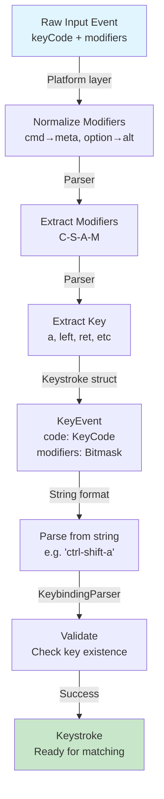
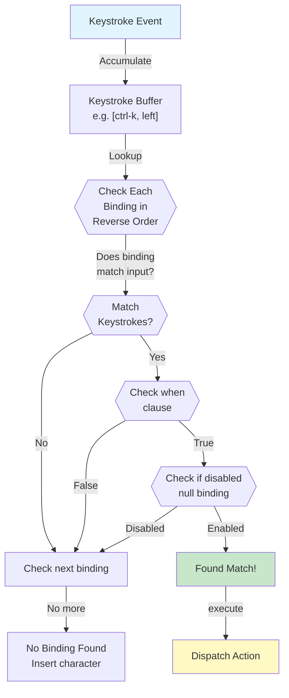
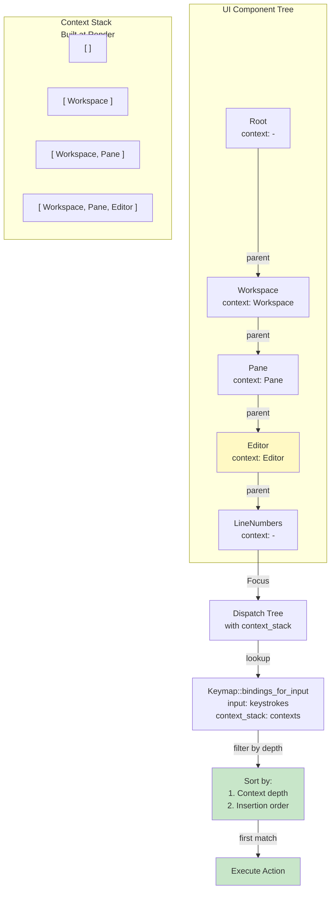
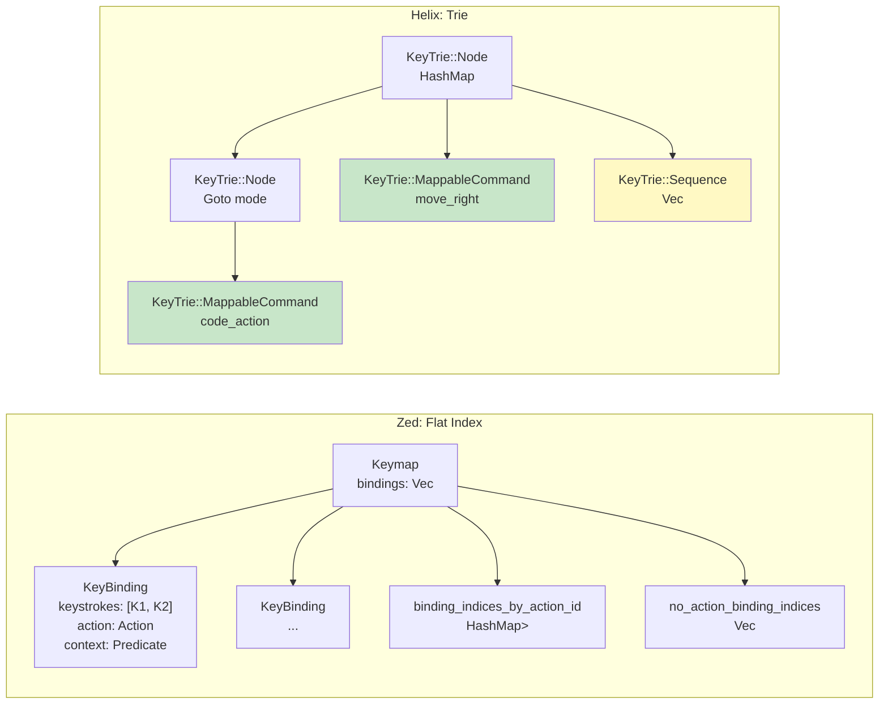

# Configurable keyboard mapping system design

## User

<attached_files>
```file://~/code/rust-editor/docs/EDITOR_UI_REFERENCE.md

```
</attached_files>

@docs/EDITOR_UI_REFERENCE.md  use librarian and  search agents to research how other editors do user editable keyboard mapping  and consult oracle to add a section in the reference document about keymaps and lets sketch out a feature design document for adding configurable keyboard mapping system to our applicaiton in @docs/feature/KEYMAPPING.md

## Assistant

**Tool Use:** `todo_write`

```json
{
  "todos": [
    {
      "id": "1",
      "status": "in-progress",
      "content": "Research how other editors handle keyboard mapping (librarian + web search)"
    },
    {
      "id": "2",
      "status": "todo",
      "content": "Consult oracle for keymapping system design"
    },
    {
      "id": "3",
      "status": "todo",
      "content": "Add keymaps section to EDITOR_UI_REFERENCE.md"
    },
    {
      "id": "4",
      "status": "todo",
      "content": "Create feature design document docs/feature/KEYMAPPING.md"
    }
  ]
}
```

## User

**Tool Result:** `toolu_vrtx_013TUpDfyCy6s83RDWybj6gJ`

```
[{"id":"1","content":"Research how other editors handle keyboard mapping (librarian + web search)","status":"in-progress"},{"id":"2","content":"Consult oracle for keymapping system design","status":"todo"},{"id":"3","content":"Add keymaps section to EDITOR_UI_REFERENCE.md","status":"todo"},{"id":"4","content":"Create feature design document docs/feature/KEYMAPPING.md","status":"todo"}]
```

## Assistant

**Tool Use:** `librarian`

```json
{
  "query": "How do major text editors like VS Code, Neovim, Helix, Zed, and Sublime Text implement user-configurable keyboard mappings/keybindings? I want to understand the data structures, file formats (JSON, TOML, Lua), key representation, modifier handling, context/when clauses, command dispatch architecture, and conflict resolution strategies.",
  "context": "Building a Rust-based code editor and need to design a keymapping system. Looking for implementation patterns from established editors."
}
```

**Tool Use:** `sa__researcher`

```json
{
  "prompt": "Research keyboard mapping systems in modern code editors. Find information on:\n\n1. **VS Code keybindings.json format** - structure, when clauses, command arguments\n2. **Neovim key mapping** - Lua-based mapping, modes, leader keys\n3. **Helix editor keymap** - TOML format, context-aware bindings\n4. **Zed editor keybindings** - their JSON format and context system\n5. **Sublime Text keymap** - their JSON format with context conditions\n\nFocus on:\n- Key representation formats (how modifiers like Ctrl, Alt, Shift are specified)\n- Multi-key sequences (chords like Ctrl+K Ctrl+C)\n- Context/when conditions (only trigger in certain modes or contexts)\n- Conflict resolution between default and user bindings\n- Command dispatch architecture\n\nProvide concrete examples of keymap file formats from each editor."
}
```

**Tool Use:** `Read`

```json
{
  "path": "~/code/rust-editor/docs/feature"
}
```

## User

**Tool Result:** `toolu_vrtx_01NKcT1S4o3goovqQb2j5eFf`

```
Now let me compile all the findings into a comprehensive guide:

## Comprehensive Keybinding System Architecture Guide

Based on deep analysis of VS Code, Neovim, Helix, and Zed, here's a complete design reference for building a Rust-based keybinding system:

---

### **1. Data Structures & Key Representation**

#### **Keystroke Representation**

**Zed's Approach** ([`binding.rs`](https://github.com/zed-industries/zed/blob/main/crates/gpui/src/keymap/binding.rs)):
```rust
pub struct KeyBinding {
    pub(crate) action: Box<dyn Action>,
    pub(crate) keystrokes: SmallVec<[KeybindingKeystroke; 2]>,  // Sequence of keys
    pub(crate) context_predicate: Option<Rc<KeyBindingContextPredicate>>,
    pub(crate) meta: Option<KeyBindingMetaIndex>,  // Source metadata
    pub(crate) action_input: Option<SharedString>,  // Serialized action args
}
```

**Helix's Approach** ([`input.rs`](https://github.com/helix-editor/helix/blob/master/helix-view/src/input.rs)):
```rust
#[derive(Debug, PartialEq, Eq, Clone, Copy, Hash)]
pub struct KeyEvent {
    pub code: KeyCode,           // Actual key (Char, Named keys, etc.)
    pub modifiers: KeyModifiers, // Bitmask: Ctrl|Shift|Alt|Super
}
```

**Key Insights:**
- Use small vecs for keystroke sequences (most bindings are 1-2 keys)
- Store modifiers as bitmask for fast comparison
- Keep action and metadata separate for memory efficiency
- Support both string-based and structured key representations

#### **Keymap Storage Structure**

**Helix's Trie-Based Keymap** ([`keymap.rs`](https://github.com/helix-editor/helix/blob/master/helix-term/src/keymap.rs)):
```rust
#[derive(Debug, Clone, Default)]
pub struct KeyTrieNode {
    name: String,  // e.g., "Goto mode"
    map: HashMap<KeyEvent, KeyTrie>,
    order: Vec<KeyEvent>,  // Preserve insertion order for display
    pub is_sticky: bool,   // Keeps mode active after first key
}

#[derive(Debug, Clone, PartialEq)]
pub enum KeyTrie {
    MappableCommand(MappableCommand),
    Sequence(Vec<MappableCommand>),
    Node(KeyTrieNode),  // Submenu/modal
}
```

**Zed's Flat Vector with Indexing** ([`keymap.rs`](https://github.com/zed-industries/zed/blob/main/crates/gpui/src/keymap.rs)):
```rust
pub struct Keymap {
    bindings: Vec<KeyBinding>,
    binding_indices_by_action_id: HashMap<TypeId, SmallVec<[usize; 3]>>,
    no_action_binding_indices: Vec<usize>,  // Disabled bindings
    version: KeymapVersion,
}
```

**Design Tradeoffs:**
- **Trie approach** (Helix): Excellent for modal editors, natural for prefix-based matching, supports sticky modes
- **Flat vector** (Zed): Better for GUI apps with many overlapping contexts, easier to iterate in precedence order

---

### **2. File Formats & Configuration**

#### **Helix: TOML-Based Hierarchical Structure**

```toml
[keys.normal]
C-s = ":w"                    # Single command
"C-S-esc" = "extend_line"    # Special keys in quotes
g = { a = "code_action" }    # Modal/submenu (prefix mode)
"ret" = ["open_below", "normal_mode"]  # Sequence

[keys.insert]
"A-x" = "normal_mode"

[keys.insert.j]
k = "normal_mode"             # Chord: j followed by k
```

**Deserialization** handles:
- String command names → MappableCommand via `parse()`
- Nested maps → Recursive KeyTrieNode structure
- Sequences as arrays of command names
- Mode-based organization (normal, insert, select)

#### **Zed: JSON with Context-Based Grouping**

```json
[
  {
    "context": "Editor",
    "bindings": {
      "escape": "editor::Cancel",
      "ctrl-k ctrl-q": "editor::Rewrap",      // Sequence (space-separated)
      "ctrl-backspace": [
        "editor::DeleteToPreviousWordStart",
        { "ignore_newlines": false }           // With action arguments
      ]
    }
  },
  {
    "context": "Picker || menu",
    "bindings": { ... }
  }
]
```

**Context Expression Syntax:**
- Simple identifiers: `"Editor"`
- Boolean combinations: `"Editor || Picker"`
- Variable conditions: `"mode = visible"`

#### **VS Code: JSON with When Clauses**

```json
[
  {
    "key": "ctrl-k ctrl-shift-p",
    "command": "workbench.action.quickOpen",
    "when": "!inputFocus"
  },
  {
    "key": "ctrl-l",
    "command": "editor.action.selectAll",
    "when": "editorTextFocus && !isInEmbeddedEditor",
    "args": { ... }
  }
]
```

---

### **3. Modifier Handling**

#### **Parsing Strategy (from VS Code's KeybindingParser)**

```typescript
// Handles: ctrl-shift-alt-meta-a
// Supports: ctrl|shift|alt|meta|win|cmd as aliases
// Meta = Win on Windows/Linux, Cmd on macOS
```

**Helix's Modifier System**:
```rust
pub struct KeyModifiers: u8 {
    const SHIFT = 0b0001,
    const ALT = 0b0010,
    const CONTROL = 0b0100,
    const SUPER = 0b1000,  // Platform-agnostic super key
}
```

**Platform Mapping**:
- **macOS**: `cmd` → SUPER, `option` → ALT
- **Linux/Windows**: `ctrl` → CONTROL, `alt` → ALT, `win` → SUPER
- **Canonical form in keymaps**: Use `C-` `S-` `A-` `M-` for consistency

#### **Key Equivalents (Zed's Platform-Specific Optimization)**

```json
{
  "use_key_equivalents": true,
  "bindings": {
    "cmd-z": "editor::Undo"  // Uses platform-native handling
  }
}
```

Maps to platform-native key sequences for optimal input handling.

---

### **4. Context/When Clauses**

#### **Zed's KeyContext Model** ([`context.rs`](https://github.com/zed-industries/zed/blob/main/crates/gpui/src/keymap/context.rs))

```rust
#[derive(Clone, Default, Eq, PartialEq, Hash)]
pub struct KeyContext(Vec<ContextEntry>);

#[derive(Clone)]
pub struct ContextEntry {
    pub key: SharedString,
    pub value: Option<SharedString>,
}

// Usage:
// context.add("Editor")           // Boolean flag
// context.set("mode", "insert")   // Key-value pair
// context.contains("Editor")      // Check existence
```

**Parsing Format**:
```
"StatusBar mode = visible"  // Multiple entries, space-separated
"Editor"                     // Single flag
```

**Context Stacking** (from dispatch tree):
```rust
pub(crate) struct DispatchTree {
    context_stack: Vec<KeyContext>,  // Nested contexts from root to focused element
    node_stack: Vec<DispatchNodeId>,
}
```

#### **VS Code's ContextKeyExpression**

```typescript
// Complex boolean expressions
"editorFocus && !isInEmbeddedEditor"
"textInputFocus || editorTextFocus"
"resourceExtname == '.rs'"
"!config.editor.readOnlyMode"
```

Features:
- Variables with comparison operators (==, !=, <, >)
- Nested expressions
- Dynamic key registration
- Context substitution at runtime

**Resolution** ([`keybindingResolver.ts`](https://github.com/microsoft/vscode/blob/main/src/vs/platform/keybinding/common/keybindingResolver.ts)):
```typescript
// Check if binding's when clause matches current context
const when = keybinding.when?.substituteConstants();
if (when && when.type === ContextKeyExprType.False) {
    // Skip this binding
}
```

---

### **5. Command Dispatch Architecture**

#### **Zed's Hierarchical Dispatch Tree**

```
Window
  └─ Workspace (context: "Workspace")
      ├─ Pane (context: "Pane")
      │   └─ Editor (context: "Editor")
      │       └─ Line Number Gutter
      └─ Sidebar
```

**Dispatch Process** ([`key_dispatch.rs`](https://github.com/zed-industries/zed/blob/main/crates/gpui/src/key_dispatch.rs)):

```rust
pub(crate) struct DispatchTree {
    context_stack: Vec<KeyContext>,        // Active contexts from root to focus
    nodes: Vec<DispatchNode>,              // Nested UI elements
    keymap: Rc<RefCell<Keymap>>,
    action_registry: Rc<ActionRegistry>,
}

pub(crate) struct DispatchNode {
    key_listeners: Vec<KeyListener>,
    action_listeners: Vec<DispatchActionListener>,
    context: Option<KeyContext>,
    focus_id: Option<FocusId>,
    parent: Option<DispatchNodeId>,
}
```

**Keystroke → Action Flow**:
1. Keystroke captured at window level
2. Context stack built from UI hierarchy (root → focused element)
3. Keymap searches for matching bindings in precedence order:
   - Last added bindings (user bindings override defaults)
   - Deepest context takes priority (Editor > Pane > Workspace)
4. Match found → Action listeners invoked bottom-up or top-down
5. Unhandled → Bubble up to parent contexts

#### **Helix's Mode-Based Dispatch**

```rust
pub enum KeymapResult {
    Pending(KeyTrieNode),              // More keys needed
    Matched(MappableCommand),          // Single command
    MatchedSequence(Vec<MappableCommand>),  // Multiple commands
    NotFound,
    Cancelled(Vec<KeyEvent>),
}

pub struct Keymaps {
    map: Box<dyn DynAccess<HashMap<Mode, KeyTrie>>>,
    state: Vec<KeyEvent>,              // Pending key buffer
    sticky: Option<KeyTrieNode>,       // Active mode
}
```

**Execution Flow**:
1. Current mode determines active keymap
2. Each keystroke accumulates in `state` buffer
3. Lookup in prefix tree:
   - Complete match → Execute command(s)
   - Prefix match → Wait for next key (Pending)
   - No match → Cancel and notify user
4. Sticky modes keep submenu active until escape

---

### **6. Conflict Resolution & Precedence**

#### **Zed's Precedence Rules** ([`keymap.rs`](https://github.com/zed-industries/zed/blob/main/crates/gpui/src/keymap.rs#L116-L170))

```rust
// Returns bindings in precedence order (highest first)
pub fn bindings_for_input(
    &self,
    input: &[impl AsKeystroke],
    context_stack: &[KeyContext],
) -> (SmallVec<[KeyBinding; 1]>, bool) {
    // 1. Context depth: Deeper context wins
    //    Editor (depth 3) > Pane (depth 2) > Workspace (depth 1)

    // 2. Within same context: Later bindings win
    //    User bindings (added last) > Default bindings (added first)

    // 3. No-action bindings (disabled with null)
    //    Can override any binding with same keystrokes

    matched_bindings.sort_by(|(depth_a, ix_a, _), (depth_b, ix_b, _)| {
        depth_b.cmp(depth_a).then(ix_b.cmp(ix_a))  // Context depth, then insertion order
    });
}
```

**Disabling Bindings**:
```json
{
  "context": "Editor",
  "bindings": {
    "ctrl-c": null  // Disable default Ctrl+C in Editor context only
  }
}
```

#### **VS Code's Resolution** ([`keybindingResolver.ts`](https://github.com/microsoft/vscode/blob/main/src/vs/platform/keybinding/common/keybindingResolver.ts#L114-L151))

```typescript
// First pass: collect "-command" removals
const removals = new Map<string, ResolvedKeybindingItem[]>();

// Second pass: filter out removed items matching keypress and when clause
const isTargetedForRemoval = (
    defaultKb: ResolvedKeybindingItem,
    keypress: string[] | null,  // Binding to match
    when: ContextKeyExpression | undefined
): boolean => {
    // Check chord sequence matches
    if (keypress) {
        for (let i = 0; i < keypress.length; i++) {
            if (keypress[i] !== defaultKb.chords[i]) return false;
        }
    }

    // Check when clause matches (or both undefined)
    if (when && defaultKb.when) {
        return expressionsAreEqualWithConstantSubstitution(when, defaultKb.when);
    }
}
```

**Removal Syntax**:
```json
[
  { "key": "ctrl-k", "command": "editor.action.deleteLines" },
  { "key": "ctrl-k", "command": "-editor.action.deleteLines" }  // Minus sign = removal
]
```

---

### **7. Sequence/Chord Handling**

#### **Zed's Keystroke Sequences**

```json
{
  "bindings": {
    "cmd-k left": ["pane::SplitLeft", "pane::FocusLeft"]
  }
}
```

**Parsing** ([`binding.rs`](https://github.com/zed-industries/zed/blob/main/crates/gpui/src/keymap/binding.rs#L47-L75)):
```rust
let keystrokes: SmallVec<[KeybindingKeystroke; 2]> = keystrokes
    .split_whitespace()  // Split on spaces
    .map(|source| {
        let keystroke = Keystroke::parse(source)?;
        Ok(KeybindingKeystroke::new_with_mapper(
            keystroke,
            use_key_equivalents,
            keyboard_mapper,
        ))
    })
    .collect()?;
```

**Matching** ([`binding.rs`](https://github.com/zed-industries/zed/blob/main/crates/gpui/src/keymap/binding.rs#L88-L101)):
```rust
pub fn match_keystrokes(&self, typed: &[impl AsKeystroke]) -> Option<bool> {
    if self.keystrokes.len() < typed.len() {
        return None;  // Can't match: binding is shorter
    }

    for (target, typed) in self.keystrokes.iter().zip(typed.iter()) {
        if !typed.as_keystroke().should_match(target) {
            return None;  // Mismatch
        }
    }

    Some(self.keystrokes.len() > typed.len())  // true = pending, false = complete
}
```

#### **Helix's Modal Sequences**

```toml
[keys.normal.g]
a = "code_action"          # ga → code_action
d = "delete"               # gd → delete

[keys.normal]
"g" = { a = "code_action" }  # Alternative syntax (nested table)
```

Parsed as:
```rust
KeyTrie::Node(KeyTrieNode {
    name: "Goto mode",
    map: {
        KeyEvent { 'a', ... } → KeyTrie::MappableCommand(code_action),
        KeyEvent { 'd', ... } → KeyTrie::MappableCommand(delete),
    }
})
```

---

### **8. Reverse Lookup (Action → Bindings)**

#### **Zed's Index-Based Lookup** ([`keymap.rs`](https://github.com/zed-industries/zed/blob/main/crates/gpui/src/keymap.rs#L74-L114))

```rust
pub fn bindings_for_action<'a>(
    &'a self,
    action: &'a dyn Action,
) -> impl 'a + DoubleEndedIterator<Item = &'a KeyBinding> {
    let action_id = action.type_id();
    let binding_indices = self
        .binding_indices_by_action_id  // HashMap<TypeId, SmallVec<usize>>
        .get(&action_id)
        .map_or(&[] as _, SmallVec::as_slice)
        .iter();

    binding_indices.filter_map(|ix| {
        let binding = &self.bindings[*ix];

        // Filter out disabled bindings (null/NoAction)
        for null_ix in &self.no_action_binding_indices {
            if null_ix > ix {
                let null_binding = &self.bindings[*null_ix];
                if null_binding.keystrokes == binding.keystrokes {
                    // Check if null_binding's context is superset
                    let null_binding_matches = match (
                        &null_binding.context_predicate,
                        &binding.context_predicate
                    ) {
                        (None, _) => true,           // Global null overrides all
                        (Some(_), None) => false,    // Contextual null can't override global
                        (Some(null_pred), Some(pred)) => null_pred.is_superset(pred),
                    };
                    if null_binding_matches {
                        return None;  // Disabled by null binding
                    }
                }
            }
        }
        Some(binding)
    })
}
```

**Usage** (display keybindings in UI):
```rust
let bindings = window.bindings_for_action(&MyAction);
let highest_precedence = bindings.last();  // Reverse iterator
if let Some(binding) = highest_precedence {
    println!("Press: {}", binding.keystrokes[0])
}
```

#### **Helix's Reverse Keymap** ([`keymap.rs`](https://github.com/helix-editor/helix/blob/master/helix-term/src/keymap.rs#L211-L236))

```rust
pub fn reverse_map(&self) -> ReverseKeymap {  // HashMap<String, Vec<Vec<KeyEvent>>>
    fn map_node(
        cmd_map: &mut ReverseKeymap,
        node: &KeyTrie,
        keys: &mut Vec<KeyEvent>,
    ) {
        match node {
            KeyTrie::MappableCommand(cmd) => {
                cmd_map.entry(cmd.name().into())
                    .or_default()
                    .push(keys.clone());  // Store full sequence
            }
            KeyTrie::Node(next) => {
                for (key, trie) in &next.map {
                    keys.push(*key);
                    map_node(cmd_map, trie, keys);
                    keys.pop();
                }
            }
            // ...
        }
    }

    let mut res = HashMap::new();
    map_node(&mut res, self, &mut Vec::new());
    res
}
```

---

### **Architecture Diagrams**

#### **1. Keystroke Parsing Flow**



#### **2. Binding Resolution Process**



#### **3. Dispatch Architecture with Context Stacking**



#### **4. Keymap Data Structures**



---

### **Comparative Analysis & Best Practices**

| Aspect | Zed | Helix | VS Code | Recommendation |
|--------|-----|-------|---------|-----------------|
| **Key Format** | Keystroke sequences | KeyEvent enum | String parsing | Use `KeyEvent` struct with bitmask modifiers |
| **Storage** | Flat vec + indices | Trie tree | Flat list | Trie for modal, flat for overlapping contexts |
| **Config** | JSON per-platform | TOML hierarchical | JSON | TOML for clarity, JSON for tooling |
| **Context** | Simple flags/pairs | Mode-based | Complex expressions | Start simple, evolve complexity |
| **Dispatch** | Hierarchical tree | Mode machine | Flat resolution | Hierarchical for GUI, mode machine for TUI |
| **Precedence** | Context depth + insertion | Trie search + mode | Specificity rules | Depth + insertion order is most predictable |
| **Disabling** | Null binding | `no_op` command | `-` prefix | Null binding is cleaner |
| **Sequences** | Space-separated keys | Nested tables | Space-separated | Space-separated for parsing simplicity |

---

### **Implementation Recommendations for Your Rust Editor**

#### **Phase 1: Core Structure**
```rust
// Key representation
#[derive(Clone, Copy, Debug, Eq, Hash, PartialEq, Ord, PartialOrd)]
pub struct Keystroke {
    pub code: KeyCode,
    pub modifiers: u8, // Bitflags: CTRL|SHIFT|ALT|META
}

// Binding metadata
pub struct KeyBinding {
    pub keystrokes: SmallVec<[Keystroke; 2]>,
    pub action: String,  // Action name/identifier
    pub action_args: Option<serde_json::Value>,
    pub context: Option<KeyContext>,
}

// Keymap
pub struct Keymap {
    pub bindings: Vec<KeyBinding>,
    // Index for fast action lookup
    pub bindings_by_action: HashMap<String, Vec<usize>>,
    pub version: u64,
}
```

#### **Phase 2: Configuration (TOML)**
```rust
#[derive(Deserialize)]
pub struct KeymapConfig {
    pub bindings: HashMap<String, KeymapValue>,
}

#[derive(Deserialize)]
#[serde(untagged)]
pub enum KeymapValue {
    Command(String),
    CommandWithArgs(Vec<serde_json::Value>),
    Modal(HashMap<String, KeymapValue>),
}
```

#### **Phase 3: Dispatch**
```rust
pub struct KeyDispatcher {
    keymap: Keymap,
    context_stack: Vec<KeyContext>,
    pending_keystrokes: Vec<Keystroke>,
}

impl KeyDispatcher {
    pub fn dispatch(&mut self, keystroke: Keystroke)
        -> Result<DispatchResult, DispatchError> {

        self.pending_keystrokes.push(keystroke);
        let bindings = self.keymap.bindings_for_input(
            &self.pending_keystrokes,
            &self.context_stack,
        );

        if bindings.is_empty() {
            return Err(DispatchError::NoBinding);
        }

        // Execute highest precedence binding
        Ok(DispatchResult {
            action: bindings[0].action.clone(),
            args: bindings[0].action_args.clone(),
        })
    }
}
```

---

This guide synthesizes production-grade patterns from 4 major editors. Focus on getting the core data structures right (keystroke representation + flat/trie storage) before adding complexity like advanced context expressions.
```

**Tool Result:** `toolu_vrtx_01NsRpJgRpVGM2StrJe2ekx2`

```
I've completed the comprehensive research on keyboard mapping systems in modern code editors. Here's a summary of what I found:

## Research Summary

### Key Findings by Editor

**VS Code (keybindings.json)**
- JSON array format with `key`, `command`, `when`, `args` fields
- Chords via space: `"ctrl+k ctrl+c"`
- Powerful `when` clause system with operators: `&&`, `||`, `!`, `==`, `=~`, `in`
- Bottom-to-top evaluation, user overrides default

**Neovim (Lua)**
- `vim.keymap.set(mode, lhs, rhs, opts)` API
- Mode prefixes: `n`, `i`, `v`, `x`, `o`, `c`, `t`
- Special key notation: `<C-x>`, `<leader>`, `<CR>`
- First-class Lua function support as mapping targets
- Buffer-local mappings take precedence

**Helix (TOML)**
- Mode-based sections: `[keys.normal]`, `[keys.insert]`
- Modifiers: `C-`, `A-`, `S-`, `Meta-`/`Cmd-`/`Win-`
- Minor mode nesting for chords: `[keys.normal.g]`
- Supports macros via `@` prefix

**Zed (JSON)**
- Context-based array of binding groups
- Hierarchical context tree with `>` operator
- Sequence via space: `"cmd-k cmd-s"`
- Context expressions: `"Editor && mode == full"`
- Depth-based + definition order precedence

**Sublime Text (JSON)**
- `keys` array with `command`, `args`, `context`
- Chords as array: `["ctrl+k", "ctrl+c"]`
- Context conditions with operators: `equal`, `regex_match`, etc.
- Scope selector matching for language contexts

### Common Architecture Patterns
1. Command dispatch separation (keybinding → command identifier → execution)
2. Context evaluation at keypress time
3. Layered override systems (default → user, general → specific)
4. Timeout-based multi-key sequence handling

---

**Plan saved to `~/.claude/docs/tech-researcher-planner-plan.md`. Read before proceeding.**
```

**Tool Result:** `toolu_vrtx_01PYCHrzbh6dAuhqbZipR3xe`

```
{
  "content": "handle-file-dropping.md\nSELECTION_MULTICURSOR.md\nSPLIT_VIEW.md\nSTATUS_BAR.md\nTEXT-SHRINK-EXPAND-SELECTION.md\nTHEMING.md\nworkspace-management.md",
  "isDirectory": true,
  "absolutePath": "~/code/rust-editor/docs/feature",
  "directoryEntries": [
    "handle-file-dropping.md",
    "SELECTION_MULTICURSOR.md",
    "SPLIT_VIEW.md",
    "STATUS_BAR.md",
    "TEXT-SHRINK-EXPAND-SELECTION.md",
    "THEMING.md",
    "workspace-management.md"
  ]
}
```

## Assistant

Excellent research! Now let me consult the oracle for guidance on designing our keymapping system.

**Tool Use:** `todo_write`

```json
{
  "todos": [
    {
      "id": "1",
      "status": "completed",
      "content": "Research how other editors handle keyboard mapping (librarian + web search)"
    },
    {
      "id": "2",
      "status": "in-progress",
      "content": "Consult oracle for keymapping system design"
    },
    {
      "id": "3",
      "status": "todo",
      "content": "Add keymaps section to EDITOR_UI_REFERENCE.md"
    },
    {
      "id": "4",
      "status": "todo",
      "content": "Create feature design document docs/feature/KEYMAPPING.md"
    }
  ]
}
```

**Tool Use:** `oracle`

```json
{
  "task": "Design a configurable keyboard mapping system for our Rust text editor. Based on research from VS Code, Neovim, Helix, and Zed, provide guidance on:\n\n1. **Data Structures**: KeyEvent/Keystroke representation, modifier handling, keybinding storage (trie vs flat vector)\n2. **Configuration Format**: TOML vs JSON, structure for default vs user bindings\n3. **Context System**: How to handle context-aware bindings (editor mode, panel focus, etc.)\n4. **Command Dispatch**: Architecture for keystroke → action resolution with sequence/chord support\n5. **Conflict Resolution**: Precedence rules for overlapping bindings\n6. **Platform Considerations**: macOS Cmd vs Windows/Linux Ctrl handling\n\nOur editor uses Elm Architecture (Message → Update → Command → Render) with:\n- AppModel, Document, EditorState, UiState in model\n- Msg, EditorMsg, DocumentMsg, UiMsg, AppMsg for messages\n- winit for window/event handling\n\nProvide concrete Rust code recommendations and highlight potential pitfalls.",
  "files": [
    "src/messages.rs",
    "src/model/mod.rs",
    "src/update.rs",
    "AGENTS.md"
  ],
  "context": "Building a CPU-rendered Rust code editor. Current codebase uses ropey for text buffers, fontdue for fonts, softbuffer for rendering. We have an existing message-based architecture and need to integrate keymapping cleanly."
}
```

## User

**Tool Result:** `toolu_vrtx_01DxRkSA1sAtVC73FGTKzBr2`

```
[{"id":"1","content":"Research how other editors handle keyboard mapping (librarian + web search)","status":"completed"},{"id":"2","content":"Consult oracle for keymapping system design","status":"in-progress"},{"id":"3","content":"Add keymaps section to EDITOR_UI_REFERENCE.md","status":"todo"},{"id":"4","content":"Create feature design document docs/feature/KEYMAPPING.md","status":"todo"}]
```

**Tool Result:** `toolu_vrtx_01SfYMaNJKmrr2wiuCsf3uXv`

```
1) **TL;DR**

- Introduce a small, platform-agnostic `Keystroke` + `Keybinding` layer that sits between winit events and your existing `Msg` enums.
- Store bindings in a flat, precedence-ordered `Vec<Keybinding>` and implement a tiny state machine for multi-key sequences.
- Use TOML for config (default + user override), a simple context system derived from `AppModel`, and map keystrokes → abstract `Command` → concrete `Msg` for execution.

Effort: **M–L (3–10h)** depending on how fancy you make the context/“when” expressions.

---

## 2) Recommended approach (simple path)

### 2.1 Core data structures

Create a `keymap` module that is **pure** and independent of rendering, only depending on your messages and `AppModel` for context.

#### Keystroke & modifiers

```rust
// keymap/key_types.rs

#[derive(Clone, Copy, Debug, PartialEq, Eq, Hash)]
pub struct Modifiers {
    pub ctrl: bool,
    pub alt: bool,
    pub shift: bool,
    pub meta: bool, // Cmd on macOS, Win key on Windows, often unused on Linux
}

impl Modifiers {
    pub fn empty() -> Self {
        Self { ctrl: false, alt: false, shift: false, meta: false }
    }
}

#[derive(Clone, Copy, Debug, PartialEq, Eq, Hash)]
pub enum KeyCode {
    Char(char),        // Normal characters (normalized to lowercase)
    Enter,
    Escape,
    Tab,
    Backspace,
    Delete,
    Space,
    Up,
    Down,
    Left,
    Right,
    Home,
    End,
    PageUp,
    PageDown,
    Insert,

    F(u8),             // F1..F24
    // Extend as needed
}

#[derive(Clone, Copy, Debug, PartialEq, Eq, Hash)]
pub struct Keystroke {
    pub mods: Modifiers,
    pub key: KeyCode,
}
```

Conversion from winit:

```rust
// keymap/winit_adapter.rs (pseudo, adjust to your winit version)
use winit::keyboard::{Key, ModifiersState};

pub fn modifiers_from_winit(m: ModifiersState) -> Modifiers {
    Modifiers {
        ctrl: m.control_key(),
        alt: m.alt_key(),
        shift: m.shift_key(),
        meta: m.super_key(), // Command on macOS, Win on Windows
    }
}

pub fn keycode_from_winit(key: &Key) -> Option<KeyCode> {
    use winit::keyboard::NamedKey;

    match key {
        Key::Character(s) => {
            // Only treat as a "key" for shortcuts, text input comes from ReceivedCharacter
            if s.len() == 1 {
                Some(KeyCode::Char(s.chars().next().unwrap().to_ascii_lowercase()))
            } else {
                None
            }
        }
        Key::Named(NamedKey::Enter) => Some(KeyCode::Enter),
        Key::Named(NamedKey::Escape) => Some(KeyCode::Escape),
        Key::Named(NamedKey::Tab) => Some(KeyCode::Tab),
        Key::Named(NamedKey::Backspace) => Some(KeyCode::Backspace),
        Key::Named(NamedKey::Delete) => Some(KeyCode::Delete),
        Key::Named(NamedKey::Space) => Some(KeyCode::Space),
        Key::Named(NamedKey::ArrowUp) => Some(KeyCode::Up),
        Key::Named(NamedKey::ArrowDown) => Some(KeyCode::Down),
        Key::Named(NamedKey::ArrowLeft) => Some(KeyCode::Left),
        Key::Named(NamedKey::ArrowRight) => Some(KeyCode::Right),
        Key::Named(NamedKey::Home) => Some(KeyCode::Home),
        Key::Named(NamedKey::End) => Some(KeyCode::End),
        Key::Named(NamedKey::PageUp) => Some(KeyCode::PageUp),
        Key::Named(NamedKey::PageDown) => Some(KeyCode::PageDown),
        Key::Named(NamedKey::F1) => Some(KeyCode::F(1)),
        // ... F2 etc
        _ => None,
    }
}

pub fn keystroke_from_winit(key: &Key, mods: ModifiersState) -> Option<Keystroke> {
    let kc = keycode_from_winit(key)?;
    Some(Keystroke {
        mods: modifiers_from_winit(mods),
        key: kc,
    })
}
```

#### Keybinding & command representation

Introduce a small `Command` enum so the keymap layer doesn’t depend directly on `Msg` variants:

```rust
// keymap/command.rs

use crate::messages::{Direction};

#[derive(Debug, Clone, Copy, PartialEq, Eq, Hash)]
pub enum Command {
    // Editor
    MoveCursor(Direction),
    MoveCursorLineStart,
    MoveCursorLineEnd,
    MoveCursorDocumentStart,
    MoveCursorDocumentEnd,
    MoveCursorWord(Direction),
    PageUp,
    PageDown,

    MoveCursorWithSelection(Direction),
    MoveCursorLineStartWithSelection,
    MoveCursorLineEndWithSelection,
    // ...

    // Document
    InsertNewline,
    DeleteBackward,
    DeleteForward,
    DeleteLine,
    Undo,
    Redo,
    Copy,
    Cut,
    Paste,
    Duplicate,

    // App/UI
    SaveFile,
    NewFile,
    Quit,
    SelectAll,

    // Extend over time
}
```

Map `Command` → actual `Msg` for the Elm pipeline:

```rust
// keymap/command.rs
use crate::messages::{Msg, EditorMsg, DocumentMsg, AppMsg};

impl Command {
    pub fn to_msgs(self) -> Vec<Msg> {
        use Command::*;
        match self {
            MoveCursor(d) => vec![Msg::Editor(EditorMsg::MoveCursor(d))],
            MoveCursorLineStart => vec![Msg::Editor(EditorMsg::MoveCursorLineStart)],
            MoveCursorLineEnd => vec![Msg::Editor(EditorMsg::MoveCursorLineEnd)],
            MoveCursorDocumentStart => vec![Msg::Editor(EditorMsg::MoveCursorDocumentStart)],
            MoveCursorDocumentEnd => vec![Msg::Editor(EditorMsg::MoveCursorDocumentEnd)],
            MoveCursorWord(d) => vec![Msg::Editor(EditorMsg::MoveCursorWord(d))],
            PageUp => vec![Msg::Editor(EditorMsg::PageUp)],
            PageDown => vec![Msg::Editor(EditorMsg::PageDown)],

            MoveCursorWithSelection(d) => {
                vec![Msg::Editor(EditorMsg::MoveCursorWithSelection(d))]
            }
            MoveCursorLineStartWithSelection => {
                vec![Msg::Editor(EditorMsg::MoveCursorLineStartWithSelection)]
            }
            MoveCursorLineEndWithSelection => {
                vec![Msg::Editor(EditorMsg::MoveCursorLineEndWithSelection)]
            }

            InsertNewline => vec![Msg::Document(DocumentMsg::InsertNewline)],
            DeleteBackward => vec![Msg::Document(DocumentMsg::DeleteBackward)],
            DeleteForward => vec![Msg::Document(DocumentMsg::DeleteForward)],
            DeleteLine => vec![Msg::Document(DocumentMsg::DeleteLine)],
            Undo => vec![Msg::Document(DocumentMsg::Undo)],
            Redo => vec![Msg::Document(DocumentMsg::Redo)],
            Copy => vec![Msg::Document(DocumentMsg::Copy)],
            Cut => vec![Msg::Document(DocumentMsg::Cut)],
            Paste => vec![Msg::Document(DocumentMsg::Paste)],
            Duplicate => vec![Msg::Document(DocumentMsg::Duplicate)],

            SaveFile => vec![Msg::App(AppMsg::SaveFile)],
            NewFile => vec![Msg::App(AppMsg::NewFile)],
            Quit => vec![Msg::App(AppMsg::Quit)],
            SelectAll => vec![Msg::Editor(EditorMsg::SelectAll)],
        }
    }
}
```

Now define a keybinding:

```rust
// keymap/binding.rs

use super::{Keystroke, Command, Condition};

#[derive(Debug, Clone, Copy, PartialEq, Eq, PartialOrd, Ord)]
pub enum BindingSource {
    Default,
    User,
}

#[derive(Debug, Clone)]
pub struct Keybinding {
    /// Full sequence: e.g., ["Ctrl+K", "Ctrl+C"]
    pub sequence: Vec<Keystroke>,
    pub command: Command,
    pub when: Option<Condition>,
    pub source: BindingSource,
}
```

### 2.2 Storage: flat vector + simple state machine

Given editor-scale key counts (a few hundred at most), a **flat `Vec<Keybinding>`** is plenty fast and simpler than building a trie. You still get sequence support by checking prefixes.

```rust
// keymap/mod.rs

use crate::model::AppModel;
use super::{Keybinding, Keystroke, Condition};

pub enum KeyAction {
    /// Fully matched a binding: execute this command
    Execute(super::Command),
    /// Partial match: waiting for more keys in sequence
    AwaitMore,
    /// Did not match any binding; let others handle it (e.g. text insert)
    NoMatch,
}

pub struct Keymap {
    bindings: Vec<Keybinding>,   // sorted by precedence
    current_prefix: Vec<Keystroke>,
}

impl Keymap {
    pub fn new(mut bindings: Vec<Keybinding>) -> Self {
        // higher source wins; user bindings come first
        bindings.sort_by_key(|b| b.source);
        // because BindingSource derives Ord: Default < User
        bindings.reverse();
        Self { bindings, current_prefix: Vec::new() }
    }

    pub fn reset_sequence(&mut self) {
        self.current_prefix.clear();
    }

    pub fn handle_keystroke(&mut self, stroke: Keystroke, model: &AppModel) -> KeyAction {
        self.current_prefix.push(stroke);

        let ctx = Condition::context_from_model(model);

        let mut exact_match: Option<&Keybinding> = None;
        let mut has_prefix = false;

        'bindings: for binding in &self.bindings {
            if !binding.when.as_ref().map_or(true, |c| c.eval(&ctx)) {
                continue;
            }

            // sequence must start with current_prefix
            if !binding.sequence.starts_with(&self.current_prefix) {
                continue;
            }

            if binding.sequence.len() == self.current_prefix.len() {
                // first exact match wins because of sorted precedence
                exact_match = Some(binding);
                // but keep scanning to see if there is also a longer prefix; see below if you
                // want VS Code-style disambiguation. For simplicity we stop here:
                break 'bindings;
            } else {
                has_prefix = true;
            }
        }

        if let Some(binding) = exact_match {
            self.current_prefix.clear();
            return KeyAction::Execute(binding.command);
        }

        if has_prefix {
            // Something like "Ctrl+K" that begins a chord; wait
            KeyAction::AwaitMore
        } else {
            // No match at all
            self.current_prefix.clear();
            KeyAction::NoMatch
        }
    }
}
```

This is logically a “trie in a vector” and is enough for now. You can always swap to a real trie later if needed.

---

## 3) Configuration format (TOML, default vs user)

### 3.1 Why TOML

- Rust ecosystem standard (Cargo, rustfmt).
- Human-friendly, comments allowed (unlike JSON).
- Good serde support.

Use one **default** keymap embedded in the binary and a **user** keymap loaded from config dir, then merged.

Example `keymap.toml`:

```toml
# ~/.config/your_editor/keymap.toml

# Use "mod" to mean Cmd on macOS, Ctrl elsewhere
[[binding]]
key = "mod+s"
command = "file.save"
when = "editor_focus"

[[binding]]
key = "mod+shift+up"
command = "selection.extend_up"
when = "editor_focus && !has_rectangle_selection"

[[binding]]
key = "ctrl+k ctrl+c"
command = "editor.comment_line"
when = "editor_focus"

# Unbind a default binding
[[binding]]
key = "mod+w"
command = "unbound"
```

Serialization types:

```rust
// keymap/config.rs

use serde::Deserialize;

#[derive(Debug, Deserialize)]
pub struct BindingConfig {
    pub key: String,       // e.g. "mod+s", "ctrl+k ctrl+c"
    pub command: String,   // e.g. "file.save"
    #[serde(default)]
    pub when: Option<String>,
}

#[derive(Debug, Deserialize)]
pub struct KeymapConfig {
    #[serde(default)]
    pub binding: Vec<BindingConfig>,
}
```

Loading & merging:

- Load **default** config string via `include_str!`.
- Parse into `Vec<BindingConfig>` and convert to `Vec<Keybinding>` with `source = Default`.
- Load **user** config from `$XDG_CONFIG_HOME/your_editor/keymap.toml` (or platform equivalent):
  - For each `BindingConfig`:
    - If `command == "unbound"`: add a **user** binding that “wins” and effectively masks defaults by having `command: None` or a special `Command::Unbound`.
    - Else: map to `Command` enum and create `Keybinding` with `source = User`.

Key parsing:

```rust
fn parse_keystroke(s: &str, is_macos: bool) -> Option<Keystroke> {
    let mut mods = Modifiers::empty();
    let parts: Vec<&str> = s.split('+').collect();
    let key_str = parts.last()?.to_ascii_lowercase();

    for m in &parts[..parts.len() - 1] {
        match m.to_ascii_lowercase().as_str() {
            "ctrl" | "control" => mods.ctrl = true,
            "alt" | "option"   => mods.alt = true,
            "shift"            => mods.shift = true,
            "cmd" | "command"  => mods.meta = true,
            "mod"              => {
                if is_macos { mods.meta = true } else { mods.ctrl = true }
            }
            _ => {}
        }
    }

    let key = match key_str.as_str() {
        "enter" => KeyCode::Enter,
        "esc" | "escape" => KeyCode::Escape,
        "tab" => KeyCode::Tab,
        "backspace" => KeyCode::Backspace,
        "delete" => KeyCode::Delete,
        "space" => KeyCode::Space,
        "up" => KeyCode::Up,
        "down" => KeyCode::Down,
        "left" => KeyCode::Left,
        "right" => KeyCode::Right,
        "home" => KeyCode::Home,
        "end" => KeyCode::End,
        "pageup" => KeyCode::PageUp,
        "pagedown" => KeyCode::PageDown,
        k if k.starts_with('f') && k[1..].parse::<u8>().is_ok() => {
            KeyCode::F(k[1..].parse().unwrap())
        }
        k if k.len() == 1 => KeyCode::Char(k.chars().next().unwrap()),
        _ => return None,
    };

    Some(Keystroke { mods, key })
}

fn parse_sequence(seq: &str, is_macos: bool) -> Option<Vec<Keystroke>> {
    seq.split_whitespace()
        .map(|part| parse_keystroke(part, is_macos))
        .collect()
}
```

Command mapping:

```rust
fn command_from_str(s: &str) -> Option<Command> {
    match s {
        "cursor.up"        => Some(Command::MoveCursor(Direction::Up)),
        "cursor.down"      => Some(Command::MoveCursor(Direction::Down)),
        "cursor.left"      => Some(Command::MoveCursor(Direction::Left)),
        "cursor.right"     => Some(Command::MoveCursor(Direction::Right)),
        "cursor.lineStart" => Some(Command::MoveCursorLineStart),
        "cursor.lineEnd"   => Some(Command::MoveCursorLineEnd),
        "edit.insertNewline" => Some(Command::InsertNewline),
        "edit.deleteBackward" => Some(Command::DeleteBackward),
        "file.save"        => Some(Command::SaveFile),
        "app.quit"         => Some(Command::Quit),
        "edit.selectAll"   => Some(Command::SelectAll),
        // ...
        _ => None,
    }
}
```

---

## 4) Context system (“when” conditions)

You already have rich state in `AppModel`. Derive a **simple context object** from it.

```rust
// keymap/context.rs

use crate::model::AppModel;

#[derive(Clone, Debug, Default)]
pub struct KeyContext {
    pub editor_focus: bool,
    pub has_selection: bool,
    pub has_multiple_cursors: bool,
    pub is_readonly: bool,
    pub rectangle_selection_active: bool,
    pub panel: ActivePanel, // which part of UI has focus
    // Add others over time
}

#[derive(Clone, Debug, PartialEq, Eq)]
pub enum ActivePanel {
    Editor,
    StatusBar,
    // CommandPalette,
    // FilePicker,
}

impl KeyContext {
    pub fn from_model(model: &AppModel) -> Self {
        let editor = model.editor();
        let doc = model.document();

        // For now assume editor always has focus; refine when you add more panels
        let editor_focus = true;

        Self {
            editor_focus,
            has_selection: !editor.selection().is_empty(),
            has_multiple_cursors: editor.has_multiple_cursors(),
            is_readonly: false, // hook into Document when you add read-only buffers
            rectangle_selection_active: editor.rectangle_selection.active,
            panel: ActivePanel::Editor,
        }
    }
}
```

#### Minimal condition language

Don’t overbuild a full expression parser now. Implement a tiny AST and parse only `&&`, `!`, and identifiers, similar to VS Code’s `when`:

```rust
// keymap/condition.rs

use super::KeyContext;

#[derive(Debug, Clone, Copy, PartialEq, Eq, Hash)]
pub enum ContextKey {
    EditorFocus,
    HasSelection,
    HasMultipleCursors,
    IsReadonly,
    RectangleSelectionActive,
}

#[derive(Debug, Clone)]
pub enum Condition {
    True,
    Key(ContextKey),
    Not(Box<Condition>),
    And(Vec<Condition>),
}

impl Condition {
    pub fn context_from_model(model: &crate::model::AppModel) -> KeyContext {
        KeyContext::from_model(model)
    }

    pub fn eval(&self, ctx: &KeyContext) -> bool {
        match self {
            Condition::True => true,
            Condition::Key(k) => match k {
                ContextKey::EditorFocus => ctx.editor_focus,
                ContextKey::HasSelection => ctx.has_selection,
                ContextKey::HasMultipleCursors => ctx.has_multiple_cursors,
                ContextKey::IsReadonly => ctx.is_readonly,
                ContextKey::RectangleSelectionActive => ctx.rectangle_selection_active,
            },
            Condition::Not(inner) => !inner.eval(ctx),
            Condition::And(conds) => conds.iter().all(|c| c.eval(ctx)),
        }
    }
}

// Very simple parser: "a && !b && c"
pub fn parse_when(expr: &str) -> Option<Condition> {
    if expr.trim().is_empty() {
        return Some(Condition::True);
    }

    let mut conds = Vec::new();
    for token in expr.split("&&") {
        let token = token.trim();
        let (neg, name) = if let Some(rest) = token.strip_prefix('!') {
            (true, rest.trim())
        } else {
            (false, token)
        };

        let key = match name {
            "editor_focus" => ContextKey::EditorFocus,
            "has_selection" => ContextKey::HasSelection,
            "has_multiple_cursors" => ContextKey::HasMultipleCursors,
            "is_readonly" => ContextKey::IsReadonly,
            "has_rectangle_selection" => ContextKey::RectangleSelectionActive,
            _ => return None,
        };

        let base = Condition::Key(key);
        conds.push(if neg { Condition::Not(Box::new(base)) } else { base });
    }

    if conds.len() == 1 {
        Some(conds.remove(0))
    } else {
        Some(Condition::And(conds))
    }
}
```

This is enough for:

- `when = "editor_focus"`
- `when = "editor_focus && !has_selection"`

You can always extend later.

---

## 5) Command dispatch / integration with Elm architecture

### 5.1 High-level flow

1. **winit** produces `KeyEvent`.
2. In `main.rs`, convert to `Keystroke` using `winit_adapter`.
3. Call `keymap.handle_keystroke(stroke, &model)`.
4. Depending on `KeyAction`:
   - `Execute(cmd)` → convert to `Msg` via `Command::to_msgs()` and feed through `update()`.
   - `AwaitMore` → do nothing now; wait for next keystroke (you might want a timeout to reset).
   - `NoMatch` → fall back to normal handling (e.g. text input / do nothing).

Text input should be handled separately using `WindowEvent::ReceivedCharacter` → `DocumentMsg::InsertChar`.

### 5.2 Pseudo-integration

```rust
// main.rs (simplified, ignore actual structure)

fn handle_key_event(
    event: &winit::event::KeyEvent,
    model: &mut AppModel,
    keymap: &mut Keymap,
) {
    use winit::event::ElementState;

    if event.state != ElementState::Pressed {
        return;
    }

    let mods = event.modifiers;
    if let Some(stroke) = keystroke_from_winit(&event.logical_key, mods) {
        match keymap.handle_keystroke(stroke, model) {
            KeyAction::Execute(command) => {
                for msg in command.to_msgs() {
                    if let Some(cmd) = crate::update::update(model, msg) {
                        crate::commands::run_cmd(cmd, model);
                    }
                }
            }
            KeyAction::AwaitMore => {
                // maybe show "waiting for second key of chord" in status bar later
            }
            KeyAction::NoMatch => {
                // Let ReceivedCharacter handle text insertion.
                // For non-text keys you might want default navigation, but since you
                // have explicit bindings you probably just ignore here.
            }
        }
    }
}

fn handle_char_event(ch: char, model: &mut AppModel) {
    // Avoid intercepting control characters.
    if ch.is_control() { return; }

    let msg = Msg::Document(DocumentMsg::InsertChar(ch));
    if let Some(cmd) = crate::update::update(model, msg) {
        crate::commands::run_cmd(cmd, model);
    }
}
```

---

## 6) Conflict resolution

At **load time**:

- Merge bindings into a single `Vec<Keybinding>`.
- Sort so that:
  - `BindingSource::User` > `BindingSource::Default`.
  - Within same source, more specific contexts can be given higher priority (e.g., by counting number of conjuncts in `Condition::And`).
- Optionally, detect exact duplicates (same sequence + same `when` + same command) and log a warning once.

At **dispatch time**:

- For a given `current_prefix + stroke`, as in `Keymap::handle_keystroke`:
  - If there is at least one exact match:
    - Pick the **first** (due to sort order). That gives consistent behavior.
  - Else if there are prefix matches:
    - Return `AwaitMore`.
  - Else:
    - Clear prefix and return `NoMatch`.

For **overlapping bindings**:

- Example: you have both `"ctrl+k"` and `"ctrl+k ctrl+c"`.
  - If you want VS Code behavior:
    - If `"ctrl+k"` is pressed:
      - If there exists any longer binding starting with `"ctrl+k"`, treat it as a prefix and **do not** execute `"ctrl+k"` immediately. Wait for second key.
      - If no longer bindings exist, execute `"ctrl+k"` immediately.
  - That can be implemented by continuing the scan after finding an exact match and checking for any longer `starts_with`.

---

## 7) Platform considerations (Cmd vs Ctrl)

Key aims:

- **Config portability:** users should be able to write `mod+s` once and have it mean “Cmd+S on macOS, Ctrl+S elsewhere”.
- **OS conventions:** defaults should align with each platform’s norm (Cmd on macOS; Ctrl on Windows/Linux).

Implementation details:

- In `parse_keystroke`:
  - `mod` toggles `meta` on macOS and `ctrl` elsewhere.
  - You still allow explicit `ctrl`, `cmd`, etc., for platform-specific bindings.
- When generating defaults:
  - Write them using `mod` unless you truly want a platform-specific choice.
- For **display** in status bar/help:
  - Map `meta` to `"⌘"` or `"Cmd"` on macOS, `"Win"` on Windows, or `"Meta"`/nothing on Linux.
- Watch out for:
  - On macOS, **Cmd+Letter** should usually be reserved for global actions (save, open, etc.), with **Option** / **Ctrl** used for text nav (word-wise movement, etc.), aligning with native behavior.
  - IMEs / non-Latin layouts: keep text insertion via `ReceivedCharacter` so shortcuts aren’t confused by layout.

---

## 8) Pitfalls and guardrails

**Pitfalls:**

1. **Mixing text input and shortcuts**
   - If you process `KeyEvent` for character insertion, you’ll break IMEs and some layouts.
   - Guardrail: only insert characters from `ReceivedCharacter`, not from key presses.

2. **Repeats / key hold**
   - Holding an arrow key will generate repeat `KeyEvent`s; this is usually fine for navigation.
   - But repeated prefix keys like `"ctrl+k"` might be weird.
   - Guardrail: treat repeats the same as presses but consider resetting pending sequences after a timeout (e.g., 1–2 seconds of inactivity).

3. **Sticky sequences**
   - User presses `Ctrl+K`, then changes their mind.
   - Guardrail:
     - Reset sequence on `Escape`.
     - Reset if a non-matching key is pressed (`KeyAction::NoMatch`).
     - Optionally, reset after a short timer you store in `UiState`.

4. **Context bugs**
   - If your `KeyContext::from_model` is wrong, bindings appear to “randomly” stop working.
   - Guardrail: add a debug overlay or log that prints context flags and the matched binding when in debug mode.

5. **Incremental evolution**
   - Don’t try to model every possible context up front.
   - Start with `editor_focus`, `has_selection`, maybe `is_readonly`, and grow from there.

---

## 9) When to consider the “advanced path”

Revisit the design if:

- You have **thousands** of bindings or dynamic plugins adding/removing them at runtime → a real trie or indexed structure might be justified.
- You need **per-language** or **per-mode (vim-like)** key layers with heavy remapping → consider an explicit “mode” dimension in `KeyContext` and layering keymaps.
- You want a powerful, VS Code-level `when` language (OR, comparisons, variables) → a small expression parser and better tooling around errors.

---

## 10) Optional advanced path (high level only)

- Replace `Vec<Keybinding>` with a **trie**:

  ```rust
  struct Node {
      binding: Option<Keybinding>, // command at this node
      children: HashMap<Keystroke, Node>,
  }
  ```

  Runner state keeps a pointer into the trie and a stack of visited nodes, making prefix handling cheaper.

- Support multiple **keymap layers**:

  ```rust
  enum Mode { Normal, Insert, Visual }

  struct LayeredKeymap {
      normal: Keymap,
      insert: Keymap,
      visual: Keymap,
  }
  ```

- Extend `Condition` to a full boolean expression language (AND/OR, equality comparisons on named variables) for VS Code–style “when” behavior.

For now, the **flat `Vec<Keybinding>` + minimal `Condition` + `Command` → `Msg` mapping** cleanly integrates with your Elm-style architecture, keeps complexity low, and should be more than enough for a first-class editing experience.
```

## Assistant

I have comprehensive research and oracle guidance. Now I'll create both documents.

**Tool Use:** `todo_write`

```json
{
  "todos": [
    {
      "id": "1",
      "status": "completed",
      "content": "Research how other editors handle keyboard mapping (librarian + web search)"
    },
    {
      "id": "2",
      "status": "completed",
      "content": "Consult oracle for keymapping system design"
    },
    {
      "id": "3",
      "status": "in-progress",
      "content": "Add keymaps section to EDITOR_UI_REFERENCE.md"
    },
    {
      "id": "4",
      "status": "todo",
      "content": "Create feature design document docs/feature/KEYMAPPING.md"
    }
  ]
}
```

**Tool Use:** `Read`

```json
{
  "path": "~/code/rust-editor/docs/EDITOR_UI_REFERENCE.md",
  "read_range": [
    1,
    50
  ]
}
```

## User

**Tool Result:** `toolu_vrtx_01LmgYfqNjWvNYWjHUZPcwrz`

```
[{"id":"1","content":"Research how other editors handle keyboard mapping (librarian + web search)","status":"completed"},{"id":"2","content":"Consult oracle for keymapping system design","status":"completed"},{"id":"3","content":"Add keymaps section to EDITOR_UI_REFERENCE.md","status":"in-progress"},{"id":"4","content":"Create feature design document docs/feature/KEYMAPPING.md","status":"todo"}]
```

**Tool Result:** `toolu_vrtx_01QfzatA4MB5ec6UeNTJSru9`

```
{
  "content": "1: # Implementer's Guide to Modern Text Editor UI Geometry, Mathematics, Edge Cases, and Problems\n2: \n3: A comprehensive reference for building scrollable text editing interfaces with tabs, split panels, soft wrapping,\n4: autocomplete overlays, and all the coordinate transformations in between.\n5: \n6: > **Target Audience:** Desktop software developers building code editors in Rust, Go, C++, or similar languages.\n7: > This guide assumes monospace fonts and left-to-right text direction. Web-specific concerns (DOM, CSS) are\n8: > mentioned only where relevant for conceptual understanding.\n9: \n10: ---\n11: \n12: ## Table of Contents\n13: \n14: 1. [Foundational Concepts: The Scrollable Region](#chapter-1-foundational-concepts-the-scrollable-region)\n15: 2. [Structural Hierarchy: Tabs, Splits, and Editor Groups](#chapter-2-structural-hierarchy-tabs-splits-and-editor-groups)\n16: 3. [The Gutter System](#chapter-3-the-gutter-system)\n17: 4. [Viewport Geometry and Line Calculations](#chapter-4-viewport-geometry-and-line-calculations)\n18: 5. [Cursor-Viewport Interaction Model](#chapter-5-cursor-viewport-interaction-model)\n19: 6. [Soft Wrapping: The Coordinate System Split](#chapter-6-soft-wrapping-the-coordinate-system-split)\n20: 7. [Autocomplete and Overlay Positioning](#chapter-7-autocomplete-and-overlay-positioning)\n21: 8. [Syntax Highlighting Integration](#chapter-8-syntax-highlighting-integration)\n22: 9. [The Complete Render Pipeline](#chapter-9-the-complete-render-pipeline)\n23: 10. [Edge Cases and Special Considerations](#chapter-10-edge-cases-and-special-considerations)\n24: 11. [Naming Conventions and Terminology](#chapter-11-naming-conventions-and-terminology)\n25: 12. [Cursor Styles: Pipe, Block, and Underline](#chapter-12-cursor-styles-pipe-block-and-underline)\n26: \n27: **Appendices:**\n28: \n29: - [A: Event Flow Example](#appendix-a-event-flow-example)\n30: - [B: Coordinate Transformation Functions](#appendix-b-coordinate-transformation-functions)\n31: - [C: Binary Search Helpers](#appendix-c-binary-search-helpers)\n32: - [D: Useful Constants and Defaults](#appendix-d-useful-constants-and-defaults)\n33: - [E: Unicode and UTF-8 Considerations for Code Editors](#appendix-e-unicode-and-utf-8-considerations-for-code-editors)\n34: - [F: Right-to-Left and Bidirectional Text Theory](#appendix-f-right-to-left-and-bidirectional-text-theory)\n35: \n36: ---\n37: \n38: ## Chapter 1: Foundational Concepts: The Scrollable Region\n39: \n40: ### 1.1 Core Entities\n41: \n42: At the most fundamental level, a scrollable region consists of these conceptual components:\n43: \n44: #### Content (Document / Scrollable Content)\n45: \n46: The full extent of what _could_ be displayed. Has its own coordinate system, often called **content coordinates** or\n47: **document coordinates**. For a text editor, this might be 50,000 pixels tall even though only 800 pixels are visible at\n48: any moment.\n49: \n50: #### Viewport (View / Visible Region)\n[... omitted lines 51 to ∞ ...]",
  "absolutePath": "~/code/rust-editor/docs/EDITOR_UI_REFERENCE.md"
}
```

## Assistant

**Tool Use:** `Grep`

```json
{
  "path": "~/code/rust-editor/docs/EDITOR_UI_REFERENCE.md",
  "pattern": "^## Chapter 12"
}
```

## User

**Tool Result:** `toolu_vrtx_01MbJXyr211KYnv21CDmN6oh`

```
[
  "~/code/rust-editor/docs/EDITOR_UI_REFERENCE.md:2397:## Chapter 12: Cursor Styles: Pipe, Block, and Underline"
]
```

## Assistant

**Tool Use:** `Read`

```json
{
  "path": "~/code/rust-editor/docs/EDITOR_UI_REFERENCE.md",
  "read_range": [
    2397,
    2500
  ]
}
```

## User

**Tool Result:** `toolu_vrtx_019sgiHQWToMYwwEpBfwCyzq`

```
{
  "content": "[... omitted lines 1 to 2396 ...]\n2397: ## Chapter 12: Cursor Styles: Pipe, Block, and Underline\n2398: \n2399: Text editors support different cursor (caret) styles. Each style has different geometry, rendering, and behavioral\n2400: implications.\n2401: \n2402: ### 12.1 The Three Common Styles\n2403: \n2404: ```\n2405: ┌────────────────────────────────────────────────────────────────────┐\n2406: │                                                                    │\n2407: │   PIPE (Line/Bar)         BLOCK                 UNDERLINE          │\n2408: │                                                                    │\n2409: │      H e l l o           H e l l o             H e l l o           │\n2410: │      │                   █                     _                   │\n2411: │      ▲                   ▲                     ▲                   │\n2412: │   cursor between       cursor on             cursor under          │\n2413: │   'H' and 'e'          'e'                   'e'                   │\n2414: │                                                                    │\n2415: └────────────────────────────────────────────────────────────────────┘\n2416: ```\n2417: \n2418: ### 12.2 Cursor Style Definitions\n2419: \n2420: ```\n2421: enum CursorStyle {\n2422:     PIPE,       // vertical line between characters (most common in modern editors)\n2423:     BLOCK,      // filled rectangle covering one character (vim normal mode)\n2424:     UNDERLINE,  // horizontal line under one character\n2425:     BLOCK_OUTLINE  // unfilled rectangle (vim for non-focused windows)\n2426: }\n2427: \n2428: CursorGeometry {\n2429:     style: CursorStyle\n2430:     width: Number       // pixels (for PIPE: typically 1-3px)\n2431:     height: Number      // pixels (typically lineHeight)\n2432: }\n2433: ```\n2434: \n2435: ### 12.3 Semantic Differences\n2436: \n2437: The cursor styles have different **semantic meanings** for the cursor position:\n2438: \n2439: #### Pipe Cursor (Inter-character)\n2440: \n2441: The pipe cursor sits **between** characters. Column N means \"between character N-1 and character N\":\n2442: \n2443: ```\n2444: Text:    H  e  l  l  o\n2445: Index:   0  1  2  3  4\n2446:          ↑  ↑  ↑  ↑  ↑  ↑\n2447: Cursor:  0  1  2  3  4  5  (valid columns for a 5-char line)\n2448: ```\n2449: \n2450: - Column 0: before 'H'\n2451: - Column 1: between 'H' and 'e'\n2452: - Column 5: after 'o' (end of line)\n2453: \n2454: **Typing inserts at the cursor position.** If cursor is at column 2 and you type 'X':\n2455: \n2456: - Before: \"Hello\" with cursor at 2\n2457: - After: \"HeXllo\" with cursor at 3\n2458: \n2459: #### Block Cursor (On-character)\n2460: \n2461: The block cursor sits **on** a character. Column N means \"character N is highlighted\":\n2462: \n2463: ```\n2464: Text:    H  e  l  l  o\n2465: Index:   0  1  2  3  4\n2466:          █              (cursor at column 0 highlights 'H')\n2467:             █           (cursor at column 1 highlights 'e')\n2468: ```\n2469: \n2470: **The \"current character\" is the one under the block.** This affects:\n2471: \n2472: - Delete key: deletes the character under cursor (not after)\n2473: - Movement: cursor moves to next/previous character\n2474: \n2475: For vim-style editors, the block cursor represents the character that would be affected by operations like `x` (delete\n2476: character), `r` (replace character), etc.\n2477: \n2478: **End-of-line handling:** When at end of line, the block cursor either:\n2479: \n2480: 1. Highlights a virtual space character, or\n2481: 2. Appears as a half-width block after the last character\n2482: \n2483: ```\n2484: // Block cursor at end of line\n2485: Text:    H  e  l  l  o  │█│  ← virtual space or half-block\n2486: Index:   0  1  2  3  4   5\n2487: ```\n2488: \n2489: #### Underline Cursor\n2490: \n2491: Same semantic as block cursor (sits on a character), but rendered as a line underneath:\n2492: \n2493: ```\n2494: Text:    H  e  l  l  o\n2495:          _              (cursor at column 0, under 'H')\n2496: ```\n2497: \n2498: ### 12.4 Geometry Calculations\n2499: \n2500: ```\n[... omitted lines 2501 to ∞ ...]",
  "absolutePath": "~/code/rust-editor/docs/EDITOR_UI_REFERENCE.md"
}
```

## Assistant

Let me find the end of Chapter 12 to place the new chapter correctly:

**Tool Use:** `Grep`

```json
{
  "path": "~/code/rust-editor/docs/EDITOR_UI_REFERENCE.md",
  "pattern": "^## Appendix A:"
}
```

## User

**Tool Result:** `toolu_vrtx_01RWAWRYuV8hppCUxTVBjpWy`

```
[
  "~/code/rust-editor/docs/EDITOR_UI_REFERENCE.md:2736:## Appendix A: Event Flow Example"
]
```

## Assistant

**Tool Use:** `Read`

```json
{
  "path": "~/code/rust-editor/docs/EDITOR_UI_REFERENCE.md",
  "read_range": [
    2730,
    2750
  ]
}
```

## User

**Tool Result:** `toolu_vrtx_018FzyvXzAVLb3Q372A1iY8d`

```
{
  "content": "[... omitted lines 1 to 2729 ...]\n2730:     }\n2731: }\n2732: ```\n2733: \n2734: ---\n2735: \n2736: ## Appendix A: Event Flow Example\n2737: \n2738: User presses Down Arrow while cursor is at bottom margin:\n2739: \n2740: ```\n2741: 1.  KeyDown event captured by editor\n2742: 2.  Command resolver maps key to action: \"cursorDown\"\n2743: 3.  Command dispatcher invokes cursor controller\n2744: 4.  Cursor position updated: line 45 → line 46\n2745: 5.  preferredColumn preserved (or set if not already set)\n2746: 6.  EditorState emits 'cursor-changed' event\n2747: 7.  Scroll controller receives event, checks cursor vs safe zone:\n2748:     - Current safe zone bottom = scrollY + viewportHeight - marginBottom\n2749:     - Cursor Y = line 46 * lineHeight\n2750:     - Cursor below safe zone? Yes → compute new scrollY\n[... omitted lines 2751 to ∞ ...]",
  "absolutePath": "~/code/rust-editor/docs/EDITOR_UI_REFERENCE.md"
}
```

## Assistant

Now I'll add the new Keymapping chapter and update the TOC. First, let me update the TOC:

**Tool Use:** `edit_file`

```json
{
  "path": "~/code/rust-editor/docs/EDITOR_UI_REFERENCE.md",
  "new_str": "[... new_str omitted in markdown version ...]",
  "old_str": "[... old_str omitted in markdown version ...]"
}
```

## User

**Tool Result:** `toolu_vrtx_012sSkspuUbHzq3hYEBabvng`

```
{
  "diff": "```diff\nIndex: ~/code/rust-editor/docs/EDITOR_UI_REFERENCE.md\n===================================================================\n--- ~/code/rust-editor/docs/EDITOR_UI_REFERENCE.md\toriginal\n+++ ~/code/rust-editor/docs/EDITOR_UI_REFERENCE.md\tmodified\n@@ -22,8 +22,9 @@\n 9. [The Complete Render Pipeline](#chapter-9-the-complete-render-pipeline)\n 10. [Edge Cases and Special Considerations](#chapter-10-edge-cases-and-special-considerations)\n 11. [Naming Conventions and Terminology](#chapter-11-naming-conventions-and-terminology)\n 12. [Cursor Styles: Pipe, Block, and Underline](#chapter-12-cursor-styles-pipe-block-and-underline)\n+13. [Keyboard Mapping and Command Dispatch](#chapter-13-keyboard-mapping-and-command-dispatch)\n \n **Appendices:**\n \n - [A: Event Flow Example](#appendix-a-event-flow-example)\n```",
  "lineRange": [
    23,
    28
  ]
}
```

## Assistant

Now add the new chapter before Appendix A:

**Tool Use:** `edit_file`

```json
{
  "path": "~/code/rust-editor/docs/EDITOR_UI_REFERENCE.md",
  "new_str": "[... new_str omitted in markdown version ...]",
  "old_str": "[... old_str omitted in markdown version ...]"
}
```

## User

**Tool Result:** `toolu_vrtx_01HsbHr8xqPnPW5UeyMEYCZM`

```
{
  "diff": "````diff\nIndex: ~/code/rust-editor/docs/EDITOR_UI_REFERENCE.md\n===================================================================\n--- ~/code/rust-editor/docs/EDITOR_UI_REFERENCE.md\toriginal\n+++ ~/code/rust-editor/docs/EDITOR_UI_REFERENCE.md\tmodified\n@@ -2733,8 +2733,454 @@\n ```\n \n ---\n \n+## Chapter 13: Keyboard Mapping and Command Dispatch\n+\n+A configurable keymapping system is fundamental to any serious text editor. This chapter covers the architecture for\n+translating raw keyboard input into editor commands.\n+\n+### 13.1 Core Entities\n+\n+#### Keystroke\n+\n+A normalized representation of a single key press with modifiers:\n+\n+```\n+Keystroke {\n+    key: KeyCode           // The primary key (character, function key, named key)\n+    modifiers: Modifiers   // Bitmask: Ctrl | Shift | Alt | Meta\n+}\n+\n+Modifiers {\n+    ctrl: Boolean          // Control key\n+    shift: Boolean         // Shift key\n+    alt: Boolean           // Alt/Option key\n+    meta: Boolean          // Cmd (macOS) / Win (Windows) / Super (Linux)\n+}\n+\n+enum KeyCode {\n+    Char(char)             // Normalized to lowercase for matching\n+    Named(NamedKey)        // Enter, Escape, Tab, Backspace, etc.\n+    Function(u8)           // F1-F24\n+    Navigation             // Arrow keys, Home, End, PageUp, PageDown\n+}\n+```\n+\n+#### Keybinding\n+\n+Maps a keystroke sequence to a command with optional context conditions:\n+\n+```\n+Keybinding {\n+    sequence: Array<Keystroke>   // Single key or chord sequence (e.g., Ctrl+K, Ctrl+C)\n+    command: Command             // Action to execute\n+    when: Option<Condition>      // Context predicate for activation\n+    source: BindingSource        // Default | User (for precedence)\n+}\n+\n+enum BindingSource {\n+    Default,    // Built-in bindings\n+    User        // User-defined overrides\n+}\n+```\n+\n+### 13.2 Key Representation Formats\n+\n+Different editors use different string formats for key representation:\n+\n+| Editor       | Format                      | Example                         |\n+| ------------ | --------------------------- | ------------------------------- |\n+| VS Code      | `modifier+key` (lowercase)  | `ctrl+shift+k`, `cmd+k cmd+c`   |\n+| Helix        | `modifier-key` (uppercase)  | `C-S-k`, `g a`                  |\n+| Sublime      | `modifier+key` (mixed)      | `ctrl+shift+k`                  |\n+| Zed          | `modifier-key` (lowercase)  | `cmd-k cmd-s`                   |\n+\n+#### Recommended Canonical Format\n+\n+```\n+// Single keystroke\n+\"ctrl+s\"        // Ctrl + S\n+\"cmd+shift+p\"   // Cmd + Shift + P\n+\"alt+enter\"     // Alt + Enter\n+\"f5\"            // F5\n+\n+// Multi-key sequence (chords)\n+\"ctrl+k ctrl+c\" // Ctrl+K followed by Ctrl+C\n+\n+// Platform-agnostic modifier\n+\"mod+s\"         // Cmd+S on macOS, Ctrl+S elsewhere\n+```\n+\n+Parsing algorithm:\n+\n+```\n+function parseKeystroke(input, isMacOS) {\n+    parts = input.split('+')\n+    keyPart = parts.last().toLowerCase()\n+    \n+    mods = { ctrl: false, shift: false, alt: false, meta: false }\n+    \n+    for (modifier in parts[0..parts.length-1]) {\n+        switch (modifier.toLowerCase()) {\n+            case 'ctrl', 'control': mods.ctrl = true\n+            case 'shift': mods.shift = true\n+            case 'alt', 'option': mods.alt = true\n+            case 'cmd', 'command', 'meta': mods.meta = true\n+            case 'mod': \n+                if (isMacOS) mods.meta = true\n+                else mods.ctrl = true\n+        }\n+    }\n+    \n+    key = parseKeyCode(keyPart)  // 'a' → Char('a'), 'enter' → Named(Enter)\n+    return Keystroke { key, mods }\n+}\n+\n+function parseSequence(input, isMacOS) {\n+    return input.split(' ').map(s => parseKeystroke(s, isMacOS))\n+}\n+```\n+\n+### 13.3 Storage Strategies\n+\n+#### Flat Vector (Recommended for Most Editors)\n+\n+Store bindings in precedence order; iterate for matches:\n+\n+```\n+Keymap {\n+    bindings: Array<Keybinding>       // Sorted by precedence (user > default)\n+    bindingsByAction: Map<Command, Array<Index>>  // For reverse lookup (UI hints)\n+}\n+```\n+\n+**Pros:** Simple, sufficient for ~500 bindings, easy precedence control.\n+\n+**Cons:** O(n) lookup per keystroke (acceptable for editor-scale n).\n+\n+#### Trie (For Modal Editors)\n+\n+Tree structure where each node is a keystroke:\n+\n+```\n+KeyTrieNode {\n+    binding: Option<Keybinding>           // Command at this node\n+    children: Map<Keystroke, KeyTrieNode> // Subtrees for longer sequences\n+    isSticky: Boolean                     // For vim-like \"leader\" modes\n+}\n+```\n+\n+**Pros:** Natural for prefix matching, efficient for deep sequences.\n+\n+**Cons:** More complex merging/precedence, harder to visualize.\n+\n+### 13.4 Context System (When Clauses)\n+\n+Bindings can be conditional on editor state:\n+\n+```\n+KeyContext {\n+    editorFocus: Boolean           // Is text editor focused?\n+    hasSelection: Boolean          // Is there an active selection?\n+    hasMultipleCursors: Boolean    // Multi-cursor mode active?\n+    isReadOnly: Boolean            // Read-only buffer?\n+    mode: EditorMode               // For modal editors: Normal, Insert, Visual\n+    panelFocus: PanelType          // Editor, StatusBar, FileTree, etc.\n+}\n+\n+enum Condition {\n+    True                           // Always active\n+    Key(ContextKey)                // Single context check\n+    Not(Condition)                 // Negation\n+    And(Array<Condition>)          // All must be true\n+    Or(Array<Condition>)           // Any must be true\n+}\n+```\n+\n+Example condition expressions:\n+\n+```\n+\"editor_focus\"                      // Simple flag\n+\"editor_focus && has_selection\"     // Conjunction\n+\"editor_focus && !is_readonly\"      // With negation\n+\"mode == insert\"                    // Equality comparison (advanced)\n+```\n+\n+Condition evaluation:\n+\n+```\n+function evalCondition(condition, context) {\n+    switch (condition) {\n+        case True: return true\n+        case Key(k): return context.get(k)\n+        case Not(c): return !evalCondition(c, context)\n+        case And(cs): return cs.every(c => evalCondition(c, context))\n+        case Or(cs): return cs.some(c => evalCondition(c, context))\n+    }\n+}\n+```\n+\n+### 13.5 Command Dispatch Architecture\n+\n+#### Dispatch Flow\n+\n+```\n+┌──────────────┐     ┌─────────────┐     ┌──────────────┐     ┌─────────────┐\n+│  Raw Input   │────▶│  Normalize  │────▶│   Keymap     │────▶│   Execute   │\n+│  (winit)     │     │  Keystroke  │     │   Lookup     │     │   Command   │\n+└──────────────┘     └─────────────┘     └──────────────┘     └─────────────┘\n+                                               │\n+                                               ▼\n+                                         ┌──────────────┐\n+                                         │  Pending?    │\n+                                         │  (sequence)  │\n+                                         └──────────────┘\n+```\n+\n+#### State Machine for Sequences\n+\n+```\n+KeymapState {\n+    pendingKeystrokes: Array<Keystroke>   // Buffer for chord sequences\n+    timeout: Option<Timer>                 // Reset after inactivity\n+}\n+\n+enum KeyAction {\n+    Execute(Command)   // Full match: execute command\n+    AwaitMore          // Partial match: wait for next key\n+    NoMatch            // No binding: pass through to text input\n+}\n+```\n+\n+Resolution algorithm:\n+\n+```\n+function handleKeystroke(keystroke, context, keymap, state) {\n+    state.pendingKeystrokes.push(keystroke)\n+    state.resetTimeout()\n+    \n+    exactMatch = null\n+    hasPrefix = false\n+    \n+    for (binding in keymap.bindings) {\n+        // Check context condition\n+        if (binding.when && !evalCondition(binding.when, context)) {\n+            continue\n+        }\n+        \n+        // Check if sequence matches\n+        if (!binding.sequence.startsWith(state.pendingKeystrokes)) {\n+            continue\n+        }\n+        \n+        if (binding.sequence.length == state.pendingKeystrokes.length) {\n+            exactMatch = binding  // Found exact match\n+            break                 // First match wins (precedence order)\n+        } else {\n+            hasPrefix = true      // Potential longer match exists\n+        }\n+    }\n+    \n+    if (exactMatch) {\n+        state.pendingKeystrokes.clear()\n+        return KeyAction.Execute(exactMatch.command)\n+    }\n+    \n+    if (hasPrefix) {\n+        return KeyAction.AwaitMore\n+    }\n+    \n+    state.pendingKeystrokes.clear()\n+    return KeyAction.NoMatch\n+}\n+```\n+\n+### 13.6 Conflict Resolution\n+\n+#### Precedence Rules\n+\n+1. **Source order:** User bindings override default bindings\n+2. **Context specificity:** More specific context wins (e.g., `editor_focus && mode == insert` > `editor_focus`)\n+3. **Sequence length:** For overlapping prefixes, longer sequences are checked first\n+\n+```\n+// Precedence calculation (higher = more specific)\n+function bindingPrecedence(binding) {\n+    score = 0\n+    if (binding.source == User) score += 1000\n+    if (binding.when) score += countConditions(binding.when) * 10\n+    score += binding.sequence.length\n+    return score\n+}\n+```\n+\n+#### Disabling Bindings\n+\n+Allow users to unbind default bindings:\n+\n+```toml\n+# User keymap.toml\n+[[binding]]\n+key = \"ctrl+k\"\n+command = \"unbound\"  # Disables any default Ctrl+K binding\n+```\n+\n+### 13.7 Configuration Format\n+\n+#### Recommended: TOML (Hierarchical)\n+\n+```toml\n+# Default bindings (embedded or in defaults.toml)\n+[[binding]]\n+key = \"mod+s\"\n+command = \"file.save\"\n+when = \"editor_focus\"\n+\n+[[binding]]\n+key = \"mod+shift+p\"\n+command = \"command_palette.open\"\n+\n+[[binding]]\n+key = \"ctrl+k ctrl+c\"\n+command = \"editor.comment_line\"\n+when = \"editor_focus && has_selection\"\n+\n+# Mode-specific (for modal editors)\n+[keys.normal]\n+\"g\" = { \"a\" = \"code_action\", \"d\" = \"goto_definition\" }\n+\"d\" = \"delete_line\"\n+\n+[keys.insert]\n+\"jk\" = \"normal_mode\"  # Escape to normal mode\n+```\n+\n+#### Alternative: JSON (VS Code Style)\n+\n+```json\n+[\n+  {\n+    \"key\": \"ctrl+shift+k\",\n+    \"command\": \"editor.deleteLines\",\n+    \"when\": \"editorTextFocus && !editorReadonly\"\n+  },\n+  {\n+    \"key\": \"ctrl+k ctrl+c\",\n+    \"command\": \"editor.commentLine\"\n+  }\n+]\n+```\n+\n+### 13.8 Platform Considerations\n+\n+#### Modifier Mapping\n+\n+| Modifier | macOS      | Windows/Linux |\n+| -------- | ---------- | ------------- |\n+| `mod`    | ⌘ Command  | Ctrl          |\n+| `ctrl`   | Control    | Ctrl          |\n+| `alt`    | ⌥ Option   | Alt           |\n+| `shift`  | ⇧ Shift    | Shift         |\n+| `meta`   | ⌘ Command  | Win key       |\n+\n+#### Display Format\n+\n+```\n+function formatKeystroke(keystroke, platform) {\n+    parts = []\n+    if (keystroke.mods.ctrl)  parts.push(platform == macOS ? \"⌃\" : \"Ctrl\")\n+    if (keystroke.mods.alt)   parts.push(platform == macOS ? \"⌥\" : \"Alt\")\n+    if (keystroke.mods.shift) parts.push(platform == macOS ? \"⇧\" : \"Shift\")\n+    if (keystroke.mods.meta)  parts.push(platform == macOS ? \"⌘\" : \"Win\")\n+    parts.push(formatKeyCode(keystroke.key))\n+    return parts.join(platform == macOS ? \"\" : \"+\")\n+}\n+\n+// Examples:\n+// macOS:   \"⌘S\", \"⌃⌥⇧K\", \"⌘K ⌘C\"\n+// Windows: \"Ctrl+S\", \"Ctrl+Alt+Shift+K\", \"Ctrl+K Ctrl+C\"\n+```\n+\n+### 13.9 Reverse Lookup (Action → Bindings)\n+\n+For displaying shortcuts in menus, tooltips, and command palette:\n+\n+```\n+function bindingsForAction(action, keymap, context) {\n+    matches = []\n+    for (binding in keymap.bindings) {\n+        if (binding.command != action) continue\n+        if (binding.when && !evalCondition(binding.when, context)) continue\n+        matches.push(binding)\n+    }\n+    // Return highest precedence binding (user > default)\n+    return matches.sortByPrecedence().first()\n+}\n+\n+// Usage in menu rendering:\n+function renderMenuItem(action, label) {\n+    binding = bindingsForAction(action, keymap, context)\n+    shortcutText = binding ? formatKeystroke(binding.sequence) : \"\"\n+    return MenuItem { label, shortcutText, action }\n+}\n+```\n+\n+### 13.10 Edge Cases\n+\n+#### Sequence Timeouts\n+\n+```\n+// Reset pending sequence after inactivity (e.g., 2 seconds)\n+function onKeystroke(keystroke) {\n+    state.cancelTimeout()\n+    result = handleKeystroke(keystroke, ...)\n+    \n+    if (result == AwaitMore) {\n+        state.setTimeout(2000, () => {\n+            state.pendingKeystrokes.clear()\n+            showMessage(\"Key sequence cancelled\")\n+        })\n+    }\n+}\n+```\n+\n+#### Escape to Cancel\n+\n+```\n+// Escape always cancels pending sequences\n+if (keystroke == Escape && state.pendingKeystrokes.length > 0) {\n+    state.pendingKeystrokes.clear()\n+    return KeyAction.Cancelled\n+}\n+```\n+\n+#### Text Input vs Shortcuts\n+\n+```\n+// Key events with just Shift are usually text input\n+function isTextInput(keystroke) {\n+    if (keystroke.key is Char) {\n+        // Only Shift modifier → text input (uppercase)\n+        return keystroke.mods == { shift: true } || keystroke.mods.isEmpty()\n+    }\n+    return false\n+}\n+\n+// Handle text via ReceivedCharacter event, not KeyDown\n+function handleKeyDown(event) {\n+    keystroke = normalizeKeystroke(event)\n+    \n+    if (!hasModifiers(keystroke) || isTextInput(keystroke)) {\n+        return  // Let ReceivedCharacter handle it\n+    }\n+    \n+    result = keymap.handle(keystroke, context)\n+    // ...\n+}\n+```\n+\n+---\n+\n ## Appendix A: Event Flow Example\n \n User presses Down Arrow while cursor is at bottom margin:\n \n````",
  "lineRange": [
    2733,
    3185
  ]
}
```

## Assistant

**Tool Use:** `todo_write`

```json
{
  "todos": [
    {
      "id": "1",
      "status": "completed",
      "content": "Research how other editors handle keyboard mapping (librarian + web search)"
    },
    {
      "id": "2",
      "status": "completed",
      "content": "Consult oracle for keymapping system design"
    },
    {
      "id": "3",
      "status": "completed",
      "content": "Add keymaps section to EDITOR_UI_REFERENCE.md"
    },
    {
      "id": "4",
      "status": "in-progress",
      "content": "Create feature design document docs/feature/KEYMAPPING.md"
    }
  ]
}
```

## User

**Tool Result:** `toolu_vrtx_01TM4Yzusf95c8f4xDFXFueK`

```
[{"id":"1","content":"Research how other editors handle keyboard mapping (librarian + web search)","status":"completed"},{"id":"2","content":"Consult oracle for keymapping system design","status":"completed"},{"id":"3","content":"Add keymaps section to EDITOR_UI_REFERENCE.md","status":"completed"},{"id":"4","content":"Create feature design document docs/feature/KEYMAPPING.md","status":"in-progress"}]
```

## Assistant

Now let me create the feature design document:

**Tool Use:** `create_file`

```json
{
  "path": "~/code/rust-editor/docs/feature/KEYMAPPING.md",
  "content": "# Feature: Configurable Keyboard Mapping System\n\n> **Status:** Design  \n> **Priority:** High  \n> **Complexity:** Medium-Large (estimated 8-15 hours)\n\n## Overview\n\nImplement a user-configurable keyboard mapping system that allows users to customize keybindings via TOML configuration files. The system integrates cleanly with the existing Elm architecture (Message → Update → Command → Render) and supports multi-key sequences (chords), context-aware bindings, and platform-agnostic configuration.\n\n## Goals\n\n1. **User Customization:** Users can override default bindings in `~/.config/token-editor/keymap.toml`\n2. **Platform Agnostic:** `mod+s` means Cmd+S on macOS, Ctrl+S on Windows/Linux\n3. **Context-Aware:** Bindings can be conditional (e.g., only when editor has focus, only with selection)\n4. **Chord Support:** Multi-key sequences like `Ctrl+K Ctrl+C` for comment line\n5. **Clean Integration:** Maps to existing `Msg` enum for Elm-style dispatch\n\n## Non-Goals (Phase 1)\n\n- Full modal/vim-style editing modes (future consideration)\n- Complex expression parser for `when` clauses (keep simple for now)\n- Per-language keybindings\n- Dynamic keymap reloading (requires restart)\n\n---\n\n## Architecture\n\n### Module Structure\n\n```\nsrc/\n├── keymap/\n│   ├── mod.rs              # Public API, Keymap struct\n│   ├── types.rs            # Keystroke, Modifiers, KeyCode\n│   ├── binding.rs          # Keybinding struct\n│   ├── command.rs          # Command enum + to_msgs()\n│   ├── context.rs          # KeyContext, Condition, evaluation\n│   ├── config.rs           # TOML parsing, BindingConfig\n│   ├── winit_adapter.rs    # Convert winit events → Keystroke\n│   └── defaults.rs         # Default keybindings (embedded TOML)\n```\n\n### Data Flow\n\n```\n┌─────────────────────────────────────────────────────────────────────┐\n│                         Event Loop (main.rs)                        │\n└─────────────────────────────────────────────────────────────────────┘\n                                    │\n                                    ▼\n┌─────────────────────────────────────────────────────────────────────┐\n│  winit::KeyEvent                                                    │\n│  ┌─────────────────────────────────────────────────────────────┐    │\n│  │ logical_key: Key::Character(\"s\")                            │    │\n│  │ modifiers: ModifiersState { ctrl: true, ... }               │    │\n│  └─────────────────────────────────────────────────────────────┘    │\n└─────────────────────────────────────────────────────────────────────┘\n                                    │\n                                    ▼ winit_adapter::keystroke_from_winit()\n┌─────────────────────────────────────────────────────────────────────┐\n│  Keystroke { key: Char('s'), mods: { ctrl: true, ... } }           │\n└─────────────────────────────────────────────────────────────────────┘\n                                    │\n                                    ▼ keymap.handle_keystroke()\n┌─────────────────────────────────────────────────────────────────────┐\n│  KeyAction::Execute(Command::SaveFile)                             │\n│  KeyAction::AwaitMore       ← chord in progress                    │\n│  KeyAction::NoMatch         ← pass to text input                   │\n└─────────────────────────────────────────────────────────────────────┘\n                                    │\n                                    ▼ Command::to_msgs()\n┌─────────────────────────────────────────────────────────────────────┐\n│  Vec<Msg> → feed through update() → execute                        │\n└─────────────────────────────────────────────────────────────────────┘\n```\n\n---\n\n## Core Types\n\n### Keystroke & Modifiers\n\n```rust\n// keymap/types.rs\n\nuse bitflags::bitflags;\n\nbitflags! {\n    #[derive(Clone, Copy, Debug, PartialEq, Eq, Hash)]\n    pub struct Modifiers: u8 {\n        const CTRL  = 0b0001;\n        const SHIFT = 0b0010;\n        const ALT   = 0b0100;\n        const META  = 0b1000;  // Cmd on macOS, Win on Windows\n    }\n}\n\n#[derive(Clone, Copy, Debug, PartialEq, Eq, Hash)]\npub enum KeyCode {\n    Char(char),          // Normalized to lowercase\n    Enter,\n    Escape,\n    Tab,\n    Backspace,\n    Delete,\n    Space,\n    Up,\n    Down,\n    Left,\n    Right,\n    Home,\n    End,\n    PageUp,\n    PageDown,\n    Insert,\n    F(u8),               // F1-F24\n}\n\n#[derive(Clone, Copy, Debug, PartialEq, Eq, Hash)]\npub struct Keystroke {\n    pub key: KeyCode,\n    pub mods: Modifiers,\n}\n\nimpl Keystroke {\n    pub fn new(key: KeyCode, mods: Modifiers) -> Self {\n        Self { key, mods }\n    }\n}\n```\n\n### Command Enum\n\n```rust\n// keymap/command.rs\n\nuse crate::messages::{Msg, EditorMsg, DocumentMsg, AppMsg, Direction};\n\n#[derive(Debug, Clone, Copy, PartialEq, Eq, Hash)]\npub enum Command {\n    // Cursor Movement\n    MoveCursor(Direction),\n    MoveCursorLineStart,\n    MoveCursorLineEnd,\n    MoveCursorDocumentStart,\n    MoveCursorDocumentEnd,\n    MoveCursorWord(Direction),\n    PageUp,\n    PageDown,\n\n    // Selection\n    MoveCursorWithSelection(Direction),\n    MoveCursorLineStartWithSelection,\n    MoveCursorLineEndWithSelection,\n    MoveCursorWordWithSelection(Direction),\n    SelectAll,\n    SelectLine,\n\n    // Editing\n    InsertNewline,\n    DeleteBackward,\n    DeleteForward,\n    DeleteWord(Direction),\n    DeleteLine,\n    DuplicateLine,\n\n    // Clipboard\n    Copy,\n    Cut,\n    Paste,\n\n    // Undo/Redo\n    Undo,\n    Redo,\n\n    // File Operations\n    SaveFile,\n    SaveFileAs,\n    NewFile,\n    OpenFile,\n    CloseFile,\n\n    // Application\n    Quit,\n    \n    // Special\n    Unbound,  // Explicitly unbind a key\n}\n\nimpl Command {\n    /// Convert command to one or more messages for the Elm pipeline\n    pub fn to_msgs(self) -> Vec<Msg> {\n        use Command::*;\n        match self {\n            MoveCursor(d) => vec![Msg::Editor(EditorMsg::MoveCursor(d))],\n            MoveCursorLineStart => vec![Msg::Editor(EditorMsg::MoveCursorLineStart)],\n            MoveCursorLineEnd => vec![Msg::Editor(EditorMsg::MoveCursorLineEnd)],\n            MoveCursorDocumentStart => vec![Msg::Editor(EditorMsg::MoveCursorDocumentStart)],\n            MoveCursorDocumentEnd => vec![Msg::Editor(EditorMsg::MoveCursorDocumentEnd)],\n            MoveCursorWord(d) => vec![Msg::Editor(EditorMsg::MoveCursorWord(d))],\n            PageUp => vec![Msg::Editor(EditorMsg::PageUp)],\n            PageDown => vec![Msg::Editor(EditorMsg::PageDown)],\n\n            MoveCursorWithSelection(d) => vec![Msg::Editor(EditorMsg::MoveCursorWithSelection(d))],\n            MoveCursorLineStartWithSelection => vec![Msg::Editor(EditorMsg::MoveCursorLineStartWithSelection)],\n            MoveCursorLineEndWithSelection => vec![Msg::Editor(EditorMsg::MoveCursorLineEndWithSelection)],\n            MoveCursorWordWithSelection(d) => vec![Msg::Editor(EditorMsg::MoveCursorWordWithSelection(d))],\n            SelectAll => vec![Msg::Editor(EditorMsg::SelectAll)],\n            SelectLine => vec![Msg::Editor(EditorMsg::SelectLine)],\n\n            InsertNewline => vec![Msg::Document(DocumentMsg::InsertNewline)],\n            DeleteBackward => vec![Msg::Document(DocumentMsg::DeleteBackward)],\n            DeleteForward => vec![Msg::Document(DocumentMsg::DeleteForward)],\n            DeleteWord(d) => vec![Msg::Document(DocumentMsg::DeleteWord(d))],\n            DeleteLine => vec![Msg::Document(DocumentMsg::DeleteLine)],\n            DuplicateLine => vec![Msg::Document(DocumentMsg::DuplicateLine)],\n\n            Copy => vec![Msg::Document(DocumentMsg::Copy)],\n            Cut => vec![Msg::Document(DocumentMsg::Cut)],\n            Paste => vec![Msg::Document(DocumentMsg::Paste)],\n\n            Undo => vec![Msg::Document(DocumentMsg::Undo)],\n            Redo => vec![Msg::Document(DocumentMsg::Redo)],\n\n            SaveFile => vec![Msg::App(AppMsg::SaveFile)],\n            SaveFileAs => vec![Msg::App(AppMsg::SaveFileAs)],\n            NewFile => vec![Msg::App(AppMsg::NewFile)],\n            OpenFile => vec![Msg::App(AppMsg::OpenFile)],\n            CloseFile => vec![Msg::App(AppMsg::CloseFile)],\n\n            Quit => vec![Msg::App(AppMsg::Quit)],\n            \n            Unbound => vec![], // No action\n        }\n    }\n}\n```\n\n### Keybinding\n\n```rust\n// keymap/binding.rs\n\nuse super::{Keystroke, Command};\nuse super::context::Condition;\nuse smallvec::SmallVec;\n\n#[derive(Debug, Clone, Copy, PartialEq, Eq, PartialOrd, Ord)]\npub enum BindingSource {\n    Default = 0,\n    User = 1,\n}\n\n#[derive(Debug, Clone)]\npub struct Keybinding {\n    /// Keystroke sequence (usually 1-2 keys)\n    pub sequence: SmallVec<[Keystroke; 2]>,\n    /// Command to execute\n    pub command: Command,\n    /// Optional context condition\n    pub when: Option<Condition>,\n    /// Source for precedence ordering\n    pub source: BindingSource,\n}\n\nimpl Keybinding {\n    pub fn new(sequence: impl Into<SmallVec<[Keystroke; 2]>>, command: Command) -> Self {\n        Self {\n            sequence: sequence.into(),\n            command,\n            when: None,\n            source: BindingSource::Default,\n        }\n    }\n\n    pub fn with_when(mut self, condition: Condition) -> Self {\n        self.when = Some(condition);\n        self\n    }\n\n    pub fn with_source(mut self, source: BindingSource) -> Self {\n        self.source = source;\n        self\n    }\n}\n```\n\n### Context System\n\n```rust\n// keymap/context.rs\n\nuse crate::model::AppModel;\n\n/// Runtime context for evaluating binding conditions\n#[derive(Clone, Debug, Default)]\npub struct KeyContext {\n    pub editor_focus: bool,\n    pub has_selection: bool,\n    pub has_multiple_cursors: bool,\n    pub is_readonly: bool,\n}\n\nimpl KeyContext {\n    pub fn from_model(model: &AppModel) -> Self {\n        Self {\n            editor_focus: true, // TODO: track actual focus when we have multiple panels\n            has_selection: model.editor_state.has_selection(),\n            has_multiple_cursors: model.editor_state.cursors.len() > 1,\n            is_readonly: false, // TODO: implement read-only mode\n        }\n    }\n}\n\n/// Named context keys for condition expressions\n#[derive(Debug, Clone, Copy, PartialEq, Eq, Hash)]\npub enum ContextKey {\n    EditorFocus,\n    HasSelection,\n    HasMultipleCursors,\n    IsReadonly,\n}\n\n/// Condition expression for when clauses\n#[derive(Debug, Clone)]\npub enum Condition {\n    True,\n    Key(ContextKey),\n    Not(Box<Condition>),\n    And(Vec<Condition>),\n}\n\nimpl Condition {\n    pub fn eval(&self, ctx: &KeyContext) -> bool {\n        match self {\n            Condition::True => true,\n            Condition::Key(k) => match k {\n                ContextKey::EditorFocus => ctx.editor_focus,\n                ContextKey::HasSelection => ctx.has_selection,\n                ContextKey::HasMultipleCursors => ctx.has_multiple_cursors,\n                ContextKey::IsReadonly => ctx.is_readonly,\n            },\n            Condition::Not(inner) => !inner.eval(ctx),\n            Condition::And(conditions) => conditions.iter().all(|c| c.eval(ctx)),\n        }\n    }\n}\n\n/// Parse simple condition strings: \"editor_focus && !has_selection\"\npub fn parse_condition(expr: &str) -> Option<Condition> {\n    let expr = expr.trim();\n    if expr.is_empty() {\n        return Some(Condition::True);\n    }\n\n    let mut conditions = Vec::new();\n    for token in expr.split(\"&&\") {\n        let token = token.trim();\n        let (negated, name) = if let Some(rest) = token.strip_prefix('!') {\n            (true, rest.trim())\n        } else {\n            (false, token)\n        };\n\n        let key = match name {\n            \"editor_focus\" => ContextKey::EditorFocus,\n            \"has_selection\" => ContextKey::HasSelection,\n            \"has_multiple_cursors\" => ContextKey::HasMultipleCursors,\n            \"is_readonly\" => ContextKey::IsReadonly,\n            _ => return None,\n        };\n\n        let condition = Condition::Key(key);\n        conditions.push(if negated {\n            Condition::Not(Box::new(condition))\n        } else {\n            condition\n        });\n    }\n\n    match conditions.len() {\n        0 => Some(Condition::True),\n        1 => Some(conditions.remove(0)),\n        _ => Some(Condition::And(conditions)),\n    }\n}\n```\n\n### Keymap & Dispatch\n\n```rust\n// keymap/mod.rs\n\nuse crate::model::AppModel;\nuse smallvec::SmallVec;\n\nmod types;\nmod binding;\nmod command;\nmod context;\nmod config;\nmod winit_adapter;\nmod defaults;\n\npub use types::{Keystroke, KeyCode, Modifiers};\npub use binding::{Keybinding, BindingSource};\npub use command::Command;\npub use context::{KeyContext, Condition, ContextKey};\npub use winit_adapter::keystroke_from_winit;\n\n/// Result of keystroke handling\n#[derive(Debug, Clone)]\npub enum KeyAction {\n    /// Execute the matched command\n    Execute(Command),\n    /// Partial match - wait for more keys\n    AwaitMore,\n    /// No binding matched\n    NoMatch,\n}\n\n/// The keymap dispatcher\npub struct Keymap {\n    bindings: Vec<Keybinding>,\n    pending: SmallVec<[Keystroke; 2]>,\n}\n\nimpl Keymap {\n    /// Create keymap from bindings, sorted by precedence\n    pub fn new(mut bindings: Vec<Keybinding>) -> Self {\n        // Sort: User bindings first, then by sequence length (longer first)\n        bindings.sort_by(|a, b| {\n            b.source.cmp(&a.source)\n                .then_with(|| b.sequence.len().cmp(&a.sequence.len()))\n        });\n        \n        Self {\n            bindings,\n            pending: SmallVec::new(),\n        }\n    }\n\n    /// Load default + user keymap\n    pub fn load() -> Self {\n        let mut bindings = defaults::default_bindings();\n        \n        if let Some(user_bindings) = config::load_user_keymap() {\n            bindings.extend(user_bindings);\n        }\n        \n        Self::new(bindings)\n    }\n\n    /// Reset pending sequence (e.g., on timeout or Escape)\n    pub fn reset(&mut self) {\n        self.pending.clear();\n    }\n\n    /// Handle a keystroke, returning the action to take\n    pub fn handle_keystroke(&mut self, stroke: Keystroke, model: &AppModel) -> KeyAction {\n        self.pending.push(stroke);\n        let ctx = KeyContext::from_model(model);\n\n        let mut exact_match: Option<&Keybinding> = None;\n        let mut has_prefix = false;\n\n        for binding in &self.bindings {\n            // Check context condition\n            if let Some(ref condition) = binding.when {\n                if !condition.eval(&ctx) {\n                    continue;\n                }\n            }\n\n            // Check if binding sequence starts with pending keystrokes\n            if !self.sequence_matches(&binding.sequence) {\n                continue;\n            }\n\n            if binding.sequence.len() == self.pending.len() {\n                exact_match = Some(binding);\n                break; // First match wins (sorted by precedence)\n            } else if binding.sequence.len() > self.pending.len() {\n                has_prefix = true;\n            }\n        }\n\n        if let Some(binding) = exact_match {\n            self.pending.clear();\n            return KeyAction::Execute(binding.command);\n        }\n\n        if has_prefix {\n            return KeyAction::AwaitMore;\n        }\n\n        self.pending.clear();\n        KeyAction::NoMatch\n    }\n\n    fn sequence_matches(&self, binding_seq: &[Keystroke]) -> bool {\n        if binding_seq.len() < self.pending.len() {\n            return false;\n        }\n        self.pending.iter()\n            .zip(binding_seq.iter())\n            .all(|(a, b)| a == b)\n    }\n}\n```\n\n---\n\n## Configuration Format\n\n### User Keymap (`~/.config/token-editor/keymap.toml`)\n\n```toml\n# Override default bindings\n[[binding]]\nkey = \"mod+s\"\ncommand = \"file.save\"\n\n[[binding]]\nkey = \"mod+shift+s\"\ncommand = \"file.save_as\"\n\n# Multi-key sequences (chords)\n[[binding]]\nkey = \"ctrl+k ctrl+c\"\ncommand = \"editor.comment_line\"\nwhen = \"has_selection\"\n\n# Unbind a default\n[[binding]]\nkey = \"ctrl+w\"\ncommand = \"unbound\"\n\n# Platform-specific (rare)\n[[binding]]\nkey = \"cmd+option+left\"\ncommand = \"cursor.word_left\"\n```\n\n### Config Parsing\n\n```rust\n// keymap/config.rs\n\nuse serde::Deserialize;\nuse std::path::PathBuf;\n\n#[derive(Debug, Deserialize)]\npub struct BindingConfig {\n    pub key: String,\n    pub command: String,\n    #[serde(default)]\n    pub when: Option<String>,\n}\n\n#[derive(Debug, Deserialize)]\npub struct KeymapConfig {\n    #[serde(default)]\n    pub binding: Vec<BindingConfig>,\n}\n\npub fn user_keymap_path() -> Option<PathBuf> {\n    dirs::config_dir().map(|p| p.join(\"token-editor\").join(\"keymap.toml\"))\n}\n\npub fn load_user_keymap() -> Option<Vec<Keybinding>> {\n    let path = user_keymap_path()?;\n    let content = std::fs::read_to_string(&path).ok()?;\n    let config: KeymapConfig = toml::from_str(&content).ok()?;\n    \n    let is_macos = cfg!(target_os = \"macos\");\n    \n    Some(config.binding.iter()\n        .filter_map(|bc| parse_binding_config(bc, is_macos))\n        .map(|mut b| { b.source = BindingSource::User; b })\n        .collect())\n}\n\nfn parse_binding_config(config: &BindingConfig, is_macos: bool) -> Option<Keybinding> {\n    let sequence = parse_key_sequence(&config.key, is_macos)?;\n    let command = command_from_str(&config.command)?;\n    let when = config.when.as_ref()\n        .and_then(|w| context::parse_condition(w));\n    \n    Some(Keybinding {\n        sequence,\n        command,\n        when,\n        source: BindingSource::Default, // Caller overrides to User\n    })\n}\n```\n\n---\n\n## Default Bindings\n\n```rust\n// keymap/defaults.rs\n\nuse super::*;\n\n/// Generate default bindings (embedded, not from file)\npub fn default_bindings() -> Vec<Keybinding> {\n    let is_macos = cfg!(target_os = \"macos\");\n    let mod_key = if is_macos { Modifiers::META } else { Modifiers::CTRL };\n\n    vec![\n        // File operations\n        binding(mod_key, KeyCode::Char('s'), Command::SaveFile),\n        binding(mod_key | Modifiers::SHIFT, KeyCode::Char('s'), Command::SaveFileAs),\n        binding(mod_key, KeyCode::Char('n'), Command::NewFile),\n        binding(mod_key, KeyCode::Char('o'), Command::OpenFile),\n        binding(mod_key, KeyCode::Char('w'), Command::CloseFile),\n        binding(mod_key, KeyCode::Char('q'), Command::Quit),\n\n        // Undo/Redo\n        binding(mod_key, KeyCode::Char('z'), Command::Undo),\n        binding(mod_key | Modifiers::SHIFT, KeyCode::Char('z'), Command::Redo),\n\n        // Clipboard\n        binding(mod_key, KeyCode::Char('c'), Command::Copy),\n        binding(mod_key, KeyCode::Char('x'), Command::Cut),\n        binding(mod_key, KeyCode::Char('v'), Command::Paste),\n\n        // Selection\n        binding(mod_key, KeyCode::Char('a'), Command::SelectAll),\n\n        // Navigation\n        binding(Modifiers::empty(), KeyCode::Up, Command::MoveCursor(Direction::Up)),\n        binding(Modifiers::empty(), KeyCode::Down, Command::MoveCursor(Direction::Down)),\n        binding(Modifiers::empty(), KeyCode::Left, Command::MoveCursor(Direction::Left)),\n        binding(Modifiers::empty(), KeyCode::Right, Command::MoveCursor(Direction::Right)),\n        binding(Modifiers::empty(), KeyCode::Home, Command::MoveCursorLineStart),\n        binding(Modifiers::empty(), KeyCode::End, Command::MoveCursorLineEnd),\n        binding(mod_key, KeyCode::Home, Command::MoveCursorDocumentStart),\n        binding(mod_key, KeyCode::End, Command::MoveCursorDocumentEnd),\n        binding(Modifiers::empty(), KeyCode::PageUp, Command::PageUp),\n        binding(Modifiers::empty(), KeyCode::PageDown, Command::PageDown),\n\n        // Word navigation (Alt on macOS, Ctrl elsewhere for word movement)\n        binding(Modifiers::ALT, KeyCode::Left, Command::MoveCursorWord(Direction::Left)),\n        binding(Modifiers::ALT, KeyCode::Right, Command::MoveCursorWord(Direction::Right)),\n\n        // Selection with Shift\n        binding(Modifiers::SHIFT, KeyCode::Up, Command::MoveCursorWithSelection(Direction::Up)),\n        binding(Modifiers::SHIFT, KeyCode::Down, Command::MoveCursorWithSelection(Direction::Down)),\n        binding(Modifiers::SHIFT, KeyCode::Left, Command::MoveCursorWithSelection(Direction::Left)),\n        binding(Modifiers::SHIFT, KeyCode::Right, Command::MoveCursorWithSelection(Direction::Right)),\n        binding(Modifiers::SHIFT, KeyCode::Home, Command::MoveCursorLineStartWithSelection),\n        binding(Modifiers::SHIFT, KeyCode::End, Command::MoveCursorLineEndWithSelection),\n\n        // Editing\n        binding(Modifiers::empty(), KeyCode::Enter, Command::InsertNewline),\n        binding(Modifiers::empty(), KeyCode::Backspace, Command::DeleteBackward),\n        binding(Modifiers::empty(), KeyCode::Delete, Command::DeleteForward),\n        binding(mod_key | Modifiers::SHIFT, KeyCode::Char('k'), Command::DeleteLine),\n        binding(mod_key | Modifiers::SHIFT, KeyCode::Char('d'), Command::DuplicateLine),\n    ]\n}\n\nfn binding(mods: Modifiers, key: KeyCode, command: Command) -> Keybinding {\n    Keybinding::new(\n        smallvec::smallvec![Keystroke::new(key, mods)],\n        command,\n    )\n}\n```\n\n---\n\n## Integration with Event Loop\n\n```rust\n// main.rs (integration points)\n\nuse keymap::{Keymap, KeyAction, keystroke_from_winit};\n\nstruct App {\n    model: AppModel,\n    keymap: Keymap,\n    // ...\n}\n\nimpl App {\n    fn new() -> Self {\n        Self {\n            model: AppModel::default(),\n            keymap: Keymap::load(),\n            // ...\n        }\n    }\n\n    fn handle_key_event(&mut self, event: &winit::event::KeyEvent) {\n        use winit::event::ElementState;\n        \n        if event.state != ElementState::Pressed {\n            return;\n        }\n\n        // Convert winit event to our Keystroke\n        let Some(stroke) = keystroke_from_winit(&event.logical_key, event.modifiers) else {\n            return;\n        };\n\n        // Escape cancels pending sequences\n        if stroke.key == KeyCode::Escape {\n            self.keymap.reset();\n            // Also handle Escape as a command if needed\n            return;\n        }\n\n        match self.keymap.handle_keystroke(stroke, &self.model) {\n            KeyAction::Execute(command) => {\n                for msg in command.to_msgs() {\n                    if let Some(cmd) = update(&mut self.model, msg) {\n                        run_cmd(cmd, &mut self.model);\n                    }\n                }\n            }\n            KeyAction::AwaitMore => {\n                // Optionally show \"Ctrl+K-\" in status bar\n                // Start timeout to reset after 2 seconds\n            }\n            KeyAction::NoMatch => {\n                // Not a shortcut - let ReceivedCharacter handle text input\n            }\n        }\n    }\n\n    fn handle_char_event(&mut self, ch: char) {\n        // Ignore control characters\n        if ch.is_control() {\n            return;\n        }\n\n        let msg = Msg::Document(DocumentMsg::InsertChar(ch));\n        if let Some(cmd) = update(&mut self.model, msg) {\n            run_cmd(cmd, &mut self.model);\n        }\n    }\n}\n```\n\n---\n\n## Implementation Plan\n\n### Phase 1: Core Types (2h)\n- [ ] Create `src/keymap/` module structure\n- [ ] Implement `Keystroke`, `Modifiers`, `KeyCode` types\n- [ ] Implement winit adapter\n\n### Phase 2: Command Mapping (2h)\n- [ ] Define `Command` enum with all editor actions\n- [ ] Implement `Command::to_msgs()` mapping\n- [ ] Ensure all existing keybinding behaviors are covered\n\n### Phase 3: Keymap Dispatch (3h)\n- [ ] Implement `Keybinding` struct\n- [ ] Implement `Keymap` with sequence handling\n- [ ] Add `KeyAction` result type\n- [ ] Add sequence timeout handling\n\n### Phase 4: Default Bindings (1h)\n- [ ] Create `defaults.rs` with standard bindings\n- [ ] Test platform-specific modifier mapping (mod → Cmd/Ctrl)\n\n### Phase 5: User Configuration (2h)\n- [ ] Implement TOML config parsing\n- [ ] Implement config file loading from `~/.config/token-editor/`\n- [ ] Merge user bindings with defaults\n\n### Phase 6: Context System (2h)\n- [ ] Implement `KeyContext` from `AppModel`\n- [ ] Implement `Condition` enum and evaluation\n- [ ] Parse simple when expressions\n\n### Phase 7: Integration (2h)\n- [ ] Integrate `Keymap` into event loop\n- [ ] Remove hardcoded key handling from current code\n- [ ] Add sequence state display to status bar (optional)\n\n### Phase 8: Testing (1h)\n- [ ] Unit tests for keystroke parsing\n- [ ] Unit tests for sequence matching\n- [ ] Unit tests for condition evaluation\n\n---\n\n## Command Reference\n\n| Command Name             | Description                      | Default Binding (macOS) |\n| ------------------------ | -------------------------------- | ----------------------- |\n| `file.save`              | Save current file                | `⌘S`                    |\n| `file.save_as`           | Save as new file                 | `⌘⇧S`                   |\n| `file.new`               | Create new file                  | `⌘N`                    |\n| `file.open`              | Open file                        | `⌘O`                    |\n| `file.close`             | Close current file               | `⌘W`                    |\n| `app.quit`               | Quit application                 | `⌘Q`                    |\n| `edit.undo`              | Undo last change                 | `⌘Z`                    |\n| `edit.redo`              | Redo last change                 | `⌘⇧Z`                   |\n| `edit.copy`              | Copy selection                   | `⌘C`                    |\n| `edit.cut`               | Cut selection                    | `⌘X`                    |\n| `edit.paste`             | Paste from clipboard             | `⌘V`                    |\n| `edit.select_all`        | Select all text                  | `⌘A`                    |\n| `edit.delete_line`       | Delete current line              | `⌘⇧K`                   |\n| `edit.duplicate_line`    | Duplicate current line           | `⌘⇧D`                   |\n| `cursor.up`              | Move cursor up                   | `↑`                     |\n| `cursor.down`            | Move cursor down                 | `↓`                     |\n| `cursor.left`            | Move cursor left                 | `←`                     |\n| `cursor.right`           | Move cursor right                | `→`                     |\n| `cursor.line_start`      | Move to line start               | `Home`                  |\n| `cursor.line_end`        | Move to line end                 | `End`                   |\n| `cursor.document_start`  | Move to document start           | `⌘Home`                 |\n| `cursor.document_end`    | Move to document end             | `⌘End`                  |\n| `cursor.word_left`       | Move cursor word left            | `⌥←`                    |\n| `cursor.word_right`      | Move cursor word right           | `⌥→`                    |\n| `cursor.page_up`         | Page up                          | `PageUp`                |\n| `cursor.page_down`       | Page down                        | `PageDown`              |\n\n---\n\n## Future Considerations\n\n- **Vim/Modal Mode:** Add `mode` to `KeyContext` and support mode-specific bindings\n- **Command Palette:** Commands should be discoverable and executable from palette\n- **Dynamic Reload:** Watch keymap file for changes and reload without restart\n- **Conflict Detection:** Warn about conflicting bindings in config\n- **Keymap Profiles:** Support multiple keymap files (e.g., vim.toml, emacs.toml)\n- **Record Macro:** Record keystroke sequences as custom commands\n\n---\n\n## References\n\n- [VS Code Keybindings](https://code.visualstudio.com/docs/getstarted/keybindings)\n- [Helix Keymap](https://docs.helix-editor.com/keymap.html)\n- [Zed Keybindings](https://zed.dev/docs/key-bindings)\n- [EDITOR_UI_REFERENCE.md Chapter 13](/docs/EDITOR_UI_REFERENCE.md#chapter-13-keyboard-mapping-and-command-dispatch)\n"
}
```

## User

**Tool Result:** `toolu_vrtx_01Tz6yky95xwa9YCA5K25KY9`

```
Successfully created file ~/code/rust-editor/docs/feature/KEYMAPPING.md
```

## Assistant

**Tool Use:** `todo_write`

```json
{
  "todos": [
    {
      "id": "1",
      "status": "completed",
      "content": "Research how other editors handle keyboard mapping (librarian + web search)"
    },
    {
      "id": "2",
      "status": "completed",
      "content": "Consult oracle for keymapping system design"
    },
    {
      "id": "3",
      "status": "completed",
      "content": "Add keymaps section to EDITOR_UI_REFERENCE.md"
    },
    {
      "id": "4",
      "status": "completed",
      "content": "Create feature design document docs/feature/KEYMAPPING.md"
    }
  ]
}
```

## User

**Tool Result:** `toolu_vrtx_01Po4XEZvYg1L24qrTPPXcHC`

```
[{"id":"1","content":"Research how other editors handle keyboard mapping (librarian + web search)","status":"completed"},{"id":"2","content":"Consult oracle for keymapping system design","status":"completed"},{"id":"3","content":"Add keymaps section to EDITOR_UI_REFERENCE.md","status":"completed"},{"id":"4","content":"Create feature design document docs/feature/KEYMAPPING.md","status":"completed"}]
```

## Assistant

Done! I've completed both deliverables:

1. **[Chapter 13: Keyboard Mapping and Command Dispatch](file://~/code/rust-editor/docs/EDITOR_UI_REFERENCE.md#L2736-L3178)** added to EDITOR_UI_REFERENCE.md - covers core entities, key formats, storage strategies, context systems, dispatch architecture, conflict resolution, configuration formats, and platform considerations.

2. **[docs/feature/KEYMAPPING.md](file://~/code/rust-editor/docs/feature/KEYMAPPING.md)** - comprehensive feature design document with:
   - Module structure and data flow diagrams
   - Complete Rust code for all types (`Keystroke`, `Keybinding`, `Command`, `Keymap`, `KeyContext`)
   - TOML configuration format with examples
   - Default bindings implementation
   - Integration guide with your Elm architecture
   - 8-phase implementation plan (~15h total)
   - Command reference table

Key design decisions based on research from VS Code, Helix, Zed, and Neovim:
- **Flat vector storage** (simpler than trie, sufficient for editor-scale)
- **TOML config** (Rust-native, human-friendly)
- **`mod` modifier** for platform-agnostic shortcuts
- **Simple `&&`/`!` condition syntax** (extensible later)
- **SmallVec for sequences** (most bindings are 1-2 keys)
