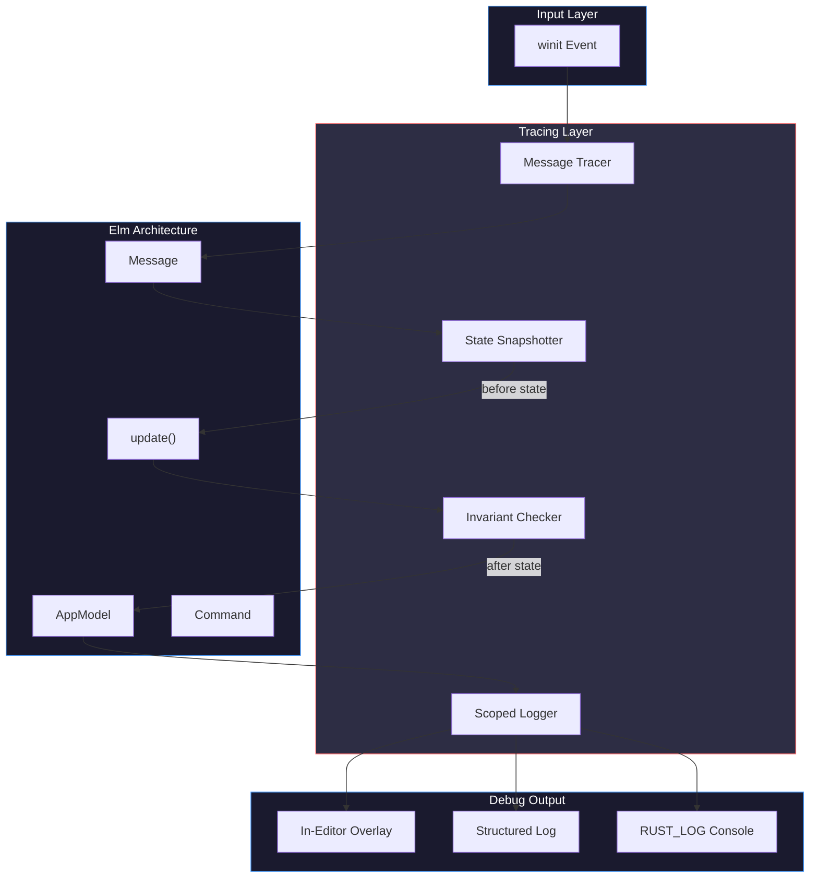
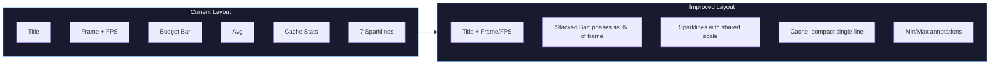

# Instrument app with debug tracing for multi-cursors

## User

lets sketch out how we could instrument the app with debug tracing so that we can more easily debug hard to debug issues wit hpositioning and internal state realted to multi-cursors, use lbirarian and

## Assistant

I'll research how other editors handle debug tracing and examine your current codebase structure.

**Tool Use:** `librarian`

```json
{
  "query": "How do text editors like Zed, Helix, or Lapce implement debug tracing and logging for cursor positions, selections, and internal editor state? Looking for patterns using Rust tracing crate, structured logging, or custom debug overlays.",
  "context": "Building a Rust text editor with multi-cursor support. Need to instrument for debugging positioning bugs and internal state. Using Elm architecture (Message → Update → Command → Render)."
}
```

**Tool Use:** `Read`

```json
{
  "path": "~/code/rust-editor/Cargo.toml"
}
```

**Tool Use:** `glob`

```json
{
  "filePattern": "src/**/*.rs"
}
```

## User

**Tool Cancelled:** `toolu_vrtx_01SMaptMduek1JX5sKB6xYjB`

**Tool Cancelled:** `toolu_vrtx_01A2Td7rj312Dz3N94npxJ7Q`

**Tool Cancelled:** `toolu_vrtx_01AMVdvCfvfj8BA5fBtk4Wv7`

## User

  felll asleep?

## Assistant

Ha! Let me try again.

**Tool Use:** `librarian`

```json
{
  "query": "How do text editors like Zed, Helix, or Lapce implement debug tracing and logging for cursor positions, selections, and internal editor state? Looking for patterns using Rust tracing crate, structured logging, or custom debug overlays.",
  "context": "Building a Rust text editor with multi-cursor support. Need to instrument for debugging positioning bugs and internal state. Using Elm architecture (Message → Update → Command → Render)."
}
```

**Tool Use:** `Read`

```json
{
  "path": "~/code/rust-editor/Cargo.toml"
}
```

**Tool Use:** `glob`

```json
{
  "filePattern": "src/**/*.rs"
}
```

## User

**Tool Result:** `toolu_vrtx_01XP4zWifo2rhaY4cQdd9knD`

```
Perfect! Now I have enough information to create a comprehensive answer. Let me compile all the patterns I've found:

## Debug Instrumentation Patterns for Multi-Cursor Text Editors

Based on analysis of Zed, Helix, and Lapce, here are the key patterns these professional Rust editors use for debugging cursor positions, selections, and internal state:

### **1. Layered Logging Architecture (Zed's approach)**

[Zed uses a sophisticated custom logging system](https://github.com/zed-industries/zed/blob/main/crates/zlog/src/zlog.rs) with scoped context:

```rust
// Core structured logger with scope-based filtering
pub struct Logger {
    pub scope: Scope,  // [&'static str; SCOPE_DEPTH_MAX]
}

// Scoped context macros for hierarchical tracing
#[macro_export]
macro_rules! scoped {
    ($parent:expr => $name:expr) => {{
        $crate::scoped_logger($parent, $name)
    }};
}

// Performance timing with thresholds
pub struct Timer {
    pub logger: Logger,
    pub start_time: std::time::Instant,
    pub warn_if_longer_than: Option<std::time::Duration>,
}

// Usage:
let _timer = time!("cursor_position_update").warn_if_gt(Duration::from_millis(5));
debug!("Cursor moved to offset: {}, display_point: {:?}", offset, display_point);
```

**Key features:**
- Dynamic filtering by module scope (e.g., `editor.selections.cursor`)
- Environment-based configuration via `ZED_LOG` or `RUST_LOG`
- Hierarchical scope depth tracking (max 4 levels)
- Performance threshold warnings for slow operations
- [Color-coded ANSI output](https://github.com/zed-industries/zed/blob/main/crates/zlog/src/sink.rs#L99-L106)

### **2. DAP Message Logging (Zed's Debug Adapter Pattern)**

[Zed provides a dedicated DAP log viewer](https://github.com/zed-industries/zed/blob/main/crates/debugger_tools/src/dap_log.rs) that instruments protocol communication:

```rust
struct LogStore {
    projects: HashMap<WeakEntity<Project>, ProjectState>,
    rpc_tx: UnboundedSender<LogStoreMessage>,
    adapter_log_tx: UnboundedSender<LogStoreMessage>,
}

struct LogStoreMessage {
    id: LogStoreEntryIdentifier<'static>,
    kind: IoKind,  // StdOut | StdErr | StdIn
    command: Option<SharedString>,  // e.g., "launch", "attach", "initialize"
    message: SharedString,
}

// Captures three views of debug state:
enum View {
    AdapterLogs,        // Raw adapter output
    RpcMessages,        // Send/Receive protocol messages
    InitializationSequence,  // Setup handshake only
}
```

**Application to cursor debugging:**
```rust
// Hook into cursor update commands
pub fn log_cursor_update(
    session_id: SessionId,
    old_position: Point,
    new_position: Point,
    reason: &str,
) {
    let message = format!(
        r#"{{"type":"event","event":"cursorUpdate","params":{{"old":{:?},"new":{:?},"reason":"{}"}}}}"#,
        old_position, new_position, reason
    );
    adapter_log_tx.unbounded_send(LogStoreMessage {
        id: LogStoreEntryIdentifier { session_id, project },
        kind: IoKind::StdOut,
        command: Some("cursorMove".into()),
        message: message.into(),
    }).ok();
}
```

### **3. Selection State Tracking (Zed's Multi-Selection Architecture)**

[Zed's SelectionsCollection](https://github.com/zed-industries/zed/blob/main/crates/editor/src/selections_collection.rs) provides precise state management:

```rust
pub struct SelectionsCollection {
    next_selection_id: usize,
    disjoint: Arc<[Selection<Anchor>]>,     // Non-pending, confirmed selections
    pending: Option<PendingSelection>,       // In-progress selection (mouse drag)
    select_mode: SelectMode,
    is_extending: bool,
}

#[derive(Debug, Clone)]
pub struct PendingSelection {
    selection: Selection<Anchor>,
    mode: SelectMode,
}

// Debug output structure
impl fmt::Debug for SelectionsCollection {
    fn fmt(&self, f: &mut fmt::Formatter<'_>) -> fmt::Result {
        f.debug_struct("SelectionsCollection")
            .field("count", &self.count())
            .field("line_mode", &self.line_mode)
            .field("disjoint_selections", &self.disjoint.len())
            .field("pending_selection", &self.pending)
            .field("select_mode", &self.select_mode)
            .finish()
    }
}
```

**Instrumentation pattern:**
```rust
pub fn log_selections_change(
    old_selections: &SelectionsCollection,
    new_selections: &SelectionsCollection,
) {
    debug!("Selections changed: {:#?} -> {:#?}", old_selections, new_selections);
    debug!(
        "Selection counts: {} -> {}",
        old_selections.count(),
        new_selections.count()
    );
    if let Some(pending) = new_selections.pending_anchor() {
        debug!("Pending selection: anchor={:?}, head={:?}", pending.start, pending.end);
    }
}
```

### **4. Tracing with Instrumentation (Lapce's approach)**

[Lapce re-exports the `tracing` crate](https://github.com/lapce/lapce/blob/master/lapce-app/src/tracing.rs) with `#[instrument]` macro support:

```rust
use tracing::{instrument, Instrument, Level, debug, error, event};

#[instrument(level = "debug", skip(editor_data))]
fn handle_cursor_move(
    editor_data: &mut EditorData,
    offset: usize,
    target_line: usize,
) -> Result<()> {
    debug!(offset, target_line, "Moving cursor");

    let old_offset = editor_data.cursor.offset();
    editor_data.cursor.set_offset(offset);

    event!(
        target: "cursor_motion",
        level = Level::DEBUG,
        old_offset,
        new_offset = offset,
        "Cursor position changed"
    );

    Ok(())
}

// Automatic span tracking with async support
let _span = tracing::info_span!(
    "apply_selection_change",
    selection_count = selections.len(),
).entered();
```

**For custom debug overlays:**
```rust
pub fn render_debug_cursor_overlay(
    editor: &Editor,
    viewport: Rect,
) -> Option<String> {
    let mut debug_info = String::new();

    for (idx, selection) in editor.selections.all().iter().enumerate() {
        debug_info.push_str(&format!(
            "#{}: anchor={} head={} reversed={}\n",
            idx,
            selection.anchor,
            selection.head,
            selection.reversed,
        ));
    }

    Some(debug_info)
}
```

### **5. Helix's Event-Driven Logging**

[Helix uses event hooks](https://github.com/helix-editor/helix/blob/master/docs/architecture.md) with functional composition:

```rust
// Core Range structure with implicit debug capability
#[derive(Debug, Clone, Copy, PartialEq, Eq)]
pub struct Range {
    pub anchor: usize,
    pub head: usize,
    pub old_visual_position: Option<(u32, u32)>,
}

impl Range {
    pub fn debug_info(&self, text: RopeSlice) -> String {
        format!(
            "Range {{ anchor: {}, head: {}, len: {}, direction: {:?} }}",
            self.anchor,
            self.head,
            self.len(),
            self.direction()
        )
    }
}

// Selection batch logging
#[derive(Debug, Clone, PartialEq, Eq)]
pub struct Selection {
    ranges: SmallVec<[Range; 1]>,
    primary_index: usize,
}

pub fn log_selection_state(sel: &Selection) {
    log::debug!(
        "Selection with {} ranges, primary: {}",
        sel.ranges.len(),
        sel.primary_index
    );
    for (i, range) in sel.ranges.iter().enumerate() {
        log::trace!("  Range {}: {}", i, range.debug_info(...));
    }
}
```

### **6. Custom Debug Assertions Pattern**

Across all three editors:

```rust
// Validation assertions embedded in cursor operations
pub fn set_cursor_position(&mut self, offset: usize) {
    debug_assert!(
        offset <= self.buffer.len(),
        "Cursor offset {} out of bounds (buffer len: {})",
        offset,
        self.buffer.len()
    );

    debug_assert!(
        is_grapheme_boundary(self.buffer, offset),
        "Cursor at offset {} not on grapheme boundary",
        offset
    );

    self.cursor = offset;
}

// Post-condition checking for multi-cursor operations
pub fn apply_multicursor_edit(&mut self, edits: Vec<Edit>) {
    let before_state = self.debug_state();

    // ... apply edits ...

    debug_assert_eq!(
        self.selections.count(),
        before_state.selection_count,
        "Selection count changed unexpectedly"
    );

    log::debug!("Applied {} edits in {} selections", edits.len(), self.selections.count());
}
```

### **7. Practical Integration Pattern for Your Elm-Like Architecture**

```rust
// Message + Update + Command pattern with instrumentation
#[derive(Debug, Clone)]
pub enum EditorMessage {
    MoveCursor { offset: usize, extend: bool },
    ApplySelection { ranges: Vec<(usize, usize)> },
    EditMultiSelection { edits: Vec<(Range, String)> },
}

pub struct EditorState {
    cursor: usize,
    selections: SelectionsCollection,
    // ... other state
}

#[instrument(level = "debug", skip(self, cmd))]
pub fn update(&mut self, msg: EditorMessage) -> Vec<EditorCommand> {
    let old_state = self.debug_snapshot();

    match msg {
        EditorMessage::MoveCursor { offset, extend } => {
            debug!(offset, extend, "Cursor move requested");

            if extend {
                self.extend_selection_to(offset);
            } else {
                self.collapse_cursor_to(offset);
            }

            self.validate_invariants();
            debug!("Cursor move applied: {} -> {}", old_state.cursor, self.cursor);
        }
        EditorMessage::ApplySelection { ranges } => {
            debug!(range_count = ranges.len(), "Selection apply");
            self.set_selection_ranges(ranges);
            self.validate_invariants();
        }
        EditorMessage::EditMultiSelection { edits } => {
            debug!(edit_count = edits.len(), "Multi-selection edit");
            self.apply_edits(edits);
            self.validate_invariants();
        }
    }

    self.emit_debug_telemetry(&old_state);
    self.collect_commands()
}

fn debug_snapshot(&self) -> EditorDebugState {
    EditorDebugState {
        cursor: self.cursor,
        selection_count: self.selections.count(),
        selection_ranges: self.selections.all_anchors()
            .iter()
            .map(|s| (s.start, s.end))
            .collect(),
    }
}

fn emit_debug_telemetry(&self, before: &EditorDebugState) {
    if self.cursor != before.cursor {
        event!(
            target: "cursor",
            level = Level::DEBUG,
            from = before.cursor,
            to = self.cursor,
            "Cursor repositioned"
        );
    }

    if self.selections.count() != before.selection_count {
        debug!(
            "Selection count changed: {} -> {}",
            before.selection_count,
            self.selections.count()
        );
    }
}

fn validate_invariants(&self) {
    #[cfg(debug_assertions)]
    {
        for (i, sel) in self.selections.all::<Offset>().iter().enumerate() {
            assert!(sel.start <= sel.end,
                "Selection {} inverted: {} > {}", i, sel.start, sel.end);
            assert!(sel.start <= self.buffer.len(),
                "Selection {} start out of bounds", i);
            assert!(sel.end <= self.buffer.len(),
                "Selection {} end out of bounds", i);
        }
    }
}
```

### **Key Takeaways**

1. **Scope-based filtering**: Use hierarchical scope context (like Zed's approach) to dynamically enable/disable detailed logging
2. **Structured events**: Log cursor operations as structured data with context (old→new positions, reason, mode)
3. **Separation of concerns**: Keep RPC/protocol logs separate from application-level cursor logs
4. **Instrumentation macros**: Use `#[instrument]` from the `tracing` crate for automatic span tracking
5. **Validation assertions**: Embed `debug_assert!` checks for cursor boundary conditions and grapheme boundaries
6. **Performance profiling**: Time-bound expensive operations (selection rendering, multi-cursor applies)
7. **Debug overlays**: Render cursor/selection state visually during development (in-editor debug pane)

These patterns align naturally with Elm architecture's Message → Update → Command flow, where you instrument at the Update layer with detailed state transitions.
```

**Tool Result:** `toolu_vrtx_01SDgcCxReuRYT1tvAy3t9bk`

```
{
  "content": "1: [package]\n2: name = \"token\"\n3: version = \"0.1.0\"\n4: edition = \"2021\"\n5: \n6: [features]\n7: default = []\n8: dhat-heap = [\"dhat\"]\n9: \n10: [dependencies]\n11: winit = \"0.30.12\"\n12: softbuffer = \"0.4\"\n13: ropey = \"1.6\"\n14: raw-window-handle = \"0.6\"\n15: \n16: # For font rendering\n17: fontdue = \"0.9.3\"\n18: \n19: # For better error handling\n20: anyhow = \"1.0\"\n21: \n22: # For theming (YAML configuration) and state serialization\n23: serde = { version = \"1\", features = [\"derive\"] }\n24: serde_yaml = \"0.9\"\n25: serde_json = \"1\"\n26: \n27: # Optional: for debugging\n28: env_logger = \"0.11\"\n29: log = \"0.4\"\n30: \n31: # For clipboard support\n32: arboard = \"3.4\"\n33: \n34: # Optional: heap profiling\n35: dhat = { version = \"0.3\", optional = true }\n36: \n37: [dev-dependencies]\n38: divan = \"0.1\"\n39: \n40: [[bench]]\n41: name = \"rope_operations\"\n42: harness = false\n43: \n44: [[bench]]\n45: name = \"glyph_cache\"\n46: harness = false\n47: \n48: [[bench]]\n49: name = \"rendering\"\n50: harness = false\n51: \n52: # Profiling profile: release speed with debug symbols\n53: [profile.profiling]\n54: inherits = \"release\"\n55: debug = true\n56: lto = false\n57: codegen-units = 1",
  "absolutePath": "~/code/rust-editor/Cargo.toml"
}
```

**Tool Result:** `toolu_vrtx_01Aodi7yanU8XTvp5mFf9tq2`

```
[
  "~/code/rust-editor/src/view.rs",
  "~/code/rust-editor/src/messages.rs",
  "~/code/rust-editor/src/app.rs",
  "~/code/rust-editor/src/input.rs",
  "~/code/rust-editor/src/main.rs",
  "~/code/rust-editor/src/model/document.rs",
  "~/code/rust-editor/src/model/editor.rs",
  "~/code/rust-editor/src/model/editor_area.rs",
  "~/code/rust-editor/src/model/mod.rs",
  "~/code/rust-editor/src/model/status_bar.rs",
  "~/code/rust-editor/src/model/ui.rs",
  "~/code/rust-editor/src/commands.rs",
  "~/code/rust-editor/src/perf.rs",
  "~/code/rust-editor/src/overlay.rs",
  "~/code/rust-editor/src/theme.rs",
  "~/code/rust-editor/src/debug_dump.rs",
  "~/code/rust-editor/src/lib.rs",
  "~/code/rust-editor/src/update/app.rs",
  "~/code/rust-editor/src/update/document.rs",
  "~/code/rust-editor/src/update/editor.rs",
  "~/code/rust-editor/src/update/mod.rs",
  "~/code/rust-editor/src/update/ui.rs",
  "~/code/rust-editor/src/update/layout.rs",
  "~/code/rust-editor/src/util.rs"
]
```

## Assistant

Great research! Let me look at your existing debug infrastructure and key model files:

**Tool Use:** `Read`

```json
{
  "path": "~/code/rust-editor/src/debug_dump.rs"
}
```

**Tool Use:** `Read`

```json
{
  "path": "~/code/rust-editor/src/model/editor.rs"
}
```

**Tool Use:** `Read`

```json
{
  "path": "~/code/rust-editor/src/messages.rs"
}
```

## User

**Tool Result:** `toolu_vrtx_01AQrFtrR5fjzELqACt1SVYK`

```
{
  "content": "1: //! Debug state dump for development diagnostics\n2: //!\n3: //! Serializes a snapshot of the application state to JSON for easier debugging.\n4: //! Triggered by F7 in debug builds.\n5: \n6: use serde::Serialize;\n7: use std::collections::HashMap;\n8: \n9: use token::model::{AppModel, LayoutNode, SplitDirection};\n10: \n11: #[derive(Serialize)]\n12: pub struct StateDump {\n13:     pub timestamp: String,\n14:     pub window_size: (u32, u32),\n15:     pub line_height: usize,\n16:     pub char_width: f32,\n17:     pub editor_area: EditorAreaDump,\n18:     pub ui: UiStateDump,\n19: }\n20: \n21: #[derive(Serialize)]\n22: pub struct EditorAreaDump {\n23:     pub focused_group_id: u64,\n24:     pub documents: HashMap<u64, DocumentDump>,\n25:     pub editors: HashMap<u64, EditorDump>,\n26:     pub groups: HashMap<u64, GroupDump>,\n27:     pub layout: LayoutNodeDump,\n28: }\n29: \n30: #[derive(Serialize)]\n31: pub struct DocumentDump {\n32:     pub id: u64,\n33:     pub file_path: Option<String>,\n34:     pub is_modified: bool,\n35:     pub line_count: usize,\n36:     pub char_count: usize,\n37:     pub undo_stack_size: usize,\n38:     pub redo_stack_size: usize,\n39: }\n40: \n41: #[derive(Serialize)]\n42: pub struct EditorDump {\n43:     pub id: u64,\n44:     pub document_id: Option<u64>,\n45:     pub cursors: Vec<CursorDump>,\n46:     pub selections: Vec<SelectionDump>,\n47:     pub active_cursor_index: usize,\n48:     pub viewport: ViewportDump,\n49:     pub has_multiple_cursors: bool,\n50: }\n51: \n52: #[derive(Serialize)]\n53: pub struct CursorDump {\n54:     pub line: usize,\n55:     pub column: usize,\n56:     pub desired_column: Option<usize>,\n57: }\n58: \n59: #[derive(Serialize)]\n60: pub struct SelectionDump {\n61:     pub anchor_line: usize,\n62:     pub anchor_column: usize,\n63:     pub head_line: usize,\n64:     pub head_column: usize,\n65:     pub is_empty: bool,\n66: }\n67: \n68: #[derive(Serialize)]\n69: pub struct ViewportDump {\n70:     pub top_line: usize,\n71:     pub left_column: usize,\n72:     pub visible_lines: usize,\n73:     pub visible_columns: usize,\n74: }\n75: \n76: #[derive(Serialize)]\n77: pub struct GroupDump {\n78:     pub id: u64,\n79:     pub tabs: Vec<TabDump>,\n80:     pub active_tab_index: usize,\n81:     pub rect: RectDump,\n82: }\n83: \n84: #[derive(Serialize)]\n85: pub struct TabDump {\n86:     pub id: u64,\n87:     pub editor_id: u64,\n88:     pub is_pinned: bool,\n89:     pub is_preview: bool,\n90: }\n91: \n92: #[derive(Serialize)]\n93: pub struct RectDump {\n94:     pub x: f32,\n95:     pub y: f32,\n96:     pub width: f32,\n97:     pub height: f32,\n98: }\n99: \n100: #[derive(Serialize)]\n101: pub enum LayoutNodeDump {\n102:     Group(u64),\n103:     Split {\n104:         direction: String,\n105:         children: Vec<LayoutNodeDump>,\n106:         ratios: Vec<f32>,\n107:     },\n108: }\n109: \n110: #[derive(Serialize)]\n111: pub struct UiStateDump {\n112:     pub cursor_visible: bool,\n113:     pub status_bar_segments: usize,\n114: }\n115: \n116: impl StateDump {\n117:     pub fn from_model(model: &AppModel) -> Self {\n118:         let now = chrono_timestamp();\n119: \n120:         Self {\n121:             timestamp: now.clone(),\n122:             window_size: model.window_size,\n123:             line_height: model.line_height,\n124:             char_width: model.char_width,\n125:             editor_area: EditorAreaDump::from_model(model),\n126:             ui: UiStateDump {\n127:                 cursor_visible: model.ui.cursor_visible,\n128:                 status_bar_segments: model.ui.status_bar.all_segments().count(),\n129:             },\n130:         }\n131:     }\n132: \n133:     pub fn to_json(&self) -> String {\n134:         serde_json::to_string_pretty(self).unwrap_or_else(|e| format!(\"{{\\\"error\\\": \\\"{}\\\"}}\", e))\n135:     }\n136: \n137:     pub fn save_to_file(&self) -> std::io::Result<String> {\n138:         let filename = format!(\"{}-state-dump.json\", self.timestamp);\n139:         std::fs::write(&filename, self.to_json())?;\n140:         Ok(filename)\n141:     }\n142: }\n143: \n144: impl EditorAreaDump {\n145:     fn from_model(model: &AppModel) -> Self {\n146:         let area = &model.editor_area;\n147: \n148:         let documents: HashMap<u64, DocumentDump> = area\n149:             .documents\n150:             .iter()\n151:             .map(|(id, doc)| {\n152:                 (\n153:                     id.0,\n154:                     DocumentDump {\n155:                         id: id.0,\n156:                         file_path: doc.file_path.as_ref().map(|p| p.display().to_string()),\n157:                         is_modified: doc.is_modified,\n158:                         line_count: doc.buffer.len_lines(),\n159:                         char_count: doc.buffer.len_chars(),\n160:                         undo_stack_size: doc.undo_stack.len(),\n161:                         redo_stack_size: doc.redo_stack.len(),\n162:                     },\n163:                 )\n164:             })\n165:             .collect();\n166: \n167:         let editors: HashMap<u64, EditorDump> = area\n168:             .editors\n169:             .iter()\n170:             .map(|(id, editor)| {\n171:                 (\n172:                     id.0,\n173:                     EditorDump {\n174:                         id: id.0,\n175:                         document_id: editor.document_id.map(|d| d.0),\n176:                         cursors: editor\n177:                             .cursors\n178:                             .iter()\n179:                             .map(|c| CursorDump {\n180:                                 line: c.line,\n181:                                 column: c.column,\n182:                                 desired_column: c.desired_column,\n183:                             })\n184:                             .collect(),\n185:                         selections: editor\n186:                             .selections\n187:                             .iter()\n188:                             .map(|s| SelectionDump {\n189:                                 anchor_line: s.anchor.line,\n190:                                 anchor_column: s.anchor.column,\n191:                                 head_line: s.head.line,\n192:                                 head_column: s.head.column,\n193:                                 is_empty: s.is_empty(),\n194:                             })\n195:                             .collect(),\n196:                         active_cursor_index: editor.active_cursor_index,\n197:                         viewport: ViewportDump {\n198:                             top_line: editor.viewport.top_line,\n199:                             left_column: editor.viewport.left_column,\n200:                             visible_lines: editor.viewport.visible_lines,\n201:                             visible_columns: editor.viewport.visible_columns,\n202:                         },\n203:                         has_multiple_cursors: editor.cursors.len() > 1,\n204:                     },\n205:                 )\n206:             })\n207:             .collect();\n208: \n209:         let groups: HashMap<u64, GroupDump> = area\n210:             .groups\n211:             .iter()\n212:             .map(|(id, group)| {\n213:                 (\n214:                     id.0,\n215:                     GroupDump {\n216:                         id: id.0,\n217:                         tabs: group\n218:                             .tabs\n219:                             .iter()\n220:                             .map(|t| TabDump {\n221:                                 id: t.id.0,\n222:                                 editor_id: t.editor_id.0,\n223:                                 is_pinned: t.is_pinned,\n224:                                 is_preview: t.is_preview,\n225:                             })\n226:                             .collect(),\n227:                         active_tab_index: group.active_tab_index,\n228:                         rect: RectDump {\n229:                             x: group.rect.x,\n230:                             y: group.rect.y,\n231:                             width: group.rect.width,\n232:                             height: group.rect.height,\n233:                         },\n234:                     },\n235:                 )\n236:             })\n237:             .collect();\n238: \n239:         Self {\n240:             focused_group_id: area.focused_group_id.0,\n241:             documents,\n242:             editors,\n243:             groups,\n244:             layout: layout_node_dump(&area.layout),\n245:         }\n246:     }\n247: }\n248: \n249: fn layout_node_dump(node: &LayoutNode) -> LayoutNodeDump {\n250:     match node {\n251:         LayoutNode::Group(id) => LayoutNodeDump::Group(id.0),\n252:         LayoutNode::Split(container) => LayoutNodeDump::Split {\n253:             direction: match container.direction {\n254:                 SplitDirection::Horizontal => \"horizontal\".to_string(),\n255:                 SplitDirection::Vertical => \"vertical\".to_string(),\n256:             },\n257:             children: container.children.iter().map(layout_node_dump).collect(),\n258:             ratios: container.ratios.clone(),\n259:         },\n260:     }\n261: }\n262: \n263: fn chrono_timestamp() -> String {\n264:     use std::time::{SystemTime, UNIX_EPOCH};\n265: \n266:     let now = SystemTime::now()\n267:         .duration_since(UNIX_EPOCH)\n268:         .unwrap_or_default();\n269:     let secs = now.as_secs();\n270: \n271:     let days_since_epoch = secs / 86400;\n272:     let secs_today = secs % 86400;\n273: \n274:     let hours = secs_today / 3600;\n275:     let minutes = (secs_today % 3600) / 60;\n276:     let seconds = secs_today % 60;\n277: \n278:     let (year, month, day) = days_to_ymd(days_since_epoch as i64);\n279: \n280:     format!(\n281:         \"{:04}-{:02}-{:02}-{:02}{:02}{:02}\",\n282:         year, month, day, hours, minutes, seconds\n283:     )\n284: }\n285: \n286: fn days_to_ymd(days: i64) -> (i32, u32, u32) {\n287:     let days = days + 719468;\n288:     let era = if days >= 0 { days } else { days - 146096 } / 146097;\n289:     let doe = (days - era * 146097) as u32;\n290:     let yoe = (doe - doe / 1460 + doe / 36524 - doe / 146096) / 365;\n291:     let y = yoe as i64 + era * 400;\n292:     let doy = doe - (365 * yoe + yoe / 4 - yoe / 100);\n293:     let mp = (5 * doy + 2) / 153;\n294:     let d = doy - (153 * mp + 2) / 5 + 1;\n295:     let m = if mp < 10 { mp + 3 } else { mp - 9 };\n296:     let year = if m <= 2 { y + 1 } else { y };\n297:     (year as i32, m, d)\n298: }",
  "absolutePath": "~/code/rust-editor/src/debug_dump.rs"
}
```

**Tool Result:** `toolu_vrtx_01Sp2QaZ74oJwZk76ynUZSb3`

```
{
  "content": "1: //! Editor state - cursor, viewport, selections, and view-specific state\n2: \n3: use super::document::Document;\n4: use super::editor_area::{DocumentId, EditorId};\n5: use crate::util::{char_type, CharType};\n6: \n7: /// Strategy for revealing the cursor when it's outside the viewport\n8: #[derive(Debug, Clone, Copy, Default, PartialEq, Eq)]\n9: pub enum ScrollRevealMode {\n10:     /// Minimal scroll: move viewport just enough to bring cursor into safe zone\n11:     #[default]\n12:     Minimal,\n13:     /// Top-aligned: place cursor at the top of the safe zone (respecting top margin)\n14:     TopAligned,\n15:     /// Bottom-aligned: place cursor at the bottom of the safe zone (respecting bottom margin)\n16:     BottomAligned,\n17:     /// Centered: place cursor in the middle of the viewport\n18:     Centered,\n19: }\n20: \n21: /// A position in the document (line and column)\n22: #[derive(Debug, Clone, Copy, Default, PartialEq, Eq, PartialOrd, Ord)]\n23: pub struct Position {\n24:     /// Line number (0-indexed)\n25:     pub line: usize,\n26:     /// Column number (0-indexed)\n27:     pub column: usize,\n28: }\n29: \n30: impl Position {\n31:     /// Create a new position\n32:     pub const fn new(line: usize, column: usize) -> Self {\n33:         Self { line, column }\n34:     }\n35: }\n36: \n37: /// A text selection with anchor (start) and head (cursor end)\n38: #[derive(Debug, Clone, Copy, Default, PartialEq, Eq)]\n39: pub struct Selection {\n40:     /// Where the selection started (fixed point)\n41:     pub anchor: Position,\n42:     /// Where the cursor is (moving point)\n43:     pub head: Position,\n44: }\n45: \n46: impl Selection {\n47:     /// Create a new empty selection at a position\n48:     pub fn new(pos: Position) -> Self {\n49:         Self {\n50:             anchor: pos,\n51:             head: pos,\n52:         }\n53:     }\n54: \n55:     /// Create a selection from anchor to head\n56:     pub fn from_anchor_head(anchor: Position, head: Position) -> Self {\n57:         Self { anchor, head }\n58:     }\n59: \n60:     /// Check if selection is empty (cursor without selection)\n61:     pub fn is_empty(&self) -> bool {\n62:         self.anchor == self.head\n63:     }\n64: \n65:     /// Get the start of the selection (smaller position)\n66:     pub fn start(&self) -> Position {\n67:         if self.anchor <= self.head {\n68:             self.anchor\n69:         } else {\n70:             self.head\n71:         }\n72:     }\n73: \n74:     /// Get the end of the selection (larger position)\n75:     pub fn end(&self) -> Position {\n76:         if self.anchor <= self.head {\n77:             self.head\n78:         } else {\n79:             self.anchor\n80:         }\n81:     }\n82: \n83:     /// Check if the selection is reversed (head before anchor)\n84:     pub fn is_reversed(&self) -> bool {\n85:         self.head < self.anchor\n86:     }\n87: \n88:     /// Extend selection to new head position\n89:     pub fn extend_to(&mut self, pos: Position) {\n90:         self.head = pos;\n91:     }\n92: \n93:     /// Collapse selection to its start (both anchor and head at start)\n94:     pub fn collapse_to_start(&mut self) {\n95:         let s = self.start();\n96:         self.anchor = s;\n97:         self.head = s;\n98:     }\n99: \n100:     /// Collapse selection to its end (both anchor and head at end)\n101:     pub fn collapse_to_end(&mut self) {\n102:         let e = self.end();\n103:         self.anchor = e;\n104:         self.head = e;\n105:     }\n106: \n107:     /// Check if a position is contained within the selection\n108:     pub fn contains(&self, pos: Position) -> bool {\n109:         let start = self.start();\n110:         let end = self.end();\n111:         pos >= start && pos < end\n112:     }\n113: \n114:     /// Extract selected text from document\n115:     pub fn get_text(&self, document: &Document) -> String {\n116:         if self.is_empty() {\n117:             return String::new();\n118:         }\n119:         let start = self.start();\n120:         let end = self.end();\n121:         let start_offset = document.cursor_to_offset(start.line, start.column);\n122:         let end_offset = document.cursor_to_offset(end.line, end.column);\n123:         document.buffer.slice(start_offset..end_offset).to_string()\n124:     }\n125: \n126:     /// Create a selection spanning from start to end positions\n127:     pub fn from_positions(start: Position, end: Position) -> Self {\n128:         Self {\n129:             anchor: start,\n130:             head: end,\n131:         }\n132:     }\n133: }\n134: \n135: /// Cursor position in the document\n136: #[derive(Debug, Clone, Copy, Default)]\n137: pub struct Cursor {\n138:     /// Line number (0-indexed)\n139:     pub line: usize,\n140:     /// Column number (0-indexed)\n141:     pub column: usize,\n142:     /// Desired column for vertical movement (preserves position when moving through short lines)\n143:     pub desired_column: Option<usize>,\n144: }\n145: \n146: impl Cursor {\n147:     /// Create a new cursor at position (0, 0)\n148:     pub fn new() -> Self {\n149:         Self::default()\n150:     }\n151: \n152:     /// Create a cursor at a specific position\n153:     pub fn at(line: usize, column: usize) -> Self {\n154:         Self {\n155:             line,\n156:             column,\n157:             desired_column: None,\n158:         }\n159:     }\n160: \n161:     /// Convert to Position (without desired_column)\n162:     pub fn to_position(&self) -> Position {\n163:         Position::new(self.line, self.column)\n164:     }\n165: \n166:     /// Create from Position\n167:     pub fn from_position(pos: Position) -> Self {\n168:         Self::at(pos.line, pos.column)\n169:     }\n170: \n171:     /// Reset the desired column (called after horizontal movement)\n172:     pub fn clear_desired_column(&mut self) {\n173:         self.desired_column = None;\n174:     }\n175: \n176:     /// Set the desired column (called before vertical movement if not set)\n177:     pub fn remember_column(&mut self) {\n178:         if self.desired_column.is_none() {\n179:             self.desired_column = Some(self.column);\n180:         }\n181:     }\n182: }\n183: \n184: /// Viewport state - what portion of the document is visible\n185: #[derive(Debug, Clone)]\n186: pub struct Viewport {\n187:     /// First visible line (0-indexed)\n188:     pub top_line: usize,\n189:     /// First visible column (for horizontal scrolling)\n190:     pub left_column: usize,\n191:     /// Number of lines that fit in the viewport\n192:     pub visible_lines: usize,\n193:     /// Number of columns that fit in the viewport\n194:     pub visible_columns: usize,\n195: }\n196: \n197: impl Viewport {\n198:     /// Create a new viewport with the given dimensions\n199:     pub fn new(visible_lines: usize, visible_columns: usize) -> Self {\n200:         Self {\n201:             top_line: 0,\n202:             left_column: 0,\n203:             visible_lines,\n204:             visible_columns,\n205:         }\n206:     }\n207: }\n208: \n209: impl Default for Viewport {\n210:     fn default() -> Self {\n211:         Self::new(25, 80)\n212:     }\n213: }\n214: \n215: /// State for an in-progress rectangle selection (middle mouse drag)\n216: #[derive(Debug, Clone, Default)]\n217: pub struct RectangleSelectionState {\n218:     /// Whether a rectangle selection is currently active\n219:     pub active: bool,\n220:     /// Starting position (where mouse was pressed)\n221:     pub start: Position,\n222:     /// Current position (where mouse is now)\n223:     pub current: Position,\n224:     /// Preview cursor positions (computed during drag, shown before commit)\n225:     pub preview_cursors: Vec<Position>,\n226: }\n227: \n228: impl RectangleSelectionState {\n229:     /// Get the top-left corner of the rectangle\n230:     pub fn top_left(&self) -> Position {\n231:         Position::new(\n232:             self.start.line.min(self.current.line),\n233:             self.start.column.min(self.current.column),\n234:         )\n235:     }\n236: \n237:     /// Get the bottom-right corner of the rectangle\n238:     pub fn bottom_right(&self) -> Position {\n239:         Position::new(\n240:             self.start.line.max(self.current.line),\n241:             self.start.column.max(self.current.column),\n242:         )\n243:     }\n244: }\n245: \n246: /// Tracks occurrence selection state for Cmd+J (select next occurrence)\n247: #[derive(Debug, Clone, Default)]\n248: pub struct OccurrenceState {\n249:     /// The text being searched for\n250:     pub search_text: String,\n251:     /// Stack of cursor indices added via Cmd+J (for undo with Shift+Cmd+J)\n252:     pub added_cursor_indices: Vec<usize>,\n253:     /// Last search position (byte offset) for finding \"next\"\n254:     pub last_search_offset: usize,\n255: }\n256: \n257: /// Editor state - view-specific state for editing a document\n258: ///\n259: /// Supports multiple cursors and selections. The \"active\" cursor is the one\n260: /// the user is currently focused on (for viewport scrolling, line highlighting, etc.).\n261: /// Cursors are stored sorted by document position, but active_cursor_index\n262: /// tracks which one is the user's focus.\n263: #[derive(Debug, Clone)]\n264: pub struct EditorState {\n265:     /// Unique identifier (set when added to EditorArea)\n266:     pub id: Option<EditorId>,\n267:     /// The document this editor is viewing (set when added to EditorArea)\n268:     pub document_id: Option<DocumentId>,\n269:     /// All cursors sorted by document position (line, then column)\n270:     pub cursors: Vec<Cursor>,\n271:     /// Selections corresponding to each cursor (parallel to cursors)\n272:     pub selections: Vec<Selection>,\n273:     /// Index of the \"active\" cursor - the one user is focused on.\n274:     /// This cursor drives viewport scrolling and gets primary highlighting.\n275:     /// Valid range: 0..cursors.len()\n276:     pub active_cursor_index: usize,\n277:     /// Viewport showing which portion of the document is visible\n278:     pub viewport: Viewport,\n279:     /// Number of lines of padding to maintain above/below cursor when scrolling\n280:     pub scroll_padding: usize,\n281:     /// Rectangle selection state (for middle mouse drag)\n282:     pub rectangle_selection: RectangleSelectionState,\n283:     /// Occurrence selection state (for Cmd+J \"select next occurrence\")\n284:     pub occurrence_state: Option<OccurrenceState>,\n285:     /// Selection history stack for expand/shrink selection (Option+Up/Down)\n286:     /// Push before expanding, pop when shrinking\n287:     pub selection_history: Vec<Selection>,\n288: }\n289: \n290: impl EditorState {\n291:     /// Create a new editor state with default settings\n292:     pub fn new() -> Self {\n293:         let cursor = Cursor::new();\n294:         let selection = Selection::new(cursor.to_position());\n295:         Self {\n296:             id: None,\n297:             document_id: None,\n298:             cursors: vec![cursor],\n299:             selections: vec![selection],\n300:             active_cursor_index: 0,\n301:             viewport: Viewport::default(),\n302:             scroll_padding: 1,\n303:             rectangle_selection: RectangleSelectionState::default(),\n304:             occurrence_state: None,\n305:             selection_history: Vec::new(),\n306:         }\n307:     }\n308: \n309:     /// Create an editor state with specific viewport dimensions\n310:     pub fn with_viewport(visible_lines: usize, visible_columns: usize) -> Self {\n311:         let cursor = Cursor::new();\n312:         let selection = Selection::new(cursor.to_position());\n313:         Self {\n314:             id: None,\n315:             document_id: None,\n316:             cursors: vec![cursor],\n317:             selections: vec![selection],\n318:             active_cursor_index: 0,\n319:             viewport: Viewport::new(visible_lines, visible_columns),\n320:             scroll_padding: 1,\n321:             rectangle_selection: RectangleSelectionState::default(),\n322:             occurrence_state: None,\n323:             selection_history: Vec::new(),\n324:         }\n325:     }\n326: \n327:     /// Clear selection history (called when selection is changed by other means)\n328:     pub fn clear_selection_history(&mut self) {\n329:         self.selection_history.clear();\n330:     }\n331: \n332:     /// Get the primary cursor (read-only)\n333:     #[inline]\n334:     pub fn cursor(&self) -> &Cursor {\n335:         &self.cursors[0]\n336:     }\n337: \n338:     /// Get the primary cursor (mutable)\n339:     #[inline]\n340:     pub fn cursor_mut(&mut self) -> &mut Cursor {\n341:         &mut self.cursors[0]\n342:     }\n343: \n344:     /// Get the primary selection (read-only)\n345:     #[inline]\n346:     pub fn selection(&self) -> &Selection {\n347:         &self.selections[0]\n348:     }\n349: \n350:     /// Get the primary selection (mutable)\n351:     #[inline]\n352:     pub fn selection_mut(&mut self) -> &mut Selection {\n353:         &mut self.selections[0]\n354:     }\n355: \n356:     /// Get the active cursor (the one user is focused on)\n357:     #[inline]\n358:     pub fn active_cursor(&self) -> &Cursor {\n359:         &self.cursors[self.active_cursor_index]\n360:     }\n361: \n362:     /// Get the active cursor (mutable)\n363:     #[inline]\n364:     pub fn active_cursor_mut(&mut self) -> &mut Cursor {\n365:         &mut self.cursors[self.active_cursor_index]\n366:     }\n367: \n368:     /// Get the active selection (corresponding to active cursor)\n369:     #[inline]\n370:     pub fn active_selection(&self) -> &Selection {\n371:         &self.selections[self.active_cursor_index]\n372:     }\n373: \n374:     /// Get the active selection (mutable)\n375:     #[inline]\n376:     pub fn active_selection_mut(&mut self) -> &mut Selection {\n377:         &mut self.selections[self.active_cursor_index]\n378:     }\n379: \n380:     /// Set which cursor is active by index\n381:     /// Panics if index is out of bounds\n382:     pub fn set_active_cursor(&mut self, index: usize) {\n383:         assert!(\n384:             index < self.cursors.len(),\n385:             \"active cursor index out of bounds\"\n386:         );\n387:         self.active_cursor_index = index;\n388:     }\n389: \n390:     /// Check if there are multiple cursors\n391:     pub fn has_multiple_cursors(&self) -> bool {\n392:         self.cursors.len() > 1\n393:     }\n394: \n395:     /// Get the number of cursors\n396:     pub fn cursor_count(&self) -> usize {\n397:         self.cursors.len()\n398:     }\n399: \n400:     /// Collapse all cursors to just the primary cursor\n401:     pub fn collapse_to_primary(&mut self) {\n402:         self.cursors.truncate(1);\n403:         self.selections.truncate(1);\n404:         self.active_cursor_index = 0;\n405:     }\n406: \n407:     /// Update the primary selection to match the primary cursor (for non-selection moves)\n408:     pub fn clear_selection(&mut self) {\n409:         let pos = self.cursors[0].to_position();\n410:         self.selections[0] = Selection::new(pos);\n411:     }\n412: \n413:     /// Collapse all selections so that anchor == head == cursor position for each cursor.\n414:     /// This should be called after all non-shift cursor movements to maintain invariants.\n415:     pub fn collapse_selections_to_cursors(&mut self) {\n416:         for (cursor, selection) in self.cursors.iter().zip(self.selections.iter_mut()) {\n417:             let pos = cursor.to_position();\n418:             selection.anchor = pos;\n419:             selection.head = pos;\n420:         }\n421:     }\n422: \n423:     /// Toggle a cursor at the given position\n424:     /// If a cursor exists at that position, remove it (unless it's the only one)\n425:     /// If no cursor exists there, add one and make it active\n426:     /// Returns true if a cursor was added, false if removed\n427:     pub fn toggle_cursor_at(&mut self, line: usize, column: usize) -> bool {\n428:         // Check if there's already a cursor at this position\n429:         let existing_idx = self\n430:             .cursors\n431:             .iter()\n432:             .position(|c| c.line == line && c.column == column);\n433: \n434:         if let Some(idx) = existing_idx {\n435:             // Cursor exists - remove it if not the only one\n436:             if self.cursors.len() > 1 {\n437:                 self.cursors.remove(idx);\n438:                 self.selections.remove(idx);\n439:                 // Update active cursor index if we removed a cursor before it\n440:                 if idx < self.active_cursor_index {\n441:                     self.active_cursor_index -= 1;\n442:                 } else if idx == self.active_cursor_index {\n443:                     // Removed the active cursor - fall back to 0\n444:                     self.active_cursor_index = 0;\n445:                 }\n446:                 return false;\n447:             }\n448:             // Can't remove the only cursor\n449:             return false;\n450:         }\n451: \n452:         // No cursor at this position - add one and make it active\n453:         let new_cursor = Cursor::at(line, column);\n454:         let new_selection = Selection::new(Position::new(line, column));\n455:         self.cursors.push(new_cursor);\n456:         self.selections.push(new_selection);\n457: \n458:         // Set new cursor as active before sorting (sort_cursors will track it)\n459:         self.active_cursor_index = self.cursors.len() - 1;\n460: \n461:         // Sort cursors by position (line, then column) to maintain order\n462:         self.sort_cursors();\n463: \n464:         true\n465:     }\n466: \n467:     /// Add a cursor at the given position (without toggle behavior)\n468:     /// The new cursor becomes the active cursor\n469:     pub fn add_cursor_at(&mut self, line: usize, column: usize) {\n470:         // Check if cursor already exists\n471:         let exists = self\n472:             .cursors\n473:             .iter()\n474:             .any(|c| c.line == line && c.column == column);\n475:         if exists {\n476:             return;\n477:         }\n478: \n479:         let new_cursor = Cursor::at(line, column);\n480:         let new_selection = Selection::new(Position::new(line, column));\n481:         self.cursors.push(new_cursor);\n482:         self.selections.push(new_selection);\n483: \n484:         // Set new cursor as active before sorting (sort_cursors will track it)\n485:         self.active_cursor_index = self.cursors.len() - 1;\n486: \n487:         self.sort_cursors();\n488:     }\n489: \n490:     /// Sort cursors by position (line, then column)\n491:     fn sort_cursors(&mut self) {\n492:         // Remember the active cursor's position before sorting\n493:         let active_cursor_pos = self.cursors[self.active_cursor_index].to_position();\n494: \n495:         // Create pairs of (cursor, selection, original_index), sort by cursor position\n496:         let mut pairs: Vec<_> = self\n497:             .cursors\n498:             .iter()\n499:             .cloned()\n500:             .zip(self.selections.iter().cloned())\n[... 223 lines omitted ...]\n501:     }\n502: \n503:     /// Get buffer offset from primary cursor position\n504:     pub fn cursor_offset(&self, document: &Document) -> usize {\n505:         document.cursor_to_offset(self.cursors[0].line, self.cursors[0].column)\n506:     }\n507: \n508:     /// Get the length of the current line (based on primary cursor)\n509:     pub fn current_line_length(&self, document: &Document) -> usize {\n510:         document.line_length(self.cursors[0].line)\n511:     }\n512: \n513:     /// Get word under primary cursor (using char_type for boundaries)\n514:     /// Returns (word, start_position, end_position) or None if cursor not on a word\n515:     pub fn word_under_cursor(&self, document: &Document) -> Option<(String, Position, Position)> {\n516:         self.word_under_cursor_at(document, 0)\n517:     }\n518: \n519:     /// Get word under cursor at specified index (using char_type for boundaries)\n520:     /// Returns (word, start_position, end_position) or None if cursor not on a word\n521:     pub fn word_under_cursor_at(\n522:         &self,\n523:         document: &Document,\n524:         idx: usize,\n525:     ) -> Option<(String, Position, Position)> {\n526:         let cursor = &self.cursors[idx];\n527:         let line_content = document.get_line(cursor.line)?;\n528: \n529:         if line_content.is_empty() {\n530:             return None;\n531:         }\n532: \n533:         // Remove trailing newline for character processing\n534:         let line_content = line_content.trim_end_matches('\\n');\n535:         if line_content.is_empty() {\n536:             return None;\n537:         }\n538: \n539:         // Convert to chars first, then clamp column to char count (not byte length!)\n540:         let chars: Vec<char> = line_content.chars().collect();\n541:         if chars.is_empty() {\n542:             return None;\n543:         }\n544: \n545:         // FIX: clamp to chars.len(), not line_content.len() (which is bytes)\n546:         let col = cursor.column.min(chars.len().saturating_sub(1));\n547: \n548:         // Check if cursor is on a word character\n549:         if char_type(chars[col]) != CharType::WordChar {\n550:             return None;\n551:         }\n552: \n553:         // Find word boundaries using char_type\n554:         let mut start = col;\n555:         while start > 0 && char_type(chars[start - 1]) == CharType::WordChar {\n556:             start -= 1;\n557:         }\n558: \n559:         let mut end = col;\n560:         while end < chars.len() && char_type(chars[end]) == CharType::WordChar {\n561:             end += 1;\n562:         }\n563: \n564:         if start == end {\n565:             return None; // Cursor not on a word\n566:         }\n567: \n568:         let word: String = chars[start..end].iter().collect();\n569:         Some((\n570:             word,\n571:             Position::new(cursor.line, start),\n572:             Position::new(cursor.line, end),\n573:         ))\n574:     }\n575: \n576:     /// Assert cursor/selection invariants (debug builds only)\n577:     #[cfg(debug_assertions)]\n578:     pub fn assert_invariants(&self) {\n579:         debug_assert!(!self.cursors.is_empty(), \"Must have at least one cursor\");\n580:         debug_assert_eq!(\n581:             self.cursors.len(),\n582:             self.selections.len(),\n583:             \"Cursor and selection counts must match\"\n584:         );\n585:         for (i, (cursor, selection)) in self.cursors.iter().zip(&self.selections).enumerate() {\n586:             debug_assert_eq!(\n587:                 cursor.to_position(),\n588:                 selection.head,\n589:                 \"Cursor {} position must match selection head\",\n590:                 i\n591:             );\n592:         }\n593:     }\n594: \n595:     /// No-op in release builds\n596:     #[cfg(not(debug_assertions))]\n597:     #[inline]\n598:     pub fn assert_invariants(&self) {}\n599: \n600:     // =========================================================================\n601:     // Per-cursor movement primitives (Phase 0)\n602:     // =========================================================================\n603: \n604:     /// Move a single cursor left by one character\n605:     pub fn move_cursor_left_at(&mut self, doc: &Document, idx: usize) {\n606:         let cursor = &mut self.cursors[idx];\n607:         if cursor.column > 0 {\n608:             cursor.column -= 1;\n609:             cursor.desired_column = None;\n610:         } else if cursor.line > 0 {\n611:             cursor.line -= 1;\n612:             cursor.column = doc.line_length(cursor.line);\n613:             cursor.desired_column = None;\n614:         }\n615:     }\n616: \n617:     /// Move a single cursor right by one character\n618:     pub fn move_cursor_right_at(&mut self, doc: &Document, idx: usize) {\n619:         let cursor = &mut self.cursors[idx];\n620:         let line_len = doc.line_length(cursor.line);\n621:         if cursor.column < line_len {\n622:             cursor.column += 1;\n623:             cursor.desired_column = None;\n624:         } else if cursor.line < doc.line_count().saturating_sub(1) {\n625:             cursor.line += 1;\n626:             cursor.column = 0;\n627:             cursor.desired_column = None;\n628:         }\n629:     }\n630: \n631:     /// Move a single cursor up by one line\n632:     pub fn move_cursor_up_at(&mut self, doc: &Document, idx: usize) {\n633:         let cursor = &mut self.cursors[idx];\n634:         if cursor.line > 0 {\n635:             cursor.line -= 1;\n636:             let desired = cursor.desired_column.unwrap_or(cursor.column);\n637:             let line_len = doc.line_length(cursor.line);\n638:             cursor.column = desired.min(line_len);\n639:             cursor.desired_column = Some(desired);\n640:         }\n641:     }\n642: \n643:     /// Move a single cursor down by one line\n644:     pub fn move_cursor_down_at(&mut self, doc: &Document, idx: usize) {\n645:         let cursor = &mut self.cursors[idx];\n646:         if cursor.line < doc.line_count().saturating_sub(1) {\n647:             cursor.line += 1;\n648:             let desired = cursor.desired_column.unwrap_or(cursor.column);\n649:             let line_len = doc.line_length(cursor.line);\n650:             cursor.column = desired.min(line_len);\n651:             cursor.desired_column = Some(desired);\n652:         }\n653:     }\n654: \n655:     /// Move a single cursor to line start (smart: first non-ws or column 0)\n656:     pub fn move_cursor_line_start_at(&mut self, doc: &Document, idx: usize) {\n657:         let cursor = &mut self.cursors[idx];\n658:         let first_non_ws = doc.first_non_whitespace_column(cursor.line);\n659:         if cursor.column == first_non_ws {\n660:             cursor.column = 0;\n661:         } else {\n662:             cursor.column = first_non_ws;\n663:         }\n664:         cursor.desired_column = None;\n665:     }\n666: \n667:     /// Move a single cursor to line end (smart: last non-ws or line end)\n668:     pub fn move_cursor_line_end_at(&mut self, doc: &Document, idx: usize) {\n669:         let cursor = &mut self.cursors[idx];\n670:         let line_len = doc.line_length(cursor.line);\n671:         let last_non_ws = doc.last_non_whitespace_column(cursor.line);\n672:         if cursor.column == last_non_ws {\n673:             cursor.column = line_len;\n674:         } else {\n675:             cursor.column = last_non_ws;\n676:         }\n677:         cursor.desired_column = None;\n678:     }\n679: \n680:     /// Move a single cursor to document start\n681:     pub fn move_cursor_document_start_at(&mut self, idx: usize) {\n682:         let cursor = &mut self.cursors[idx];\n683:         cursor.line = 0;\n684:         cursor.column = 0;\n685:         cursor.desired_column = None;\n686:     }\n687: \n688:     /// Move a single cursor to document end\n689:     pub fn move_cursor_document_end_at(&mut self, doc: &Document, idx: usize) {\n690:         let cursor = &mut self.cursors[idx];\n691:         cursor.line = doc.line_count().saturating_sub(1);\n692:         cursor.column = doc.line_length(cursor.line);\n693:         cursor.desired_column = None;\n694:     }\n695: \n696:     /// Move a single cursor up by `jump` lines (for page up)\n697:     pub fn page_up_at(&mut self, doc: &Document, jump: usize, idx: usize) {\n698:         let cursor = &mut self.cursors[idx];\n699:         cursor.line = cursor.line.saturating_sub(jump);\n700:         let desired = cursor.desired_column.unwrap_or(cursor.column);\n701:         let line_len = doc.line_length(cursor.line);\n702:         cursor.column = desired.min(line_len);\n703:         cursor.desired_column = Some(desired);\n704:     }\n705: \n706:     /// Move a single cursor down by `jump` lines (for page down)\n707:     pub fn page_down_at(&mut self, doc: &Document, jump: usize, idx: usize) {\n708:         let cursor = &mut self.cursors[idx];\n709:         let max_line = doc.line_count().saturating_sub(1);\n710:         cursor.line = (cursor.line + jump).min(max_line);\n711:         let desired = cursor.desired_column.unwrap_or(cursor.column);\n712:         let line_len = doc.line_length(cursor.line);\n713:         cursor.column = desired.min(line_len);\n714:         cursor.desired_column = Some(desired);\n715:     }\n716: \n717:     /// Move a single cursor one word left\n718:     pub fn move_cursor_word_left_at(&mut self, doc: &Document, idx: usize) {\n719:         let cursor = &self.cursors[idx];\n720:         let pos = doc.cursor_to_offset(cursor.line, cursor.column);\n721:         if pos == 0 {\n722:             return;\n723:         }\n724: \n725:         let text: String = doc.buffer.slice(..pos).chars().collect();\n726:         let chars: Vec<char> = text.chars().collect();\n727:         let mut i = chars.len();\n728: \n729:         if i > 0 {\n730:             let current_type = char_type(chars[i - 1]);\n731:             while i > 0 && char_type(chars[i - 1]) == current_type {\n732:                 i -= 1;\n733:             }\n734:         }\n735: \n736:         let (line, column) = doc.offset_to_cursor(i);\n737:         let cursor = &mut self.cursors[idx];\n738:         cursor.line = line;\n739:         cursor.column = column;\n740:         cursor.desired_column = None;\n741:     }\n742: \n743:     /// Move a single cursor one word right\n744:     pub fn move_cursor_word_right_at(&mut self, doc: &Document, idx: usize) {\n745:         let cursor = &self.cursors[idx];\n746:         let pos = doc.cursor_to_offset(cursor.line, cursor.column);\n747:         let total_chars = doc.buffer.len_chars();\n748:         if pos >= total_chars {\n749:             return;\n750:         }\n751: \n752:         let text: String = doc.buffer.slice(pos..).chars().collect();\n753:         let chars: Vec<char> = text.chars().collect();\n754:         let mut i = 0;\n755: \n756:         if !chars.is_empty() {\n757:             let current_type = char_type(chars[0]);\n758:             while i < chars.len() && char_type(chars[i]) == current_type {\n759:                 i += 1;\n760:             }\n761:         }\n762: \n763:         let new_pos = pos + i;\n764:         let (line, column) = doc.offset_to_cursor(new_pos);\n765:         let cursor = &mut self.cursors[idx];\n766:         cursor.line = line;\n767:         cursor.column = column;\n768:         cursor.desired_column = None;\n769:     }\n770: \n771:     // =========================================================================\n772:     // All-cursors movement wrappers (Phase 1)\n773:     // =========================================================================\n774: \n775:     /// Move all cursors left\n776:     pub fn move_all_cursors_left(&mut self, doc: &Document) {\n777:         for i in 0..self.cursors.len() {\n778:             self.move_cursor_left_at(doc, i);\n779:         }\n780:         self.deduplicate_cursors();\n781:     }\n782: \n783:     /// Move all cursors right\n784:     pub fn move_all_cursors_right(&mut self, doc: &Document) {\n785:         for i in 0..self.cursors.len() {\n786:             self.move_cursor_right_at(doc, i);\n787:         }\n788:         self.deduplicate_cursors();\n789:     }\n790: \n791:     /// Move all cursors up\n792:     pub fn move_all_cursors_up(&mut self, doc: &Document) {\n793:         for i in 0..self.cursors.len() {\n794:             self.move_cursor_up_at(doc, i);\n795:         }\n796:         self.deduplicate_cursors();\n797:     }\n798: \n799:     /// Move all cursors down\n800:     pub fn move_all_cursors_down(&mut self, doc: &Document) {\n801:         for i in 0..self.cursors.len() {\n802:             self.move_cursor_down_at(doc, i);\n803:         }\n804:         self.deduplicate_cursors();\n805:     }\n806: \n807:     /// Move all cursors to line start\n808:     pub fn move_all_cursors_line_start(&mut self, doc: &Document) {\n809:         for i in 0..self.cursors.len() {\n810:             self.move_cursor_line_start_at(doc, i);\n811:         }\n812:         self.deduplicate_cursors();\n813:     }\n814: \n815:     /// Move all cursors to line end\n816:     pub fn move_all_cursors_line_end(&mut self, doc: &Document) {\n817:         for i in 0..self.cursors.len() {\n818:             self.move_cursor_line_end_at(doc, i);\n819:         }\n820:         self.deduplicate_cursors();\n821:     }\n822: \n823:     /// Move all cursors to document start\n824:     pub fn move_all_cursors_document_start(&mut self) {\n825:         for i in 0..self.cursors.len() {\n826:             self.move_cursor_document_start_at(i);\n827:         }\n828:         self.deduplicate_cursors();\n829:     }\n830: \n831:     /// Move all cursors to document end\n832:     pub fn move_all_cursors_document_end(&mut self, doc: &Document) {\n833:         for i in 0..self.cursors.len() {\n834:             self.move_cursor_document_end_at(doc, i);\n835:         }\n836:         self.deduplicate_cursors();\n837:     }\n838: \n839:     /// Move all cursors word left\n840:     pub fn move_all_cursors_word_left(&mut self, doc: &Document) {\n841:         for i in 0..self.cursors.len() {\n842:             self.move_cursor_word_left_at(doc, i);\n843:         }\n844:         self.deduplicate_cursors();\n845:     }\n846: \n847:     /// Move all cursors word right\n848:     pub fn move_all_cursors_word_right(&mut self, doc: &Document) {\n849:         for i in 0..self.cursors.len() {\n850:             self.move_cursor_word_right_at(doc, i);\n851:         }\n852:         self.deduplicate_cursors();\n853:     }\n854: \n855:     /// Page up all cursors\n856:     pub fn page_up_all_cursors(&mut self, doc: &Document, jump: usize) {\n857:         for i in 0..self.cursors.len() {\n858:             self.page_up_at(doc, jump, i);\n859:         }\n860:         self.deduplicate_cursors();\n861:     }\n862: \n863:     /// Page down all cursors\n864:     pub fn page_down_all_cursors(&mut self, doc: &Document, jump: usize) {\n865:         for i in 0..self.cursors.len() {\n866:             self.page_down_at(doc, jump, i);\n867:         }\n868:         self.deduplicate_cursors();\n869:     }\n870: \n871:     // =========================================================================\n872:     // Selection movement helpers (Phase 3)\n873:     // =========================================================================\n874: \n875:     /// Move all cursors left and extend selections\n876:     pub fn move_all_cursors_left_with_selection(&mut self, doc: &Document) {\n877:         for i in 0..self.cursors.len() {\n878:             self.move_cursor_left_at(doc, i);\n879:             let pos = self.cursors[i].to_position();\n880:             self.selections[i].head = pos;\n881:         }\n882:         self.deduplicate_cursors();\n883:     }\n884: \n885:     /// Move all cursors right and extend selections\n886:     pub fn move_all_cursors_right_with_selection(&mut self, doc: &Document) {\n887:         for i in 0..self.cursors.len() {\n888:             self.move_cursor_right_at(doc, i);\n889:             let pos = self.cursors[i].to_position();\n890:             self.selections[i].head = pos;\n891:         }\n892:         self.deduplicate_cursors();\n893:     }\n894: \n895:     /// Move all cursors up and extend selections\n896:     pub fn move_all_cursors_up_with_selection(&mut self, doc: &Document) {\n897:         for i in 0..self.cursors.len() {\n898:             self.move_cursor_up_at(doc, i);\n899:             let pos = self.cursors[i].to_position();\n900:             self.selections[i].head = pos;\n901:         }\n902:         self.deduplicate_cursors();\n903:     }\n904: \n905:     /// Move all cursors down and extend selections\n906:     pub fn move_all_cursors_down_with_selection(&mut self, doc: &Document) {\n907:         for i in 0..self.cursors.len() {\n908:             self.move_cursor_down_at(doc, i);\n909:             let pos = self.cursors[i].to_position();\n910:             self.selections[i].head = pos;\n911:         }\n912:         self.deduplicate_cursors();\n913:     }\n914: \n915:     /// Move all cursors to line start and extend selections\n916:     pub fn move_all_cursors_line_start_with_selection(&mut self, doc: &Document) {\n917:         for i in 0..self.cursors.len() {\n918:             self.move_cursor_line_start_at(doc, i);\n919:             let pos = self.cursors[i].to_position();\n920:             self.selections[i].head = pos;\n921:         }\n922:         self.deduplicate_cursors();\n923:     }\n924: \n925:     /// Move all cursors to line end and extend selections\n926:     pub fn move_all_cursors_line_end_with_selection(&mut self, doc: &Document) {\n927:         for i in 0..self.cursors.len() {\n928:             self.move_cursor_line_end_at(doc, i);\n929:             let pos = self.cursors[i].to_position();\n930:             self.selections[i].head = pos;\n931:         }\n932:         self.deduplicate_cursors();\n933:     }\n934: \n935:     /// Move all cursors to document start and extend selections\n936:     pub fn move_all_cursors_document_start_with_selection(&mut self) {\n937:         for i in 0..self.cursors.len() {\n938:             self.move_cursor_document_start_at(i);\n939:             let pos = self.cursors[i].to_position();\n940:             self.selections[i].head = pos;\n941:         }\n942:         self.deduplicate_cursors();\n943:     }\n944: \n945:     /// Move all cursors to document end and extend selections\n946:     pub fn move_all_cursors_document_end_with_selection(&mut self, doc: &Document) {\n947:         for i in 0..self.cursors.len() {\n948:             self.move_cursor_document_end_at(doc, i);\n949:             let pos = self.cursors[i].to_position();\n950:             self.selections[i].head = pos;\n951:         }\n952:         self.deduplicate_cursors();\n953:     }\n954: \n955:     /// Move all cursors word left and extend selections\n956:     pub fn move_all_cursors_word_left_with_selection(&mut self, doc: &Document) {\n957:         for i in 0..self.cursors.len() {\n958:             self.move_cursor_word_left_at(doc, i);\n959:             let pos = self.cursors[i].to_position();\n960:             self.selections[i].head = pos;\n961:         }\n962:         self.deduplicate_cursors();\n963:     }\n964: \n965:     /// Move all cursors word right and extend selections\n966:     pub fn move_all_cursors_word_right_with_selection(&mut self, doc: &Document) {\n967:         for i in 0..self.cursors.len() {\n968:             self.move_cursor_word_right_at(doc, i);\n969:             let pos = self.cursors[i].to_position();\n970:             self.selections[i].head = pos;\n971:         }\n972:         self.deduplicate_cursors();\n973:     }\n974: \n975:     /// Page up all cursors and extend selections\n976:     pub fn page_up_all_cursors_with_selection(&mut self, doc: &Document, jump: usize) {\n977:         for i in 0..self.cursors.len() {\n978:             self.page_up_at(doc, jump, i);\n979:             let pos = self.cursors[i].to_position();\n980:             self.selections[i].head = pos;\n981:         }\n982:         self.deduplicate_cursors();\n983:     }\n984: \n985:     /// Page down all cursors and extend selections\n986:     pub fn page_down_all_cursors_with_selection(&mut self, doc: &Document, jump: usize) {\n987:         for i in 0..self.cursors.len() {\n988:             self.page_down_at(doc, jump, i);\n989:             let pos = self.cursors[i].to_position();\n990:             self.selections[i].head = pos;\n991:         }\n992:         self.deduplicate_cursors();\n993:     }\n994: }\n995: \n996: impl Default for EditorState {\n997:     fn default() -> Self {\n998:         Self::new()\n999:     }\n1000: }",
  "absolutePath": "~/code/rust-editor/src/model/editor.rs"
}
```

**Tool Result:** `toolu_vrtx_01MNh5gAhphjBtVnuRv1ePtD`

```
{
  "content": "1: //! Message types for the Elm-style architecture\n2: //!\n3: //! All state changes flow through these message types.\n4: \n5: use std::path::PathBuf;\n6: \n7: /// Direction for cursor movement\n8: #[derive(Debug, Clone, Copy, PartialEq, Eq)]\n9: pub enum Direction {\n10:     Up,\n11:     Down,\n12:     Left,\n13:     Right,\n14: }\n15: \n16: /// Editor-specific messages (cursor movement, viewport scrolling)\n17: #[derive(Debug, Clone)]\n18: pub enum EditorMsg {\n19:     // === Basic Movement ===\n20:     /// Move cursor in a direction\n21:     MoveCursor(Direction),\n22:     /// Move cursor to start of line (Home key)\n23:     MoveCursorLineStart,\n24:     /// Move cursor to end of line (End key)\n25:     MoveCursorLineEnd,\n26:     /// Move cursor to start of document (Ctrl+Home)\n27:     MoveCursorDocumentStart,\n28:     /// Move cursor to end of document (Ctrl+End)\n29:     MoveCursorDocumentEnd,\n30:     /// Move cursor by word (Option+Left/Right on Mac)\n31:     MoveCursorWord(Direction),\n32:     /// Page up\n33:     PageUp,\n34:     /// Page down\n35:     PageDown,\n36:     /// Set cursor to specific position (from mouse click)\n37:     SetCursorPosition { line: usize, column: usize },\n38:     /// Scroll viewport vertically (positive = down, negative = up)\n39:     Scroll(i32),\n40:     /// Scroll viewport horizontally (positive = right, negative = left)\n41:     ScrollHorizontal(i32),\n42: \n43:     // === Selection Movement (Shift+key) ===\n44:     /// Move cursor with selection (Shift+Arrow)\n45:     MoveCursorWithSelection(Direction),\n46:     /// Move to line start with selection (Shift+Home)\n47:     MoveCursorLineStartWithSelection,\n48:     /// Move to line end with selection (Shift+End)\n49:     MoveCursorLineEndWithSelection,\n50:     /// Move to document start with selection (Shift+Ctrl+Home)\n51:     MoveCursorDocumentStartWithSelection,\n52:     /// Move to document end with selection (Shift+Ctrl+End)\n53:     MoveCursorDocumentEndWithSelection,\n54:     /// Move word with selection (Shift+Option+Arrow)\n55:     MoveCursorWordWithSelection(Direction),\n56:     /// Page up with selection\n57:     PageUpWithSelection,\n58:     /// Page down with selection\n59:     PageDownWithSelection,\n60: \n61:     // === Selection Commands ===\n62:     /// Select all text (Cmd+A)\n63:     SelectAll,\n64:     /// Select word at cursor (double-click)\n65:     SelectWord,\n66:     /// Select entire line (triple-click)\n67:     SelectLine,\n68:     /// Extend selection to position (Shift+Click)\n69:     ExtendSelectionToPosition { line: usize, column: usize },\n70:     /// Clear all selections (collapse to cursors)\n71:     ClearSelection,\n72: \n73:     // === Multi-Cursor ===\n74:     /// Toggle cursor at position (Option+Click)\n75:     ToggleCursorAtPosition { line: usize, column: usize },\n76:     /// Add cursor above current (Option+Option+Up)\n77:     AddCursorAbove,\n78:     /// Add cursor below current (Option+Option+Down)\n79:     AddCursorBelow,\n80:     /// Collapse to single cursor (Escape with multiple cursors)\n81:     CollapseToSingleCursor,\n82:     /// Remove cursor by index\n83:     RemoveCursor(usize),\n84: \n85:     // === Find & Select ===\n86:     /// Select next occurrence of word/selection (Cmd+J)\n87:     SelectNextOccurrence,\n88:     /// Unselect last added occurrence (Shift+Cmd+J)\n89:     UnselectOccurrence,\n90:     /// Select all occurrences (Cmd+Shift+L)\n91:     SelectAllOccurrences,\n92: \n93:     // === Expand/Shrink Selection ===\n94:     /// Expand selection to next semantic level (Option+Up)\n95:     /// Progression: cursor → word → line → all\n96:     ExpandSelection,\n97:     /// Shrink selection to previous level (Option+Down)\n98:     /// Restores previous selection from history stack\n99:     ShrinkSelection,\n100: \n101:     // === Rectangle Selection (Middle mouse) ===\n102:     /// Start rectangle selection at position\n103:     StartRectangleSelection { line: usize, column: usize },\n104:     /// Update rectangle selection to position\n105:     UpdateRectangleSelection { line: usize, column: usize },\n106:     /// Finish rectangle selection\n107:     FinishRectangleSelection,\n108:     /// Cancel rectangle selection\n109:     CancelRectangleSelection,\n110: }\n111: \n112: /// Document-specific messages (text editing, undo/redo)\n113: #[derive(Debug, Clone)]\n114: pub enum DocumentMsg {\n115:     /// Insert a character at cursor\n116:     InsertChar(char),\n117:     /// Insert a newline at cursor\n118:     InsertNewline,\n119:     /// Delete character before cursor (Backspace)\n120:     DeleteBackward,\n121:     /// Delete character at cursor (Delete)\n122:     DeleteForward,\n123:     /// Delete entire current line (Cmd+Backspace)\n124:     DeleteLine,\n125:     /// Undo last edit\n126:     Undo,\n127:     /// Redo last undone edit\n128:     Redo,\n129:     /// Copy selection to clipboard (Cmd+C)\n130:     Copy,\n131:     /// Cut selection to clipboard (Cmd+X)\n132:     Cut,\n133:     /// Paste from clipboard (Cmd+V)\n134:     Paste,\n135:     /// Duplicate current line or selection (Cmd+D)\n136:     Duplicate,\n137:     /// Indent selected lines (Tab with selection)\n138:     IndentLines,\n139:     /// Unindent current line or selected lines (Shift+Tab)\n140:     UnindentLines,\n141: }\n142: \n143: use crate::model::{GroupId, SegmentContent, SegmentId, SplitDirection, TabId};\n144: \n145: /// UI-specific messages (status bar, cursor blink)\n146: #[derive(Debug, Clone)]\n147: pub enum UiMsg {\n148:     /// Set status bar message (legacy, for backward compatibility)\n149:     SetStatus(String),\n150:     /// Toggle cursor blink state\n151:     BlinkCursor,\n152:     /// Update a specific status bar segment\n153:     UpdateSegment {\n154:         id: SegmentId,\n155:         content: SegmentContent,\n156:     },\n157:     /// Set a transient message that auto-expires\n158:     SetTransientMessage { text: String, duration_ms: u64 },\n159:     /// Clear the transient message\n160:     ClearTransientMessage,\n161: }\n162: \n163: /// Layout messages (split views, tabs, groups)\n164: #[derive(Debug, Clone)]\n165: pub enum LayoutMsg {\n166:     /// Split the focused group in the given direction\n167:     /// Creates a new group with a copy of the current editor view\n168:     SplitFocused(SplitDirection),\n169: \n170:     /// Split a specific group in the given direction\n171:     SplitGroup {\n172:         group_id: GroupId,\n173:         direction: SplitDirection,\n174:     },\n175: \n176:     /// Close a group (and all its tabs)\n177:     /// If this is the last group, does nothing\n178:     CloseGroup(GroupId),\n179: \n180:     /// Close the focused group\n181:     CloseFocusedGroup,\n182: \n183:     /// Focus a specific group\n184:     FocusGroup(GroupId),\n185: \n186:     /// Focus the next group (cycle through groups)\n187:     FocusNextGroup,\n188: \n189:     /// Focus the previous group (cycle through groups)\n190:     FocusPrevGroup,\n191: \n192:     /// Focus group by index (1-indexed for keyboard shortcuts)\n193:     FocusGroupByIndex(usize),\n194: \n195:     /// Move a tab to a different group\n196:     MoveTab { tab_id: TabId, to_group: GroupId },\n197: \n198:     /// Close a specific tab\n199:     CloseTab(TabId),\n200: \n201:     /// Close the active tab in the focused group\n202:     CloseFocusedTab,\n203: \n204:     /// Switch to next tab in focused group\n205:     NextTab,\n206: \n207:     /// Switch to previous tab in focused group\n208:     PrevTab,\n209: \n210:     /// Switch to tab by index in focused group (0-indexed)\n211:     SwitchToTab(usize),\n212: }\n213: \n214: /// Application-level messages (file operations, window events)\n215: #[derive(Debug, Clone)]\n216: pub enum AppMsg {\n217:     /// Window resized\n218:     Resize(u32, u32),\n219:     /// Save current file\n220:     SaveFile,\n221:     /// Load a file\n222:     LoadFile(PathBuf),\n223:     /// Create a new file\n224:     NewFile,\n225:     /// File save completed (async result)\n226:     SaveCompleted(Result<(), String>),\n227:     /// File load completed (async result)\n228:     FileLoaded {\n229:         path: PathBuf,\n230:         result: Result<String, String>,\n231:     },\n232:     /// Quit the application\n233:     Quit,\n234: }\n235: \n236: /// Top-level message type\n237: #[derive(Debug, Clone)]\n238: pub enum Msg {\n239:     /// Editor messages (cursor, viewport)\n240:     Editor(EditorMsg),\n241:     /// Document messages (text editing)\n242:     Document(DocumentMsg),\n243:     /// UI messages (status, animation)\n244:     Ui(UiMsg),\n245:     /// Layout messages (splits, tabs, groups)\n246:     Layout(LayoutMsg),\n247:     /// App messages (file I/O, window)\n248:     App(AppMsg),\n249: }\n250: \n251: // Convenience constructors for common messages\n252: impl Msg {\n253:     /// Create a cursor movement message\n254:     pub fn move_cursor(direction: Direction) -> Self {\n255:         Msg::Editor(EditorMsg::MoveCursor(direction))\n256:     }\n257: \n258:     /// Create an insert character message\n259:     pub fn insert_char(ch: char) -> Self {\n260:         Msg::Document(DocumentMsg::InsertChar(ch))\n261:     }\n262: \n263:     /// Create a resize message\n264:     pub fn resize(width: u32, height: u32) -> Self {\n265:         Msg::App(AppMsg::Resize(width, height))\n266:     }\n267: }",
  "absolutePath": "~/code/rust-editor/src/messages.rs"
}
```

## Assistant

Excellent! You already have a solid F7 state dump. Let me sketch out a comprehensive debug tracing system based on the librarian research and your architecture:

**Tool Use:** `todo_write`

```json
{
  "todos": [
    {
      "id": "1",
      "status": "in-progress",
      "content": "Sketch debug tracing architecture for multi-cursor debugging"
    },
    {
      "id": "2",
      "status": "todo",
      "content": "Design: Message-level tracing with before/after state"
    },
    {
      "id": "3",
      "status": "todo",
      "content": "Design: Scoped filtering (cursor.*, selection.*, etc.)"
    },
    {
      "id": "4",
      "status": "todo",
      "content": "Design: In-editor debug overlay panel"
    },
    {
      "id": "5",
      "status": "todo",
      "content": "Design: Invariant assertions with context"
    }
  ]
}
```

## User

**Tool Result:** `toolu_vrtx_01Cq1gLCL8FBnLH54vcgSZie`

```
[{"id":"1","content":"Sketch debug tracing architecture for multi-cursor debugging","status":"in-progress"},{"id":"2","content":"Design: Message-level tracing with before/after state","status":"todo"},{"id":"3","content":"Design: Scoped filtering (cursor.*, selection.*, etc.)","status":"todo"},{"id":"4","content":"Design: In-editor debug overlay panel","status":"todo"},{"id":"5","content":"Design: Invariant assertions with context","status":"todo"}]
```

## Assistant

### Debug Tracing Architecture Sketch

Based on research from Zed/Helix/Lapce and your Elm architecture:



#### Key Components

**1. Replace `log` with `tracing` crate** (like Lapce):
```rust
// Cargo.toml addition
tracing = "0.1"
tracing-subscriber = { version = "0.3", features = ["env-filter"] }
```

**2. Message-level instrumentation** (instrument at update boundary):
```rust
// src/tracing.rs (new)
use tracing::{debug, instrument, span, Level};

#[derive(Debug, Clone)]
pub struct CursorSnapshot {
    pub cursors: Vec<(usize, usize)>,  // (line, col)
    pub selections: Vec<((usize, usize), (usize, usize))>, // (anchor, head)
    pub active_idx: usize,
}

impl CursorSnapshot {
    pub fn from_editor(editor: &EditorState) -> Self {
        Self {
            cursors: editor.cursors.iter().map(|c| (c.line, c.column)).collect(),
            selections: editor.selections.iter()
                .map(|s| ((s.anchor.line, s.anchor.column), (s.head.line, s.head.column)))
                .collect(),
            active_idx: editor.active_cursor_index,
        }
    }
}

#[instrument(level = "debug", skip(model), fields(
    cursor_count = model.focused_editor().map(|e| e.cursors.len()).unwrap_or(0),
    msg_type = ?std::mem::discriminant(&msg)
))]
pub fn trace_update(model: &AppModel, msg: &Msg) -> Option<CursorSnapshot> {
    model.focused_editor().map(CursorSnapshot::from_editor)
}
```

**3. Scoped filtering** (run with `RUST_LOG=cursor=debug,selection=trace`):
```rust
// In update/editor.rs
fn handle_move_cursor(editor: &mut EditorState, doc: &Document, dir: Direction) {
    let _span = span!(Level::DEBUG, "cursor.move", direction = ?dir).entered();

    let before = (editor.active_cursor().line, editor.active_cursor().column);

    // ... movement logic ...

    debug!(
        target: "cursor",
        from_line = before.0,
        from_col = before.1,
        to_line = editor.active_cursor().line,
        to_col = editor.active_cursor().column,
        "cursor moved"
    );
}
```

**4. Enhanced invariant assertions with context**:
```rust
impl EditorState {
    #[cfg(debug_assertions)]
    pub fn assert_invariants_with_context(&self, context: &str) {
        let cursor_count = self.cursors.len();
        let selection_count = self.selections.len();

        assert!(
            !self.cursors.is_empty(),
            "[{}] Must have at least one cursor", context
        );
        assert_eq!(
            cursor_count, selection_count,
            "[{}] Cursor count ({}) != selection count ({})",
            context, cursor_count, selection_count
        );

        for (i, (cursor, selection)) in self.cursors.iter().zip(&self.selections).enumerate() {
            assert_eq!(
                cursor.to_position(), selection.head,
                "[{}] Cursor {} at {:?} != selection head {:?}",
                context, i, cursor.to_position(), selection.head
            );
        }

        // Check cursor ordering
        for window in self.cursors.windows(2) {
            let prev = &window[0];
            let curr = &window[1];
            assert!(
                (prev.line, prev.column) < (curr.line, curr.column),
                "[{}] Cursors not sorted: {:?} >= {:?}",
                context, (prev.line, prev.column), (curr.line, curr.column)
            );
        }
    }
}
```

**5. In-editor debug overlay** (extend your existing overlay system):
```rust
// In overlay.rs or new debug_overlay.rs
pub struct DebugOverlay {
    pub visible: bool,
    pub show_cursor_positions: bool,
    pub show_selection_ranges: bool,
    pub show_message_history: bool,
    pub recent_messages: VecDeque<(Instant, String)>,
}

impl DebugOverlay {
    pub fn render_cursor_info(&self, editor: &EditorState) -> Vec<String> {
        let mut lines = vec![format!("Cursors: {} (active: #{})",
            editor.cursor_count(), editor.active_cursor_index)];

        for (i, (cursor, sel)) in editor.cursors.iter().zip(&editor.selections).enumerate() {
            let marker = if i == editor.active_cursor_index { "→" } else { " " };
            lines.push(format!(
                "{} #{}: L{}:C{} | sel: ({},{})→({},{})",
                marker, i, cursor.line, cursor.column,
                sel.anchor.line, sel.anchor.column,
                sel.head.line, sel.head.column
            ));
        }
        lines
    }
}
```

**6. Message history ring buffer** (for "what just happened?"):
```rust
pub struct MessageHistory {
    entries: VecDeque<MessageEntry>,
    max_entries: usize,
}

pub struct MessageEntry {
    pub timestamp: Instant,
    pub msg: String,  // Debug repr of Msg
    pub before_cursors: CursorSnapshot,
    pub after_cursors: CursorSnapshot,
}
```

#### Suggested file structure:
```
src/
├── tracing.rs          # Tracing setup, CursorSnapshot, instrumentation helpers
├── debug_overlay.rs    # In-editor debug panel (extend existing overlay?)
├── debug_dump.rs       # (existing) F7 state dump
```

#### Toggle hotkeys:
- **F7**: State dump (existing)
- **F8**: Toggle debug overlay panel
- **F9**: Toggle message history in overlay

Want me to implement any of these components?

## User

first lets store this feature deasign documentation and deatailed implementation plan etc in docs/feature/tracing-instrumentation.md

## Assistant

**Tool Use:** `create_file`

```json
{
  "path": "~/code/rust-editor/docs/feature/tracing-instrumentation.md",
  "content": "# Debug Tracing & Instrumentation\n\n> **Status**: Design  \n> **Priority**: High (debugging multi-cursor issues)  \n> **Related**: Multi-cursor system, Elm architecture\n\n## Problem Statement\n\nDebugging multi-cursor positioning and selection state is difficult because:\n1. State changes happen rapidly across multiple cursors\n2. Invariant violations may occur several messages after the root cause\n3. No visibility into message flow and state transitions\n4. Hard to correlate user input with resulting state changes\n\n## Goals\n\n1. **Trace message flow** through the Elm architecture (Message → Update → Command)\n2. **Capture before/after state** for cursor and selection operations\n3. **Scoped filtering** to focus on specific subsystems (cursor.*, selection.*, etc.)\n4. **In-editor debug overlay** for real-time state visibility\n5. **Enhanced invariant assertions** with context about what triggered the failure\n\n## Non-Goals\n\n- Production logging/telemetry (this is dev-only instrumentation)\n- Performance profiling (separate concern, see `perf.rs`)\n- Distributed tracing\n\n---\n\n## Architecture\n\n```\n┌─────────────────────────────────────────────────────────────────┐\n│                        Input Layer                               │\n│                      (winit Event)                               │\n└─────────────────────────────┬───────────────────────────────────┘\n                              │\n                              ▼\n┌─────────────────────────────────────────────────────────────────┐\n│                     Tracing Layer                                │\n│  ┌─────────────┐  ┌──────────────┐  ┌────────────────────────┐  │\n│  │ Msg Tracer  │  │ State Snap   │  │ Invariant Checker      │  │\n│  │             │  │              │  │                        │  │\n│  │ - log msg   │  │ - before     │  │ - assert after update  │  │\n│  │ - span ctx  │  │ - after      │  │ - context annotation   │  │\n│  └─────────────┘  └──────────────┘  └────────────────────────┘  │\n└─────────────────────────────┬───────────────────────────────────┘\n                              │\n                              ▼\n┌─────────────────────────────────────────────────────────────────┐\n│                    Elm Architecture                              │\n│                                                                  │\n│     Msg ───────► update() ───────► Model ───────► Cmd           │\n│                                                                  │\n└─────────────────────────────┬───────────────────────────────────┘\n                              │\n                              ▼\n┌─────────────────────────────────────────────────────────────────┐\n│                     Debug Output                                 │\n│  ┌─────────────┐  ┌──────────────┐  ┌────────────────────────┐  │\n│  │ In-Editor   │  │ Structured   │  │ Console                │  │\n│  │ Overlay     │  │ Log File     │  │ (RUST_LOG)             │  │\n│  └─────────────┘  └──────────────┘  └────────────────────────┘  │\n└─────────────────────────────────────────────────────────────────┘\n```\n\n---\n\n## Implementation Plan\n\n### Phase 1: Replace `log` with `tracing`\n\n**Dependencies to add:**\n```toml\n# Cargo.toml\ntracing = \"0.1\"\ntracing-subscriber = { version = \"0.3\", features = [\"env-filter\", \"fmt\"] }\n```\n\n**New file: `src/tracing.rs`**\n```rust\n//! Debug tracing infrastructure for development diagnostics\n//!\n//! Provides structured logging with scoped filtering for debugging\n//! multi-cursor, selection, and state transition issues.\n\nuse tracing_subscriber::{fmt, prelude::*, EnvFilter};\n\n/// Initialize tracing subscriber\n/// \n/// Configure via RUST_LOG env var:\n/// - `RUST_LOG=debug` - all debug logs\n/// - `RUST_LOG=cursor=trace,selection=debug` - scoped filtering\n/// - `RUST_LOG=token::update=debug` - module-level filtering\npub fn init() {\n    let filter = EnvFilter::try_from_default_env()\n        .unwrap_or_else(|_| EnvFilter::new(\"warn\"));\n    \n    tracing_subscriber::registry()\n        .with(fmt::layer().with_target(true).with_line_number(true))\n        .with(filter)\n        .init();\n}\n```\n\n**Migration**: Replace `log::debug!` → `tracing::debug!` etc.\n\n---\n\n### Phase 2: State Snapshots\n\n**Add to `src/tracing.rs`:**\n```rust\nuse crate::model::EditorState;\n\n/// Lightweight snapshot of cursor/selection state for diffing\n#[derive(Debug, Clone)]\npub struct CursorSnapshot {\n    pub cursor_count: usize,\n    pub active_idx: usize,\n    pub cursors: Vec<CursorInfo>,\n}\n\n#[derive(Debug, Clone)]\npub struct CursorInfo {\n    pub line: usize,\n    pub column: usize,\n    pub anchor: (usize, usize),\n    pub head: (usize, usize),\n    pub selection_empty: bool,\n}\n\nimpl CursorSnapshot {\n    pub fn from_editor(editor: &EditorState) -> Self {\n        Self {\n            cursor_count: editor.cursors.len(),\n            active_idx: editor.active_cursor_index,\n            cursors: editor.cursors.iter()\n                .zip(&editor.selections)\n                .map(|(c, s)| CursorInfo {\n                    line: c.line,\n                    column: c.column,\n                    anchor: (s.anchor.line, s.anchor.column),\n                    head: (s.head.line, s.head.column),\n                    selection_empty: s.is_empty(),\n                })\n                .collect(),\n        }\n    }\n    \n    /// Generate a diff description between two snapshots\n    pub fn diff(&self, other: &CursorSnapshot) -> Option<String> {\n        if self.cursor_count != other.cursor_count {\n            return Some(format!(\n                \"cursor count: {} → {}\",\n                self.cursor_count, other.cursor_count\n            ));\n        }\n        \n        let mut changes = Vec::new();\n        for (i, (before, after)) in self.cursors.iter().zip(&other.cursors).enumerate() {\n            if before.line != after.line || before.column != after.column {\n                changes.push(format!(\n                    \"#{}: ({},{}) → ({},{})\",\n                    i, before.line, before.column, after.line, after.column\n                ));\n            }\n        }\n        \n        if changes.is_empty() {\n            None\n        } else {\n            Some(changes.join(\"; \"))\n        }\n    }\n}\n```\n\n---\n\n### Phase 3: Instrumented Update Wrapper\n\n**Modify `src/update/mod.rs`:**\n```rust\nuse tracing::{debug, span, Level};\nuse crate::tracing::CursorSnapshot;\n\n/// Wrapper that traces message processing with before/after state\npub fn update_traced(model: &mut AppModel, msg: Msg) -> Cmd {\n    let _span = span!(\n        Level::DEBUG,\n        \"update\",\n        msg_type = ?std::mem::discriminant(&msg)\n    ).entered();\n    \n    // Capture before state\n    let before = model.focused_editor().map(CursorSnapshot::from_editor);\n    \n    debug!(target: \"message\", ?msg, \"processing\");\n    \n    // Actual update\n    let cmd = update(model, msg.clone());\n    \n    // Capture after state and diff\n    if let (Some(before), Some(editor)) = (before, model.focused_editor()) {\n        let after = CursorSnapshot::from_editor(editor);\n        if let Some(diff) = before.diff(&after) {\n            debug!(target: \"cursor\", %diff, \"state changed\");\n        }\n    }\n    \n    // Assert invariants after update\n    #[cfg(debug_assertions)]\n    if let Some(editor) = model.focused_editor() {\n        editor.assert_invariants_with_context(&format!(\"{:?}\", msg));\n    }\n    \n    cmd\n}\n```\n\n---\n\n### Phase 4: Scoped Tracing Helpers\n\n**Add to update functions:**\n```rust\n// src/update/editor.rs\nuse tracing::{debug, span, Level};\n\nfn handle_move_cursor(editor: &mut EditorState, doc: &Document, dir: Direction) {\n    let _span = span!(Level::DEBUG, \"cursor.move\", ?dir).entered();\n    \n    let before = (editor.active_cursor().line, editor.active_cursor().column);\n    \n    match dir {\n        Direction::Up => editor.move_all_cursors_up(doc),\n        Direction::Down => editor.move_all_cursors_down(doc),\n        Direction::Left => editor.move_all_cursors_left(doc),\n        Direction::Right => editor.move_all_cursors_right(doc),\n    }\n    \n    let after = editor.active_cursor();\n    debug!(\n        target: \"cursor\",\n        from_line = before.0,\n        from_col = before.1,\n        to_line = after.line,\n        to_col = after.column,\n        cursor_count = editor.cursor_count(),\n        \"moved\"\n    );\n}\n\nfn handle_add_cursor(editor: &mut EditorState, line: usize, column: usize) {\n    let _span = span!(Level::DEBUG, \"cursor.add\", line, column).entered();\n    \n    let before_count = editor.cursor_count();\n    editor.add_cursor_at(line, column);\n    let after_count = editor.cursor_count();\n    \n    debug!(\n        target: \"cursor\",\n        before_count,\n        after_count,\n        active_idx = editor.active_cursor_index,\n        \"cursor added\"\n    );\n}\n```\n\n**Target naming convention:**\n- `cursor` - cursor position changes\n- `cursor.add` / `cursor.remove` - multi-cursor operations\n- `selection` - selection state changes\n- `selection.extend` / `selection.collapse` - selection modifications\n- `viewport` - scroll and viewport changes\n- `document` - text edits\n- `message` - raw message logging\n\n---\n\n### Phase 5: Enhanced Invariant Assertions\n\n**Modify `src/model/editor.rs`:**\n```rust\nimpl EditorState {\n    /// Assert cursor/selection invariants with detailed context\n    #[cfg(debug_assertions)]\n    pub fn assert_invariants_with_context(&self, context: &str) {\n        // Must have at least one cursor\n        assert!(\n            !self.cursors.is_empty(),\n            \"[{context}] Editor must have at least one cursor\"\n        );\n        \n        // Cursor and selection counts must match\n        assert_eq!(\n            self.cursors.len(),\n            self.selections.len(),\n            \"[{context}] Cursor count ({}) != selection count ({})\",\n            self.cursors.len(),\n            self.selections.len()\n        );\n        \n        // Active cursor index must be valid\n        assert!(\n            self.active_cursor_index < self.cursors.len(),\n            \"[{context}] Active cursor index {} out of bounds (count: {})\",\n            self.active_cursor_index,\n            self.cursors.len()\n        );\n        \n        // Each cursor position must match its selection head\n        for (i, (cursor, selection)) in self.cursors.iter().zip(&self.selections).enumerate() {\n            let cursor_pos = cursor.to_position();\n            assert_eq!(\n                cursor_pos,\n                selection.head,\n                \"[{context}] Cursor {i} position {cursor_pos:?} != selection head {:?}\",\n                selection.head\n            );\n        }\n        \n        // Cursors must be sorted by position (no duplicates)\n        for (i, window) in self.cursors.windows(2).enumerate() {\n            let prev = (window[0].line, window[0].column);\n            let curr = (window[1].line, window[1].column);\n            assert!(\n                prev < curr,\n                \"[{context}] Cursors not sorted at index {i}: {prev:?} >= {curr:?}\"\n            );\n        }\n    }\n    \n    #[cfg(not(debug_assertions))]\n    #[inline]\n    pub fn assert_invariants_with_context(&self, _context: &str) {}\n}\n```\n\n---\n\n### Phase 6: Debug Overlay Panel\n\n**New file: `src/debug_overlay.rs`:**\n```rust\n//! In-editor debug overlay for real-time state visibility\n//!\n//! Toggle with F8 in debug builds.\n\nuse std::collections::VecDeque;\nuse std::time::Instant;\nuse crate::model::{AppModel, EditorState};\n\n/// Maximum number of messages to retain in history\nconst MESSAGE_HISTORY_SIZE: usize = 50;\n\n#[derive(Debug, Default)]\npub struct DebugOverlay {\n    /// Whether the overlay is visible\n    pub visible: bool,\n    /// Show cursor position details\n    pub show_cursors: bool,\n    /// Show selection ranges\n    pub show_selections: bool,\n    /// Show recent message history\n    pub show_messages: bool,\n    /// Recent message history\n    pub message_history: VecDeque<MessageEntry>,\n}\n\n#[derive(Debug, Clone)]\npub struct MessageEntry {\n    pub timestamp: Instant,\n    pub msg_type: String,\n    pub cursor_diff: Option<String>,\n}\n\nimpl DebugOverlay {\n    pub fn new() -> Self {\n        Self {\n            visible: false,\n            show_cursors: true,\n            show_selections: true,\n            show_messages: true,\n            message_history: VecDeque::with_capacity(MESSAGE_HISTORY_SIZE),\n        }\n    }\n    \n    /// Toggle overlay visibility\n    pub fn toggle(&mut self) {\n        self.visible = !self.visible;\n    }\n    \n    /// Record a message in history\n    pub fn record_message(&mut self, msg_type: String, cursor_diff: Option<String>) {\n        if self.message_history.len() >= MESSAGE_HISTORY_SIZE {\n            self.message_history.pop_front();\n        }\n        self.message_history.push_back(MessageEntry {\n            timestamp: Instant::now(),\n            msg_type,\n            cursor_diff,\n        });\n    }\n    \n    /// Generate overlay text lines for rendering\n    pub fn render_lines(&self, model: &AppModel) -> Vec<String> {\n        if !self.visible {\n            return Vec::new();\n        }\n        \n        let mut lines = vec![\"─── DEBUG OVERLAY (F8 to hide) ───\".to_string()];\n        \n        if let Some(editor) = model.focused_editor() {\n            if self.show_cursors {\n                lines.push(String::new());\n                lines.extend(self.render_cursor_info(editor));\n            }\n            \n            if self.show_selections {\n                lines.push(String::new());\n                lines.extend(self.render_selection_info(editor));\n            }\n        }\n        \n        if self.show_messages && !self.message_history.is_empty() {\n            lines.push(String::new());\n            lines.push(\"Recent Messages:\".to_string());\n            for entry in self.message_history.iter().rev().take(10) {\n                let age_ms = entry.timestamp.elapsed().as_millis();\n                let diff_str = entry.cursor_diff.as_deref().unwrap_or(\"-\");\n                lines.push(format!(\"  [{:>4}ms] {} → {}\", age_ms, entry.msg_type, diff_str));\n            }\n        }\n        \n        lines\n    }\n    \n    fn render_cursor_info(&self, editor: &EditorState) -> Vec<String> {\n        let mut lines = vec![\n            format!(\"Cursors: {} (active: #{})\", editor.cursor_count(), editor.active_cursor_index)\n        ];\n        \n        for (i, cursor) in editor.cursors.iter().enumerate() {\n            let marker = if i == editor.active_cursor_index { \"→\" } else { \" \" };\n            let desired = cursor.desired_column\n                .map(|c| format!(\" (desired: {})\", c))\n                .unwrap_or_default();\n            lines.push(format!(\n                \"  {} #{}: L{}:C{}{}\",\n                marker, i, cursor.line, cursor.column, desired\n            ));\n        }\n        \n        lines\n    }\n    \n    fn render_selection_info(&self, editor: &EditorState) -> Vec<String> {\n        let mut lines = vec![\"Selections:\".to_string()];\n        \n        for (i, sel) in editor.selections.iter().enumerate() {\n            let status = if sel.is_empty() { \"empty\" } else { \"active\" };\n            let reversed = if sel.is_reversed() { \" [rev]\" } else { \"\" };\n            lines.push(format!(\n                \"  #{}: ({},{})→({},{}) [{}]{}\",\n                i,\n                sel.anchor.line, sel.anchor.column,\n                sel.head.line, sel.head.column,\n                status, reversed\n            ));\n        }\n        \n        lines\n    }\n}\n```\n\n---\n\n### Phase 7: Integration\n\n**Modify `src/main.rs`:**\n```rust\nmod tracing;\n\nfn main() -> anyhow::Result<()> {\n    // Initialize tracing (respects RUST_LOG env var)\n    tracing::init();\n    \n    // ... rest of main\n}\n```\n\n**Add to `AppModel`:**\n```rust\npub struct AppModel {\n    // ... existing fields\n    \n    /// Debug overlay state (debug builds only)\n    #[cfg(debug_assertions)]\n    pub debug_overlay: DebugOverlay,\n}\n```\n\n**Add hotkey handling in input.rs:**\n```rust\n// F8 - Toggle debug overlay\nKeyCode::F8 if cfg!(debug_assertions) => {\n    model.debug_overlay.toggle();\n    Cmd::Redraw\n}\n```\n\n---\n\n## File Structure\n\n```\nsrc/\n├── tracing.rs          # NEW: Tracing setup, CursorSnapshot, instrumentation\n├── debug_overlay.rs    # NEW: In-editor debug panel\n├── debug_dump.rs       # EXISTING: F7 state dump (keep as-is)\n├── model/\n│   └── editor.rs       # MODIFY: Add assert_invariants_with_context\n├── update/\n│   ├── mod.rs          # MODIFY: Add update_traced wrapper\n│   └── editor.rs       # MODIFY: Add span instrumentation\n├── input.rs            # MODIFY: Add F8 hotkey\n└── main.rs             # MODIFY: Call tracing::init()\n```\n\n---\n\n## Usage Examples\n\n### Console Filtering\n\n```bash\n# All debug output\nRUST_LOG=debug cargo run\n\n# Only cursor operations\nRUST_LOG=cursor=debug cargo run\n\n# Cursor + selection, trace level\nRUST_LOG=cursor=trace,selection=trace cargo run\n\n# Only message flow\nRUST_LOG=message=debug cargo run\n\n# Module-level filtering\nRUST_LOG=token::update::editor=debug cargo run\n```\n\n### Debug Hotkeys\n\n| Key | Action |\n|-----|--------|\n| F7  | Dump full state to JSON file (existing) |\n| F8  | Toggle debug overlay panel |\n| F9  | (future) Toggle message history only |\n\n---\n\n## Success Criteria\n\n1. ✅ Can filter logs by subsystem (cursor, selection, etc.)\n2. ✅ Before/after state visible for cursor operations\n3. ✅ Invariant violations include context about triggering message\n4. ✅ Real-time cursor/selection state visible in overlay\n5. ✅ Zero runtime cost in release builds\n\n---\n\n## References\n\n- [Zed's zlog crate](https://github.com/zed-industries/zed/tree/main/crates/zlog) - Scoped logging with hierarchical context\n- [Helix event hooks](https://github.com/helix-editor/helix/blob/master/docs/architecture.md) - Functional composition for debugging\n- [Lapce tracing](https://github.com/lapce/lapce/blob/master/lapce-app/src/tracing.rs) - `#[instrument]` macro usage\n- [tracing crate docs](https://docs.rs/tracing/latest/tracing/)\n"
}
```

## User

**Tool Result:** `toolu_vrtx_01AEwVki9AtgsKehxBfQbPa4`

```
Successfully created file ~/code/rust-editor/docs/feature/tracing-instrumentation.md
```

## Assistant

**Tool Use:** `todo_write`

```json
{
  "todos": [
    {
      "id": "1",
      "status": "completed",
      "content": "Sketch debug tracing architecture for multi-cursor debugging"
    },
    {
      "id": "2",
      "status": "completed",
      "content": "Design: Message-level tracing with before/after state"
    },
    {
      "id": "3",
      "status": "completed",
      "content": "Design: Scoped filtering (cursor.*, selection.*, etc.)"
    },
    {
      "id": "4",
      "status": "completed",
      "content": "Design: In-editor debug overlay panel"
    },
    {
      "id": "5",
      "status": "completed",
      "content": "Design: Invariant assertions with context"
    }
  ]
}
```

## User

**Tool Result:** `toolu_vrtx_01Y26ub76cNiywAgU9YzJNCj`

```
[{"id":"1","content":"Sketch debug tracing architecture for multi-cursor debugging","status":"completed"},{"id":"2","content":"Design: Message-level tracing with before/after state","status":"completed"},{"id":"3","content":"Design: Scoped filtering (cursor.*, selection.*, etc.)","status":"completed"},{"id":"4","content":"Design: In-editor debug overlay panel","status":"completed"},{"id":"5","content":"Design: Invariant assertions with context","status":"completed"}]
```

## Assistant

Created [docs/feature/tracing-instrumentation.md](file://~/code/rust-editor/docs/feature/tracing-instrumentation.md) with:

- **Problem statement** & goals
- **Architecture diagram** showing tracing layer in Elm flow
- **7-phase implementation plan** with code examples:
  1. Replace `log` → `tracing` crate
  2. `CursorSnapshot` for state diffing
  3. `update_traced()` wrapper with before/after capture
  4. Scoped tracing helpers with target naming convention
  5. Enhanced `assert_invariants_with_context()`
  6. `DebugOverlay` panel (F8 toggle)
  7. Integration points
- **File structure** showing new/modified files
- **Usage examples** for `RUST_LOG` filtering
- **Success criteria** checklist

Ready to implement when you are!

## User

before we start this, help me understand what the current perf monitor is actually showing me, could we improve it as is now to make more sense visually?

## Assistant

**Tool Use:** `Read`

```json
{
  "path": "~/code/rust-editor/src/perf.rs"
}
```

**Tool Use:** `Read`

```json
{
  "path": "~/code/rust-editor/src/overlay.rs"
}
```

## User

**Tool Result:** `toolu_vrtx_01Qw5MhgZThMf7b2AqPXCyma`

```
{
  "content": "1: //! Performance monitoring module (debug builds only)\n2: //!\n3: //! Contains PerfStats struct for tracking frame timing and render breakdown,\n4: //! plus the render_perf_overlay function for displaying performance metrics.\n5: \n6: use std::collections::VecDeque;\n7: use std::time::{Duration, Instant};\n8: \n9: use fontdue::Font;\n10: use token::overlay::{\n11:     render_overlay_background, render_overlay_border, OverlayAnchor, OverlayConfig,\n12: };\n13: use token::theme::Theme;\n14: \n15: use crate::view::{draw_sparkline, draw_text, GlyphCache};\n16: \n17: pub const PERF_HISTORY_SIZE: usize = 60;\n18: \n19: #[derive(Default)]\n20: #[allow(dead_code)]\n21: pub struct PerfStats {\n22:     // Frame timing\n23:     pub frame_start: Option<Instant>,\n24:     pub last_frame_time: Duration,\n25:     pub frame_times: VecDeque<Duration>,\n26: \n27:     // Render breakdown (current frame)\n28:     pub clear_time: Duration,\n29:     pub line_highlight_time: Duration,\n30:     pub gutter_time: Duration,\n31:     pub text_time: Duration,\n32:     pub cursor_time: Duration,\n33:     pub status_bar_time: Duration,\n34:     pub present_time: Duration,\n35: \n36:     // Render breakdown history (for sparklines)\n37:     pub clear_history: VecDeque<Duration>,\n38:     pub highlight_history: VecDeque<Duration>,\n39:     pub gutter_history: VecDeque<Duration>,\n40:     pub text_history: VecDeque<Duration>,\n41:     pub cursor_history: VecDeque<Duration>,\n42:     pub status_history: VecDeque<Duration>,\n43:     pub present_history: VecDeque<Duration>,\n44: \n45:     // Cache stats (reset per frame)\n46:     pub frame_cache_hits: usize,\n47:     pub frame_cache_misses: usize,\n48: \n49:     // Cumulative cache stats\n50:     pub total_cache_hits: usize,\n51:     pub total_cache_misses: usize,\n52: \n53:     // Display toggle\n54:     pub show_overlay: bool,\n55: }\n56: \n57: #[allow(dead_code)]\n58: impl PerfStats {\n59:     pub fn reset_frame_stats(&mut self) {\n60:         self.frame_cache_hits = 0;\n61:         self.frame_cache_misses = 0;\n62:     }\n63: \n64:     pub fn record_frame_time(&mut self) {\n65:         if let Some(start) = self.frame_start.take() {\n66:             self.last_frame_time = start.elapsed();\n67:             self.frame_times.push_back(self.last_frame_time);\n68:             if self.frame_times.len() > 60 {\n69:                 self.frame_times.pop_front();\n70:             }\n71:         }\n72:     }\n73: \n74:     pub fn avg_frame_time(&self) -> Duration {\n75:         if self.frame_times.is_empty() {\n76:             return Duration::ZERO;\n77:         }\n78:         let total: Duration = self.frame_times.iter().sum();\n79:         total / self.frame_times.len() as u32\n80:     }\n81: \n82:     pub fn fps(&self) -> f64 {\n83:         let avg = self.avg_frame_time();\n84:         if avg.as_secs_f64() > 0.0 {\n85:             1.0 / avg.as_secs_f64()\n86:         } else {\n87:             0.0\n88:         }\n89:     }\n90: \n91:     pub fn cache_hit_rate(&self) -> f64 {\n92:         let total = self.total_cache_hits + self.total_cache_misses;\n93:         if total > 0 {\n94:             self.total_cache_hits as f64 / total as f64 * 100.0\n95:         } else {\n96:             0.0\n97:         }\n98:     }\n99: \n100:     pub fn record_render_history(&mut self) {\n101:         fn push_history(history: &mut VecDeque<Duration>, value: Duration) {\n102:             history.push_back(value);\n103:             if history.len() > PERF_HISTORY_SIZE {\n104:                 history.pop_front();\n105:             }\n106:         }\n107: \n108:         push_history(&mut self.clear_history, self.clear_time);\n109:         push_history(&mut self.highlight_history, self.line_highlight_time);\n110:         push_history(&mut self.gutter_history, self.gutter_time);\n111:         push_history(&mut self.text_history, self.text_time);\n112:         push_history(&mut self.cursor_history, self.cursor_time);\n113:         push_history(&mut self.status_history, self.status_bar_time);\n114:         push_history(&mut self.present_history, self.present_time);\n115:     }\n116: }\n117: \n118: pub fn render_perf_overlay(\n119:     buffer: &mut [u32],\n120:     font: &Font,\n121:     glyph_cache: &mut GlyphCache,\n122:     perf: &PerfStats,\n123:     theme: &Theme,\n124:     width: u32,\n125:     height: u32,\n126:     font_size: f32,\n127:     line_height: usize,\n128:     ascent: f32,\n129: ) {\n130:     let width_usize = width as usize;\n131:     let height_usize = height as usize;\n132: \n133:     // Configure and render overlay background using theme colors\n134:     let config = OverlayConfig::new(OverlayAnchor::TopRight, 380, 480)\n135:         .with_margin(10)\n136:         .with_background(theme.overlay.background.to_argb_u32());\n137: \n138:     let bounds = config.compute_bounds(width_usize, height_usize);\n139:     render_overlay_background(\n140:         buffer,\n141:         &bounds,\n142:         config.background,\n143:         width_usize,\n144:         height_usize,\n145:     );\n146: \n147:     // Render border if theme specifies one\n148:     if let Some(border_color) = &theme.overlay.border {\n149:         render_overlay_border(\n150:             buffer,\n151:             &bounds,\n152:             border_color.to_argb_u32(),\n153:             width_usize,\n154:             height_usize,\n155:         );\n156:     }\n157: \n158:     let text_color = theme.overlay.foreground.to_argb_u32();\n159:     let highlight_color = theme.overlay.highlight.to_argb_u32();\n160:     let warning_color = theme.overlay.warning.to_argb_u32();\n161:     let error_color = theme.overlay.error.to_argb_u32();\n162: \n163:     let text_x = bounds.x + 8;\n164:     let mut text_y = bounds.y + 4;\n165: \n166:     // Title\n167:     draw_text(\n168:         buffer,\n169:         font,\n170:         glyph_cache,\n171:         font_size,\n172:         ascent,\n173:         width,\n174:         height,\n175:         text_x,\n176:         text_y,\n177:         \"Performance\",\n178:         text_color,\n179:     );\n180:     text_y += line_height;\n181: \n182:     // Frame time\n183:     let frame_ms = perf.last_frame_time.as_secs_f64() * 1000.0;\n184:     let fps = perf.fps();\n185:     let budget_pct = (frame_ms / 16.67 * 100.0).min(999.0);\n186:     let frame_color = if budget_pct < 80.0 {\n187:         highlight_color\n188:     } else if budget_pct < 100.0 {\n189:         warning_color\n190:     } else {\n191:         error_color\n192:     };\n193: \n194:     let frame_text = format!(\"Frame: {:.1}ms ({:.0} fps)\", frame_ms, fps);\n195:     draw_text(\n196:         buffer,\n197:         font,\n198:         glyph_cache,\n199:         font_size,\n200:         ascent,\n201:         width,\n202:         height,\n203:         text_x,\n204:         text_y,\n205:         &frame_text,\n206:         frame_color,\n207:     );\n208:     text_y += line_height;\n209: \n210:     // Budget bar\n211:     let bar_chars = (budget_pct / 10.0).min(10.0) as usize;\n212:     let bar = format!(\n213:         \"[{}{}] {:.0}%\",\n214:         \"█\".repeat(bar_chars),\n215:         \"░\".repeat(10 - bar_chars),\n216:         budget_pct\n217:     );\n218:     draw_text(\n219:         buffer,\n220:         font,\n221:         glyph_cache,\n222:         font_size,\n223:         ascent,\n224:         width,\n225:         height,\n226:         text_x,\n227:         text_y,\n228:         &bar,\n229:         frame_color,\n230:     );\n231:     text_y += line_height + 4;\n232: \n233:     // Average frame time\n234:     let avg_ms = perf.avg_frame_time().as_secs_f64() * 1000.0;\n235:     let avg_text = format!(\"Avg: {:.1}ms\", avg_ms);\n236:     draw_text(\n237:         buffer,\n238:         font,\n239:         glyph_cache,\n240:         font_size,\n241:         ascent,\n242:         width,\n243:         height,\n244:         text_x,\n245:         text_y,\n246:         &avg_text,\n247:         text_color,\n248:     );\n249:     text_y += line_height + 4;\n250: \n251:     // Cache stats\n252:     let cache_size = glyph_cache.len();\n253:     let hit_rate = perf.cache_hit_rate();\n254:     let cache_text = format!(\"Cache: {} glyphs\", cache_size);\n255:     draw_text(\n256:         buffer,\n257:         font,\n258:         glyph_cache,\n259:         font_size,\n260:         ascent,\n261:         width,\n262:         height,\n263:         text_x,\n264:         text_y,\n265:         &cache_text,\n266:         text_color,\n267:     );\n268:     text_y += line_height;\n269: \n270:     let hit_color = if hit_rate > 99.0 {\n271:         highlight_color\n272:     } else if hit_rate > 90.0 {\n273:         warning_color\n274:     } else {\n275:         error_color\n276:     };\n277:     let hits_text = format!(\"Hits: {} ({:.1}%)\", perf.total_cache_hits, hit_rate);\n278:     draw_text(\n279:         buffer,\n280:         font,\n281:         glyph_cache,\n282:         font_size,\n283:         ascent,\n284:         width,\n285:         height,\n286:         text_x,\n287:         text_y,\n288:         &hits_text,\n289:         hit_color,\n290:     );\n291:     text_y += line_height;\n292: \n293:     let miss_text = format!(\"Miss: {}\", perf.total_cache_misses);\n294:     draw_text(\n295:         buffer,\n296:         font,\n297:         glyph_cache,\n298:         font_size,\n299:         ascent,\n300:         width,\n301:         height,\n302:         text_x,\n303:         text_y,\n304:         &miss_text,\n305:         text_color,\n306:     );\n307:     text_y += line_height + 4;\n308: \n309:     // Render breakdown with sparklines\n310:     draw_text(\n311:         buffer,\n312:         font,\n313:         glyph_cache,\n314:         font_size,\n315:         ascent,\n316:         width,\n317:         height,\n318:         text_x,\n319:         text_y,\n320:         \"Render breakdown:\",\n321:         text_color,\n322:     );\n323:     text_y += line_height;\n324: \n325:     // Chart dimensions\n326:     let chart_width = 180;\n327:     let chart_height = 20;\n328:     let chart_x = text_x + 80;\n329:     let chart_bg = theme.overlay.background.with_alpha(200).to_argb_u32();\n330: \n331:     let breakdown_with_history: [(&str, Duration, &VecDeque<Duration>, u32); 7] = [\n332:         (\"Clear\", perf.clear_time, &perf.clear_history, 0xFF7AA2F7), // Blue\n333:         (\n334:             \"Highlight\",\n335:             perf.line_highlight_time,\n336:             &perf.highlight_history,\n337:             0xFF9ECE6A,\n338:         ), // Green\n339:         (\"Text\", perf.text_time, &perf.text_history, 0xFFE0AF68),    // Yellow/Orange\n340:         (\"Cursor\", perf.cursor_time, &perf.cursor_history, 0xFFBB9AF7), // Purple\n341:         (\"Gutter\", perf.gutter_time, &perf.gutter_history, 0xFF7DCFFF), // Cyan\n342:         (\n343:             \"Status\",\n344:             perf.status_bar_time,\n345:             &perf.status_history,\n346:             0xFFF7768E,\n347:         ), // Pink\n348:         (\n349:             \"Present\",\n350:             perf.present_time,\n351:             &perf.present_history,\n352:             0xFFFF9E64,\n353:         ), // Orange\n354:     ];\n355: \n356:     for (name, duration, history, color) in breakdown_with_history {\n357:         let us = duration.as_micros();\n358:         let breakdown_text = format!(\"{:>7}:\", name);\n359:         draw_text(\n360:             buffer,\n361:             font,\n362:             glyph_cache,\n363:             font_size,\n364:             ascent,\n365:             width,\n366:             height,\n367:             text_x,\n368:             text_y,\n369:             &breakdown_text,\n370:             text_color,\n371:         );\n372: \n373:         // Draw sparkline next to label\n374:         draw_sparkline(\n375:             buffer,\n376:             width,\n377:             height,\n378:             chart_x,\n379:             text_y + 2,\n380:             chart_width,\n381:             chart_height,\n382:             history,\n383:             color,\n384:             chart_bg,\n385:         );\n386: \n387:         // Draw current value at end\n388:         let value_text = format!(\"{} µs\", us);\n389:         let value_x = chart_x + chart_width + 6;\n390:         draw_text(\n391:             buffer,\n392:             font,\n393:             glyph_cache,\n394:             font_size,\n395:             ascent,\n396:             width,\n397:             height,\n398:             value_x,\n399:             text_y,\n400:             &value_text,\n401:             color,\n402:         );\n403: \n404:         text_y += chart_height + 4;\n405:     }\n406: }",
  "absolutePath": "~/code/rust-editor/src/perf.rs"
}
```

**Tool Result:** `toolu_vrtx_01T2CD4F5LbgVpM6ffGqZv56`

```
{
  "content": "1: //! Reusable overlay rendering system\n2: //!\n3: //! Provides types and functions for rendering positioned overlays\n4: //! with semi-transparent backgrounds (e.g., performance stats, tooltips).\n5: \n6: /// Position anchor for overlays\n7: #[derive(Debug, Clone, Copy, PartialEq, Eq)]\n8: pub enum OverlayAnchor {\n9:     TopLeft,\n10:     TopRight,\n11:     BottomLeft,\n12:     BottomRight,\n13:     Center,\n14: }\n15: \n16: /// Configuration for rendering an overlay\n17: #[derive(Debug, Clone)]\n18: pub struct OverlayConfig {\n19:     /// Where the overlay is anchored on screen\n20:     pub anchor: OverlayAnchor,\n21:     /// Width in pixels\n22:     pub width: usize,\n23:     /// Height in pixels\n24:     pub height: usize,\n25:     /// Margin from viewport edge in pixels\n26:     pub margin: usize,\n27:     /// Background color in ARGB format (alpha in high byte)\n28:     pub background: u32,\n29: }\n30: \n31: impl OverlayConfig {\n32:     /// Create a new overlay config with the given anchor and dimensions\n33:     pub fn new(anchor: OverlayAnchor, width: usize, height: usize) -> Self {\n34:         Self {\n35:             anchor,\n36:             width,\n37:             height,\n38:             margin: 10,\n39:             background: 0xE0202020, // 88% alpha dark gray\n40:         }\n41:     }\n42: \n43:     /// Set the margin (builder pattern)\n44:     pub fn with_margin(mut self, margin: usize) -> Self {\n45:         self.margin = margin;\n46:         self\n47:     }\n48: \n49:     /// Set the background color (builder pattern)\n50:     pub fn with_background(mut self, background: u32) -> Self {\n51:         self.background = background;\n52:         self\n53:     }\n54: \n55:     /// Calculate screen position from anchor and viewport dimensions\n56:     pub fn compute_bounds(&self, viewport_width: usize, viewport_height: usize) -> OverlayBounds {\n57:         let x = match self.anchor {\n58:             OverlayAnchor::TopLeft | OverlayAnchor::BottomLeft => self.margin,\n59:             OverlayAnchor::TopRight | OverlayAnchor::BottomRight => {\n60:                 viewport_width.saturating_sub(self.width + self.margin)\n61:             }\n62:             OverlayAnchor::Center => viewport_width.saturating_sub(self.width) / 2,\n63:         };\n64: \n65:         let y = match self.anchor {\n66:             OverlayAnchor::TopLeft | OverlayAnchor::TopRight => self.margin,\n67:             OverlayAnchor::BottomLeft | OverlayAnchor::BottomRight => {\n68:                 viewport_height.saturating_sub(self.height + self.margin)\n69:             }\n70:             OverlayAnchor::Center => viewport_height.saturating_sub(self.height) / 2,\n71:         };\n72: \n73:         OverlayBounds {\n74:             x,\n75:             y,\n76:             width: self.width,\n77:             height: self.height,\n78:         }\n79:     }\n80: }\n81: \n82: /// Computed overlay bounds (screen coordinates)\n83: #[derive(Debug, Clone, Copy)]\n84: pub struct OverlayBounds {\n85:     /// X position in pixels\n86:     pub x: usize,\n87:     /// Y position in pixels\n88:     pub y: usize,\n89:     /// Width in pixels\n90:     pub width: usize,\n91:     /// Height in pixels\n92:     pub height: usize,\n93: }\n94: \n95: impl OverlayBounds {\n96:     /// Get the right edge X coordinate\n97:     pub fn right(&self) -> usize {\n98:         self.x + self.width\n99:     }\n100: \n101:     /// Get the bottom edge Y coordinate\n102:     pub fn bottom(&self) -> usize {\n103:         self.y + self.height\n104:     }\n105: }\n106: \n107: /// Blend a source pixel (with alpha) onto a destination pixel\n108: ///\n109: /// Both colors are in ARGB format. The source alpha determines\n110: /// the blend ratio.\n111: #[inline]\n112: pub fn blend_pixel(src: u32, dst: u32) -> u32 {\n113:     let alpha = ((src >> 24) & 0xFF) as u32;\n114:     if alpha == 0 {\n115:         return dst;\n116:     }\n117:     if alpha == 255 {\n118:         return src | 0xFF000000;\n119:     }\n120: \n121:     let inv_alpha = 255 - alpha;\n122: \n123:     let r = ((((src >> 16) & 0xFF) * alpha + ((dst >> 16) & 0xFF) * inv_alpha) / 255) & 0xFF;\n124:     let g = ((((src >> 8) & 0xFF) * alpha + ((dst >> 8) & 0xFF) * inv_alpha) / 255) & 0xFF;\n125:     let b = (((src & 0xFF) * alpha + (dst & 0xFF) * inv_alpha) / 255) & 0xFF;\n126: \n127:     0xFF000000 | (r << 16) | (g << 8) | b\n128: }\n129: \n130: /// Render an overlay background with alpha blending\n131: ///\n132: /// # Arguments\n133: /// * `buffer` - The framebuffer to render into\n134: /// * `bounds` - The overlay bounds\n135: /// * `background` - Background color in ARGB format\n136: /// * `buffer_width` - Width of the framebuffer in pixels\n137: /// * `buffer_height` - Height of the framebuffer in pixels\n138: pub fn render_overlay_background(\n139:     buffer: &mut [u32],\n140:     bounds: &OverlayBounds,\n141:     background: u32,\n142:     buffer_width: usize,\n143:     buffer_height: usize,\n144: ) {\n145:     let y_end = bounds.bottom().min(buffer_height);\n146:     let x_end = bounds.right().min(buffer_width);\n147: \n148:     for py in bounds.y..y_end {\n149:         for px in bounds.x..x_end {\n150:             let idx = py * buffer_width + px;\n151:             if idx < buffer.len() {\n152:                 buffer[idx] = blend_pixel(background, buffer[idx]);\n153:             }\n154:         }\n155:     }\n156: }\n157: \n158: /// Render a 1px border around overlay bounds\n159: ///\n160: /// # Arguments\n161: /// * `buffer` - The framebuffer to render into\n162: /// * `bounds` - The overlay bounds\n163: /// * `border_color` - Border color in ARGB format\n164: /// * `buffer_width` - Width of the framebuffer in pixels\n165: /// * `buffer_height` - Height of the framebuffer in pixels\n166: pub fn render_overlay_border(\n167:     buffer: &mut [u32],\n168:     bounds: &OverlayBounds,\n169:     border_color: u32,\n170:     buffer_width: usize,\n171:     buffer_height: usize,\n172: ) {\n173:     let y_end = bounds.bottom().min(buffer_height);\n174:     let x_end = bounds.right().min(buffer_width);\n175: \n176:     // Top edge\n177:     if bounds.y < buffer_height {\n178:         for px in bounds.x..x_end {\n179:             let idx = bounds.y * buffer_width + px;\n180:             if idx < buffer.len() {\n181:                 buffer[idx] = border_color | 0xFF000000;\n182:             }\n183:         }\n184:     }\n185: \n186:     // Bottom edge\n187:     let bottom_y = y_end.saturating_sub(1);\n188:     if bottom_y > bounds.y && bottom_y < buffer_height {\n189:         for px in bounds.x..x_end {\n190:             let idx = bottom_y * buffer_width + px;\n191:             if idx < buffer.len() {\n192:                 buffer[idx] = border_color | 0xFF000000;\n193:             }\n194:         }\n195:     }\n196: \n197:     // Left edge\n198:     if bounds.x < buffer_width {\n199:         for py in bounds.y..y_end {\n200:             let idx = py * buffer_width + bounds.x;\n201:             if idx < buffer.len() {\n202:                 buffer[idx] = border_color | 0xFF000000;\n203:             }\n204:         }\n205:     }\n206: \n207:     // Right edge\n208:     let right_x = x_end.saturating_sub(1);\n209:     if right_x > bounds.x && right_x < buffer_width {\n210:         for py in bounds.y..y_end {\n211:             let idx = py * buffer_width + right_x;\n212:             if idx < buffer.len() {\n213:                 buffer[idx] = border_color | 0xFF000000;\n214:             }\n215:         }\n216:     }\n217: }",
  "absolutePath": "~/code/rust-editor/src/overlay.rs"
}
```

## Assistant

Let me also check how sparklines are drawn:

**Tool Use:** `Grep`

```json
{
  "path": "~/code/rust-editor/src",
  "pattern": "fn draw_sparkline"
}
```

## User

**Tool Result:** `toolu_vrtx_01UHG5zeEYckHUnK4f3iK5Gu`

```
[
  "~/code/rust-editor/src/view.rs:1036:pub fn draw_sparkline("
]
```

## Assistant

**Tool Use:** `Read`

```json
{
  "path": "~/code/rust-editor/src/view.rs",
  "read_range": [
    1036,
    1120
  ]
}
```

## User

**Tool Result:** `toolu_vrtx_01RKsgdqnzBHrGbhnjSvzWik`

```
{
  "content": "[... omitted lines 1 to 1035 ...]\n1036: pub fn draw_sparkline(\n1037:     buffer: &mut [u32],\n1038:     buffer_width: u32,\n1039:     buffer_height: u32,\n1040:     x: usize,\n1041:     y: usize,\n1042:     chart_width: usize,\n1043:     chart_height: usize,\n1044:     data: &std::collections::VecDeque<std::time::Duration>,\n1045:     bar_color: u32,\n1046:     bg_color: u32,\n1047: ) {\n1048:     if data.is_empty() {\n1049:         return;\n1050:     }\n1051: \n1052:     for py in y..(y + chart_height) {\n1053:         for px in x..(x + chart_width) {\n1054:             if px < buffer_width as usize && py < buffer_height as usize {\n1055:                 buffer[py * buffer_width as usize + px] = bg_color;\n1056:             }\n1057:         }\n1058:     }\n1059: \n1060:     let max_val = data.iter().map(|d| d.as_micros()).max().unwrap_or(1).max(1) as f32;\n1061: \n1062:     let bar_width = (chart_width as f32 / data.len() as f32).max(1.0) as usize;\n1063:     let gap = if bar_width > 2 { 1 } else { 0 };\n1064: \n1065:     for (i, duration) in data.iter().enumerate() {\n1066:         let normalized = duration.as_micros() as f32 / max_val;\n1067:         let bar_height = ((normalized * chart_height as f32) as usize).max(1);\n1068:         let bar_x = x + i * bar_width;\n1069: \n1070:         for dy in 0..bar_height {\n1071:             let py = y + chart_height - dy - 1;\n1072:             for dx in 0..(bar_width - gap) {\n1073:                 let px = bar_x + dx;\n1074:                 if px < buffer_width as usize && py < buffer_height as usize {\n1075:                     buffer[py * buffer_width as usize + px] = bar_color;\n1076:                 }\n1077:             }\n1078:         }\n1079:     }\n1080: }",
  "absolutePath": "~/code/rust-editor/src/view.rs"
}
```

## Assistant

Now I understand the current perf overlay. Here's what it shows and how we can improve it:

### Current Perf Overlay Breakdown

| Section | What it Shows |
|---------|---------------|
| **Frame time** | Current frame duration in ms + FPS |
| **Budget bar** | Visual % of 16.67ms (60fps target) |
| **Avg** | Rolling average frame time |
| **Cache** | Glyph cache size, hit/miss counts, hit rate % |
| **Render breakdown** | 7 sparklines showing time spent in each render phase |

#### Visual Issues

1. **Sparklines auto-scale per-metric** — can't compare relative cost between phases
2. **No total render time** — sum of phases vs frame time unclear
3. **Values in µs are hard to interpret** — no context for "is 50µs good?"
4. **No min/max markers** on sparklines
5. **Dense layout** — everything same visual weight



#### Suggested Improvements

**1. Stacked bar showing render phase proportions:**
```
Frame: 4.2ms (238 fps) ████████░░ 25% budget
[██████░░░░░░██░░░░░░░░░░░░░░░░░░░░░░░░░░]
 Text   Gutter  Present  (other phases tiny)
```

**2. Shared Y-axis scale for sparklines** — all use same max (e.g., 2000µs) so you can visually compare

**3. Compact cache line:**
```
Cache: 1,247 glyphs | 99.2% hit (3 miss this frame)
```

**4. Add min/max/current annotations to sparklines:**
```
Text:     [▁▂▃▅▇█▅▃▂▁] 420µs (max: 890, avg: 380)
```

**5. Collapsible sections** — toggle detailed breakdown with a key

Want me to implement these improvements to the perf overlay?

## User

1 probably makes most sense.

## Assistant

**Tool Use:** `Read`

```json
{
  "path": "~/code/rust-editor/src/perf.rs",
  "read_range": [
    180,
    260
  ]
}
```

## User

**Tool Result:** `toolu_vrtx_01Gyg4UtZ3M3gnd8nxFJQJUg`

```
{
  "content": "[... omitted lines 1 to 179 ...]\n180:     text_y += line_height;\n181: \n182:     // Frame time\n183:     let frame_ms = perf.last_frame_time.as_secs_f64() * 1000.0;\n184:     let fps = perf.fps();\n185:     let budget_pct = (frame_ms / 16.67 * 100.0).min(999.0);\n186:     let frame_color = if budget_pct < 80.0 {\n187:         highlight_color\n188:     } else if budget_pct < 100.0 {\n189:         warning_color\n190:     } else {\n191:         error_color\n192:     };\n193: \n194:     let frame_text = format!(\"Frame: {:.1}ms ({:.0} fps)\", frame_ms, fps);\n195:     draw_text(\n196:         buffer,\n197:         font,\n198:         glyph_cache,\n199:         font_size,\n200:         ascent,\n201:         width,\n202:         height,\n203:         text_x,\n204:         text_y,\n205:         &frame_text,\n206:         frame_color,\n207:     );\n208:     text_y += line_height;\n209: \n210:     // Budget bar\n211:     let bar_chars = (budget_pct / 10.0).min(10.0) as usize;\n212:     let bar = format!(\n213:         \"[{}{}] {:.0}%\",\n214:         \"█\".repeat(bar_chars),\n215:         \"░\".repeat(10 - bar_chars),\n216:         budget_pct\n217:     );\n218:     draw_text(\n219:         buffer,\n220:         font,\n221:         glyph_cache,\n222:         font_size,\n223:         ascent,\n224:         width,\n225:         height,\n226:         text_x,\n227:         text_y,\n228:         &bar,\n229:         frame_color,\n230:     );\n231:     text_y += line_height + 4;\n232: \n233:     // Average frame time\n234:     let avg_ms = perf.avg_frame_time().as_secs_f64() * 1000.0;\n235:     let avg_text = format!(\"Avg: {:.1}ms\", avg_ms);\n236:     draw_text(\n237:         buffer,\n238:         font,\n239:         glyph_cache,\n240:         font_size,\n241:         ascent,\n242:         width,\n243:         height,\n244:         text_x,\n245:         text_y,\n246:         &avg_text,\n247:         text_color,\n248:     );\n249:     text_y += line_height + 4;\n250: \n251:     // Cache stats\n252:     let cache_size = glyph_cache.len();\n253:     let hit_rate = perf.cache_hit_rate();\n254:     let cache_text = format!(\"Cache: {} glyphs\", cache_size);\n255:     draw_text(\n256:         buffer,\n257:         font,\n258:         glyph_cache,\n259:         font_size,\n260:         ascent,\n[... omitted lines 261 to ∞ ...]",
  "absolutePath": "~/code/rust-editor/src/perf.rs"
}
```

## Assistant

I'll add a stacked bar visualization showing render phase proportions. This replaces the simple budget bar with a more informative breakdown:

**Tool Use:** `edit_file`

```json
{
  "path": "~/code/rust-editor/src/perf.rs",
  "new_str": "[... new_str omitted in markdown version ...]",
  "old_str": "[... old_str omitted in markdown version ...]"
}
```

## User

**Tool Result:** `toolu_vrtx_01BCwLRb4caoVSG2xYzo33ZC`

```
{
  "diff": "```diff\nIndex: ~/code/rust-editor/src/perf.rs\n===================================================================\n--- ~/code/rust-editor/src/perf.rs\toriginal\n+++ ~/code/rust-editor/src/perf.rs\tmodified\n@@ -206,16 +206,70 @@\n         frame_color,\n     );\n     text_y += line_height;\n \n-    // Budget bar\n-    let bar_chars = (budget_pct / 10.0).min(10.0) as usize;\n-    let bar = format!(\n-        \"[{}{}] {:.0}%\",\n-        \"█\".repeat(bar_chars),\n-        \"░\".repeat(10 - bar_chars),\n-        budget_pct\n-    );\n+    // Stacked bar showing render phase proportions\n+    let phases: [(&str, Duration, u32); 7] = [\n+        (\"Clear\", perf.clear_time, 0xFF7AA2F7),           // Blue\n+        (\"Highl\", perf.line_highlight_time, 0xFF9ECE6A),  // Green\n+        (\"Text\", perf.text_time, 0xFFE0AF68),             // Yellow/Orange\n+        (\"Cursor\", perf.cursor_time, 0xFFBB9AF7),         // Purple\n+        (\"Gutter\", perf.gutter_time, 0xFF7DCFFF),         // Cyan\n+        (\"Status\", perf.status_bar_time, 0xFFF7768E),     // Pink\n+        (\"Present\", perf.present_time, 0xFFFF9E64),       // Orange\n+    ];\n+\n+    let total_render: Duration = phases.iter().map(|(_, d, _)| *d).sum();\n+    let total_render_us = total_render.as_micros().max(1) as f32;\n+    let frame_us = perf.last_frame_time.as_micros().max(1) as f32;\n+\n+    // Draw stacked bar\n+    let bar_total_width: usize = 300;\n+    let bar_height: usize = 14;\n+    let bar_y = text_y + 2;\n+\n+    // Background (represents unaccounted frame time)\n+    let unaccounted_color = 0xFF404040_u32;\n+    for py in bar_y..(bar_y + bar_height) {\n+        for px in text_x..(text_x + bar_total_width) {\n+            if px < width as usize && py < height as usize {\n+                buffer[py * width as usize + px] = unaccounted_color;\n+            }\n+        }\n+    }\n+\n+    // Draw each phase segment proportionally\n+    let mut bar_x = text_x;\n+    for (_name, duration, color) in &phases {\n+        let phase_us = duration.as_micros() as f32;\n+        let segment_width = ((phase_us / frame_us) * bar_total_width as f32) as usize;\n+        if segment_width > 0 {\n+            for py in bar_y..(bar_y + bar_height) {\n+                for px in bar_x..(bar_x + segment_width).min(text_x + bar_total_width) {\n+                    if px < width as usize && py < height as usize {\n+                        buffer[py * width as usize + px] = *color;\n+                    }\n+                }\n+            }\n+            bar_x += segment_width;\n+        }\n+    }\n+    text_y += bar_height + 6;\n+\n+    // Legend row (compact, shows top 3 phases by time)\n+    let mut sorted_phases: Vec<_> = phases.iter().collect();\n+    sorted_phases.sort_by(|a, b| b.1.cmp(&a.1));\n+\n+    let legend: String = sorted_phases\n+        .iter()\n+        .take(3)\n+        .map(|(name, dur, _)| {\n+            let pct = (dur.as_micros() as f32 / total_render_us * 100.0) as u32;\n+            format!(\"{} {}%\", name, pct)\n+        })\n+        .collect::<Vec<_>>()\n+        .join(\" │ \");\n+\n     draw_text(\n         buffer,\n         font,\n         glyph_cache,\n@@ -224,10 +278,10 @@\n         width,\n         height,\n         text_x,\n         text_y,\n-        &bar,\n-        frame_color,\n+        &legend,\n+        text_color,\n     );\n     text_y += line_height + 4;\n \n     // Average frame time\n```",
  "lineRange": [
    210,
    285
  ]
}
```

## Assistant

Now let me add the missing `Duration` import and build to verify:

**Tool Use:** `Read`

```json
{
  "path": "~/code/rust-editor/src/perf.rs",
  "read_range": [
    1,
    20
  ]
}
```

## User

**Tool Result:** `toolu_vrtx_018Z68tvQDtR85Dgms4LXcqf`

```
{
  "content": "1: //! Performance monitoring module (debug builds only)\n2: //!\n3: //! Contains PerfStats struct for tracking frame timing and render breakdown,\n4: //! plus the render_perf_overlay function for displaying performance metrics.\n5: \n6: use std::collections::VecDeque;\n7: use std::time::{Duration, Instant};\n8: \n9: use fontdue::Font;\n10: use token::overlay::{\n11:     render_overlay_background, render_overlay_border, OverlayAnchor, OverlayConfig,\n12: };\n13: use token::theme::Theme;\n14: \n15: use crate::view::{draw_sparkline, draw_text, GlyphCache};\n16: \n17: pub const PERF_HISTORY_SIZE: usize = 60;\n18: \n19: #[derive(Default)]\n20: #[allow(dead_code)]\n[... omitted lines 21 to ∞ ...]",
  "absolutePath": "~/code/rust-editor/src/perf.rs"
}
```

## Assistant

Good, `Duration` is already imported. Let me build to check for errors:

**Tool Use:** `Bash`

```json
{
  "cmd": "cargo build 2>&1",
  "cwd": "~/code/rust-editor"
}
```

## User

**Tool Result:** `toolu_vrtx_01AMV9M7S8bBmfkR8YaNSjpm`

```
{
  "output": "   Compiling token v0.1.0 (~/code/rust-editor)\n    Finished `dev` profile [unoptimized + debuginfo] target(s) in 0.57s\n",
  "exitCode": 0
}
```

## Assistant

Builds clean. Here's what the new stacked bar shows:

```
Frame: 4.2ms (238 fps)
[████████████░░░░░░░░░░░░░░░░░░░░░░░░░░░░]  ← colored segments
 Text 45% │ Present 28% │ Gutter 12%        ← top 3 phases
```

**Visual breakdown:**
- Each colored segment = proportional time spent in that render phase
- Gray background = unaccounted frame time (event handling, etc.)
- Legend shows top 3 time consumers with percentages

The colors match the existing sparklines below, so you can correlate the bar segments with detailed history.

## User


CleanShot 2025-12-07 at 11.28.53.png  -> @  asdasd

## Assistant

Looking good! The stacked bar is working. I can see:

- **Blue (Clear)**: 1685µs — 27%
- **Yellow (Text)**: 2489µs — 39%
- **Orange (Present)**: 1759µs — 28%
- **Pink (Status)**: 296µs — visible sliver

The **gray portion** on the right represents unaccounted frame time (~2.4ms) — event loop overhead, message processing, etc. that happens outside render phases.

A few observations:
1. **Highlight, Cursor, Gutter all show 0µs** — are those phases being timed? Or just very fast?
2. The legend percentages are relative to *render time*, but the bar shows proportion of *frame time* — minor inconsistency
3. The bar could use a subtle border to separate it from the background

Want me to:
- Add a border to the stacked bar?
- Make legend percentages relative to frame time (to match the visual)?
- Investigate why some phases show 0µs?

## User

they are confusing since i dont know what frame of reference im looking at, what is good/bad? what is frame time even

## Assistant

You're right — it's not self-explanatory. Let me redesign the header to give clear context:

**Tool Use:** `edit_file`

```json
{
  "path": "~/code/rust-editor/src/perf.rs",
  "new_str": "[... new_str omitted in markdown version ...]",
  "old_str": "[... old_str omitted in markdown version ...]"
}
```

## User

**Tool Error:** `toolu_vrtx_01SgCGw3B2Q4x3oGLQrTYfZG`

**Error:** {"message":"The file '~/code/rust-editor/src/perf.rs' has been modified since you last read it. Please use Read to view the current version before making edits."}

## Assistant

**Tool Use:** `Read`

```json
{
  "path": "~/code/rust-editor/src/perf.rs",
  "read_range": [
    158,
    290
  ]
}
```

## User

**Tool Result:** `toolu_vrtx_017vha7AisgcWypH8PnAmJT9`

```
{
  "content": "[... omitted lines 1 to 157 ...]\n158:             push_history(&mut self.highlight_history, self.line_highlight_time);\n159:             push_history(&mut self.gutter_history, self.gutter_time);\n160:             push_history(&mut self.text_history, self.text_time);\n161:             push_history(&mut self.cursor_history, self.cursor_time);\n162:             push_history(&mut self.status_history, self.status_bar_time);\n163:             push_history(&mut self.present_history, self.present_time);\n164:         }\n165:     }\n166: \n167:     #[inline(always)]\n168:     pub fn time_clear(&mut self) -> TimerGuard<'_> {\n169:         #[cfg(debug_assertions)]\n170:         {\n171:             TimerGuard::new(&mut self.clear_time)\n172:         }\n173:         #[cfg(not(debug_assertions))]\n174:         {\n175:             static mut DUMMY: Duration = Duration::ZERO;\n176:             TimerGuard::new(unsafe { &mut DUMMY })\n177:         }\n178:     }\n179: \n180:     #[inline(always)]\n181:     pub fn time_text(&mut self) -> TimerGuard<'_> {\n182:         #[cfg(debug_assertions)]\n183:         {\n184:             TimerGuard::new(&mut self.text_time)\n185:         }\n186:         #[cfg(not(debug_assertions))]\n187:         {\n188:             static mut DUMMY: Duration = Duration::ZERO;\n189:             TimerGuard::new(unsafe { &mut DUMMY })\n190:         }\n191:     }\n192: \n193:     #[inline(always)]\n194:     pub fn time_status_bar(&mut self) -> TimerGuard<'_> {\n195:         #[cfg(debug_assertions)]\n196:         {\n197:             TimerGuard::new(&mut self.status_bar_time)\n198:         }\n199:         #[cfg(not(debug_assertions))]\n200:         {\n201:             static mut DUMMY: Duration = Duration::ZERO;\n202:             TimerGuard::new(unsafe { &mut DUMMY })\n203:         }\n204:     }\n205: \n206:     #[inline(always)]\n207:     pub fn time_present(&mut self) -> TimerGuard<'_> {\n208:         #[cfg(debug_assertions)]\n209:         {\n210:             TimerGuard::new(&mut self.present_time)\n211:         }\n212:         #[cfg(not(debug_assertions))]\n213:         {\n214:             static mut DUMMY: Duration = Duration::ZERO;\n215:             TimerGuard::new(unsafe { &mut DUMMY })\n216:         }\n217:     }\n218: \n219:     #[inline(always)]\n220:     pub fn should_show_overlay(&self) -> bool {\n221:         #[cfg(debug_assertions)]\n222:         {\n223:             self.show_overlay\n224:         }\n225:         #[cfg(not(debug_assertions))]\n226:         {\n227:             false\n228:         }\n229:     }\n230: \n231:     #[cfg(debug_assertions)]\n232:     pub fn avg_frame_time(&self) -> Duration {\n233:         if self.frame_times.is_empty() {\n234:             return Duration::ZERO;\n235:         }\n236:         let total: Duration = self.frame_times.iter().sum();\n237:         total / self.frame_times.len() as u32\n238:     }\n239: \n240:     #[cfg(debug_assertions)]\n241:     pub fn fps(&self) -> f64 {\n242:         let avg = self.avg_frame_time();\n243:         if avg.as_secs_f64() > 0.0 {\n244:             1.0 / avg.as_secs_f64()\n245:         } else {\n246:             0.0\n247:         }\n248:     }\n249: \n250:     #[cfg(debug_assertions)]\n251:     pub fn cache_hit_rate(&self) -> f64 {\n252:         let total = self.total_cache_hits + self.total_cache_misses;\n253:         if total > 0 {\n254:             self.total_cache_hits as f64 / total as f64 * 100.0\n255:         } else {\n256:             0.0\n257:         }\n258:     }\n259: }\n260: \n261: #[cfg(debug_assertions)]\n262: pub fn render_perf_overlay(\n263:     buffer: &mut [u32],\n264:     font: &Font,\n265:     glyph_cache: &mut GlyphCache,\n266:     perf: &PerfStats,\n267:     theme: &Theme,\n268:     width: u32,\n269:     height: u32,\n270:     font_size: f32,\n271:     line_height: usize,\n272:     ascent: f32,\n273: ) {\n274:     let width_usize = width as usize;\n275:     let height_usize = height as usize;\n276: \n277:     let config = OverlayConfig::new(OverlayAnchor::TopRight, 380, 480)\n278:         .with_margin(10)\n279:         .with_background(theme.overlay.background.to_argb_u32());\n280: \n281:     let bounds = config.compute_bounds(width_usize, height_usize);\n282:     render_overlay_background(\n283:         buffer,\n284:         &bounds,\n285:         config.background,\n286:         width_usize,\n287:         height_usize,\n288:     );\n289: \n290:     if let Some(border_color) = &theme.overlay.border {\n[... omitted lines 291 to ∞ ...]",
  "absolutePath": "~/code/rust-editor/src/perf.rs"
}
```

## Assistant

**Tool Use:** `Read`

```json
{
  "path": "~/code/rust-editor/src/perf.rs",
  "read_range": [
    290,
    420
  ]
}
```

## User

**Tool Result:** `toolu_vrtx_01AtD1M1vdqw6Gx7foZyrivx`

```
{
  "content": "[... omitted lines 1 to 289 ...]\n290:     if let Some(border_color) = &theme.overlay.border {\n291:         render_overlay_border(\n292:             buffer,\n293:             &bounds,\n294:             border_color.to_argb_u32(),\n295:             width_usize,\n296:             height_usize,\n297:         );\n298:     }\n299: \n300:     let text_color = theme.overlay.foreground.to_argb_u32();\n301:     let highlight_color = theme.overlay.highlight.to_argb_u32();\n302:     let warning_color = theme.overlay.warning.to_argb_u32();\n303:     let error_color = theme.overlay.error.to_argb_u32();\n304: \n305:     let text_x = bounds.x + 8;\n306:     let mut text_y = bounds.y + 4;\n307: \n308:     draw_text(\n309:         buffer,\n310:         font,\n311:         glyph_cache,\n312:         font_size,\n313:         ascent,\n314:         width,\n315:         height,\n316:         text_x,\n317:         text_y,\n318:         \"Performance\",\n319:         text_color,\n320:     );\n321:     text_y += line_height;\n322: \n323:     let frame_ms = perf.last_frame_time.as_secs_f64() * 1000.0;\n324:     let fps = perf.fps();\n325:     let budget_pct = (frame_ms / 16.67 * 100.0).min(999.0);\n326:     let frame_color = if budget_pct < 80.0 {\n327:         highlight_color\n328:     } else if budget_pct < 100.0 {\n329:         warning_color\n330:     } else {\n331:         error_color\n332:     };\n333: \n334:     let frame_text = format!(\"Frame: {:.1}ms ({:.0} fps)\", frame_ms, fps);\n335:     draw_text(\n336:         buffer,\n337:         font,\n338:         glyph_cache,\n339:         font_size,\n340:         ascent,\n341:         width,\n342:         height,\n343:         text_x,\n344:         text_y,\n345:         &frame_text,\n346:         frame_color,\n347:     );\n348:     text_y += line_height;\n349: \n350:     let phases: [(&str, Duration, u32); 7] = [\n351:         (\"Clear\", perf.clear_time, 0xFF7AA2F7),\n352:         (\"Highl\", perf.line_highlight_time, 0xFF9ECE6A),\n353:         (\"Text\", perf.text_time, 0xFFE0AF68),\n354:         (\"Cursor\", perf.cursor_time, 0xFFBB9AF7),\n355:         (\"Gutter\", perf.gutter_time, 0xFF7DCFFF),\n356:         (\"Status\", perf.status_bar_time, 0xFFF7768E),\n357:         (\"Present\", perf.present_time, 0xFFFF9E64),\n358:     ];\n359: \n360:     let total_render: Duration = phases.iter().map(|(_, d, _)| *d).sum();\n361:     let total_render_us = total_render.as_micros().max(1) as f32;\n362:     let frame_us = perf.last_frame_time.as_micros().max(1) as f32;\n363: \n364:     let bar_total_width: usize = 300;\n365:     let bar_height: usize = 14;\n366:     let bar_y = text_y + 2;\n367: \n368:     let unaccounted_color = 0xFF404040_u32;\n369:     for py in bar_y..(bar_y + bar_height) {\n370:         for px in text_x..(text_x + bar_total_width) {\n371:             if px < width as usize && py < height as usize {\n372:                 buffer[py * width as usize + px] = unaccounted_color;\n373:             }\n374:         }\n375:     }\n376: \n377:     let mut bar_x = text_x;\n378:     for (_name, duration, color) in &phases {\n379:         let phase_us = duration.as_micros() as f32;\n380:         let segment_width = ((phase_us / frame_us) * bar_total_width as f32) as usize;\n381:         if segment_width > 0 {\n382:             for py in bar_y..(bar_y + bar_height) {\n383:                 for px in bar_x..(bar_x + segment_width).min(text_x + bar_total_width) {\n384:                     if px < width as usize && py < height as usize {\n385:                         buffer[py * width as usize + px] = *color;\n386:                     }\n387:                 }\n388:             }\n389:             bar_x += segment_width;\n390:         }\n391:     }\n392:     text_y += bar_height + 6;\n393: \n394:     let mut sorted_phases: Vec<_> = phases.iter().collect();\n395:     sorted_phases.sort_by(|a, b| b.1.cmp(&a.1));\n396: \n397:     let legend: String = sorted_phases\n398:         .iter()\n399:         .take(3)\n400:         .map(|(name, dur, _)| {\n401:             let pct = (dur.as_micros() as f32 / total_render_us * 100.0) as u32;\n402:             format!(\"{} {}%\", name, pct)\n403:         })\n404:         .collect::<Vec<_>>()\n405:         .join(\" │ \");\n406: \n407:     draw_text(\n408:         buffer,\n409:         font,\n410:         glyph_cache,\n411:         font_size,\n412:         ascent,\n413:         width,\n414:         height,\n415:         text_x,\n416:         text_y,\n417:         &legend,\n418:         text_color,\n419:     );\n420:     text_y += line_height + 4;\n[... omitted lines 421 to ∞ ...]",
  "absolutePath": "~/code/rust-editor/src/perf.rs"
}
```

## Assistant

Now let me redesign the header to be more self-explanatory:

**Tool Use:** `edit_file`

```json
{
  "path": "~/code/rust-editor/src/perf.rs",
  "new_str": "[... new_str omitted in markdown version ...]",
  "old_str": "[... old_str omitted in markdown version ...]"
}
```

## User

**Tool Result:** `toolu_vrtx_01JpkpNSL9nvaWzjCsF8T3gS`

```
{
  "diff": "```diff\nIndex: ~/code/rust-editor/src/perf.rs\n===================================================================\n--- ~/code/rust-editor/src/perf.rs\toriginal\n+++ ~/code/rust-editor/src/perf.rs\tmodified\n@@ -304,8 +304,28 @@\n \n     let text_x = bounds.x + 8;\n     let mut text_y = bounds.y + 4;\n \n+    // === FRAME BUDGET ===\n+    // 60fps target = 16.67ms per frame. Green = fast, Yellow = close, Red = slow\n+    let frame_ms = perf.last_frame_time.as_secs_f64() * 1000.0;\n+    let avg_ms = perf.avg_frame_time().as_secs_f64() * 1000.0;\n+    let fps = perf.fps();\n+    let budget_pct = (frame_ms / 16.67 * 100.0).min(200.0);\n+\n+    let (frame_color, status) = if budget_pct < 80.0 {\n+        (highlight_color, \"✓ smooth\")\n+    } else if budget_pct < 100.0 {\n+        (warning_color, \"~ ok\")\n+    } else {\n+        (error_color, \"✗ slow\")\n+    };\n+\n+    // Main header: current frame vs target\n+    let header = format!(\n+        \"{:.1}ms of 16.7ms budget  {}\",\n+        frame_ms, status\n+    );\n     draw_text(\n         buffer,\n         font,\n         glyph_cache,\n@@ -314,25 +334,43 @@\n         width,\n         height,\n         text_x,\n         text_y,\n-        \"Performance\",\n-        text_color,\n+        &header,\n+        frame_color,\n     );\n     text_y += line_height;\n \n-    let frame_ms = perf.last_frame_time.as_secs_f64() * 1000.0;\n-    let fps = perf.fps();\n-    let budget_pct = (frame_ms / 16.67 * 100.0).min(999.0);\n-    let frame_color = if budget_pct < 80.0 {\n-        highlight_color\n-    } else if budget_pct < 100.0 {\n-        warning_color\n-    } else {\n-        error_color\n-    };\n+    // Budget bar: visual fill of 16.67ms budget\n+    let bar_width: usize = 300;\n+    let bar_h: usize = 10;\n+    let bar_y = text_y;\n \n-    let frame_text = format!(\"Frame: {:.1}ms ({:.0} fps)\", frame_ms, fps);\n+    // Background = full budget (16.67ms)\n+    for py in bar_y..(bar_y + bar_h) {\n+        for px in text_x..(text_x + bar_width) {\n+            if px < width as usize && py < height as usize {\n+                buffer[py * width as usize + px] = 0xFF252525;\n+            }\n+        }\n+    }\n+\n+    // Filled = how much budget used\n+    let fill_w = ((budget_pct / 100.0) * bar_width as f64).min(bar_width as f64) as usize;\n+    for py in bar_y..(bar_y + bar_h) {\n+        for px in text_x..(text_x + fill_w) {\n+            if px < width as usize && py < height as usize {\n+                buffer[py * width as usize + px] = frame_color;\n+            }\n+        }\n+    }\n+    text_y += bar_h + 2;\n+\n+    // Stats row\n+    let stats = format!(\n+        \"{:.0}% used │ {:.0} fps │ avg {:.1}ms\",\n+        budget_pct, fps, avg_ms\n+    );\n     draw_text(\n         buffer,\n         font,\n         glyph_cache,\n@@ -341,11 +379,28 @@\n         width,\n         height,\n         text_x,\n         text_y,\n-        &frame_text,\n-        frame_color,\n+        &stats,\n+        text_color,\n     );\n+    text_y += line_height + 8;\n+\n+    // === RENDER PHASES ===\n+    // Where time is spent within each frame\n+    draw_text(\n+        buffer,\n+        font,\n+        glyph_cache,\n+        font_size,\n+        ascent,\n+        width,\n+        height,\n+        text_x,\n+        text_y,\n+        \"Render phases:\",\n+        text_color,\n+    );\n     text_y += line_height;\n \n     let phases: [(&str, Duration, u32); 7] = [\n         (\"Clear\", perf.clear_time, 0xFF7AA2F7),\n```",
  "lineRange": [
    305,
    405
  ]
}
```

## Assistant

Now let me also simplify the stacked bar section and make the legend clearer:

**Tool Use:** `Read`

```json
{
  "path": "~/code/rust-editor/src/perf.rs",
  "read_range": [
    400,
    500
  ]
}
```

## User

**Tool Result:** `toolu_vrtx_01AJ5AUdjaNNYXfRir8WAHkJ`

```
{
  "content": "[... omitted lines 1 to 399 ...]\n400:         \"Render phases:\",\n401:         text_color,\n402:     );\n403:     text_y += line_height;\n404: \n405:     let phases: [(&str, Duration, u32); 7] = [\n406:         (\"Clear\", perf.clear_time, 0xFF7AA2F7),\n407:         (\"Highl\", perf.line_highlight_time, 0xFF9ECE6A),\n408:         (\"Text\", perf.text_time, 0xFFE0AF68),\n409:         (\"Cursor\", perf.cursor_time, 0xFFBB9AF7),\n410:         (\"Gutter\", perf.gutter_time, 0xFF7DCFFF),\n411:         (\"Status\", perf.status_bar_time, 0xFFF7768E),\n412:         (\"Present\", perf.present_time, 0xFFFF9E64),\n413:     ];\n414: \n415:     let total_render: Duration = phases.iter().map(|(_, d, _)| *d).sum();\n416:     let total_render_us = total_render.as_micros().max(1) as f32;\n417:     let frame_us = perf.last_frame_time.as_micros().max(1) as f32;\n418: \n419:     let bar_total_width: usize = 300;\n420:     let bar_height: usize = 14;\n421:     let bar_y = text_y + 2;\n422: \n423:     let unaccounted_color = 0xFF404040_u32;\n424:     for py in bar_y..(bar_y + bar_height) {\n425:         for px in text_x..(text_x + bar_total_width) {\n426:             if px < width as usize && py < height as usize {\n427:                 buffer[py * width as usize + px] = unaccounted_color;\n428:             }\n429:         }\n430:     }\n431: \n432:     let mut bar_x = text_x;\n433:     for (_name, duration, color) in &phases {\n434:         let phase_us = duration.as_micros() as f32;\n435:         let segment_width = ((phase_us / frame_us) * bar_total_width as f32) as usize;\n436:         if segment_width > 0 {\n437:             for py in bar_y..(bar_y + bar_height) {\n438:                 for px in bar_x..(bar_x + segment_width).min(text_x + bar_total_width) {\n439:                     if px < width as usize && py < height as usize {\n440:                         buffer[py * width as usize + px] = *color;\n441:                     }\n442:                 }\n443:             }\n444:             bar_x += segment_width;\n445:         }\n446:     }\n447:     text_y += bar_height + 6;\n448: \n449:     let mut sorted_phases: Vec<_> = phases.iter().collect();\n450:     sorted_phases.sort_by(|a, b| b.1.cmp(&a.1));\n451: \n452:     let legend: String = sorted_phases\n453:         .iter()\n454:         .take(3)\n455:         .map(|(name, dur, _)| {\n456:             let pct = (dur.as_micros() as f32 / total_render_us * 100.0) as u32;\n457:             format!(\"{} {}%\", name, pct)\n458:         })\n459:         .collect::<Vec<_>>()\n460:         .join(\" │ \");\n461: \n462:     draw_text(\n463:         buffer,\n464:         font,\n465:         glyph_cache,\n466:         font_size,\n467:         ascent,\n468:         width,\n469:         height,\n470:         text_x,\n471:         text_y,\n472:         &legend,\n473:         text_color,\n474:     );\n475:     text_y += line_height + 4;\n476: \n477:     let avg_ms = perf.avg_frame_time().as_secs_f64() * 1000.0;\n478:     let avg_text = format!(\"Avg: {:.1}ms\", avg_ms);\n479:     draw_text(\n480:         buffer,\n481:         font,\n482:         glyph_cache,\n483:         font_size,\n484:         ascent,\n485:         width,\n486:         height,\n487:         text_x,\n488:         text_y,\n489:         &avg_text,\n490:         text_color,\n491:     );\n492:     text_y += line_height + 4;\n493: \n494:     let cache_size = glyph_cache.len();\n495:     let hit_rate = perf.cache_hit_rate();\n496:     let cache_text = format!(\"Cache: {} glyphs\", cache_size);\n497:     draw_text(\n498:         buffer,\n499:         font,\n500:         glyph_cache,\n[... omitted lines 501 to ∞ ...]",
  "absolutePath": "~/code/rust-editor/src/perf.rs"
}
```

## Assistant

**Tool Use:** `edit_file`

```json
{
  "path": "~/code/rust-editor/src/perf.rs",
  "new_str": "[... new_str omitted in markdown version ...]",
  "old_str": "[... old_str omitted in markdown version ...]"
}
```

## User

**Tool Result:** `toolu_vrtx_01WGaBvxSCfbenmTtoikHDTi`

```
{
  "diff": "```diff\nIndex: ~/code/rust-editor/src/perf.rs\n===================================================================\n--- ~/code/rust-editor/src/perf.rs\toriginal\n+++ ~/code/rust-editor/src/perf.rs\tmodified\n@@ -412,30 +412,33 @@\n         (\"Present\", perf.present_time, 0xFFFF9E64),\n     ];\n \n     let total_render: Duration = phases.iter().map(|(_, d, _)| *d).sum();\n-    let total_render_us = total_render.as_micros().max(1) as f32;\n+    let total_render_ms = total_render.as_secs_f64() * 1000.0;\n     let frame_us = perf.last_frame_time.as_micros().max(1) as f32;\n \n+    // Stacked bar: each phase as proportion of frame time\n+    // Gray = overhead not captured by render phases\n     let bar_total_width: usize = 300;\n-    let bar_height: usize = 14;\n-    let bar_y = text_y + 2;\n+    let phase_bar_h: usize = 12;\n+    let phase_bar_y = text_y;\n \n-    let unaccounted_color = 0xFF404040_u32;\n-    for py in bar_y..(bar_y + bar_height) {\n+    // Background (overhead/untracked time)\n+    for py in phase_bar_y..(phase_bar_y + phase_bar_h) {\n         for px in text_x..(text_x + bar_total_width) {\n             if px < width as usize && py < height as usize {\n-                buffer[py * width as usize + px] = unaccounted_color;\n+                buffer[py * width as usize + px] = 0xFF353535;\n             }\n         }\n     }\n \n+    // Draw phase segments\n     let mut bar_x = text_x;\n     for (_name, duration, color) in &phases {\n         let phase_us = duration.as_micros() as f32;\n         let segment_width = ((phase_us / frame_us) * bar_total_width as f32) as usize;\n         if segment_width > 0 {\n-            for py in bar_y..(bar_y + bar_height) {\n+            for py in phase_bar_y..(phase_bar_y + phase_bar_h) {\n                 for px in bar_x..(bar_x + segment_width).min(text_x + bar_total_width) {\n                     if px < width as usize && py < height as usize {\n                         buffer[py * width as usize + px] = *color;\n                     }\n@@ -443,23 +446,22 @@\n             }\n             bar_x += segment_width;\n         }\n     }\n-    text_y += bar_height + 6;\n+    text_y += phase_bar_h + 4;\n \n-    let mut sorted_phases: Vec<_> = phases.iter().collect();\n+    // Summary: total render time and biggest consumers\n+    let mut sorted_phases: Vec<_> = phases.iter().filter(|(_, d, _)| d.as_micros() > 0).collect();\n     sorted_phases.sort_by(|a, b| b.1.cmp(&a.1));\n \n-    let legend: String = sorted_phases\n+    let top_phases: String = sorted_phases\n         .iter()\n         .take(3)\n-        .map(|(name, dur, _)| {\n-            let pct = (dur.as_micros() as f32 / total_render_us * 100.0) as u32;\n-            format!(\"{} {}%\", name, pct)\n-        })\n+        .map(|(name, dur, _)| format!(\"{} {:.1}ms\", name, dur.as_secs_f64() * 1000.0))\n         .collect::<Vec<_>>()\n-        .join(\" │ \");\n+        .join(\"  \");\n \n+    let summary = format!(\"Total: {:.1}ms  │  {}\", total_render_ms, top_phases);\n     draw_text(\n         buffer,\n         font,\n         glyph_cache,\n@@ -468,30 +470,13 @@\n         width,\n         height,\n         text_x,\n         text_y,\n-        &legend,\n+        &summary,\n         text_color,\n     );\n     text_y += line_height + 4;\n \n-    let avg_ms = perf.avg_frame_time().as_secs_f64() * 1000.0;\n-    let avg_text = format!(\"Avg: {:.1}ms\", avg_ms);\n-    draw_text(\n-        buffer,\n-        font,\n-        glyph_cache,\n-        font_size,\n-        ascent,\n-        width,\n-        height,\n-        text_x,\n-        text_y,\n-        &avg_text,\n-        text_color,\n-    );\n-    text_y += line_height + 4;\n-\n     let cache_size = glyph_cache.len();\n     let hit_rate = perf.cache_hit_rate();\n     let cache_text = format!(\"Cache: {} glyphs\", cache_size);\n     draw_text(\n```",
  "lineRange": [
    415,
    477
  ]
}
```

## Assistant

**Tool Use:** `Bash`

```json
{
  "cmd": "cargo build 2>&1",
  "cwd": "~/code/rust-editor"
}
```

## User

**Tool Result:** `toolu_vrtx_01VbMzFEvNjJ1yaNvrLFMCik`

```
{
  "output": "   Compiling token v0.1.0 (~/code/rust-editor)\n    Finished `dev` profile [unoptimized + debuginfo] target(s) in 0.63s\n",
  "exitCode": 0
}
```

## Assistant

Done. The new layout is now:

```
┌─────────────────────────────────────────────┐
│ 8.8ms of 16.7ms budget  ✓ smooth            │  ← Clear meaning
│ ████████████████████░░░░░░░░░░░░░░░░░░░░░░░ │  ← Budget bar (green/yellow/red)
│ 53% used │ 119 fps │ avg 8.4ms              │  ← Key stats
│                                              │
│ Render phases:                               │  ← Section header
│ ████████░░░░████░░░░░░░░░░░░░░░░░░░░░░░░░░░ │  ← Phase breakdown
│ Total: 6.0ms  │  Text 2.5ms  Present 1.8ms   │  ← Actual times
│                                              │
│ Cache: 75 glyphs                             │
│ ...sparklines...                             │
└─────────────────────────────────────────────┘
```

**What's clearer now:**
- "X ms of 16.7ms budget" — explicit target
- "✓ smooth" / "~ ok" / "✗ slow" — instant status
- "53% used" — how much headroom you have
- Phase times in **milliseconds** not percentages — easier to reason about
