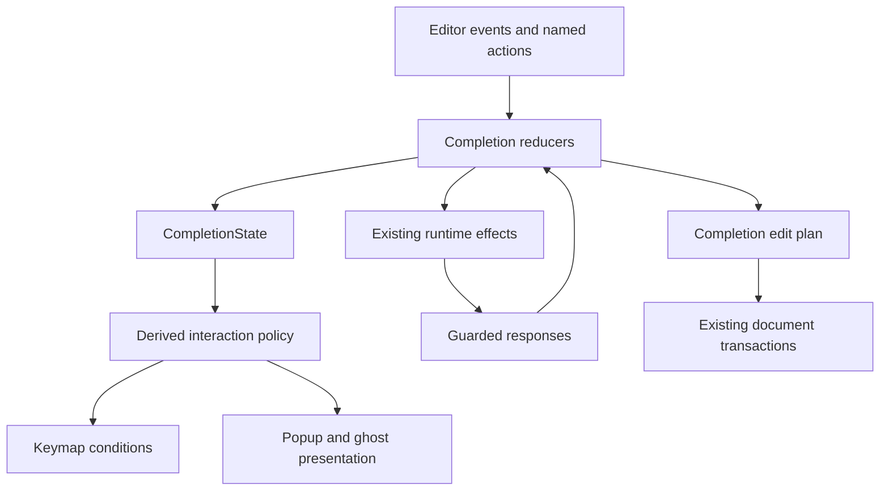

# Token completion refactoring: coding-agent handoff

> **Status:** Archived 2026-09-17. Executed in full: Phases 0–6 plus three
> review follow-ups landed on `main` (Unreleased, after v0.7.0; see the
> "Completion" entry in [CHANGELOG](../CHANGELOG.md)). The execution record and
> final source map are in [completion-refactor-progress](completion-refactor-progress.md);
> the current contract is [autocomplete](../feature/autocomplete.md).
> Corrections to the text below: the work *has* been performed; the contract
> sketch's `CompletionOrigin`, `RequestStamp` and `PrepareAcceptance` were not
> adopted verbatim, the implemented equivalents live in `src/completion/session.rs`,
> `src/completion/interaction.rs` and `src/update/completion/accept.rs`; and
> `inline_in_flight` (Phase 2) was kept as owned state on `CompletionState`
> rather than removed. Open, optional follow-ups: derive `inline_in_flight`
> instead of storing it, a same-machine pre-refactor benchmark comparison
> (the Section 11 <10% gate was never quantified), and running the native
> `just smoke-input` scenarios on a display-backed machine.

Prepared 15 September 2026. Repository: https://github.com/HelgeSverre/token

Audited baseline: `4e8d9952b044b7a9941dd792b4fa23d6c51eeec2`.

This document is standalone. No prior conversation or companion glossary is required. It specifies implementation work for a later coding-agent session; the work described below has not been performed by preparing this document.

## 0. Task to execute

Refactor Token's existing completion systems so that session state has clear ownership, interaction policy has one source of truth, completion keys use the existing keymap, and acceptance produces a validated edit plan before invoking the existing transaction machinery.

Keep menu completion and inline suggestions as separate features. Keep the Elm update/effect architecture, the existing ghost projection/viewport integration, language-server runtime, provider adapters, and shared document transactions. Preserve current behavior through the structural phases. Then make the narrowly specified acceptance-correctness changes in Phase 5.

Implement Phases 0–6, in order, with focused verification and reviewable checkpoints. The optional extensions in Section 12 are outside this task. Do not stop after writing another plan. At handoff, report completed phases, behavior changes, test results, and remaining platform limitations.

Do not publish a release, change version numbers, push to the default branch, or deploy anything as part of this task. Work in the user's selected checkout/branch or an isolated worktree according to the current session instructions. Do not overwrite unrelated changes.

### Priority

1. Correctness and explicit ownership.
2. Existing UX and configuration compatibility.
3. Simpler maintenance and extension boundaries.
4. No material completion-path performance regression.

This is consolidation, not a rewrite or an editor-wide framework project.

## 1. Mandatory baseline refresh

The code may have changed since this audit. Before editing:

1. Read the current repository `AGENTS.md` and any applicable descendant instructions.
2. Record branch, commit, and dirty status. Inspect the user's current changes before choosing a worktree or branch.
3. Compare the current completion implementation with this baseline. Do not reset or downgrade to the audited SHA.
4. Check for already-landed session, keymap, snippet, or acceptance changes. Adapt the plan to those changes rather than replacing them with an older design.
5. Read the known source files listed below. Use repository-prescribed semantic discovery only if their new locations are unknown. In the audited instructions, `jbcontext search` is preferred for unfamiliar semantic discovery; exact file/symbol reads are appropriate once locations are known.
6. Run relevant existing tests and record pre-existing failures separately from failures introduced by this work. Do not delete, ignore, weaken, or repeatedly retry failing tests merely to obtain a green result.
7. Maintain a short execution record at `docs/archived/completion-refactor-progress.md`: current SHA, phase, decisions, tests, and next step. Reuse a matching existing record if one exists.

The audit inspected all three GitHub-visible branches and eight historical PR heads. Neither extra remote branch supplied an alternate completion implementation. That is historical context, not a reason to merge old branches. Main had v0.7.0 preparation/history but the latest verified published tag was v0.6.0; release status is irrelevant to choosing the current coding baseline.

## 2. Current implementation and code map

### Concepts that must remain distinct

| Concept | Meaning |
| --- | --- |
| Menu completion | Select a candidate from a list: LSP, paths, built-in snippets, buffer words |
| Inline suggestion | Speculative insertion at the active caret, with alternatives and partial consumption |
| Ghost text | Derived display geometry for the unaccepted inline remainder; not source text |
| FIM | Prefix/suffix generation technique used by current inline adapters |
| LSP | Protocol supplying completion and unrelated features such as hover, diagnostics, and inlays |
| Edit prediction | Replacement/deletion or edits at another location; outside this task |
| Snippet session | Interactive placeholders/mirrors/tabstops; outside this task |

### Files and symbols to inspect

Paths are relative to repository root. Names below are verified at the audited baseline; recheck rather than assuming exact line locations.

| Responsibility | Existing files / symbols |
| --- | --- |
| Completion types and filtering | `src/completion/menu.rs`: `CompletionMenuState`, `MenuItem`, `MenuSourceId`, `MenuInsert`, `LspInsert`, `PendingCommit`, `filter_and_sort` |
| Local source admission | `src/completion/context.rs`: `CompletionContext`; `src/completion/sources.rs`: `collect_words`, `collect_snippets` |
| Paths | `src/completion/path.rs`; `src/update/completion/paths.rs`; `src/runtime/path_completion.rs` |
| LSP conversion and snippets | `src/completion/lsp.rs`: `items_to_menu_items`, `strip_snippet` |
| Menu update and acceptance | `src/update/completion.rs`: `open_or_refresh`, `merge_lsp_completion`, `accept_selected`, `apply_text_accept`, `apply_lsp_accept`, `finish_accept`, `finish_deferred_accept` |
| Commit characters | `src/update/completion/commit.rs`: `try_commit_character`, `pending_is_valid`, reconciliation/history handling |
| Inline data | `src/completion/inline.rs`: `RequestSnapshot`, `InlineRequest`, `InlineSuggestionState`, `AcceptGranularity` |
| Provider boundary | `src/completion/provider.rs`: `InlineProvider`, `InlineSession`, `InlineJob` |
| Inline lifecycle | `src/update/inline.rs`: `eligible`, `visible`, `schedule`, `deadline_fired`, `context_ready`, `ready`, `failed`, `accept`, `reconcile`, `sync_projection` |
| Provider/runtime effects | `src/completion/fim.rs`, `prompt.rs`; `src/runtime/inline_worker.rs`, `inline_server.rs`, `inline_cache.rs` |
| Context and filters | `src/completion/recency.rs`, `retrieval.rs`, `postprocess.rs`; `src/runtime/inline_context.rs`, `inline_retrieval.rs` |
| Session/UI storage | `src/model/ui.rs`: completion menu/path/commit fields, inline session/suggestion/in-flight/failure fields, `CursorOverlayState`, `has_visible_completion` |
| Derived geometry | `src/model/ghost_text.rs`: `GhostText`, `GhostProjection`, `GhostRow`, `SourceSpan`; shared viewport map and `src/view/editor_text.rs` |
| Update finalization | `src/update/mod.rs`: pending-commit reconciliation, inline reconciliation, ghost projection synchronization |
| Actions and effects | `src/messages.rs`: `CompletionMsg`; `src/commands.rs`: command registry, `ResolvePurpose`, LSP/inline effects |
| Key routing | `src/runtime/input.rs`, `src/runtime/app.rs`; `src/keymap/context.rs`, `command.rs`, `config.rs`, `keymap.rs`, `preferences.rs`; root `keymap.yaml` |
| Pointer input | `src/runtime/mouse.rs`: completion row selection/acceptance and popup hit testing |
| Existing transaction layer | `src/update/text_edits.rs`: `PlannedEdit`, `EditCarets`, `EditOffsetMap`, `apply_planned_edits`, `plan_text_edits`, `edit_effects` |
| LSP request lifecycle | `src/runtime/app.rs`: `LspManager`; `src/runtime/lsp_slot.rs`: `FeatureSlot<P>` |
| Configuration | `src/config.rs`: `CompletionConfig`, `CompletionMenuConfig`, `InlineConfig`, `ProviderConfig`, `WordsMode` |
| Verification | inline module tests, `src/keymap/tests.rs`, `src/runtime/app_tests.rs`, `tests/lsp_fake_server_scenarios.rs`, `src/bin/fake_lsp_server.rs`, `benches/completion.rs` |
| Native automation | `scripts/lib/token-automation.mjs`, `docs/dev/automation-input.md`, `screenshots/scenarios/` |

### Existing strengths to preserve

- Model updates remain deterministic; runtime executes I/O and effects.
- LSP responses have identity/version guards and cancellation machinery.
- Inline worker is bounded and latest-request driven, not one detached thread per keystroke.
- Raw LSP completion items are retained through `Arc`, serialized lazily at resolve boundaries.
- Ghost projection composes with existing wrap/fold/scroll geometry; peers viewing the document remain plain until an actual edit.
- Shared edit transactions handle syntax invalidation, LSP synchronization, caret mapping, and undo.
- Inline cache, source context, and output filtering already exist. Do not replace them as part of this refactor.

## 3. Scope and behavior contract

### Preserve during Phases 1–4

| Situation | Required behavior |
| --- | --- |
| Master completion disabled | Neither explicit nor automatic menu/inline requests run |
| Automatic dropdown disabled | Ctrl+Space still opens a menu; an explicit session still refines as typed |
| Inline disabled or provider absent | No inline generation, including explicit trigger |
| Ordinary automatic menu trigger | Existing two-character prefix threshold retained |
| Minimum word length | Existing candidate-length setting retained; do not turn it into trigger length |
| Menu session pending, zero rows | Does not capture Tab/Enter/navigation or suppress inline; Escape can cancel it |
| Visible menu | Suppresses inline presentation and inline acceptance |
| Valid visible inline, matching typing | Consume prefix; do not open a competing automatic menu |
| Explicit menu request | Can take over from inline, through explicit reducer transitions |
| Explicit inline request | Retain current eligibility; skip automatic debounce/tail gate, reset failure backoff, bypass cache |
| Focus changes | No proposal crosses into another pane, document, modal, dock, terminal, or special tab |
| Member context | Local generic words/snippets excluded; server supplies semantic candidates |
| Unknown syntax revision | Can wait invisibly; fresh parse may supply local candidates without reviving dismissal |
| Local matching | ASCII-case-insensitive prefix admission; Unicode identifier support retained |
| LSP ordering | `sortText`, matching, and initial `preselect` behavior retained |
| Words fallback | A nonempty LSP response removes local words; an empty reply alone does not |
| Snippets | Preserve flattening/default/first-choice behavior and first `$0`; do not add interactive sessions |
| Inline partial acceptance | Existing alphabetic/non-alphabetic run semantics for Word and newline-inclusive Line retained |
| Alternative cycling | Never changes accepted text; only prefix-compatible alternatives are eligible |
| Inline acceptance | Active-caret insertion; do not silently start duplicating AI output at every caret |
| Normal acceptance | Existing one transaction per acceptance; peer caret mapping preserved |
| Commit character | Literal character remains responsive while resolution is pending; no double insertion or replay over newer edits |
| Documentation | Existing hover/signature/completion priority and scroll behavior preserved |
| Projection | Real suffix is visually shifted; source rope, parser state, and undo remain unchanged before acceptance |
| Statistics | At most one terminal outcome per offered response, including partial acceptance and cycling |

Keep current default delays: menu LSP 120 ms, docs resolve 150 ms, inline 300 ms. Keep failure threshold, provider validation, generation/cache/retrieval bounds, opt-ins, and existing saved YAML compatibility. Configuring or selecting a provider must not enable inline suggestions automatically.

### Intentional changes, isolated and documented

1. Menu actions become normally rebindable; defaults remain visually and behaviorally equivalent.
2. Stable candidate identity replaces label/index-based association for pending work and selection.
3. Phase 5 rejects completion edit plans that would otherwise silently lose necessary LSP edits or apply invalid/overlapping edits. Multi-cursor policy is specified in Section 8.

Do not change fuzzy ranking, introduce a universal source plugin system, add LSP inlineCompletion support, new backends, streaming, model downloads, persistent retrieval, semantic ranking, or a replacement-prediction engine.

## 4. Target ownership and module boundaries

Use one model-owned `CompletionState` at window UI level, containing separate menu and inline sessions. Every session identifies its originating pane/document. Do not add persistent background sessions per pane in this task. Switching panes invalidates the active session, matching current behavior.



Recommended files, created only when they take a real responsibility:

- `src/completion/session.rs`: session/origin/request/candidate identity types and pure lifecycle helpers.
- `src/completion/interaction.rs`: pure eligibility/presentation/trigger policy derived from current state and editor facts.
- Existing `menu.rs` and `inline.rs`: candidate/proposal data and their distinct algorithms.
- `src/update/completion/accept.rs`: pure acceptance planners plus guarded application orchestration; reuse `PlannedEdit` and transaction helpers.
- Existing `src/update/completion/commit.rs`: staged commit lifecycle, migrated onto session/request/candidate identities.
- Existing `src/completion/lsp.rs`: protocol normalization and resolution payload support.

Do not move modules simply to match this list. A small helper may initially stay in its current file. Do not add crates/dependencies solely for IDs, state machines, or routing.

### State contract

The following Rust is a contract sketch, not drop-in compilable code. Reuse existing IDs and value types where equivalent; introduce only missing types. Document the final mapping in the progress record.

```rust
struct CompletionState {
    menu: Option<MenuSession>,
    inline: Option<InlineSession>,
    next_session_id: u64,
    next_request_id: u64,
    // Failure backoff outlives a single inline session.
    inline_failures: u32,
}

struct CompletionOrigin {
    editor_id: EditorId,
    document_id: DocumentId,
    // File/language/provider identity must also be guarded where relevant.
}

struct RequestStamp {
    session: SessionId,
    request: RequestId,
    document_revision: u64,
}

struct MenuSession {
    id: SessionId,
    origin: CompletionOrigin,
    query: CompletionQuery,
    candidates: CandidateStore,
    selected: Option<CandidateId>,
    selection_origin: SelectionOrigin,
    requests: MenuRequests,
    path: Option<PathRequestState>,
    pending_accept: Option<PendingAccept>,
    viewport: ListViewportState,
}

struct InlineSession {
    id: SessionId,
    origin: CompletionOrigin,
    provider: ProviderConfig, // Immutable session configuration snapshot.
    request: InlineRequestState,
    proposal: Option<InlineProposal>,
    observation: Option<Observation>,
}

enum InlineRequestState {
    Idle,
    Debouncing(RequestStamp),
    Preparing(RequestStamp),
    Running(RequestStamp),
}
```

`InlineProposal` may remain the existing `InlineSuggestionState` under its current name. Preserve immutable original text, consumed characters, selected alternative, and valid revision. No need to rename everything in one change.

`MenuRequests` must allow independent source requests and docs resolution. Do not collapse LSP/path requests into one boolean. An in-flight docs request can coexist with ready candidates. Preserve known resolve purposes and the ability for accept to reuse a docs resolve.

`ListViewportState` means reuse the existing list viewport primitive where appropriate. The menu is authoritative for selection and scroll offset; the generic overlay receives a projection of those values. Avoid two writable copies. If changing `CursorOverlayState` affects unrelated overlays, add a completion-specific read adapter and keep other overlays unchanged.

Provider failures and statistics-persistence failures are not request phases. Keep their lifetime separate. Session/request counters must not reset on dismissal, config reload, or document switch; use checked increments and an explicit exhausted-ID failure path rather than wrapping into live identity reuse.

## 5. Identity and asynchronous validity

### Candidate identity

Use session-local IDs such as `CandidateId { session, serial }` or an equivalent typed pair. Index is list position, not identity. Label is display text, not identity.

Rules:

1. Filtering/sorting existing candidates keeps their IDs.
2. Resolve responses reference `(session, candidate, resolve request)`; never a row index alone.
3. Two equal labels with distinct insertions, imports, kinds, or server origins remain distinct candidates.
4. New source responses allocate new IDs unless an old candidate can be matched unambiguously by semantic identity.
5. Conservative rematching is acceptable: match source/server generation and relevant insertion/filter identity, using exact equality after any hash lookup. Never merge ambiguous duplicates.
6. Avoid hashing or serializing the whole raw LSP JSON on every keystroke. Compute reusable identity when accepting a new source result. `Arc` sharing remains useful.
7. If rematching is ambiguous, treat the candidate as new. Cancel pending acceptance rather than bind it to a guessed item.
8. User selection is preserved when the same candidate survives. If it disappears, choose the existing deterministic fallback; do not restore stale selection by label.

### Request origin

Every delayed result must be checked against its source-specific contract:

| Work | Validity includes |
| --- | --- |
| Menu completion | Session/request, document and query revision/start, pane, server instance/root generation |
| Path listing | Above plus original source range, file identity, workspace root, language, cursor set as required by existing path semantics |
| Docs resolve | Session/candidate/resolve request/server generation; update candidate cache, display only if selected |
| Deferred accept | Exact pending intent and candidate; source/query revision, caret/selection state, file identity, server generation |
| Inline context | Session/request, pane/document/revision/caret, provider config, workspace root |
| Inline generation | Session/request and current origin/provider; a stale error must not increment current failure count |
| Visible inline | Current reconciled revision and expected caret after consumed prefix; original request revision is historical |

Reuse existing guards; do not replace them with `request_id == latest` alone. A common identity vocabulary is useful, but one universal “still valid” predicate would discard important differences.

Cancellation and invalidation are separate: cancellation saves work; invalidation prevents a reply from taking effect even if cancellation loses a race. Dismissal must invalidate immediately. Docs for a no-longer-selected but still-live candidate may be cached, but cannot move selection, trigger acceptance, or replace the displayed docs of another candidate.

Do not introduce general anchor rebasing. Preserve the existing explicit query refinement and inline consume/unconsume reconciliation. Other edits invalidate pending work.

## 6. Interaction policy and input dispatch

The policy must be a pure, cheap function of editor facts, configuration, and session state. It performs no I/O, schedules nothing, mutates nothing, and does not inspect derived overlay presence to decide if the underlying menu exists.

```rust
struct CompletionInteraction {
    menu_visible: bool,
    inline_visible: bool,
    menu_session_pending: bool,
    // Used for key contexts, but reducers revalidate before mutation.
    can_accept_menu: bool,
    can_accept_inline: bool,
}

enum TriggerIntent {
    AutomaticMenu,
    ExplicitMenu,
    AutomaticInline,
    ExplicitInline,
}

fn interaction(/* borrowed model facts */) -> CompletionInteraction;
fn may_trigger(/* facts, intent */) -> bool;
```

Separate trigger intent from current presentation. Automatic menu admission and explicit invocation are different. Compute visible menu rows from session data; compute inline viability independently; then apply precedence. Do not create a recursive dependency where inline visibility asks menu visibility and menu visibility asks inline visibility. On typing, the reducer explicitly preserves a consumable inline proposal and suppresses automatic menu opening for that edit.

### Named actions

Retain existing inline command names and `TriggerCompletionMenu`. Add missing menu commands to the existing registry/keymap system:

- `AcceptMenuCompletion`
- `DismissMenuCompletion`
- `NextMenuCompletion`
- `PreviousMenuCompletion`
- `NextMenuCompletionPage`
- `PreviousMenuCompletionPage`

These map to existing or migrated `CompletionMsg` actions. Preserve serialized existing command aliases. Do not add a second command registry.

Add explicit conditions such as `completion_menu_visible` and `completion_session_pending`; retain `inline_suggestion_visible`. The existing `overlay_routes_keys` remains for other overlays and existing bindings; do not redefine it globally to mean completion.

Default priority in the normal editor:

| Key | Visible menu | Eligible inline | Hidden pending menu, no inline | Neither |
| --- | --- | --- | --- | --- |
| Tab | Accept candidate | Accept remainder | Normal tab/indent | Normal tab/indent |
| Enter | Accept candidate | Normal newline | Normal newline | Normal newline |
| Up/Down | Move candidate | Normal movement, invalidating proposal as appropriate | Normal movement | Normal movement |
| PageUp/PageDown | Menu paging | Normal movement | Normal movement | Normal movement |
| Escape | Dismiss menu/session | Dismiss inline and prevent same-session pending work from resurfacing | Cancel pending session | Existing editor cascade |

Modified keys must retain existing behavior: Shift+Up/Down selects text, Cmd/Ctrl+Tab changes focus, and Shift+Enter is not plain menu accept. Add tests against the actual dispatch path and not merely a mocked context struct.

Remove the completion-specific Enter/Tab/navigation branch from the native overlay interceptor only after the default keymap can express equivalent behavior. Preserve hover/docs controls, modal routing, key capture, CSV/terminal handling, debug shortcuts, chord handling, platform key interpretation, and Option double-tap behavior.

The keymap checks conditional bindings before unconditional bindings, with ordering among eligible bindings. Insert defaults accordingly and honor current user-binding precedence/unbinding behavior. Test a user override of Tab and menu navigation. Command-hint contexts shown in palettes must describe the post-palette editor accurately, rather than showing completion shortcuts for a session that the palette already dismissed.

Pointer rows translate to candidate IDs. Pointer and automation acceptance use the same guarded reducer as keyboard acceptance. Commit characters remain a typed-text event path: paste and multi-character input must not be interpreted as a sequence of commit actions.

## 7. Acceptance planning and LSP adapter boundary

### Reuse existing transaction types

Do not build another range mapper, document clone/rollback layer, or undo engine. The core plan is a wrapper around existing `PlannedEdit` plus owned caret-placement information and a validity guard.

```rust
struct CompletionEditPlan {
    guard: AcceptanceGuard,
    edits: Vec<PlannedEdit>,
    caret_placement: CompletionCaretPlacement,
}

enum PrepareAcceptance {
    Ready(CompletionEditPlan),
    NeedsResolve(ResolveIntent),
    Rejected(AcceptanceFailure),
}
```

`AcceptanceGuard` binds document, pane, revision, session/candidate or inline proposal, and the required caret/selection/file/provider/server identities. A plan cannot be reused after a document change. Pending acceptance stores intent; after resolve, create a fresh plan only if that intent remains valid.

`CompletionCaretPlacement` should own offsets or equivalent existing placement data. Convert it to borrowed `EditCarets` immediately at application. Reuse `EditOffsetMap` for changes caused by imports and secondary edits.

All completion offsets in the plan are document character offsets, following the current transaction API. Protocol UTF-16/other negotiated positions and Rust byte offsets are boundary representations. No unchecked cast between units. Use existing conversion helpers; add stricter validation locally for completion if helpers currently clamp invalid ranges.

### Required sequence

1. Identify selected candidate/proposal by ID.
2. Validate session and editing origin.
3. If resolution is required, capture a guarded intent and issue/reuse resolve.
4. Normalize the final insertion and additional edits against one pristine document revision.
5. Validate ranges, expected deleted text, overlap rules, and caret placement.
6. Invoke `apply_planned_edits` once with the completed plan.
7. Apply completion lifecycle transitions and cancellation once; retain current post-edit effects, statistics, redraw, and follow-up triggers.

Planning is pure: no mutation of rope/history/carets, no I/O. Rejected plans do not partially edit. Normalization must preserve primary text, additional edits, snippet final-caret offset, path escaping/encoding, commit characters, and resolution semantics.

### Protocol storage

Keep the original LSP item immutable. Introduce a private adapter payload or handle keyed by candidate identity; UI/presentation code receives normalized row data and generic acceptance information. This payload may remain model-owned in the completion adapter behind `Arc`; a runtime-side global object store is not required.

Do not move raw items to runtime solely for architectural purity: that introduces cleanup and asynchronous lookup obligations. The concrete requirement is that renderer/interaction policy do not depend on `lsp_types`, raw protocol items, or server root paths to decide how a row looks or how Tab routes.

During Phase 4, wrap existing planners without changing their edit policies. During Phase 5, strengthen completion-only validation. Do not change generic `workspace/applyEdit`, formatting, rename, or Find semantics through an incidental global rewrite of `plan_text_edits`.

### Commit-character acceptance is the highest-risk migration

Current behavior inserts the literal character immediately while resolution may still be pending. Preserve that responsiveness.

- Carry candidate/session identity, pre-commit basis, and exact expected post-literal state in pending intent.
- Reuse in-flight docs/accept resolve when it refers to the same candidate.
- If any unrelated edit/navigation/selection/config/server change occurs, abandon completion acceptance and keep the literal character and newer edits.
- On success, construct the final completion operation using the current guarded staged state. Reuse existing history reconciliation to preserve a single undo for completion plus commit character.
- Do not replay a stored keystroke after a newer edit, globally undo user input, clone the entire undo stack, or invent a buffered keyboard queue.
- Repeated Enter/Tab while accepting cannot duplicate the edit or accidentally accept another row.
- Successful acceptance can trigger signature help or another menu based on the final caret and revision, exactly once.

A strictly single-pristine-revision planner does not by itself solve this staged interaction. Keep the commit adapter explicit and test its two-state relationship rather than weakening revision guards to accommodate it.

## 8. Phase 5 policy: multi-cursor and malformed edits

This is the intentionally behavior-changing phase. Choose conservative correctness over silently approximating a protocol edit.

### Required behavior

| Candidate shape | Policy |
| --- | --- |
| Local word/static snippet | Preserve replacement at each compatible cursor and overlap deduplication |
| Path candidate | Preserve existing path-specific validation and escaping at supported cursor sets |
| LSP single caret, valid edits | Apply primary plus all required compatible additional edits atomically |
| LSP multiple carets, simple query replacement | Replicate at each caret only when query/replacement compatibility is established |
| LSP multiple carets, additional edits | Apply shared additional edits once only if primary replication is established and the full combined plan is non-overlapping |
| LSP multi-cursor edit requiring unsupported adaptation | Reject acceptance with a concise nonmodal status; preserve all source/carets. Do not flatten away imports/ranges |
| Inline suggestion | Retain active-caret-only insertion and peer mapping |
| Invalid/out-of-bounds/contradictory completion edit | Reject the entire completion plan; do not silently drop a required edit |

For this task, “simple query replacement” is deliberately narrow: the active primary edit must match the recognized query range, each secondary caret must have a compatible empty selection and matching query text, and replication must preserve the inserted text and final-caret semantics. A primary edit extending into an unrelated suffix is not automatically replicable. Do not infer type equivalence across caret sites; this is a textual compatibility rule, not a semantic guarantee.

If shared additional edits conflict with any primary replacement, reject. Do not discard conflicting imports. Do not deduplicate arbitrary same-position inserts by string equality: repeated insertions can carry intended ordering. Add one copy of the original shared edit set, preserve its ordering, and validate using existing same-position boundary semantics. Merge identical/overlapping primary query sites as the local completion path already does.

For unsupported multi-cursor acceptance, example status: `This completion needs a single cursor.` No modal. Do not silently collapse the user's cursor set. If a commit character initiated the attempt, ordinary character insertion must still happen once; failed semantic acceptance must not swallow typing.

Keep resolve-timeout fallback behavior at the baseline unless the latest implementation has a stronger policy: known valid edit data may still be accepted when optional resolve fails. Document that unresolved optional data cannot be guaranteed to include unknown imports. Never interpret a timeout as permission to discard known required edits. For multi-cursor adaptation, unresolved or ambiguous semantics should take the conservative rejection path when compatibility cannot be established.

This phase changes completion validation only. Add an `Unreleased` changelog entry describing user-visible behavior, not merely internal type moves.

## 9. Implementation phases and exit criteria

### Phase 0 — Baseline and characterization

- Perform Section 1 and inspect existing tests before adding duplicates.
- Build a behavior checklist from Section 3 tied to existing test names.
- Add only missing regressions needed to protect the upcoming refactor: equal labels with distinct edits, invisible pending session key routing, stale resolve identity, user Tab override, and commit-character race cases.
- Record baseline optimized completion measurements using current recipes, same fixtures/build configuration to be used after refactoring.

Exit: baseline and known failures documented, relevant characterization tests run, no production behavior changes.

### Phase 1 — Session ownership and identities

- Add `CompletionState`; migrate scattered menu/path/commit and inline request/proposal state into appropriate owners.
- Add monotonic session/request IDs and stable candidate IDs. Replace pending selected indices with candidate references.
- Keep inline failure count outside ephemeral sessions. Keep statistics observations tied to offered proposals.
- Make session selection/viewport authoritative; adapt generic overlay rendering from that state.
- Update fixtures, automation snapshots, and benchmarks that construct state directly. Preserve external snapshot schema where practical; new fields may be additive.
- Temporary adapters are allowed within this phase, but no two independent writable stores at its exit.

Exit: stale/duplicate candidate tests pass; session lifetime is inspectable without scanning unrelated UiState fields; default UX unchanged.

### Phase 2 — Derived interaction and lifecycle policy

- Extract raw editor/config/session facts and the pure interaction policy.
- Replace duplicated visibility/eligibility checks in view, key context, scheduling, and acceptance with shared policy plus operation-specific guards.
- Preserve event ordering in `src/update/mod.rs`: edits land, sessions reconcile, then derived ghost geometry synchronizes, then effects are returned through existing composition.
- Ensure early-return paths still reconcile through the actual update boundary. Do not recursively call the top-level update to implement cleanup.
- Remove redundant `inline_in_flight` and stored presentation booleans when they are fully derivable.

Exit: invisible requests do not own keys, visible menu/inline do not conflict, dismissal cannot be revived by parse or provider completion, unrelated update behavior unchanged.

### Phase 3 — Named menu actions through the keymap

- Add registry entries, keymap command conversions, conditions, default bindings, and command labels.
- Ensure action eligibility is filtered before chord matching, as existing keymap infrastructure supports.
- Remove only completion-specific hardcoded interception after its replacement passes real dispatch tests.
- Update mouse handling to target candidate ID and dispatch the same acceptance/navigation intents.
- Update automation action exposure and any command-hint/keymap settings integration.

Exit: default keys are equivalent; user rebinding/unbinding works; modified keys/chords and other surfaces are unaffected; no second menu-specific key precedence implementation remains.

### Phase 4 — Shared acceptance boundary, preserving behavior

- Extract pure local/path/LSP/inline planning routines around existing `PlannedEdit` and caret mapping.
- Add guarded `Ready / NeedsResolve / Rejected` orchestration.
- Hide LSP storage behind the adapter boundary; preserve immutable raw data and lazy serialization.
- Migrate deferred docs/accept correlation to session/candidate/request IDs.
- Migrate commit-character intent without changing staged insertion or undo behavior.
- Keep current multi-cursor fallback temporarily explicit as a legacy planner branch until Phase 5; do not let it spread into the new generic path.

Exit: exact edited text, carets, undo, LSP synchronization, and redraw match baseline fixtures; renderer does not branch on raw protocol data; no new offset mapper or transaction engine.

### Phase 5 — Correct acceptance semantics

- Implement Section 8's conservative multi-cursor and validation policies.
- Delete the explicit legacy branch that discards LSP range/additional-edit semantics.
- Ensure rejected accepts preserve typed commit characters and return actionable nonmodal status.
- Add positive and negative combined-plan tests, including shared imports and overlapping sites.
- Record intentional behavior changes in the changelog and current feature contract.

Exit: no acceptance path silently converts a known complex LSP edit into plain text; valid supported completions remain atomic and reversible.

### Phase 6 — Consolidation and final verification

- Remove compatibility scaffolding internal to the refactor; retain user-facing configuration/command aliases.
- Refresh `docs/feature/autocomplete.md` into a current contract. Clearly mark or move stale historical sketches; do not erase useful history without a pointer.
- Keep snippet navigation/edit prediction explicitly deferred; do not claim they now exist because types can evolve toward them.
- Run final tests, formatting, lint, optimized comparisons, and available native scenarios.
- Update the progress record with final decisions, source map, and verification limits.

Exit: all applicable gates in Sections 10–11 pass or concrete environment blockers are reported with executed evidence. No publishing/deployment actions.

## 10. Test matrix

Prefer existing fixtures/fake server and deterministic event dispatch. Add tests at the smallest boundary that establishes behavior; include a few complete sequences across update/runtime/input boundaries. Arbitrary sleeps must not substitute for controlled response ordering.

| Case | Expected result |
| --- | --- |
| Empty local results, LSP pending, press Tab | Ordinary tab/indent; pending old response subsequently rejected if edit changed basis |
| Pending request, Escape, then parse/result arrives | Session stays dismissed |
| Visible inline, type matching character, menu timer/result arrives | Prefix consumed; no unexpected competing popup |
| Explicit menu during visible inline | Menu takes over; inline session cannot later reappear |
| Switch pane showing same document while request runs | Old pane session cannot appear/accept in new pane |
| Switch file, Save As, provider change, server restart | Appropriate old work invalidated |
| Two candidates share label but have different edits/imports | Selection/resolve/accept identify the intended candidate |
| Refilter changes row ordering | Selected ID survives when still present |
| Selected candidate removed by refresh | Deterministic fallback; pending accept canceled |
| Docs resolve finishes after selection changes | No selection jump or wrong docs; valid cache update allowed |
| Accept unresolved item twice | One resolution/acceptance transaction |
| Commit character with slow resolve | Character appears immediately; final completion once; one undo restores original |
| Commit character then further typing/backspace/undo/focus change | Later input/history preserved; delayed semantic accept abandoned |
| Commit character with unsupported plan | Literal typed once; no partial semantic edit |
| Paste or multi-character input matching commit characters | Ordinary text insertion, not repeated acceptance |
| User remaps/unbinds Tab and menu arrows | Keymap override honored in actual runtime dispatch |
| Modified arrows/Tab/Enter, global chord, settings key capture | Existing unrelated behavior retained |
| Word, path, and flattened snippet completion | Text/caret/escaping match baseline |
| Valid primary plus import before insertion | Both edits land; caret mapped through import; one undo |
| Same-position allowed edits | Existing deterministic text ordering retained |
| Invalid UTF position/out-of-bounds/overlap | Completion rejected without partial edit |
| Multi-cursor same query with shared import | Primary replicated; import once; correct peer carets and undo |
| Multi-cursor incompatible queries or complex range | Nonmodal rejection; cursors and source retained |
| Overlapping local query sites | Complete merged site once, preserve cursor mapping semantics |
| Inline accept Full/Word/Line with Unicode and CRLF | Correct boundaries and remainder; no new request while partial remains |
| Cycle after partial acceptance, then backspace | Only compatible alternatives; earlier choices may become eligible again |
| Old inline error after newer success | Does not change current failure count or status |
| Explicit inline trigger after error threshold | Retry works under enabled/configured/eligible gates; bypasses cache |
| Ghost across wrap/fold/tab/suffix, resize and scroll | Render and hit testing agree; source and undo unchanged until acceptance |
| Other split view and special tab | Ghost local to focused text pane; no leakage into CSV/image/binary/terminal |
| Statistics after partial accept/cycle/dismiss | One terminal outcome per offered response |

For ghost geometry, reuse the existing oracle comparing projection with the geometry of an equivalent real insertion. Do not substitute screenshots alone for coordinate correctness.

For transaction checks, assert source text, focused and peer caret/selection positions, undo/redo restoration, revision changes, and absence of duplicate effects. Avoid asserting arbitrary private field layouts that merely mirror the new implementation.

## 11. Verification and performance gates

Use current `just --list` and repository recipes. At the audited baseline:

```sh
just test-one completion
just test-one inline
just test-one keymap
just fmt
just fmt-check
just test
just lint
just bench-completion
```

Filters are substring examples, not proof of complete coverage. Confirm matched tests include the targeted runtime/fake-server/commit cases; run their specific test names when needed. `just test` runs nextest plus doctests; lint checks all targets/features. Do not invent a pass count.

`just fmt` also formats root Markdown; inspect any resulting changes and preserve unrelated user edits. If Node/nextest/native dependencies are unavailable, record the exact blocked recipe and run useful available checks without claiming the required gate passed.

Native checks: use `just smoke-input` where supported and the repository automation client. Add/refine isolated scenarios for menu navigation, remapped Tab, hidden pending state, multi-line ghost, partial acceptance, and resize. Outputs belong under `target/verification/`. Run on the available platform and explicitly state which platforms were not exercised. Native IME candidate-window work was deliberately deferred in the existing plan; do not expand scope into an IME project, while preserving existing text-input handling.

Performance:

- Reuse completion conversion/filtering/typing fixtures in `benches/completion.rs`.
- Compare baseline and final optimized builds on the same machine, toolchain, features, fixtures, and instrumentation. Keep outputs under verification artifacts.
- Watch for full-document/history clones, per-keystroke raw-item serialization, allocations in interaction queries, and whole-window ghost reconstruction on cursor blink.
- Candidate identity work belongs primarily on source-response merge, not each keypress.
- Reuse unchanged ghost geometry on blink/scroll; only relevant source/anchor/text/width/settings changes should rebuild it.
- No O(carets × document size) acceptance work or O(candidates²) rematching. Reuse indexed mapping and bounded lookup structures.
- Treat a repeatable slowdown greater than roughly 10% in affected optimized fixtures as a signal to investigate, not an automatic statistical verdict. Compare absolute time, noise, and allocations. No claimed speedup from debug runs or F2 overlay timings.

Do not benchmark live model quality as a prerequisite for a state refactor. Provider wire formats and model behavior remain unchanged; fake transport tests establish that request lifecycle did not regress.

## 12. Explicitly deferred extensions

These explain where future work would fit, but are not Phase 7 and must not be implemented to “complete the architecture.”

### Interactive snippets

A future snippet subsystem owns parsed template parts, ordered tabstops, mirrors, and session cancellation/rebasing after edits. Acceptance may produce an optional snippet expansion result with positions mapped through the transaction. Do not add `snippet: Option<...>` to the core plan until an actual implementation consumes it. Current flattening remains the compatibility contract.

### Replacement predictions / LSP inlineCompletion

A future provider can return structured replacement ranges and text instead of `Vec<String>`. It needs explicit edit validity, display of removed/replaced source, and acceptance rules. Partial acceptance is not automatically valid for a replacement. Do not generalize GhostProjection to arbitrary diffs now.

### Context composition

Recency and retrieval may later feed one deduplication/budget stage. Preserve current enum strategies/configuration for this task. No embeddings, external retrieval service, or persistent index is required for session cleanup.

### Provider registries

Concrete menu source functions and the existing inline trait are sufficient. A generic plugin registration mechanism is justified only by an actual extension requirement. Keep transport, prompt format, and context selection separate.

## 13. Final deliverables and definition of done

The executing coding agent must leave:

- Reviewable source changes for Phases 0–6 on the intended branch/worktree.
- One authoritative owner for completion session selection/request/pending-accept state.
- One derived completion interaction policy used consistently by presentation, triggering, and key contexts.
- Menu keyboard actions exposed through the normal command/keymap path; pointer and automation share reducer semantics.
- Candidate/request identities that prevent row-index and equal-label resolution races.
- A guarded completion acceptance boundary using existing transactions and coordinate mapping.
- Explicit conservative multi-cursor semantics, with no loss of known required edits hidden by plain-text fallback.
- Preserved ghost geometry, provider formats, configuration defaults/aliases, failure handling, and statistics behavior.
- Current contract documentation, intentional user-visible changelog entries, and an execution record.
- Actual test/lint/format/native/benchmark results with limitations stated.

Final response should explain what changed, the deliberate UX changes, how it was verified, and any remaining blockers. Distinguish implemented code from live-server/platform verification. Do not call unfinished optional extensions regressions, and do not claim the refactor supports snippets or replacement predictions it does not implement.

## 14. Reference anchors

Use these only to understand the audited baseline; current checked-out code and applicable instructions take precedence.

- [Repository architecture instructions](https://github.com/HelgeSverre/token/blob/4e8d9952b044b7a9941dd792b4fa23d6c51eeec2/AGENTS.md)
- [Menu types](https://github.com/HelgeSverre/token/blob/4e8d9952b044b7a9941dd792b4fa23d6c51eeec2/src/completion/menu.rs)
- [Menu lifecycle and acceptance](https://github.com/HelgeSverre/token/blob/4e8d9952b044b7a9941dd792b4fa23d6c51eeec2/src/update/completion.rs)
- [Commit-character lifecycle](https://github.com/HelgeSverre/token/blob/4e8d9952b044b7a9941dd792b4fa23d6c51eeec2/src/update/completion/commit.rs)
- [Inline lifecycle](https://github.com/HelgeSverre/token/blob/4e8d9952b044b7a9941dd792b4fa23d6c51eeec2/src/update/inline.rs)
- [Shared transactions](https://github.com/HelgeSverre/token/blob/4e8d9952b044b7a9941dd792b4fa23d6c51eeec2/src/update/text_edits.rs)
- [Ghost projection](https://github.com/HelgeSverre/token/blob/4e8d9952b044b7a9941dd792b4fa23d6c51eeec2/src/model/ghost_text.rs)
- [Existing keymap](https://github.com/HelgeSverre/token/blob/4e8d9952b044b7a9941dd792b4fa23d6c51eeec2/keymap.yaml)
- [Historical design/current mixed document](https://github.com/HelgeSverre/token/blob/4e8d9952b044b7a9941dd792b4fa23d6c51eeec2/docs/feature/autocomplete.md)
