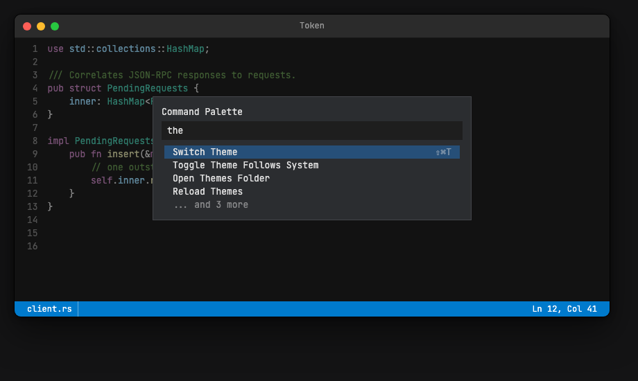
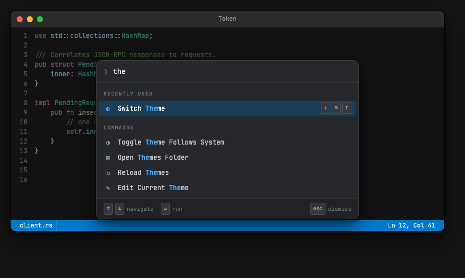
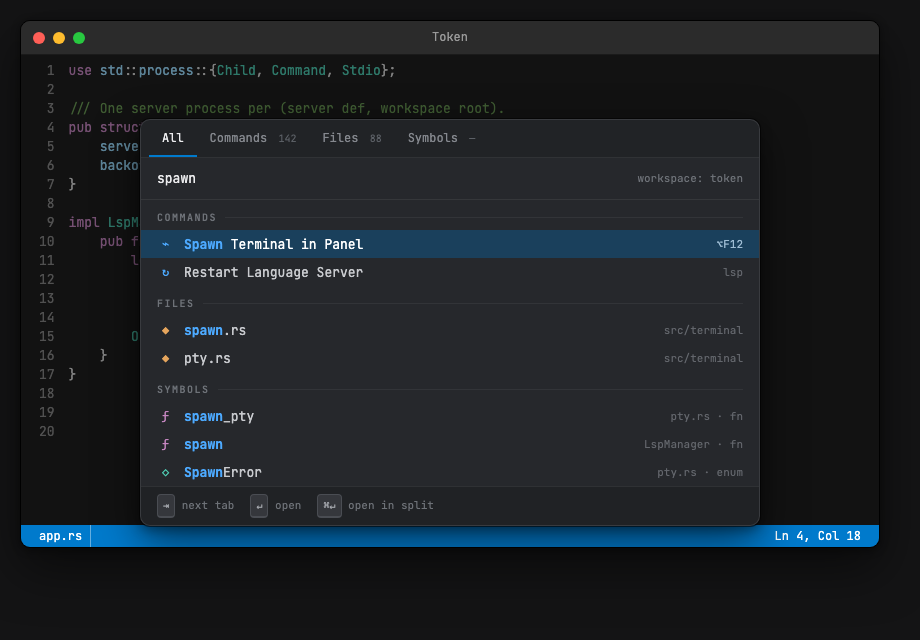

# Unified Overlay Surface & Search Everywhere

One overlay component — chrome, header, sectioned list, footer — rendered in two anchor modes (screen-centered, cursor-anchored), driving every palette, picker, popup, and card in the editor. The command palette evolves into a tabbed **Search Everywhere** modal (commands + files + symbols), and the completion/hover/code-action popups consumed by [autocomplete.md](autocomplete.md) and [lsp-integration.md](lsp-integration.md) get their surface defined here.

> **Status:** 📋 Planned
> **Priority:** P2 (Important)
> **Effort:** L (phased — each phase ships independently)
> **Created:** 2026-08-11
> **Updated:** 2026-08-11 (revised after 3-reviewer pass: key-routing reality, damage reality, spec lifetimes, ordering authority, type scale, contrast, light themes)
> **Milestone:** 1 - Navigation
> **Mockups:** [assets/palette-mockups.html](assets/palette-mockups.html) (open in a browser; per-mockup PNGs referenced inline below)

---

## Overview

### Why

Every overlay in Token today is a flat rectangle: square corners, 1px opaque border, no shadow, no icons, no match highlighting, a text title where an input could be. The modals work, but they don't communicate hierarchy (selected vs. not, section vs. row, primary vs. metadata), and the LSP/autocomplete plans need three *new* overlay surfaces (completion, hover, code actions) that would otherwise be built on the same primitives.

This plan replaces the per-modal rendering with one **OverlaySurface** component and a small set of painter primitives, then uses that component to ship a visibly better palette and the cursor-anchored popups from one codepath. Three sibling documents consume what is defined here: [lsp-integration.md](lsp-integration.md) (hover card, severity conventions), [autocomplete.md](autocomplete.md) (completion popup), and [editor-decorations.md](editor-decorations.md) (`draw_wavy_underline`, severity glyphs/colors).

### Current State

*(verified against the codebase during review; corrections from the first draft noted where they matter)*

- **Shell** (`src/view/modal.rs::render_modal_shell` → `Frame::draw_bordered_rect`, `frame.rs:413`): flat fill + 1px opaque border, square corners, no shadow. Backdrop `frame.dim(0x66)` (~40% black); the drop overlay dims at `0x80`.
- **Placement**: centered X, Y = `min(window_height/4, 100)` — computed in `ModalLayout::build` (`src/view/geometry.rs:1122`) and *duplicated inline* in `theme_picker_layout` (~1380); the new surface collapses that duplication. Palette width `(w*0.5).clamp(300, 500)`; file pickers `(w*0.7).clamp(500, 900)`; theme picker fixed 400.
- **Rendering is three shells, not six**: the palette, the theme picker, and `render_search_list_modal` (shared by file finder + recent files) each draw title/input/rows in `modal.rs`; goto-line and find/replace are input-only variants.
- **Scaling gap:** `ModalSpacing::{PAD 12, GAP_SM 4, GAP_MD 8, INPUT_PAD_X/Y 8}` (`geometry.rs:1038`) are bare constants **never multiplied by `scale_factor`**, and `command_palette_layout` clamps against the physical window width — on a 2x display today's modals are effectively half-size. Font metrics (`line_height` 19, `char_width` 8.4 at 14px) *are* scaled. Making modal geometry scale-aware is Phase 1 work, not a given.
- **Key routing reality:** modal keys never touch the keymap. `skip_keymap` (`src/runtime/app.rs:512`) bypasses it whenever a modal is open; all modal keys are a hardcoded match in `runtime/input.rs::handle_modal_key`, whose fallthrough swallows unhandled keys (Tab is currently eaten — convenient for tab-cycling later). `classify_text_editing_key` maps Home/End to the input caret. `KeyContext.modal_active` is only a bool for user-keymap conditions; there is no per-modal key scoping.
- **Mouse reality:** `hit_test_modal` (`src/view/hit_test.rs:363`) re-derives every modal's layout by calling the same geometry functions (including a second `filter_commands` call), and clicks *inside* a modal are consumed and dropped — there is no row or tab hit-testing today; outside-clicks dismiss.
- **Rows**: palette = label at `x+16`, keybinding right-aligned in 50%-alpha foreground. File finder = Nerd Font icon at `x+12`, filename at `x+36`, dim path. Recent files adds right-aligned `time_ago()`. Match positions are discarded for commands (`fuzzy_match_score` returns only a score); the file finder already stores nucleo `indices: Vec<u32>` in `FileMatch` but doesn't render them.
- **Scrolling**: `SelectableListViewport::compute_from` (minimal-reveal) is wired only to the theme picker; the palette/finder/recent paths use the offset-0 variant, and no list state has a `scroll_offset` except `ThemePickerState`. The "... and N more" overflow row papers over this.
- **Ordering hazard (pre-existing):** `ModalMsg::Confirm` re-runs `filter_commands` and indexes it by `selected_index` (`src/update/ui.rs:634`) — view and update agree only because both call the same pure function with no grouping. Any view-side reordering (sections, caps) without a shared ordering authority makes Enter run the wrong command.
- **Damage reality:** `DamageArea` is `EditorArea | StatusBar | CursorLines` — there is no rect damage, and any open modal forces `Damage::Full` (`src/view/mod.rs:645`). Every palette keystroke already repaints the whole window.
- **Automation has no modal concept**: `AutomationRequest` cannot type into a modal input or read modal state; `ExecuteAction` only dispatches `is_simple()` commands.
- **Theme** (`theme.rs`, `themes/dark.yaml`): `overlay.{background #2B2D30, foreground #E0E0E0, border #43454A, input_background #1E1E1E, selection_background #264F78, highlight #80FF80, warning, error}`. `OverlayTheme` already supports `#[serde(default)]` + a resolution step — the derivation-fallback pattern below is proven infrastructure. There is **no `accent` key** in the theme model.
- **Text painting**: `TextPainter` is one font (JetBrains Mono Regular, the only TTF shipped), one size, one weight; `draw()` takes no size parameter. The glyph cache is already keyed on `(char, size)`, so per-call sizing is small work — but it is work (see Type Scale).
- **Naming hazard**: `src/overlay.rs` already exists (debug/perf overlay panels, `OverlayAnchor`/`OverlayConfig`). The new module is `src/view/overlay_surface.rs`; the old module is untouched and unrelated — noted so nobody conflates them.
- **Related design work**: [future/command-palette-enhancements.md](../future/command-palette-enhancements.md) specifies MRU ordering, pinned commands, and usage persistence — its ranking/persistence *shapes* are adopted here (Phase 4); its fuzzy-matching, rendering, and keybinding sections are superseded by this doc.

### Goals

- One `OverlaySurface` component owning chrome, header, sectioned list, and footer; every modal and popup is a *context* configuring it — no per-modal drawing code left.
- The command palette becomes **Search Everywhere**: tabs (All / Commands / Files / Symbols), grouped results, match highlighting, usage-based ranking.
- All existing modals (file finder, recent files, goto line, find/replace, theme picker) migrate to the new surface; `render_modal_shell` is deleted.
- Cursor-anchored mode provides the shells consumed by autocomplete (completion popup) and LSP (hover card, future code actions).
- Everything themeable via new `overlay.*` keys with derivation fallbacks — including light themes — so existing user themes render correctly unchanged.

### Non-Goals

- **Backdrop blur** (mockup A4). Real blur is a full-viewport convolution the software renderer can't afford (`frame.dim()` already shows what one full-viewport pass costs). The 40% dim + opaque panel achieves the hierarchy.
- **The launcher direction** (mockup A3): two large font sizes and icon tiles buy distinctiveness, not utility. Rejected.
- **Fine-grained overlay damage.** Overlays force `Damage::Full` today and continue to; modal repaints are keystroke-rate, already full-window, and fine. A `DamageArea::Overlay` rect variant is a future optimization with no measured need (same posture as [editor-decorations.md](editor-decorations.md)'s damage decision).
- The problems panel (LSP Future) and docked panels generally — they reuse the *row anatomy conventions* (severity glyph, message, location accessory), not the component.
- The right-click context menu ([context-menu.md](context-menu.md)) — a natural future context (cursor-anchored at the mouse position), listed under Future, not planned here.
- Plugin-defined overlay contexts; contexts are a closed enum.
- Snippet placeholders, rich markdown in hover — owned by [snippets.md](snippets.md) / [lsp-integration.md](lsp-integration.md).

---

## Chosen Direction

Five palette directions were mocked up against the real `default-dark` values (see [assets/palette-mockups.html](assets/palette-mockups.html)). **A2 Search Everywhere is the end-state**, with A1's visual language as its styling foundation — A1 is A2 with one provider and no tab bar, which is exactly what ships first (Phase 2) before providers merge (Phase 4).

> The mockups are **indicative, not authoritative**: where a mockup and the Visual Language section disagree (they do in places — e.g. A2's full-bleed selection bar vs. the inset-pill row spec, plain-text keybindings vs. keycap chips), **the spec below wins**. The mockups sold the direction; the spec is the contract.

| Mockup | Direction | Verdict |
| --- | --- | --- |
| A0 | Current implementation | Baseline for comparison |
| A1 | Refined (input-as-header, icons, match highlight, keycaps, footer) | **Adopted as the visual language** |
| A2 | Search Everywhere (tabs, unified commands/files/symbols) | **Adopted as the palette end-state** |
| A3 | Launcher (Raycast-style, oversized input, icon tiles) | Rejected — cost without utility |
| A4 | Hairline minimal (translucent + blur) | Rejected — blur infeasible in software renderer |

### A0 — baseline (today)



### A1 — the visual language



### A2 — the end-state



Rejected directions, kept for the record: [A3 Launcher](assets/palette-a3.png), [A4 Hairline minimal](assets/palette-a4.png).

---

## Visual Language

All values are **logical px**, rendered as `round(v × scale_factor)` with a 1px floor for strokes (a hairline must never vanish at 1.25x). Row heights round the same way `line_height` does, keeping rows text-baseline-aligned. Corner masks are cached per *rounded physical radius* (coverage is color-independent; blend at paint time).

### Type scale

Exactly **three sizes**, all JetBrains Mono Regular (no bold — no bold TTF is shipped; emphasis is color, never weight):

| Size | Used for | Notes |
| --- | --- | --- |
| 14 | input text, field labels | today's editor size; grid-aligned |
| 13 | all list rows, hover/card body | |
| 11 | metadata: section headers, footer hints, keycaps, tab labels, dim accessories, paths | headers get +1px letterspacing |

Sub-14px text is **measured, not grid-multiplied** — layout at these sizes uses per-string advance widths, not `char_width × n`. This requires the fifth painter primitive (`draw_sized`, below). The mockups used a five-size scale (10/11/12/12.5/13/14); it is collapsed to three deliberately — 10px is where an unhinted software rasterizer degrades worst.

### Chrome

| Property | Centered (modal) | CursorAnchored (popup) |
| --- | --- | --- |
| Corner radius | 10 | 8 |
| Border | 1px **light hairline** — `overlay.hairline` (fg-mix, see Colors). The dark edge comes from the shadow, never the border | same, slightly higher alpha |
| Background | `overlay.panel_background` | `panel_background` list / `panel_secondary` doc panel |
| Shadow | `draw_shadow_rings`: 1px black@55% outline ring, then 2 nested translucent rings (~25%/12%); no blur pass | outline ring + 1 ring |
| Backdrop | `frame.dim(alpha)` — alpha is a field on `Anchor::Centered` (modals 0x66, drop overlay keeps 0x80) | none |
| Width | palette 560 clamp(480, 640); pickers `(w*0.7).clamp(520, 900)`; small modals 50% clamp(300, 500) — all further clamped to `window_width − 32` | content-sized, clamped to window edges, 200px floor |
| Y position | `min(window_height/4, 100)` for small modals; 64 for palette/pickers | below the anchor line + 2; flips above when below-space < popup height |

**Narrow-window degradation** (all widths already clamp to `window_width − 32`): below 480 available width the tab bar collapses to the active tab's label only; below 400 the footer is dropped; a cursor-anchored `ListWithPanel` drops its panel below 520.

### Regions (vertical stack)

```text
┌──────────────────────────────────────────┐
│ TabBar        (optional, 32h)            │  Search Everywhere only
│ Header        (input | title | fields)   │  height = 2·PAD + text_height + hairline
│ Body                                     │  one of: List | ListWithPanel | Zones | Fields
│ Footer        (30h, optional)            │  hint bar: recessed wash, top hairline
└──────────────────────────────────────────┘
```

- **TabBar**: 11px labels, inactive on the `text_dim` ramp, active `text_primary` + 2px `accent` underline; per-tab count suffix (see TabCount states). Background: `recessed_wash`.
- **Header/input**: the input *is* the header — no title row for list contexts (title text remains only as Find/Replace field labels). Left glyph slot (`❯` for the palette; none for pickers). Optional right-aligned scope text (`workspace: token`). Placeholder in `text_dim`. Caret 1.5px in `accent_bright`, 600ms blink (existing). Horizontal padding: 16 centered, 12 cursor-anchored.
- **Footer**: keycap + verb pairs in two groups — leading (`↑↓ navigate · ↵ run`) and trailing (`esc dismiss`) — 11px on `recessed_wash` with a top hairline. Per-context, optional.

### Rows

| Context class | Row height | Selection shape | Anatomy (left → right) |
| --- | --- | --- | --- |
| Centered lists (palette / pickers / themes) | 30 | inset 6px from panel edges, 6px radius | icon (18w) · label (match-highlighted) · dim detail · accessory |
| Completion | 24 | container padded 4, radius 5 | kind badge (16×16, r4) · label · dim signature |
| Code actions | 27 | container padded 4, radius 5 | glyph · label (single line, tail-ellipsized) · tag |

- **Selection fill**: `overlay.selection_wash` (`accent` @ 28% — one alpha everywhere), **plus** selected-row text lifting to `text_bright` — the lift is normative for every context (the non-color cue). The opaque `#264F78` bar is retired.
- **Section headers**: 11px, uppercase, +1px letterspacing, `text_dim`; optional trailing hairline rule (`Section.rule`, used by Search Everywhere).
- **Match highlighting**: matched chars in `accent_bright`. On a **selected** row, matched chars use `overlay.match_on_selection` instead — `accent_bright` over the selection wash would be *less* legible than the surrounding lifted text, inverting the emphasis.
- **Keycaps**: per-key chips — 11px text, 1px border + 2px bottom border, 4px radius, 17px min width (the chip grows for multi-glyph keys like `F12`). Split rule: one function `binding_chips(&Binding) -> Vec<Vec<Chip>>` — outer = chord steps (6px gap between steps), inner = chips; each modifier is one chip (platform glyph on macOS, word elsewhere); the key is one chip regardless of glyph count; more than 4 chips total falls back to `Accessory::DimText`.
- **Badges/tags/keycaps composite against the panel, not the row**: their background colors are pre-blended to opaque at theme-resolution time, so a selected row doesn't stack washes and dissolve them.
- **Truncation priority** (icon · label · detail · accessory): the accessory reserves its measured width and never truncates; the detail truncates first, *head-first* with a leading `…` (`…/view/geometry.rs` beats `src/view/geo…`); then the label tail-ellipsizes. A match index fully inside an elided span is dropped; a run straddling the boundary clips at the ellipsis.
- **Overflow**: true scrolling replaces "... and N more". Scrollbar: 3px thumb inset 2px from the right panel edge, `text_dim` @ 40%, min 20px, no track, drawn only when `total > max_visible`. Max-visible caps: palette/pickers 10, completion 8, code actions 6.

### Pointer

- **Hover**: `selection_wash` at 12% (no text lift). Hover is *not* selection — keyboard selection stays authoritative; a click sets selection *and* activates in one step. Tab click switches tabs. Scroll wheel moves the viewport by 3 rows without moving selection. Click on the backdrop dismisses (today's behavior).
- **Cursor-anchored popups take pointer events**: completion rows are clickable; the hover card must accept the pointer without dismissing (or it vanishes as the mouse crosses it); wheel scrolls a scrollable card.
- This is **new machinery**: today clicks inside modals are dropped and there is no row hit-testing — see Hit-testing and the Phase 3 tasks.

### Colors — new theme keys

Added under `overlay.*`, **all optional with derivation fallbacks** so existing user themes keep working. Derivations are **luminance-relative** — `Theme::is_light()` (relative luminance of `overlay.background` > 0.5) flips mix directions so github-light works — and every `text_*` fallback is a *minimum-contrast* derivation: blend toward `foreground` until the ratio against the resolved `panel_background` is ≥ 4.5:1 (these are 11–13px sizes; AA-small applies).

| Key | default-dark value | Fallback derivation |
| --- | --- | --- |
| `overlay.accent` | `#007ACC` | `status_bar.background` |
| `overlay.accent_bright` | `#4DAAFF` | lighten(accent, 30%) on dark / darken on light |
| `overlay.panel_background` | `#26282C` | `overlay.background` |
| `overlay.panel_secondary` | `#222327` | mix(panel, black 6%) dark / mix(panel, fg 4%) light |
| `overlay.recessed_wash` | mix(panel, black 15%) | mix(panel, black 15%) dark / mix(panel, fg 6%) light |
| `overlay.hairline` | mix(panel, fg 9%) | mix(panel, fg 9%) |
| `overlay.selection_wash` | accent @ 28%, pre-blended opaque | same |
| `overlay.match_on_selection` | `#C9E4FF` | blend accent_bright toward white (dark) / black (light) until ≥ 7:1 on the selection ground |
| `overlay.text_primary` | `#ECECEE` | fg, min-contrast 7:1 |
| `overlay.text_bright` | `#FFFFFF` | max-contrast pole of fg |
| `overlay.text_secondary` | `#C9CBCF` | min-contrast 4.5:1 |
| `overlay.text_dim` | `#8A8E95` | min-contrast 4.5:1 (**not** the mockups' `#6E7278` — that measures 3.0:1) |
| `overlay.keycap_{bg,border,fg}` | `#35373C / #4A4D53 / #A5A8AE` | from panel/fg; fg min-contrast 4.5:1 vs keycap_bg |
| `overlay.severity_{error,warning,info,hint}` | `#F14C4C / #CCA700 / #3794FF / text_dim` | from `overlay.error`/`overlay.warning` adjusted to ≥ 4.5:1; info from accent |
| `overlay.severity_*_text` | tinted (error `#E8A0A0`, …) | severity blended toward fg until ≥ 4.5:1 on its banner wash |
| `overlay.kind_*` (completion badges) | syntax color @ 20% over panel, pre-blended opaque | per-kind from syntax colors |

All four LSP severity levels exist (Error/Warning/Information/Hint); glyphs `✗ ⚠ ℹ ●`. These conventions are consumed by [editor-decorations.md](editor-decorations.md) (gutter marks, underline colors) and [lsp-integration.md](lsp-integration.md) (status segment, hover banner) — defined once here.

A unit test asserts every resolved `overlay.text_*`, keycap fg, and severity-text key clears 4.5:1 against its ground **for all 9 bundled themes** — a light-theme regression is caught mechanically, not by eye.

### New painter primitives (`frame.rs` / painter)

1. `fill_rounded_rect(rect, radius, color)` — per-corner alpha coverage over `fill_rect_px`; masks cached per rounded physical radius.
2. `draw_shadow_rings(rect, radius)` — outline + nested translucent strokes; no blur.
3. `draw_keycap(x, y, label) -> width` — bordered rounded rect + measured text.
4. `draw_wavy_underline(x, y, w, color)` — 2-row, 4px-period pixel pattern. **Consumer: [editor-decorations.md](editor-decorations.md) Phase 2** (`DecorationKind::Wavy`) — defined here so squiggles, gutter marks, and hover banners share one visual system; not consumed by this doc's own phases.
5. `TextPainter::draw_sized(text, size, tracking)` — per-size rasterization (the glyph cache is already size-keyed) + measured advances; prerequisite for the type scale.

Damage: overlays force `Damage::Full` while visible (today's behavior, kept — see Non-Goals). The primitives add alpha-coverage work on top of an already-full-window repaint that already includes a full `dim()` pass; the marginal cost is verified against the existing frame budget in Phase 1.

---

## Architecture

### Where It Lives

```
src/
├── view/
│   ├── overlay_surface.rs   # New: the component — layout + paint, one layout fn shared with hit-testing
│   ├── modal.rs             # Shrinks to: per-context spec builders
│   ├── hit_test.rs          # hit_test_modal rewritten against the shared layout (rows, tabs, scrollbar)
│   ├── geometry.rs          # per-modal *_layout fns retired; ModalSpacing becomes scaled
│   └── frame.rs             # + the five primitives above
├── model/
│   └── ui.rs                # context state (+ scroll_offset, match caches, tabs,
│                            #   cursor_overlay: Option<CursorOverlayState> — distinct from active_modal)
├── update/ui.rs             # resolve_*_rows ordering authorities; new ModalMsg arms
├── runtime/input.rs         # handle_modal_key arms; pre-editor cursor-overlay branch
├── theme.rs                 # + new overlay.* keys, luminance-relative resolution, is_light()
└── recent_files.rs          # + pinning; CommandHistory persistence sibling (Phase 4)
```

### The spec (data model)

The component is **stateless view code** driven by a per-frame declarative spec. Because row lists are computed from temporaries (`filter_commands` returns a fresh `Vec` per call; picker filters likewise), the spec cannot be *returned* from a builder — it is built and consumed in one scope, so borrows live in the caller's frame:

```rust
// view/modal.rs — per context
fn render_palette(model: &AppModel, theme: &Theme, frame: &mut Frame) {
    let rows = /* borrow the cached resolve_palette_rows output from state */;
    let spec = OverlaySpec { /* borrows rows, model state, theme */ };
    overlay_surface::render(frame, &spec, theme);
}
```

```rust
pub struct OverlaySpec<'a> {
    pub anchor: Anchor,
    pub tabs: Option<TabBar<'a>>,            // Search Everywhere only
    pub header: Header<'a>,
    pub body: Body<'a>,
    pub footer: Footer<'a>,                  // leading + trailing hint groups; both may be empty
}

pub enum Anchor {
    /// Centered X; y = min(h/4, 100) class. Dims backdrop at `dim_alpha`.
    Centered { width: WidthRule, dim_alpha: u8 },
    /// At a text-grid position (pixel rect from view/geometry.rs); flips above
    /// when below-space < height; clamps to window edges. No backdrop dim.
    Cursor { line: usize, col: usize, prefer_below: bool },
}

pub struct WidthRule { pub pct: f32, pub min: u32, pub max: u32 }   // then .min(window − 32)

pub struct Header<'a> {
    pub glyph: Option<char>,
    pub text: &'a str,
    pub placeholder: &'a str,
    pub caret: Option<usize>,                // char index; None = display-only header
    pub scope: Option<&'a str>,              // right-aligned dim text ("workspace: token")
}

pub struct TabBar<'a> { pub tabs: &'a [(&'a str, TabCount)], pub active: usize }
pub enum TabCount { Hidden, N(usize), Pending, Unavailable }
// renders: "" | "142" | animated "···" | "—"; Unavailable also dims the label,
// is unclickable, and is skipped by ⇥.

pub enum Body<'a> {
    /// Palette, pickers, theme picker, completion, code actions.
    List { sections: &'a [Section<'a>], selected: FlatIndex, scroll: usize, max_visible: usize },
    /// List + secondary panel (completion docs — v2; picker preview — Future).
    ListWithPanel { sections: &'a [Section<'a>], selected: FlatIndex, scroll: usize, panel: Zones<'a> },
    /// Hover card: no list, stacked content zones.
    Zones(Zones<'a>),
    /// Goto line, Find/Replace: labeled input fields.
    Fields { fields: &'a [Field<'a>], focused: usize },
}

pub struct Section<'a> { pub title: Option<&'a str>, pub rule: bool, pub rows: &'a [Row<'a>] }

pub struct Row<'a> {
    pub icon: RowIcon,
    pub label: &'a str,
    pub match_indices: &'a [u32],            // nucleo char indices; runs coalesced at paint time
    pub detail: Option<&'a str>,             // dim inline text (path, description)
    pub accessory: Accessory<'a>,            // right-aligned, never truncated
}

pub enum RowIcon { None, Glyph { ch: char, color: u32 }, KindBadge(CompletionKind) }

pub enum Accessory<'a> {
    None,
    Keycaps(&'a [&'a [Chip<'a>]]),           // chord steps of chips, from binding_chips()
    DimText(&'a str),
    Check,                                   // theme picker active mark
    Tag(&'a str),                            // "preferred"
}

pub struct Field<'a> { pub label: &'a str, pub text: &'a str, pub caret: Option<usize> }

/// Hover card zones, top to bottom; each optional. `text` is plain — LSP strips
/// markdown to plaintext (per lsp-integration.md); inline-code spans
/// (`&[TextSpan]`) are a possible v2, not v1.
pub struct Zones<'a> {
    pub banner: Option<(Severity, &'a str, &'a str)>, // severity, message, source
    pub code: Option<&'a str>,                        // signature block on panel_secondary
    pub text: Option<&'a str>,                        // scrollable when long
}

pub enum Severity { Error, Warning, Info, Hint }
```

`FlatIndex` addresses the concatenation of all section rows; headers are not selectable and Up/Down skip them. This generalizes and replaces `selectable_list.rs`.

### Ordering authority

**Row production is update-layer, not view-layer.** For each list context there is exactly one function (e.g. `resolve_palette_rows(state, model)`) that applies filtering, ranking, sectioning, and caps; its output is cached in the context's state (recomputed in `on_modal_input_changed`, the existing hook — this is also where nucleo `match_indices` live between frames), and the view's spec builder *and* `ModalMsg::Confirm`/`SelectNext` all consume that cache. This is a hard requirement, not a style preference: today `Confirm` re-derives the filtered list independently (`update/ui.rs:634`), which only works because nothing reorders — the moment a "Recently used" section or per-group cap exists, an independent re-derivation makes **Enter run the wrong command**. A unit test asserts view-order == confirm-order for seeded states with sections and caps.

### Key routing

Reality-based, per Current State:

- **Centered modals**: keys stay hardcoded — new behavior means new `ModalMsg` variants (`NextTab`, `PrevTab`, `PageUp`, `PageDown`, `TogglePin`) and new arms in `runtime/input.rs::handle_modal_key`. Tab is currently swallowed by the fallthrough, so ⇥-cycling introduces no conflict. **Home/End stay on the input caret** (existing `classify_text_editing_key` behavior wins); list ends are reachable via PgUp/PgDn and Up/Down wrap-around. The keymap gains only the open-command bindings.
- **Prefix routing** (`>`, `@`) is not key routing at all — it's query parsing in `on_modal_input_changed`. Rules: a prefix is recognized only as char 0 of a previously-empty query, is consumed (not left in the buffer), and pins the corresponding tab; backspace on an empty query returns to the All tab. (A `:` goto-line prefix is dropped — Cmd+L exists, and a modal swap mid-keystroke is a different mental model; see Open Questions.)
- **Cursor-anchored popups are not modals** — modals hard-capture all keys, which would stop typing from reaching the document. They live in a new `ui.cursor_overlay: Option<CursorOverlayState>` (distinct from `active_modal`) with a dedicated pre-editor branch in `handle_key` that consumes exactly Up/Down/Enter/Esc/Tab and passes everything else through — this is the `handle_completion_key` branch specified by [lsp-integration.md](lsp-integration.md) Phase 5 / [autocomplete.md](autocomplete.md), built here in Phase 5. The `overlay_routes_keys` `KeyContext` flag (named by the LSP doc; plumbed as usual: field + `Condition` variant + serde name + eval arm) exists additionally for user binding conditions.

### Hit-testing

`hit_test_modal` currently re-derives layouts and drops inside-clicks. It is rewritten to consume the same layout function the renderer uses on the `OverlaySpec` (one layout, two consumers — render and hit-test, so they cannot drift), and gains row/tab/scrollbar targets. Cursor overlays get a separate non-blocking hit-test entry ahead of the editor target: clicks land in the popup without dismissing it or moving the text cursor.

### Contexts

Each context = model state + a spec builder + `handle_modal_key` arms (existing update code). The full set:

| Context | Anchor | Tabs | Body | Sections | Footer | Notes |
| --- | --- | --- | --- | --- | --- | --- |
| **Search Everywhere** | Centered 560–640 | All / Commands / Files / Symbols | List | per active tab, see below | ⇥ tab · ↵ open · ⌘↵ split ‖ esc | replaces Command Palette + absorbs File Finder |
| **Recent Files** | Centered 520–900 | — | List | Pinned / Today / Yesterday / Earlier | ↵ open · ⌘. pin ‖ esc | time accessory; see [B1](assets/palette-b1.png) |
| **Go to Line** | Centered 300–500 | — | Fields (1) | — | — | |
| **Find / Replace** | Centered 300–500 | — | Fields (1–2) | — | ↵ find · ⌘↵ replace all | focused field label bright, other dim |
| **Theme Picker** | Centered 400 | — | List | User Themes / Built-in Themes | — | `Check` accessory on active |
| **Completion** | Cursor, below | — | List (→ ListWithPanel v2) | — | — | consumer: [autocomplete.md](autocomplete.md) Phase 1 (menu sources), later the LSP source; [C1](assets/palette-c1.png) |
| **Hover** | Cursor, above-preferred | — | Zones | — | optional action hints | consumer: LSP Phase 4; [C2](assets/palette-c2.png) |
| **Code Actions** | Cursor, below | — | List | title "Quick Fix · E0308" | — | consumer: LSP Future; single-line rows, tail-ellipsized; [C5](assets/palette-c5.png) |
| **Drop overlay** | Centered, dim 0x80 | — | Zones (text only) | — | — | trivial migration |

**Dismissal is per-context**, matching the consumer docs: centered = Escape / outside-click / focus loss. Completion = Escape, cursor-line change, focus loss; edits invalidate via revision guards (autocomplete owns the policy). Hover = **any keypress**/edit/cursor move (per lsp-integration.md — a keyboard-invoked card that any key dismisses needs no key routing at all).

**Empty states**: dim message row in-body (existing strings preserved; the Symbols tab adds "No language server for this file").

#### Search Everywhere tabs

| Tab | Provider | Row anatomy | Accessory |
| --- | --- | --- | --- |
| All | merged, grouped by kind with section headers + rules; per-group cap 4–5 rows; **non-scrolling summary** (depth lives in the tabs — this is also what makes tab counts meaningful) | per kind | per kind |
| Commands | command registry via `resolve_palette_rows` (usage-ranked, see Behaviour) | category glyph + label + match | keycap chips (≤4) else dim text |
| Files | workspace file index (existing finder provider) | file icon + name + dim path | — |
| Symbols | **disabled until an LSP workspace-symbols provider exists** (LSP Future) — `TabCount::Unavailable`, dimmed, ⇥-skipped | kind glyph + name + match | `file.rs · fn` dim |

Tab counts are **match counts for the current query**: `Hidden` when the query is empty, `Pending` while a provider round-trip is in flight (the body keeps showing the previous result set — never blank the list mid-type).

**Empty-query → typing transition**: on an empty query, the Commands tab (and All) show a "Recently used" section (top 3 by recency) above unfiltered commands. On the first typed char the section disappears entirely — results are pure ranked matches (recency boosts score; it doesn't own a section). Selection resets to flat index 0 on every query change.

**State merge (Phase 4, the honest version).** Search Everywhere absorbs `CommandPaletteState` and `FileFinderState`, which are shaped differently today: the palette is `{editable, selected_index}` restored from `last_command_palette` on reopen; the finder eagerly clones the workspace file list at open time and errors without a workspace. Merged rules: one state struct with per-tab selection + scroll; the file index is **populated lazily on first Files-tab activation** (opening the palette to run a command never pays the file-tree walk); with no workspace open, Files and Symbols are `Unavailable` (disabled, not erroring); restore preserves query + active tab. **Bindings:** `Cmd+Shift+O` (today's finder binding) retargets to Search Everywhere pre-focused on the Files tab; `Cmd+Shift+A` opens All. **No `Cmd+P`** — it doesn't exist today and isn't introduced; the enhancements doc's `Cmd+P` pin binding is superseded along with the rest of its keybinding section (pinning is `⌘.` on a selected row).

Mockups for the picker contexts: [B1 recent-grouped](assets/palette-b1.png), [B2 finder-with-preview](assets/palette-b2.png) (the preview pane is **Future**).

### Behaviour

- **Fuzzy matching**: `nucleo-matcher` for *all* list contexts, replacing `filter_commands`' bespoke scorer — already a dependency, already wired with `fuzzy_indices` in the file finder (`update/ui.rs:1082`); the commands path adopts that exact pattern. Indices are cached per query in context state (see Ordering authority).
- **Ranking (Commands)**: pinned > recency-boosted fuzzy score. Persistence adopts the **`command-palette-enhancements.md` shapes verbatim** — `CommandHistory { commands: HashMap<String, CommandUsage>, version }`, `CommandUsage { execution_count, last_used, is_pinned }`, persisted to `command-history.json` — cloned off the `recent_files.rs` template (serde + `config_paths` + `ensure_all_config_dirs`, a ~40-line pattern).
- **Pinning**: commands via `CommandUsage.is_pinned` (`⌘.` toggle in the Commands tab); recent files via a `pinned` flag on `RecentEntry`, persisted with the existing store.
- **Selection & scrolling**: Up/Down skip headers and wrap at the ends; PgUp/PgDn page; Home/End belong to the input caret. `scroll_offset` is added to each list context's state (today only the theme picker has one); the minimal-reveal algorithm (`SelectableListViewport::compute_from`) is correct and tested — it just has one consumer today; it becomes the only path.
- **Automation/MCP**: two new pieces, both Phase 2 deliverables, because automation currently has no modal concept at all: (1) the snapshot gains `overlay: { context, query, active_tab, rows: [{label, section}], selected }`; (2) a `SetOverlayInput { text }` request types into the active overlay's input — there is no other way to drive type→filter→accept in tests. Command-by-name invocation covers opening/confirming.

---

## Interaction with Existing Features

| Feature | Relationship |
| --- | --- |
| **LSP** ([lsp-integration.md](lsp-integration.md)) | This doc owns the hover/code-action shells, `Anchor::Cursor`, severity conventions, and the cursor-overlay routing branch; LSP owns protocol, content, and timing. Its Phases 4–5 list this doc's Phase 5 as a prerequisite (Milestone 1 vs 4 — ordering works). Hover dismissal rule aligned: any keypress dismisses. |
| **Autocomplete** ([autocomplete.md](autocomplete.md)) | Owns all completion state/logic; consumes the Completion context (`Anchor::Cursor`, `Body::List`, kind badges, `match_indices`, dismiss rules). Its Phase 1 popup depends on this doc's Phases 1 + 5. Ghost text is in-text-flow paint, not an overlay. |
| **Editor decorations** ([editor-decorations.md](editor-decorations.md)) | Consumes `draw_wavy_underline` and the severity glyph/color conventions — one visual system across gutter, status bar, hover card, and future problems panel. |
| **command-palette-enhancements.md** | `CommandHistory`/`CommandUsage` shapes adopted verbatim; its fuzzy-matching, rendering, and keybinding sections (incl. the `Cmd+P` pin binding) are superseded. Mark it accordingly when Phase 4 lands. |
| **Theming** | New keys optional; luminance-relative + minimum-contrast derivation means zero breakage for bundled + user themes, light themes included. Bundled themes get explicit tuned values. |
| **Damage tracking** | Overlays keep forcing `Damage::Full` while visible (status quo). No new damage variants. |
| **Keymap** | New commands: `SearchEverywhere` (Cmd+Shift+A retarget), Files-tab open (Cmd+Shift+O retarget). Modal-internal keys are `handle_modal_key` arms, not keymap entries. `overlay_routes_keys` context flag added for user conditions. |
| **Context menu** ([context-menu.md](context-menu.md), planned) | Future candidate context (cursor-anchored at the mouse position); not scoped here. |
| **Terminal / panels** | Untouched. Problems panel (LSP Future) copies row anatomy conventions only. |

---

## Implementation Plan

### Phase 1: Painter primitives + OverlaySurface core

**Effort:** M

- [x] The five primitives: `fill_rounded_rect` (mask-per-physical-radius cache), `draw_shadow_rings`, `draw_keycap`, `draw_wavy_underline`, `TextPainter::draw_sized` (+ per-size metrics); corner-coverage unit tests.
- [x] **Thread `scale_factor` through modal geometry**: `ModalSpacing` becomes scaled accessors; layout clamps against logical width. (Today's modals are effectively half-size on 2x displays — this is a bug fix, not a refactor.)
- [x] `overlay_surface.rs`: layout + paint for `Anchor::Centered`, `Header`, `Body::List` (sections, `FlatIndex`, match-index coalescing, accessories, truncation rules, scrollbar), `Footer`; **one layout function**, shared later with hit-testing.
- [~] Theme: new `overlay.*` keys, `is_light()`, luminance-relative + min-contrast resolution; **tuned values for all 9 bundled themes**; the per-theme 4.5:1 contrast unit test. Status: `is_light()` (shared with `resolve_overlay_theme` via `is_light_background`), the derivation resolution, and the per-theme 4.5:1 contrast unit test are done. **Not done as originally scoped**: only `default-dark` got a hand-tuned literal `overlay.*` block (matching this doc's color table) — the other 8 bundled themes got a tuned `accent` (their real brand color) and otherwise rely on the derivation fallbacks, unverified against this doc's color table by eye. The fallback derivation was hardened after an adversarial review found it degenerate — `accent` no longer collapses onto `panel_background` when `status_bar.background` is chrome-colored (nord: exact match), and `text_secondary`/`text_dim` no longer both resolve to `foreground` (8/9 themes had a single-color "ramp"); both are covered by regression tests (`bundled_themes_have_a_real_derived_accent_and_wash`, `bundled_themes_derive_a_non_degenerate_text_ramp`) in `tests/theme.rs`. The 4.5:1 contrast test passing means the fallback is *not broken*, not that the 8 themes were tuned — hand-tuning the remaining 8 is left for a follow-up pass.
- [~] **Gate:** command palette rendered through OverlaySurface behind a debug flag (`TOKEN_OVERLAY_SURFACE` env var, off by default); **checked against mockup A1 at 1x/1.25x/2x on default-dark and github-light; frame time within existing budget**. Status: the gate itself is wired and uses `SelectableListViewport::compute` with the spec's 10-row cap so it demonstrates real scrolling. **Not done**: no windowed manual check against mockup A1 at 1x/1.25x/2x on default-dark or github-light, and no frame-time profiling, were run in this environment. **Superseded by Phase 2**: the `TOKEN_OVERLAY_SURFACE` env var and `overlay_surface_gate_enabled()` are gone — the command palette renders through `OverlaySurface` unconditionally now (`view::modal::render_command_palette_modal`, `hit_test::hit_test_modal`, `view::caret::modal_caret_rect` all route through it); the still-outstanding manual mockup/frame-time check was not run as part of Phase 2 either and should happen before Phase 3 migrates the remaining modals.

### Phase 2: Command palette on the new surface (A1 look)

**Effort:** M

- [x] `resolve_palette_rows` ordering authority, cached in state; `Confirm`/`SelectNext` and the spec builder all consume it; view-order == confirm-order unit test.
- [x] nucleo for commands (indices cached per the file-finder pattern); bespoke `fuzzy_match_score` deleted.
- [x] `category` field on `CommandDef` (the ~40 defs get one of a small per-category glyph set: file / edit / nav / view / panel / system).
- [x] `scroll_offset` in `CommandPaletteState`; scrolling replaces "... and N more"; PgUp/PgDn + wrap-around arms in `handle_modal_key`.
- [x] Input-as-header, keycap accessories via `binding_chips`, footer hints.
- [x] **Automation**: `overlay` snapshot block + `SetOverlayInput` request; type→filter→accept automation test.

### Phase 3: Migrate all remaining modals

**Effort:** L

- [x] File Finder and Recent Files on `Body::List` (`scroll_offset` added to both states); Recent Files grouping (Pinned/Today/Yesterday/Earlier) + `RecentEntry.pinned` persistence + `⌘.` toggle arm.
- [x] Go to Line, Find/Replace on `Body::Fields`; Theme Picker with sections + `Check`; drop overlay on `Zones` (dim 0x80 preserved).
- [x] **`hit_test_modal` rewritten** against the shared layout; row-click activation, tab groundwork, wheel scrolling, hover wash; the old inside-click drop removed.
- [x] Delete `render_modal_shell` and the per-modal `*_layout` functions in `geometry.rs` (~400 lines), including the theme-picker placement duplication. **Correction**: `selectable_list.rs` was deleted, but not for the doc's stated reason — `SelectableListViewport` (the minimal-reveal scroll-window math) was consumed by `update/ui.rs`, not just `modal.rs`, so "no consumers outside modal.rs" was inaccurate for that struct. It was moved into `overlay_surface.rs` (its only remaining home) rather than deleted; only the file's *rendering* helpers (`render_selectable_list`, `SelectableListLayout`, `SelectableListColors`), which genuinely had no consumers left, were dropped along with the file.

### Phase 4: Search Everywhere

**Effort:** M

- [ ] Tab bar region (counts, `Pending`, `Unavailable`, click-to-switch); merged All view with per-group caps, non-scrolling.
- [ ] Merged state struct per the State-merge rules (lazy file index, per-tab selection/scroll, no-workspace = disabled tabs, restore incl. active tab).
- [ ] Prefix routing (`>`, `@`) in `on_modal_input_changed`; ⇥/⇧⇥ arms; query persists across tabs.
- [ ] `CommandHistory` persistence (c-p-e shapes, `recent_files.rs` template); Recently-used section on empty query; recency-boosted ranking; `is_pinned` + `⌘.`.
- [ ] `Cmd+Shift+O` → Files tab; `Cmd+Shift+A` → All; standalone File Finder retired.
- [ ] Symbols tab ships **disabled-state only** (its provider is LSP-Future work — see Future).

### Phase 5: Cursor-anchored mode — *ships with its first consumer*

**Effort:** M — sequenced with [autocomplete.md](autocomplete.md) Phase 1 (or LSP Phase 4, whichever lands first); the shells are not built to sit unused

- [ ] `Anchor::Cursor`: pixel rect from geometry, flip + edge clamping + width floor.
- [ ] `ui.cursor_overlay: Option<CursorOverlayState>`; pre-editor key branch (consume Up/Down/Enter/Esc/Tab, pass the rest); `overlay_routes_keys` plumbing (field + `Condition` + serde + eval).
- [ ] Non-blocking pointer hit-testing for popups (row clicks, wheel, no dismiss-on-enter).
- [ ] Completion list shell (kind badges, signatures) and hover `Zones` card, handed to their consumers; code-action shell when its consumer exists.
- [ ] Damage: popups force `Damage::Full` while visible, like modals; dismissal is followed by a normal full redraw — no pixel-save mechanism exists or is needed.

### Future

- [ ] Symbols tab provider (LSP `workspace/symbol` — lsp-integration.md Future) + the All-tab interleaving question.
- [ ] File preview pane (`ListWithPanel` for pickers, mockup B2); completion docs side panel (v2).
- [ ] Context menu as a cursor-anchored context ([context-menu.md](context-menu.md)).
- [ ] `DamageArea::Overlay` rect damage, if profiling ever demands it.
- [ ] Problems panel styling (row anatomy conventions only).

---

## Testing Strategy

- **Unit**: corner-mask coverage; `FlatIndex` navigation (headers skipped, wrap, paging, empty sections); match-index coalescing, clipping at ellipsis, multi-byte chars; `binding_chips` for `⇧⌘T` / `F12` / chords / >4-chip fallback; **view-order == confirm-order** with sections and caps; theme fallback derivation for a theme with no `overlay.*` keys; the all-themes 4.5:1 contrast assertion; truncation priority (accessory inviolate, detail head-first).
- **Automation**: open each context, assert the `overlay` snapshot; `SetOverlayInput` type→filter→accept for palette / Files tab / recent-files pinning; prefix routing `>` `@` incl. backspace-to-All; disabled-Symbols ⇥-skip.
- **Manual checklist**: every context at 1x / 1.25x / 2x; all 9 bundled themes incl. github-light; window at 320×240 (degradation ladder); 200-row lists scroll with the 3px thumb; cursor popup flips at the last visible line and clamps at window edges; hover card survives mouse-over; pins persist across restart.
- **Performance**: overlay-visible frames stay within today's budget (they are already full-window repaints + `dim()`); `draw_sized` per-size cache warm after first frame.

---

## Acceptance Criteria

- One component renders every context in the Contexts table; `render_modal_shell`, `selectable_list.rs`, and the per-modal geometry functions no longer exist.
- Cmd+Shift+A opens Search Everywhere per the spec (tabs with match counts, grouped non-scrolling All view, match highlighting, keycap chips, footer hints, rounded shadowed chrome); Cmd+Shift+O lands in the Files tab with today's file-finding behavior intact; with no workspace, Files/Symbols are disabled and Commands works.
- Recent Files shows Pinned/time groups; command and file pins persist across restarts.
- **Enter always activates the visually selected row**, including with sections, caps, and recently-used ordering (the ordering-authority test).
- Mouse works in every list context: hover wash, row click activates, tab click switches, wheel scrolls.
- All contexts render legibly (4.5:1 mechanical check) under every bundled theme including github-light, and under a user theme with no new keys, at 1x / 1.25x / 2x.
- The completion/hover shells exist and are consumed by autocomplete/LSP without new drawing code on their side; typing reaches the document while a cursor popup is open.
- Automation can open, inspect (`overlay` snapshot), type into (`SetOverlayInput`), and confirm every context.

---

## Design Decisions

| Decision | Options | Chosen | Rationale |
| --- | --- | --- | --- |
| End-state palette | A1 refined / A2 tabbed / A3 launcher / A4 minimal | A2, styled by A1 | One entry point scales to symbols; A1 is its degenerate single-tab case, so A1 ships first for free |
| Component reach | centered-only / one surface with two anchors / include docked panels | one surface, two anchors | Completion/hover/actions share ~all chrome + list logic; docked panels don't |
| Spec lifetime | returned from builder / retained widget tree / callback-scoped per-frame spec | callback-scoped | Row lists are per-frame temporaries; a returned `&'a` spec can't borrow them; retained trees need an invalidation model the view layer doesn't have |
| Ordering ownership | view builds sections independently / one update-layer resolve fn | update-layer `resolve_*_rows`, cached | `Confirm` re-derives today; any view-only reordering makes Enter activate the wrong row |
| Cursor popups | `ModalState` variants / separate non-modal state + pre-editor branch | separate state | Modals hard-capture all keys; a completion popup must pass typing through (matches lsp-integration.md's routing spec) |
| Type scale | mockups' five sizes + bold / three sizes, no bold | 14/13/11, color emphasis | Each size is a rasterization + metrics; 10px is where the rasterizer degrades; no bold TTF is shipped |
| Dim-text colors | mockup values / min-contrast derivations | min-contrast (≥4.5:1), luminance-relative | Mockup dims measure 2.3–3.0:1 — fails AA at 11–13px; fixed ratios also make light themes work mechanically |
| Chrome edge | dark border / light hairline + dark shadow ring | light hairline | Matches every mockup; a dark border loses the panel edge against the dimmed backdrop |
| Old modals | keep on old shell / migrate all | migrate all | Two visual systems is worse than one migration phase; deleting the old shell is the payoff |
| Shadow | real blur / layered translucent rings / none | rings | Blur is a full-viewport convolution; rings read as depth at negligible cost |
| Damage | new overlay rect damage / keep `Damage::Full` while visible | keep `Damage::Full` | Status quo, keystroke-rate, already includes a full `dim()` pass; rect damage is unbudgeted renderer work with no measured need |
| Fuzzy matcher | keep bespoke + nucleo / nucleo everywhere | nucleo everywhere | Already a dependency; `fuzzy_indices` already wired in the finder; indices give match positions for free |
| Usage persistence | new shape / adopt c-p-e's `CommandHistory` | adopt verbatim | It has the version field and matches the proven `recent_files.rs` template |
| Files-tab binding | new `Cmd+P` / retarget `Cmd+Shift+O` | retarget | `Cmd+P` doesn't exist here; retargeting preserves muscle memory and avoids the c-p-e pin-binding collision |

## Open Questions

1. Double-tap-shift as a Search Everywhere binding — `OptionGesture` (`runtime/input.rs`) already implements double-tap detection for Option; the question is only whether to generalize it to Shift, and whether shift-double-tap misfires during shifted typing. Decide in Phase 4.
2. Command category glyphs: the palette registry is ~40 `CommandDef`s (not ~140 — that's the full `Command` enum) — is the small per-category set enough, or is per-command curation worth it at this count?
3. Should `:` (goto-line) return as a Search Everywhere prefix — as an inline result row ("Go to line 42") rather than a modal swap? Deferred; the standalone Go to Line modal is kept either way.
4. Should the All tab eventually interleave by normalized score instead of grouping by kind? (Grouped + capped + non-scrolling first; interleaving needs cross-provider score normalization and a scrolling decision.)

## References

- Mockups: [assets/palette-mockups.html](assets/palette-mockups.html) — self-contained, open in a browser; per-mockup PNGs in `assets/palette-*.png`. **Indicative only; this spec is authoritative where they differ.**
- Consumers: [autocomplete.md](autocomplete.md) (completion popup) · [lsp-integration.md](lsp-integration.md) (hover, severity conventions, routing spec) · [editor-decorations.md](editor-decorations.md) (`draw_wavy_underline`, severity glyphs)
- Absorbed: [command-palette-enhancements.md](../future/command-palette-enhancements.md) (`CommandHistory`/`CommandUsage`, ranking concepts)
- Code seams: `src/view/modal.rs` · `src/view/geometry.rs` (`ModalLayout::build`, `ModalSpacing`) · `src/view/hit_test.rs` · `src/view/selectable_list.rs` (to delete) · `src/view/frame.rs` · `src/runtime/input.rs` (`handle_modal_key`, `classify_text_editing_key`, `OptionGesture`) · `src/update/ui.rs` (`Confirm`, `on_modal_input_changed`) · `themes/*.yaml`
- Prior art: JetBrains Search Everywhere, VS Code Quick Open prefixes, Zed command palette
