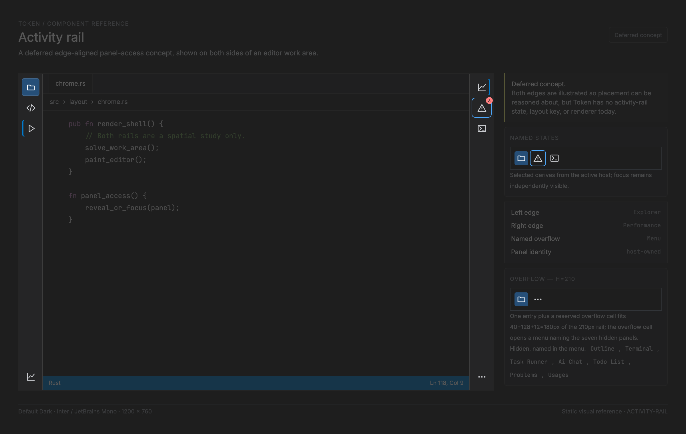

# Activity rail — deferred panel-access navigation

<!-- token-ui-mockup:begin ACTIVITY-RAIL -->
[](mockups/ACTIVITY-RAIL.html?view=emphasised)

*Visual target under review. [Normal PNG](mockups/renders/ACTIVITY-RAIL.png) · [Open normal mockup](mockups/ACTIVITY-RAIL.html?view=normal) · [Open emphasised mockup](mockups/ACTIVITY-RAIL.html?view=emphasised).*
<!-- token-ui-mockup:end ACTIVITY-RAIL -->

## Purpose and status

**Concept only; deferred and not implemented.** An activity rail is a narrow,
edge-aligned vertical strip of panel-access commands. It provides persistent,
compact access to named panel families and may appear on the left or right edge
of the work area. It is not a replacement for the Explorer, a panel tab strip,
or an arbitrary icon shelf. The prototype's right-side icons illustrate the
spatial idea, but its unlabelled decorative icons are not a production
interaction contract.

An ActivityRail would be useful only when Token has enough independently
toggleable, persistent panels to justify it. The current dock model has
left/right/bottom `DockPosition`, `PanelId`, and keyboard commands; no rail
state, layout key, or painter exists. This chapter therefore specifies a future
seam and explicitly defers visual or model implementation. It must not be used
to add a right rail now.

## Proposed representation and ownership

**Current excerpt** — [panel/dock.rs](../../src/panel/dock.rs#L9):

```rust
pub enum DockPosition {
    Left,
    Right,
    Bottom,
}

pub enum PanelId {
    FileExplorer,
    Outline,
    Terminal,
    TaskRunner,
    AiChat,
    TodoList,
    Problems,
    Usages,
}
```

The panel host is the source of placement and visible/focused state. In current
Token that host is `DockLayout`; after [Dockable panel](DOCKABLE-PANEL.md), it
must query both docked and floating placement. The rail owns only transient
focus/press/hover and a render projection; it does not duplicate placement or
persist a selected visual index.

```rust
// proposed API — not implemented
enum RailEdge { Left, Right }
enum PanelHostState {
    Docked { open: bool, active: bool },
    Floating { visible: bool, focused: bool },
    Closed,
}
struct RailEntry<'a> {
    panel: PanelId,              // stable existing panel identity
    label: &'a str,              // required, including icon-only rendering
    icon: IconId,
    enabled: bool,
    visible: bool,               // registration/policy projection, not user selection
    badge: Option<&'a str>,
}
struct ActivityRail<'a> {
    edge: RailEdge,
    entries: &'a [RailEntry<'a>], // declared order; every visible panel once
    focused: Option<PanelId>,
    press: Option<(PointerId, PanelId)>,
}
struct ActivityRailLayout {
    rail: Rect,
    entries: Vec<(PanelId, Rect)>,
    overflow: Option<Rect>,
}
```

Entries derive presentation from a host query: a docked panel is selected when
it is open and active; a floating panel is selected when visible and focused;
an unfocused but visible float is open but not selected. The selected mark does
not itself own a boolean. An entry's `PanelId` must be registered exactly once in the
visible rail order; absent or disabled panels are neither focusable nor
capturable. When registry/configuration changes, derive a fresh list and clear
stale `focused`/`press`; `DockLayout` repair remains the dock owner's job.
Badge content is borrowed status, not a count cache owned by the rail.

## Placement, input, and accessibility

The rail consumes a fixed logical width and spans the work area above the global
[Status bar](STATUS-BAR.md). Left/right placement is a shell decision, not a
property of an individual dock. At either edge its sibling surface gets the
remaining rectangle from the same shell/layout solve; neither editor nor dock
may independently subtract rail width. The rail may have leading/top, trailing/
bottom and overflow groups, with a flexible spacer between them.

Left and right rails may coexist. A panel entry is assigned to at most one
edge across both lists, and its edge does not relocate its actual panel host:
a right-rail entry may reveal a bottom-docked or floating panel. Entry IDs,
focus repair, and badge ownership therefore remain panel-based across edges.

For usable height `H`, vertical padding `P`, gap `G`, uniform cell height `C`,
and `n` visible entries, the no-overflow requirement is
`2P + nC + (n-1)G <= H`. Otherwise reserve one overflow cell, fit the declared
prefix/trailing policy deterministically, and expose omitted **named** entries
through [Menu](MENU.md). Do not rely on an offscreen scrolling icon column that
hides discoverability. Cells and hit targets use half-open snapped rectangles.

**Algorithm sketch:**

```text
fn layout(rail: Rect, entries: &[PanelId], P, G, C) -> ActivityRailLayout {
    H = rail.height
    n = entries.len()
    fits = 2*P + n*C + max(n - 1, 0)*G <= H
    if fits {
        visible = entries; overflow = None
    } else {
        // Largest k that still fits alongside one reserved overflow cell.
        k = max(k such that 2*P + (k+1)*C + k*G <= H, 0)
        visible = entries[..k]; overflow = entries[k..]  // named, not hidden
    }
    y = rail.y + P
    rects = []
    for panel_id in visible {
        rects.push((panel_id, Rect::new(rail.x, y, rail.width, C)))
        y += C + G
    }
    overflow_rect = fits ? None : Some(Rect::new(rail.x, y, rail.width, C))
    ActivityRailLayout { rail, entries: rects, overflow: overflow_rect }
}
```

Cell `i`'s rect therefore has `y = rail.y + P + i*(C+G)`; `hit(point)` is the
first cell (or the overflow cell) whose half-open rect contains `point`, else
`None`. This is the same fit test the two worked traces below evaluate.

Pointer press captures `(pointer, PanelId)` only on enabled visible entries;
matching release inside emits `RevealOrFocusPanel(PanelId)` to the panel-host
reducer. For present docks this maps to the existing `FocusOrTogglePanel`; for
a visible floating panel it focuses that panel instead of inventing a second
dock placement. Cancellation, release outside, focus loss, or entry removal
clears capture. Keyboard focus enters the rail with
Tab; Up/Down moves in declared visual order, Home/End reach edges, Enter/Space
invokes, and Tab exits. For right-edge rails, visual order is still top-to-bottom;
Left/Right should not ambiguously switch panels.

Every cell is a labelled control with role, enabled/pressed/selected state, and
tooltip. An icon alone is insufficient. Focus indication, selected state, and
problem badges must have non-color signals. If platform accessibility tree
support remains unavailable, this is a documented implementation gap, not a
reason to create unlabeled controls.

**Normal trace.** A right rail at 2× has `H=1,600`, `P=20`, `G=12`, and
`C=64`. Eight entries require `40 + 512 + 84 = 636` physical px and fit. The
third entry owns `[x,x+64) × [172,236)`; a pointer at its bottom edge `y=236`
does not hit it, while `y=235.9` does.

**Pathological trace.** At `H=210` with the same metrics, one entry plus an
overflow cell needs `40 + 2×64 + 12 = 180` px and fits: the entry is
`y=[20,84)`, overflow is `y=[96,160)`, and the other seven names are in its
menu. At `H<104`, even one cell needs `2P+C=104` px; hide the rail and expose a
labelled `Panels` group-chrome menu instead. It must never place overlapping
zero-height buttons. The exact responsive breakpoint beyond this fallback is
still deferred product work.

## Integration, invalidation, and verification

If adopted, extend the single shell/chrome solver with `ActivityRail(edge)` and
`ActivityRailEntry(PanelId)` keys, then map those keys to a new explicit hit
target. The future panel-host reducer owns `RevealOrFocusPanel`; it delegates
the docked case to `Msg::Dock(DockMsg)` and the floating case to Dockable Panel.
Renderer input only returns that intent. This is compatible with the current shell
in [src/layout/chrome.rs](../../src/layout/chrome.rs), current dock identities
in [src/panel/dock.rs](../../src/panel/dock.rs), and current panel painting in
[src/view/panels.rs](../../src/view/panels.rs), but none of those files currently
implements it.

Invalidate on rail edge/visibility/order, host placement/open/active/focused
state, badge/label/icon, window bounds, scale/font/cell metrics, and focus/press.
Theme changes repaint. Solving is O(number of registered rail entries), and
does not traverse panel contents. An async badge producer must associate its
value with panel identity and generation, then discard reply after that panel is
unregistered.

| Setup | Action | Expected result |
| --- | --- | --- |
| registered Outline in closed right dock | activate its rail entry | host delegates to dock reducer, opens/selects/focuses Outline, then rail derives selected state |
| visible but unfocused floating Performance | render then activate entry | entry shows open but not selected; host focuses float, then selected state updates |
| capture Problems entry | unregister/move it before release | capture clears and no stale panel intent occurs |
| 8 entries in normal rail height | solve and use keyboard Down | all cells have ordered non-overlapping rects; focus visits labels in declared order |
| too-short rail | solve under selected responsive policy | named overflow/collapse behavior, never clipped unknowable icon targets |
| icon-only entry | inspect accessibility/tooltip projection | name and selected/disabled state are available without interpreting glyph/color |

Gallery work can validate dimensions, edge variants, selected/badge/focus states,
and overflow appearance. Reducer and runtime tests must validate the existing
dock-command mapping, capture cancellation, and panel identity changes.

## Related contracts

- [Panel](PANEL.md) and [Dockable panel](DOCKABLE-PANEL.md) own the actual
  persistent panel/docking model.
- [Menu](MENU.md), [Icon](ICON.md), [Badge](BADGE.md), and
  [Foundations](FOUNDATIONS.md) cover reused behavior and accessibility basics.
- This rail remains a later product choice alongside the typography proposals
  in [editor visual polish](../feature/editor-visual-polish.md).
