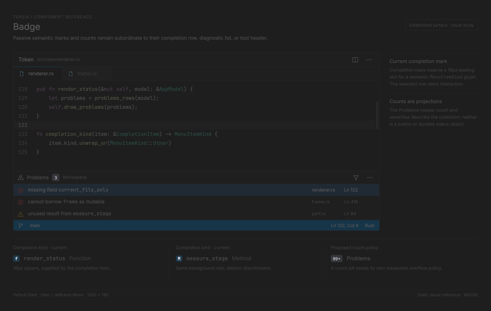

# Badge

<!-- token-ui-mockup:begin BADGE -->
[](mockups/BADGE.html?view=emphasised)

*Visual target under review. [Normal PNG](mockups/renders/BADGE.png) · [Open normal mockup](mockups/BADGE.html?view=normal) · [Open emphasised mockup](mockups/BADGE.html?view=emphasised).*
<!-- token-ui-mockup:end BADGE -->

## Current component boundary and ownership

Token's only badge primitive is a completion-kind mark embedded in an overlay
row. It is not a generic retained component, count pill, or interactive status
control. Completion/domain code owns `MenuItemKind`; `RowIcon::KindBadge` carries
that semantic value into one render pass, while selection and lifetime remain
with the list.

**Current excerpt**

```rust
pub enum RowIcon { None, Glyph { ch: char, color: u32 }, KindBadge(MenuItemKind) }
pub struct Row<'a> {
    pub icon: RowIcon, pub label: &'a str, pub match_indices: &'a [u32],
    pub detail: Option<&'a str>, pub accessory: Accessory<'a>,
}
const KIND_BADGE_SIZE: f32 = 16.0;
const KIND_BADGE_RADIUS: f32 = 4.0;
```

`MenuItemKind` is semantic input, not caller-provided color/text. Its private
mapping picks a discriminator (`Function → f`, `Method → M`, `Field → .`,
`Other → ?`) and source palette role. Function and method intentionally share a
background but not glyph. Unknown protocol data must map to `Other` before view
construction, rather than indexing a palette or panicking.

## Geometry, paint math, and clipping

List layout detects icons and reserves their leading column before label
truncation. For `KindBadge` it converts logical values to physical px:

```
d = round(16 × scale); r = round(4 × scale)
icon_x = row.x + round(row_inset × scale) + round(8 × scale)
badge = (icon_x, row.y + floor((row.h-d)/2), d, d)
glyph_size = 11 × scale as f32       // `size_px`: not rounded
glyph.x = badge.x + floor((d-ceil(measure(glyph)))/2)
glyph.y = badge.y + floor((d-line_height(glyph_size))/2)
```

Rectangle fields are physical pixels. `measure_sized` rounds each glyph advance,
so the one-glyph `glyph_w` is already an integral-valued `f32` (the later `ceil`
is harmless). Badge is not a hit target: overlay `Row` owns the list action;
`FlatIndex` is only the borrowed render wrapper used by `OverlaySpec`. Completion
state itself stores selected/scroll in its cursor-overlay state as `usize`.
Hover/selection changes parent wash, never badge pressed state. Normal
`render_list` establishes no list/owner clip; it paints under whatever `Frame`
clip its caller established. Settings row traversal separately pushes its
settings viewport clip.

The background is preblended opaque, not source-alpha painted over changing row
backgrounds:

```
out.channel = (source.channel * 20 + panel.channel * 80) / 100
out.alpha = 255
```

For source `#4080C0` over panel `#202020`, integer math produces `#263340`.
Painting 20% source after selection wash would change that color. `fill_rounded_rect`
uses anti-aliased corner coverage cached by physical radius; same-radius badges
share a mask regardless of color. Glyph uses `text_bright`.

## Projection, updates, cache inputs, and cost

```
LSP/completion item -> MenuItemKind -> modal::completion_rows -> RowIcon
                         update selection/scroll ------------^    |
Renderer -> overlay layout -> render_list -> badge fill/glyph -----+
```

There is no Badge message. Pointer/keyboard updates the owning consumer's
`usize` selection/scroll state; modal assembly wraps it as `FlatIndex` for
`OverlaySpec`. Consumers repair their own selection when filtering changes rows,
and render derives each remaining badge anew. No badge-level repair exists. Per visible badge cost is
O(1) rounded fill plus one glyph lookup/paint; no badge layout cache exists.
Palette, font, scale, row geometry, and item kind are repaint inputs. Radius and
glyph-size changes naturally select different cache entries. Completion accepts
items against their `document_id` and `revision` guards (not a generic generation
counter); paint cannot repair stale semantics.

## Worked trace and verification

At `scale=1.25`, normal-overlay inset is `round(6×1.25)=8`, pad is
`round(8×1.25)=10`, `d=20`, `r=5`, and the normal logical 30px row becomes
38 physical px. Thus row `(40,80,260,38)` has icon x `40+8+10=58` and badge
`(58,89,20,20)`. The glyph paint size is the unrounded `11×1.25=13.75f32`;
if its rounded `M` cell measures 9px and line height is 14, glyph origin is
`(58+floor((20-9)/2),89+floor((20-14)/2))=(63,92)`. Clicking (68,99)
activates its row, not a badge-specific action. Unknown kind uses `Other`/`?`,
never prior-row color. A settings viewport clip constrains a Settings badge-like
row, but a normal overlay list requires its caller to establish clipping.

Existing mapping/gallery coverage is in [overlay_surface.rs](../../src/view/overlay_surface.rs)
and [gallery.rs](../../src/model/gallery.rs). Add exact 1.25x rectangle, opaque
alpha, r5-mask-reuse across colors, `Other` fallback, and no badge `HitTarget`
tests.

## Proposed extension boundary

Do not introduce `Badge { color, text }`. A second passive consumer must retain
semantic type and define its own measurement/overflow policy:

```rust
// proposed API — not implemented
// MenuItemKind is crate::completion::menu's domain enum; Severity is the
// existing overlay severity enum. WidgetRect is view::geometry's physical-usize
// rectangle. Count stays numeric until this adapter applies its `99+` policy.
enum BadgeKind { Completion(MenuItemKind), Severity(Severity), Count(u32) }
enum BadgePresentation { SquareGlyph, PillText }
struct BadgeLayout { outer: WidgetRect, content: WidgetRect }
```

A count pill needs a digit policy such as `99+`, measured width, owner clip, and
text alternative; it cannot reuse a 16px completion slot. Token lacks a platform
accessibility tree, so current row text must name a kind rather than color alone.

Sources: [overlay_surface.rs](../../src/view/overlay_surface.rs),
[frame.rs](../../src/view/frame.rs), [modal.rs](../../src/view/modal.rs).
