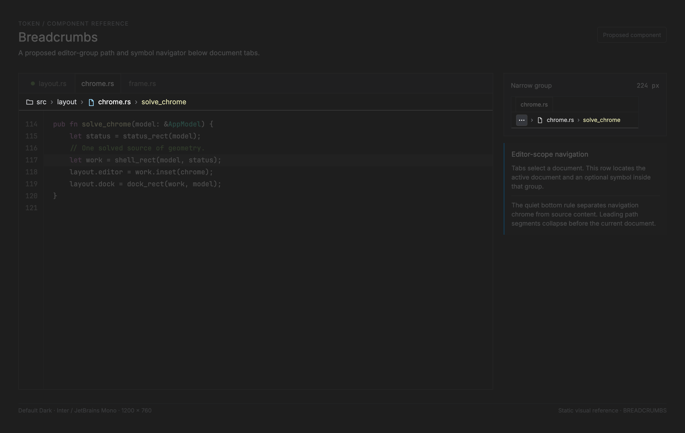

# Breadcrumbs — proposed editor-scope navigation

<!-- token-ui-mockup:begin BREADCRUMBS -->
[](mockups/BREADCRUMBS.html?view=emphasised)

*Visual target under review. [Normal PNG](mockups/renders/BREADCRUMBS.png) · [Open normal mockup](mockups/BREADCRUMBS.html?view=normal) · [Open emphasised mockup](mockups/BREADCRUMBS.html?view=emphasised).*
<!-- token-ui-mockup:end BREADCRUMBS -->

## Purpose and boundary

**Planned; no production breadcrumbs exist.** A breadcrumb bar is a compact,
single-line navigator directly below one editor group's document-tab strip and
directly above that group's content. It answers “where is the thing I am
editing?” and offers navigation to an ancestor directory, the current document,
or a containing symbol. It does not replace the Explorer, tabs, Go to Symbol,
or the editor's text navigation.

The performance prototype's `src › layout › chrome.rs › solve_chrome` row is
the visual source of this proposal. Its bottom separator should become a subtle
one-physical-pixel boundary between navigation chrome and the editor surface;
it is not a second tab bar. The real editor does **not** currently have this
bar, and its tab strip is owned by `EditorTabBarLayout`, not by the prototype.
See [Tabs](TABS.md) for that independent contract and
[editor visual-polish proposal](../feature/editor-visual-polish.md) for the
separate typography work.

## Representation, ownership, and invariants

The durable source is the **active document in each editor group**, its stable
path, and that group's active editor location/symbol query; it is not only the
globally focused document. This keeps an unfocused split's chrome truthful.
A breadcrumb bar stores none of those values. `GroupId` remains the visual
scope identity. The proposed dependencies are `DocumentId`, `EditorId`, and
`GroupId` from the editor model; `SymbolId` is a source/syntax symbol identity
valid only for one document revision; `IconId` is the semantic glyph identity
described by [Icon](ICON.md); and `PointerId = u64` names one runtime pointer
sequence. A render-time projection may use the following proposed types:

```rust
// proposed API — not implemented
enum BreadcrumbId {
    Directory { canonical_path: PathBuf },
    File { document: DocumentId },
    Symbol { document: DocumentId, symbol: SymbolId },
}
enum BreadcrumbKind { Directory, File, Symbol }
struct BreadcrumbItem<'a> {
    id: BreadcrumbId,                 // stable navigation target, never display index
    kind: BreadcrumbKind,
    label: &'a str,                   // already display-formatted by the owner
    icon: Option<IconId>,             // optional; absence reserves no icon width
    enabled: bool,
}
struct BreadcrumbBar<'a> {
    group: GroupId,
    editor: EditorId,
    document: DocumentId,
    document_revision: u64,
    generation: u64,                 // source-query generation for this group/editor/doc revision
    items: Vec<BreadcrumbItem<'a>>,   // outermost directory → file → innermost symbol
    selected: Option<BreadcrumbId>,   // current location when representable; no input focus
}
struct BreadcrumbLayout {
    bar: Rect, content: Rect,
    visible: Vec<(BreadcrumbId, Rect)>,
    hidden_prefix: usize,
    overflow: Option<Rect>,
}
```

`BreadcrumbBar` is borrowed presentation: the editor/document owner derives it
after resolving every group's active editor/document. `BreadcrumbLayout` is per-pass geometry;
it is never persisted. `selected` must name an item in `items`, and each item
identity may occur once. A missing workspace path means the bar may contain
only the File item. A symbol reply is accepted only when its
`(group, editor, document, document_revision, generation)` matches the still-active
source; otherwise it is discarded. A closed document cannot recreate a
breadcrumb for a recycled split or an editor that changed documents. On document close, group replacement, or
active-editor change, the group owner derives a new list and clears stale
hover/press/focus identity.

Path normalization and any filesystem reads belong to the document/workspace
owner, never the projection or painter. An empty group has no breadcrumb
projection or reserved bar height. Unsaved documents may have a File item with
their existing display title; they do not invent a filesystem path.

The optional icon is present only when it adds recognition (for example, a file
type or symbol kind). Text and keyboard labels remain required; an icon is not
the identity or the sole accessibility label.

## Layout, overflow, and interaction

The normal visual order is directory, separator, directory, separator, file,
separator, symbol. Separators are paint-only and never input targets. The bar
has a fixed logical height owned by editor chrome, converted and edge-snapped
with the rest of the group. Its content rectangle subtracts horizontal padding;
the bottom border lies at the snapped bottom edge and belongs to the bar.

Let `M(i)` be the measured label width plus optional icon/gap and item padding,
`S` the measured separator width plus its gaps, and `W` the content width. The
current document (rightmost File or Symbol) must remain visible. Measure from
right to left, admitting suffix items while `used + M(i) + S <= W`. If any
leading item is omitted, reserve `M(ellipsis)` first and repeat. The ellipsis
represents the omitted prefix and opens a menu of those exact IDs; it never
pretends to be a directory. Layout uses physical pixels after text measurement;
round only the solved edges.

```text
used = 0; visible_suffix = []
for item from right to left:
    cost = M(item) + (S if visible_suffix is not empty else 0)
    if used + cost <= W: include item; used += cost
    else: break
if some leading items omitted:
    reserve ellipsis; recompute suffix with W - M(ellipsis) - S
```

Pointer press on a visible enabled item captures `(PointerId, BreadcrumbId)` in UI interaction state;
matching release inside emits `Navigate(id)`. Release outside, cancellation,
focus loss, group replacement, or item removal clears capture without
navigation. Clicking the overflow opens the ordinary [Menu](MENU.md), whose
items return the same IDs. Initial shipping requires the full keyboard route:
Tab reaches the group bar, Left/Right moves among visible enabled items and
overflow, Enter/Space invokes, and Escape closes overflow and restores its
trigger. There is no pointer-only breadcrumb variant. A first non-interactive
path-label experiment is permissible, but it must have no clickable affordances
or navigation hit targets and must be labelled as passive gallery coverage.
Visible labels and menu entries remain accessible when an optional icon is present.

The proposed first navigation mapping is concrete: a Directory intent reveals
and selects that ancestor in Explorer; a File intent activates its originating
editor group/document without moving the caret; a Symbol intent activates that
group and reveals the symbol's validated source range. Any required filesystem
loading stays behind commands/runtime. The reducer revalidates the source tuple
and identity at activation, including after an overflow menu was opened. If the
range or target disappeared, dismiss that stale choice and refresh the bar.
Sibling-directory/symbol picker menus are a later extension, not implied by
painting separators.

**Normal trace.** At scale 2, a 600-logical-pixel editor group has a
1,200-physical-pixel bar. With 20 px content padding on each side, `W=1,160`.
Measured items `src=42`, `layout=62`, `chrome.rs=84`, `solve_chrome=112` and
three separators of 14 consume 342 px; all items appear in order. The separator
border is drawn at the bar's snapped bottom, e.g. `[74,112)` becomes physical
row 111.

**Pathological trace.** With `W=132`, `M(overflow)=20` and separator `S=14`
leave `98` px for the current 112 px `solve_chrome` item. Render the 20 px
overflow trigger, one 14 px separator, and the current item truncated to 98 px:
`20 + 14 + 98 = 132`. Its menu holds hidden `src`, `layout`, and `chrome.rs`
identities. If reserving overflow plus separator would leave less than a
measured ellipsis-width current item, use the compact menu instead. With a
22 px current-item minimum, that means `22 <= W < 56`: render only a 22 px accessible `Current path`
menu trigger, containing the full path; at `W < 22`, omit the visual row and
expose the same `Current path` group-chrome command to keyboard/accessibility.
No zero-width hit target or clipped unlabelled ellipsis is produced.

## Integration, invalidation, and verification

Current integration is `AppModel → EditorTabBarLayout → Renderer`; the group
content starts beneath the tab bar in the specialized editor geometry. A later
implementation should extend that **one** group/chrome geometry authority to
reserve a breadcrumb rectangle, and add typed layout keys/hit targets for
`BreadcrumbBar(GroupId)`, item IDs, and overflow. It must not independently
subtract height in `editor_text`, hit testing, and painting. The existing
window shell's `UiKey::EditorArea` is only the outer work area
([layout/chrome.rs](../../src/layout/chrome.rs)); it is not breadcrumb layout.

The projection/layout invalidates on every group's active editor/document/path/
symbol or symbol-revision/generation change, tab/group structure, workspace
root/display formatting, font/scale/theme, available group bounds, and icon availability. Measuring is
`O(n)` in breadcrumb depth; normal directory paths are short. Theme changes
repaint border and roles, but only require remeasurement if typography changes.

Proposed verification:

| Setup | Action | Expected result |
| --- | --- | --- |
| active `src/layout/chrome.rs`, symbol `solve_chrome` in unfocused group B | render at 600 logical px, 2× | ordered four-item path in B; one snapped bottom separator; editor text starts below it |
| same path at `W=132` physical px | render/click overflow | 20 px trigger + 14 px separator + 98 px truncated current item; overflow lists hidden IDs |
| captured `File(document A)` | close A before release | capture clears; no navigation to a replacement tab |
| symbol reply for old `(group, editor, document, revision, generation)` | switch that group to document B, then receive reply | reply is discarded; B's current path remains |
| file with no workspace root | render | File and optional symbol only; no fabricated ancestor or leading separator |
| icon-less directory | render/read accessibility data | no blank icon slot; visible text label and role remain available |

Static gallery coverage can prove contrast, border placement, icon/no-icon, and
overflow appearances. It cannot prove document identity repair, menu return,
or editor viewport geometry; those require reducer/layout and runtime tests.

## Evidence and related contracts

- [src/layout/editor.rs](../../src/layout/editor.rs) owns current editor-tab
  flow and clipping; [src/view/document_tabs.rs](../../src/view/document_tabs.rs)
  paints it.
- [src/layout/chrome.rs](../../src/layout/chrome.rs) defines only the current
  outer `EditorArea`; [src/layout/keys.rs](../../src/layout/keys.rs) shows that
  no breadcrumb key yet exists.
- [Panel](PANEL.md), [Menu](MENU.md), [Tabs](TABS.md), and
  [Foundations](FOUNDATIONS.md) supply the neighboring contracts.
