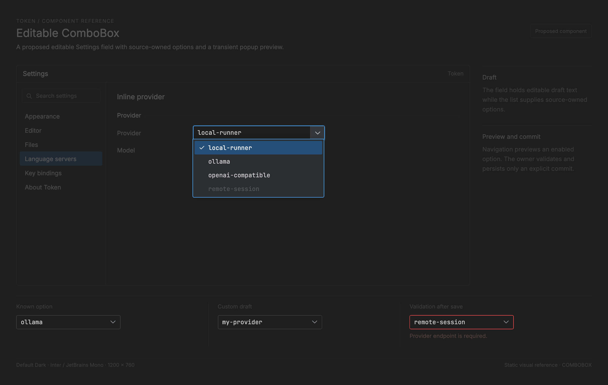

# Editable ComboBox — proposed implementation reference

<!-- token-ui-mockup:begin COMBOBOX -->
[](mockups/COMBOBOX.html?view=emphasised)

*Visual target under review. [Normal PNG](mockups/renders/COMBOBOX.png) · [Open normal mockup](mockups/COMBOBOX.html?view=normal) · [Open emphasised mockup](mockups/COMBOBOX.html?view=emphasised).*
<!-- token-ui-mockup:end COMBOBOX -->

Token currently has no editable ComboBox. The existing
[Select](SELECT.md) is a finite, non-editable chooser: SelectState owns open,
active and scroll only; the gallery owns the committed theme index and commit
effect. Settings has a different feature-local finite popup. Neither accepts
custom text, maintains history, validates input, or receives asynchronous
options. This chapter specifies the missing editable control without claiming
it exists.

Current Select uses an anchor Rect in **physical pixels**. Its view converts
anchor.width by scale only at the OverlaySpec logical-width boundary. Select
details remain in SELECT.md; duplicating them here would obscure the new
requirements below.

## 1. Boundary and ownership

The ComboBox is a presentation/input state machine embedded in a feature owner.
It emits proposed effects; it does not extend Token Cmd, write persistence, or
run a query itself.

```text
platform input
  -> runtime resolves the current measured layout to FieldId, Position, OptionId
  -> owner update reduces ComboMsg to ComboEffect values
  -> runtime adapter executes effects and returns ComboMsg completion
  -> owner accepts only matching instance/source/generation results
  -> renderer reads owner snapshot and state, then produces next layout
```

The important split is:

| Category                          | Proposed owner | Meaning                                           |
| --------------------------------- | -------------- | ------------------------------------------------- |
| option source and persisted value | feature owner  | durable data and source revision                  |
| history                           | feature owner  | only successful durable commits enter it          |
| editable text/caret/selection     | ComboBoxState  | transient draft based on existing EditableState   |
| popup preview/scroll/capture      | ComboBoxState  | transient projection, never a committed value     |
| query request identity            | ComboBoxState  | rejects late source/filter replies                |
| measured capacity and rectangles  | ComboBoxLayout | derived each layout epoch; no durable coordinates |

The shared FieldId and TextOperation types are proposed in
[Text Field](TEXT-FIELD.md). They use owned identity rather than a static
label, so dynamic form rows and a ComboBox can share input routing without
conflating translated labels with identity.

## 2. Typed representation

**Proposed API.** These names and the hypothetical ui module do not currently
exist in Token.

```rust
use std::{num::NonZeroUsize, sync::Arc};

use crate::editable::{EditableState, MoveTarget, Position, StringBuffer};
use crate::ui::text_field::{FieldId, TextOperation};

#[derive(Debug, Clone, Copy, PartialEq, Eq, Hash)]
pub struct OptionId(pub u64);

#[derive(Debug, Clone, PartialEq, Eq)]
pub struct ComboOption {
    pub id: OptionId,
    pub label: Arc<str>,
    pub enabled: bool,
}

#[derive(Debug, Clone)]
pub struct OptionSnapshot {
    pub revision: u64,
    pub options: Arc<[ComboOption]>,
}

#[derive(Debug, Clone, PartialEq, Eq)]
pub enum ComboValue {
    Option(OptionId),
    Custom(Arc<str>),
}

#[derive(Debug, Clone, PartialEq, Eq)]
pub enum Validation {
    Valid,
    Invalid { message: Arc<str> },
}

#[derive(Debug, Clone, PartialEq, Eq)]
pub enum Popup {
    Closed,
    Open {
        active: Option<OptionId>,
        first_visible: usize,
        pressed: Option<OptionId>,
    },
}

#[derive(Debug, Clone)]
pub struct Composition {
    pub replacement: std::ops::Range<Position>,
    pub preedit: String,
}

#[derive(Debug, Clone, PartialEq, Eq)]
pub enum SaveState {
    Idle,
    Saving {
        token: Arc<()>,
        candidate: ComboValue,
    },
}

pub struct ComboBoxState {
    pub field: FieldId,
    pub instance: Arc<()>,
    pub editable: EditableState<StringBuffer>,
    pub popup: Popup,
    pub focused: bool,
    pub composition: Option<Composition>,
    pub query_generation: u64,
    pub filtered: Arc<[OptionId]>,
    pub visible_capacity: usize,
    pub validation: Validation,
    pub source_error: Option<Arc<str>>,
    pub save: SaveState,
}

pub struct ComboHistory {
    pub entries: Vec<ComboValue>,
    pub capacity: NonZeroUsize,
}

pub struct ComboOwner {
    pub source: OptionSnapshot,
    pub committed: Option<ComboValue>,
    pub history: ComboHistory,
}
```

OptionId is stable over filtering, sorting and relabeling. An index cannot be:
after filtering, row three may name a different option. OptionSnapshot owns the
exact source revision used for filtering. ComboOwner owns it mutably, so an
accepted source replacement and the replacement filtered-ID slice can be
published as one update. The renderer only borrows both after update completes.

The Arc unit in instance is a field-instance token. FieldId can be reused when
a form closes and reopens; instance cannot. Every request carries a clone and
acceptance uses pointer identity before looking at field identity, revision or
generation. This prevents a reply from an old incarnation of the same field
name from publishing after recreation.

Draft editable text and committed value intentionally diverge. Typing an
invalid endpoint preserves the prior committed endpoint. Selecting an option
sets draft text to its label but is not durable until the feature persistence
completion succeeds. Popup active is similarly only preview. The control has
no Validation::Pending: this design chooses synchronous validation. A feature
requiring remote validation must add a separately identity-guarded validation
request and state, rather than claiming Pending is meaningful without events.

### Invariants and repair

| Invariant                                         | Repair owner and algorithm                                                        |
| ------------------------------------------------- | --------------------------------------------------------------------------------- |
| IDs are unique in source.options                  | source loader rejects duplicate IDs before OptionSnapshot construction            |
| every filtered ID occurs in source revision       | rebuild_filtered reads source.options and returns a new Arc slice                 |
| active is None or an enabled filtered ID          | repair_popup preserves same ID if possible, else first enabled ID, else None      |
| first_visible fits filtered count and capacity    | reveal_active receives measured capacity and clamps after active repair           |
| a list press cannot commit a removed option       | PointerListPress stores OptionId; PointerRelease re-resolves it in current source |
| only current field incarnation accepts completion | Arc::ptr_eq instance check precedes all state/source publication                  |
| history contains only saved values                | PersistFinished Ok sets committed then records normalized candidate               |
| preedit cannot modify query/history               | only CompositionCommit calls insert_text_and_refresh; blur/cancel discard preedit |

The exact source-update repair order is source snapshot, filtered slice, active
ID and pressed ID, then first-visible reveal. A pressed ID that is absent or
disabled is cleared before any pointer release. Replacing active by its old
numeric position is incorrect. For example, active ruby ID at position 1 must
become rust or None when ruby disappears, not python which inherited position
1; releasing a pointer that started on ruby must not then commit rust.

## 3. Messages and effects

Messages always name an identity or logical position. The runtime derives them
from the one current ComboBoxLayout; update never receives pixels.

```rust
pub enum ComboMsg {
    Focus,
    Blur,
    PointerField { position: Position, extend: bool },
    PointerListPress { option: OptionId },
    PointerListRelease { option: Option<OptionId> },
    Open,
    Close,
    Edit(TextOperation),
    CompositionStart { replacement: std::ops::Range<Position> },
    CompositionUpdate { preedit: String },
    CompositionCommit { text: String },
    CompositionCancel,
    MoveList { delta: isize },
    MoveListTo { edge: ListEdge },
    MoveListPage { forward: bool },
    CommitActive,
    CommitCustom,
    LayoutMeasured { visible_capacity: usize },
    SourceReplaced { source: OptionSnapshot },
    OptionsReady {
        request: Arc<ComboQueryRequest>,
        result: Result<OptionSnapshot, String>,
    },
    PersistFinished {
        instance: Arc<()>,
        token: Arc<()>,
        result: Result<(), String>,
    },
}

pub enum ListEdge { First, Last }

pub struct ComboQueryRequest {
    pub instance: Arc<()>,
    pub field: FieldId,
    pub source_revision: u64,
    pub generation: u64,
    pub query: String,
}

pub enum ComboEffect {
    Redraw,
    QueryOptions(Arc<ComboQueryRequest>),
    Persist {
        instance: Arc<()>,
        token: Arc<()>,
        value: ComboValue,
    },
}
```

ComboEffect is deliberately not Cmd. The feature runtime adapter maps
QueryOptions to its actual worker/client and delivers OptionsReady; it maps
Persist to the feature's normal configuration or domain save command and
delivers PersistFinished. That keeps this component free of fake application
command variants and preserves the Message -> Update -> Command boundary.

## 4. Reducer algorithms

The following helpers are complete enough to define the reducer's nontrivial
work. They use only current owner/state snapshots.

```rust
fn rebuild_filtered(source: &OptionSnapshot, query: &str) -> Arc<[OptionId]> {
    let needle = query.to_lowercase();
    source
        .options
        .iter()
        .filter(|option| option.label.to_lowercase().contains(&needle))
        .map(|option| option.id)
        .collect()
}

fn option_by_id<'a>(
    source: &'a OptionSnapshot,
    id: OptionId,
) -> Option<&'a ComboOption> {
    source.options.iter().find(|option| option.id == id)
}

fn enabled_first(filtered: &[OptionId], source: &OptionSnapshot) -> Option<OptionId> {
    filtered.iter().copied().find(|id| {
        option_by_id(source, *id).is_some_and(|option| option.enabled)
    })
}

fn visible_index(filtered: &[OptionId], id: OptionId) -> Option<usize> {
    filtered.iter().position(|candidate| *candidate == id)
}

fn reveal_active(state: &mut ComboBoxState) {
    let Popup::Open { active, first_visible, .. } = &mut state.popup else {
        return;
    };
    let capacity = state.visible_capacity.max(1);
    let count = state.filtered.len();
    let max_first = count.saturating_sub(capacity);
    let Some(index) = active.and_then(|id| visible_index(&state.filtered, id)) else {
        *first_visible = (*first_visible).min(max_first);
        return;
    };
    if index < *first_visible {
        *first_visible = index;
    } else if index >= first_visible.saturating_add(capacity) {
        *first_visible = index + 1 - capacity;
    }
    *first_visible = (*first_visible).min(max_first);
}

fn repair_popup(state: &mut ComboBoxState, source: &OptionSnapshot) {
    if let Popup::Open {
        active, pressed, ..
    } = &mut state.popup {
        let pressed_is_current = pressed.is_some_and(|id| {
            state.filtered.contains(&id)
                && option_by_id(source, id).is_some_and(|option| option.enabled)
        });
        if !pressed_is_current {
            *pressed = None;
        }
        let still_enabled = active.is_some_and(|id| {
            state.filtered.contains(&id)
                && option_by_id(source, id).is_some_and(|option| option.enabled)
        });
        if !still_enabled {
            *active = enabled_first(&state.filtered, source);
        }
    }
    reveal_active(state);
}

fn normalize(value: &ComboValue) -> ComboValue {
    match value {
        ComboValue::Option(id) => ComboValue::Option(*id),
        ComboValue::Custom(text) => ComboValue::Custom(
            Arc::<str>::from(text.trim().to_lowercase()),
        ),
    }
}

fn record_history(history: &mut ComboHistory, candidate: &ComboValue) {
    let normalized = normalize(candidate);
    history.entries.retain(|entry| normalize(entry) != normalized);
    history.entries.insert(0, normalized);
    history.entries.truncate(history.capacity.get());
}

fn apply_text_operation(
    editable: &mut EditableState<StringBuffer>,
    operation: TextOperation,
) -> bool {
    match operation {
        TextOperation::Insert(text) => editable.insert_text(&text),
        TextOperation::DeleteBackward => editable.delete_backward(),
        TextOperation::SelectAll => {
            editable.select_all();
            true
        }
        TextOperation::Move { target, extend } => {
            match target {
                MoveTarget::Left => editable.move_left(extend),
                MoveTarget::Right => editable.move_right(extend),
                MoveTarget::Up => editable.move_up(extend),
                MoveTarget::Down => editable.move_down(extend),
                MoveTarget::LineStart => editable.move_line_start(extend),
                MoveTarget::LineEnd => editable.move_line_end(extend),
                MoveTarget::LineStartSmart => editable.move_line_start_smart(extend),
                MoveTarget::WordLeft => editable.move_word_left(extend),
                MoveTarget::WordRight => editable.move_word_right(extend),
                MoveTarget::DocumentStart => editable.move_document_start(extend),
                MoveTarget::DocumentEnd => editable.move_document_end(extend),
                MoveTarget::PageUp | MoveTarget::PageDown => return false,
            }
            true
        }
    }
}

fn insert_composition(
    editable: &mut EditableState<StringBuffer>,
    replacement: std::ops::Range<Position>,
    text: &str,
) -> bool {
    editable.set_cursor_position(replacement.start, false);
    editable.set_cursor_position(replacement.end, true);
    editable.insert_text(text)
}
```

Lowercase contains is deliberately an example filter policy, not a universal
fuzzy-search promise. A real feature can replace it with a normalized matcher
as long as it produces IDs from the same source snapshot. Validation is also
owner-supplied but synchronous:

```rust
fn validate_custom(text: &str) -> Validation {
    if text.trim().is_empty() {
        Validation::Invalid { message: Arc::from("Enter a value") }
    } else {
        Validation::Valid
    }
}
```

### Exhaustive transition table

| Message                 | Preconditions                                  | Deterministic state change                                                        | Effect                                           |
| ----------------------- | ---------------------------------------------- | --------------------------------------------------------------------------------- | ------------------------------------------------ |
| Focus                   | focusable                                      | focused=true; a saving field remains focused but rejects mutation                 | Redraw                                           |
| Blur                    | any                                            | focused=false, popup closed, preedit cleared, pressed cleared                     | Redraw                                           |
| PointerField            | focused or focusable                           | focus; set editable cursor/selection; popup stays as current policy dictates      | Redraw                                           |
| PointerListPress        | popup open and current enabled ID              | active=id, pressed=Some(id), reveal                                               | Redraw                                           |
| PointerListRelease      | popup open                                     | commit only if released ID equals pressed and still enabled; always clear pressed | Persist or Redraw                                |
| Open                    | focusable                                      | open with committed enabled ID or first enabled ID; reveal                        | Redraw                                           |
| Close/Escape            | popup open                                     | popup closed; no draft/commit change                                              | Redraw                                           |
| Edit                    | no preedit and not saving                      | apply TextOperation, increment generation, rebuild filter, validate, repair       | QueryOptions + Redraw                            |
| CompositionStart/Update | focused and not saving                         | create/change preedit only                                                        | Redraw                                           |
| CompositionCommit       | focused preedit and save idle                  | one editable insertion, generation/filter/validation repair                       | QueryOptions + Redraw                            |
| CompositionCancel       | any preedit                                    | drop preedit only                                                                 | Redraw                                           |
| MoveList                | popup open                                     | move active among enabled IDs by delta, reveal                                    | Redraw                                           |
| MoveListTo              | popup open                                     | first/last enabled ID, reveal                                                     | Redraw                                           |
| MoveListPage            | popup open                                     | delta equals measured capacity, reveal                                            | Redraw                                           |
| LayoutMeasured          | any                                            | set max(1, supplied capacity), reveal                                             | Redraw if first changes                          |
| SourceReplaced          | any                                            | replace owner source and filtered atomically, repair                              | Redraw; owner may separately issue a fresh query |
| OptionsReady            | exact instance/revision/generation             | replace owner source and filtered atomically, repair; else no-op                  | Redraw                                           |
| CommitActive            | no preedit, save idle, active resolves enabled | set draft to option label and stage value for persistence                         | Persist                                          |
| CommitCustom            | no preedit, save idle, validation valid        | stage custom value for persistence                                                | Persist                                          |
| PersistFinished Ok      | exact pending save token/instance              | owner committed=candidate, history record, save idle                              | Redraw                                           |
| PersistFinished Err     | exact pending save token/instance              | preserve owner committed/history, save idle, field error                          | Redraw                                           |

No declared message falls through a catch-all handler. Messages which fail a
listed precondition are explicit no-ops with no effect. Disable/removal is
handled by parent sending Blur followed by SourceReplaced or dropping state.

### Reducer core

```rust
fn refresh_query(
    owner: &ComboOwner,
    state: &mut ComboBoxState,
) -> Arc<ComboQueryRequest> {
    state.query_generation = state.query_generation.wrapping_add(1);
    let query = state.editable.text();
    state.filtered = rebuild_filtered(&owner.source, &query);
    state.validation = validate_custom(&query);
    state.source_error = None;
    repair_popup(state, &owner.source);
    Arc::new(ComboQueryRequest {
        instance: Arc::clone(&state.instance),
        field: state.field.clone(),
        source_revision: owner.source.revision,
        generation: state.query_generation,
        query,
    })
}

fn begin_persist(
    state: &mut ComboBoxState,
    candidate: ComboValue,
) -> Option<ComboEffect> {
    if !matches!(state.save, SaveState::Idle) {
        return None;
    }
    let token = Arc::new(());
    state.save = SaveState::Saving {
        token: Arc::clone(&token),
        candidate: candidate.clone(),
    };
    state.popup = Popup::Closed;
    Some(ComboEffect::Persist {
        instance: Arc::clone(&state.instance),
        token,
        value: candidate,
    })
}

fn accept_options(
    owner: &mut ComboOwner,
    state: &mut ComboBoxState,
    request: &Arc<ComboQueryRequest>,
    result: Result<OptionSnapshot, String>,
) -> Option<ComboEffect> {
    if !Arc::ptr_eq(&request.instance, &state.instance)
        || request.field != state.field
        || request.source_revision != owner.source.revision
        || request.generation != state.query_generation
    {
        return None;
    }
    match result {
        Ok(snapshot) if snapshot.revision == request.source_revision => {
            owner.source = snapshot;
            state.filtered = rebuild_filtered(&owner.source, &request.query);
            state.source_error = None;
            repair_popup(state, &owner.source);
        }
        Ok(_) => return None,
        Err(error) => state.source_error = Some(Arc::from(error)),
    }
    Some(ComboEffect::Redraw)
}

fn finish_persist(
    owner: &mut ComboOwner,
    state: &mut ComboBoxState,
    instance: Arc<()>,
    token: Arc<()>,
    result: Result<(), String>,
) -> Option<ComboEffect> {
    let SaveState::Saving { token: pending, candidate } = &state.save else {
        return None;
    };
    if !Arc::ptr_eq(&instance, &state.instance) || !Arc::ptr_eq(pending, &token) {
        return None;
    }
    let candidate = candidate.clone();
    state.save = SaveState::Idle;
    match result {
        Ok(()) => {
            owner.committed = Some(candidate.clone());
            record_history(&mut owner.history, &candidate);
            state.validation = Validation::Valid;
        }
        Err(error) => {
            state.validation = Validation::Invalid {
                message: Arc::from(format!("Not saved: {error}")),
            };
        }
    }
    Some(ComboEffect::Redraw)
}
```

The parent reducer calls refresh_query after every successful regular edit or
composition commit. It calls begin_persist for a re-resolved active option or a
Valid custom draft. It calls accept_options only from OptionsReady and
finish_persist only from PersistFinished. Owner source is mutable in these
functions, so accepted snapshot publication is not a fiction over an immutable
old slice.

For completeness, this is the exhaustive dispatch shape. The small helpers
named here are direct algorithms: enabled_ids filters the current ID slice by
source enabled flag; move_enabled finds the active ID position in that filtered
slice, clamps an absent active to the first item, then applies a bounded delta;
stage_active resolves active through the current source before begin_persist.

```rust
fn update_combo(
    owner: &mut ComboOwner,
    state: &mut ComboBoxState,
    msg: ComboMsg,
) -> Vec<ComboEffect> {
    match msg {
        ComboMsg::Focus => {
            state.focused = true;
            vec![ComboEffect::Redraw]
        }
        ComboMsg::Blur => {
            state.focused = false;
            state.popup = Popup::Closed;
            state.composition = None;
            vec![ComboEffect::Redraw]
        }
        ComboMsg::PointerField { position, extend } => {
            if !matches!(state.save, SaveState::Idle) {
                return Vec::new();
            }
            state.focused = true;
            state.editable.set_cursor_position(position, extend);
            vec![ComboEffect::Redraw]
        }
        ComboMsg::PointerListPress { option } => {
            let eligible = state.filtered.contains(&option)
                && option_by_id(&owner.source, option).is_some_and(|item| item.enabled);
            if !eligible {
                return Vec::new();
            }
            if let Popup::Open { active, pressed, .. } = &mut state.popup {
                *active = Some(option);
                *pressed = Some(option);
                reveal_active(state);
                return vec![ComboEffect::Redraw];
            }
            Vec::new()
        }
        ComboMsg::PointerListRelease { option } => {
            let pressed = match &mut state.popup {
                Popup::Open { pressed, .. } => pressed.take(),
                Popup::Closed => None,
            };
            if let Some(pressed) = pressed.filter(|pressed| Some(*pressed) == option) {
                return stage_option(owner, state, pressed).into_iter().collect();
            }
            vec![ComboEffect::Redraw]
        }
        ComboMsg::Open => {
            if !matches!(state.save, SaveState::Idle) {
                return Vec::new();
            }
            let active = owner.committed.as_ref().and_then(|value| match value {
                ComboValue::Option(id) => Some(*id),
                ComboValue::Custom(_) => None,
            }).filter(|id| {
                state.filtered.contains(id)
                    && option_by_id(&owner.source, *id).is_some_and(|item| item.enabled)
            }).or_else(|| enabled_first(&state.filtered, &owner.source));
            state.focused = true;
            state.popup = Popup::Open {
                active,
                first_visible: 0,
                pressed: None,
            };
            reveal_active(state);
            vec![ComboEffect::Redraw]
        }
        ComboMsg::Close => {
            state.popup = Popup::Closed;
            state.composition = None;
            vec![ComboEffect::Redraw]
        }
        ComboMsg::Edit(operation) => {
            if state.composition.is_some() || !matches!(state.save, SaveState::Idle) {
                return Vec::new();
            }
            if !apply_text_operation(&mut state.editable, operation) {
                return Vec::new();
            }
            let request = refresh_query(owner, state);
            vec![ComboEffect::QueryOptions(request), ComboEffect::Redraw]
        }
        ComboMsg::CompositionStart { replacement } => {
            if state.focused && matches!(state.save, SaveState::Idle) {
                state.composition = Some(Composition {
                    replacement,
                    preedit: String::new(),
                });
                vec![ComboEffect::Redraw]
            } else {
                Vec::new()
            }
        }
        ComboMsg::CompositionUpdate { preedit } => {
            if let Some(composition) = &mut state.composition {
                composition.preedit = preedit;
                vec![ComboEffect::Redraw]
            } else {
                Vec::new()
            }
        }
        ComboMsg::CompositionCommit { text } => {
            if !state.focused || !matches!(state.save, SaveState::Idle) {
                return Vec::new();
            }
            let Some(composition) = state.composition.take() else {
                return Vec::new();
            };
            if !insert_composition(
                &mut state.editable,
                composition.replacement,
                &text,
            ) {
                return Vec::new();
            }
            let request = refresh_query(owner, state);
            vec![ComboEffect::QueryOptions(request), ComboEffect::Redraw]
        }
        ComboMsg::CompositionCancel => {
            if state.composition.take().is_some() {
                vec![ComboEffect::Redraw]
            } else {
                Vec::new()
            }
        }
        ComboMsg::MoveList { delta } => {
            if move_enabled(state, &owner.source, delta) {
                vec![ComboEffect::Redraw]
            } else {
                Vec::new()
            }
        }
        ComboMsg::MoveListTo { edge } => {
            if move_enabled_to_edge(state, &owner.source, edge) {
                vec![ComboEffect::Redraw]
            } else {
                Vec::new()
            }
        }
        ComboMsg::MoveListPage { forward } => {
            let delta = state.visible_capacity.max(1) as isize;
            if move_enabled(state, &owner.source, if forward { delta } else { -delta }) {
                vec![ComboEffect::Redraw]
            } else {
                Vec::new()
            }
        }
        ComboMsg::CommitActive => {
            if state.composition.is_some() || !matches!(state.save, SaveState::Idle) {
                Vec::new()
            } else {
                stage_active(owner, state).into_iter().collect()
            }
        }
        ComboMsg::CommitCustom => {
            if state.composition.is_some() || !matches!(state.save, SaveState::Idle) {
                return Vec::new();
            }
            let candidate: Arc<str> = state.editable.text().into();
            match validate_custom(&candidate) {
                Validation::Valid => {
                    state.validation = Validation::Valid;
                    begin_persist(state, ComboValue::Custom(candidate))
                        .into_iter()
                        .collect()
                }
                validation => {
                    state.validation = validation;
                    vec![ComboEffect::Redraw]
                }
            }
        }
        ComboMsg::LayoutMeasured { visible_capacity } => {
            state.visible_capacity = visible_capacity.max(1);
            repair_popup(state, &owner.source);
            vec![ComboEffect::Redraw]
        }
        ComboMsg::SourceReplaced { source } => {
            owner.source = source;
            state.filtered = rebuild_filtered(&owner.source, &state.editable.text());
            repair_popup(state, &owner.source);
            vec![ComboEffect::Redraw]
        }
        ComboMsg::OptionsReady { request, result } => {
            accept_options(owner, state, &request, result).into_iter().collect()
        }
        ComboMsg::PersistFinished { instance, token, result } => {
            finish_persist(owner, state, instance, token, result).into_iter().collect()
        }
    }
}
```

```rust
fn enabled_ids(state: &ComboBoxState, source: &OptionSnapshot) -> Vec<OptionId> {
    state.filtered.iter().copied().filter(|id| {
        option_by_id(source, *id).is_some_and(|item| item.enabled)
    }).collect()
}

fn move_enabled(state: &mut ComboBoxState, source: &OptionSnapshot, delta: isize) -> bool {
    let current_active = match &state.popup {
        Popup::Open { active, .. } => *active,
        Popup::Closed => return false,
    };
    let ids = enabled_ids(state, source);
    if ids.is_empty() {
        if let Popup::Open { active, .. } = &mut state.popup { *active = None; }
        return false;
    }
    let current = current_active.and_then(|id| ids.iter().position(|candidate| *candidate == id))
        .unwrap_or(0);
    let next = current.saturating_add_signed(delta).min(ids.len() - 1);
    if let Popup::Open { active, .. } = &mut state.popup { *active = Some(ids[next]); }
    reveal_active(state);
    true
}

fn move_enabled_to_edge(
    state: &mut ComboBoxState,
    source: &OptionSnapshot,
    edge: ListEdge,
) -> bool {
    if !matches!(state.popup, Popup::Open { .. }) { return false; }
    let ids = enabled_ids(state, source);
    let Some(id) = match edge { ListEdge::First => ids.first(), ListEdge::Last => ids.last() }
        .copied() else {
            if let Popup::Open { active, .. } = &mut state.popup { *active = None; }
            return false;
        };
    if let Popup::Open { active, .. } = &mut state.popup { *active = Some(id); }
    reveal_active(state);
    true
}

fn stage_active(owner: &ComboOwner, state: &mut ComboBoxState) -> Option<ComboEffect> {
    let id = match &state.popup {
        Popup::Open { active: Some(id), .. } => *id,
        _ => return None,
    };
    stage_option(owner, state, id)
}

fn stage_option(
    owner: &ComboOwner,
    state: &mut ComboBoxState,
    id: OptionId,
) -> Option<ComboEffect> {
    if state.composition.is_some() || !matches!(state.save, SaveState::Idle) {
        return None;
    }
    let item = option_by_id(&owner.source, id).filter(|item| item.enabled)?;
    state.editable.set_content(&item.label);
    state.validation = Validation::Valid;
    begin_persist(state, ComboValue::Option(item.id))
}
```

## 5. Keyboard, capture, and IME arbitration

| Key            | Closed popup                                        | Open popup                               |
| -------------- | --------------------------------------------------- | ---------------------------------------- |
| Left/Right     | TextOperation caret movement                        | same caret movement; preview remains     |
| Up/Down        | multiline text move; single-line Open then MoveList | MoveList through enabled IDs             |
| Home/End       | line start/end                                      | MoveListTo first/last                    |
| Shift Home/End | extend text selection                               | extend text selection, never list edge   |
| Page Up/Down   | normal text policy                                  | MoveListPage using visible_capacity      |
| Enter          | CommitCustom or enclosing form policy               | CommitActive; custom only with no active |
| Escape         | enclosing policy                                    | Close, retaining draft                   |
| Tab/Shift Tab  | container traversal                                 | Close then container traversal           |

Modifiers override deliberately: primary-platform line/document movement and
Shift extension remain editable operations; they do not trigger a list action.
This resolves the ambiguous Home key: closed field Home moves the caret, open
list Home previews the first enabled option, and Shift+Home always selects text.

List press only records pressed ID. List release commits only if the pointer is
still over that same ID and it remains enabled. Pointer release outside, Escape,
Blur, window deactivation, source replacement removing pressed ID, and owner
removal clear pressed. No dangling capture is left for a recycled field.

CompositionStart stores empty preedit and replacement range.
CompositionUpdate only paints preedit. CompositionCommit applies text once
through existing editable constraints then calls refresh_query once. Cancel and
Blur discard preedit. A normal trace k then ka then committed Japanese ka has
one history edit and one query generation; Escape has neither.

## 6. Layout, geometry, and invalidation

ComboBoxLayout uses physical rectangles through paint and hit testing. It
contains stable row ID pairs; OverlaySpec conversion is the only logical-unit
boundary.

```rust
pub struct ComboBoxLayout {
    pub outer: WidgetRect,
    pub text: WidgetRect,
    pub clear: Option<WidgetRect>,
    pub arrow: WidgetRect,
    pub popup: Option<WidgetRect>,
    pub rows: Vec<(OptionId, WidgetRect)>,
    pub visible_capacity: usize,
    pub clip: Rect,
}
```

```text
arrow_w = round(28 * scale)
clear_w = round(24 * scale) only for a nonempty clearable draft
text_x = outer.x + round(8 * scale)
text_right = outer.right - arrow_w - clear_w - round(4 * scale)
text_w = max(0, text_right - text_x)
clear = [arrow.left-clear_w, arrow.left)
arrow = [outer.right-arrow_w, outer.right)

desired_h = min(filtered_count, max_rows) * row_h
below = window.bottom - outer.bottom - gap
above = outer.y - window.top - gap
side = below when below >= desired_h OR below >= above; otherwise above
available = below or above for selected side
capacity = clamp(floor(available / row_h), 1, max_rows)
popup_h = capacity * row_h
```

The explicit desired-height rule avoids the incorrect rule “below fits one
row.” With window y [0,600), outer y=510 height=32, gap=4, row_h=28,
filtered_count=20 and max_rows=10: desired_h=280, below=54 and above=506.
Below is neither at least desired_h nor at least above, so popup opens above.
capacity=min(floor(506/28)=18,10)=10; popup_h=280; popup_y=510-4-280=226.

At scale 1.25, outer (100,80,300,40), arrow width 35, clear width 30, and
left/right paddings 10/5 yield text [110,330), clear [335,365), arrow
[365,400). For 8 px code character width and cursor column 35, text width 220
gives visible columns ceil(220/8)+1=29, scroll 9 and caret x=318. The caret
cannot enter clear at x=335.

If active is filtered index 100 and capacity is 10, reveal_active makes
first_visible 91 so active is the final visible row. If resize lowers capacity
to 4, LayoutMeasured immediately makes first_visible 97. That measured
capacity is an explicit reducer input, not an unspecified helper assumption.

Invalidate layout on outer/window/scale/font metrics, clear presence, source or
filtered IDs, popup active/scroll, and composition caret. One derived layout
drives paint, clipping, scrollbar, hit test and future accessibility bounds.
Popup rows paint after normal content. Text clips inside outer; popup rows and
scrollbar clip inside popup.

## 7. Async and pathological traces

Normal source trace: source revision 8 contains rust, ruby and python. Draft
ru creates generation 41, filtered rust/ruby and active rust. Request carries
the exact instance Arc, field, R=8 and G=41. A matching snapshot publishes
owner.source and filtered IDs atomically; rust remains active by ID.

Stale trace: user types rus, creating G=42, before G=41 returns. The G=41
reply fails generation check and cannot publish. If source becomes revision 9
and removes ruby, SourceReplaced publishes R=9, rebuilds filtered IDs, repairs
active by ID, and a later R=8 result fails revision check. A reply for a former
field incarnation fails Arc pointer identity even when FieldId, R and G happen
to repeat.

Persistence trace: user commits custom https colon slash slash a. Synchronous
validation passes, begin_persist creates save token S and closes popup. A failed
PersistFinished(S) preserves ComboOwner.committed and history, leaves draft
visible, and sets a field error. A successful response for S first sets
committed Custom value, then normalizes/deduplicates/inserts it at history
front and truncates to capacity. A response with a different token is no-op.

## 8. Verification vectors

| Initial state                        | Action                      | Expected                                           |
| ------------------------------------ | --------------------------- | -------------------------------------------------- |
| committed rust, draft rust           | Open then Down              | preview next enabled ID; committed unchanged       |
| active ruby                          | SourceReplaced removes ruby | rust or None by ID, never positional successor     |
| closed single line rust cursor 3     | Home                        | caret 0; popup closed                              |
| open active ruby                     | Home                        | first enabled preview; caret unchanged             |
| active index 100, capacity 10        | reveal                      | first visible 91                                   |
| same, then measured capacity 4       | LayoutMeasured              | first visible 97                                   |
| R8/G41 ru                            | Edit s then R8/G41 response | G42 state stays; old response no-op                |
| old instance Arc, same FieldId/R/G   | OptionsReady                | no-op before source publication                    |
| invalid empty custom                 | CommitCustom                | field invalid; no Persist effect/history           |
| valid custom, persistence fails      | PersistFinished Err         | draft/old committed retained; no history           |
| valid custom, persistence succeeds   | PersistFinished Ok          | committed then one normalized history entry        |
| scale 1.25 outer 100/80/300/40       | layout                      | text 110..330, clear 335..365, arrow 365..400      |
| y510 in 600px window                 | layout                      | desired 280, below54, above506, popup y226         |
| preedit ka then Blur                 | Blur                        | preedit/capture cleared; text/generation unchanged |
| list press ruby, source removes ruby | release ruby                | no commit                                          |

Run geometry/hit vectors at 1×, 1.25× and 2×; include zero text width,
empty/all-disabled sources, source replacement while dragging, and feature
removal while a query/save is pending. A future accessibility adapter needs
visible-label name, editable-combo value, expanded state, active/disabled
options, field-local validation, and named Clear/arrow controls.

## Sources

- Current finite Select: [state](../../src/model/select.rs), [view](../../src/view/select.rs)
- Current gallery owner: [ui_gallery.rs](../../src/bin/ui_gallery.rs)
- Current Settings finite popup: [controls](../../src/view/controls.rs),
  [form](../../src/settings/forms.rs), [update](../../src/update/settings.rs)
- Shared editable geometry: [Text Field](TEXT-FIELD.md)
