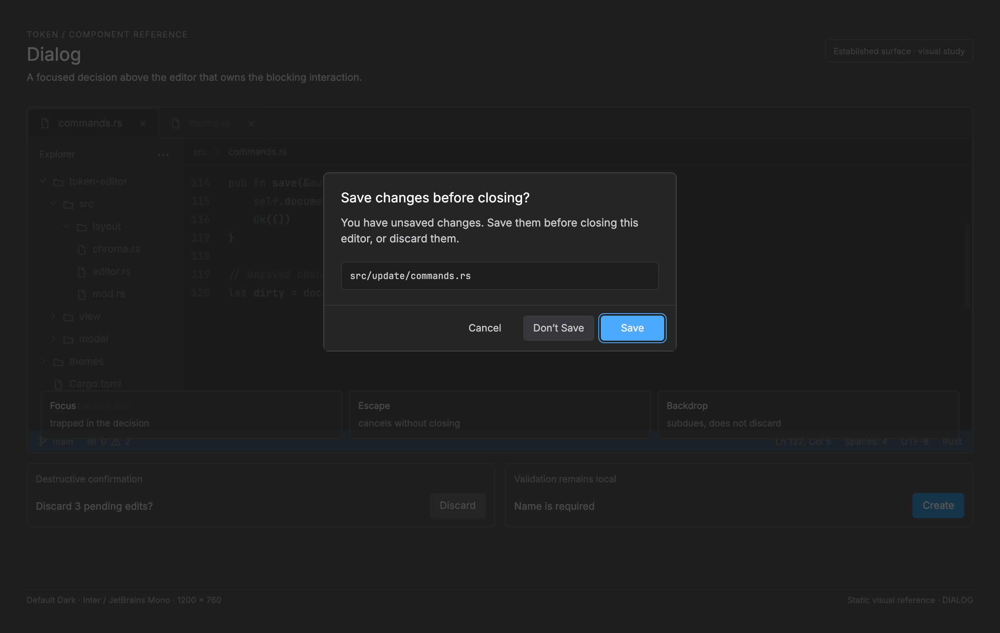

# Dialog (modal) — Token implementation reference

<!-- token-ui-mockup:begin DIALOG -->
[](mockups/DIALOG.html?view=emphasised)

*Visual target under review. [Normal PNG](mockups/renders/DIALOG.png) · [Open normal mockup](mockups/DIALOG.html?view=normal) · [Open emphasised mockup](mockups/DIALOG.html?view=emphasised).*
<!-- token-ui-mockup:end DIALOG -->

## Boundary and current representation

In product vocabulary a dialog is a bounded decision/workflow; code calls it a modal because it captures top-level input. UiState.active_modal is optional, giving the single-dialog invariant. Settings is deliberately a separate preferences page using Anchor::Settings and category/form navigation, not a command palette.

```rust
// Current excerpt.
pub enum ModalState {
    UnsavedChanges(UnsavedChangesState), FileConflict(FileConflictState),
    Settings(SettingsState), CommandPalette(CommandPaletteState),
    GotoLine(GotoLineState), ThemePicker(ThemePickerState),
    FileFinder(FileFinderState), RecentFiles(RecentFilesState),
    LspServers(LspServersState), LanguagePicker(LanguagePickerState),
    RenameSymbol(RenameSymbolState),
}

pub struct CommandPaletteState {
    pub editable: EditableState<StringBuffer>,
    pub selected_index: usize, // matches index, never display-header index
    pub matches: Vec<CommandMatch>, // authoritative cached order
    pub scroll_offset: usize, // FlatIndex rows; maximum visible is 10
    pub recent_count: usize, // leading Recently used section length
    pub active_tab: SearchTab,
    pub files: Option<FileFinderState>, // lazy; None without workspace
    pub files_available: bool,
    pub symbols: WorkspaceSymbolsState,
    pub all_selected: usize, // All tab's independent summary-row selection
}
```

The sum type prevents simultaneous Settings and Go To Line state. Immutable opening context belongs to the variant (especially conflict/unsaved pending operation and rename caret/request). Draft inputs, selected row/tab, scroll, and validation are transient variant state. OverlaySpec/rows/fields are borrowed presentation; OverlayLayout, measurement, scrollbar geometry, and frame masks are derived.

Every list variant has one authoritative order for render, keyboard navigation, pointer flat index, and confirmation: palette matches, recent-files filtered_rows, or feature vectors. Headers/separators are display-only. A reducer that changes order must clamp/rebase selection and recalculate scroll; painter must not repair state.

Current ModalState::id is the identity bridge for ToggleModal, not a factory for all variants. A code path that opens Rename Symbol captures its caret/request context before producing ModalState; a code path that opens file conflict captures the pending file decision. That distinction prevents a global command from manufacturing an invalid confirmation dialog with no operation to confirm.

### All current workflow representations

| ModalState variant | Durable/opening context and mutable state                                                                                 | Ordered/selectable authority                                                     | confirmation/effect owner                                         |
| ------------------ | ------------------------------------------------------------------------------------------------------------------------- | -------------------------------------------------------------------------------- | ----------------------------------------------------------------- |
| UnsavedChanges     | CloseTarget, captured UnsavedDocument ids/revisions/paths/cells, optional save queue, selected action                     | actions derived from saves and document count                                    | file-close update saves/discards/cancels captured target          |
| FileConflict       | document_id, path, revision, observed disk content, selected action                                                       | actions derived from DiskContent                                                 | file-change update reloads, overwrites, Save As, or retains edits |
| Settings           | category/tab, entries, rows, editable/filter, selected index, physical-px form scroll, optional SettingsForm/keymap state | rows indexes entries; form owns field focus/validation                           | settings update persists/applies form/config changes              |
| CommandPalette     | shared query, matches, recent_count, Commands selection/scroll, lazy files, availability, symbols state, All selection    | tab-specific matches, FileFinderState.results, symbols.results, All summary rows | palette update executes selected command/file/symbol              |
| GotoLine           | constrained editable numeric/colon input                                                                                  | no list; field is authority                                                      | modal update parses and navigates focused editor                  |
| ThemePicker        | themes, parallel swatches, selected/scroll, original theme id                                                             | themes                                                                           | theme command previews/commits; cancel restores original id       |
| FileFinder         | query, results, all_files snapshot, workspace root, selected/scroll                                                       | results                                                                          | opens selected path                                               |
| RecentFiles        | entries snapshot, filter, filtered_rows into entries, selected/scroll                                                     | filtered_rows                                                                    | opens/pins selected RecentEntry                                   |
| LspServers         | selected/scroll only; definitions/live state read from model each frame                                                   | lsp::server_ids()                                                                | toggles selected server configuration                             |
| LanguagePicker     | selected/scroll only                                                                                                      | static ALL_LANGUAGES                                                             | syntax update pins language on focused document                   |
| RenameSymbol       | editable, placeholder, document_id, revision, position                                                                    | no list; captured request context                                                | LSP rename update validates captured document/revision/position   |

The table distinguishes a vector stored in dialog state from a live source intentionally read from the application model. LspServers and LanguagePicker therefore need selection clamping whenever that source changes; a renderer cannot assume a previously valid index remains valid.

## Lifecycle, focus, async commands

open_modal clears field/scrollbar capture and hover state, stores one ModalState, and sets FocusTarget::Modal. close_modal clears the same capture, removes state, and returns focus to Editor ([model](../../src/model/ui.rs)). Toggling the same ModalId closes it; a different one replaces it. Unsaved Changes and File Conflict are opened only from concrete pending file operations.

| Event                         | Precondition                                     | Reducer/effect                                                                                |
| ----------------------------- | ------------------------------------------------ | --------------------------------------------------------------------------------------------- |
| ToggleModal id                | regular id and not same active                   | construct/reuse variant, open_modal, redraw                                                   |
| Close/Escape                  | active handler permits cancel                    | feature cleanup then close; theme picker restores original theme                              |
| Text/clipboard edit           | focused editable field                           | mutate EditableState, recompute order, clear scrollbar drag                                   |
| Up/Down/Page/Tab              | active list/form                                 | move selection/focus, skip unavailable tabs, reveal selection                                 |
| Pointer row/tab/choice        | shared layout hit result                         | indexed ModalMsg reads same authority vector                                                  |
| Confirm/Enter                 | variant validation passes                        | return Cmd for runtime I/O/navigation                                                         |
| Variant-specific async reply  | only where that workflow defines a request owner | apply its documented document/revision/session guard; no generic modal discard reducer exists |
| Resize/focus loss/capture end | geometry/input boundary                          | end drag capture, remeasure next frame                                                        |

update_ui/update_modal own state transitions ([update/ui.rs](../../src/update/ui.rs)). Runtime turns winit input into Msg, performs returned Cmd work (clipboard, theme, LSP, file/config), and renderer projects state in view/modal. overlay_surface layout and hit_test_modal use the same geometry. No painter or hit tester performs effects.

Async behavior is not uniform across every modal, so it must not be described as one existing modal-generation mechanism:

| Workflow                                                                    | Current asynchronous identity/guard                                                                                                              | What is synchronous/local                                        |
| --------------------------------------------------------------------------- | ------------------------------------------------------------------------------------------------------------------------------------------------ | ---------------------------------------------------------------- |
| Rename Symbol                                                               | captured document_id, revision, and Position are stored in RenameSymbolState; prepare/rename LSP paths validate request context                  | editing placeholder/new name                                     |
| Settings                                                                    | forms/keymap use their own save/session/capture state; apply result belongs to that form workflow                                                | category/filter/row navigation                                   |
| Command Palette symbols                                                     | WorkspaceSymbolsState tracks availability, searching, query-too-long, results, selection/scroll; workspace-symbol requests are application state | command filtering and lazy file list construction                |
| File conflict/unsaved                                                       | captured document revisions, disk observation/file-I/O request kinds drive safe action paths                                                     | action selection                                                 |
| Theme picker, file finder, recent files, language/server pickers, goto line | no general late remote reply is owned by the dialog representation                                                                               | their lists/parsing/actions are local or read live model sources |

Consequently, “all modal replies are discarded after replacement” is a proposed requirement, not a single current reducer rule. New async variants should carry an explicit monotonic session in both command and reply unless an existing document/request identity is already sufficient.

Modal pointer state is deliberately separate from selection: modal_hover_row, modal_hover_choice, settings_hover_action, and modal_close_hovered drive visual feedback only. Runtime updates them from HitTarget values derived from the layout. A pointer row activation first stores/selects the flat index in update and then invokes confirmation, so click and Enter exercise the same variant confirmation path. Release and capture cancellation cannot leak an editor click because modal hit testing sits before editor dispatch.

## Geometry, selection, clipping

For centered overlays, WidthRule resolves raw=floor(window_w × pct), clamps to scaled logical min/max then window_w-round(32×scale). Placement is:

```
x = floor((window_w - panel_w) / 2)
y = min(round(64 × scale), floor(window_h / 4))
```

Anchor carries dim alpha, so backdrop dimming is view behavior. Logical chrome metrics scale/round at layout/draw boundaries. Frame clips rounded panel and scroll viewport separately.

For an unsectioned list with n selectable rows, capacity v, and selected row q, the following is valid only when n>0, v>0, and 0<=q<n:

```
scroll_next = scroll if scroll <= q < scroll + v
            = q if q < scroll
            = q + 1 - v otherwise
scroll_next = clamp(scroll_next, 0, max(0, n-v))
```

Token generalizes this with resolve_scroll_for_selection by mapping FlatIndex to display positions before reveal. Empty input has no valid selection or activation.

When n=0 or v=0, do not evaluate q+1-v: store selection/scroll as harmless zero coordinates, paint the empty/collapsed state, and make Confirm/row activation a no-op. Callers with a visible cap must ensure v is nonzero before invoking minimal-reveal math; otherwise the state invariant is not “selected row is visible” because no row can be visible.

Trace: in a 1000×800 1× window, resolved width 400 gives panel (300,64); at height 200 it gives y=50. Minimum 500 in a 520px window edge-clamps to 488. Ten rows, v=3, scroll=4, selected moves 6 to 7: scroll becomes 5, showing 5..7. If filtering yields zero rows, scroll becomes 0 and Enter cannot index stale row 7.

Sectioned trace: display has a title in slot 0, selectable rows flat 0 and 1 in slots 1 and 2, then a separator in slot 3 and flat row 2 in slot 4. With capacity 2 and selected flat 2, reveal must use display slot 4 and choose a flat scroll whose display window includes 4. Treating scroll as raw display offset would either make selection invisible or activate the wrong row after the separator.

### Input dispatch precedence

Modal input is a state machine with explicit precedence, not a monolithic key handler:

```text
active Settings capture?       -> Settings capture action
active Settings open select?   -> select navigation/confirm
ModalMsg::Close                -> variant cancellation/close
editable-field message         -> EditableState mutation + recompute
field-editing Up/Down          -> form field cursor movement
list Up/Down/Page              -> authoritative selection/scroll update
tab/choice/row pointer action  -> active variant update
Confirm                        -> validate draft, return Cmd
otherwise                      -> no update
```

The existing update_ui path clears scrollbar_drag before mutable modal actions because filtered rows, fields, and viewport geometry may change. A text field uses EditableState/StringBuffer; its caret, selection and horizontal scrolling are field-local state, not raw string offsets interpreted by OverlaySurface. Settings has additional form and capture modes, so generic list assumptions do not apply to it.

### Commit and cancellation contract

A confirmation reducer first validates the durable opening context and mutable draft, then returns a Cmd; the runtime performs I/O after update. For example, a rename must still target the captured document/caret context, and a conflict choice must still name its pending operation. Cancel discards only uncommitted draft state unless a variant specifies reversible preview behavior; theme picker is the current notable case because close restores original theme through a command. Render/hit test cannot save settings, write a file, or start LSP work.

When an active modal is replaced, any outstanding work needs an owner token/session that is not reused by the replacement. A simple ModalId is insufficient: two sequential Rename Symbol dialogs have the same id but different captured context. Proposed new variants should include an explicit monotonically allocated session value in their async command/reply pair where current request identity cannot already provide it.

## Invalidation, cost, verification

Invalidate on variant, draft text, ordered results, selection/scroll/tab/form, window, scale, UI font/theme, settings category, and async session result. Filtering/ranking is feature-dependent, commonly O(candidates); layout is O(visible display rows plus measured text). Settings may traverse visible form records. Rendering cannot rebuild a divergent order or invoke I/O.

**Existing tests** include modal layout/spec tests in [view/modal.rs](../../src/view/modal.rs), routing/capture in [runtime/mouse.rs](../../src/runtime/mouse.rs), and update/runtime modal paths. **Proposed tests:**

| Setup                                      | Action                        | Expected                                               |
| ------------------------------------------ | ----------------------------- | ------------------------------------------------------ |
| palette 10 rows, v=3, selected 6, scroll 4 | Down                          | selected 7, scroll 5; paint/click/Enter identity equal |
| Settings drag capture                      | category/form geometry change | capture clears before layout                           |
| Rename document A/caret X                  | close/reopen then old reply   | no mutation of new dialog                              |
| Theme preview                              | Escape                        | original theme command; focus Editor                   |
| 520px/minimum 500                          | layout                        | width 488, content clipped                             |
| empty filtered list                        | Enter/stale click             | no panic or command                                    |

Gallery validates static panel/font/theme/scale/narrow-form output only. Reducer/runtime tests must prove focus restoration, command ownership, stale-result rejection, and pointer identity.

## Proposed extension rule

Do not add a generic Dialog trait. Add a concrete ModalState variant and document immutable opening context; draft versus committed fields; initial focus; cancel safety; validation/error state; confirm command; async owner/session key; and focus restoration. This preserves exhaustive handling and makes each workflow auditable.
