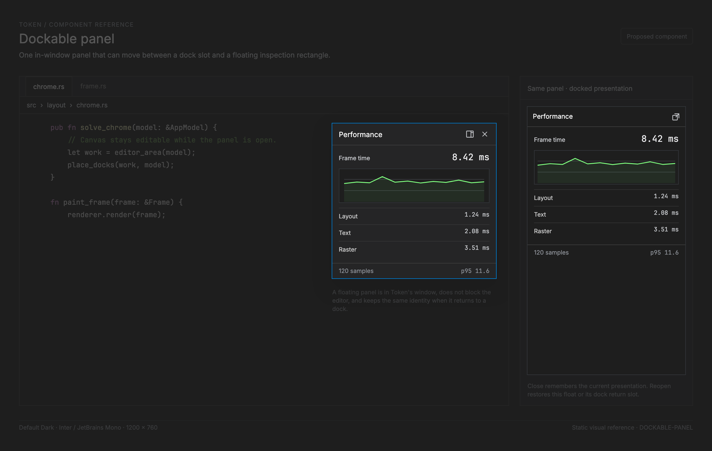

# Dockable panel

<!-- token-ui-mockup:begin DOCKABLE-PANEL -->
[](mockups/DOCKABLE-PANEL.html?view=emphasised)

*Visual target under review. [Normal PNG](mockups/renders/DOCKABLE-PANEL.png) · [Open normal mockup](mockups/DOCKABLE-PANEL.html?view=normal) · [Open emphasised mockup](mockups/DOCKABLE-PANEL.html?view=emphasised).*
<!-- token-ui-mockup:end DOCKABLE-PANEL -->

A dockable panel is one panel **inside Token's existing window** whose content
can occupy one dock slot or a floating rectangle above the normal window
layout. It lets an inspection or auxiliary tool stay available beside a
document without making a second editor window. The first consumer is the
performance panel described in [the feature plan](../feature/performance-panel.md).

This is a placement and lifecycle component. It does not own the panel's rows,
queries, terminal sessions, selection, timers, or asynchronous work. Its chrome
is assembled from [Pane header](PANE-CHROME.md) (title, optional icon and
actions) and, when required, `PaneFooter`. A dock tab strip remains a separate
container concern. A floating panel is not a [Popup](POPUP.md): it is not
caret-anchored, does not dismiss on an outside click, and participates in
keyboard focus. It is not a [Dialog](DIALOG.md): it does not block the editor
or establish a modal workflow.

The name deliberately does not mean a standalone operating-system window.
That feature needs platform window creation, cross-window focus and lifecycle,
and an accessibility review; none is evidenced or proposed here.

## Current system and boundary

Token already has an in-memory **dock layout**, but no floating dockable panel. The
current representation is in [src/panel/dock.rs](../../src/panel/dock.rs):

```rust
// current excerpt — durable geometry is logical px, while focus and a drag
// capture live in UiState.
pub struct Dock {
    pub position: DockPosition,       // Left | Right | Bottom
    pub panel_ids: Vec<PanelId>,      // display/tab order
    pub active_index: Option<usize>,  // index into panel_ids
    pub is_open: bool,
    pub size_logical: f32,            // width for sides, height for bottom
}

pub struct DockLayout { pub left: Dock, pub right: Dock, pub bottom: Dock }

pub enum FocusTarget { Editor, Dock(DockPosition), FindBar, Modal }
```

`PanelId` is a singleton enum identity, rather than an instance identity. A
panel is found by `DockLayout::find_panel`; `default_position()` only supplies
registration advice. `update_dock` changes live dock state and focus through
`Msg::Dock(DockMsg)`. `layout::chrome::chrome(model)` builds the one
`LayoutSnapshot` used by painting and hit testing. `render_dock` then paints
only the active panel inside `PanelContent(active)`. The terminal is an
important exceptional consumer: when its active dock geometry changes the
reducer derives a terminal grid and may spawn or resize the PTY.

The current API permits a `PanelId` in more than one dock after direct
mutation/deserialization, and it has no unregister operation. It also cannot
describe floating placement or focus. Those are gaps this proposed state model
must repair centrally; the renderer must never infer location from a panel's
default dock.

Existing docking must keep working as-is while this component lands. In
particular, File Explorer continues to mirror workspace sidebar visibility and
width, and Terminal keeps its current dock-driven grid sizing. This proposal
does not move every existing panel to the new model or refactor `Renderer` out
of its role as the top-level orchestrator.

## Proposed representation and ownership

`DockLayout` remains the placement and order authority while a panel is docked:
membership in exactly one `panel_ids` list is what means “docked.” The proposed
`NonDockedPanels` map contains **only** the exceptional floating and hidden
states. `update_panel_placement` is the one atomic mutation boundary across the
two structures, so they are one logical placement model, rather than competing
durable authorities.

```rust
// proposed API — illustrative; no production types exist yet.
#[derive(Clone, Copy, Serialize, Deserialize)]
enum NonDockedPanel {
    Floating {
        rect_in_work_logical: LogicalRect,
        return_slot: DockReturnSlot,
    },
    Hidden {
        // Closing remembers presentation. Reopen resumes this exact float,
        // rather than quietly relocating it to a dock.
        last: LastPresentation,
    },
}

#[derive(Clone, Copy, Serialize, Deserialize)]
struct LogicalRect {
    x: f32, y: f32, width: f32, height: f32,
}

#[derive(Clone, Copy, Serialize, Deserialize)]
struct DockReturnSlot {
    dock: DockPosition,
    index: usize, // original tab-order slot, clamped to destination length
}

#[derive(Clone, Copy, Serialize, Deserialize)]
enum LastPresentation {
    Docked { return_slot: DockReturnSlot },
    Floating { rect_in_work_logical: LogicalRect, return_slot: DockReturnSlot },
}

#[derive(Default, Serialize, Deserialize)]
struct NonDockedPanels {
    // An eligible registered PanelId absent here occurs exactly once in
    // DockLayout. A key here occurs in no dock. Its enclosing persisted
    // session record supplies the schema version.
    by_id: std::collections::HashMap<PanelId, NonDockedPanel>,
}

// Borrowed per-frame projection; no durable geometry or interaction state.
struct DockablePanelSpec<'a> {
    id: PanelId,
    // Defined by PANE-CHROME.md: title is required; icon/actions/footer are
    // optional and remain the domain's borrowed presentation.
    chrome: PaneChrome<'a, PanelActionId>,
    placement_policy: PlacementPolicy,
    body: PanelBody<'a>,        // domain-owned projection
}

enum PlacementPolicy { DockOnly, DockOrFloat }
```

`PaneChrome`, `PaneHeader`, `PaneFooter`, and their stable action identity are
defined by [Pane chrome](PANE-CHROME.md). For the first singleton panels,
`PanelId` is sufficient as the placement key and maps to
`PaneInstanceId::Panel(id)` for chrome; a future multi-instance panel must introduce a stable
instance key before it becomes float-eligible.

An eligible, registered `PanelId` is either absent from `NonDockedPanels` and
present exactly once in `DockLayout`, or present exactly once in
`NonDockedPanels` and absent from every dock. Floating and hidden records retain the source
`DockReturnSlot`; redocking inserts at `min(saved_index, panel_ids.len())`,
preserving the source relative order as far as later tab changes permit, then
activates it. Removing a tab repairs the source dock by retaining its prior
active ID when possible; otherwise it selects the item now at the removed
index, then the previous item. An empty dock has `active_index = None` and
`is_open = false`.

The record owns logical rectangles only. The following remain distinct:

| State | Owner | Rule |
| --- | --- | --- |
| panel content, selection, scrolling, async request generations | feature domain | placement never reads or rewrites it |
| tab order and active dock tab | `DockLayout` | only docked panels appear; repair happens in placement reducer |
| floating rectangle, remembered presentation, return slot | `NonDockedPanels` | logical px relative to the work origin, bounded on restore/resize/drag |
| drag/resize pointer capture, last focused target, z-order token | `UiState` | transient; cleared on release, cancel, focus loss and close |
| physical rectangles, clips, header/action keys | `LayoutSnapshot` | derived once per frame by shared Clay layout |
| title/icon/action availability | feature's borrowed `DockablePanelSpec` | presentation only; no config copies |

At most one panel owns a given `PanelId`; at most one pointer capture exists;
and a floating rectangle cannot contain a zero or negative side. The only
initial eligible consumer is Performance. Explorer is `DockOnly` because it
mirrors workspace sidebar state and its tree/input path assumes the left dock.
Terminal is `DockOnly` in the first implementation because its PTY grid,
terminal tab strip and resize effects currently derive from `PanelContent` in a
dock. Moving either needs a separate domain integration proposal. Outline,
Problems, and Usages are not automatically opted in: each must first prove its
renderer and input are location-independent.

### Persistence and migration

Current `DockLayout` is serializable, but it is not currently persisted:
`EditorConfig` stores preferences in YAML, while `Session` v1 stores saved-file
editor groups/tabs/folds and no dock layout. The configuration writer's
unknown-key preservation is real, but it is not a current placement schema and
must not be treated as one.

The proposed persistence boundary is `Session` v2, with an optional,
independently recoverable `panel_layout` record:

```text
panel_layout = { version: 1, docks: DockLayout, non_docked: NonDockedPanels }
```

Missing `panel_layout` in a valid v1 session keeps the fresh current
`DockLayout` defaults; it does not synthesize floats. A v1 record normalizes
docks in stable `Left, Right, Bottom` order, keeping the first occurrence of a
duplicate `PanelId`, repairing each active index, and reconciling the
`non_docked` map so every eligible singleton has one presentation. A record
that is malformed, has an unknown layout version, an unknown panel identity,
or non-finite rectangle fields is discarded as a **panel-layout field only**;
the document session still restores and Token starts with default panel layout.
This requires field-level tolerant decoding/migration before `Session::install`,
because current invalid-session handling rejects the entire JSON session.

Closing a floating panel stores `Hidden { last: Floating { … } }`; reopening
the generic panel command resumes the last floating rect after normalization.
An explicit “Open in dock” command instead inserts at its saved return slot.
Persist only normalized finite logical values after a user layout change. No
existing panel becomes floating merely by migration.

## Behaviour and input machine

The feature enters through commands/keybindings, a dock tab/context action, or
the host chrome's optional actions. In a dock, `DockHeader` keeps the current
`DockTabBar` as its leading navigation and composes the **active panel's**
actions at the trailing edge. It must not add a second `Performance` title bar
under an already-active `Performance` dock tab. A floating panel uses
`PaneHeader` directly, so it has the required title plus optional icon/actions.
Actions are semantic commands; an absent action list means no action hit
targets and no reserved header space. The performance panel asks for standard
placement affordances, but deliberately has neither the prototype's decorative
icon nor its live/pause/reload controls.

| Event | Preconditions | State reduction | Effect and focus |
| --- | --- | --- | --- |
| Open panel | hidden | resume its `last` docked/floating presentation; explicit dock-open overrides this | focus resolved host; redraw; panel-specific open sync |
| Close panel | docked or floating | remove dock tab if needed; retain `Hidden { last }` | clear capture; focus last viable target (normally editor); redraw |
| Float active panel | `DockOrFloat`, docked | remove tab with selection repair; store bounded rect and source return slot | focus `FloatingPanel(id)`; redraw |
| Dock floating panel | floating | insert once at saved return slot, activate/open it | focus dock; redraw |
| Move floating panel | pointer pressed on title drag region | record physical press and original logical rect; update bounded logical origin on motion | capture pointer; redraw on changed rect |
| Resize floating panel | pointer pressed on resize edge/corner | record edge/original rect; apply bounded logical sides on motion | capture pointer; redraw on changed rect |
| Header action | enabled action target | emit feature command only | action-defined; does not implicitly close/move/focus body |
| Focus floating body/header | visible float; no modal or captured gesture takes precedence | raise its transient z-order and focus its host; dispatch body input within its clip | redraw focus/elevation; do not pass the same input through to the editor |
| Escape | floating and no feature-local Escape state | dock to return dock | focus returned dock; otherwise let focused domain consume Escape first |
| Pointer release/cancel/window focus loss | capture belongs to panel | clear capture | no geometry change after cancellation |
| Window resize/scale change | any floating record | normalize every visible floating rect | redraw; retain logical stored value after clamp |

`FocusTarget` needs a proposed `FloatingPanel(PanelId)` variant. Before moving
focus, capture the former `FocusTarget`. Close restores that target only if it
still exists and remains visible; otherwise use `Editor`. Docking restores the
target dock. If the panel closes itself while a feature action or stale async
reply is completing, action/reply code must check its panel ownership and
generation first; it cannot reopen or refocus a closed panel.

There is no current application-level “next region” command: F6 is not an
available focus binding (and Shift+F6 already participates in Rename Symbol).
Do not assign a new key in this component. When a future region-navigation
command is designed, it must include visible floating panels in a documented
z-order and skip hidden/disabled actions. Within a focused floating panel, Tab
may move through header actions in visual order before domain controls, and
Shift+Tab reverses; dock-tab cycling remains
`NextPanelInDock`/`PrevPanelInDock` and never selects floating panels. Escape
never dismisses a floating panel due to an outside click.

The title drag region is the floating `PaneHeader` content rectangle minus every
action button rectangle and its gap. It has no drag behaviour when the header
is too narrow to expose any remaining drag area. Buttons keep normal pointer
capture and cannot begin a float move. `PaneChrome` packs 44 logical-px fit
cells and, when necessary, reserves one overflow action/menu containing the
complete ordered action list; hidden action keys are absent and unfocusable.
This component only contributes the semantic placement actions (`Float`,
`Dock`, `Close`) when policy allows them.

## Shared layout, geometry, clipping, and hit testing

The proposed layout extends `layout::chrome::chrome`, rather than adding a
second panel-specific geometry system. The docked case remains a normal Clay
flow subtree. Current `FloatAnchor` supports centered, caret, and element
anchors but not a persisted arbitrary point, so this feature needs one explicit
shared-layout extension such as `FloatAnchor::WindowPoint { x_px, y_px }`. A floating
case then becomes a top-level `FloatDecl` child with that anchor, a placement
record as its single source of logical coordinates, and a z-order above docks
and below modal dialogs/cursor overlay. The same `LayoutSnapshot` supplies
rectangle, clip and `UiKey` data to renderer and hit testing.

```rust
// proposed keys — logical names only, not implemented.
enum UiKey {
    // existing Dock / DockHeader / DockTab / PanelContent / PanelRows ...
    FloatingPanel(PanelId),
    FloatingPanelHeader(PanelId),
    FloatingPanelAction(PanelId, PanelActionId),
    FloatingPanelResize(PanelId, ResizeEdge),
    FloatingPanelContent(PanelId),
    FloatingPanelFooter(PanelId),
}
```

The float root clips its body and footer, but its outer border/shadow is
painted before the content clip. `PaneChrome` resolves constrained height by
hiding its optional footer first, then clipping the body to whatever remains;
it never makes a negative content rectangle. A too-short header has no
action/drag child keys rather than exposing partially clipped controls. The
header separately clips title text to the space before visible actions.

Hit testing visits floating snapshot nodes in reverse draw order before normal
flow nodes: visible header actions, resize affordances, title drag region, then
body. A point outside the float falls through to the editor/dock below.
Therefore neither the float nor a transparent shadow consumes clicks outside
its visible rectangle.

All persisted placement arithmetic is logical pixels **relative to the usable
work rect's origin**. The work rect is one shared Chrome-layout rectangle after
the status bar and any non-modal shell exclusions; it is not the raw OS window.
Its solved physical rect is converted once to logical `(ox, oy, W, H)`. The
persisted rectangle contains `(x, y, w, h)` in that local coordinate system;
the proposed `WindowPoint` declaration receives physical layout coordinates
`((ox + x) × s, (oy + y) × s)` when the Clay tree is built. Convert physical
pointer deltas only at the reducer boundary with
`s = max(scale_factor, f64::EPSILON)` and `logical_delta = physical_delta / s`.
Do not persist the snapped physical result.

If `W <= 0` or `H <= 0`, no floating node or hit target is emitted, while the
finite floating/hidden record remains intact for a later usable work rect. A
non-finite rectangle never reaches this normalizer: session recovery discards
it before installation, and a defensive live-state check recovers the panel to
its default hidden/docked presentation instead of painting it. For a positive
work rect, adaptive margins retain at least one logical pixel when the available
axis is at least one; smaller positive axes retain their full available extent:

```text
mx = min(8, max(0, (W - 1) / 2))
my = min(8, max(0, (H - 1) / 2))
available_w = W - 2mx           available_h = H - 2my
min_w' = min(preferred_min_w, available_w)
min_h' = min(preferred_min_h, available_h)
w' = clamp(w, min_w', available_w)
h' = clamp(h, min_h', available_h)
x' = clamp(x, mx, W - mx - w')
y' = clamp(y, my, H - my - h')
```

`preferred_min = (240, 160)` is the initial content-inclusive target pending
Performance body validation. The formula is called only after the positive
work-rect check, so every clamp has ordered bounds and the entire float,
including title and action area when it fits, remains inside the work rect. A
resize changes the chosen edge, derives `(x, y, w, h)`, and calls this
normalizer; it never calculates a second paint rectangle. At sub-header height,
the shared PaneChrome small-height policy above intentionally renders clipped
chrome/body and omits unavailable interactive children; it does not promise
title-button reachability that the available work rect cannot provide.

**Normal trace.** Suppose the solved logical work rect is
`(ox=48, oy=34, W=720, H=430)` at 2×. Performance has been deliberately
relocated to Bottom (its default is Right) and floats with local
`(x=328, y=96, w=360, h=252)`. A title drag from physical `(880,280)` to
`(760,360)` has `(-60,+40)` logical delta, producing local
`(268,136,360,252)` and a global logical anchor `(316,170)` (physical
`(632,340)`). It is already in the `[8,712]×[8,422]` inner work bounds. Floating removes the Bottom tab and
repairs that dock's selection. Docking returns it to the saved Bottom index,
then activates/opens/focuses Bottom.

**Tiny trace.** At 1×, `W=100`, `H=34` gives `mx=my=8`, available
`84×18`; a valid `(0,0,500,300)` normalizes to `(8,8,84,18)`. PaneChrome hides
its optional footer first; it clips the body below the remaining header rather
than creating a negative body. A restored `(NaN,-800,500,300)` is not passed to
this algorithm: field recovery chooses the default panel layout.

**One-pixel trace.** At `W=1`, `H=1`, `mx=my=0`, available size is `1×1`, and
any finite request normalizes to local `(0,0,1,1)`. The snapshot may contain
only the float root and a clipped 1×1 header; it contains no action, drag,
resize, or body hit target. At `W=0` or `H=0`, it emits no float subtree at all.
For a fractional `W=0.5`, the x margin is zero and the logical width is 0.5;
snapping/clipping may leave no paintable pixel, and no partial control is emitted.
On a 2×→1× scale change the stored local logical rectangle is normalized
against the new logical work rect; it is never multiplied a second time.

## Assembly, invalidation, and cost

The intended flow is:

```text
input / command
  → Msg::DockablePanel(PanelPlacementMsg)
  → update_panel_placement(model) owns atomic dock↔float mutation
  → Cmd::Redraw + eligible domain synchronization
  → chrome(model) builds dock and floating nodes once
  → renderer paints from LayoutSnapshot; hit test consumes those same nodes
```

`update_panel_placement` is a small coordinator around existing dock update
helpers, not a replacement for panel-domain reducers. A floating panel's pure
move/resize changes no dock geometry and therefore does not target terminal
synchronization. Opening, closing, or docking Performance can still change the
shared shell and require the existing terminal reconciliation; Terminal remains
`DockOnly` until its own float integration exists. The panel domain constructs
one `DockablePanelSpec`/`PaneChrome` projection per `PanelId` per frame; docked
and floating hosts consume that same borrow, never a second content, timer,
history, or title/action projection. Feature-domain rendering gets
`FloatingPanelContent(id)` when floated and `PanelContent(id)` when docked.

The snapshot is invalidated by window size, scale, status/chrome metrics,
registered panel lists/active tab/visibility, placement records, float z-order,
PaneHeader title/icon/actions, footer presence, and any panel body dimensions
that influence layout. Header title/action measurement is O(number of visible
actions); placement normalization is O(number of floating panels); a dock tab
move costs O(number of tabs in source plus destination) due to retain/insert.
The existing panel body keeps its own virtualization and cache policy. There is
no persistent geometry cache until it has a full key containing these inputs.

## Verification and gallery plan

Existing dock reducer and `tests/chrome_layout.rs` coverage remains the baseline.
The following are proposed additions; gallery specimens prove static rendering,
while reducer/runtime tests prove mutations, focus and pointer semantics.

| ID / kind | Initial state and action | Expected result |
| --- | --- | --- |
| `dockable-panel.performance.docked` / gallery | Right Performance active, title only | `DockHeader` shows its active tab title once and composes only its trailing host actions; body clips below it |
| `dockable-panel.performance.floating` / gallery | `rect=(320,96,360,252)` at 1× and 2× | root/header/content/action key rectangles are snapshot-derived; body cannot paint outside |
| `dockable-panel.actions-overflow` / gallery | 180 logical px header with four actions | one 44px overflow target; hidden action keys absent; overflow retains complete ordered action list |
| `dockable-panel.float-dock` / reducer | user-relocated Bottom tabs `[Terminal, Performance, Problems]`, active Performance | float removes only Performance; Bottom activates Problems; one floating Performance record remembers Bottom/index 1 |
| `dockable-panel.return-dock` / reducer | previous floating record with Bottom/index 1 return | Dock inserts Performance once at index 1, selects it, opens/focuses Bottom |
| `dockable-panel.close-reopen` / runtime | floating Performance opened from Editor | Close clears capture and retains last floating rect; generic reopen resumes it; stale reply cannot refocus it |
| `dockable-panel.cancel-capture` / runtime | title drag capture then focus loss | later motion leaves rectangle unchanged |
| `dockable-panel.tiny-window` / layout | finite float at usable 100×34, then 1×1, then zero work rect | footer hides first; body clips; 1×1 has no interactive children; zero emits no float subtree |
| `dockable-panel.hit-order` / runtime | float overlaps editor and header action | action wins; title drag excludes it; body focuses floating panel; outside point reaches editor |
| `dockable-panel.session-v1` / persistence | valid document session lacking `panel_layout` | current default dock layout; no float introduced |
| `dockable-panel.session-layout-invalid` / persistence | v2 session with malformed `panel_layout` | document session restores; only panel layout falls back to default |

The gallery IDs belong in the existing `ui-gallery` fixture catalogue, using the
production `chrome(model)` and panel painter as current dock gallery specimens
do. Capture Default Dark and GitHub Light at 1×/2× plus the tiny-window case.
Do not fake floating geometry in a separate HTML or gallery-only layout path.

## Initial defaults and deferred follow-ups

Use the action labels `Float panel`, `Dock panel`, and `Close panel`, exposed
through the host's named command route; do not allocate new shortcuts as part
of this component. Performance is the sole initially eligible singleton, so
the first release has at most one float even though the layout can represent
several. Start with the documented 240×160 logical-pixel host minimum and
validate the Performance body's compact/scroll fallback in the gallery. Those
are concrete trial defaults, not requirements for another approval step.

Standalone OS windows and their monitor placement, drag-to-edge docking targets,
tab reordering between docks, and Explorer/Terminal floating remain separate
follow-up designs. Ordinary DPI changes to this window already follow the
work-relative normalization contract above.

## Evidence

- [Dock state and singleton IDs](../../src/panel/dock.rs), [dock reducer](../../src/update/dock.rs), and [dock messages](../../src/messages.rs)
- [Focus and transient resize state](../../src/model/ui.rs), [shared Chrome layout](../../src/layout/chrome.rs), [layout keys](../../src/layout/keys.rs), and [floating layout primitives](../../src/layout/anchor.rs)
- [Dock rendering](../../src/view/panels.rs), [dock hit testing](../../src/view/hit_test.rs), and [mouse routing](../../src/runtime/mouse.rs)
- [Current document-session schema](../../src/session.rs) and [runtime session loading/saving](../../src/runtime/session.rs) are the proposed persistence integration boundary.
- [UI gallery guide](../dev/ui-gallery.md), [existing Panel reference](PANEL.md), [Popup distinction](POPUP.md), and [Dialog distinction](DIALOG.md)
