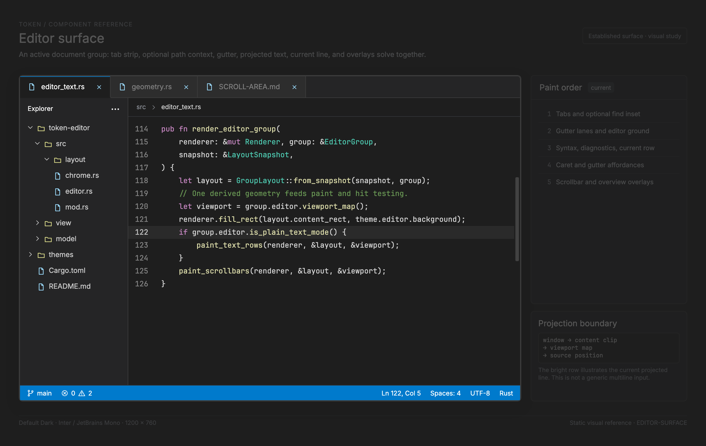

# Editor surface

<!-- token-ui-mockup:begin EDITOR-SURFACE -->
[](mockups/EDITOR-SURFACE.html?view=emphasised)

*Visual target under review. [Normal PNG](mockups/renders/EDITOR-SURFACE.png) · [Open normal mockup](mockups/EDITOR-SURFACE.html?view=normal) · [Open emphasised mockup](mockups/EDITOR-SURFACE.html?view=emphasised).*
<!-- token-ui-mockup:end EDITOR-SURFACE -->

The editor surface is Token's domain composition for an active document view in
one editor group. It is not a reusable multiline field. Features and gallery
fixtures must drive the production renderer rather than inventing a second text
loop. This chapter specifies the present model, derived geometry, projection,
input routing, and known gaps.

The conceptual foundations are also covered by the editor reference's
[viewport chapter](../EDITOR_UI_REFERENCE.md#chapter-4-viewport-geometry-and-line-calculations)
and [soft-wrap chapter](../EDITOR_UI_REFERENCE.md#chapter-6-soft-wrapping-the-coordinate-system-split).
Those chapters do not substitute for Token's implementation contracts below.

## Ownership and current representation

### Durable document versus pane-local view

**Current excerpt** — [src/model/editor_area.rs](../../src/model/editor_area.rs)

```rust
pub struct EditorArea {
    pub documents: HashMap<DocumentId, Document>,
    pub editors: HashMap<EditorId, EditorState>,
    pub groups: HashMap<GroupId, EditorGroup>,
    pub previews: HashMap<PreviewId, PreviewPane>,
    pub layout: LayoutNode,
    pub focused_group_id: GroupId,
    pub last_layout_rect: Option<Rect>,
}

pub struct EditorGroup {
    pub id: GroupId,
    pub tabs: Vec<Tab>,
    pub active_tab_index: usize,
    pub rect: Rect,
    pub attached_preview: Option<PreviewId>,
    pub tab_scroll: usize,
}
```

A DocumentId selects durable buffer, file, revision, diagnostic and syntax source
state. An EditorId selects one _view_: two states can share a document but must
not share cursor, selection, viewport, wraps, folds, or ghost projection. A
GroupId owns tab ordering, active tab index, and a derived layout rectangle.
focused_group_id is pane focus; the global FocusTarget::Editor is deliberately
coarser and identifies no group. Tab joins a group to EditorId; the editor joins
itself to DocumentId.

The layout tree owns group/preview placement, as detailed in
[SPLITTER.md](SPLITTER.md), not cursor state. rect and last_layout_rect are
derived physical-pixel geometry retained by the area. tab_scroll is a separate
physical-pixel tab-strip offset, never editor text X scroll. In debug builds
EditorArea::assert_invariants checks focused group, active tab indexes, and
tab/editor/document links.

**Current excerpt** — [src/model/editor.rs](../../src/model/editor.rs)

```rust
pub struct EditorState {
    pub id: Option<EditorId>,
    pub document_id: Option<DocumentId>,
    pub cursors: Vec<Cursor>,
    pub selections: Vec<Selection>,
    pub active_cursor_index: usize,
    pub viewport: Viewport,
    pub scroll_padding: usize,
    pub rectangle_selection: RectangleSelectionState,
    pub occurrence_state: Option<OccurrenceState>,
    pub selection_history: Vec<SelectionSnapshot>,
    pub view_mode: ViewMode,
    pub tab_content: TabContent,
    pub matched_brackets: Option<(Position, Position)>,
    pub soft_wrap: bool,
    pub wrap_cache: WrapCache,
    pub folds: FoldState,
    pub ghost_text: GhostText,
    pub overview_cache: OverviewCache,
}
```

cursors and selections are parallel source-position vectors; active_cursor_index
must name an entry. The active cursor drives reveal and primary highlighting.
Viewport owns integral anchors, fractional pixel offsets, measured extents,
capacities, and optional easing. scroll_padding is visual rows.
Rectangle/occurrence/history are pane-local interaction state.

soft_wrap, wrap_cache, folds, and ghost_text are projection inputs.
overview_cache is derived memoized scrollbar-mark data, not document diagnostics.
is_plain_text_mode() is the mandatory boundary: text fast paths may run only when
both TabContent::Text and ViewMode::Text hold. A standalone state has None IDs
while being assembled; EditorArea assigns them when inserting it.

Global transient UI belongs in UiState: focus, hover, find/modal/overlay,
scrollbar/splitter/tab capture, and blinking. Painters borrow it; they never
move a cursor, edit a document, or claim input capture.

## Geometry composition

Renderer is the top-level orchestrator. Its render-plan construction does:

```text
chrome shell → editor-area rectangle
→ EditorArea::compute_layout_scaled (group/preview rects and splitter bars)
→ EditorArea::sync_all_viewports (every tab in every group)
→ render editor groups, previews, and splitters
```

A group constructs GroupLayout from group rect, active document, scaled metrics,
configured char width, applicable find inset, and whether the active editor is
plain text. That object is shared source geometry for paint and pointer mapping.

**Current excerpt** — [src/view/geometry.rs](../../src/view/geometry.rs)

```rust
pub struct GroupLayout {
    pub group_rect: Rect,
    pub find_bar_rect: Rect,
    pub content_rect: Rect,
    pub tab_bar_height: usize,
    pub gutter: GutterLayout,
    pub gutter_right_x: usize,
    pub text_start_x: usize,
}
```

All rectangle coordinates are window physical pixels. find_bar_rect is zero high
unless it belongs to this active editor; it is docked below tabs, not over text.
content_rect is the primary content clip. GutterLayout derives marks,
line-number, and fold lane widths from char width, scaled metrics, source line
count, diagnostics, and plain-text fold eligibility. Its current diff_w is
hard-coded to zero rather than derived from a diff producer. Zero-width lanes
never hit. gutter_right_x and text_start_x are absolute rounded boundaries.

For group height H, scaled tab height T, and requested find height F:

```text
below_tabs = max(0, H - T)
find.height = min(F, below_tabs)
content.y = group.y + T + find.height
content.height = below_tabs - find.height
```

The gutter border/text start use a single combined rounding calculation. That
prevents fractional char widths from making a one-pixel gap between lane and text
math. Gutter and text have intentionally distinct clips. Zero-size content is
legal geometry: capacities, scroll, and hits must clamp rather than invent rows.

sync_all_viewports visits all tabs, not merely the focused editor. It rebuilds
the same GroupLayout, derives visible lines from content height and visible
columns from text width (including unwrapped scrollbar reservation), resizes
pixel axes using measured extents, refreshes wraps, then reapplies current pixel
scroll to clamp. Image auto-fit and CSV rows follow their own mode branches.

## Projection and coordinate algorithm

The surface crosses four spaces:

| Space          | Unit and identity                                           | Owner                         |
| -------------- | ----------------------------------------------------------- | ----------------------------- |
| source         | line plus character column, never byte offset               | Document and cursor/selection |
| display        | projected visual row plus tab-expanded display column       | borrowed TextViewportMap      |
| local viewport | text-origin-relative physical pixels with fractional scroll | Viewport pixels               |
| window         | window-relative physical pixels                             | GroupLayout/renderer/input    |

```text
window pointer
→ reject tab/find/scrollbar/gutter/outside-content targets
→ subtract text_start_x and content_rect.y
→ TextViewportMap::position_for_pixel
→ source Position

source Position
→ TextViewportMap::display_position
→ local pixel position from viewport anchor/offset
→ add GroupLayout origin and clip to content
```

**Current excerpt** — TextViewportMap stores a value snapshot of viewport
scalars, while borrowing only projection inputs:

```rust
pub struct TextViewportMap<'a> {
    pixels: PixelViewport,
    top_line: usize,
    left_column: usize,
    visible_lines: usize,
    line_count: usize,
    wrap_cache: Option<&'a WrapCache>,
    folds: Option<&'a crate::folding::FoldProjection>,
    ghost: Option<&'a super::GhostProjection>,
}
```

EditorState::viewport_map copies PixelViewport, top_line, left_column,
visible_lines, and document line_count at construction. The map borrows only
WrapCache, FoldProjection, and GhostProjection. It is therefore an operation
snapshot, not a live borrow of Viewport, and is the source of truth for that
operation's text cursor, selection, drawing, fold behavior, hover, and overview
conversion.

For source (line,column), display_position redirects a hidden fold body to its
visible header, handles ghost source-span projection, otherwise maps through
wrap cache and fold projection. position_at_display_column reverses it: ghost
rows map to anchor source columns, and a wrap-boundary click belongs to the
following segment. Tabs go through TextSettings tabs visual/character conversion;
byte length and naive columns are invalid for Unicode/tabs.

With local Y y, line height h, fractional Y offset o, and local row k:

```text
visible_row = floor((max(y, 0) + round(o)) / h)
global_visual_row = top_line + visible_row
row_origin(k) = k × h - round(o)
```

The text mapper then converts global row and display X to source Position. It
includes partial edge rows; the content clip decides visibility. The forward X
projection is `column_pixel_offset(c) = (c-left_column) × char_width -
round(x.offset)`. Its inverse is deliberately nearest-cell, not floor:

```text
adjusted_x = local_x + round(x.offset)
visual_column = left_column + round(adjusted_x / char_width)
                   when adjusted_x > 0 and char_width > 0
                = left_column otherwise
```

This is TextViewportMap::visual_column_for_x_offset. Example: with
left_column=4, x.offset=3.6 (rounded 4), char_width=8 and local_x=17,
adjusted_x=21; round(21/8)=3, so the visual column is 7. A floor-based inverse
would choose 6 and fail to agree with Token's caret-hit policy. These are the
same PixelAxis boundaries documented in [SCROLL-AREA.md](SCROLL-AREA.md). No
feature-local logical-line-times-height loop is valid.

viewport_map.row_count is vertical extent authority. It starts with logical or
wrapped visual lines, applies folds, then applies visible ghost projection.
Soft wrap constructs a zero-X map and disables horizontal text scroll.
scrollable_columns applies only to unwrapped text. CSV, image and binary modes
must stay out of text rendering, text scrollbar, fold-presentation and text-only
damage fast paths. This does not prohibit constructing `TextViewportMap`:
`sync_all_viewports` visits every tab and `ensure_wrap_cache` constructs a map
before its subsequent work. Do not infer a mode guard from map construction.

## Layering and input routing

Normal text painting is conceptually back-to-front:

1. group/tab/find chrome;
2. content background and gutter lanes/border;
3. visible projected text, syntax/decorations, occurrences and selection;
4. carets and owning gutter affordances in their respective clips;
5. overlay scrollbars and vertical overview marks.

The concrete owners are [editor_text.rs](../../src/view/editor_text.rs),
[editor_scrollbars.rs](../../src/view/editor_scrollbars.rs), and
[view/mod.rs](../../src/view/mod.rs). Renderer owns their order. Cursor-line-only
damage is guarded by is_plain_text_mode.

hit_test_ui priority is cursor overlay, modal, shell/status/sidebar/docks,
splitters, preview, then editor group. Inside a group, scrollbar thumb/track
wins over content so a scrollbar press cannot move a caret. Tabs use
EditorTabBarLayout, the same tab flow/clipping geometry used by paint and drag.
A gutter lane is resolved through GutterLayout and visual-row mapping, not as
text at X zero.

Glyph hover is stricter than caret placement: it requires a source glyph and
rejects gutter, whitespace, below-EOF, and ghost glyphs. Rectangle selection
needs visual columns; ordinary selection needs source positions. This difference
is intentional.

## State transitions and command boundary

Token follows Message → Update → Command → Render. Relevant messages are
EditorMsg (cursor/selection/scroll/wrap/fold), DocumentMsg (buffer editing),
LayoutMsg (tabs/groups/splits), and UiMsg (scrollbar and overlay capture).

| Event / precondition                                  | State transition                                                                                                                                                                                | Effect / non-effect                                                                                                                     |
| ----------------------------------------------------- | ----------------------------------------------------------------------------------------------------------------------------------------------------------------------------------------------- | --------------------------------------------------------------------------------------------------------------------------------------- |
| tab press                                             | focus group if needed; select tab; arm TabDragState                                                                                                                                             | FocusTarget::Editor; preview/tab visibility reconcile.                                                                                  |
| text left press                                       | production pixel map yields source position; modifier/click policy updates selection                                                                                                            | group focus changes first; selection drag stays editor-owned.                                                                           |
| fold-lane press                                       | focus group and EditorMsg::Fold Toggle for header                                                                                                                                               | consumed before text selection.                                                                                                         |
| other interactive gutter                              | its owner consumes it                                                                                                                                                                           | no accidental cursor move.                                                                                                              |
| scrollbar thumb/track                                 | UiMsg uses shared captured geometry                                                                                                                                                             | thumb press cancels easing; viewport moves, caret does not.                                                                             |
| wheel over text                                       | EditorMsg::ScrollPixels for hovered EditorId                                                                                                                                                    | stale hover/context anchor can dismiss; cursor does not move.                                                                           |
| keyboard movement/edit in text                        | deterministic editor/document update then reveal policy                                                                                                                                         | command schedules redraw/I/O; update remains deterministic.                                                                             |
| ordinary focused editor message in binary placeholder | update-level non-text guard rejects it                                                                                                                                                          | specialized mode owns interaction. Image, like CSV, remains `TabContent::Text` and relies on outer mode routing rather than this guard. |
| CSV navigation or pointer-targeted ScrollPixels       | outer dispatcher routes CSV navigation separately; ScrollPixels bypasses that outer focused-mode gate because it names hovered EditorId, then EditorState::scroll_pixels rejects non-plain mode | do not generalize this into “all text operations are rejected by one guard.”                                                            |
| revision/width/wrap/fold/ghost change                 | cache/map refresh and viewport clamp                                                                                                                                                            | every view of document updates its own pane cache.                                                                                      |

Cursor reveal obtains active cursor display row/column and PixelAxis safe region.
Vertical padding is scroll_padding visual cells; horizontal reveal uses four
cells in minimal mode. It calls canonical pixel scroll and clears animation.
Wheel scrolling intentionally never reveals/moves caret.

Accessibility is currently a gap: CPU painting exposes no tree, editor text
provider, IME contract, or screen-reader semantics. Future work must expose a
document/view, source caret/selection, read-only/busy state, labelled ranges, and
keyboard gutter access without confusing source lines with projected rows.

## Worked traces

### Wrapped, folded, fractional hit

Group rect is (20,40,600,420), tab bar 28 px, find bar 32 px. content_rect is
(20,100,600,360). Let text_start_x=92, line height=20, char width=10,
top_line=30 and y.offset=7.5. A pointer at (123,111) is local text x=31,y=11.
visible_row=floor((11+round(7.5))/20)=0, so its global projected row is 30.
The mapper converts display X and row 30 through wrap/fold/ghost projection.

If row 30 is a wrap continuation, source column begins at that segment start.
If it is ghost text, the projection returns its anchor source column. The first
drawn row origin is 100-8=92 and is clipped by content top 100. A naive
source-line=30, column=floor(31/10) calculation is wrong in all three cases.

### Tiny special tab

At height 40, tabs 28 and requested find 24: below_tabs=12, find height=12,
content height=0. Text capacity is zero and all hits/scroll clamp safely. If the
tab is CSV or image, is_plain_text_mode is false: text renderer, fold gutter,
text scrollbar state, and cursor-line damage fast path must not run. Image and
CSV take their own zero-content viewport branches.

### Same document, independent panes

A 900 px group can wrap a source line into two rows while a 350 px group wraps it
into six. Each references one DocumentId but owns its own EditorState, WrapCache,
Viewport, cursor, and fold state. An edit changes shared revision; refresh must
rebuild both maps and clamp both projections. Copying visual offset from pane A
to B is invalid because it does not preserve a source location.

## Invalidation, cost, and verification

Layout invalidates on chrome/window size, split ratios, DPI metrics, tab/find
visibility, diagnostics, and tree topology. Those change GroupLayout, clip,
capacity, and wrap width. Projection invalidates on buffer identity/revision,
tab settings, wrap width, soft-wrap flag, fold identity, ghost identity, and
mode transition. Repair occurs through ensure_wrap_cache, viewport_map and
reapplying pixel scroll; no mutable second visual-coordinate state exists.

Per-pane overview cache keys buffer/revision, wrap/fold/find identity, diagnostic
ranges, projected row count, and exact track height. Thus folds with equal count
or changed find input cannot reuse old marks. Async syntax/LSP/completion work
must check document identity/revision/owner before changing projection input.

Text work is bounded by clipped projected rows, not whole document rows. Wrap
rebuild/overview projection may traverse more when identities change. Use shared
PerfStage instrumentation; the F2 overlay forces full redraw and cannot support
release-equivalent timing claims.

Existing evidence includes [tests/scrolling.rs](../../tests/scrolling.rs),
[tests/folding.rs](../../tests/folding.rs), [tests/editor_area.rs](../../tests/editor_area.rs),
and module tests for geometry/projection/overview. Gallery screenshots prove
paint only, not pointer capture.

| Coverage             | Initial state/action                                                                        | Expected result                                                                                                                                                     |
| -------------------- | ------------------------------------------------------------------------------------------- | ------------------------------------------------------------------------------------------------------------------------------------------------------------------- |
| existing             | fractional pixel scroll, cursor set, easing/reverse/resize                                  | click preserves scroll; reverse uses displayed position; nav/resize cancel easing.                                                                                  |
| existing             | alternate fold with equal projected count                                                   | overview identity changes; marks are not stale.                                                                                                                     |
| proposed geometry    | continuation/tab/ghost trace above                                                          | pointer result uses map; clipped origin is 92 px.                                                                                                                   |
| proposed integration | one document in 900/350 px split panes, then edit                                           | each owns refreshed wrap/cache/viewport; no cursor or offset transfer.                                                                                              |
| proposed input       | fold press, scrollbar press, text press at same Y                                           | fold/no caret; scroll/no caret; content/source selection.                                                                                                           |
| proposed regression  | CSV/image/binary rendering and damage                                                       | text rendering, text scrollbars, fold presentation and text-only damage fast paths stay excluded. Map construction during viewport synchronization is not excluded. |
| proposed gallery     | production focus, selection, diagnostics, wrap/fold/ghost, fractional scroll and find inset | real Renderer/GroupLayout/map/scrollbars at light/dark native sizes.                                                                                                |

## Stable and proposed boundaries

The stable API is not a widget framework. Consumers compose EditorArea identities,
GroupLayout, TextViewportMap, existing messages, and Renderer. A new inlay system
must become input to the same projection/mapping source of truth; a feature-local
extra-line painter would break selection, hit testing, wrap, overview, and scroll.

**Proposed representation — not implemented**

```rust
pub struct AccessibleEditorView<'a> {
    pub document_id: DocumentId,
    pub editor_id: EditorId,
    pub map: TextViewportMap<'a>,
    pub read_only: bool,
}
```

This is only an accessibility boundary sketch. It must not own a second document
or view state, own a renderer, or report projected visual rows as source lines.
