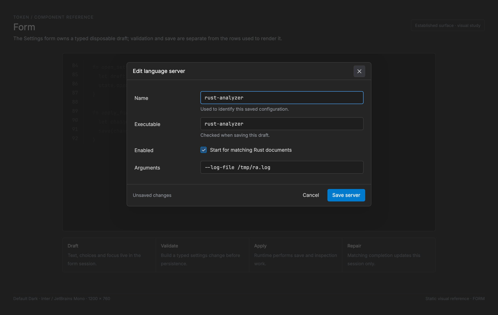

# Form — implementation reference

<!-- token-ui-mockup:begin FORM -->
[](mockups/FORM.html?view=emphasised)

*Visual target under review. [Normal PNG](mockups/renders/FORM.png) · [Open normal mockup](mockups/FORM.html?view=normal) · [Open emphasised mockup](mockups/FORM.html?view=emphasised).*
<!-- token-ui-mockup:end FORM -->

This chapter documents the only open-ended form workflow currently implemented:
the LSP and inline-provider editor in Settings. It is deliberately not a claim
that Token has a general `Form` widget. Durable configuration stays in
`AppModel.config`; the modal owns a typed, disposable draft; commands perform
persistence and inspection. Typing a bad executable must not change process
configuration merely because the field was painted.

## Runtime boundary

```text
physical pointer/key/text input
  -> runtime maps it to SettingsMsg / ModalMsg
  -> update::settings changes SettingsForm deterministically
  -> Cmd::{InspectSettingsExecutable, ApplySettingsForm, ...}
  -> runtime performs I/O and sends a message carrying the form session
  -> update guards transient form presentation where implemented; renderer projects new state
```

The Settings modal is assembled in `view/modal.rs` and
`view/settings_page.rs`. It produces rows and an `OverlaySpec`;
`overlay_surface` derives body clip, record viewport, footer, and hit regions.
Painting, hit testing, and the pointer adapter consume that one derived layout.
A form implementation must not invent a parallel `row * height` calculation:
variable row heights, scrolling, compact width, and a popup change it.

## Current representation and ownership

**Current excerpt** — [forms.rs](../../src/settings/forms.rs#L180):

```rust
pub(crate) struct FormField {
    pub label: &'static str,
    pub help: &'static str,
    pub input: EditableState<StringBuffer>,
    pub browse: bool,
}

pub(crate) struct SettingsForm {
    pub session: Arc<()>,
    pub kind: FormKind,
    pub fields: Vec<FormField>,
    pub choices: Vec<FormChoice>,
    pub enabled: bool,
    pub focused: Option<usize>,
    pub dragging: bool,
    pub saving: bool,
    pub status: String,
    pub executable_status: String,
    pub remove_pending: bool,
    pub records_scroll: usize,
    pub advanced: bool,
    pub dirty: bool,
    pub open_select: Option<usize>,
    pub select_cursor: usize,
    pub preset: Option<usize>,
}
```

`FormKind` says which domain decoder/encoder is valid: a language server or
an inline provider, optionally with the persisted record identity being edited.
`fields` carries _draft text_, including each `StringBuffer`, cursor,
selection, and undo history. `choices.active`, `enabled`, and `preset` are
also draft inputs. They are not views of `EditorConfig` once opened. This is
separate from the Settings collection **master** toggle: that path changes the
live configuration directly (and saves it) rather than changing `form.enabled`.

`session: Arc<()>` is an identity token, not a lifetime keeper or cancellation
primitive. The runtime retains an `Arc` in file-picker, executable-inspection,
or save work. File-choice and executable-check update use `Arc::ptr_eq`, so
an old reply cannot edit a new form which happens to have the same server id.
`focused`, `dragging`,
`open_select`, `select_cursor`, `records_scroll`, and `advanced` are
transient presentation/input state. `status`, `saving`, `dirty`, and
`remove_pending` describe workflow state. None belongs in YAML.

The durable change is a value, not a closure over the form:

```rust
pub enum SettingsChange {
    LanguageServer {
        previous_id: Option<String>,
        id: String,
        value: LspServerConfig,
    },
    InlineProvider {
        previous_id: Option<String>,
        id: String,
        value: ProviderConfig,
        select: bool,
    },
    Remove { collection: CollectionKind, id: String },
}
```

`SettingsChange::apply(&mut EditorConfig)` applies a validated form change.
The form's `change(&config)` validates and builds it first: ids, language
conflicts, executable/argument restrictions, structured settings, and provider
values. This makes validation pure and allows tests to prove a failed validation
leaves configuration untouched. It is not the only persistence mutation in the
Settings family: `ToggleMaster` delegates LSP master enablement or directly
flips `model.config.completion.inline.enabled` and emits
`SaveConfiguration`.

### Invariants and repair owner

| Invariant                                           | Why                                       | Repair/guard                                                                                         |
| --------------------------------------------------- | ----------------------------------------- | ---------------------------------------------------------------------------------------------------- |
| `fields[i]` has a cursor/selection                  | pointer and keys need a legal active edit | `EditableState::new` creates one; position setting clamps it                                         |
| `focused == Some(i)` implies `i < fields.len()`     | render and dispatch dereference it        | form construction and row mapping create valid values; apply clears focus                            |
| `open_select == Some(row)` names a row with options | preview otherwise has no meaning          | toggle derives it from the row; focus traversal/close clears it                                      |
| `select_cursor < count` for open options            | Enter must not select a phantom           | current catalog options are nonempty; this is a required precondition, not a fully guarded invariant |
| `saving` excludes draft mutation/switching          | result must apply the validated value     | field, collection, file-reply, and focus paths guard it                                              |
| file/check completion belongs to `session`          | async reply cannot cross form instances   | `Arc::ptr_eq` in file and executable-check updates                                                   |
| `remove_pending` is confirmation, not effect        | first Remove never deletes                | first activation flips flag; second emits apply command                                              |

The current form has no field-local `disabled`, `read_only`, placeholder,
required marker, stable field ID, validation map, or accessibility data. Do not
write a consumer against imaginary fields. `enabled` represents a
server/provider setting, not renderer-wide disabled state.

## Transition system

| State / event                         | Preconditions                  | New state                                                                                                              | Effect                        |
| ------------------------------------- | ------------------------------ | ---------------------------------------------------------------------------------------------------------------------- | ----------------------------- |
| open record/Add                       | no current form                | rebuild draft from config, new `Arc`, scroll 0                                                                         | possibly inspect executable   |
| `FieldPointer(row, position, extend)` | row is field; not saving       | focus it, `dragging=true`, clamp/set cursor, select row                                                                | blink reset + redraw          |
| pointer move with extend              | captured drag                  | anchor retained, selection head moves                                                                                  | redraw                        |
| release/cancel                        | any drag                       | `dragging=false`                                                                                                       | none                          |
| text edit/undo/redo                   | focused input                  | editable/history changes; `changed()` sets dirty, clears removal                                                       | redraw                        |
| popup ↑/↓                             | popup open; **count > 0**      | `(old + delta).rem_euclid(count)` preview                                                                              | redraw                        |
| popup Enter/click                     | valid option                   | write typed choice; dirty; close popup                                                                                 | redraw                        |
| Browse reply                          | matching session; not saving   | replace input, focus/reveal field, dirty                                                                               | inspect if executable field   |
| Save valid                            | `change(config)` returns value | saving lock + status                                                                                                   | `ApplySettingsForm`           |
| Save invalid                          | validation error               | exact draft retained; error status                                                                                     | redraw only                   |
| Apply reply                           | result returned                | on success, current code applies change to config **before** session comparison; matching form then clears lock/status | dependent runtime refresh     |
| Cancel                                | not saving                     | discard draft                                                                                                          | no persistence                |
| Remove, then confirm                  | record; not saving             | confirmation then saving                                                                                               | command only on second action |

> **Current ordering gap:** SettingsMsg::FormApplied calls
> SettingsChange::apply(&mut model.config) whenever result is Ok, then filters
> the current form with Arc::ptr_eq for saving/status/form.applied work
> ([update/settings.rs](../../src/update/settings.rs#L688)). Thus the session
> token protects presentation state for that reply, but does **not** prevent a
> stale successful apply reply from mutating durable config. This is documented
> behavior/defect, not a claim that this documentation change fixes it. A
> production repair must check reply ownership before applying config, or carry
> a durable request generation owned by the configuration transaction.

The current select_key implementation also has no count-zero guard before
rem_euclid(count). Existing form choices/presets supply nonempty labels, which
is the required precondition. A reusable popup must instead close/no-op for
count zero before keyboard preview; it must never rely on catalog construction
to avoid a division-by-zero panic.

Text input travels through `EditableState`, so OS text/IME commit belongs at
the normal text-input boundary rather than inferred physical keys. Current
forms do **not** model preedit composition or an IME candidate rectangle. A
future field must retain composition transiently and not add interim preedit
characters to `StringBuffer`/undo before commit. Focus loss/session replacement
must cancel preedit, clear pointer capture, and reject late platform callbacks
by session identity.

### Async trace

1. Edit a Rust server whose session is allocation **A**. Field 0 becomes
   `/tmp/ra`; `changed()` makes it dirty.
2. Browse chooses `/usr/bin/rust-analyzer`. `FileChosen(A, 0, Some(path))`
   replaces only `fields[0].input` and queues executable inspection with A.
3. User cancels/reopens another record. It owns allocation **B**. Delayed
   `ExecutableChecked(A, ...)` is ignored by `Arc::ptr_eq`.
4. Saving B calls `change(&config)`. If root markers contain `src/lib.rs`,
   validation reports `RootMarker`: no command, same dirty draft. If valid,
   exactly one `SettingsChange` crosses the command boundary.
5. A failed B save releases its lock and retains text; a matching successful B
   save applies the change and clears focus/dirty before dependent runtime
   reconfiguration. A successful A reply after B replaces the form is the
   ordering gap above: it still applies its change to config, though it does
   not alter B's visible form state.

## Geometry, clipping, and mapping

All form geometry is physical pixels after scale application. Let `s` be
scale. A Settings row comes from `overlay_surface`. The implemented control
selection is:

```text
if row.w < round(400 * s):
    control = (row.x, row.y + round(26*s), row.w, round(22*s))
else:
    control = (row.x, row.y, row.w, round(32*s))
```

The input surface expands input by `4*s`; `input_rect` reserves an adjacent
Browse action. `TextFieldOptions::for_text_area` or `for_text_box` then
maps content into the measured inner rectangle. Field clips renderer; record
viewport clips field; rounded overlay clips both. This prevents an off-screen
multiline cursor or popup option painting over the footer.

At `s=1.25`, a 360-pixel row is compact because
`360 < round(400*1.25)=500`. Its control begins 33 px below the row and is
28 px high. Shared layout must be rounded once at its helper boundary; a click
uses `settings_field_position -> TextFieldOptions::position_at`, never a
fresh hand-written character-grid calculation.

Current popup placement is:

```text
row_h = min(round(28*s), (bottom - top) / count)
total = row_h * count
y     = clamp(anchor.y + anchor.h, top, bottom - total)
rect[i] = (anchor.x, y + i*row_h, anchor.w, row_h)
```

For anchor `(100,300,240,32)`, body `[80,500)`, `count=5`, `s=1`:
`row_h=28`, total=140, y=332, and rows start 332, 360, 388, 416, 444.
For 20 options, `row_h=min(28,420/20)=21`; twenty rows exactly fill the body.
`count=0` returns no rectangles—no division and no selectable void.

## Rendering, invalidation, and cost

```text
SettingsState::refresh_entries -> modal settings spec -> overlay layout
 -> settings_page paints rows, surfaces, choices, footer
 -> TextFieldRenderer paints Code-font selections, characters, carets
 -> controls::render_select paints finite choice anchors/options
```

Derived layout invalidates on window size, scale, settings filter/category,
rows/advanced state, popup state, records scroll, footer actions, or text that
changes a multiline row. Field options invalidate on rect, line/character
metrics, active cursor, scroll, colors, or blink. Configuration does not
invalidate an open draft until successful apply/reopen deliberately rebuilds it.

Visible record traversal is bounded by the viewport drawn range. Field render
walks visible logical lines, selections, then cursors; ordinary form fields are
single line. Label chip sizing is linear in label count and uses a
`chars().count()` estimate, so it is layout heuristic, not shaping truth. No
timing promise follows.

## Proposed reusable boundary (not implemented)

Extract only presentation/input identity; retain domain changes, validators,
configuration, and async ownership in the consumer.

**Proposed API:**

```rust
// Proposed names shared with TEXT-FIELD.md; not production Token code.
use crate::ui::text_field::{FieldId, TextOperation};
enum Validation {
    Valid,
    Invalid { message: String },
}
struct FormFieldView<'a> {
    id: FieldId,
    label: &'a str,
    help: &'a str,
    input: &'a EditableState<StringBuffer>,
    enabled: bool,
    read_only: bool,
    validation: Validation,
}
enum FormIntent {
    Edit { field: FieldId, operation: TextOperation },
    Focus { field: FieldId },
    Submit,
    Cancel,
    Browse { field: FieldId },
}
```

The owner maps intent to typed messages. A disabled field is unfocusable/inert;
a read-only field is focusable/selectable but rejects mutation—neither is
current `enabled`. Submit would focus first invalid `FieldId`, expose a
summary and announce it through a future accessibility adapter. Token has no
platform accessibility tree today; that is an acceptance requirement, not a
claim.

## Verification cases

Existing catalog/rename/removal coverage is in
[forms.rs tests](../../src/settings/forms.rs#L30); layout/hit agreement is in
[settings-page tests](../../src/view/settings_page.rs#L1510). Add these update
and runtime vectors:

| Initial                        | Action                                   | Expected                                                                                       |
| ------------------------------ | ---------------------------------------- | ---------------------------------------------------------------------------------------------- |
| new provider, field `x`, clean | insert `y`                               | `xy`, dirty, no config mutation                                                                |
| saving form                    | press field, toggle choice, Browse reply | no draft/focus change                                                                          |
| allocation A replaced by B     | `FormApplied(A, Ok)`                     | **current:** B UI unchanged but A change applies config; **required fix:** reject before apply |
| select count 5, cursor 0       | Up then Enter                            | commit 4, popup closes                                                                         |
| 20 options/body 420 px         | derive rectangles                        | 20 × 21 px, all inside body                                                                    |
| root marker `a/b`              | Save                                     | error status, no apply command                                                                 |
| persisted id old/draft id new  | successful save                          | old removed, new inserted, focus clear                                                         |
| edit then Cancel/reopen        | inspect value                            | persisted rather than draft value                                                              |
| activate Remove twice          | inspect effects                          | first confirms, second emits one removal                                                       |

Future IME vector: preedit `k -> ka ->` commit `か` produces one history
entry; Escape/focus loss preserves the original buffer. Repeat narrow, 1.25×,
2× layouts and a parent-scrolled multiline row.

## Sources

- [Draft models and validation](../../src/settings/forms.rs)
- [Deterministic Settings update](../../src/update/settings.rs)
- [Messages/commands](../../src/messages.rs)
- [Settings paint and tests](../../src/view/settings_page.rs)
- [Shared text mechanics](TEXT-FIELD.md); [finite choice mechanics](COMBOBOX.md)
