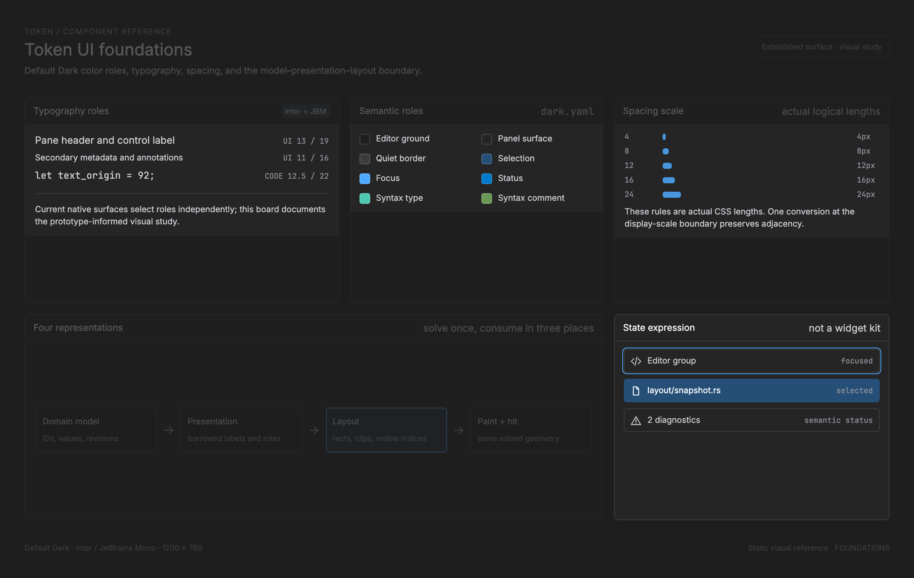

# Token UI foundations

<!-- token-ui-mockup:begin FOUNDATIONS -->
[](mockups/FOUNDATIONS.html?view=emphasised)

*Visual target under review. [Normal PNG](mockups/renders/FOUNDATIONS.png) · [Open normal mockup](mockups/FOUNDATIONS.html?view=normal) · [Open emphasised mockup](mockups/FOUNDATIONS.html?view=emphasised).*
<!-- token-ui-mockup:end FOUNDATIONS -->

The implementation chapters below are a technical contract, not a proposed
retained widget framework. Existing code excerpts are marked as such. Algorithms
marked proposed describe seams a component implementation can adopt; they are
not claims that Token already has those APIs.

## 1. Four representations, not one widget object

A component must distinguish four representations with different lifetimes:

```text
domain state --borrow/project--> view description --solve--> layout
      ^                              |                       |
      |                              +------paint------------+
      |                                                      |
      +-- deterministic update <-- intent <-- input + hit ----+
```

For example, a form's server ID and draft text survive frames; its hovered Save
button is transient; its borrowed label string lasts for a render; and the Save
rectangle is derived from the current window width and font. Saving the rectangle
alongside the draft makes it look authoritative after a resize when it is not.

| Representation    | Owns                                             | Must not own                                    | Lifetime                 |
| ----------------- | ------------------------------------------------ | ----------------------------------------------- | ------------------------ |
| Domain model      | IDs, draft/committed values, document revisions  | glyph raster data, absolute button boxes        | feature/document session |
| Interaction state | focused target, capture identity, preview choice | settings persistence or document clone          | gesture/overlay session  |
| Presentation      | borrowed labels, explicit states, semantic roles | an independently mutable copy of selected value | projection/render call   |
| Layout            | measured boxes, clips, visible indices           | durable selection or callbacks performing I/O   | until its inputs change  |

In current Token these boundaries are distributed among feature types. There is
no existing `Component` trait that owns all four. New types in component chapters
must fit these boundaries without implying such a trait is necessary.

### 1.1 Stable identity and positional projection

Current identifiers from [editor area](../../src/model/editor_area.rs):

```rust
// Current excerpt; derives and unrelated identifiers omitted.
pub struct DocumentId(pub u64);
pub struct EditorId(pub u64);
pub struct GroupId(pub u64);
pub struct TabId(pub u64);
```

An index means “the fifth element in this particular ordering.” An ID means
“this element even after other elements move.” Do not use one as the other.
For a proposed owner with optional selection, repair after deletion is explicit:

```rust
// Proposed standalone algorithm; T is a stable, unique item ID.
fn repair_selection<T: Copy + Eq>(
    old: Option<T>,
    old_index: usize,
    new_order: &[T],
) -> Option<T> {
    let old = old?;
    if new_order.contains(&old) {
        return Some(old);
    }
    let fallback = old_index.min(new_order.len().saturating_sub(1));
    new_order.get(fallback).copied()
}
```

For order `[A,B,C]`, selected `B` at index 1, removal of `A` yields `[B,C]`:
selection stays `B`, now index 0. Removal of `B` instead yields `[A,C]` and
selects `C` at index 1. Empty order yields `None`, not a phantom index-zero item.
This fallback is a proposed policy, not a universal replacement for each
component's existing selection semantics. Disabled options require filtering to
eligible IDs before applying the policy.

The algorithm is `O(n)` for membership. Building a map is unnecessary for a
two-option control; a large tree may already have an ID map and should use it.
An absent old selection stays absent: the function repairs a selection rather
than automatically selecting the first item. `old_index` must be captured from
the pre-mutation ordering in the same update transaction; an index saved before
an intervening reorder is not a meaningful fallback location.
Do not cache an index map without recording which ordering revision it indexes.

## 2. Coordinate representation and edge semantics

Current [Rect](../../src/model/editor_area.rs) is a floating-point border box:

```rust
// Current excerpt.
pub struct Rect {
    pub x: f32,
    pub y: f32,
    pub width: f32,
    pub height: f32,
}

// Current containment expression:
// px >= x && px < x + width && py >= y && py < y + height
```

Containment is half-open: left/top included, right/bottom excluded. Two adjacent
buttons `[10,30)` and `[30,50)` therefore never both own `x=30`. A zero-width box
contains no point. Callers must supply finite nonnegative dimensions; `Rect`
does not encode those invariants in its fields.

`WidgetRect { x: usize, y: usize, w: usize, h: usize }` in
[geometry](../../src/view/geometry.rs) is already raster-positioned. It cannot
represent negative offscreen origins. Do not cast a floating scrolled origin to
an unsigned integer before clipping or snapping through the appropriate helper.

### 2.1 Logical dimensions versus physical coordinates

Design constants are logical lengths `d`. Window/pointer/layout coordinates are
physical pixels. For display scale `s`, an isolated design length becomes
`p = round(d*s)` when an integral metric is required. `ScaledMetrics` also keeps
some physical dimensions as floats and sidebar configuration widths as logical
values; its field comments, not its type name, identify the boundary.

Example: a 28-logical-pixel row at `s=1.5` is 42 physical pixels. A pointer at
physical `y=126` is not multiplied by 1.5 again. If the list begins at `y=42`,
its local pointer coordinate is `126-42=84`, selecting row `floor(84/42)=2`.
Double-scaling would select row 3 and make paint/hit testing disagree.

### 2.2 Snap edges, not origin and width independently

Current [snapshot::snap](../../src/layout/snapshot.rs) computes:

```text
x0 = max(0, round(x))
x1 = max(0, round(x + width))
w  = saturating_sub(x1, x0)
```

Consider two neighboring fractional boxes `[10.4,20.6)` and `[20.6,30.8)`.
Edge snapping gives `[10,21)` and `[21,31)`: no gap and no overlap. Independently
rounding the first width `10.2` to `10` yields `[10,20)`, leaving a one-pixel
hole before the second origin at 21. This is why renderers consuming solved
layout should use the common snap helper rather than reconstruct integer widths.

For a box `x=-3.2,width=10`, clipping/snap yields `x0=0,x1=7,width=7`.
Retaining the original width after clamping only the origin would incorrectly
paint ten visible pixels. A child layout may still need the original negative
origin for text placement; the raster clip must not rewrite content coordinates.

## 3. Solve once, consume in three places

Relevant current [layout snapshot](../../src/layout/snapshot.rs) fields:

```rust
// Current excerpt; SolvedContent is defined in the same module.
pub struct SolvedNode {
    pub key: Option<UiKey>,
    pub rect: Rect,
    pub content_rect: Rect,
    pub clip: Option<Rect>,
    pub z: i16,
    pub parent: Option<u32>,
    pub content: SolvedContent,
}
```

`rect` is the border box; `content_rect` subtracts padding. `clip` is the
intersection of ancestor clip boxes, not automatically the node's own bounds.
`parent` indexes the snapshot's own node vector; it is not a durable component ID.
`key` is a typed `UiKey` for querying/dispatch. `z` and declaration order define
painting order; they do not justify inventing independent hit priorities.

The current `LayoutSnapshot` owns nodes, a key→node map, and draw-order indices.
Its hit algorithm scans draw order backwards, rejects points outside the node
or ancestor clip, and returns the closest keyed self/ancestor. An unkeyed text
leaf can therefore activate its keyed row without receiving its own event type.

```text
for node in reverse(draw_order):
    if clip exists and pointer not in clip: continue
    if pointer not in node.rect: continue
    for ancestor from node through parent chain:
        if ancestor.key exists: return ancestor.key
return no target
```

### 3.1 Worked overlap and clipping trace

Base row `A` occupies `(0,0,200,40)`. Floating menu `B` occupies
`(100,10,120,90)` above it, clipped to `(100,10,80,90)` by its owner.

- Pointer `(120,20)` lies in both: reverse paint order yields `B`.
- Pointer `(190,20)` lies in `B.rect` but outside its clip: reject B, then hit A.
- Pointer `(200,20)` is on A's excluded right edge and outside B's clip: no hit.

Painting B without that clip while hit testing honors it creates a visible but
unclickable strip. Hit testing without the clip creates invisible input capture.
Both are correctness bugs even when screenshots of the central region look fine.

### 3.2 Declared trees versus specialized layouts

Current `UiTree` uses a vector of declarations; parents precede descendants.
`ElementDecl` carries direction, sizing axes, padding, gap, alignment, clipping,
scroll offsets, optional floating anchor and content. The solver runs fit sizing,
grow/shrink allocation, wrapping and placement passes. Colors remain painter
inputs. `Content::RowList` represents a uniform virtual list as one node rather
than declaring one node per document/diagnostic row.

This is not the only valid layout representation: `GroupLayout`,
`EditorTabBarLayout`, `FindBarLayout`, and `OverlayLayout` are feature-specific
authorities. Reuse the one that owns the surface; wrapping all of them in another
generic layout object would not eliminate duplicated formulas by itself.

### 3.3 Row-unit versus pixel-unit list adapters

Current `ScrollDecl.offset_x/offset_y` are physical-pixel translations of child
content. `RowListDecl.scroll_offset` is an integral row index. Settings record
scroll, despite its `usize` representation, is physical pixels; it is adapted
with `RowListView::from_pixel_scroll`, not passed as a row count.

For positive row height `h`, pixel offset `p`, viewport origin `Y`, height `H`:

```text
p = min(p, max_scroll_pixels)
first = floor(p / h)
remainder = p % h
drawn_count = ceil((H + remainder) / h)
row_y(i) = Y + (i - first)*h - remainder
hit(y) = first + floor((y - Y + remainder) / h)
```

The hit function first rejects `y < Y` or `y >= Y+H`, then rejects indices
outside the model count. `drawn_count` includes partial rows; full-row capacity
is `floor(H/h)` and serves a different purpose. Interchanging them makes the
last sliver clickable but not painted, or removes a visible sliver's hit target.

Worked current mapping: `Y=100,H=100,h=72,p=13,count=5`. First row is zero,
remainder 13, drawn range `0..2`. Row zero begins at87 and ends159; row one begins
159 and ends231. The clip exposes `[100,159)` from row zero and `[159,200)`
from row one. Pointer159 selects row1, while pointer200 selects nothing.
The model offset remains13 after a repaint; it must not snap back to row0's
boundary. This is the behavior implemented by the shared pixel-scroll adapter.

## 4. Input ownership and gesture cancellation

Current [FocusTarget](../../src/model/ui.rs) is coarse:

```rust
// Current excerpt; DockPosition comes from crate::panel.
pub enum FocusTarget {
    Editor,
    Dock(DockPosition),
    FindBar,
    Modal,
}
```

It does not identify every button. Feature-local focus states refine it.
`HoverRegion` independently routes wheel/cursor feedback. Hovering a scrollbar
does not imply giving it keyboard focus, and changing a focus ring does not
move platform/native focus. A component proposal must specify both the top-level
route and its internal focus index/ID.

### 4.1 Proposed captured-action model

The following standalone sketch illustrates identity-safe activation. It is not
an existing shared Token input machine. `TargetId` identifies the owner/control;
`epoch` identifies a particular open instance of that owner.

```rust
#[derive(Clone, Copy, Debug, PartialEq, Eq)]
struct TargetId(u64);

#[derive(Clone, Copy, Debug, PartialEq, Eq)]
struct Press {
    target: TargetId,
    epoch: u64,
}

#[derive(Default)]
struct Gesture {
    press: Option<Press>,
}

impl Gesture {
    fn release(
        &mut self,
        hit: Option<TargetId>,
        current_epoch: u64,
        enabled: bool,
    ) -> Option<TargetId> {
        let press = self.press.take()?;
        (enabled && press.epoch == current_epoch && hit == Some(press.target))
            .then_some(press.target)
    }

    fn cancel(&mut self) {
        self.press = None;
    }
}
```

Taking capture before deciding activation prevents a second release from firing
twice. Disabling a control after press suppresses activation. Reopening a form
with the same control ID but a new epoch suppresses an old release. Movement
outside can alter pressed appearance without changing capture; release outside
cancels. Other controls, such as sliders or splitters, intentionally commit
during drag and need different domain transitions.

| Event                            | Captured-action transition    | Domain result |
| -------------------------------- | ----------------------------- | ------------- |
| enabled press on A               | store `(A,epoch)`             | none          |
| move outside A                   | retain capture, paint unarmed | none          |
| release over A, same epoch       | clear capture                 | activate A    |
| release elsewhere                | clear capture                 | none          |
| owner closes / app loses focus   | clear capture                 | none          |
| owner reopens before old release | epoch differs; clear capture  | none          |

This model separates two questions often collapsed into a boolean: “which
control owns this gesture?” and “would release here activate it?”

### 4.2 Current Settings-record scrollbar integration

The actual route uses existing messages rather than the proposed gesture above:

1. Runtime mouse code consumes the current Settings scrollbar geometry and
   distinguishes thumb press from track click. A track click calculates an
   absolute pixel destination using the shared scrollbar mapping.
2. `UiMsg::ScrollbarTrackClicked { target: SettingsRecords, axis: Vertical,
new_position }` reaches `update::ui::scroll_target`.
3. That function checks that the active modal is Settings and that a form
   exists, assigns `form.records_scroll = new_position`, and returns
   `Some(Cmd::Redraw)`. Missing Settings clears captured drag and returns no
   command; a horizontal SettingsRecords message also returns no command.
4. Runtime executes the redraw command. Settings layout reconstructs its
   `RowListView::from_pixel_scroll` from the form offset and current record count.
5. Thumb press instead stores `ScrollbarDragState`; successive
   `ScrollbarDragUpdate { mouse_coord }` messages calculate the captured
   target's position and reach the same `scroll_target`. DragEnd takes capture
   out of the model and redraws only if capture existed.

For records_scroll13 and a track destination85, the model stores85, not row1.
With64px records the next view decomposes85 as first1,remainder21. A click on a
visible record must therefore use the new view's `row_at_y`; reusing the old
row boxes would address a different record. This route is implemented in
[UI update](../../src/update/ui.rs), [messages](../../src/messages.rs),
[runtime mouse](../../src/runtime/mouse.rs), and
[Settings geometry](../../src/view/settings_page.rs).

## 5. Borrowed painter scope and typography

Current [TextPainter](../../src/view/frame.rs) borrows font data and mutable
glyph caches. It holds the active font, size/ascent, code-grid advance/line
metrics, an alternate font/cache, and a `FontRole`. `ScopedFont` borrows the
painter and restores its previous role in `Drop`.

```rust
// Integration sketch using current APIs; draw_field_contents is a caller helper.
// A block ends the mutable scoped borrow before the next surface uses painter.
{
    let mut code = painter.with_font(FontRole::Code);
    draw_field_contents(frame, &mut code, field);
}
// painter now has the caller's original role, even if the helper returned early.
```

The mutable borrow prevents using `painter` simultaneously while `code` exists.
The lifetime of cached glyphs belongs to the renderer, not a temporary field
descriptor. Sharing only a font name while sharing the wrong glyph cache or
ascent is insufficient: measurement and drawing must use the same active role.

Monospace layout may use `columns * char_width` where the editor's column model
actually applies. UI labels require measured advance. With advances
`W=11,i=3,d=7,e=7`, the UI word “Wide” is 28 pixels, not `4*8=32`; centering in
a 60px box starts at 16, not 14. The two-pixel error is visible before any
clipping error occurs. For Unicode text, byte length is not even character count.

## 6. Invalidation is an input-dependency problem

Do not cache a layout by “same component ID” alone. The same ID with a longer
label, different font, changed options, or a new scale has different geometry.

| Derived result       | Inputs that invalidate it                                 | Inputs that normally do not   |
| -------------------- | --------------------------------------------------------- | ----------------------------- |
| measured label width | text, font face/size/role, fallback, text style           | hover color                   |
| row rectangles       | bounds, padding, gaps, visible order, row heights, scroll | unchanged selected fill       |
| glyph bitmap         | font identity, glyph, raster size and cache's actual key  | button position               |
| rounded mask         | physical radius under current mask algorithm              | theme color                   |
| popup placement      | measured content, anchor, viewport, scale                 | unrelated document's revision |
| input eligibility    | enabled state, focus, owner identity, modal precedence    | paint cache freshness alone   |

Current rounded-corner masks are color-independent and keyed by physical radius
in `RoundedRectMaskCache`. A theme change need not recompute their coverage.
A changed scale generally changes radius, choosing another mask. This is an
example of a useful narrow cache, not a reason to cache every component model.

### 6.1 Async owner validation

For async controls, compare a tuple, not only the requested string:

```text
request identity = (owner ID, open epoch, content revision, request sequence)
accept response iff all relevant fields match current owner state
```

Sequence: form A opens at epoch 4, requests validation 7; it closes; form A opens
again at epoch 5 and requests validation 8. Response 7 must be discarded even if
its text happens to equal current input. Epoch expresses lifecycle identity;
revision expresses content identity. Feature implementations may already use
different concrete IDs/tickets; do not introduce this tuple on top of an
equivalent existing guard. See each async component chapter for its real route.

## 7. Component verification as concrete observations

These are proposed shared test vectors, not tests automatically executed by
writing this document:

| Initial inputs                         | Operation               | Expected result                |
| -------------------------------------- | ----------------------- | ------------------------------ |
| adjacent boxes `[10,30)`, `[30,50)`    | hit at x=30             | second box only                |
| rect x=10.4,w=10.2                     | snap                    | x=10,w=11                      |
| rect x=-3.2,w=10                       | snap visible raster box | x=0,w=7                        |
| selected B in `[A,B,C]`                | remove A                | selected B, index0             |
| selected B in `[A,B,C]`                | remove B                | proposed fallback C, index1    |
| no selection in `[A,B,C]`              | remove B                | no selection, not automatic A  |
| captured `(A,4)`, owner epoch5         | release over A          | no intent; capture empty       |
| captured A then disabled               | release over A          | no intent; capture empty       |
| scoped Code painter under Ui           | leave scope             | Ui restored                    |
| glyph metrics unchanged, hover changes | redraw                  | widths and hit boxes unchanged |

For each family, add its own semantic vectors rather than rerunning a generic
button test under different labels. A static gallery PNG cannot prove that a
late response is dropped or focus is restored; those observations require the
real update/input path. Conversely, pure reducer tests cannot prove glyph
baseline alignment. Both kinds of evidence are necessary where both matter.

The remaining sections summarize the architecture constraints and source map
to use alongside these implementation rules.

This is the shared contract for the UI component research. It records current
Token behavior and constraints for new components; it does not authorize a
widget toolkit or replace the separate Settings page.

## Vocabulary

| Name              | Meaning                                                        | Not this                              |
| ----------------- | -------------------------------------------------------------- | ------------------------------------- |
| action control    | invokes a command, with no selected value                      | select or tab                         |
| select            | shows one committed value and opens exclusive choices          | cycling button                        |
| navigation        | changes a current place/item                                   | a command that happens to open a view |
| container/surface | establishes bounds, clipping and composition                   | owner of unrelated effects            |
| editor surface    | tabs, optional find bar, gutter, content, overlays, scrollbars | generic multiline field               |
| scroll area       | viewport over content with an offset                           | its document/list model               |
| splitter          | adjustable boundary between sibling layout nodes               | arbitrary divider                     |

IntelliJ is UX vocabulary evidence, not an instruction to adopt Swing: its
editor area has tabs, gutter and inlays; tool windows surround it; popups
normally dismiss on outside click. [UI overview](https://plugins.jetbrains.com/docs/intellij/ui-overview.html)

## Verified architecture

Token uses `Msg -> update -> Cmd -> runtime -> Renderer`.

| Layer                                                            | Authority                               | Component rule                                     |
| ---------------------------------------------------------------- | --------------------------------------- | -------------------------------------------------- |
| [model](../../src/model/)                                        | durable document, editor and UI state   | owners retain state by stable domain IDs           |
| [messages](../../src/messages.rs)                                | state-change requests                   | messages express intent/result, not drawing        |
| [update](../../src/update/)                                      | deterministic transitions and commands  | no I/O, native focus or rendering effects          |
| [commands](../../src/commands.rs), [runtime](../../src/runtime/) | winit input and platform/I/O effects    | translate physical input and execute commands      |
| [view](../../src/view/)                                          | CPU painting and hit testing            | read state; do not become another state machine    |
| [layout](../../src/layout/)                                      | pure chrome trees and `LayoutSnapshot`s | use its solved typed geometry where it owns chrome |

[`layout/mod.rs`](../../src/layout/mod.rs) makes a queryable `LayoutSnapshot` the output for its surfaces:
paint and hit testing query the same rect and clip chain. It owns shell/chrome,
tab strips, previews, overlays and uniform virtual row lists.
[`view/geometry.rs`](../../src/view/geometry.rs)'s `GroupLayout` is the editor-content geometry authority;
`GutterLayout` and `pixel_to_cursor` preserve editor coordinate semantics. Do
not add a feature-local line loop, gutter formula or alternate text hit test.

## Geometry, clipping and scaling

**Verified.** Renderer/window `Rect` values and runtime input are physical
pixels. `AppModel::metrics: ScaledMetrics` derives tab, splitter, padding,
border and scrollbar metrics from display scale. The renderer derives code-font
size, line height and character advance at that scale. Convert a logical design
value once: integral metrics round, while float splitter/padding metrics retain
fractional pixels. The border-width metric alone enforces a one-pixel floor.
Sidebar widths are deliberately logical configuration values and convert
at that boundary.

**Required.** A new component declares coordinate space, rectangle owner, clip
rectangle and rounding point. Solve layout before both paint and hit testing;
do not mix logical/physical values or independently derive a box in the
runtime. `Frame` clip stacks are mandatory for overflow. Floating surfaces use
the existing anchoring helpers (edge clamp and caret flip), not copied math.
Scroll units must match their surface: editor scrollbar state is physical
pixels; `RowListDecl` offsets are rows, whereas Settings record offsets and
`ScrollDecl` offsets are physical pixels. `RowListView::from_pixel_scroll`
decomposes the latter into a first row and in-row remainder.

## State, focus and input

### Ownership — verified

Component owners keep committed and transient state in the model. Shared code
may calculate rectangles, paint an explicit visual state, map pointer to value,
or build a typed drag payload. It does not save settings, load themes, mutate a
document, open a file or decide policy. The gallery proves the boundary:
[`model/gallery.rs`](../../src/model/gallery.rs) owns isolated state and
[`bin/ui_gallery.rs`](../../src/bin/ui_gallery.rs) has no document,
session or settings persistence.

### Dispatch/capture — verified

[`view/hit_test.rs`](../../src/view/hit_test.rs) returns typed `HitTarget`;
[`runtime/mouse.rs`](../../src/runtime/mouse.rs) dispatches it
and calls update. Priority prevents an overlay, scrollbar, tab, gutter lane or
splitter becoming a text click. `FocusTarget` is currently coarse (`Editor`,
`Dock`, `FindBar`, `Modal`); `HoverRegion` separately drives cursor/wheel
routing. Runtime owns native focus/cursor; model focus owns keyboard routing.

Pointer capture is model drag state: `ScrollbarDragState`, `SplitterDragState`,
tab drag, sidebar resize and dock resize retain press-time identity/geometry.
Scrollbar release ends capture. Escape cancels a splitter and restores original
ratios. A changing layout causes the splitter update to ignore an invalid frame
rather than use stale indices.

### Baseline for proposals

Every interactive component must state press target/capture payload (or none),
release/cancel/window-focus-loss behavior, focus target, keyboard traversal and
activation, Escape behavior, and disabled/unavailable consumption. A painted
focus ring does not make a control keyboard accessible. Token has no general
accessibility tree or screen-reader adapter today: expose semantic role/name and
keyboard-equivalent action in new contracts, but call it a gap until implemented.

## Fonts, theme roles and icons

### Fonts — verified

[`view/fonts.rs`](../../src/view/fonts.rs) loads a configured monospaced editor face and proportional UI
face, falling back to embedded JetBrains Mono and Inter; a non-monospace editor
font is rejected. `TextPainter::FontRole::{Code,Ui}` switches font plus an
independent glyph cache/ascent. Editable text uses `Code`; Token also currently
uses `Code` for editor/explorer text, document/dock/terminal tabs and gallery
chrome fixtures; overlay tabs and section navigation use `Ui`. Use `Ui`
only where the production painter selects it (for example UI labels and
proportional chrome), and make role choice explicit for every surface. Scoped
`with_font` prevents a temporary role from leaking. Never use code-cell width to
truncate or position a `Ui` label: measure its glyph advances.

### Themes — verified

[`theme.rs`](../../src/theme.rs) parses YAML and resolves compatibility fallbacks into `Theme`.
Existing semantic families are `editor`, `gutter`, `status_bar`, `overlay`,
`tab_bar`, `splitter`, `sidebar`, `csv`, `button`, `image_preview`, `syntax`,
and `scrollbar`. Select the surface's semantic role—not a hard-coded ARGB value
or a similar-looking role from another family. Gallery renders the current
resolved palette. Theme loading is a runtime effect returned by messages.

**Proposed:** add a YAML role only for a concrete visual distinction and
production consumer, with a fallback for existing themes. Geometry, type size
and semantics do not belong in theme keys. Verify a new role in a bundled light
and dark theme; fallback behavior is part of compatibility.

### Icons — verified/proposed

Token mostly paints UI icons as glyphs/badges; [workspace](../../src/model/workspace.rs)
and [panel](../../src/panels/mod.rs) helpers explicitly
use Nerd Font code points. It has no general SVG registry, canonical size table,
semantic accessible name or icon gallery. Before broad icon work, define an
`Icon` asset/semantic contract. An icon-only action needs a text label/tooltip
and keyboard equivalent; status needs shape/text as well as color. Prefer simple
scalable assets or an explicitly supported glyph font with a known fallback.
IntelliJ similarly distinguishes action/noun/status icons and says status shape
must not rely on red/green; its 12/13/16px values are reference sizes, not Token
constants. [Icon style guidance](https://plugins.jetbrains.com/docs/intellij/icons-style.html)

## Reuse and acceptance

Primary seams are [scrollbar](../../src/view/scrollbar.rs),
[button](../../src/view/button.rs), [controls](../../src/view/controls.rs),
[text field](../../src/view/text_field.rs),
[overlay surface](../../src/view/overlay_surface.rs),
[editor layout](../../src/layout/editor.rs), [chrome layout](../../src/layout/chrome.rs),
[editor text](../../src/view/editor_text.rs), and [geometry](../../src/view/geometry.rs).
Extract only
when production and gallery, or two production consumers, share true semantics
and geometry.

### Ownership and implementation-overlap matrix

| Surface/mechanism   | Model owner                                       | Geometry/painter authority                                                              | Existing consumers                     | Do not generalize past                                 |
| ------------------- | ------------------------------------------------- | --------------------------------------------------------------------------------------- | -------------------------------------- | ------------------------------------------------------ |
| scrollbar           | target surface plus `ui.scrollbar_drag`           | [scrollbar](../../src/view/scrollbar.rs) and target layout                              | editor, overlays, Settings, gallery    | target-specific row selection and scroll units         |
| editor group        | `EditorArea`, `EditorGroup`, `EditorState`        | [GroupLayout](../../src/view/geometry.rs), [editor text](../../src/view/editor_text.rs) | text, CSV, image, binary tabs          | generic text field or special-tab rendering            |
| tab strip           | `EditorGroup::tabs`, active index, tab scroll     | [EditorTabBarLayout](../../src/layout/editor.rs)                                        | editor tabs, gallery chrome            | dock and terminal tab policies                         |
| chrome row list     | feature panel/modal state                         | [layout snapshot](../../src/layout/snapshot.rs)                                         | Problems, Outline, Usages and overlays | editor's visual-row mapping                            |
| splitter            | `EditorArea` layout ratios and `ui.splitter_drag` | [editor-area traversal](../../src/model/editor_area.rs)                                 | editor/preview tree, gallery swatch    | dock/sidebar resize persistence/units                  |
| field/select/button | caller owns value/focus/commit                    | [controls](../../src/view/controls.rs), [button](../../src/view/button.rs)              | Settings, Find, gallery                | theme loading, validation or form persistence          |
| icon-like output    | feature/domain owner                              | current glyph/badge painter                                                             | file rows, overlays, gutter, buttons   | a registry until semantic IDs and fallback are defined |

This is deliberately a matrix of seams, not a class hierarchy. Where an entry
does not share owner semantics, only share pure geometry/paining primitives.

A slice is acceptable when it has a named owner and typed messages; one geometry
authority for paint/hit/clip/scroll; scale/font/theme roles with light/dark
fallback checks; documented pointer/keyboard/focus/cancel behavior; no helper
effect; and a gallery specimen using its production painter where feasible.

## Evidence and confidence

High-confidence implementation evidence: [model](../../src/model/),
[messages](../../src/messages.rs), [update](../../src/update/),
[runtime mouse](../../src/runtime/mouse.rs), [layout](../../src/layout/),
[view](../../src/view/), [theme](../../src/theme.rs) and
[gallery guide](../dev/ui-gallery.md), reviewed 2026-09-12. **Proposed** sections are not
implemented. The local IntelliJ SDK material was a secondary cross-check;
official pages above are primary UX reference.
