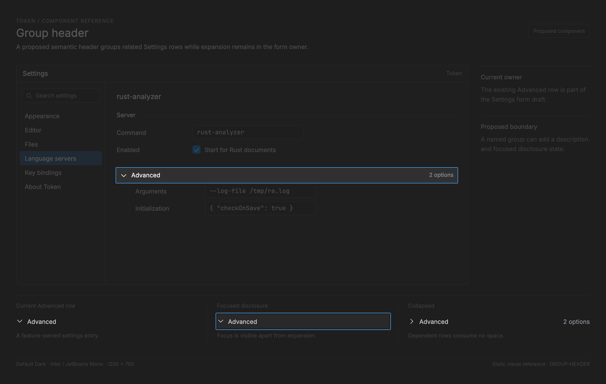

# Group header

<!-- token-ui-mockup:begin GROUP-HEADER -->
[](mockups/GROUP-HEADER.html?view=emphasised)

*Visual target under review. [Normal PNG](mockups/renders/GROUP-HEADER.png) · [Open normal mockup](mockups/GROUP-HEADER.html?view=normal) · [Open emphasised mockup](mockups/GROUP-HEADER.html?view=emphasised).*
<!-- token-ui-mockup:end GROUP-HEADER -->

## Boundary: current disclosure is not a generic group header

Token has no `GroupHeader` type. The nearest current implementation is the
Settings form's `Advanced` row. It is a selectable `RowKind`, a boolean in a
form draft, and a text painter; it does not yet own generic title, description,
child region, disabled/focus semantics, or accessibility metadata. Overlay
`Section { title, rows }` is also deliberately different: its uppercase header
is non-selectable list metadata, not a form grouping control.

**Current excerpts — durable model and update owner**

```rust
// src/settings.rs
pub(crate) enum RowKind { FormField(usize), FormChoice(usize), FormAdvanced, /* ... */ }

// src/update/settings.rs
RowKind::FormAdvanced => {
    form.advanced = !form.advanced;
    form.focused = None;
    state.refresh_entries(&model.config);
}
```

Provider and language-server form builders insert `FormAdvanced`, then append
advanced rows only when `form.advanced` is true. `SettingsForm` therefore owns
the durable boolean and focused field; `state.refresh_entries` owns the derived
visible-row list. Renderer borrows that state through `SettingRow` and does not
toggle it. The critical post-mutation invariant is:

```
visible_rows = base_rows ++ (advanced ? advanced_rows : [])
focused_field ∈ visible_editable_fields OR focused_field = None
selected_index < visible_rows.len()  (unless list is empty)
```

Current update explicitly repairs the first focus condition by assigning `None`.
`refresh_entries` rebuilds `entries`, resets `rows` to `0..entries.len()`, and
applies `selected_index = min(selected_index, rows.len().saturating_sub(1))`.
That makes the index in-bounds but does not preserve semantic identity: if an
advanced selected row disappears, the same numeric index can now name a base
row. A generalized header must choose and test either clamping or stable-row
reidentification deliberately.

## Paint geometry, typography, and hit boundary

`settings_page` has already solved each settings row as a `WidgetRect` in
physical pixels. For disclosure it derives the label rect from that shared row:

```text
label.x = row.x
label.y = row.y + round(8 × scale)
label.w = row.w - reserve                 // reserve is 0/120px or accessory-derived
label.h = row.h
size = 12 × scale
text = expanded ? "▾  Advanced" : "▸  Advanced"
visible = truncate_sized(text, size, label.w, End)
draw at (label.x, label.y) using overlay.text_primary
```

`render_disclosure` owns only the final truncation/draw. The enclosing settings
row owns the activation rectangle; `settings_page` pushes the settings viewport
clip around its traversal. The helper does not scope the painter, but
`RenderSession::new` initialized that active painter with `FontRole::Ui`, so the
current disclosure inherits UI typography. For a row
`(x=40,y=200,w=180,h=32)` at 1x and no reserve, label begins `(40,208)` and has
180px. At 1.25x its top offset is `round(10)=10`; the 12px text becomes 15px.
If a compact form reserves 120px, width is 60px and the drawn string must be the
same measured ellipsis result, not an unclipped `▾ Advanced` over an accessory.

The glyph is a character in text, not an independently measured/fitted icon.
Its visual column and every label pixel lie inside the row's existing clip and
hit rect. Thus changing from `▸` to `▾` changes no geometry/hit target. No
collapsed content rectangle exists in current code: advanced rows are removed
from the derived row list before layout, so they consume zero paint, hit, scroll,
and tab-order slots rather than being painted hidden.

## Transition table and real Elm integration

| State            | Event/precondition                                                  | Update/result                                                                                                                                | Effect                                        |
| ---------------- | ------------------------------------------------------------------- | -------------------------------------------------------------------------------------------------------------------------------------------- | --------------------------------------------- |
| `advanced=false` | pointer `ChooseSetting` for row, or Enter `Confirm` on selected row | pointer calls `change_setting(...Some(choice))`; Enter calls `confirm_active_modal` then `change_setting(...None)`; both reach `form_choice` | advanced rows become layout/render candidates |
| `advanced=true`  | same distinct pointer/Enter paths                                   | same `form_choice` toggle, focus=None, refresh entries                                                                                       | advanced rows absent from model-derived list  |
| any              | pointer release/cancel outside row                                  | no `ChooseSetting` dispatch                                                                                                                  | unchanged                                     |
| any              | disabled/read-only form (no current disabled branch)                | proposed owner must reject before toggle                                                                                                     | unchanged                                     |
| no rows          | navigation                                                          | safe no-op/sentinel selection                                                                                                                | no disclosure paint                           |

The pointer path dispatches `ModalMsg::ChooseSetting` to `change_setting`;
Enter dispatches `Confirm` through `confirm_active_modal` to `change_setting`.
Both reach `form_choice`, then `SettingsState.refresh_entries`, modal/settings
row assembly, settings-page layout, and `render_disclosure`.
It is `Message → Update → Command →
Render`: the painter has no mutation or input side effect. Existing modal tests
exercise selecting the literal `Advanced` row and updates in
[tests/modal/settings.rs](../../tests/modal/settings.rs).

## Invalidation, cost, and edge cases

The boolean, rows/form kind, selected/focused state, viewport/scroll, row bounds,
scale, active modal UI font, and overlay palette invalidate the projection. There is no group
header cache. One visible disclosure costs one truncation measurement and glyph
paint; expanding costs rebuilding derived entries and then normal visible-row
layout, proportional to entries rendered/measured. This is not an animation:
there is no interpolated height/damage policy to cache or test.

Pathological transition: focus an advanced JSON field, then collapse. Current
update clears `form.focused` before refresh, so TextFieldRenderer cannot paint a
caret into a removed field. If selection was an advanced row, current refresh
only clamps its index: it can select a different base row after removal.
`refresh_entries` does not change `scroll_offset_px` and the toggle path makes no
separate reveal call, so a previously scrolled form can retain its physical
viewport offset across this row-count change. Test
that actual policy explicitly, or use stable identity in a future group. A long
localized title cannot be solved by hard-coding `Advanced`; current literal is
an implementation limit to remove only with a real generalized consumer.

## Proposed group contract and verification

Do not extract a static heading simply to share bold text. When two Settings
forms require named/collapsible groups, extract this _proposed_ boundary:

```rust
// proposed API — not implemented
// GroupId must be a new stable settings-form identity (not editor-area GroupId);
// WidgetRect is existing view::geometry physical-usize geometry. `expanded` is
// model-owned durable state; `enabled` is an input guard, not paint inference.
struct Disclosure { expanded: bool, enabled: bool }
struct GroupHeader<'a> {
    id: GroupId, title: &'a str, description: Option<&'a str>,
    disclosure: Option<Disclosure>,
}
enum GroupMsg { Toggle(GroupId) }
struct GroupLayout { header: WidgetRect, description: Option<WidgetRect>, content: Option<WidgetRect> }
```

Model owns expansion keyed by stable `GroupId`; update rejects disabled toggles.
Layout must compute `content=None` when collapsed, and both paint and hit test
must consume that same `GroupLayout`. Pointer click and focused Space/Enter may
emit `Toggle`; Escape does not collapse a form. If collapse hides focused child,
update moves focus to header, not `None`, once headers become focusable. Current
literal row is not yet that contract.

Regression vectors: the 1x/1.25x rectangles above; false→true adds the expected
form rows and clears stale focus; true→false produces zero advanced row rects or
hit targets; selection is valid after collapse; a long future title truncates
inside header; and overlay `Section` remains non-selectable. Preserve gallery
`disclosure.collapsed`/`.expanded` as static paint coverage, but do not mistake
it for interaction coverage.

Sources: [controls.rs](../../src/view/controls.rs), [settings.rs](../../src/settings.rs),
[update/settings.rs](../../src/update/settings.rs), [settings_page.rs](../../src/view/settings_page.rs),
[overlay_surface.rs](../../src/view/overlay_surface.rs).
