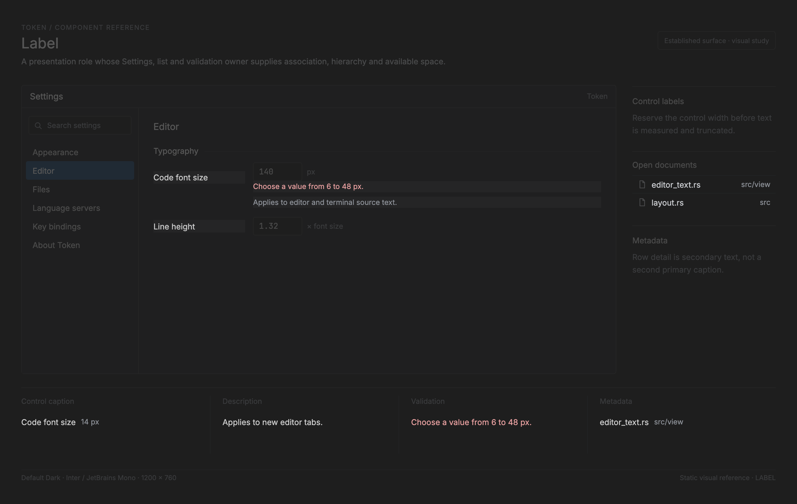

# Label

<!-- token-ui-mockup:begin LABEL -->
[](mockups/LABEL.html?view=emphasised)

*Visual target under review. [Normal PNG](mockups/renders/LABEL.png) · [Open normal mockup](mockups/LABEL.html?view=normal) · [Open emphasised mockup](mockups/LABEL.html?view=emphasised).*
<!-- token-ui-mockup:end LABEL -->

## Current representation and ownership

Label is a presentation role, not a retained Token widget. Its caller owns
localized text, control association, validation and focus; `TextPainter` owns
glyph measurement/rasterization; overlay/settings layout owns physical rectangles
and, where the caller establishes one, clips. This separates a field caption, a row's primary text, an error, a
section heading, and a placeholder instead of pretending they have one input
contract.

**Current excerpt — borrowed render input**

```rust
pub struct Field<'a> {
    pub label: &'a str, pub trailing: Option<&'a str>,
    pub trailing_is_error: bool,
}
pub struct Row<'a> {
    pub label: &'a str, pub match_indices: &'a [u32],
    pub detail: Option<&'a str>, pub detail_style: Option<SpanStyle>,
    pub accessory: Accessory<'a>,
}
pub struct Section<'a> { pub title: Option<&'a str>, pub rows: &'a [Row<'a>] }
```

These lifetimes require the source strings and match runs to outlive layout and
paint but prohibit storage in application state. `Field` does not own editable
content: the caller paints the buffer, selection and caret through
`TextFieldRenderer` into `FieldLayout::input`. The form owns mutation and
validation, preventing a label from independently changing text or retaining an
error after its form is replaced. `match_indices` are Nucleo _character_ indices
into `label`, never UTF-8 byte offsets. Current paint does not validate, sort,
or clamp them: an out-of-range index simply matches no enumerated character;
unsorted/duplicate input is producer behavior. Search producers must supply
valid ordered indices if they need coherent highlighted runs.

## Font scope, geometry, baseline, and clipping

`TextPainter::with_font(FontRole)` returns a scoped mutable borrow that restores
its prior role on `Drop`. UI is ordinary label type; Code is explicit for
editable text and code details. UI/Code retain separate cache and ascent, hence
measurement and draw must use the same scope. Text painter draws its baseline at
`top_y + ascent`; callers center _line height_, not glyph ink height.

The one-line list derivation is:

```text
accessory_w = measure_accessory(accessory)
gap = (accessory_w > 0) ? text_pad : 0
label_right = row.x + row.w - inset - text_pad - accessory_w - gap
label_x = row.x + inset + text_pad + icon_column
available = max(0, label_right - label_x)             // physical px
rendered = truncate_sized(label, size_px, available, End)
label_y = row.y + floor((row.h - line_height(size_px))/2)
draw rendered at (label_x,label_y) under caller's current Frame clip
```

`truncate_sized` measures real glyph advances and ellipsis. It is deliberately
not a byte/character count. Detail/span layout reserves and truncates detail
before primary label according to `render_list`; a right accessory is measured
before either. Field trailing text is right-aligned and its `trailing_is_error`
selects error color; field/input rectangles exist before the text field renderer
runs, so label paint cannot overlap caret or IME content.

Overlay `Section` is a distinct label role. A title is uppercased, painted at
metadata size with 1px tracking, and has no `FlatIndex`; a title-less later
section yields a one-pixel separator. Placeholder text belongs to editable
header/find state and disappears according to content/focus rules, so it is not
a durable Label.

## Worked geometry and pathological inputs

At normal overlay row `(20,100,260,30)`, inset 6, icon column 18 and text pad 8
place primary label at x=`20+6+18+8=52`. With 78px keycap accessory and the
extra label/accessory gap 8, right edge is `20+260-6-8-78-8=180`, giving 128px.
A 13px UI `"Initialize workspace"` that measures 141px must produce a measured
end-ellipsis no wider than 128px; drawing
the original string and relying on clip would hide a different suffix and could
paint under the accessory. At 1.25x all pads/sizes are re-rounded before this
subtraction; no 1x truncated width is scaled.

For this normal list row, label size is `SIZE_ROW=13px`; if the active font's
`line_height_for_size(13)` is `L`, y is `100+floor((30-L)/2)` and baseline is
that y plus the active font ascent. This centers unlike fonts by their line
boxes rather than assuming the old 12px/28px values. Narrow
field/error case: owner must reserve the trailing error region or choose its
compact layout; two unmeasured strings cannot occupy a single field rect.

`match_indices=[0,40]` against a ten-character post-filter label is invalid
producer output; current enumeration simply never sees index 40, rather than
dropping/clamping it. Empty list retains the safe `FlatIndex(0)` render sentinel
but paints no label. A 0px available rectangle may
draw nothing, never an unbounded original string.

## Passive projection, update integration, and cost

Static labels have no pointer, keyboard, focus, capture, cancel, or accessibility
machine. Row click/Enter belongs to row selection/activation; editable field
input belongs to the text field; an eventual Link owns only explicit action
ranges. Disabled control state must be projected together by its form owner to
label, help and control; Label does not infer disabled from its text.

When filtering removes rows, each consumer clamps its own `usize` selection/scroll
before modal assembly wraps it as a `FlatIndex`; section headers remain
non-addressable. Replacing a form means its owner supplies new field/error text
and recomputes layouts. Inputs that invalidate this projection
are text, matches, font role/configuration, physical scale/size, available rect,
detail/accessory, palette and clip. Cost is O(visible glyphs plus match runs);
glyph cache avoids rasterization on hit but there is no standalone label cache.
Async completion results use the concrete `document_id`/`revision` guards before
contributing text; other async owners need equally explicit identity/revision
checks rather than an implied universal generation field.

The real path is `model/form or search → update selection/validation →
modal/settings constructs Field or Row → overlay layout → TextPainter`. Render
is read-only in the `Message → Update → Command → Render` flow.

## Verification and proposed boundary

Existing behavior is exercised through [overlay_surface.rs](../../src/view/overlay_surface.rs),
[find_bar.rs](../../src/view/find_bar.rs), and [settings_page.rs](../../src/view/settings_page.rs).
Add deterministic-font vectors for the 128px trace; UI/Code baseline placement
using their measured line boxes; no pixels after end/start ellipsis clip; stale
match indices never panic; and disabled field/control resolve the same dim state.

```rust
// proposed API — not implemented; only justify after a second shared layout use
// FontRole is frame's scoped UI/Code selector; WidgetRect is an existing
// physical-usize view rectangle. `rendered` owns the ellipsized/wrapped output
// because it may differ from borrowed source text; line_tops are physical y's.
enum LabelRole { Control, Section, Metadata, Help, Description, Status }
enum LabelOverflow { End, Start, Wrap }
struct Label<'a> { text: &'a str, role: LabelRole, font: FontRole, overflow: LabelOverflow }
struct LabelLayout { rect: WidgetRect, rendered: String, line_tops: Vec<usize> }
```

Form would still own association/validation; renderer would only return measured
lines and explicit link ranges. Links, not labels, would be focusable.

Sources: [frame.rs](../../src/view/frame.rs), [overlay_surface.rs](../../src/view/overlay_surface.rs),
[text_field.rs](../../src/view/text_field.rs), [settings_page.rs](../../src/view/settings_page.rs).
