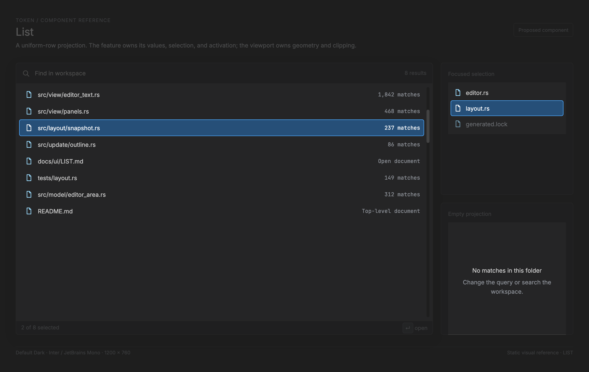

# List implementation manual

<!-- token-ui-mockup:begin LIST -->
[](mockups/LIST.html?view=emphasised)

*Visual target under review. [Normal PNG](mockups/renders/LIST.png) · [Open normal mockup](mockups/LIST.html?view=normal) · [Open emphasised mockup](mockups/LIST.html?view=emphasised).*
<!-- token-ui-mockup:end LIST -->

Token's shared list foundation is a **uniform-row viewport**, not a universal
widget. It centralizes geometry, scrolling and virtualization; its consumers
own clipping; each
consumer keeps its own values, identity, selection, filter, activation, and
effects. This prevents a completion list, a Problems panel, and a settings form
from acquiring accidental common behavior.

This chapter is about flat projections. A tree supplies that projection from a
hierarchy ([TREE.md](TREE.md)); the CSV grid uses independent two-dimensional
geometry ([TABLE.md](TABLE.md)).

## 1. Current representation and ownership

`RowListDecl` is declared once in the immediate-mode layout tree. The solver
emits `RowListSolved` in the frame-local `LayoutSnapshot`; its accessor returns
`RowListView`, which is the sole authority for visible indices, row rectangles,
and y-coordinate hits (`src/layout/tree.rs:49-63`,
`src/layout/snapshot.rs:154-310`).

```rust
// current excerpt — all geometry is physical pixels
pub struct RowListDecl {
    pub row_height: f32,
    pub count: usize,
    pub scroll_offset: usize, // model-owned logical row offset
}

pub struct RowListView {
    rect: Rect,               // solved viewport
    solved: RowListSolved,    // height, count, first row
    offset_within_row: f32,   // nonzero only for pixel-scrolled views
}
```

`RowListDecl` is one layout leaf rather than `count` children. The solver lays
out its parent normally and records the payload without measuring or retaining
individual rows (`src/layout/algorithm.rs:258-264`). For continuous scrolling,
`RowListView::from_pixel_scroll` clamps an owned pixel offset `p`, then stores
`q = floor(p / h)` and `r = p % h`.

| State class           | Owner                    | Examples                                     | Repair responsibility                            |
| --------------------- | ------------------------ | -------------------------------------------- | ------------------------------------------------ |
| durable values        | feature model            | diagnostics, outline nodes, settings records | feature replaces/filter values                   |
| durable navigation    | feature model            | selected ID/index, query, pixel/row scroll   | feature reconciles after data or bounds mutation |
| borrowed presentation | snapshot / `RowListView` | rect, visible range, row boxes               | discard after the frame                          |
| derived cache         | view/layout              | clamped offset, `r`, text truncation         | invalidate from geometry/value inputs            |
| transient input       | runtime                  | pointer, wheel, pressed key                  | converts to a feature `Msg`                      |

Chrome declares sidebar and active Problems/Usages/Outline leaves from
feature-owned counts (`src/layout/chrome.rs:92-103`, `:258-280`). Outline owns
selection and scroll repair (`src/update/outline.rs:27-66`); Settings uses the
pixel-scrolled constructor (`src/view/settings_page.rs:326-467`). There is no
current `List` type, stable generic row ID, generic keyboard machine, or list
accessibility tree.

## 2. The row geometry algorithm

Let `V=(x,y,w,H)` be the solved viewport in physical pixels, `h>0` its uniform
row height, `N` the display-row count, and `(q,r)` the decomposed scroll.

```text
content_height       = ceil(N × h)
max_pixel_scroll     = max(0, content_height - max(0, H))
pixel_offset         = q × h + r
visible_capacity     = floor(H / h)          // fully visible rows
drawn_count          = ceil((H + r) / h)     // endpoint slivers included
drawn_range          = [min(q,N), min(q + drawn_count,N))
row_rect(i)          = (x, y + (i-q)×h-r, w, h), i ∈ drawn_range
row_at_y(py)         = q + floor((py-y+r)/h), if y ≤ py < y+H
max_row_scroll       = saturating_sub(N, visible_capacity)
```

`row_at_y` receives only `y`: it checks its own vertical viewport and rejects
the bottom edge or any index at/after `N`, but it cannot validate x, an outer
surface rectangle, or an ancestor clip. Callers must establish those hit-test
conditions before using the index. `RowListView` also does not paint or push a
clip itself: its consumer must clip paint to the appropriate viewport/ancestor
chain. Partial endpoint rows may then paint and hit without their contents
escaping that consumer clip. Never replace this with `index * guessed_height`.

`scroll_to_reveal` is the shared minimum-motion rule. Given selected index
`i`, current offset `s`, and capacity `C`: retain `s` when `s ≤ i < s+C`; move
to `i` above the viewport; move to `i+1-C` below it. `C=0` returns `s`. The
pixel version compares the selected range's exact top/bottom with the viewport
and ceilings the target (`src/layout/snapshot.rs:191-303`).

### Worked current trace

For `V=(10,100,200,100)`, `h=72`, `N=4`, and pixel offset `p=13`:

```text
q=0, r=13, drawn_count=ceil((100+13)/72)=2, drawn_range=0..2
row 0 = (10,  87,200,72)  // consumer's viewport clip would hide its top
row 1 = (10, 159,200,72)  // consumer's viewport clip would hide its bottom
row_at_y(100)=Some(0); row_at_y(159)=Some(1); row_at_y(200)=None
```

At `p=usize::MAX`, content is `288 px`; the constructor clamps to `188`, so
the drawn range is `2..4` and row 3 ends at exactly `y=200`. Those assertions
exist in `src/layout/snapshot.rs:314-351`. This case prevents a blank viewport
after a count reduction.

The solver works in `f32`; only rasterization should snap/round. In particular,
do not cast `N*h` to `usize` as a second content-height formula: the current
one ceilings multiplication, while reconstruction rounds only at the final
pixel boundary.

## 3. Consumer flow, invalidation, and cost

```text
model { count, offset, selection }
 → RowListDecl in chrome/overlay UiTree
 → UiTree::solve → LayoutSnapshot
 → snapshot.row_list(UiKey) → RowListView
 → consumer clips its drawing, then renders drawn_range / row_rect
 → caller validates outer bounds/ancestor clips, then maps y with row_at_y
 → runtime sends domain Msg
 → deterministic update repairs state and returns redraw/effect command
```

Problems and Outline obtain the active panel view before mapping/revealing
rows; the runtime routes a focused dock's keys to its domain before editor
input (`src/update/problems.rs:136-151`, `src/runtime/input.rs:1155-1219`). A
new consumer follows that path instead of calling model mutation from paint.

| Derived result                  | Invalidate when                                    | Not when                           |
| ------------------------------- | -------------------------------------------------- | ---------------------------------- |
| `RowListView`, range, row boxes | bounds, count, height, scale, scroll change        | color/hover-only changes           |
| selection repair                | visible identities, enabled status, filter, resize | text edit retaining identity       |
| text measurement/truncation     | label/detail, font metrics, content width/scale    | vertical scroll alone              |
| asynchronous replacement        | matching owner and generation                      | stale query or closed panel result |

The layout cost is linear in declared UI nodes, and this list is one node
regardless of `N`. Flat rendering should be `O(drawn_count)`, not `O(N)`.
That is an architectural cost property, not an unverified timing claim. Do not
retain frame `Rect`s across a resize, scale change, or new layout snapshot.

## 4. Proposed identity-safe adapter

The following is proposed, not a current Token API. Extract it only when two
consumers can share precisely this policy. `RowId` is a stable domain identity,
not a filtered display index.

```rust
// proposed API; the feature defines RowId and turns Invoke into a command.
struct ListState<RowId> {
    selected: Option<RowId>,
    focused: bool,
    scroll_px: usize,
}
struct VisibleRow<RowId> { id: RowId, selectable: bool, enabled: bool }

fn repair<RowId: Copy + Eq>(
    state: &mut ListState<RowId>, rows: &[VisibleRow<RowId>], bounds: Rect, row_height: f32,
) {
    // The feature asserts count == rows.len() when it constructs each view.
    let bounds_view = RowListView::from_pixel_scroll(bounds, row_height, rows.len(), state.scroll_px);
    let chosen = state.selected.and_then(|id| rows.iter().position(|r| r.id == id));
    if chosen.is_none() || chosen.is_some_and(|i| !rows[i].selectable || !rows[i].enabled) {
        state.selected = rows.iter().find(|r| r.selectable && r.enabled).map(|r| r.id);
    }
    state.scroll_px = state.scroll_px.min(bounds_view.max_scroll_pixels());
    // Rebuild after clamp: reveal must use the new count and actual offset.
    let view = RowListView::from_pixel_scroll(bounds, row_height, rows.len(), state.scroll_px);
    if let Some(i) = state.selected.and_then(|id| rows.iter().position(|r| r.id == id)) {
        state.scroll_px = view.scroll_to_reveal_pixels(i);
    }
}
```

The owner calls `repair` after replacement, removal, filtering, reorder,
disablement, row-height change, or resize. It preserves a still-visible ID;
otherwise it chooses the first enabled selectable row. A nearest-neighbour
policy needs the old projection as an explicit input. Index persistence is
invalid: after filtering, index 7 may name another command.

Async results require an ownership and generation check before this mutation:

```rust
// proposed algorithm sketch
if result.owner != panel_id || result.generation != state.query_generation { return; }
state.rows = result.rows;
repair(&mut state.list, &state.rows, current_bounds, current_row_height);
```

## 5. Input, focus, and capture contract

`RowListView` is passive. Current input semantics belong to each overlay/dock;
there is no verified shared keyboard contract. The proposed single-select
machine is deliberately explicit:

| State     | Event / precondition              | New state or intent                                           |
| --------- | --------------------------------- | ------------------------------------------------------------- |
| unfocused | press enabled row `id`            | focus container; select `id`; arm feature click count         |
| focused   | Up/Down/Home/End/Page             | select next enabled display row; reveal it                    |
| focused   | Enter/Space                       | emit `Invoke(id)` only if the feature supports invocation     |
| focused   | wheel inside `V`                  | adjust and clamp scroll; selection unchanged                  |
| focused   | header/gap/disabled/outside press | no activation                                                 |
| any       | replacement/filter/resize         | repair before next paint or hit                               |
| any       | modal takeover/focus loss         | clear transient hover/press/capture; retain durable selection |

A simple row press does not require pointer capture. Drag selection or a
scrollbar thumb must capture a _solved_ owner/row on press, retain that identity
until release/cancel, and cancel on focus loss. It must not interpret release
against a new filtered projection. Disabled and static-header rows are never
invoked.

Proposed accessibility maps selectable rows to a `listbox`/`option` equivalent
with visible focus, count, position, selected, and disabled properties.
Headers are not options. Focus styling must not be only the selection color.

## 6. Verification cases

Existing tests cover the fractional trace in `src/layout/snapshot.rs`. Add the
following tests alongside any proposed adapter, with a model/update test in
addition to visual gallery fixtures.

| Case          | Initial                                | Action                | Expected                                   |
| ------------- | -------------------------------------- | --------------------- | ------------------------------------------ |
| endpoint hit  | trace above                            | hit 99, 100, 159, 200 | `None, 0, 1, None`                         |
| empty         | `N=0`, huge offset                     | construct/hit         | offset 0, no range, no hit                 |
| filter repair | `[a,b,c]`, selected `b`; result `[c]`  | repair                | selected `c`, not old index 1              |
| reorder       | `[a,b,c]`, selected `b`; `[c,b,a]`     | repair                | identity remains `b`, new index 1 revealed |
| disabled skip | `a` enabled, `b` disabled, `c` enabled | Down, Enter           | select/invoke `c`, never `b`               |
| zero height   | `H=0`, scroll 2                        | reveal index 4        | returns 2; no division by zero             |
| stale result  | state generation 9; result 8           | apply                 | values, selection, scroll unchanged        |

Static gallery specimens demonstrate palette and clipping, not identity repair,
keyboard routing, capture cancellation, or stale-result rejection.
