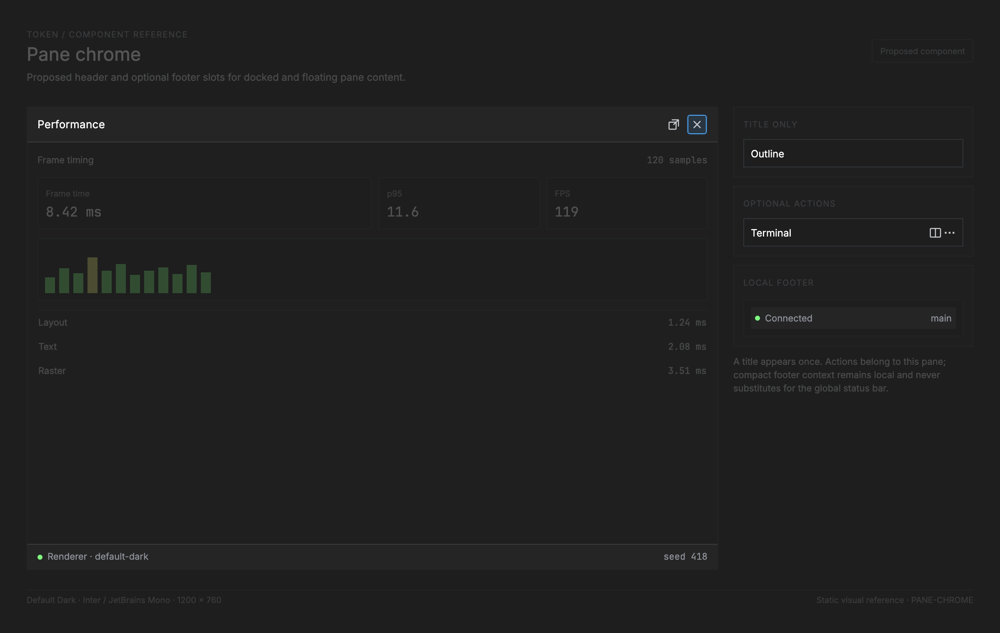

# Pane chrome — proposed header and footer slots

<!-- token-ui-mockup:begin PANE-CHROME -->
[](mockups/PANE-CHROME.html?view=emphasised)

*Visual target under review. [Normal PNG](mockups/renders/PANE-CHROME.png) · [Open normal mockup](mockups/PANE-CHROME.html?view=normal) · [Open emphasised mockup](mockups/PANE-CHROME.html?view=emphasised).*
<!-- token-ui-mockup:end PANE-CHROME -->

## Purpose and boundary

**Planned; no shared pane-chrome component exists.** Pane chrome is a small
composition contract for the fixed top and optional bottom bands of a pane:
the title describes its content; optional actions operate on that content; a
footer can show compact context at its two edges. It gives docked and floating
panel content the same structural affordances without turning every surface
into a toolbar or requiring a generic widget framework.

The performance prototype demonstrates one instance: a `Performance` header,
then synthetic-data context and a seed at opposite footer edges. The sentence
“Keep the document in view. Inspect rendering alongside it.” is **prototype
design copy**, not a proposed permanent editor-footer message. In real usage a
pane footer is for contextual, low-churn state such as a connected source,
filter scope or selected mode. A brief hint may appear while the corresponding
interaction is available; permanent tutorial copy belongs in an empty state,
documentation card, or onboarding. Global transient messages remain
the [Status bar](STATUS-BAR.md) / [Notification](NOTIFICATION.md) domain.

This document describes pane internals. [Dockable panel](DOCKABLE-PANEL.md)
owns placement, floating/docking lifecycle, resize and tab registration.
[Panel](PANEL.md) remains Token's name for persistent dock content.

The host decides how `PaneHeader` is assembled. A **docked** panel composes its
active tab's existing `DockTabBar` title at the leading edge with that active
panel's actions at the trailing edge; it does not paint a second `Performance`
title below the tab strip. A one-panel dock still paints its title once, in that
tab/header row. A **floating** panel uses the same `PaneHeader.title` directly
in its own header because it has no dock tab strip. `PaneFooter` is shared by
both hosts.

## Representation and ownership

Current Token has `Dock { position, panel_ids, active_index, is_open,
size_logical }` in [src/panel/dock.rs](../../src/panel/dock.rs). The layout
declares a `UiKey::DockHeader(position)` tab-strip header and
`UiKey::PanelContent(active)`; [src/view/panels.rs](../../src/view/panels.rs)
derives and paints panel scenes. That header is currently dock tabs, not a
general title/action pane header, and there is no current pane footer. The
proposed docked assembly keeps those tabs as the leading navigation; it adds
only active-panel actions to their trailing side.

The proposed presentation contract is intentionally narrow and feature-owned.
Its dependencies are deliberately small: `PaneInstanceId` distinguishes an
editor `GroupId` from a singleton `PanelId`; a future multi-instance panel
supplies its own stable instance ID before it can float. `type PointerId =
u64` denotes the runtime's one pointer-sequence identity. `IconId` is a
semantic, theme-independent glyph identity supplied by [Icon](ICON.md), not a
bitmap path. `FooterEmphasis` is a borrowed presentation role—`Quiet`,
`Normal`, or `Accent`—and never a mutable status store or severity policy.
`PaneFooterRun` is the deliberately limited custom-content dependency: a dot,
an optional icon, or text may be combined into one passive slot.

```rust
// proposed API — not implemented
struct PaneChrome<'a, ActionId> {
    pane: PaneInstanceId,                // durable owner identity, not DockPosition
    header: PaneHeader<'a, ActionId>,
    footer: Option<PaneFooter<'a>>,
}
struct PaneHeader<'a, ActionId> {
    title: &'a str,                      // required accessible pane name
    icon: Option<IconId>,                // optional decorative/recognition aid
    actions: &'a [PaneAction<'a, ActionId>],
}
struct PaneAction<'a, ActionId> {
    id: ActionId, label: &'a str, icon: Option<IconId>,
    enabled: bool, selected: bool,
}
struct PaneFooter<'a> {
    leading: Option<PaneFooterSlot<'a>>,
    trailing: Option<PaneFooterSlot<'a>>,
}
struct PaneFooterSlot<'a> {
    runs: &'a [PaneFooterRun<'a>], // paint in order; passive, borrowed content
}
enum PaneFooterRun<'a> {
    Dot { emphasis: FooterEmphasis },
    Icon { id: IconId, emphasis: FooterEmphasis },
    Text { text: &'a str, emphasis: FooterEmphasis },
}
enum FooterEmphasis { Quiet, Normal, Accent }
enum PaneInstanceId { EditorGroup(GroupId), Panel(PanelId) }
type PointerId = u64;          // runtime pointer-sequence identity
```

`PaneInstanceId`, title, action policy, and footer values belong to the panel
domain owner; `PaneChrome` borrows their display projection. Stable `ActionId`
is resolved by that owner after input, never inferred from an action index.
`UiState` owns transient hover, press/capture, and focus keyed by pane/action
identity; layout owns only derived rectangles and clips, and the renderer only
paints. The action IDs must be unique within a header. Footer slots are passive
in this first contract, so they have no capture or activation state.
`footer: None` reserves no height. An absent icon or run reserves no width.
A footer with neither slot, or with only empty runs, is normalized to `None`
by its owner. A state dot must accompany a text label; it is not a meaningful
footer by itself.

Simple semantic adapters make common consumers legible without hiding the slot
contract. A proposed `HintFooter { icon: Option<IconId>, text: &str }` produces
one leading slot containing the optional icon and hint text. A proposed
`StatusFooter { leading: PaneFooterSlot, trailing: Option<PaneFooterSlot> }`
accepts a dot plus a named state at the start and a sample count at the end.
These are projections, not values, timers, or a widget tree. Do not add
wrappers for every alignment combination, a universal
`ChromeWidget`, or a substitute [Toolbar](TOOLBAR.md).

## Geometry and interaction

The host gives pane chrome the pane border box in physical layout px. Header
and footer heights are token metrics derived from the scoped font. For a dock,
the header rectangle is the existing dock-tab bar; for a float, it is the
floating pane header. In either case the borrowed title is painted once by that
host. Proposed trial metrics are 22 logical px for the action height/minimum
width and 12 logical px total horizontal padding for labelled actions. At 2×
these produce `action_height = 44 px` and
`action_width = max(44, measured_content + 24)` physical px; icon-only actions
use the 44 px minimum. The header centres these controls vertically and omits
their hit targets if their full height cannot fit. The 74 px header in the
trace below is an example of proposed 37 logical-pixel chrome, not the current
dock-header default. The content rectangle is:

```text
header_rect  = [pane.x, pane.y, pane.width, H]
footer_rect  = [pane.x, pane.bottom-F, pane.width, F]       when footer exists
content_rect = [pane.x, pane.y+H, pane.width, pane.height-H-F]
```

with `F=0` when no footer. All edges are snapped through the common snapshot
rule, so the shared header/content and content/footer edges cannot leave a
physical-pixel gap. A separator may sit on the header bottom and footer top;
it does not enlarge either rect.

Header packing puts optional icon + title at the leading edge and actions at
the trailing edge. Measure/truncate the title within the space remaining after
the fit-sized action cells and gaps. If actions do not fit, reserve one 44 px
overflow action, then recompute title/action packing; its menu contains the
complete declared action order, exactly as [Dockable panel](DOCKABLE-PANEL.md)
requires. If even overflow cannot fit fully, omit action hit targets and keep
their named commands available through the host's command route. Never emit a
partly visible action as though it had a usable target. Hidden buttons have no
retained hit targets. Footer leading/trailing
runs each truncate inside their half after inter-slot gap; if their minimum
readable widths collide, the lower-priority slot is hidden by its **owner's
explicit policy**, rather than overlapping a status string.

Pointer down on an enabled action captures `(pointer, pane, action)`. Matching
release inside emits `PaneIntent::Activate { pane, action }`; release outside,
cancel, focus loss, pane close, re-dock replacement, or action removal clears
capture. Disabled actions paint disabled, cannot capture or activate. Tab can
enter header actions in their declared order; Left/Right roves enabled actions;
Enter/Space activates; focus exits with Tab. The title and passive footer have
no input state. Each action exposes its label to accessibility even when its
visible form is only an icon; selected state and disabled state are conveyed
without relying only on color.

**Normal trace.** A right dock pane `(x=1000,y=40,w=400,h=720)` in physical px
uses `H=74` and `F=58`. Its header is `[1000,40,400,74)`, footer is
`[1000,702,400,58)`, and content is `[1000,114,400,588)`. A 15 px icon, 10 px
gap, 82 px title, spacer, and two 44×44 px icon actions fit in the 400 px
header. The leading footer slot paints an accent dot plus `Synthetic data` from
x=1016; the trailing slot's `seed A17C` ends at x=1384.

**Pathological trace.** In a 120 px floating pane with two 44 px actions, the
header uses one 44 px overflow action instead; 16 px horizontal padding and a
10 px gap leave 50 px for `Performance`, which truncates to that measured width
and never paints beneath overflow. If pane height is below `H+F=132`, hide the
optional footer first (`F=0`) and clip the body to `max(0, pane.height-H)`.
Header and footer never overlap; the dockable-panel owner still enforces a
larger useful minimum before ordinary input routing.

### Theme and typography mapping

The footer inherits its host's panel surface and uses a quiet separator; it
does not borrow the global status bar's potentially bright fill. Docked surfaces
start from the existing sidebar/dock colors and tab-bar border/text roles.
Secondary footer text uses the resolved dim UI-text role, while `Normal` uses
the host's ordinary foreground. `Accent` is a themed emphasis with accompanying
text, not a hard-coded green success signal. New optional theme fields, if
needed, must fall back to those existing roles so all built-in themes keep
working. No prototype hex colors enter the native contract.

Measurement and paint use the same scoped font role. Existing dock-tab text
keeps its current Code role until the separate
[typography trial](../feature/editor-visual-polish.md) changes that measured
layout deliberately. Footer UI labels may use the configured UI face; numeric
details may use the Code face with explicit measured run advances. This is a
proposed composition, not evidence of an already-implemented font-role change.

## Integration, invalidation, and verification

The future path is `panel domain state → PaneChrome projection → host assembly
→ shared pane chrome layout → LayoutSnapshot keys → painter/hit-test →
PaneIntent → feature Msg → Update → Cmd`. It augments, rather than replaces,
the current `DockPaneScene` construction and `UiKey::DockHeader` /
`PanelContent` layout. A dock host composes `DockTabBar` title leading and
active-pane actions trailing; dock tabs remain its navigation and are not
converted into pane actions. A floating consumer paints the same title in its
own header and obtains shared footer geometry from its resolved pane rect.
[Dockable panel](DOCKABLE-PANEL.md) decides that rectangle and lifecycle.

Recalculate geometry on pane bounds, visible title/icon/actions/footer strings,
enabled/selected state, font/scale, padding/gap/metric changes, or dock/floating
mode. Theme color changes repaint roles; remeasure only when typography differs.
Packing is O(actions + footer items), normally tiny. Async data must retain the
pane instance and generation; a response for a closed or re-created floating
pane cannot update its title/footer or reactivate an old action.

| Setup | Action | Expected result |
| --- | --- | --- |
| right dock, title and two actions, footer enabled | solve at 400×720 physical px | header/content/footer rects share snapped edges; 44 px action boxes do not overlap title |
| 120 px width, same header | solve | title truncates; action identities/rects remain individually hit-testable |
| footer absent | solve | `F=0`; content ends at pane bottom; no phantom separator |
| capture action A, then close/re-dock pane | release | capture cleared; no `Activate(A)` reaches replacement pane |
| icon-only action | inspect semantic projection and keyboard focus | label, enabled/selected state, and focus order survive without a visible text glyph |

The native gallery may render headers, title truncation, action states, and
footer slots. Runtime tests are required for action capture, panel-instance
generation checks, and floating/docking transitions.

## Evidence

- [src/panel/dock.rs](../../src/panel/dock.rs) owns current dock placement and
  active tab state.
- [src/layout/chrome.rs](../../src/layout/chrome.rs),
  [src/layout/keys.rs](../../src/layout/keys.rs), and
  [src/view/panels.rs](../../src/view/panels.rs) show the current header/content
  split and its typed layout identity.
- The prototype's `dock-header` and `dock-footer` are visual exploration only;
  their live/pause/reload controls and header icon are intentionally outside
  the planned performance-panel scope.
