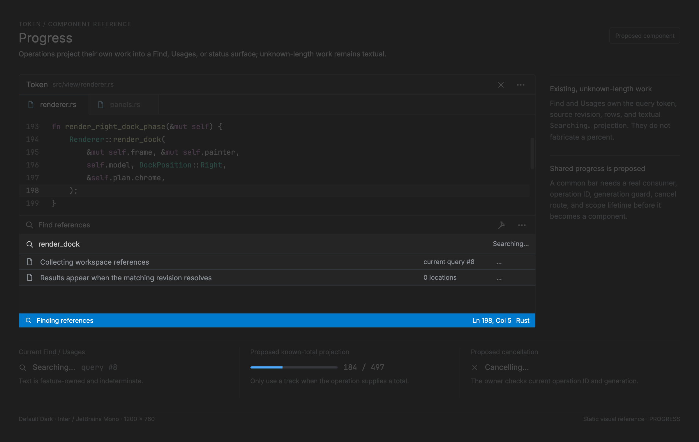

# Progress: feature-owned operation projections

<!-- token-ui-mockup:begin PROGRESS -->
[](mockups/PROGRESS.html?view=emphasised)

*Visual target under review. [Normal PNG](mockups/renders/PROGRESS.png) · [Open normal mockup](mockups/PROGRESS.html?view=normal) · [Open emphasised mockup](mockups/PROGRESS.html?view=emphasised).*
<!-- token-ui-mockup:end PROGRESS -->

Token has no reusable ProgressState, spinner, determinate bar, cancellation
widget, task queue, or progress gallery. It has feature-specific in-flight
state. Progress wording/status is a projection of those features, not authority
to run, cancel, or accept their I/O.

## Current representations and identity

| Operation         | Current owner/data                                               | Visible projection                       | Identity/stale guard                             |
| ----------------- | ---------------------------------------------------------------- | ---------------------------------------- | ------------------------------------------------ |
| file open/save    | UiState.is_loading/is_saving plus file-operation pending records | no common bar; status/transient paths    | file-operation state resolves exact pending work |
| LSP server        | Lsp server lifecycle mirror                                      | StatusBar LspServer text                 | server/request records own correlation           |
| inline completion | UiState.inline_in_flight plus completion request state           | “Inline” status segment while relevant   | completion/debounce/revision guards              |
| Find              | FindReplaceState and FindSearchRequest                           | FindStatus::Searching/result in find bar | Arc request matching in finish_search            |
| Usages            | UsagesPanelState.query                                           | Summary “Searching…” row/status          | Arc token + document ID/revision                 |
| work-done LSP     | LSP client receives progress notifications                       | no shared progress display               | client/server lifecycle only                     |

Current broad busy flags are:

```rust
// current excerpt — src/model/ui.rs
pub struct UiState {
    pub is_loading: bool, // derived from pending file opens/replacements
    pub is_saving: bool,  // derived from pending save-related work
    pub status_bar: StatusBar,
    // ...
}
pub fn is_busy(&self) -> bool { self.is_loading || self.is_saving }
```

They are booleans, not operation IDs, percent values, or cancellation handles.
They must not be used to accept an asynchronous result or to imply that every
operation in the app is blocked. update/mod.rs recomputes is_loading from
file-open pending collections; save flows similarly set/reconcile is_saving.
The renderer currently does not turn either into a generic indicator.

Usages supplies a concrete current async lifecycle. begin creates a fresh Arc
token, clears items/collapse/selection/scroll, records captured document ID and
revision in query, and sets status “Searching…”. resolve first compares pointer
identity to current token, then checks document revision before installing data;
reconcile clears query if source changed/closed. It does not reopen a dock on
late completion. This is the model to preserve, not to move into a progress UI.

## Current projection paths and no fake input machine

Progress-like visual states are passive feature projections except feature-local
Find/Usages controls. There is no shared pointer capture, keyboard focus,
Cancel message, timer, animation clock, screen-reader progress role, or layout
algorithm to document as implemented. StatusBar InlineSuggestion is text that
blinks with cursor visibility while request is in flight; it is not a spinner
with a percent. FindStatus and Usages status are owned by their local reducers.

```text
feature starts request → feature stores request identity + pending phase
                       → feature returns Cmd for runtime I/O
runtime result          → correlated Msg
                       → reducer verifies identity/revision/owner scope
                       → install result OR drop stale result
render                  → status/find/panel reads current snapshot
```

Cancellation is feature-specific. A panel usages request calls `begin` directly:
it replaces `query` with a new token and “Searching…” status without first
recording a cancellation message. The old completion then fails Arc-token
matching. `cancel_pending` is used on the popup references path, not before a
new panel begin. Closing/source changes also invalidate panel query. A display
component must not clear pending state just because it disappears, and a
progress view cannot make an uncancellable command cancellable.

## Proposed shared projection, only with a consumer

When a real operation needs common chrome, use a feature-owned OperationId and
a borrowed presentation record. The types below are proposed, not present:

```rust
struct OperationId(u64);              // allocated by owning feature, monotonic per owner
enum ProgressOwner { FileIo, LspServer, Inline, Find, Usages }
enum ProgressScope {
    Status, Panel(PanelId),
    EditorView { group: GroupId, document: DocumentId }, Modal(ModalId),
}
enum ProgressValue { Indeterminate, Fraction { completed: u64, total: u64 } }
enum ProgressPhase {
    Running, Cancelling, Succeeded, Failed { message: String }, Cancelled,
}
struct ProgressActionId(u64);
struct ProgressAction { label: String, id: ProgressActionId }
struct ProgressInputState { focused_cancel: Option<ProgressActionId>, cancel_pending: bool }
struct ProgressProjection<'a> {
    owner: ProgressOwner,             // feature identity, not display text
    operation: OperationId,
    scope: ProgressScope,
    label: &'a str,
    value: ProgressValue,
    phase: ProgressPhase,
    cancel: Option<ProgressAction>,
    input: Option<&'a ProgressInputState>,
    generation: u64,                  // owner generation for delayed ticks/results
}
enum ProgressMsg {
    Cancel { owner: ProgressOwner, operation: OperationId, generation: u64 },
}
enum Msg { /* existing variants */, Progress(ProgressMsg) } // proposed wrapper
enum ProgressEffect {
    Redraw,
    CancelOperation { owner: ProgressOwner, operation: OperationId, generation: u64 },
}
```

EditorView scope identifies group and document so a split view has unambiguous
placement. Durable source state remains in the feature. Projection has no I/O, no task
queue, and no independent completion transition. Fraction units are work items
or bytes only when label/owner specifies which; completed and total are raw
monotonic integer work units, with total > 0. Percent is derived for paint:
ratio = min(completed,total) / total as f32. Do not store rounded percent and
then derive progress from it.

| Proposed event                | Guard                                                                                | Owner reduction/effect                                                                                                                                     |
| ----------------------------- | ------------------------------------------------------------------------------------ | ---------------------------------------------------------------------------------------------------------------------------------------------------------- |
| start                         | allocate current OperationId/generation                                              | install Running projection and issue feature command                                                                                                       |
| tick/result                   | owner, ID, generation, source revision all match                                     | update value/phase; stale reply is no-op                                                                                                                   |
| cancel                        | hit/focus target is current cancel rect; projection Running and not `cancel_pending` | dispatch wrapper `Msg::Progress(ProgressMsg::Cancel)`; `update_progress` verifies ID/generation, sets Cancelling/cancel_pending, returns `CancelOperation` |
| cancel acknowledgement/result | still same operation                                                                 | terminal phase once; remove/replace projection by feature policy                                                                                           |
| scope closes                  | target identity disappears                                                           | remove presentation; feature either continues or cancels according to its own contract                                                                     |

A future renderer derives cancel rect from the same progress layout used by hit
testing; runtime maps Tab focus and Enter/pointer release to
`Msg::Progress(ProgressMsg::Cancel)`. `update_progress` returns
`ProgressEffect::CancelOperation`, and runtime routes it to the named feature's
cancellation command. Disabled appearance follows `cancel_pending`; focus is
cleared when cancel action/projection disappears. No generic Msg is stored in
the projection. A cancel result for A must never alter operation B: ID and generation are both
checked. Cancelling disables/removes cancel affordance immediately but never
claims work stopped until the feature receives its own acknowledgement/result.
A nonmonotonic tick needs an explicit policy; recommended is reject values below
last completed for same generation, while allowing a new generation to restart.

## Proposed geometry and traces

A determinate local bar consumes content rect R=(x,y,w,h), horizontal inset p,
and measured label/action rows. Track width T=max(0,w-2p). For valid total:
fill=round_half_up(T × min(completed,total)/total); for Indeterminate,
track exists but phase/time-derived moving segment needs a dedicated animation
clock and invalidation. Current Token has no such clock, so it must not paint
an invented moving bar.

Normal trace: R width 320, p=12, completed=37,total=100 yields T=296 and
fill=round(109.52)=110 px. Pathological: R width 18,p=12 yields T=0; render
label with truncation or omit track, never a negative fill. completed=130,total
100 yields clamped fill 296; total=0 is invalid Fraction and must normalize to
Indeterminate or failure before layout.

A status projection must participate in the status bar’s actual narrow-width
policy (which is currently absent), not reserve a hidden fixed-width strip. A
modal scope is only appropriate when a specific owning workflow already blocks
interaction; background file/LSP activity must not become modal merely to show
a spinner.

## Invalidation, cost, and verification

Current cost/invalidation is feature-local: file pending collections change
is_loading; status synchronization changes Inline/LSP text; Find/Usages state
changes redraw their surfaces. No common cache or animation invalidation exists.
Proposed determinate geometry invalidates on operation phase/value/label/action,
scope identity/rect, font/theme/scale and width. Text measurement plus each
visible projection is O(visible progress widgets); an indeterminate animation
would additionally schedule only while visible/running.

| Initial state                                 | Action                         | Expected output                                                              |
| --------------------------------------------- | ------------------------------ | ---------------------------------------------------------------------------- |
| no pending usages                             | start references panel request | new token, empty items, selected None, scroll 0, query set, status Searching |
| query A pending then query B begins           | A completion                   | Arc identity mismatch; no rows/status replacement from A                     |
| query current but source revision changed     | reconcile/late completion      | query cleared or result status source-changed; no stale items                |
| proposed R width 320,p=12,37/100              | layout                         | track 296, fill 110 px                                                       |
| proposed R width 18,p=12                      | layout                         | track/fill 0, no negative rectangle                                          |
| proposed operation A cancelling then B starts | A cancel ack                   | A guard fails against B; B remains Running                                   |

Existing tests include file-open/file-I/O flags, modal find async cases, usages,
and inline completion stale-reply cases. A first shared implementation also
needs determinate, indeterminate, cancellation race, failure, narrow clipped
panel, status overflow, scale/theme, and accessibility announcement tests.

## Evidence

- [UI busy fields](../../src/model/ui.rs), [derived loading reconciliation](../../src/update/mod.rs), [file tests](../../tests/file_open.rs)
- [status synchronization](../../src/model/status_bar.rs), [Usages model](../../src/model/usages.rs) and [reducer](../../src/update/usages.rs)
- [Find async tests](../../tests/modal/find_async.rs), [inline stale-result test area](../../src/update/inline.rs)
