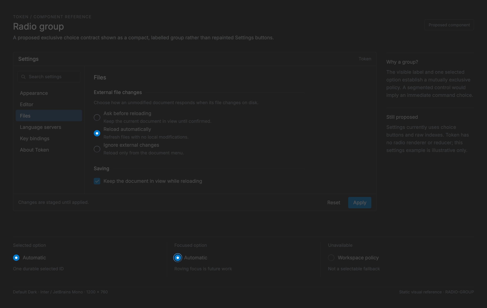

# Radio group

<!-- token-ui-mockup:begin RADIO-GROUP -->
[](mockups/RADIO-GROUP.html?view=emphasised)

*Visual target under review. [Normal PNG](mockups/renders/RADIO-GROUP.png) · [Open normal mockup](mockups/RADIO-GROUP.html?view=normal) · [Open emphasised mockup](mockups/RADIO-GROUP.html?view=emphasised).*
<!-- token-ui-mockup:end RADIO-GROUP -->

## Current status

Token has no radio-circle painter, radio-group model, radio messages, or radio
keyboard/accessibility contract. Do not rebrand the existing Settings choice
buttons or the FormChoice select dropdown as radios. The nearest visual overlap
is:

| Existing item                 | Current fact                              | Missing radio property                                    |
| ----------------------------- | ----------------------------------------- | --------------------------------------------------------- |
| SegmentedControl              | equal-width selected buttons              | IDs, group label, roving focus, input reducer, radio mark |
| Settings FormChoice           | labels plus active raw index; select      | radio layout/role and group semantics                     |
| choice_group_rects            | shared Preset-row/gallery button geometry | state and event ownership                                 |
| choice-group.selected fixture | static selected button sample             | interaction coverage                                      |

This document is therefore both an accurate exclusion and a design contract for
a future implementation.

## Existing related data and geometry

Settings owns FormChoice:

```rust
pub(crate) struct FormChoice {
    pub label: &'static str,           // field/group label
    pub help: &'static str,            // static description
    pub labels: &'static [&'static str], // option display strings
    pub active: usize,                 // durable draft raw index
}
```

The raw active index is valid only relative to its static label slice. The
form/update owner validates selection before writing it
([update/settings.rs:151](../../src/update/settings.rs#L151)); no radio renderer
borrows it today. FormChoice rows themselves now render as a compact select
dropdown (`ChoicePresentation::Select`, [settings.rs:139](../../src/settings.rs#L139);
open_select/select_cursor in [settings/forms.rs:254](../../src/settings/forms.rs#L254),
reducer in [update/settings.rs:286](../../src/update/settings.rs#L286)). Preset
rows with Choice/Picker controls and the gallery fixture instead derive button
rectangles from choice_group_rects in
[controls.rs:119](../../src/view/controls.rs#L119).

Given row physical rectangle and scale, control is row itself with h=32*scale on
wide rows; narrow rows use x=row.x, y=row.y+26*scale, w=row.w, h=22*scale.
Each estimated choice width is round((Unicode scalar count*7+16)*scale).
gap is round(CHIP_GAP*scale), currently 4 logical px. If total width fits
budget (row.w below 400*scale uses row.w; otherwise two thirds of row.w),
buttons are right-aligned inside control and vertically centered. If it does
not fit, placement starts at row.x and y=row.y+(26 or 50)*scale, each height
22*scale, wrapping before a button exceeds row.x+row.w.

Worked geometry: scale 1, row=(0,0,600,56), labels Automatic/On/Off:
estimated widths 79,30,37; total=79+4+30+4+37=154; budget=400; control
(0,0,600,32); x starts 446 and y=5. Rectangles are (446,5,79,22),
(529,5,30,22), (563,5,37,22). At row width 200, budget=200 and control
(0,26,200,22); a larger total wraps at x=0, y=26 then y+=26. The helper returns
the same rectangles to Preset-row painting and hit testing, which is its only
current interaction guarantee.

## Current state × event behaviour

There is no radio state machine.

| Event                                       | Current related behaviour                          |
| ------------------------------------------- | -------------------------------------------------- |
| pointer on a Settings FormChoice row        | ToggleSelect opens the dropdown; an option hit emits OverlayHit::Choice { row, choice } |
| pointer on a fitting Preset choice button   | emits OverlayHit::Choice { row, choice }           |
| reducer receives valid FormChoice index     | writes active, marks draft changed, refreshes rows |
| invalid option index                        | reducer returns None; active is preserved          |
| label collection changes                    | no ID-based repair; owner must rebuild/validate    |
| arrows/Home/End/Space/Enter/Tab             | no radio-specific handling                         |
| press/release/cancel/focus loss             | no radio capture or visual state                   |
| disabled/read-only/empty group              | no radio representation                            |
| gallery fixture                             | paints selected standard button only               |

In particular, an existing button click is a semantic choice action delivered
by overlay hit testing, not evidence of release-on-same-target behavior.

## Proposed radio group (not current API)

Use this only when all mutually exclusive choices need to remain visible and
a segmented surface would imply command-like immediacy. It is unsuitable for a
binary independent setting; use a checkbox. It has a required visible group
name and stable option identity:

```rust
// Proposed API — not implemented.
struct RadioOption<Id> {
    id: Id, label: String, help: Option<String>, enabled: bool,
}
struct RadioGroupModel<Id> {
    group_id: Id,
    label: String,
    description: Option<String>,
    selected: Option<Id>,  // durable owner value
    focused: Option<Id>,   // transient roving focus
    pressed: Option<(u64, Id)>,
    disabled: bool,
    read_only: bool,
    invalid: Option<String>,
}
enum RadioMsg<Id> { Select { group: Id, option: Id }, CancelPress }
```

The owner persists selected and performs effects. The control derives label,
option indicator, option-label, and combined hit rectangles once, in physical
pixels, and uses the same plan for paint and input. The group must reject
duplicate IDs; empty options have no focusable radio and need explanatory
empty-state text.

**Proposed layout algorithm.** Dependencies are a UI-font measurement function
measure_ui(label, font_size), px(n)=max(1,round(n*scale)), and a parent-provided
physical WidgetRect bounds. Each option is one vertical row; this deliberately
avoids reusing Settings' approximate chip widths for radio labels.

```rust
// Proposed API support — not present in Token.
struct RadioOptionLayout<Id> {
    id: Id, indicator: WidgetRect, label: WidgetRect, measured_label_w: usize,
    hit: WidgetRect,
}
struct RadioGroupLayout<Id> {
    group_label: WidgetRect, options: Vec<RadioOptionLayout<Id>>, clip: WidgetRect,
}
impl<Id> RadioGroupLayout<Id> {
    fn option_at(&self, x: usize, y: usize) -> Option<&Id> {
        let contains = |r: WidgetRect| x >= r.x && x < r.x.saturating_add(r.w)
            && y >= r.y && y < r.y.saturating_add(r.h);
        contains(self.clip).then_some(())?;
        self.options.iter().find(|option| contains(option.hit)).map(|option| &option.id)
    }
}

fn radio_layout<Id: Clone>(bounds: WidgetRect, label_h: usize,
    options: &[RadioOption<Id>], scale: f64,
    measure_ui: impl Fn(&str, f32) -> usize) -> RadioGroupLayout<Id> {
    let pad = px(8.0, scale); let d = px(14.0, scale); let gap = px(8.0, scale);
    let row_h = d.max(label_h).saturating_add(px(6.0, scale));
    let right = bounds.x.saturating_add(bounds.w);
    let bottom = bounds.y.saturating_add(bounds.h);
    let mut y = bounds.y + label_h.min(bounds.h) + pad;
    let mut rows = Vec::new();
    for option in options {
        if y >= bottom { break; } // parent may paginate remaining IDs
        let h = row_h.min(bottom - y);
        let indicator = WidgetRect { x: bounds.x + pad,
            y: y + h.saturating_sub(d)/2, w: d, h: d };
        let label_x = indicator.x + d + gap;
        let label = WidgetRect { x: label_x, y, h,
            w: right.saturating_sub(label_x) };
        let measured_label_w = measure_ui(&option.label, 12.0 * scale as f32).min(label.w);
        rows.push(RadioOptionLayout { id: option.id.clone(), indicator, label, measured_label_w,
            hit: WidgetRect { x: bounds.x, y, w: bounds.w, h } });
        y += h;
    }
    RadioGroupLayout { group_label: WidgetRect { x: bounds.x, y: bounds.y,
        w: bounds.w, h: label_h.min(bounds.h) }, options: rows, clip: bounds }
}
```

The renderer clips group-label, indicator and label paint to clip; hit testing
uses only returned hit rectangles. At bounds=(100,50,220,70), scale=1,
label_h=16, d=14, pad=8, gap=8, row_h=22: the first row starts y=74, its
indicator is (108,78,14,14), label=(130,74,190,22), and hit=(100,74,220,22).
The next two rows start 96 and 118; the third clips to h=2. measured_label_w is
the UI-font measurement capped at label.w; renderer truncation uses label.w and
clips to label, never the fixed 7-px character estimator. A real consumer
should paginate/scroll before that pathological last row rather than exposing a
partially usable radio. Indicator rendering is derived from selected: draw an
outer d-by-d circle/border; if selected, draw an inner dot with diameter
max(1,d/2), centered by saturating subtraction. No current Token painter does
this. Before painting a roving-focused ID, the parent must paginate/scroll so
its returned option layout contains that ID; focus traversal never hit-tests or
paints a rectangle reconstructed from an off-screen index.

Repair after a replacement is ID based: retain selected/focused only if their
enabled IDs still exist. If selected disappears, the owner chooses an explicit
fallback or None according to domain validity; it must not silently select the
new option at the old raw index. Remove focused/captured IDs immediately and
choose next enabled focus target or leave group focus.

| Proposed event                            | Preconditions                      | State/result                                                                                     |
| ----------------------------------------- | ---------------------------------- | ------------------------------------------------------------------------------------------------ |
| press option                              | group and option enabled, writable | capture pointer/id; pressed style                                                                |
| release same option                       | capture valid                      | clear capture, focus option, emit Select once                                                    |
| release outside/other, cancel, focus loss | capture                            | clear capture; no Select                                                                         |
| Arrow keys                                | group focus                        | move roving focus to next/previous enabled option, wrapping; emit Select for that ID immediately |
| Home/End                                  | group focus                        | focus and emit Select for first/last enabled option                                              |
| Space/Enter                               | focused enabled option             | emit Select; retain focus                                                                        |
| Tab/Shift+Tab                             | enabled group                      | enter/leave group once                                                                           |
| disabled                                  | any action                         | skipped/inert                                                                                    |
| read-only                                 | activation                         | focus/report selected allowed; never Select                                                      |

This proposed contract chooses immediate arrow/Home/End commit, matching normal
radio behaviour. A consumer for expensive effects must use a different,
explicitly named preview control; it must not silently weaken this reducer.

The complete proposed roving reducer is: compute enabled_ids in visual order;
on focus entry use selected if enabled else first enabled; ArrowRight/Down uses
(position+1) modulo enabled_ids.len(), ArrowLeft/Up uses
(position-1).rem_euclid(len), Home index 0, End len-1. Assign focused=id and
emit Select(group,id) for each of those moves. Space/Enter emit Select for the
already focused enabled ID. If enabled_ids is empty, clear focused and emit
nothing. Replacement runs the ID repair described above before any next event,
so a removed focused ID is never looked up by a stale position.

## Invalidation, integration, verification

Current choice-group layout is O(option count) and allocates a rectangle Vec;
button paint is O(option count) plus label glyph work. Invalidate it when row
bounds, labels/order, scale, font/width estimator, theme, selected/focused/
pressed/disabled state, or parent clipping changes. The 7-px-per-character
estimate is not painter measurement, so unusually wide glyphs can clip inside
the button; this is current geometry, not a radio sizing recommendation.

A proposed consumer assembly is:

```rust
// Proposed integration: current Token has no RadioGroup type.
// options: &[RadioOption<Id>] is supplied separately by the feature owner; Id: Clone.
let layout = radio_layout(bounds, group_label_h, options, scale,
    |label, size| painter.measure_sized(label, size, 0.0).round() as usize);
radio_group_render(frame, &layout, &model, theme);
if let Some(id) = layout.option_at(pointer.x, pointer.y).cloned() {
    let group = model.group_id.clone();
    update(model, RadioMsg::Select { group, option: id });
}
```

RadioGroupLayout::option_at is the sole input API: it checks clip first, then
returns the ID of the first option whose half-open hit rectangle contains the
physical pointer. It returns None for clipped/empty gaps; it never independently
estimates text width. Async option providers require an owner generation/session check,
as Settings forms already do with session identity.

| Initial condition                                 | Action                      | Expected                                         |
| ------------------------------------------------- | --------------------------- | ------------------------------------------------ |
| current row=(0,0,600,56), labels Automatic/On/Off | derive at 1x                | rects (446,5,79,22),(529,5,30,22),(563,5,37,22)  |
| current invalid FormChoice index                  | Choice(index=len)           | no active mutation                               |
| current long labels, narrow row                   | derive                      | wrap rectangles stay within row x range          |
| proposed selected B                               | replace A/C                 | explicit fallback/None, not old index 1          |
| proposed captured A                               | release B/cancel/focus loss | no Select, capture clears                        |
| proposed disabled option B                        | arrows/Home/End             | B skipped                                        |
| proposed empty group                              | Tab/click                   | no option focus/select; explanatory empty output |

Role radiogroup, group accessible name/description, radio checked/disabled
state, and error association are proposed bridge requirements.
