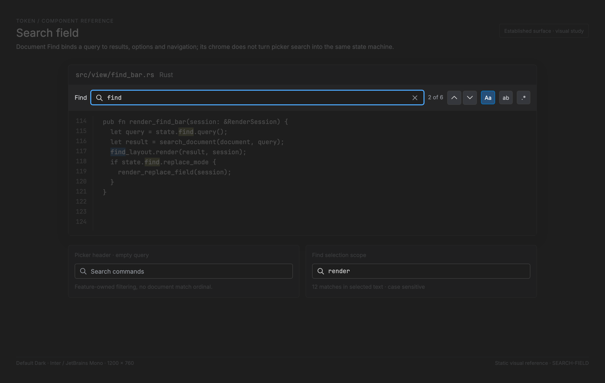

# Search field — implementation reference

<!-- token-ui-mockup:begin SEARCH-FIELD -->
[](mockups/SEARCH-FIELD.html?view=emphasised)

*Visual target under review. [Normal PNG](mockups/renders/SEARCH-FIELD.png) · [Open normal mockup](mockups/SEARCH-FIELD.html?view=normal) · [Open emphasised mockup](mockups/SEARCH-FIELD.html?view=emphasised).*
<!-- token-ui-mockup:end SEARCH-FIELD -->

A search field is not just a text field with a magnifier: its query changes
derived results, status, navigation and possibly asynchronous work. Token has
two search-like compositions—docked document Find/Replace and overlay headers
for pickers—but only the former has this complete state machine. This chapter
documents Find/Replace. Overlay headers remain feature-owned presentation and
must not be represented as an unimplemented universal SearchField.

## Model, identity, and derived results

**Current excerpt** — [model/ui.rs](../../src/model/ui.rs#L341):

```rust
pub struct FindReplaceState {
    pub(crate) document_id: Option<DocumentId>,
    pub query_editable: EditableState<StringBuffer>,
    pub replace_editable: EditableState<StringBuffer>,
    pub focused_field: FindReplaceField,
    pub replace_mode: bool,
    pub case_sensitive: bool,
    pub whole_word: bool,
    pub use_regex: bool,
    pub selection_only: bool,
    pub scope: Option<(usize, usize)>,
    search_cache: RefCell<Option<Arc<FindResults>>>,
    pending_search: Option<Arc<FindSearchRequest>>,
    search_failure: Option<(Arc<FindSearchRequest>, String)>,
}
```

The two EditableState values are durable session draft text with independent
cursors, selection and undo. document_id binds scope ownership to a document
rather than “whatever tab happens to be current.” replace_mode determines
whether a second visual field exists; focused_field chooses the keyboard target.
The three search flags are semantic inputs. scope is a character-offset range
captured only from a nonempty selection when selection-only is enabled. Asking
for selection-only with an empty selection clears scope and sets
selection_only=false; None means the whole document. Find never represents a
deliberately empty searchable scope.

Cache, pending request, and failure are derived/transient. They never decide
what the query means: FindSearchRequest stores immutable snapshot identity.

```rust
pub struct FindSearchRequest {
    document_id: Option<DocumentId>,
    revision: u64,
    buffer: ropey::Rope,
    pattern: String,
    options: (bool, bool, bool),
    scope: Option<(usize, usize)>,
}
```

Request construction clones the rope snapshot and query, then copies options
and captured scope. Its matches method requires same document ID, revision,
rope instance, pattern, flags and scope. The Arc allocation is additionally
used as pending ownership. A reply is accepted only when it is the exact
pending Arc, snapshot still matches current state/document, and successful
FindResults.source is that same Arc. These three checks reject stale query
edits, document edits, same-revision buffer replacement, close/reopen, and a
worker returning results computed from another request.

**Current excerpt** — [model/ui.rs](../../src/model/ui.rs#L456):

```rust
pub struct FindResults {
    pub(crate) matches: Arc<[crate::search::Match]>,
    source: Arc<FindSearchRequest>,
    lines: OnceLock<Vec<usize>>,
    error: Option<String>,
}
```

matches is immutable shared output; source owns the exact snapshot that
produced its offsets; lines lazily owns the scrollbar overview projection; and
error distinguishes an invalid compiled query from an empty valid result.
Navigation, status, decorations and replace all consume the same result/source
semantics. That single source prevents
“highlight says 3 while Find Next navigates a different 3” drift.

## Input and update path

```text
Cmd/Ctrl+F or UiMsg::OpenFind
  -> update::ui::open_find binds focused text document, restores last query,
     selects query text, focuses FindBar, reserves editor inset
runtime key/text -> handle_find_key -> ModalMsg text edit or find action
runtime pointer -> FindBarLayout/column_at -> UiMsg::FindFieldPointer
update -> FindReplaceState + Cmd::Redraw; post-update may schedule RunFindSearch
runtime FindWorker -> UiMsg::FindSearchCompleted -> guarded finish_search
render -> FindBarLayout and cached/current result status; never starts a scan
```

Open Find is rejected when focused content is not plain text. Closing takes the
state into last_find_replace, clears selection drag, returns focus to editor
when Find owned it, and resynchronizes viewport height. Opening on another
document preserves query/replacement but bind_find_document clears selection
scope and pending work. A modal blocks Find pointer input. This is critical:
a click on an obscured docked rectangle cannot move a hidden Find cursor.

| Event                   | Preconditions                   | State transition/effect                                               |
| ----------------------- | ------------------------------- | --------------------------------------------------------------------- |
| Open Find replace=false | plain text pane                 | create/restore state, query focus, reserve inset                      |
| Open Find replace=true  | plain text pane                 | same, replace_mode=true                                               |
| close/Escape            | bar open                        | save last state, clear drag, focus editor, release inset              |
| toggle replace          | state exists                    | toggle mode, focus Query, clear drag, resync viewport                 |
| field focus             | Replace only if mode open       | focused_field update, FocusTarget::FindBar, reset blink               |
| pointer                 | no modal and inset exists       | set/clamp column; double word-select, triple all-select; capture drag |
| pointer release         | any drag                        | clear find_selection_drag                                             |
| Tab                     | replace mode                    | toggle query/replace; otherwise focus editor                          |
| Enter                   | query or find-only              | FindNext; Shift gives previous                                        |
| Enter                   | focused Replace in replace mode | ReplaceAndFindNext                                                    |
| Cmd/Ctrl+Enter          | replace mode                    | ReplaceAll                                                            |
| option toggle           | state exists                    | flag changes; derived result invalidated by request match test        |

The runtime recognizes option shortcuts on physical keys when primary+Alt is
held. That matters on macOS: Option changes logical character text, so mapping
only logical keys would make case/word/regex/scope shortcuts unreliable.

IME text commits follow the same editable dispatch as ordinary typed text. Find
currently has no preedit/candidate state; a future implementation must render
preedit without forming a search request until commit, then invalidate exactly
once. Closing, document rebinding, and focus changes must cancel composition.

## Search algorithm and asynchronous policy

For a current request:

```text
compile SearchQuery(pattern, case_sensitive, whole_word, regex)
if compile failed: matches = []
else: find_all(snapshot rope converted to text)
if scope exists: retain match where scope.start <= match.start
                         and match.end <= scope.end
return FindResults { matches, source=request, lazy_lines, error }
```

Small documents compute synchronously on read. A request needs background work
only when query is nonempty and document buffer size is at least 256 KiB. This
is a byte threshold, not a latency guarantee. display_results never launches
work or falls back to a cold large scan: it returns cached results or
Searching. schedule_find_search runs after updates, creates no duplicate request
when pending/failure already matches, and emits Cmd::RunFindSearch.

Worked normal trace: buffer “foo bar foo”, query “foo”, all options false.
Search gives character matches [0,3) and [8,11); status is “2 matches” until
selection equals one match, where it becomes “1 of 2” or “2 of 2”. Toggling
whole_word changes request options and demands a new result even though query
text did not change.

Pathological trace: a 280 KiB “foo ” repeated buffer schedules request A.
User changes query to “bar”, scheduling B. A completes first. Its request
does not match current pattern and is discarded; status remains Searching.
If worker B fails, matching failure becomes Unavailable and prevents rescheduling
on every cursor blink. Editing query/document/options/scope makes that failure
nonmatching and permits one fresh request. A response after close/reopen fails
the exact pending-Arc test too.

Regex “[” with regex enabled has a completed FindResults carrying error, not
Searching and not “no matches”; status extracts a concise invalid-regex reason.
Explicit Find Next/ReplaceAll obtains fresh results synchronously when it needs
correctness, so it does not act on old display results while a large request is
pending.

## Find-bar geometry and hit agreement

The bar docks at the **top** of the editor content, directly below the tab
strip, not at the pane's bottom edge: `GroupLayout::from_rect`
([view/geometry.rs](../../src/view/geometry.rs#L410)) places `find_bar_rect.y`
at `group_rect.y + tab_bar_height`, then starts `content_rect` at the find
bar's bottom edge. Opening Find therefore pushes the document down by the
bar's height; it never overlays or sits beneath the visible text.

FindBarLayout is the source of truth for draw, hit, field options, and pointer
column conversion. It derives from focused GroupLayout and ScaleMetrics:

```text
row_h = line_height + 2 * padding_small
narrow = width < max(640*scale, line_height*28)
rows = (1 + narrow) * (1 + replace_mode)
bar_h = rows*row_h + (rows-1)*padding_small
        + 2*padding_medium + border_width
```

Wide layout puts expand, query, option/status/navigation controls and close on
one row. Narrow layout gives controls a separate row before shrinking query to
nothing; replace adds a query/replacement action row. The bar rect is reserved
from editor content by GroupLayout, therefore the editor viewport, cursor
mapping, scrollbar and hit tests agree rather than merely being overpainted.

For line height 18, padding_small 4, padding_medium 8, border 1:
row_h=26. A narrow Find-only bar has rows=2 and height
2*26 + 1*4 + 16 + 1 = 73 px. A narrow Replace bar has rows=4 and height
4*26 + 3*4 + 16 + 1 = 133 px. Closing returns that exact extent to editor
viewport through resync_viewports.

Field text uses TextFieldOptions::for_modal over its layout field rectangle.
column_at calculates round((x-options.x)/char_width) as signed and adds
scroll_x with saturating signed addition; a drag left of field maps to its
first visible column rather than wrapping to usize maximum. FindBarLayout::hit
uses half-open rectangles: left/top inclusive, right/bottom exclusive. Pointer
and paint therefore agree at adjacent control boundaries.

Clip order is bar rect, then individual field/status/button rect. Placeholder
“Find” or “Replace” is only painted for empty _unfocused_ input. Focused empty
fields show caret, not a placeholder under it. Text remains Code font; chrome,
status and buttons use UI font/appropriate button painter.

## Invalidation and costs

Layout invalidates on focused group rect, window scale/metrics, line height,
Find mode, and available text-tab state. Result identity invalidates on document
ID/revision/rope instance, query content, options or scope. Selection changes
do not invalidate match list, but do invalidate the current ordinal in status.
Lazy overview lines invalidate with the source result; they are computed once
only if scrollbar projection requests them.

Small search costs compilation plus a full string search when cold. Large
search copies the rope snapshot into request ownership and searches off-thread;
rendering consumes cached Arc results. Match scope filtering is linear in found
matches. Overview-line projection walks matches and rope chunks lazily, avoiding
rescanning a chunk prefix for nearby matches. These are algorithmic properties,
not claimed timings.

## Proposed extraction boundary (not implemented)

Do not merge Find and picker search state machines. If shared chrome becomes
justified, extract only typed input/presentation:

```rust
// Proposed only; FieldId/TextOperation are defined in TEXT-FIELD.md.
use crate::ui::text_field::{FieldId, TextOperation};

enum SearchIntent {
    Edit { field: FieldId, operation: TextOperation },
    Focus { field: FieldId, select_all: bool },
    Clear { field: FieldId },
    Accessory { field: FieldId, id: &'static str },
    Submit { field: FieldId },
    Cancel { field: FieldId },
}
struct SearchFieldView<'a> {
    id: FieldId,
    query: &'a EditableState<StringBuffer>,
    placeholder: &'a str,
    scope_hint: Option<&'a str>,
    focused: bool,
    status: Option<&'a str>,
}
```

The Find owner retains SearchQuery, request snapshot, status and commands; a
picker owner retains scoring/list activation. A Clear affordance must reset only
owner-defined query result state, not close the bar or alter replacement text.
Future semantics expose searchbox name/value, result status, and named/pressed
option controls. Token has no accessibility tree today.

## Verification vectors

Existing interaction coverage: [find_bar.rs](../../tests/find_bar.rs); async
ownership/failure coverage: [find_async.rs](../../tests/modal/find_async.rs).

| Setup                           | Action                          | Expected                               |
| ------------------------------- | ------------------------------- | -------------------------------------- |
| “foo bar foo”                   | query foo                       | two matches and no document mutation   |
| selection [0,3), selection-only | change tab                      | scope clears on different document     |
| Find-only                       | Tab                             | focus editor, bar stays                |
| Replace mode, focused Replace   | Enter                           | ReplaceAndFindNext                     |
| modal open over Find            | Find field pointer              | ignored                                |
| field x boundary                | hit adjacent control right edge | next rect or no hit, never both        |
| width threshold narrow          | layout Find-only                | two control rows, positive query width |
| 280 KiB query A then query B    | complete A                      | status still Searching for B           |
| matching worker failure         | cursor blinks                   | no retry storm                         |
| regex “["                       | completed result                | Invalid regex, not No matches          |
| special/binary tab              | OpenFind                        | no Find layout/inset/search            |

Repeat layout/hit checks at 1×, 1.25×, 2× and widths 220, 400, 1000 as the
existing suite does. Future IME tests must distinguish preedit from committed
query and prove close/rebind rejects late commit.

## Sources

- [Find state, request validation, status](../../src/model/ui.rs)
- [UI transitions and scheduling](../../src/update/ui.rs)
- [Find layout and paint](../../src/view/find_bar.rs)
- [Input routing](../../src/runtime/input.rs), [worker](../../src/runtime/find_worker.rs)
- [Shared text projection](TEXT-FIELD.md)
