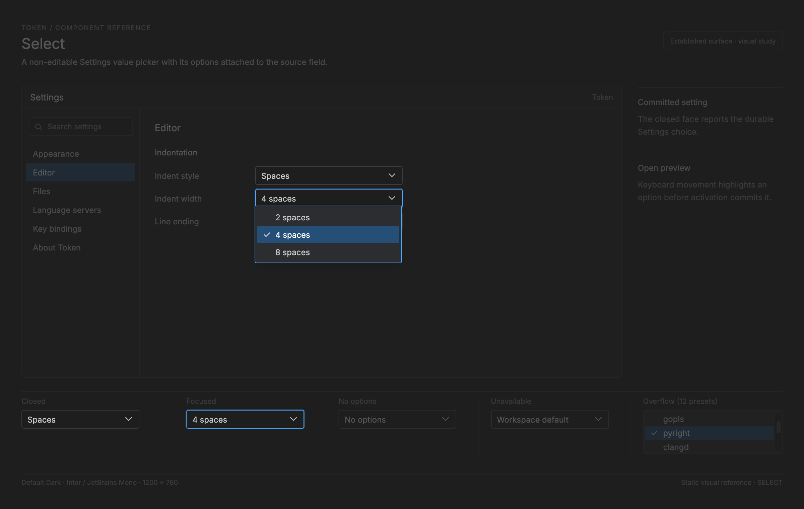

# Select

<!-- token-ui-mockup:begin SELECT -->
[](mockups/SELECT.html?view=emphasised)

*Visual target under review. [Normal PNG](mockups/renders/SELECT.png) · [Open normal mockup](mockups/SELECT.html?view=normal) · [Open emphasised mockup](mockups/SELECT.html?view=emphasised).*
<!-- token-ui-mockup:end SELECT -->

## Current boundary

Token's select is a non-editable, single-value popup button, not a general
component framework. There are two independent implementations:

| Consumer                        | Durable selection owner            | Transient popup owner                      | View                  |
| ------------------------------- | ---------------------------------- | ------------------------------------------ | --------------------- |
| Component Gallery theme control | GalleryState.selected_theme        | GalleryState.theme_select                  | view/select.rs Select |
| Settings collection form choice | SettingsForm.choices[index].active | SettingsForm.open_select and select_cursor | view/settings_page.rs |

The shared anchor painter, render_select in [controls.rs:47](../../src/view/controls.rs#L47),
receives a physical rectangle, label, open flag, scale, theme, and painters. It
does not own labels, validate selection, hit-test, capture a pointer, mutate a
value, or paint a popup. The gallery Select view is the only reusable select
view type currently. Settings intentionally uses a modal-specific option layout.

The real flow is Message -> Update -> Command -> Render:

```
gallery pointer/key -> Gallery state/update -> Cmd::Redraw
                  -> GalleryRenderer -> Select anchor -> popup painted last

Settings hit test -> SettingsCollectionAction or ModalMsg
                  -> update/settings or update/ui -> Cmd::Redraw/effect
                  -> settings-page layout and paint
```

A Settings record choice can lead to configuration, LSP, or provider work. The
select painter is never authorized to perform that effect.

## Current representation, units, and ownership

### Gallery state

**Current excerpt** — [model/select.rs:3](../../src/model/select.rs#L3).

```rust
#[derive(Default)]
pub struct SelectState {
    pub open: bool,
    pub active: usize,
    pub scroll: usize,
}
```

open is transient presentation state. active is the preview/navigation option
index, not the committed value. scroll is the requested first visible option
index, not a physical-pixel distance. SelectState owns neither option labels nor
a selected value, hence it needs a caller-supplied count before it can clamp an
index.

The gallery supplies the durable value and borrowed render inputs:

```rust
pub struct GalleryState {
    pub theme_names: Vec<String>, // owned labels; ordering defines indices
    pub selected_theme: usize,    // durable index into theme_names
    pub theme_select: SelectState,// transient popup state
    pub focus: GalleryFocus,      // Filter | Theme | Width
    // unrelated fields omitted
}
```

This is the current structure in [gallery.rs:527](../../src/model/gallery.rs#L527).
Select in [select.rs:26](../../src/view/select.rs#L26) borrows labels and state
for one rendering call. It owns no cache. Its anchor Rect has f32 physical-pixel
coordinates; render_anchor truncates them to usize WidgetRect coordinates.
scale is physical pixels per logical pixel, f64. focused is a borrowed visual
fact from GalleryFocus, not SelectState.

### Settings state

**Current excerpt** — [forms.rs:239](../../src/settings/forms.rs#L239) and
[forms.rs:268](../../src/settings/forms.rs#L268).

```rust
pub(crate) struct SettingsForm {
    pub session: Arc<()>,           // identity for async replies
    pub kind: FormKind,             // Formatter | LanguageServer | InlineProvider, each Option<String>
    pub fields: Vec<FormField>,     // owned text/browse form inputs
    pub choices: Vec<FormChoice>,   // schema-order choices
    pub enabled: bool,
    pub focused: Option<usize>,     // text-field index, never select focus
    pub dragging: bool,             // transient modal drag state
    pub dirty: bool,
    pub saving: bool,
    pub status: String,             // visible operation/draft status
    pub executable_status: String,  // async executable-check status
    pub remove_pending: bool,       // two-step deletion confirmation
    pub records_scroll: usize,      // physical-pixel record-list offset
    pub advanced: bool,             // expanded advanced form section
    pub open_select: Option<usize>, // filtered visible Settings-row index
    pub select_cursor: usize,       // preview option index
    pub preset: Option<usize>,      // language-server preset option index
    pub preset_id: Option<String>,  // stable id of the applied preset
}
pub(crate) struct FormChoice {
    pub label: &'static str,
    pub help: &'static str,
    pub labels: &'static [&'static str],
    pub active: usize,
}
```

FormChoice.active is the committed draft index. open_select does not identify a
choice-vector element or an option: it identifies a visible Settings row after
filtering. select_cursor identifies an option within that row. Confusing these
two raw-index spaces selects the wrong field after a filter change. session
makes late asynchronous replies attributable to the form that initiated them.
saving blocks collection action mutation in
[update/settings.rs:568](../../src/update/settings.rs#L568).

The other fields delimit the select boundary: fields/focused belong to text
editing; dragging is modal movement; status/executable_status are feedback
(the latter can be async); remove_pending controls deletion; records_scroll is
a physical-pixel record-list offset; advanced changes which rows exist; and
preset/preset_id are a distinct LanguageServer option. Select navigation must not reset
those unrelated fields.

### Present invariants and repair

There is no central SelectState invariant. The gallery safely renders stale
durable indices with labels.get(selected).unwrap_or("No options"); popup
rendering returns None for an empty label slice. move_by clamps against
count.saturating_sub(1). With count zero, active remains zero: it is invalid as
an option but safe because no option is dereferenced.

Settings performs bounds repair at action time. The form-choice reducer rejects
choice >= labels.len(); ToggleSelect uses option propagation when it reads the
choice. Any owner that changes labels, filtering, or form rows must close or
reconcile open_select, then repair active before a commit. A raw index is not a
stable identity across reorder/removal.

Settings has a stricter empty-list precondition: select_key moves preview with
rem_euclid(count as isize). An empty FormChoice label slice would divide by
zero. Current schemas must provide at least one label before opening the list;
a future generic reducer should instead close and redraw without a commit when
count is zero, including after asynchronous replacement.

## Geometry and algorithms

### Current index operations

**Current algorithm** — equivalent to [model/select.rs:9](../../src/model/select.rs#L9).

```rust
fn scroll_to(state: &mut SelectState, first: usize, visible: usize, count: usize) {
    let visible = visible.max(1);
    state.scroll = first.min(count.saturating_sub(visible));
    state.active = state.active.clamp(
        state.scroll,
        (state.scroll + visible - 1).min(count.saturating_sub(1)),
    );
}
fn open(state: &mut SelectState, selected: usize) {
    state.open = true;
    state.active = selected;
    state.scroll = selected.saturating_sub(4);
}
fn move_by(state: &mut SelectState, delta: isize, count: usize) {
    state.active = state.active.saturating_add_signed(delta)
        .min(count.saturating_sub(1));
}
```

Opening selected option 29 yields open=true, active=29, scroll=25. The popup
then applies SelectableListViewport::compute_from, so this requested scroll is
not blindly used. The existing test traces the pathological case: open(3),
move_by(-100, 20) gives active=0; scroll_to(100, 5, 20) gives
(scroll,active)=(15,15); scroll_to(0,0,0) safely gives (0,0), never a commit.

### Anchor paint math

render_select fills overlay.recessed_wash. Its border is overlay.accent when
open (the gallery also passes true when focused), otherwise overlay.hairline.
Logical constants become physical pixels through px(n)=round(n*scale):

```
label budget = max(0, rect.w - px(32))
label origin = (rect.x + px(8), rect.y + px(7))
arrow origin = (rect.x + saturating_sub(rect.w, px(20)), rect.y + px(7))
font size = 12*scale physical px
```

It clips both truncated label and arrow to rect. At scale 1.25 with
rect=(100,40,180,36), px(32)=40, px(8)=10, px(7)=9, px(20)=25: the label budget
is 140, label origin (110,49), and arrow origin (255,49). A 20-px-wide anchor
has zero label budget and remains safe because subtraction saturates.

### Gallery popup math and hit plan

The gallery only opens a popup when state.open and labels are nonempty:

```
visible = clamp(
  floor((window_h - anchor.y - anchor.h - 24*scale)/(28*scale)), 1, 10)
option_at(x,y) = section_at(measured_rows,x,y) + first_visible_index
```

At 1x in a 900-px-high window with anchor y=76,h=29, visible is
floor((900-76-29-24)/28)=27, then capped at 10. With 30 labels, first=20, the
fifth measured row maps to index 24. SelectLayout returns the same measured
rows, first index, panel, and optional scrollbar used for input; a caller must
not make a second row calculation. The popup is painted last to overlay gallery
content.

### Settings geometry

Settings uses a different anchor, from
[settings_page.rs:131](../../src/view/settings_page.rs#L131):

```
inset    = row.w >= round(440*scale) ? round(124*scale) : 0
anchor.x = row.x + inset
anchor.y = row.y + round((inset == 0 ? 26 : 4)*scale)
anchor.w = saturating_sub(row.w,inset)
anchor.h = round(29*scale)
```

Option geometry is the shared helper
[controls.rs:179](../../src/view/controls.rs#L179):

```
h       = min(round(28*scale), floor((bottom-top)/count))
total   = h*count
y       = max(top, min(anchor.y+anchor.h, bottom-total))
row[i]  = (anchor.x, y+i*h, anchor.w, h)
```

All are physical px. Given anchor=(200,100,300,29), count=3, top=16,
bottom=300, scale=1: h=28, total=84, y=129, producing y=129/157/185. If the
available body is only 20 px high, h becomes 6: rows do not overflow, but the
consumer has a usability failure to solve, not a license to independently
paint larger hit targets. The pathological boundary is body_height < count:
for top=100, bottom=102, count=3, h=floor(2/3)=0 and every returned row has
zero height. contains uses y < rect.y+rect.h, so none is hittable; the open
overlay treats every pointer point as CloseSelect. The current helper prevents
overflow, not an unusable popup. A caller needs a minimum usable body before it
opens a Settings select (or must scroll/paginate it).

## State × event behaviour

The gallery select itself is renderer plus transient state, not a complete
input machine:

| State/event                              | Preconditions                       | State result                       | Durable value/effect        |
| ---------------------------------------- | ----------------------------------- | ---------------------------------- | --------------------------- |
| open(selected)                           | owner supplies valid selected index | open, active, scroll update        | none                        |
| move_by(delta,count)                     | count can be zero                   | active clamps                      | none                        |
| scroll_to(first,visible,count)           | index-space viewport input          | scroll/active clamp                | none                        |
| render empty labels                      | labels empty                        | no popup layout                    | none                        |
| labels replaced                          | no automatic reconciliation         | stale values only safely displayed | owner repairs before commit |
| press/release/cancel/focus loss/disabled | no SelectState event exists         | no specified change                | none                        |

The Settings collection reducer has real modal transitions:

| Event                                 | Preconditions                              | New state / effect                                                                                                         |
| ------------------------------------- | ------------------------------------------ | -------------------------------------------------------------------------------------------------------------------------- |
| pointer on select anchor              | collection choice has >1 labels            | ToggleSelect(row): copy active to select_cursor, toggle open_select, clear focused, selected_index=row, redraw             |
| pointer on option rectangle           | popup open                                 | emit choice for that row; ordinary form-choice reducer validates, writes active, marks changed, refreshes entries, redraws |
| pointer elsewhere in panel            | popup open                                 | CloseSelect; active is unchanged                                                                                           |
| Up/Down while open                    | Settings modal routes SelectPrevious/Next  | select_key changes select_cursor; durable active stays unchanged until selection                                           |
| Escape/modal Close while open         | open_select is Some                        | close popup first, redraw                                                                                                  |
| ToggleSelect/CloseSelect while saving | saving=true                                | collection-action entry guard returns redraw; open_select/select_cursor do not change                                      |
| Up/Down via select_key while saving   | popup open                                 | **current exception:** no saving guard; select_cursor wraps and redraws, but no durable choice changes                     |
| Confirm via select_key while saving   | popup open                                 | select_key first sets selected_index=row; form_choice then sees saving and redraws before closing or committing            |
| option/row removed or filter changes  | current code has no central reconciliation | owner must close/reconcile before index use                                                                                |

There is no current pointer capture, press visual, release-outside cancellation,
keyboard open contract, disabled select, read-only select, or assistive semantic
state. The runtime dispatches a semantic hit action rather than preserving a
press state for these controls.

## Proposed reusable contract (not current API)

The index-only design is adequate for gallery fixtures, but it is unsafe as a
shared setting contract. A future control should identify options by stable IDs:

```rust
// Proposed API — not present in Token.
struct SelectOption<Id> {
    id: Id,
    label: String,
    enabled: bool,
    detail: Option<String>,
}
struct SelectModel<Id> {
    selected: Option<Id>,       // durable owner value
    open: bool,
    active: Option<Id>,         // transient keyboard/pointer preview
    first_visible: usize,       // transient option index
    captured_pointer: Option<u64>,
}
enum SelectMsg<Id> { Open, Preview(Id), Commit(Id), Close, Cancel }
```

On option replacement, retain selected/active only if an enabled option with the
same ID remains. Otherwise use an explicit owner-defined fallback or None, close
the popup, and clamp first_visible. Never select index zero merely because a
former selected item was removed.

Proposed event reducer: press on an enabled anchor stores pointer identity;
release on that same anchor opens/closes exactly once. In an open list, a
press/release pair on the same enabled option emits Commit(id) and closes.
Release outside, pointer cancel, Escape, focus loss, or active-ID removal clears
capture and closes without changing selected. Disabled controls are inert and
skipped in focus order. Read-only may be focusable for inspection but cannot
commit. Tab enters/leaves once; Alt+Down opens; arrows/Home/End only preview;
Enter/Space commits active. The update owner, not the view, persists or runs
effects.

## Invalidation, cost, and integration

Anchor paint is linear in visible label bytes plus glyph-cache work. Gallery
popup construction allocates one Row for every label and measures its overlay,
so it is O(label count) even with a ten-row viewport. SelectLayout is invalid
when window size, anchor, scale, label ordering/count, selected index,
open/active/scroll, font metrics, or theme changes. GalleryRenderer retains font
glyph caches but recreates layout per frame. Settings rectangles depend on
panel/footer bounds, filtered rows, row geometry, labels/count, and scale.

The actual gallery assembly order is:

```rust
// Current composition, abbreviated from view/gallery.rs.
let select = Select { anchor, labels, selected, state, focused, scale };
select.render_anchor(frame, painter, theme);
// paint gallery body
layout.theme_popup = select.render_popup(frame, painter, masks, theme, size);
// use layout.theme_popup.option_at(...) for pointer mapping
```

Async option owners need a generation or owner token. Settings has session:
Arc<()> for this purpose; ignore replies whose session does not match the active
form.

## Verification

Existing tests cover SelectState clamping
([model/select.rs:33](../../src/model/select.rs#L33)) and gallery last-row
mapping/shared segment hit geometry
([gallery.rs:1567](../../src/view/gallery.rs#L1567)). Static gallery specimens are
select.closed, select.open-anchor, and select.open-options
([model/gallery.rs:414](../../src/model/gallery.rs#L414)); they do not test an
input reducer.

| Initial state                              | Action                                   | Expected output                                                                                          |
| ------------------------------------------ | ---------------------------------------- | -------------------------------------------------------------------------------------------------------- |
| 30 labels, selected=29, ten visible        | open(29), measure                        | active 29; final row hit is 29; panel bottom is within window                                            |
| zero labels, selected=7                    | open/render                              | anchor text No options; popup None; no dereference                                                       |
| count=20, active=3                         | move_by(-100)                            | active=0; selected unchanged                                                                             |
| count=0, scroll=99, active=99              | scroll_to(0,0,0)                         | scroll=0, active=0; no commit                                                                            |
| empty Settings FormChoice labels           | press Down while open                    | current schema must prohibit it; proposed reducer closes instead of rem_euclid(0)                        |
| Settings body 300 px, 3 labels             | anchor y=100 at 1x                       | option y=129/157/185; centers choose 0/1/2                                                               |
| Settings body top=100,bottom=102, 3 labels | derive and hit-test                      | h=0; three zero-height rows; every pointer returns CloseSelect                                           |
| Settings popup open                        | pointer outside rows                     | CloseSelect; draft active unchanged                                                                      |
| form saving=true                           | ToggleSelect                             | no open/select_cursor mutation, redraw only                                                              |
| form saving=true                           | select_key Down then Confirm             | preview select_cursor changes; Confirm changes selected_index only; no draft active/open_select mutation |
| proposed IDs A/B, selected B               | replace with A/C                         | fallback/None, popup closes; B never becomes raw index 1                                                 |
| proposed capture on A                      | press A then release B/cancel/focus loss | no Commit, capture clears                                                                                |

Role combobox, visible-label name, expanded/value state, and option
role/selected/disabled assertions are future semantic-bridge work; they are not
properties of current painters.
