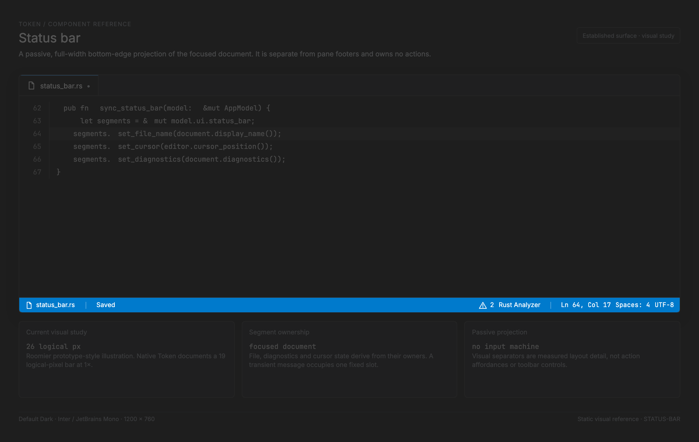

# Status bar: implementation reference

<!-- token-ui-mockup:begin STATUS-BAR -->
[](mockups/STATUS-BAR.html?view=emphasised)

*Visual target under review. [Normal PNG](mockups/renders/STATUS-BAR.png) · [Open normal mockup](mockups/STATUS-BAR.html?view=normal) · [Open emphasised mockup](mockups/STATUS-BAR.html?view=emphasised).*
<!-- token-ui-mockup:end STATUS-BAR -->

The status bar is a passive, always-present projection of the focused document
and selected application state. It is neither a notification queue nor an
interactive toolbar. The model uses character counts for its test layout and
measured physical pixels for native rendering; do not confuse either with
editor columns.

## Current model, identities, and precedence

The current representation in [src/model/status_bar.rs](../../src/model/status_bar.rs)
is fixed-schema state, despite being stored as a vector:

```rust
// current excerpt
pub enum SegmentContent { Empty, Text(String) }
pub struct StatusSegment {
    pub id: SegmentId,                 // fixed enum identity; must occur once
    pub position: SegmentPosition,     // Left | Center | Right
    pub content: SegmentContent,       // empty is hidden
    pub priority: u8,                  // metadata only; no current overflow policy
    pub min_width: usize,              // character units; metadata only
}
pub struct StatusBar {
    segments: Vec<StatusSegment>,
    pub separator_spacing: usize,      // space-character units
    pub padding: usize,                // space-character units per edge
}
pub struct TransientMessage { pub text: String, pub expires_at: Instant }
```

Default identity/order is left `FileName(100)`, `ModifiedIndicator(90)`,
`StatusMessage(50)` and right `Diagnostics(70)`, `LspServer(65)`,
`InlineSuggestion(66)`, `CaretCount(45)`, `TextPolicy(35)`, `Selection(40)`,
`CursorPosition(80,min 12)`, `LineCount(60,min 6)`. Parentheses show stored
priority, not a behavior currently applied. Center is an enum option but no
default center segment and no renderer output exists.

`UiState` owns both `status_bar` and the optional transient. The transient is
durable only until `Instant::expires_at`; it has no ID/generation, severity,
action, cancellation, or queue. `status_message_is_diagnostic` records whether
the `StatusMessage` text belongs to the diagnostic-under-cursor fallback. This
bit is essential: it lets synchronization replace/clear only its own fallback,
without overwriting explicit text.

| Source                                  | Projection ownership                                     | Invariant                                                                                                                                          |
| --------------------------------------- | -------------------------------------------------------- | -------------------------------------------------------------------------------------------------------------------------------------------------- |
| focused text document                   | `sync_status_bar`                                        | filename, modified marker, cursor/line/selection/carets/text policy recompute from current document/editor                                         |
| image mode                              | `sync_status_bar`                                        | dimensions/zoom/file size/format replace text fields; stale diagnostics/LSP are cleared                                                            |
| focused document diagnostics/LSP        | `sync_status_bar`                                        | counts and server lifecycle are derived; no server hides/changes appropriate fields                                                                |
| inline request                          | `sync_status_bar`                                        | `InlineSuggestion` only while in flight on a plain-text focused editor                                                                             |
| canonical flash                         | `UiState::set_status_for` / `UiMsg::SetTransientMessage` | writes both transient and StatusMessage, then requests status-bar damage                                                                           |
| direct transient writer                 | selected feature reducers, e.g. inline failure           | may set only `transient_message`; it suppresses diagnostic fallback but does **not** mirror text into StatusMessage or guarantee status-bar damage |
| explicit `UpdateSegment(StatusMessage)` | UI reducer                                               | clears diagnostic-ownership bit but leaves any old transient deadline live                                                                         |

Diagnostic fallback applies only if there is no transient and the message slot
is empty or already diagnostic-owned. A direct writer can therefore leave the
old/empty slot visible while suppressing the fallback until expiry. It chooses the highest-severity diagnostic
containing the active cursor, flattens whitespace, and caps it at 120 Unicode
characters. This is a priority relation, not a generic notification system.

## Reducer lifecycle and timer staleness

```text
feature/document change → sync_status_bar(model) → derived segments
canonical flash         → SetTransientMessage → transient + StatusMessage + status damage
direct feature write    → transient only (feature decides its own damage; no slot mirror)
explicit write          → UpdateSegment(StatusMessage) → status damage; old transient remains
event-loop wake         → expire_status_message → clears current transient and StatusMessage
render                  → measured layout + paint (read-only)
```

`UiMsg::{SetTransientMessage,ClearTransientMessage,UpdateSegment}` are reduced
in [src/update/ui.rs](../../src/update/ui.rs) and return
`Cmd::redraw_status_bar()`. Runtime deadline selection includes the current
`transient.expires_at`; expiry calls `UiState::expire_status_message` and emits
status-bar damage. Replacing a _canonical_ flash replaces the one model object
and deadline, so an old wake cannot independently clear newer flash text: the
expiry predicate checks the current `expires_at`. However,
`UpdateSegment(StatusMessage)` does **not** clear `transient_message`; its old
deadline subsequently clears the newer explicit segment. That is current
behavior, not an ownership guarantee. Explicit clear removes the current
transient and clears StatusMessage; a subsequent normal sync may install a
diagnostic fallback.

There is no input machine: status-bar hit targets consume pointer events but
have no click/key activation, capture, focus, popup, tooltip, or accessibility
role. Its owner invalidates and redraws its passive projection. A future
interactive segment must add a separate input contract, not mutate this one.

## Measured layout algorithm

`layout_measured(available_width, space_width, measure)` uses physical px in
the renderer. `padding_px = padding × space_width`; `spacing_px =
separator_spacing × space_width`. Empty content is skipped. Let `M(t)` be
ceil-measured glyph width in physical px.

```rust
// algorithm sketch; this matches the current directional placement.
let mut lx = padding_px;
for left in nonempty_left_in_vector_order {
    if not_first { lx = previous_end + spacing_px; }
    emit(left.id, lx, M(left.text));
    previous_end = lx + M(left.text);
}
let mut rx = available_width.saturating_sub(padding_px);
for right in nonempty_right_in_reverse_vector_order {
    if not_first {
        rx = previous_start.saturating_sub(spacing_px);
        separator_at(previous_start.saturating_sub(spacing_px / 2));
    }
    rx = rx.saturating_sub(M(right.text));
    emit(right.id, rx, M(right.text));
    previous_start = rx;
}
reverse_right_output_to_left_to_right_order();
```

The solver neither reserves a gap between left/right groups nor compares their
ends. `saturating_sub` prevents unsigned underflow but may assign overlapping
or compressed coordinates at narrow widths. `priority` and `min_width` are
not consulted, and text is not truncated. This is a documented limitation, not
overflow support.

Normal trace (test units): width 80, padding 2, spacing 2; left text `a` then
`save` yields `(x,w)=(2,1),(5,4)`. Right `Ln 1` (4) and `1 Ln` (4) place from
78: `1 Ln` at 74, separator 73, then `Ln 1` at 68. Pathological trace: width
10, same padding, left filename width 12 gets x=2/end=14, right four-character
segment gets x=4. Both draw into overlapping coordinates because no collision
resolver exists. A future policy must choose/measure survivors before emitting
rectangles; it cannot repair the collision during paint.

The renderer obtains `UiKey::StatusBar`, snaps its rect, fills background and
top border, then measures UI-font text at the clamped configured status size.
Text y is `status_y + (height - line_height)/2` using saturating subtraction.
It draws left/right output and one-pixel alpha-blended separators. Inputs are
theme `status_bar.{background,foreground,border}`, scale factor, font setting,
font cache/measurement, segment data, and solved rect.

## Costs, invalidation, and proposed overflow API

Every synchronization rewrites a fixed 11-segment vector; layout traverses it
twice and measures only visible strings. Native glyph measurement uses the text
painter cache, but no status-specific cache retains x positions. Changes to any
segment, message expiry, focus/cursor/document/view mode, LSP state, theme/font
size/scale, window width, or status height require a fresh layout. This is
small fixed overhead plus text measurement, not an O(document-size) pass.

If narrow-width behavior is implemented, make it a pure projection with exact
ownership and keep the bar passive. Do not add `StatusAction` until a named
consumer also supplies `StatusMsg::Activate { id }`, a visible-hit lookup from
the solved layout, focus traversal, and an accessibility label/announcement:

```rust
// proposed API — all widths are physical px after measurement.
struct SegmentSpec<'a> {
    id: SegmentId, position: SegmentPosition, text: &'a str,
    priority: u8, min_width_px: usize, truncate: bool,
    accessible_label: &'a str,
}
struct StatusLayout { visible: Vec<RenderedSegment>, hidden: Vec<SegmentId> }
```

`min_width_px` is intentionally not the existing character-unit field: conversion
must happen before selection. Proposed algorithm: reserve both edge paddings,
sort only eligible segments by descending priority with original vector order
as tiebreak, admit an item only if its measured/truncated width plus required
intra-group spacing fits the remaining budget, then place the survivors. A
candidate that cannot reach its minimum is hidden, never drawn at x=0. The
producer still owns text; the layout layer owns only visibility/truncation.

## Verification

Existing unit tests in `tests/status_bar.rs` cover model layout and transient
basics. Preserve/add these vectors:

| Initial state                           | Action                                                      | Expected projection                                                                                         |
| --------------------------------------- | ----------------------------------------------------------- | ----------------------------------------------------------------------------------------------------------- |
| diagnostic fallback text at cursor      | canonical set transient `Saved`, 3 s                        | transient exists; StatusMessage is `Saved`; diagnostic bit false                                            |
| that state, current clock past deadline | runtime wake                                                | transient absent and slot empty; a later sync may restore diagnostic fallback                               |
| canonical flash still pending           | `UpdateSegment(StatusMessage, Indexing)`, then old deadline | Indexing first displays, then old expiry clears it: current bug/contract gap                                |
| inline failure direct writer            | set `transient_message` without segment mutation            | diagnostic fallback suppressed; status slot is not guaranteed to show failure or receive status-only damage |
| width 80 / padding 2 / spacing 2        | layout strings above                                        | left `(2,1),(5,4)` and right `(68,4),(74,4)`                                                                |
| width 10 / long left and right          | current layout                                              | overlap is reproducible; test proposed policy separately before claiming priority behavior                  |
| image tab after diagnostic text tab     | sync                                                        | image fields shown and Diagnostics/LspServer empty                                                          |

## Evidence

- [model/layout/synchronization](../../src/model/status_bar.rs), [UI ownership](../../src/model/ui.rs), [UI reducer](../../src/update/ui.rs)
- [deadline scheduling](../../src/runtime/app.rs), [renderer](../../src/view/mod.rs), [layout key](../../src/layout/keys.rs)
