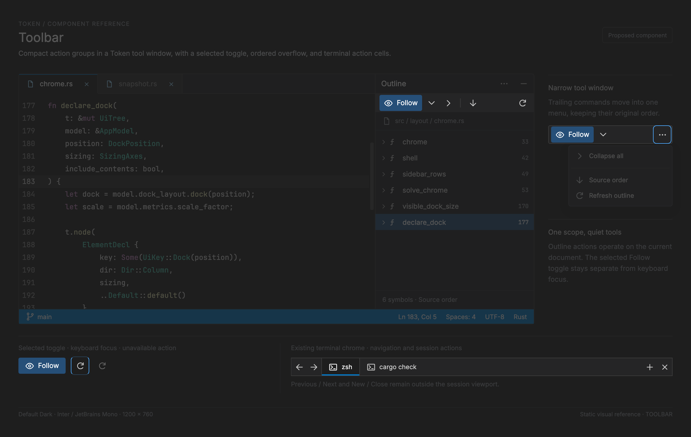

# Toolbar — terminal chrome and future reusable contract

<!-- token-ui-mockup:begin TOOLBAR -->
[](mockups/TOOLBAR.html?view=emphasised)

*Visual target under review. [Normal PNG](mockups/renders/TOOLBAR.png) · [Open normal mockup](mockups/TOOLBAR.html?view=normal) · [Open emphasised mockup](mockups/TOOLBAR.html?view=emphasised).*
<!-- token-ui-mockup:end TOOLBAR -->

## Boundary and status

Token has no shared `Toolbar` model, painter, overflow menu, focus policy, or customization system. The nearest implemented surface is terminal tab/action chrome. It couples terminal session lifecycle, tab scrolling, and four action cells; it is layout evidence, not a generic toolbar. A toolbar is persistent controls for one stable scope; it is not a tab strip, menu, or Settings category row.

## Existing terminal representation and geometry

**Current excerpt** — [src/panels/terminal.rs](../../src/panels/terminal.rs).

```rust
tree.node(ElementDecl { key: Some(UiKey::TerminalTabs), dir: Dir::Row, clip: true, .. }, |tree| {
    button(tree, TabAction::Previous);
    button(tree, TabAction::Next);
    tree.node(ElementDecl { key: Some(UiKey::TerminalTabViewport), clip: true, .. }, |tree| {
        tree.node(ElementDecl { dir: Dir::Row,
            scroll: Some(ScrollDecl { offset_x: model.terminal.tab_scroll, offset_y: 0.0 }), .. }, |tree| {
            for session in &model.terminal.sessions {
                tree.leaf(ElementDecl { key: Some(UiKey::TerminalAction(TabAction::Select(session.id))),
                    sizing: SizingAxes::new(Sizing::Fixed(model.char_width * 22.0), Sizing::GROW), .. });
            }
        });
    });
    button(tree, TabAction::New); button(tree, TabAction::Close);
});
```

`UiKey::TerminalAction(TabAction)` is identity derived from durable terminal action/session identity, not display index. `LayoutSnapshot` owns derived physical-pixel rectangles and clip relationships for one layout pass. Terminal state owns durable sessions, active index, pending spawn state and `tab_scroll`; `hovered_tab: Option<TabAction>` is transient presentation. Render borrows these values; it does not mutate them.

Action cells are square at `metrics.tab_bar_height`; every session tab declares `char_width × 22` plus medium horizontal padding. The viewport clips only the scrollable tab run; Previous/Next/New/Close remain visible. The same layout snapshot feeds declaration, rendering, hit test, PTY sizing, and `reveal_active_tab`. Its repair is `delta = tab.left - viewport.left` if the tab lies outside either viewport edge, otherwise 0, then `tab_scroll = max(0, tab_scroll + delta)`. It runs after dock/font resize, so active tab cannot stay offscreen.

**Worked trace.** With a 400-pixel bar at x=0 and tab height 28, Previous and Next occupy x=0..28 and x=28..56; New and Close occupy x=344..372 and x=372..400. The solved viewport is therefore x=56, width 288. With `char_width=8`, each session tab's **border box** is 176 pixels (the medium padding is internal, not added outside it): session one has absolute left 56, session two 232, and session three 408. Selecting the third gives `delta = tab.x - viewport.x = 408 - 56 = 352`, then `tab_scroll = max(0, old_scroll + 352)`. With no sessions, action rects still exist; Update, not empty paint, must make Previous/Next/Close unavailable.

The renderer calls the shared button painter only for glyph cells and derives hover from `hovered_tab`; session select/spawn/close route through `TerminalMsg::Tab` in Update. There is no generic roving focus, tooltip, accessibility role, or overflow control.

## Proposed reusable representation (not implemented)

**Proposed API.** `ActionId: Copy + Eq` is a stable owner action key across reorder/overflow; `PointerId: Copy + Eq` identifies one pointer sequence; and `ToolbarScope` is an owner-defined stable context key (for example, a particular editor group). The owner reducer maps returned `ActionId` to its existing message/then `Cmd`; toolbar paint never produces effects.

```rust
enum ToolbarItem<ActionId> {
    Action { id: ActionId, label: String, enabled: bool, pending: bool },
    Toggle { id: ActionId, label: String, selected: bool, enabled: bool },
    Menu { id: ActionId, label: String, enabled: bool, expanded: bool },
    Separator, Label(String),
}
struct ToolbarModel<ActionId> {
    scope: ToolbarScope,
    items: Vec<ToolbarItem<ActionId>>, // display and overflow ordering authority
    focused: Option<ActionId>,
    press: Option<(PointerId, ActionId)>,
}
struct ToolbarLayout<ActionId> {
    visible: Vec<(ActionId, Rect)>, hidden: Vec<ActionId>, overflow: Option<Rect>,
}
```

Invariant: `visible ∪ hidden` contains each actionable ID once in original relative order; separators/labels are never focusable; `overflow.is_some() ⇔ hidden` is nonempty; `focused`/capture reference a current visible action. On removal or resize, clear stale capture and advance focus to the next enabled visible action or overflow. Disabled actions remain discoverable but cannot focus, capture, or invoke.

### Packing, hit test, and input algorithm

```text
reserve = overflow_needed ? overflow_width + trailing_gap : 0
budget = max(0, toolbar_width - fixed_nonaction_width - reserve)
scan declared order: append while used + measured_width ≤ budget; otherwise hidden += ID
if hidden became nonempty and reserve was 0: repeat once with overflow reserve
```

Measure UI text/icons once and round only when constructing physical rects. This reserve/repeat rule avoids a final ellipsis displacing an already “visible” action. For W=210, widths [48,40,56,44], gaps 8, overflow 28: first pass requires 212, so the reserved budget is 182. It fits `48+8+40+8+56=160` but not `+8+44`; first three are visible and fourth goes to overflow. Vertical layouts exchange axes. Renderer and hit test consume the same `ToolbarLayout`.

Pointer press captures only a visible enabled ID; matching release inside emits owner `Activate(id)`. Matching release outside, matching cancellation, focus loss, scope destruction, and mutation clear capture; wrong-pointer release/cancel leaves it intact. Tab enters toolbar; arrows rove visible enabled items; Enter/Space activate; Tab exits. A menu/overflow follows [Menu](MENU.md) and restores focus to its trigger on Escape. Icon-only actions require label/tooltip and all focus/selected/expanded states require non-color-only projection.

## Integration, invalidation, async safety, and verification

The owner derives items, runs `layout_toolbar` once, passes that layout to render/hit-test, then maps `Activate(ActionId)` through its existing Update/Command path. Overflow carries original IDs and invokes exactly the same reducer; do not create a second effect path. Packing/measurement is O(n); glyph caches may reuse glyphs but are not an excuse to cache stale geometry. Invalidate layout on item order/labels/icons/enabled/pending visibility, UI font/scale, orientation/gaps/padding, bounds, or overflow policy. Theme-only changes repaint.

For async action sources, retain `(scope, generation)`; accept only a reply that matches the still-open owner, and resolve its `ActionId` again at activation. A reply after scope destruction must neither recreate toolbar state nor invoke a recycled position.

| Setup                                     | action                            | expected output                                                      |
| ----------------------------------------- | --------------------------------- | -------------------------------------------------------------------- |
| terminal 400-pixel bar, 28-pixel cells    | solve layout                      | viewport width 288; four cells outside clip                          |
| packing example                           | layout then overflow click        | hidden fourth ID invokes same owner action                           |
| captured action pointer 1                 | resize removes action; pointer-up | no invocation; focus/capture repaired                                |
| all visible disabled, enabled hidden item | arrows/Enter then overflow        | no visible activation; hidden action remains reachable               |
| scope 9 generation 2 closes               | reply generation 2                | discard, no new toolbar                                              |
| scale 1→2                                 | render/hit                        | one recomputed geometry authority; no independently rounded hit rect |

Terminal gallery samples are visual terminal-chrome coverage. A generic toolbar needs its own layout, focus, overflow, interaction, and stale-reply automation tests.
