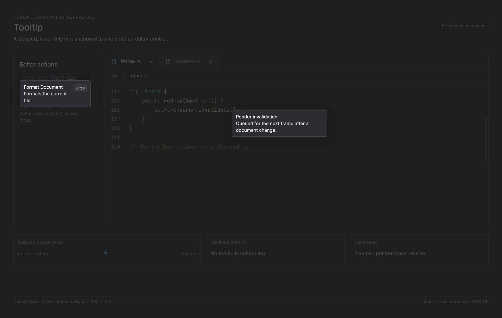

# Tooltip — proposed implementation contract

<!-- token-ui-mockup:begin TOOLTIP -->
[](mockups/TOOLTIP.html?view=emphasised)

*Visual target under review. [Normal PNG](mockups/renders/TOOLTIP.png) · [Open normal mockup](mockups/TOOLTIP.html?view=normal) · [Open emphasised mockup](mockups/TOOLTIP.html?view=emphasised).*
<!-- token-ui-mockup:end TOOLTIP -->

## Current boundary

A tooltip is short, non-essential explanatory text for an already-visible control. It is not Token's LSP hover card, which is asynchronous editor documentation, nor a cursor popup, which is navigable/actionable.

**No generic tooltip currently exists.** UiState.hover (HoverRegion) only carries broad pointer routing and visual-hover information; it has no text, target identity, timer, generation, or panel state ([model](../../src/model/ui.rs)). Runtime hover delay applies to LSP word hover and is document/revision owned, so it cannot be reused for UI controls. Everything below is **proposed**, not implemented.

## Representation and ownership

```rust
// Proposed; not implemented. These keys are independent of the closed UiKey enum.
use std::{collections::HashMap, sync::Arc, time::Duration};

#[derive(Clone, Copy, Debug, PartialEq, Eq)]
pub struct TooltipRect { pub x: usize, pub y: usize, pub w: usize, pub h: usize }
#[derive(Clone, Copy, Debug, PartialEq, Eq, Hash)]
pub struct TooltipSurfaceId {
    pub slot: u64,          // reusable storage slot
    pub incarnation: u64,   // incremented before slot reuse
}
#[derive(Clone, Copy, Debug, PartialEq, Eq, Hash)]
pub struct TooltipLocalId {
    pub slot: u32,
    pub incarnation: u64, // incremented before a removed control's slot is reused
}
#[derive(Clone, Copy, Debug, PartialEq, Eq, Hash)]
pub struct TooltipControlId {
    pub surface: TooltipSurfaceId,
    pub local: TooltipLocalId,
}

pub struct TooltipDescriptor {
    pub text: String,       // owned snapshot, safe across timer delivery
    pub rect: TooltipRect,      // current physical-px target rectangle
    pub enabled: bool,
}
pub struct TooltipRuntimeRegistry {
    pub layout_epoch: u64,
    pub controls: Arc<HashMap<TooltipControlId, TooltipDescriptor>>,
}

pub struct TooltipState {
    pub target: TooltipControlId,
    pub text: String,           // copied at enter; renderer borrows it
    pub generation: u64,        // invalidates all older deadlines
    pub phase: TooltipPhase,
}
pub enum TooltipPhase { Waiting, Visible }

pub struct ProposedUiTooltip {
    pub visible: Option<TooltipState>,
    pub next_generation: u64,
    pub pending_deadline: Option<(TooltipControlId, u64)>,
}

pub enum TooltipMsg {
    PointerEntered { target: TooltipControlId },
    PointerLeft { target: TooltipControlId },
    DeadlineElapsed { target: TooltipControlId, generation: u64 },
    TargetRemoved { target: TooltipControlId },
    Dismiss { reason: TooltipDismissReason },
}
pub enum TooltipDismissReason { Escape, FocusLost, ModalOpened, DragStarted,
    PointerPressed, TargetRemoved, Resized }
pub enum TooltipCmd {
    ScheduleTooltipDeadline { target: TooltipControlId, generation: u64, delay: Duration },
    CancelTooltipDeadline { target: TooltipControlId, generation: u64 },
    Redraw,
}
```

TooltipControlId is a registry key, not a copied coordinate and not an enumeration of every control in Token. The owner retains a local key while the same logical control moves or reorders. Replacing/removing a control retires that key: before reusing its slot, increment the **local** incarnation, even when the surface remains open. Surface-slot reuse independently increments the surface incarnation. Neither counter may wrap into a previously issued identity; exhaustion retires the slot. A removed row's timer therefore cannot name a replacement row. Runtime retains an immutable, owned Arc registry snapshot (with layout_epoch) until all event processing for that layout epoch completes, then atomically swaps it for the next snapshot. A target is live only if the current runtime registry contains its exact surface and local keys, including both incarnations. This supports dynamic tabs, rows, and future surfaces without extending a central enum.

Feature declarations contribute an owned descriptor snapshot; TooltipState copies descriptor text from the runtime registry at enter, so a dynamic label cannot dangle. Descriptor.rect, wrapped lines, panel rect, and clip mask are derived presentation. The runtime owns registry lifecycle and timer delivery; update owns generation validity and all state mutation. Update never borrows a frame-local map.

The runtime timer carries target and generation. Update increments next_generation on every enter **and every dismissal**. A deadline may show only if:

```
phase == Waiting { target, generation }
and target is enabled in the current immutable runtime registry
and no active modal, drag, or capture exists.
```

This rejects late timers after leave/re-enter, removal, or a modal. A tooltip never takes keyboard focus; the control still needs a visible label or an accessible keyboard-equivalent description.

## Reducer and lifecycle

| Prior state | Event/precondition                                    | New state and intent                                   |
| ----------- | ----------------------------------------------------- | ------------------------------------------------------ |
| absent      | Enter enabled target found in registry; no modal/drag | Waiting(t, ++g); schedule deadline with explicit delay |
| waiting     | Leave/removal/drag/modal/focus loss/resize            | absent; ++g invalidates deadline; issue cancel         |
| waiting t,g | Enter u not equal t                                   | Waiting(u, ++g); cancel t,g and schedule u,g           |
| waiting t,g | Matching elapsed; t remains live/enabled              | Visible(t,g); redraw                                   |
| visible     | Leave/removal/drag/modal/focus loss/Escape            | absent; redraw                                         |
| visible     | Pointer press                                         | absent, then ordinary target dispatch                  |
| any         | Mismatched elapsed or missing target                  | unchanged/absent; no effect                            |

The initial policy is explicit rather than inherited from LSP hover: delay=700 ms, max width=320 logical px, horizontal/vertical padding=10/7 logical px, radius=6 logical px, and gap=2 logical px. Disabled controls are excluded by descriptor.enabled; a product that needs disabled explanations must declare a separate descriptor policy. Focused(false) and CursorLeft dismiss. Resize dismisses rather than retaining geometry. A tooltip cannot consume or block a click.

Proposed path:

```
winit pointer move -> hit-test control id -> current TooltipRegistry lookup
 -> Msg::Ui(TooltipMsg) -> update_ui -> TooltipCmd::ScheduleTooltipDeadline
 -> runtime timer -> TooltipMsg::DeadlineElapsed -> redraw
 -> renderer resolves stored TooltipControlId in current registry, measures text, paints Frame
```

Unlike CursorOverlayState, this never enters the popup Up/Down/Enter/Escape routing branch.

The proposed runtime input adapter dispatches `Dismiss(Escape)` before normal
keymap processing when a tooltip is waiting or visible, consuming that Escape
only; without a tooltip, Escape follows its ordinary route. Window focus loss
dispatches `Dismiss(FocusLost)`, and resize/scale changes dispatch
`Dismiss(Resized)` before replacing layout geometry. Pointer press dispatches
`Dismiss(PointerPressed)` and then continues ordinary click routing. Opening a
modal or starting a drag dispatches the corresponding dismissal before its
normal action. These mappings are additions to runtime routing, not existing
Token handlers or a second popup focus owner.

## Placement, clipping, and traces

All coordinates are physical pixels after scaling. Let policy max width be M=round(320×scale), pads px=round(10×scale), py=round(7×scale), radius=round(6×scale), gap g=round(2×scale). Wrap UI-font text at max(1, min(M-2px, window_w-2px)); then pw=min(window_w, measured_content_w+2px) and ph=measured_line_count×line_h+2py. Given target R=(x,y,w,h), panel P=(pw,ph), window (ww,wh):

```
x0 = clamp(x, 0, ww - pw)
below = y + h + g
above = y - g - ph
y0 = below if below + ph <= wh
   = above if above >= 0
   = clamp(below, 0, wh - ph)
```

The final clamp is saturating: clamp(a,0,b) means zero when b is negative before the panel-width cap, never unsigned subtraction. This resembles the existing cursor-anchor flip/clamp policy in [layout/anchor.rs](../../src/layout/anchor.rs), but a tooltip needs an element-rect anchor rather than a fabricated caret. Frame clips measured text to the panel; update never measures glyphs.

Normal trace at 1×: W=1200×800, R=(1100,200,24,24), P=180×44. x0=1020, below=226 fits, so result=(1020,226,180,44). Pathological trace: W=280×150, R=(260,130,20,18), P=200×80. x0=80, below fails, above=48, result=(80,48,200,80). Oversized trace: W=280×150, measured text asks for P=340×170; caps produce pw=280, x0=0, neither y side fits, so y=0 and Frame clips the 170px panel to window bounds.

### Proposed reducer sketch

```rust
// Proposed. Runtime supplies an owned immutable registry snapshot.
fn reduce_tooltip(
    tooltip: &mut ProposedUiTooltip,
    msg: TooltipMsg,
    registry: &TooltipRuntimeRegistry,
    blocked: bool, // active modal, any capture, or active drag
) -> Vec<TooltipCmd> {
    fn dismiss(tooltip: &mut ProposedUiTooltip) -> Vec<TooltipCmd> {
        tooltip.next_generation += 1; // makes every old deadline stale
        let old = tooltip.visible.take();
        tooltip.pending_deadline = None;
        old.map_or_else(Vec::new, |old| {
            vec![
                TooltipCmd::CancelTooltipDeadline {
                    target: old.target,
                    generation: old.generation,
                },
                TooltipCmd::Redraw,
            ]
        })
    }

    match msg {
        TooltipMsg::Dismiss { .. } => dismiss(tooltip),
        TooltipMsg::TargetRemoved { target }
            if tooltip.visible.as_ref().is_some_and(|state| state.target == target) =>
        {
            dismiss(tooltip)
        }
        TooltipMsg::TargetRemoved { .. } => Vec::new(),
        TooltipMsg::PointerLeft { target }
            if tooltip.visible.as_ref().is_some_and(|s| s.target == target) =>
        {
            dismiss(tooltip)
        }
        TooltipMsg::PointerLeft { .. } => Vec::new(), // late leave of old target
        TooltipMsg::PointerEntered { target } => {
            if blocked {
                return dismiss(tooltip);
            }
            let Some(descriptor) = registry.controls.get(&target).filter(|d| d.enabled) else {
                return dismiss(tooltip);
            };
            let old = tooltip.visible.take();
            tooltip.pending_deadline = None;
            tooltip.next_generation += 1;
            let generation = tooltip.next_generation;
            let mut effects = old.map_or_else(Vec::new, |old| {
                vec![TooltipCmd::CancelTooltipDeadline {
                    target: old.target,
                    generation: old.generation,
                }]
            });
            tooltip.visible = Some(TooltipState {
                target,
                text: descriptor.text.to_owned(),
                generation,
                phase: TooltipPhase::Waiting,
            });
            tooltip.pending_deadline = Some((target, generation));
            effects.push(TooltipCmd::ScheduleTooltipDeadline {
                target,
                generation,
                delay: Duration::from_millis(700),
            });
            effects
        }
        TooltipMsg::DeadlineElapsed { target, generation } => {
            if blocked || !registry.controls.get(&target).is_some_and(|d| d.enabled) {
                return dismiss(tooltip);
            }
            let Some(state) = tooltip.visible.as_mut() else {
                return Vec::new();
            };
            if state.target != target
                || state.generation != generation
                || !matches!(&state.phase, TooltipPhase::Waiting)
            {
                return Vec::new();
            }
            state.phase = TooltipPhase::Visible;
            tooltip.pending_deadline = None;
            vec![TooltipCmd::Redraw]
        }
    }
}
```

PointerLeft compares target, so a late leave for an old control retains a new wait state. Every dismissal increments generation, including modal-open, resize, and target-removal paths, which makes a runtime cancellation race harmless. Integration emits TargetRemoved whenever a previous current target disappears from a newly built registry; renderer cannot silently retain a visible tooltip without a descriptor.

## Invalidation and verification

Layout invalidates on target rect, text, window, scale factor, theme, and font metrics. Lookup is O(1), measurement O(chars plus wrapped lines), painting O(visible glyphs). There is no async content fetch; only late timer delivery is stale and the generation guard rejects it.

**Proposed tests** (none exist today):

| Setup                       | Action                | Expected                               |
| --------------------------- | --------------------- | -------------------------------------- |
| enter target generation 7   | matching elapsed      | visible                                |
| leave/re-enter generation 8 | elapsed generation 7  | cannot open                            |
| visible target removed      | layout                | state clears; no stale-rect panic      |
| visible                     | mouse press           | dismisses and target action dispatches |
| pathological trace          | layout                | exact panel (80,48,200,80)             |
| waiting/visible             | focus loss/modal/drag | clears; no resurrection                |

Gallery coverage can show wrapping, edges, theme, and scale, but reducer/runtime tests are required for timing and click pass-through.
