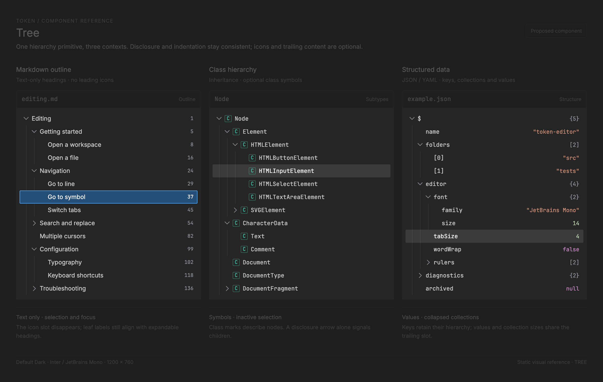

# Tree implementation manual

<!-- token-ui-mockup:begin TREE -->
[](mockups/TREE.html?view=emphasised)

*Visual target under review. [Normal PNG](mockups/renders/TREE.png) · [Open normal mockup](mockups/TREE.html?view=normal) · [Open emphasised mockup](mockups/TREE.html?view=emphasised).*
<!-- token-ui-mockup:end TREE -->

A Token tree is a feature-owned hierarchy plus an expansion-dependent preorder
**visible projection**. The shared renderer owns neither nodes, selection,
expansion, open behavior, nor filesystem effects. It walks the exact display
projection used by the solved row viewport. Uniform row math is in
[LIST.md](LIST.md); this chapter adds hierarchy and identity repair.

## Visual examples: one primitive, different owners

The three-column mockup illustrates a Markdown outline, a class hierarchy, and
a JSON/YAML data tree. These are static example projections for the proposed
shared component; they do not imply that Token ships each of these viewers.
The Markdown headings and JSON document are illustrative fixtures. The class
example shows the DOM `Node` inheritance hierarchy.

All three use the same row renderer: 26px rows, a 16px indentation step, a 14px
disclosure slot, and separate selection and keyboard-focus treatment. An
optional leading symbol and optional trailing content vary with the owner:

| Example | Leading content | Trailing content | Domain relationship |
| --- | --- | --- | --- |
| Markdown outline | None; removing the icon slot closes that gap | Source line | Heading ancestry; activating a row would jump to its heading |
| Class hierarchy | Class symbol | None | Inheritance; an expandable type has visible subtypes |
| Structured data | None | Scalar value or derived collection size | Object keys and array indexes; JSON and YAML can produce the same hierarchy |

Folder icons are a filesystem presentation choice, not part of the tree
contract. A leaf retains the empty disclosure slot so siblings align, while
an expandable node has a chevron independently of its optional icon. Labels,
glyphs, values, and activation policy remain feature-owned. Collapsed branches
keep their descendants in the model but omit them from the visible projection.

In the emphasised image the three tree viewports stay at normal opacity;
document headers, example titles, and explanatory captions are context at 25%
by default. The viewer's opacity and optional offset guides are presentation
settings, independent of the tree's own selection and focus styling.

## 1. Current data, ownership, and invariants

The workspace uses full paths as durable node and selection identities;
`FileNode.name` is presentation only. Folder children stay in the hierarchy
while collapsed. `expanded_folders` determines which child ranges enter the
projection (`src/model/workspace.rs:135-180`, `:226-285`, `:427-485`).

```rust
// current excerpt
pub struct FileNode {
    pub name: String,
    pub path: PathBuf,
    pub is_dir: bool,
    pub children: Vec<FileNode>,
    pub extension: FileExtension,
}
pub struct FileTree { pub roots: Vec<FileNode> }

pub struct TreeRow<'a, T> {
    pub node: &'a T,
    pub depth: usize,
    pub index: usize,
    pub row_y: usize,
}
```

`FileTree::count_visible`, `get_visible_item`, and
`get_visible_item_with_depth` use the same expanded predicate as render:
`node.is_dir && expanded.contains(&node.path)`. `render_tree` accepts that
predicate and a `RowListView`; it counts all preceding visible ancestors but
only calls its row painter for `drawn_range()`
(`src/view/tree_view.rs:17-87`).

| State                           | Owner                               | Invariant and repair authority                                                                                                  |
| ------------------------------- | ----------------------------------- | ------------------------------------------------------------------------------------------------------------------------------- |
| roots/child order               | `FileTree` or outline model         | every node occurs once under its parent; scan/parse update owns replacement                                                     |
| expansion set                   | workspace/outline owner             | current refresh can retain stale paths harmlessly outside the projection; generalized owner should prune them                   |
| selected item                   | workspace path; Outline index today | current workspace can retain an invisible descendant after collapse/removal; generalized owner must repair before activation    |
| scroll offset                   | workspace/panel                     | current code clamps on sidebar reveal/collapse and explicit scrolling; raw refresh/filesystem updates can retain a stale offset |
| `TreeRow`, row/disclosure rects | frame                               | borrow current model and snapshot only; recreate every frame                                                                    |

Two folders may be named `src`. A display index or label is therefore invalid
durable identity. A future async/virtual tree needs a stable domain `NodeId`,
not an address or an index in a temporary flattening.

## 2. Projection and virtualization algorithm

The display order is preorder depth-first traversal: emit a node, then visit
its children only when it is expanded. The implementation's early exit is
essential: it stops after `drawn.end`, but must walk earlier ancestors to know
the depth/index of the first drawn node.

```rust
// algorithm sketch — matching src/view/tree_view.rs
fn visit(node: &Node, depth: usize, next: &mut usize, drawn: Range<usize>) {
    if *next >= drawn.end { return; }
    let index = *next;
    *next += 1;
    if drawn.contains(&index) {
        let row = rows.row_rect(index).expect("index is drawn");
        paint(TreeRow { node, depth, index, row_y: snap(row).1 });
    }
    if expanded(node) {
        for child in node.children() { visit(child, depth + 1, next, drawn.clone()); }
    }
}
```

Consequently paint is `O(drawn_count)`, while reaching a deeply scrolled row
costs `O(preceding visible nodes)` absent a cached projection. This is a
deliberate correctness choice: a flat index alone cannot recover depth. Cache
a flattened projection only with one owner and invalidation for roots, children,
sort/filter, expansion, and loading state.

Row rectangles, partial endpoint visibility, y hit testing, reveal, and scroll
clamping are `RowListView` operations. `render_tree` itself does **not** push a
clip; sidebar/dock consumers establish the enclosing content clip, and input
must validate its outer hit region before mapping y. The required mapping is:

```text
same roots + same expanded predicate
  ⇒ paint index == pointer-hit index == keyboard-navigation index
```

### Worked trace: a collapse invalidates indexes

With `project/ → src/ → {main.rs, lib.rs}` and `README.md`:

```text
expanded {project, src}:  0 project(d0), 1 src(d1), 2 main.rs(d2),
                          3 lib.rs(d2), 4 README.md(d1)
expanded {project}:       0 project(d0), 1 src(d1), 2 README.md(d1)
```

If selected path is `project/src/lib.rs`, collapsing `src` removes its visible
row. Retaining index 2 would select README; retaining index 3 is out of range.
The repair policy should select `src`, the selected item's nearest visible
ancestor, then clamp scroll against count 3. This is proposed explicit policy:
current collapse/removal paths do **not** reconcile a hidden descendant
selection. `ToggleFolder`/`CollapseFolder` do clamp sidebar scroll; a raw
`FileSystemChange` refresh currently redraws without that clamp.

For `h=24`, viewport height `60`, scroll `1`, the list renders indices `1..4`.
`render_tree` still visits root index 0 without painting it and correctly paints
the remaining depth values. Existing tests verify a nested row remains
reachable after skipped ancestors (`src/view/tree_view.rs:89-192`).

## 3. Current update and consumer flow

```text
pointer/key → WorkspaceMsg::{SelectFile, ToggleFolder, OpenFile, Scroll,
                              FileSystemChange}
 → update::workspace mutates selected path/expanded set/tree/scroll
 → chrome solves sidebar RowListView; only relevant current actions clamp/reveal
 → Cmd::Redraw or domain effect
 → renderer calls render_tree(current roots, current expansion predicate)
```

A tree press selects; double click toggles a directory or opens a file and
focuses the left dock (`src/runtime/mouse.rs:2176-2213`). Focused-dock keys
route before editor input; Right expands a collapsed folder or moves onward
(`src/runtime/input.rs:1155-1219`). `clamp_sidebar_scroll` uses the solved
sidebar view and deliberately preserves hidden-sidebar scroll until reveal;
Outline resets an invisible panel's offset to zero
(`src/update/workspace.rs:237-330`, `src/update/outline.rs:43-58`). These are
owner policies, not a generic tree state machine.

## 4. Proposed stable-ID repair and input machine

```rust
// proposed API — unlike current Outline's index selection
struct TreeState<NodeId> {
    expanded: HashSet<NodeId>,
    selected: Option<NodeId>,
    scroll: usize,
}
struct Visible<NodeId> {
    id: NodeId,
    parent: Option<NodeId>, // ancestry from the domain projection, not inferred from index
    selectable: bool,
}

fn repair<NodeId: Copy + Eq + Hash>(
    state: &mut TreeState<NodeId>, old: &[Visible<NodeId>], rows: &[Visible<NodeId>], view: RowListView,
) {
    if let Some(id) = state.selected {
        if !rows.iter().any(|r| r.id == id && r.selectable) {
            state.selected = fallback(id, old, rows);
        }
    }
    state.selected = state.selected.or_else(|| rows.iter().find(|r| r.selectable).map(|r| r.id));
    state.scroll = view.clamp_scroll(state.scroll);
    if let Some(i) = state.selected.and_then(|id| rows.iter().position(|r| r.id == id)) {
        state.scroll = view.scroll_to_reveal(state.scroll, i);
    }
}

fn fallback<NodeId: Copy + Eq>(
    selected: NodeId, old: &[Visible<NodeId>], rows: &[Visible<NodeId>],
) -> Option<NodeId> {
    let old_index = old.iter().position(|row| row.id == selected).unwrap_or(0);
    let mut ancestor = Some(selected);
    while let Some(id) = ancestor {
        if let Some(row) = rows.iter().find(|row| row.id == id && row.selectable) {
            return Some(row.id);
        }
        ancestor = old.iter().find(|row| row.id == id).and_then(|row| row.parent);
    }
    let pivot = old_index.min(rows.len());
    (pivot..rows.len()).chain(0..pivot)
        .find_map(|index| rows[index].selectable.then_some(rows[index].id))
}
```

`fallback` is deterministic: starting at the old selected ID, it follows
`parent` in `old` until it finds a selectable ID in the new `rows`. If no
ancestor survives, it starts at the old selected index clamped to new length,
searches forward, then wraps to the beginning. The old projection is essential:
after refresh, the new projection cannot reveal a removed node's former parent
or relative position.

Run it after expand/collapse, removal, refresh/filter, load completion, or
resize. Watcher/load results must carry an owner/root generation and be ignored
if it no longer matches the current workspace; a closed workspace must not be
repopulated by a stale result.

| Selected state      | Event                     | Transition                                                                 |
| ------------------- | ------------------------- | -------------------------------------------------------------------------- |
| none                | Up/Down                   | choose last/first visible selectable item                                  |
| collapsed directory | Right                     | expand stable ID; repair/reveal                                            |
| expanded directory  | Left                      | collapse it; selection remains directory                                   |
| child               | Left                      | select visible parent; do not collapse unrelated row                       |
| leaf                | Right                     | no generic effect (feature may define one)                                 |
| any                 | Enter                     | emit feature intent only: open/jump is not shared tree I/O                 |
| any                 | disclosure hit            | toggle only, never also row-activate                                       |
| any                 | release/cancel/focus loss | end feature-owned drag/capture; recompute current projection before action |

Current Token has no shared Left/Home/End/type-ahead/multiselect/accessibility
implementation. The table is a proposed testable contract. The disclosure hit
rect must use the same solved row and scaled indent as paint, otherwise deep
chevrons toggle a different row than they depict.

## 5. Invalidation and rendering ledger

| Output                 | Invalidate for                                         | Notes                                    |
| ---------------------- | ------------------------------------------------------ | ---------------------------------------- |
| projection/count       | roots, child order, expansion, sort/filter, load/error | calculate before hit/key/reveal          |
| viewport/row rects     | count, scroll, bounds, scaled row metrics              | frame-local `RowListView`                |
| indent/disclosure rect | row rect, depth, scaled indent                         | one helper for paint and hit             |
| selection              | visible IDs, collapse/removal/disablement              | repair by identity/ancestor, never index |
| text/icon              | node type, extension, label, theme/font/width          | clip to row                              |

Workspace scan is depth-capped at 20 and sorts folders before files
case-insensitively (`src/model/workspace.rs:226-350`). Those are data policies,
not tree geometry. Symlink/cycle and placeholder-node policies must be defined
by the feature before lazy loading is introduced.

A future semantic tree exposes tree/treeitem equivalents with level `depth+1`,
expanded state for collapsible nodes, selected/disabled/loading state, and an
accessible path. Focus appearance must be independent of selection color.

## 6. Verification cases

Existing tests cover visible item lookup in `tests/workspace.rs` and virtual
tree traversal in `src/view/tree_view.rs`. Add owner/update tests for:

| Case                     | Setup/action                                     | Expected                                             |
| ------------------------ | ------------------------------------------------ | ---------------------------------------------------- |
| preorder                 | worked trace, both folders expanded              | exact indices/depths 0–4                             |
| proposed collapse repair | select `lib.rs`, collapse `src`                  | selected ancestor `src`, count 3, clamped scroll     |
| proposed removal repair  | selected `/ws/a.rs`, matching watcher removes it | deterministic old-projection fallback; no stale open |
| duplicate labels         | select `/b/src`, refresh                         | retains `/b/src`, never first `src`                  |
| deep window              | ancestor 0 offscreen, child 2 drawn              | render and hit yield same child/depth                |
| disclosure lane          | depth-3 folder, chevron then label press         | first toggles only; second emits default intent      |
| proposed stale watcher   | model generation 12, result 11                   | roots/selection/expansion unchanged                  |
| zero capacity            | count 5, viewport 0                              | repair/navigation has no panic/divide-by-zero        |

Gallery rendering should additionally show deep indentation, clipped labels,
partial rows, selected versus focused, empty/loading/error and HiDPI. It cannot
prove identity repair or stale-result rejection.
