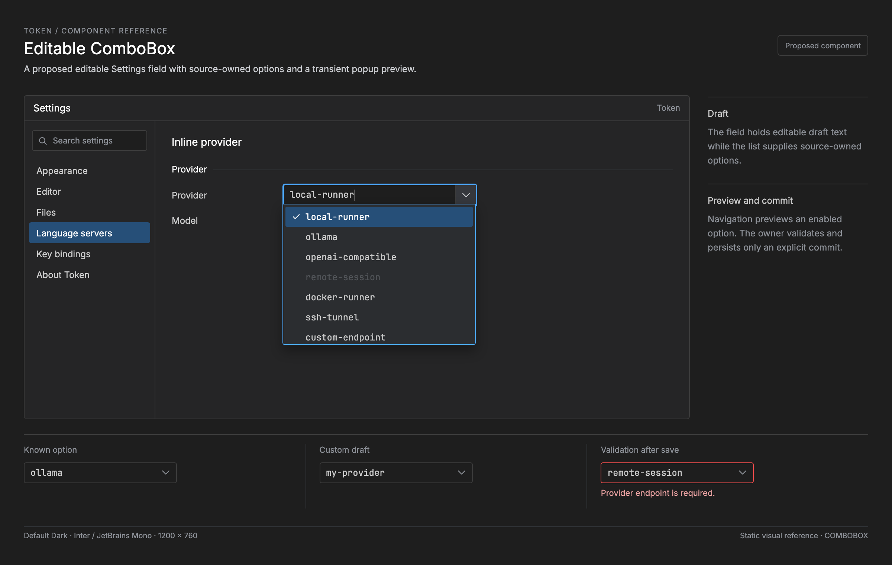

# Markdown and HTML previews

Previews render the current buffer. Relative images, stylesheets, fonts, scripts,
and links resolve from the source document's directory, including nested CSS
references. Filenames may contain spaces, Unicode, or `..` within a name. Use URL
escaping for literal `%`, `#`, and `?` characters (respectively `%25`, `%23`, and
`%3F`); query strings and fragments are separate from the filesystem path.

For a document in the selected workspace, `../` references may reach other files
inside that workspace. A root-relative URL such as `/assets/image.png` starts at
the workspace root. For a standalone document, both the access boundary and the
URL root are its containing directory. Untitled previews have no filesystem
access. Files outside these boundaries are unavailable to the preview.

For example, in `docs/ui/COMBOBOX.md`, this image and link retain their ordinary
browser-relative meaning:

```markdown
[](../ui/mockups/COMBOBOX.html)
```

Local links open existing files in the preview's attached editor group, using
normal tab reuse and preserving unsaved buffers. Missing files show an error and
do not create empty tabs. Same-document anchors remain in the preview. Links to
another document open that file; jumping to its heading is not yet supported.
HTTP and HTTPS links open in the system browser, including links requesting a new
window. Other navigation schemes are rejected.

Resource contexts are replaced on edits, document switches, Save As, workspace
changes, and explicit Refresh, and revoked when a preview closes. Refresh also
reloads changed assets. Automatic watching of all referenced resources is not
implemented.

## Boundaries and compatibility

Local resources are read through a directory capability on a background worker
with a 32-request queue. Only regular files up to 50 MiB are served. Size is
checked both before and during reading. Directory listings, special files, and
malformed URL paths are rejected. Responses use MIME types, `nosniff`, and
`no-store`, without permissive CORS headers.

Relative symlinks work when their entire resolution stays inside the granted
directory. Escaping links and absolute symlink targets are rejected, including
absolute links pointing back inside the directory. Windows device names and
alternate data streams are unsupported. Resource paths must be valid UTF-8;
escaped separators and control characters are rejected.

Generated content has a unique origin for each preview generation and occupies
only the source document's route, leaving neighboring `index.html` files
available. Native custom-protocol URLs and Wry's Windows HTTP representation use
the same routing policy.

These limits apply to local resource access. HTML scripting and explicitly
addressed remote resources keep their existing behavior; previews are not a
complete HTML sanitizer or a workspace trust system. Media range requests and
streaming are not supported.
