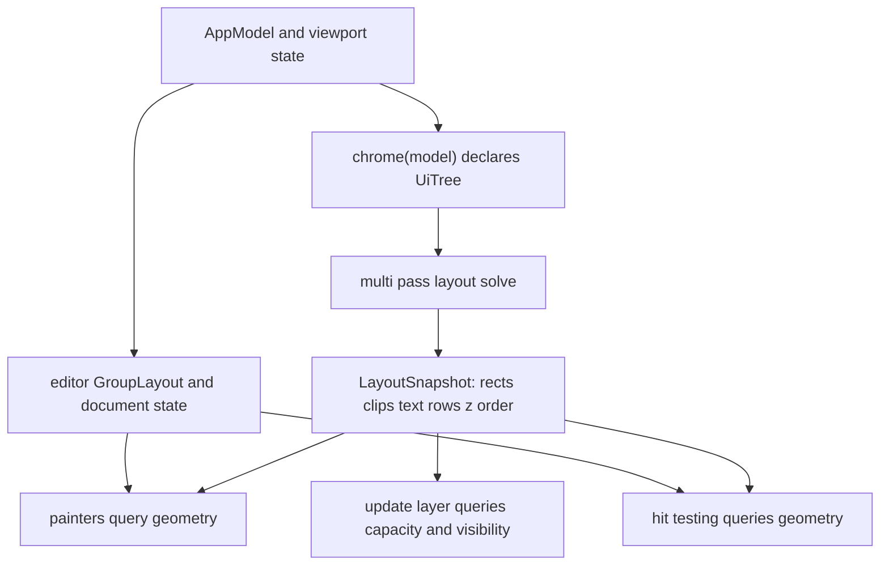
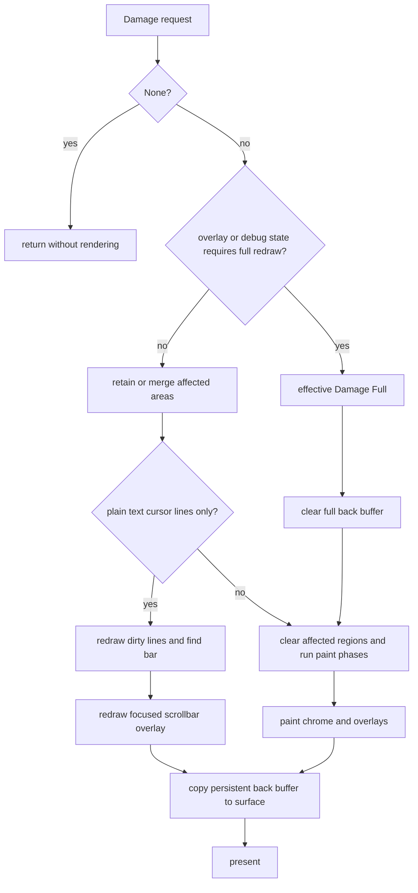

# Rendering, Layout, Hit Testing, and Damage

Token’s view is an immediate-mode painter over a persistent pixel back buffer. The model is the source of truth; layout is recomputed from it when a frame is needed, and painters query the resulting geometry rather than maintaining a second set of chrome rectangles. Input and update-layer queries use the same geometry. This is the central invariant: a surface must not be painted in one place, hit-tested in another, and scrolled using a third interpretation of its bounds.

## Coordinate systems and ownership

There are three useful coordinate spaces:

* **Window/physical pixels** are the root `Rect` and the `Frame` buffer. `Frame` drawing and clipping APIs use pixels; fractional solved rectangles are snapped at their edges so adjacent boxes remain gap-free (`src/layout/snapshot.rs#L62-L70`).
* **Layout pixels** are the floating-point rectangles in `LayoutSnapshot`: border box, content box, ancestor clip intersection, and z/draw order. The root is `(0, 0, model.window_size)` and layout receives the display scale factor for anchored logical-pixel constants (`src/layout/chrome.rs#L53-L70`, `src/layout/tree.rs#L158-L172`).
* **Editor/document coordinates** are document line and visual column. Conversion from window pixels accounts for group position, tab bar, gutter, vertical and horizontal scroll, and the same `GroupLayout` used by painting (`src/view/geometry.rs#L78-L103`). Tabs additionally have a horizontally scrolled tab-strip coordinate system, while row lists use pixel scroll offsets and map back to absolute row indices.

`src/layout/` owns the declarative chrome tree and its solution. `view::geometry` owns editor viewport/gutter transforms that depend on document state. `view::frame::Frame` owns safe pixel operations and nested clipping. Individual painters own appearance and content-specific drawing, but not independent shell geometry.

## Model to snapshot

`layout::chrome::chrome(model)` declares the window shell: optional sidebar, editor area, right and bottom docks, and status bar. Active panel content and virtual row counts are included in the full path. `shell(model)` deliberately solves only outer rectangles for cheap update/input work; `sidebar_rows(model)` adds file-tree row geometry without inspecting dock contents. Missing keys mean that a dock or inactive panel is not visible, not that its rectangle should be guessed (`src/layout/chrome.rs#L24-L57`).

The tree solver runs these passes: text preferred widths, bottom-up fit widths, top-down final widths and grow/shrink distribution, wrapping, bottom-up fit heights, top-down final heights, top-down positioning and clip chains, anchored floating subtrees, then z-sorted draw-order emission (`src/layout/algorithm.rs#L5-L22`). Text measurement is supplied by a callback; chrome uses `CellMeasure`, keeping layout and monospace painting consistent. The snapshot stores text line ranges and widths, row-list solution data, content rectangles, clips, parents, keys, and draw order. It is therefore simultaneously the geometry authority for painting, hit testing, and capacity queries (`src/layout/snapshot.rs#L45-L81`).

*The shared snapshot connects model state to rendering, input, and visibility queries; editor-specific transforms additionally use document and viewport state.*

### Floats, text, and virtual rows

Floating elements are resolved after ordinary positioning against keyed solved rectangles. Caret-anchored popups carry their flip-above, edge-clamping, and width-rule behavior into the layout layer; their subtrees receive a z layer and are emitted after flow nodes (`src/layout/algorithm.rs#L48-L75`). This lets overlays participate in the same clip and ordering model without making the base flow depend on overlay painting.

Text leaves are measured for preferred width, wrapped at final width, and retain source byte ranges for painters. Uniform `RowList` panels do not materialize one node per item. `RowListView` is the authority for content height, maximum scroll, fully visible capacity, partially visible drawn range, row-at-y mapping, and reveal calculations. Painting and hit testing use the same viewport and clips, including partial rows (`src/layout/snapshot.rs#L148-L177`, `src/layout/snapshot.rs#L181-L218`, `src/layout/snapshot.rs#L237-L275`).

## Frame pipeline and paint order

A non-empty damage request first resizes the back buffer and surface if the window changed, solves chrome, and builds a `RenderPlan`. Building the plan computes splitters, synchronizes every editor viewport from current line height, character width, metrics, and find-bar inset, then derives effective damage and overlay flags (`src/view/mod.rs#L1943-L1993`, `src/view/mod.rs#L1008-L1075`). Viewport synchronization must happen before painting or coordinate conversion: editor painters and hit testing must see the same current scroll/content rectangles.

The normal paint sequence is editor groups (tab bars, content, find bar, scrollbars and unfocused dim), sidebar, right dock, bottom dock, status bar, modal, cursor/signature-help overlay, drop overlay, tab-drag ghost, and debug overlays. Each phase receives the plan’s snapshot and uses `Frame` clipping. Text painting uses cached glyphs and separate code/UI font roles; editor text also adds focused find decorations and document diagnostics before drawing the text area and gutter (`src/view/mod.rs#L557-L637`, `src/view/mod.rs#L2037-L2124`).

`Frame` constrains every operation to the buffer and maintains an intersecting clip stack. `set_clip` replaces the stack; `push_clip`/`pop_clip` are for balanced nested clips. Rounded corner coverage is cached by physical radius, and glyph caches survive across frames (`src/view/frame.rs#L76-L97`, `src/view/frame.rs#L146-L180`).

## Hit testing and scrolling

For chrome, `LayoutSnapshot::hit` scans reverse draw order, rejects points outside a node’s clip or rect, and returns the nearest keyed self or ancestor. Thus a topmost floating control wins, while an unkeyed text/container hit resolves to its meaningful keyed owner (`src/layout/snapshot.rs#L97-L123`). The higher-level hit-test module combines this with explicit editor, splitter, tab, dock, modal, and overlay rules; editor coordinates are converted through `GroupLayout`, not by subtracting an approximate window offset. Hover intentionally rejects gutter, ghost text, whitespace below EOF, and other non-source cells (`src/view/geometry.rs#L106-L121`).

Scroll state remains in the application model; layout reads offsets rather than mutating them. Tab strips use `group.tab_scroll` in their solved tree (`src/layout/editor.rs#L76-L81`). Row-list scrolling is pixel-based, clamps to content minus viewport, draws intersecting partial rows, and maps only points inside the viewport to rows. When selection moves, reveal uses the smallest movement that makes the complete row/range visible, with oversized ranges aligned at the top (`src/layout/snapshot.rs#L160-L218`).

## Damage, redraw, and fast paths

Commands accumulate `Damage::None`, `Damage::Areas`, or conservative `Damage::Full`. Areas distinguish the editor, status bar, and document-relative cursor lines; `Full` is the correctness fallback. Merging treats `None` as identity, `Full` as absorbing, deduplicates regions, and combines cursor-line lists (`src/commands.rs#L757-L830`). Rendering returns immediately for `Damage::None`.

Before planning, transient cursor/signature-help and drop-hover overlays force a full redraw because their previous pixels are not saved; debug/performance overlays do the same. Otherwise the incoming damage is retained. The plan clears only the affected editor rectangle and/or status-bar rectangle, preserving the persistent back buffer elsewhere (`src/view/mod.rs#L981-L1005`, `src/view/mod.rs#L1077-L1102`).

The most selective path is cursor-lines-only damage in plain-text mode. It skips the normal clear and full phase pipeline, redraws the dirty document lines and find bar, then redraws focused-group scrollbars because line fills cover the scrollbar’s overlay columns. Non-text modes fall back to the ordinary partial/full plan (`src/view/mod.rs#L1995-L2031`, `src/view/mod.rs#L1037-L1060`). Even after partial drawing, the complete back buffer is copied to the surface and presented; damage controls work, not the presentation contract (`src/view/mod.rs#L2143-L2158`).

*Damage chooses between no work, a cursor-line fast path, and a region/full pipeline; all paths present the resulting persistent back buffer.*

## Safe change points and focused tests

When changing chrome geometry, update the declaration in `layout::chrome` or the relevant layout module first, then make painters and hit testing query its key. When changing editor content geometry, change `GroupLayout` and verify both `editor_text` and `pixel_to_cursor`; do not add a renderer-only offset. When adding an overlay, define its anchor/z/clip behavior and include its damage invalidation, especially dismissal and resize behavior.

The highest-value regression coverage is the pure geometry/layout surface: tab width and tab clipping, pixel-to-cursor and hover rejection, snapshot hit ordering and clip chains, row-list capacity/drawn-range/row mapping/reveal, and damage merge semantics. Also exercise cursor-line redraw with scrollbars enabled, overlay-forced full redraw, window resize, and missing-key visibility. These tests protect the invariants that matter more than individual painter snapshots: one solved geometry, consistent coordinate transforms, clipped topmost hits, and no stale pixels after a transient overlay disappears.
