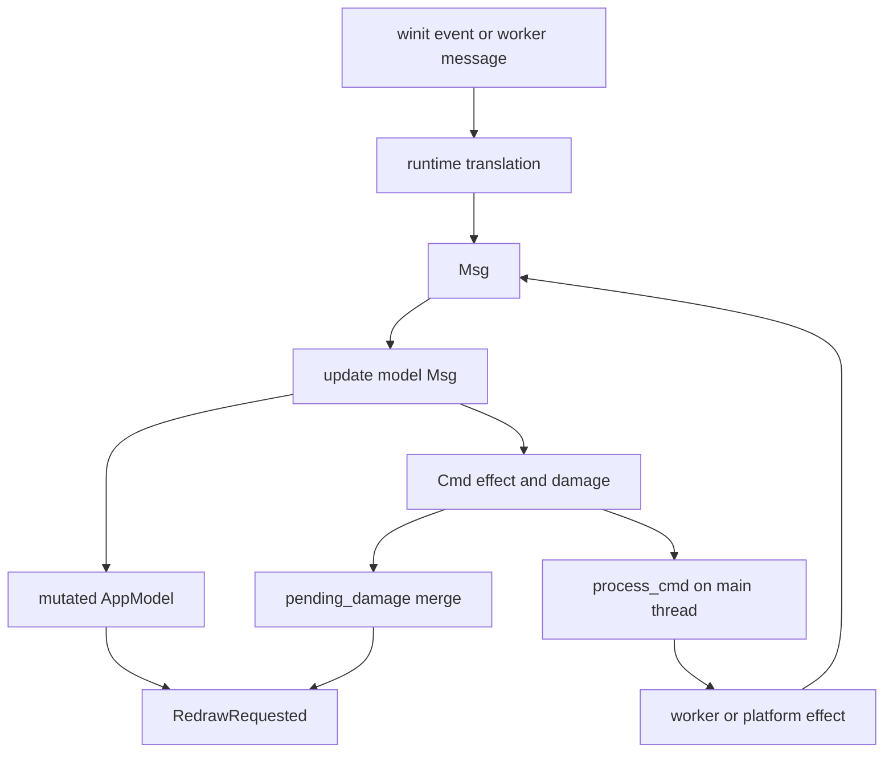
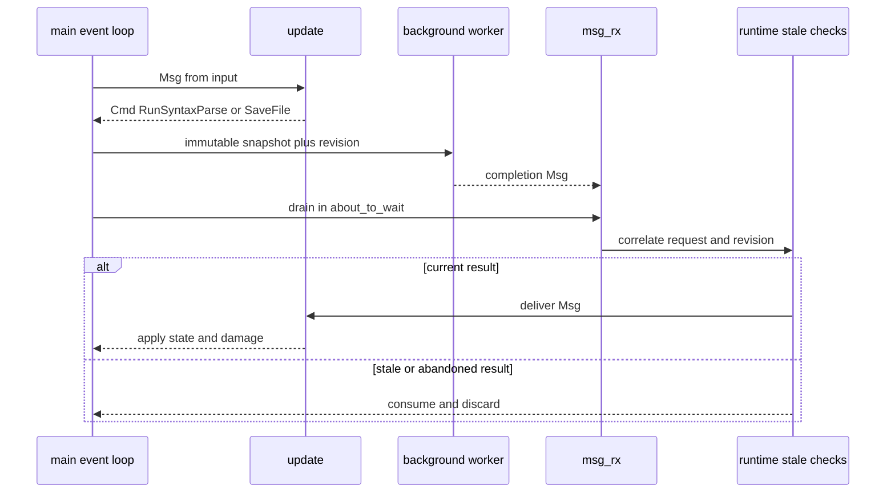

# Runtime, Event Loop, and Message Updates

Token is an event-driven desktop application. The winit `ApplicationHandler` owns the platform event boundary; `AppModel` owns UI/editor state; `update(model, Msg)` is the state-transition boundary; and `Cmd` describes effects that the runtime must perform after the transition. The important ownership rule is that model mutation, update dispatch, command interpretation, and rendering happen on the event-loop thread. Worker threads perform blocking or expensive work and send typed `Msg` values back through a channel.

## Startup and ownership

`main` initializes tracing, handles the separate `automate` and `mcp` entrypoints, parses `CliArgs`, optionally hands off to an existing instance, and converts arguments into `StartupConfig`. It starts renderer preparation and application preparation before creating the event loop. Preparation failure is warning-level and falls back to synchronous behavior rather than silently preventing the application from starting. The event loop is then built, an automation proxy is created, and `App::new` receives the startup model preparation and optional renderer preparation before `run_app` begins.

`AppPreparation` runs `prepare_app` on the `token-app-loader` worker. That worker creates the keymap and model, loads startup configuration, opens a workspace, resizes the model, creates/restores a session where applicable, prepares startup files using the same update-and-install path as later opens, applies demo content, and clamps the requested initial cursor position. The resulting `PreparedApp` is transferred back when the runtime initializes `App`; the model is not concurrently edited by the loader after handoff. Session restoration is skipped for demo mode, and startup file failures are counted and surfaced in status text.

The first `resumed` callback creates the window and softbuffer context, initializes the renderer, and exits the event loop on any of those failures. Nonessential work such as the workspace filesystem watcher and macOS menu installation is intentionally deferred until after the first paint. This keeps first-frame preparation separate from operations that can block or add startup latency.

```mermaid
sequenceDiagram
    participant Main as main thread
    participant Prep as app loader worker
    participant Loop as winit event loop
    participant App as App
    participant Model as AppModel
    Main->>Main: parse CLI and start preparation
    Main->>Prep: prepare_app(config)
    Prep->>Model: build config session and startup tabs
    Prep-->>Main: PreparedApp
    Main->>Loop: build event loop and run_app
    Loop->>App: resumed()
    App->>App: create window context and renderer
    Loop->>App: RedrawRequested
    App->>App: render first frame
    App->>App: schedule deferred startup work
```

*This sequence shows preparation on a worker followed by event-loop-owned window creation and first paint.*

## Event dispatch and input translation

`window_event` ignores events for other windows, passes the matching `WindowEvent` to `handle_event`, merges any returned command's damage into `pending_damage`, executes the command, and requests a redraw when `needs_redraw` is true. `CloseRequested` enters the same update path as application quit, while resize and scale-factor changes become `AppMsg` values. `RedrawRequested` refreshes terminal-link cursor state, renders, and reports render errors without panicking the event loop.

Keyboard dispatch has deliberate priority. Settings keymap capture gets first refusal, then cursor-anchored completion/documentation overlays claim their navigation keys, then editor-specific actions are checked, then the declarative keymap resolves a command sequence, and finally `handle_key` handles context-dependent cases. `handle_key` covers modal and CSV routing, ordinary character insertion, selection-aware navigation, and the Option double-tap gesture. A bare Option double-tap within 300 ms activates the multi-cursor gesture; release clears it, while another key prevents it from seeding a new gesture. IME preedit only tracks composition for auto-save; committed text continues through the normal input dispatcher.

Mouse handling is centralized in `runtime/mouse.rs`. Pointer movement updates a hit-tested target and only requests hover repaint when the target changes. Presses use the same hit-test result for focus and behavior across editor, tabs, sidebar, docks, modal controls, terminal, and CSV cells. Drag priority is explicit: splitter, scrollbar, sidebar/dock resize, tab drag, find/settings selection, terminal selection, and editor selection are handled in order. Click counts are tied to a `ClickRegion`, preventing a click on one surface from becoming a double-click on another. Wheel input is translated to pixel or discrete scroll messages; the editor pixel message identifies the pane under the pointer rather than assuming keyboard focus.

## Messages, updates, and commands

All state changes should enter through `update(&mut model, Msg)`. The wrapper performs cross-cutting reconciliation before and after the specialized handlers: file policy, scroll-animation cancellation, closing and usage cleanup, file-change and auto-save reconciliation, completion/inline cleanup, loading-state synchronization, folding, find scheduling, workspace-symbol and hover reconciliation, and redraw/status adjustments. Specialized update modules handle editor, document, layout, UI, syntax, completion, terminal, workspace, and LSP message families. This keeps state transitions deterministic and keeps runtime effects out of update handlers.

An update returns at most a command tree (`Cmd`, including `Batch`, redraw commands, file operations, worker requests, terminal and LSP operations, persistence, clipboard, and quit). `process_cmd` interprets that tree on the main thread. It starts workers lazily, sends work to ordered file I/O, queues find/path/syntax/LSP work, applies renderer metrics, schedules auto-save, launches dialogs or OS actions, and routes failures back as messages. A command is therefore an effect description, not permission for an update handler to perform blocking I/O.



*This flow shows the closed loop from platform input or worker output through the update layer and back to effects or painting.*

## Background results and stale-result safety

The runtime drains `msg_rx` during `about_to_wait`, after first handling automation and terminal-spawn completions. File-change messages are coalesced for 200 ms before becoming `FilesChanged`. Other messages are passed through interception layers for definition, hover, signature help, rename, formatting, references, code actions, completion, resolve, and workspace-symbol replies. Interceptors correlate raw worker request IDs with runtime-only pending state; unknown, abandoned, or superseded replies are consumed and discarded rather than allowed to mutate the model.

Revision and identity checks are the central invariant: a worker may inspect an immutable snapshot, but only a result matching the still-current document/request revision may be presented. Syntax completion is accepted only when the model's applied highlight revision equals the returned revision. Completion and LSP requests have explicit deadlines; most late replies are dropped, while an expired completion-item resolve used for an explicit accept emits an empty outcome so Enter cannot remain blocked. Diagnostics are version-ordered: stale publishes are dropped, and successive publishes for one URI are coalesced so the newest version wins.

The terminal spawn path illustrates main-thread installation. A worker returns PTY construction results; the runtime checks that the session is still pending, creates `TerminalSession` on the main thread, installs it, restores the prior focus, and kills a result that is no longer wanted. Spawn failure clears pending state, reports a status message, and damages the status bar. File workers similarly return `FileLoaded`, `SaveCompleted`, or prepared-open messages. Save replies carry the exact written snapshot, so an older write cannot mark newer edits as saved. The ordered file worker drains queued writes during drop, preserving write ordering during teardown.



*This sequence highlights that workers never apply UI state directly and that stale-result checks precede update dispatch.*

## Redraw, damage, and idle scheduling

Commands expose full or area-specific damage. Runtime entrypoints merge damage from window events, asynchronous messages, timer-driven updates, and command batches into `pending_damage`; `render` takes and clears that aggregate before invoking the renderer. Rendering also synchronizes the IME caret rectangle and webviews, records performance data, and completes frame-based automation responses. A redraw is requested only when a command or maintenance operation says the visible state changed, while cursor blink and status expiration add their own damage.

`about_to_wait` is the maintenance coordinator. It drains automation and worker messages, debounces filesystem changes, processes watcher updates, fires syntax/LSP/completion/inline/auto-save deadlines, advances active scroll animation at an 8 ms cadence, expires transient status text, and exits if a non-window command requested quit. It sets `ControlFlow::WaitUntil(next_wake(now))`; `next_wake` is the minimum of blink, animation, watcher debounce, auto-save, worker/request deadlines, transient expiry, hover dwell, and deferred-startup deadlines. Past deadlines are excluded where necessary so the loop does not spin at 100% CPU.

## Shutdown and failure behavior

`Cmd::Quit` marks `should_quit` after initiating graceful LSP teardown. `window_event` and `about_to_wait` both honor that flag and call `event_loop.exit()`. In `exiting`, the runtime closes the file-worker sender, applies queued save/load/prepared-open replies that are safe to apply, saves the session when configured, answers `--wait` automation clients before removing the endpoint, stops inline and clipboard workers, and removes its automation endpoint. Window/context/renderer initialization failures log an error and exit; worker startup or send failures are converted into failure messages where possible, while nonessential watcher failure is logged and leaves the application usable.

## Invariants and safe extension points

Before changing this runtime, preserve these invariants:

- Only the event-loop thread mutates `AppModel`, installs terminal sessions, interprets `Cmd`, merges damage, and renders.
- Workers communicate by messages and immutable snapshots; they must not hold or mutate UI state.
- Every asynchronous result must carry enough identity (document/session/request ID and usually revision or generation) to reject stale work.
- Update handlers describe state transitions and return commands; blocking file, process, clipboard, dialog, and parser work belongs in runtime workers/effect handlers.
- Redraw damage is accumulated until paint, and every visible asynchronous state change must either return redraw-needed damage or explicitly request a redraw.
- Shutdown must answer external waiters before removing their endpoint and must preserve ordered file writes.

To add an asynchronous feature, define a message and pending-request identity, add an update transition, return a command describing the work, start or reuse a worker in `process_cmd`, deliver its result through `msg_tx`, and add stale/deadline handling to the `about_to_wait` drain and `next_wake`. Focused tests should exercise the pure update transition, the runtime's stale-result and failure path, and the relevant input translation. Existing coverage in `src/main.rs` tests key-to-message behavior and resulting cursor/selection state; runtime mouse tests cover hit-testing, drag ownership, and click-region semantics. Tests should assert ownership and ordering—not merely that a symbol or branch exists.

## Related code and documentation

- `src/main.rs`: process entrypoint, preparation startup, event-loop construction.
- `src/runtime/app.rs`: `ApplicationHandler`, event dispatch, command execution, worker drain, timers, rendering, and shutdown.
- `src/runtime/input.rs` and `src/runtime/mouse.rs`: keyboard/mouse translation and hit-test ownership.
- `src/messages.rs`, `src/update/mod.rs`, and `src/commands.rs`: message taxonomy, state transitions, and effect vocabulary.
- `src/runtime/file_io.rs`: ordered worker jobs, startup file preparation, reads, writes, and failure replies.
<!-- openwiki: broken internal link [/openwiki/integrations/automation.md] file "/openwiki/integrations/automation.md" does not exist. Fix the href or restore the target, then delete this comment. -->
- See also [Rendering and layout](rendering-layout.md), [Editor state](/openwiki/concepts/editor-state.md), [Automation](/openwiki/integrations/automation.md), and [Startup session workflow](/openwiki/workflows/startup-session.md).
