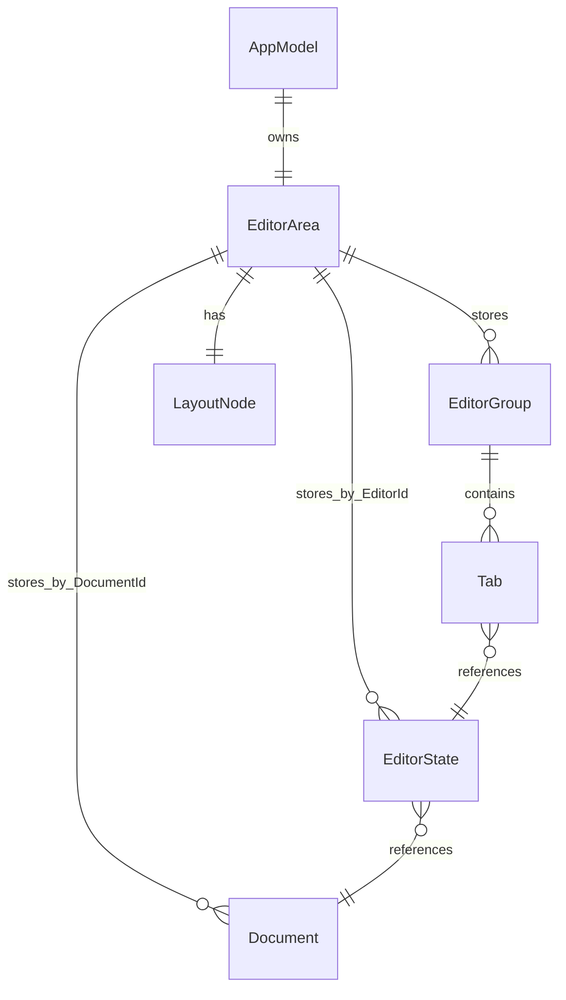
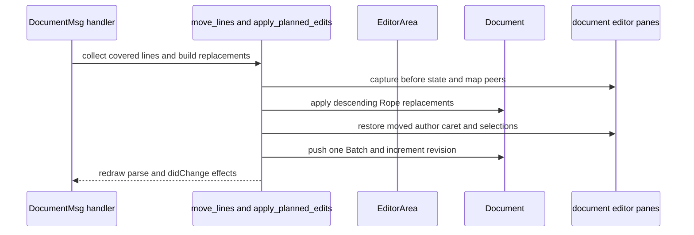
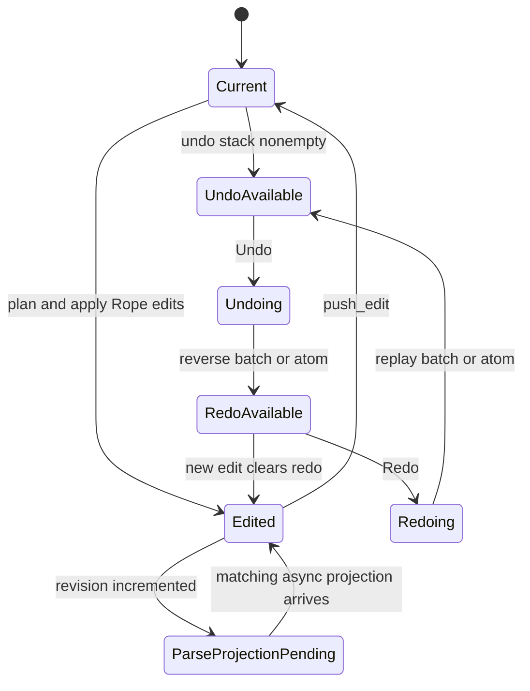

# Editor Model, Documents, Cursors, and Undo

The editor uses an Elm-style model: update handlers mutate `AppModel`, while rendering and asynchronous services consume projections of it. The authoritative editing state is the `EditorArea`—its document map, editor map, groups, tabs, and layout tree—not the renderer, syntax worker, viewport cache, or UI overlay.

## Ownership hierarchy

`AppModel` owns application-wide state, including `editor_area`, UI, configuration, workspace, docks, terminals, panels, LSP UI, and navigation history. `EditorArea` owns open text entities and their relationships. A `Document` owns one shared `Rope` and file/editing metadata; an `EditorState` is a view of one document and owns pane-local interaction state. Two panes may therefore show the same document while keeping independent cursors, selections, viewport, wrapping, folds, and other view state.

This shows ownership and ID-based references: a tab is not a document, and an editor view is not a second buffer.

`DocumentId`, `EditorId`, `GroupId`, and `TabId` are distinct generated identities. `EditorArea::single_document` assigns the initial IDs, stores the document and editor, connects the editor to the document, and then creates the first group and tab. The normal join is `Group -> Tab -> EditorState -> DocumentId -> Document`; display names and file status are derived through that join rather than duplicated in tab state (`src/model/editor_area.rs#L16-L30`, `src/model/editor_area.rs#L64-L105`, `src/model/editor_area.rs#L214-L243`, `src/model/editor_area.rs#L252-L300`). Closing also reasons about shared documents: close state records `DocumentId` and document revision, queues saves by document, and supports Save, Discard, or Cancel for tab, group, and application close (`src/model/closing.rs#L7-L66`).

## Document truth and projections

`Document.buffer: Rope` is authoritative text in character offsets. File path and identity, untitled naming, modification state, undo/redo stacks, saved snapshot, save state, and `revision` describe persistence and history. `cursor_to_offset` and `offset_to_cursor` clamp positions and convert between `(line, column)` and Rope character offsets; a column must not be treated as a byte index (`src/model/document.rs#L83-L149`, `src/model/document.rs#L438-L455`).

Syntax highlights and tree, outline, folds, diagnostics, LSP features, language metadata, wrapping, ghost text, overview marks, and bracket matches are projections or asynchronous interaction data, not alternate text stores. Semantic highlights are accepted only for the matching document revision and language; diagnostics are refreshed from the LSP manager and converted/clamped for editor use (`src/model/document.rs#L123-L149`, `src/model/document.rs#L490-L510`).

`Document::push_edit` records an edit, clears redo, marks the document modified, and increments the wrapping revision counter. A new edit after undo is consequently a new branch and cannot be redone through the old branch. Save identity is based on the saved buffer/path snapshot, not history depth: undoing to text that looks saved does not make history depth a safe substitute for saved state (`src/model/document.rs#L479-L488`).

## Pane-local cursor and selection state

`EditorState` keeps parallel `cursors` and `selections` vectors. Entry `i` in each vector belongs together; cursors are sorted by document position and `active_cursor_index` selects the focused cursor for scrolling and primary highlighting. A valid editor has a nonempty, matching pair of vectors and an active index within bounds (`src/model/editor.rs#L675-L747`). Positions use character columns and are converted through the document.

Selections may be empty insertion points or non-empty ranges with independent anchor and head orientation. Editing invalidates occurrence state and semantic selection history; undo restoration restores durable cursor/selection state and clears those transient states (`src/model/editor.rs#L23-L36`, `src/update/document.rs#L713-L719`, `src/model/document.rs#L44-L80`). Cursor operations sort and deduplicate carets while preserving which logical caret is active, so cursor-changing code must update both vectors and remap the active index (`tests/multi_cursor.rs#L84-L168`).

## One planned-edit transaction

Text commands enter at `DocumentMsg` in `update_document_inner`. Insertion, deletion, paste, indentation, duplication, and line movement first plan character-offset edits, then share `apply_planned_edits`. Planned edits are applied in descending offset order, so an edit does not invalidate the start positions of edits still waiting to run. Selection replacement is one `Replace` atom rather than separate delete and insert actions, making typing over a selection atomic for undo (`src/update/document.rs#L707-L789`, `src/update/text_edits.rs#L388-L459`).

The planner captures every pane currently displaying the target `DocumentId`. It maps cursor and both selection endpoints in unaffected panes through the planned changes, applies the Rope edits, restores or places the edited pane's carets, deduplicates them, refreshes bracket state, and captures the resulting `editors_after` snapshot. The document then receives one `EditOperation::Batch` containing the atomic operations plus `editors_before` and `editors_after` snapshots. Those snapshots contain editor ID, all cursors, all selections, and active index; they intentionally omit layout, caches, and the buffer (`src/model/document.rs#L10-L80`, `src/update/text_edits.rs#L409-L535`). The same path schedules redraw, syntax parsing, and debounced `didChange` effects.

### Moving lines is a document transaction

`MoveLinesUp` and `MoveLinesDown` are not a view-only cursor operation. `move_lines` finds the focused document, collects all lines covered by all cursors, merges adjacent lines into runs, and ignores only runs already at the requested document boundary. For each movable run it builds a replacement of the run plus its neighboring line, preserving each line's actual ending—including CRLF and an unterminated final line. It sorts those replacements by descending offset and sends them through the shared planner (`src/update/document.rs#L594-L705`).

The planner is given `EditCarets::Restore`: it captures the focused pane's complete pre-edit state, maps every cursor and selection line through `moved_line`, then restores that state after the Rope transaction. The active cursor is therefore mapped with its pane rather than recomputed from focus, and peer panes are mapped through the same edits. A boundary no-op resets visibility/blink and redraws but creates no history entry (`src/update/document.rs#L624-L705`, `src/update/text_edits.rs#L393-L535`).

This sequence shows line movement as one shared-document edit while preserving pane-local state.

For multiple cursors, disjoint covered blocks move independently in one batch; a block at the boundary stays put while other movable blocks still move. The operation preserves columns, selection orientation, and line endings (`tests/multi_cursor.rs#L325-L360`, `tests/text_editing.rs#L444-L505`).

## Undo, redo, and pane restoration

Undo pops the document undo stack, applies the operation in reverse, pushes it onto redo, refreshes modified state, and restores visibility. Redo performs the converse. Batch operations undo atoms in reverse order and redo them in original order; because offsets can refer to intermediate buffers, position mappings are updated after each atom (`src/update/document.rs#L743-L765`, `src/update/document.rs#L798-L922`).

For a batch, undo selects `editors_before` and redo selects `editors_after`. It restores each snapshot by `EditorId`, only when that editor still shows the target document, independent of current focus. Existing panes therefore recover exact multi-cursor selections and active indices. Editors created after the edit are not in the snapshot: their live positions are mapped through the history atoms, and panes that were closed remain closed. Legacy single `Insert`, `Delete`, and `Replace` records carry only one before/after cursor, so they collapse the focused editor to the corresponding cursor (`src/update/document.rs#L798-L863`, `tests/undo_pane_state.rs#L16-L179`).

This lifecycle separates history transitions from revision-checked asynchronous projections. The focused tests verify exact restoration of reversed selections, clipped Unicode positions, active state across focus changes, line movement in both panes, and redo invalidation after a new branch (`tests/undo_pane_state.rs#L16-L143`, `tests/undo_pane_state.rs#L98-L125`).

## Invariants and safe change surface

1. Rope mutation, history recording, caret placement, and revision advancement form one logical edit; do not update only one.
2. Every planned range is a character-offset range valid for the buffer version it targets. Apply planned ranges in descending order; when replaying a batch, transform positions after each atom.
3. A multi-cursor or line-movement action is one `Batch`: redo uses forward atom order, undo uses reverse order, and pane snapshots are joined by editor ID rather than focus.
4. A fresh edit clears redo. Save decisions use saved buffer/path state, not undo-stack depth.
5. After placement or restoration, cursor and selection vectors remain parallel, selections retain orientation, carets are deduplicated, and `active_cursor_index` addresses the intended caret.
6. Line movement must preserve line-ending text, skip only boundary runs, and use the shared planned-edit path so peer panes and undo history see the same transaction.

When changing editing behavior, start at `DocumentMsg`, follow planning through `apply_planned_edits`, Rope mutation, `push_edit`, caret mapping, and redraw effects. Test selection replacement, multi-cursor edits, focus changes with split panes, undo/redo, and undo followed by a new edit. The focused regression surface is `tests/text_editing.rs` for clamping, atomic editing, line movement, line endings, and boundary no-ops; `tests/multi_cursor.rs` for sorting, deduplication, active tracking, and disjoint blocks; and `tests/undo_pane_state.rs` for exact pane restoration, live new-pane mapping, closed-pane behavior, and branch semantics (`tests/text_editing.rs#L444-L505`, `tests/multi_cursor.rs#L325-L360`, `tests/undo_pane_state.rs#L40-L179`).
