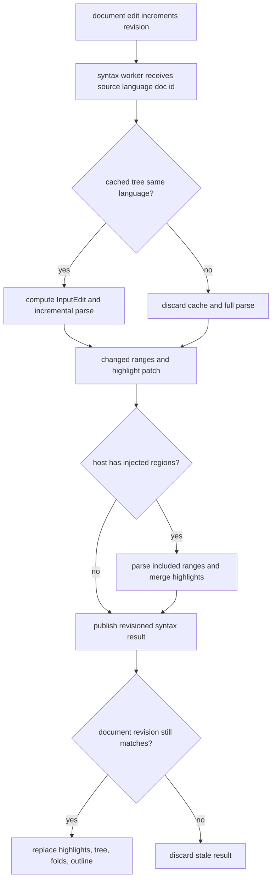
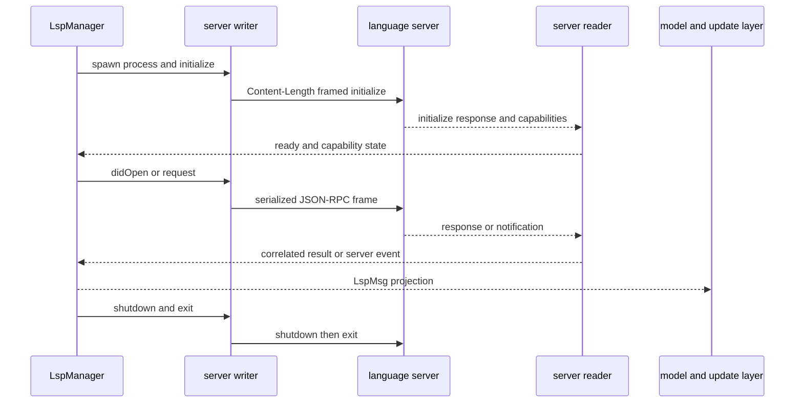

# Syntax, Parsing, Completion, and LSP State

This subsystem has four deliberately separate layers:

1. **Pure protocol and transformation code** in `src/lsp/` frames JSON-RPC, converts paths and positions, maps language IDs, interprets server capabilities, and maintains debounce bookkeeping. It does not own processes or UI state.
2. **Runtime ownership** is `LspManager` in `src/runtime/app.rs`. It owns child processes, server roots, open-document associations, diagnostics, pending requests, restart state, and routing. The model never owns a process handle.
3. **Model projections** live on `Document` and in `LspUiState`: language, revision, syntax highlights/tree/outline, diagnostics, and feature results are snapshots that can be replaced or discarded.
4. **Update/UI consumers** in `src/update/` turn commands and `LspMsg` events into editor decorations, popups, navigation, Problems entries, completion acceptance, formatting, and status messages.

The key safety rule is that a worker result is useful only if it still describes the document and user context for which it was requested. Document revisions, canonical URIs, and explicit server/root routing carry that context across asynchronous boundaries.

## Language detection and session overrides

`LanguageId::from_path` first checks registered special filenames and compound suffixes, then the ordinary extension, and falls back to `PlainText`. This ordering matters for names such as `.blade.php`, which must not be classified as PHP merely because its final extension is `php`. The registry also supplies display names, fence aliases, parser/highlight definitions, folding profiles, and the primary tag shared with Markdown injection and LSP synchronization (`src/syntax/languages.rs#L22-L86`, `src/syntax/registry.rs#L48-L69`).

`Set Language...` is a **session-only pinned override**. `Document.language_pinned` causes the selected `language` to survive an external reload and Save As rather than being re-detected from the new path; it is not persisted. An unpinned document follows its filename again. Fence aliases are independently resolved for embedded Markdown code, so a document's host language and an injected region's language need not be the same (`src/model/document.rs#L123-L138`, `src/syntax/parser.rs#L100-L125`).

The same registry is an extension point: adding a language requires a registry definition and, where supported, a grammar, highlight query, folding profile, outline extractor, injection behavior, and LSP language tag. Plain text intentionally has no parser/highlight pass and returns an empty syntax result (`src/syntax/parser.rs#L607-L681`).

## Tree-sitter parsing, highlights, folding, and outline

`ParserState` is worker-local because Tree-sitter parsers are not `Sync`. It caches one parser and compiled query per language and a `DocParseState` per `DocumentId`, including the language, tree, source text, and prior highlights. On an edit it computes an `InputEdit`, edits the old tree, and asks Tree-sitter to incrementally parse; if that fails it discards the cache and performs a clean parse. The old source/tree are also used to calculate changed ranges, allowing highlight patches to be limited to affected lines. A language change or cache miss produces a full tree/highlight result (`src/syntax/parser.rs#L459-L535`, `src/syntax/parser.rs#L666-L760`).

Host grammars can expose injected regions. Markdown fenced blocks use their info string; HTML maps `script` to JavaScript and `style` to CSS; component formats, Astro, Dockerfile, Make, Tera, Hurl, and Typst have specialized injection matchers. `syntax_tree_snapshot` clones the host tree and parses each region with included ranges, retaining document-relative byte ranges and the request revision for structural consumers (`src/syntax/parser.rs#L100-L177`, `src/syntax/parser.rs#L546-L585`). Markdown additionally has a block plus inline pass, while embedded-language highlighting is combined back into the host result.

Caption: The syntax-worker path preserves incremental trees but never lets an obsolete revision replace the model.

Folding is a derived candidate set, not a parser-owned UI state. For a source no larger than 32 MiB, `folding::detect` uses a matching, same-revision, error-free `SyntaxTreeSnapshot` and collects language-profile node ranges, including injected trees. Otherwise—or when the snapshot is absent, mismatched, unsupported, or erroneous—it falls back to indentation folding. Regions are normalized and stamped with a content fingerprint; the profile deliberately excludes error and missing nodes and caps collection at 200,000 regions (`src/syntax/folding.rs#L94-L138`, `src/syntax/folding.rs#L141-L194`).

The outline is a structural projection of a Tree-sitter tree for the outline panel. `OutlineData` carries the source revision and roots; nodes carry a display kind (heading, module, class, function, field, element, and so on), name, range, and children. Consumers should treat it as replaceable and check its revision before using it (`src/outline/mod.rs#L10-L109`, `src/update/outline.rs#L90-L110`).

## LSP server catalog, routing, and lifecycle

`LspServerId` identifies a configured server instance, while `ResolvedServer` is the executable command, arguments, root markers, initialization options, and settings resolved from configuration. The global switch and per-server switch are both enforced at resolution. Associations are language-based; enabled explicit assignments win deterministically by server ID, and settings reject competing enabled assignments. TypeScript, TSX, JavaScript, and JSX intentionally share one `typescript-language-server` definition (`src/lsp/mod.rs#L25-L30`, `src/lsp/mod.rs#L102-L119`, `src/lsp/mod.rs#L147-L202`).

`LspManager` is authoritative for every `(server, root)` process. It tracks `Starting`, `Indexing`, `Ready`, `Restarting`, `Failed`, `Missing`, and shutdown states, mirrors those states to the model, and keeps failed roots so an explicit restart can retry them. Crash attempts are scoped to the server/root pair, use scheduled backoff, and reset after `Ready`; a deliberate quit sets `shutting_down` so its exit is not mistaken for a crash. A missing executable is memoized to avoid repeated spawn/error spam and is retried by an explicit restart (`src/runtime/app.rs#L422-L526`).

Each server uses three ownership threads: a writer owns stdin and serializes all outbound frames (including handshake auto-replies), a reader owns stdout and correlates responses/notifications, and a stderr drainer prevents a chatty server from blocking. The handshake gate prevents ordinary requests until initialization is complete. Transport writes `Content-Length` in UTF-8 bytes, flushes each frame, reads headers through `BufRead`, preserves buffered bytes for subsequent messages, and rejects malformed, missing-length, truncated, or invalid-JSON frames (`src/lsp/client.rs#L2-L12`, `src/lsp/transport.rs#L11-L72`).

Caption: Process I/O is isolated in the client workers; runtime routing and model projection happen outside the protocol transport.

## Document synchronization and coordinates

A path-bearing document is opened by ensuring the language's server/root and then sending `didOpen`; untitled documents are not synchronized. `LspManager.open_documents` records the document's server/root association, survives a crash, and drives re-`didOpen` after a fresh process becomes ready. `didClose` is sent only when the document is no longer referenced by any split/group, not merely when one tab closes (`src/update/lsp.rs#L32-L73`, `src/runtime/app.rs#L450-L464`).

Server capabilities gate every feature. `textDocumentSync` may be a numeric kind, options object, or absent: it becomes `Full`, `Incremental`, or `None`. Save support independently controls whether `didSave` is sent and whether it includes full text. Completion, hover, definition, references, workspace symbols, formatting, rename, and code actions are sent only when their advertised provider exists (`src/lsp/client.rs#L187-L301`).

Changes are debounced for 30 ms, but continuous typing cannot postpone `didChange` beyond 300 ms from the first edit. Explicit flushes happen before a request and before close, and the pending entry carries the latest revision (`src/lsp/sync.rs#L16-L24`, `src/lsp/sync.rs#L71-L129`). LSP coordinates are always UTF-16 code-unit columns: editor character columns convert through `char::len_utf16`, while incoming positions clamp defensively. A diagnostic whose start line vanished is skipped rather than clamped onto an unrelated line (`src/lsp/position.rs#L16-L81`).

## Requests, projections, and failure semantics

The runtime captures a request's document ID, revision, cursor or origin, server ID, and root in a pending payload. Each feature has a `FeatureSlot`: one current request per document, with older superseded requests retained until their response or deadline so late responses can be safely consumed. Superseding returns the old key for `$/cancelRequest`; timeout sweeps emit only current requests and remove abandoned leftovers. Server/root teardown clears all three maps (requests, current-by-document, and deadlines) for that scope (`src/runtime/lsp_slot.rs#L15-L133`).

The shared response gate drops a result when the document was deleted or edited, or is no longer the focused document. Cursor checks remain feature-specific: hover can remain valid for a mouse-dwell target after caret movement, whereas popup-producing features generally capture and verify their originating context (`src/update/lsp.rs#L169-L196`). Timeouts and crashes are non-panicking UI failures: requests are canceled or abandoned, status-producing features report an unavailable result, and completion resolve can fall back to applying the original item without resolved documentation or additional edits (`src/runtime/lsp_slot.rs#L78-L110`, `/src/runtime/app.rs#L401-L417`).

Diagnostics are the important exception to revision equality. `LspManager` keeps an authoritative full replacement per canonical URI, rejects out-of-order versioned publishes, and retains workspace URIs even without an open document. `Document.diagnostics` is only a projection for open documents; positions remain in LSP UTF-16 form until rendering or navigation, and vanished ranges are omitted (`src/runtime/app.rs#L465-L477`, `src/model/document.rs#L140-L149`).

Feature consumers are intentionally ordinary update modules: `update/hover.rs` formats hover content, `update/completion.rs` owns menu/resolve/accept behavior, `update/problems.rs` projects diagnostics, `update/workspace_symbols.rs` searches and presents workspace results, and the LSP update path handles lifecycle messages, navigation, references, rename, formatting, and stale-result guards. The transport/client layer should not be changed to implement UI policy; conversely, UI consumers should not reach into process handles.

## Operations and focused tests

For operations, configure the global `lsp.enabled`, server command/args, language associations, root markers, initialization options, and settings. A missing command produces a `Missing` state once per server/root until the user explicitly restarts it. Disablement tears down running servers and clears projected diagnostics; re-enabling is lazy and waits for the next matching open/edit (`src/update/lsp.rs#L86-L166`, `src/lsp/mod.rs#L162-L202`).

Focused tests protect the boundaries most likely to regress:

- language registry tests cover case-insensitive extensions, special filenames, compound suffixes, unique detection keys, and fence aliases (`src/syntax/languages.rs#L90-L172`);
- position tests cover UTF-8 versus UTF-16, astral characters, CRLF, clamping, and vanished diagnostic lines (`src/lsp/position.rs#L96-L199`);
- transport tests cover multiple frames, partial reads, huge payloads, malformed headers, truncation, and invalid JSON (`src/lsp/transport.rs#L75-L224`);
- synchronization tests cover trailing debounce, the 300 ms max-wait cap, flush-before-request, and monotonic revisions (`src/lsp/sync.rs#L167-L280`);
- `FeatureSlot` tests verify superseded entries do not leak, stale requests do not emit timeout outcomes, and root-scoped teardown preserves other roots (`src/runtime/lsp_slot.rs#L162-L238`);
- integration scenarios in `tests/lsp_fake_server_scenarios.rs`, plus formatting and folding tests, exercise server lifecycle, document behavior, syntax-derived folding, and async formatting against controlled fixtures.

When extending a feature, first add its capability gate and pending payload, then define its revision/focus/cursor rule, timeout behavior, and teardown cleanup before connecting an update/UI projection. This preserves the routing invariant: a response is interpreted only by the server/root and document context that created it.
