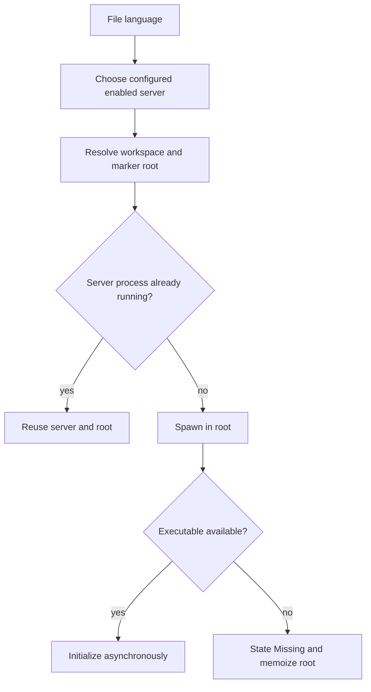
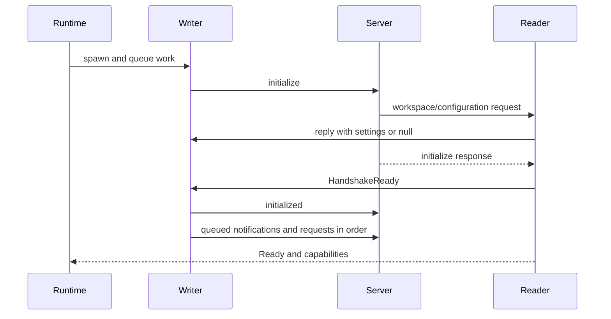
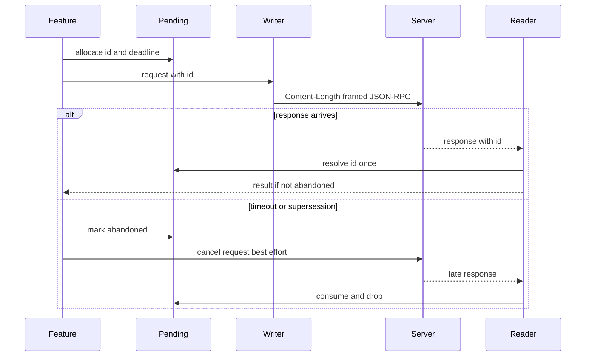
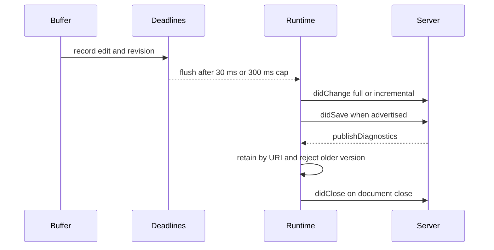
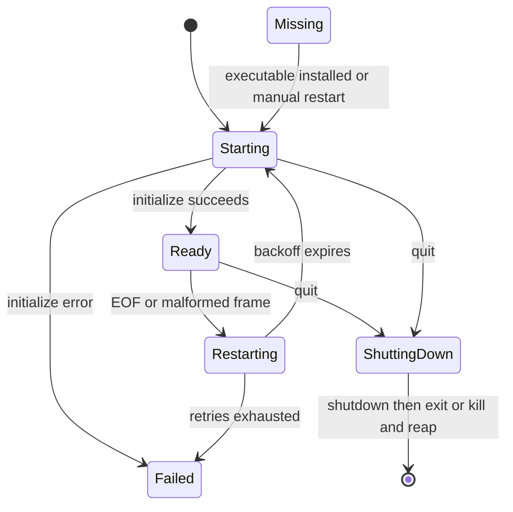

# Language Server and Formatter Integration

This page describes the runtime contract at the boundary between the editor and language tooling. The runtime owns processes and routing; the model exposes a render-only mirror of server state. Formatting is either an explicitly configured stdin/stdout executable or an LSP request.

## Configuration and routing

`LspConfig` is a user-owned catalog. The built-in templates (`rust-analyzer`, `typescript-language-server`, `ty`, `gopls`, `phpantom`, and `sema`) seed a new or legacy configuration, but are not runtime fallbacks. A saved `servers: {}` remains empty, and deleting a preset remains deleted. The same rule applies to formatters: an absent field gets defaults, while an explicitly empty map is authoritative. Saves materialize catalog version 1; unsupported catalog versions are rejected.

A server record can specify `languages`, `root_markers`, `command`, `args`, `enabled`, `initialization_options`, and `settings`. Preset values are copied into an independent editable record; missing fields do not inherit preset values at runtime. `initialization_options` is sent verbatim in `initialize`; `settings` answers `workspace/configuration` section lookups. A globally disabled LSP or locally disabled record cannot resolve to an executable.

Routing is one shared decision used by startup, document open, status, and menus. Enabled records associated with a language compete equally; hand-written ties resolve deterministically by server ID, while the Settings UI rejects competing enabled assignments. TypeScript, TSX, JavaScript, and JSX use one `typescript-language-server` definition and can be served by one instance per root.

### Root discovery

For a file, the runtime first uses the configured workspace root when the canonicalized file lies beneath the canonicalized workspace root. Otherwise it walks the file's ancestors, nearest first, and chooses the first directory containing any configured marker. If no marker exists, the file's parent is the detached root. Canonicalization handles symlinks and platform aliases; non-workspace roots are capped at four per session so scattered files cannot cause unbounded process creation.

*This flow shows routing, root selection, and lazy startup.*

## Server startup and lifecycle

`spawn_server` starts the configured executable without a shell, sets its current directory to the root, and pipes stdin, stdout, and stderr. It creates three worker responsibilities: a writer owning stdin and outbound ordering, a reader owning stdout and protocol dispatch, and a stderr drainer that logs lines. Draining stderr is mandatory: a chatty server must not block on a full pipe while stdout waits for progress.

The writer sends `initialize` immediately. It includes process and root identity, `rootUri`, `rootPath`, one workspace folder, client capabilities, and non-null initialization options. Notifications and client requests are queued behind a handshake gate until the initialize response arrives. The writer then sends `initialized`, flushes queued messages in order, and opens the gate. Server-initiated replies bypass that gate: a server may request `workspace/configuration` during initialization and must receive one result per requested item, with missing settings paths represented by `null`.

*This sequence shows startup ordering, including configuration during initialization.*

The runtime's authoritative lifecycle is `Starting`, `Indexing`, `Ready`, `Restarting`, `Failed`, `Missing`, and `ShuttingDown`; the model receives message-driven state changes for rendering and automation. Capabilities are stored only after a successful initialize response. Feature requests and synchronization are gated by the advertised capability rather than assuming support. In particular, absent `textDocumentSync` means no sync messages; full and incremental modes are distinguished, and `didSave` is sent only when save support is advertised, with text only when `includeText` is true.

The client advertises only implemented capabilities, including UTF-16 positions, semantic tokens, inlay hints, code lens, diagnostics, definition, hover, references, rename, code actions, signature help, completion, workspace symbols, watched files, and progress. The server's capability response gates each corresponding operation, including completion and signature trigger metadata.

## Real stdio transport and correlation

The wire format is LSP base protocol framing, not newline-delimited JSON: `Content-Length: <UTF-8 byte count>\r\n\r\n<body>`. The writer serializes JSON, writes the exact byte length, and flushes. The reader consumes headers line by line, ignores other headers case-insensitively, reads exactly the body length, and parses JSON. It handles partial reads, multiple frames in one read, truncated bodies, malformed headers, missing or non-numeric lengths, and invalid JSON as I/O/protocol errors.

Client request IDs are allocated from a per-server pending table. A response removes its ID exactly once. Unknown or duplicate IDs are logged and dropped, never panic or stop the reader. Superseded or timed-out entries are marked abandoned rather than immediately removed, because the server still owns the ID and may send a late response; the late response is consumed and discarded. A server exit clears the outstanding table. Feature slots additionally keep one current request per document, send `$/cancelRequest` on supersession, and clean up superseded leftovers when their deadlines expire.

*This sequence shows ID correlation and late-response safety.*

UI-level request limits are intentionally operation-specific: definition, hover, references, rename, and explicit formatting use 30, 30, 30, 30, and 10 seconds respectively; completion, signature help, and code actions use 10 seconds; completion resolve uses 3 seconds; format-on-save uses 2 seconds. These are abandonment limits, not a guarantee that the server stops. A timed-out format-on-save continues to the save without formatting.

## Document synchronization and formatting

On `didOpen`, the runtime records the document against one `(server, root)`, URI, and revision, and sends the current full text and mapped LSP `languageId` only when the server supports synchronization. The mapping uses conventional IDs such as `rust`, `typescriptreact`, `javascriptreact`, `python`, `shellscript`, and `makefile`.

Edits are coalesced per document: a trailing 30 ms debounce is bounded by a 300 ms maximum from the first edit in a burst. A flush-before-request and flush-before-close path prevents stale text. Full-sync servers receive the complete buffer; incremental servers receive the calculated change. `didSave` follows the capability and include-text rules above. Diagnostics are retained by canonical URI even for unopened files, versioned only to discard older publishes, and projected into an open document on `didOpen`.

*This sequence shows debounced synchronization and diagnostic ownership.*

For document formatting, selection formatting always uses LSP. Whole-document formatting prefers an enabled language formatter record; otherwise it uses LSP. The external formatter is launched without a shell, receives the unsaved buffer on stdin, runs in the file's directory, substitutes `{file}` inside one argument without shell interpretation, and reads stdout as UTF-8 replacement text. stdout is bounded by `MAX_FILE_SIZE`, stderr by 64 KiB, and both are drained concurrently with stdin writing and child waiting. A non-zero exit, invalid UTF-8, invalid executable, oversized output, cancellation, or the five-second formatter timeout is surfaced as a formatting error; failed save formatting reports that the file was saved unformatted. Responses are applied only if document ID, language, revision, and save intent still match.

## Restart and shutdown

EOF, malformed frames, failed initialization, and other reader failures report exit/failure to the runtime. A generation number distinguishes an old process's delayed EOF from a replacement at the same `(server, root)`. The runtime removes and reaps the dead child, clears root-scoped diagnostics and pending feature state, then retries after exponential delays of 200 ms, 400 ms, 800 ms and so on, capped at 5 seconds. After three retry attempts it records the root as failed; manual restart clears the failure/memoized missing state and retries immediately. A successful `Ready` clears the crash count and reopens tracked documents on the new process.

Shutdown is deliberately graceful: send `shutdown`, wait for the matching response up to the phase timeout and shared quit deadline, send `exit`, wait for process termination, then kill and reap if needed. Deliberate quit sets `ShuttingDown`, suppressing crash restart. The shared deadline prevents multiple servers from multiplying quit latency.

*This state diagram shows crash recovery and deliberate shutdown.*

## Focused verification

`src/lsp/transport.rs` tests exact framing, extra headers, partial reads, adjacent messages, truncation, malformed headers, invalid JSON, and large payloads. `src/lsp/client.rs` unit tests cover handshake gating, root selection, pending-entry abandonment, and capability interpretation. `src/lsp/sync.rs` tests language IDs and both debounce and max-wait behavior. Formatter tests cover Unicode stdin round trips, `{file}` and cwd handling, literal shell metacharacters, exit and UTF-8 errors, and killing/reaping on timeout.

The real integration suite in `tests/lsp_fake_server_scenarios.rs` launches `fake-lsp-server` through `spawn_server`, so it exercises real pipes and Content-Length frames rather than a mock. Scenarios cover configuration requests during initialization, never-responding servers, mid-request exit, malformed frames, unknown and duplicate response IDs, stderr floods, initialize errors, and representative feature exchanges. The real `rust-analyzer` handshake is an ignored test, run with `cargo test -- --ignored` when the executable is installed.
