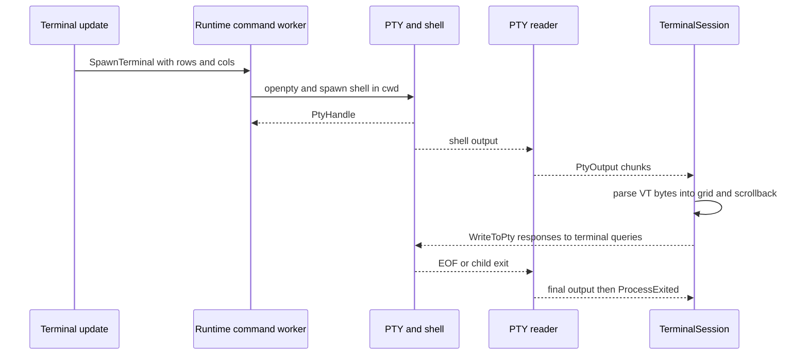
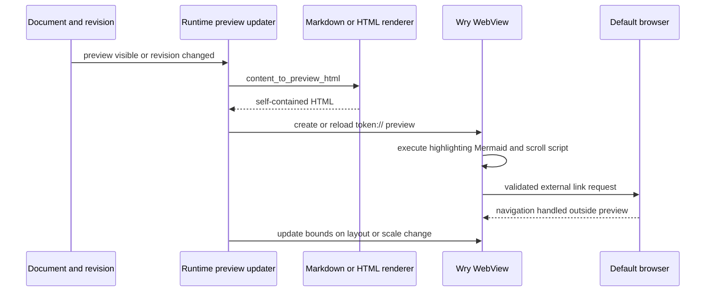

# Embedded Terminal, Markdown Preview, and OS Bridges

This page describes the integration layer where Token’s model and update loop meet operating-system services and embedded browser content. The important boundary is deliberate: the update modules mutate `AppModel` and return commands, while `src/runtime/app.rs` owns threads, native dialogs, webviews, and process effects. Terminal emulation is similarly kept behind `TerminalSession`, so the UI does not need to know the details of `alacritty_terminal` or `portable-pty`.

## PTY-backed terminal architecture

A terminal session is the combination of a shell process, a PTY master, and an ANSI/VT parser plus grid and scrollback. `Cmd::SpawnTerminal` is initiated by the terminal update handler after a tab receives an id and the visible terminal viewport has supplied its row and column count. The runtime then chooses the workspace root, falling back to the current directory and finally the temporary directory, and performs the potentially blocking spawn on a thread. Only one terminal spawn is allowed to be pending at a time; a failed spawn is reported back rather than leaving the tab permanently indistinguishable from a running shell (`src/update/terminal.rs#L43-L67`, `src/runtime/app.rs#L2786-L2825`).

`spawn_pty` starts the user’s default shell with the selected working directory. It uses `$SHELL`, with `/bin/zsh` as the macOS fallback and `/bin/bash` otherwise; when launched without an inherited `TERM`, it supplies `xterm-256color`, which is especially relevant to GUI launches from Finder. The PTY is opened at the requested size. A writer worker forwards keyboard input, paste data, and emulator responses to the shell, while a reader worker forwards shell output to the application message channel. Output is coalesced into chunks up to 32 KiB or flushed after 16 ms, avoiding message-queue flooding while keeping prompts responsive. A final flush precedes `ProcessExited` (`src/terminal/pty.rs#L20-L27`, `src/terminal/pty.rs#L141-L172`, `src/terminal/pty.rs#L192-L301`).

This diagram shows the PTY/session data flow, including the ordering of the final output flush and exit notification.

`TerminalEventProxy` is the reverse bridge from the emulator. It routes title changes, bells, redraw requests, and `PtyWrite` responses back through `Msg::Terminal`. Writing emulator-generated responses matters for interactive programs that issue cursor-position or device-status queries. Clipboard events, color requests, text-area-size requests, emulator exit, and child-exit events are intentionally ignored by this proxy in the current MVP; clipboard is handled by the application’s explicit copy and paste commands instead (`src/terminal/session.rs#L44-L105`).

The session owns the parser and `Term`, exposes read-only grid state to rendering, and keeps the scroll offset clamped to available history. Resizing updates both the emulator grid and PTY, while clear resets selection, grid, parser, and scroll position. PTY resize errors are ignored at this boundary, so a resize failure should be treated as a best-effort OS/PTY failure rather than a model transition (`src/terminal/session.rs#L108-L189`). Output for an unknown session id is discarded; a known process exit marks the tab `[exited]` and stores its exit code, leaving the tab available for inspection until the user closes it (`src/update/terminal.rs#L93-L119`, `src/panels/terminal.rs#L147-L171`).

### Input, selection, links, and tabs

The terminal panel’s layout snapshot is the shared source for tab hit testing and PTY sizing. Tabs are clipped in a viewport, while previous/next/new/close controls remain visible. Selecting a tab preserves each session’s independent history and focuses the terminal dock; the active tab is revealed after layout changes (`src/panels/terminal.rs#L17-L97`, `src/update/terminal.rs#L69-L91`). Keyboard input and paste become PTY writes, not document edits. Selection starts and updates in grid coordinates, retains the cell side, and copy returns `selection_to_string()` as `Cmd::CopyToClipboard`. Empty selections do nothing. This preserves wrapped Unicode and wide glyph behavior through the emulator’s selection implementation (`src/update/terminal.rs#L21-L42`, `src/update/terminal.rs#L121-L126`).

Terminal links are intentionally narrow and safe. `link_at` rejects out-of-grid and hidden cells, recognizes OSC hyperlinks and plain `http://` or `https://` text, searches across wrapped lines, bounds scanning at 4096 cells, and removes trailing sentence punctuation without stripping balanced URL parentheses. Both discovered and OSC URLs pass `util::is_web_url`, which requires a parseable URL with a host, no whitespace/control characters, and the `http` or `https` scheme. `file:`, `javascript:`, incomplete, and malformed values therefore never reach the browser (`src/terminal/links.rs#L19-L103`, `src/util/mod.rs#L12-L17`).

## Markdown and HTML preview

`content_to_preview_html` supports Markdown and HTML only. Markdown is parsed by `pulldown-cmark` with tables, footnotes, strikethrough, and task lists enabled. It emits a complete themed HTML document, adding `data-line` markers before block-level constructs for source/preview navigation. Syntax highlighting and Mermaid bundles are embedded from the repository and included only when the document contains ordinary code or Mermaid fences; there are no CDN or build-time network downloads (`src/markdown/renderer.rs#L8-L71`, `src/markdown/renderer.rs#L324-L368`). HTML documents are preserved when they already begin with `<!doctype` or `<html`; fragments receive a minimal document wrapper (`src/markdown/renderer.rs#L73-L99`).

The bundled browser script highlights non-Mermaid code and renders Mermaid from `textContent` under Mermaid’s `securityLevel: 'strict'`. If initialization or rendering fails, the source fence remains visible alongside a status message. Its scroll handler debounces events and posts the first visible `data-line` through `window.webkit.messageHandlers.scrollSync` when that WebKit bridge exists. Rust-side preview state also supports editor-to-preview line scrolling and an enable/disable flag; callers should not assume synchronization is active when that flag is off (`src/markdown/preview.js#L1-L16`, `src/markdown/preview.js#L17-L73`, `src/update/preview.rs#L38-L74`).

This diagram shows preview creation, revision-based reload, hosted bounds updates, and external-link delegation.

`WebviewManager` owns one `wry::WebView` per `PreviewId` plus locked protocol content. Creation is idempotent, stores content before building the child webview, and hosts it at `token://preview-<id>/index.html`. Existing content is replaced and reloaded only when the preview revision is stale; a successful submission is what calls `PreviewPane::mark_rendered`. Consequently, failed creation or reload remains eligible for a later retry rather than being recorded as rendered (`src/runtime/webview.rs#L39-L124`, `src/runtime/app.rs#L2261-L2357`, `src/markdown/preview.rs#L57-L85`). Bounds are converted from physical editor pixels to WebView logical coordinates using the window scale factor. Closing removes both the WebView and its protocol entry, and visibility can be disabled for modal UI (`src/runtime/webview.rs#L127-L163`, `src/runtime/webview.rs#L307-L320`).

The custom `token` protocol serves generated HTML only at `/` or `/index.html`. HTML-file previews may additionally serve relative resources. Resource requests reject `..`, require canonicalized paths to remain under the HTML file’s canonical parent, return 404 for missing files, and select MIME types by extension. A poisoned protocol lock returns 500. This is a local-resource boundary, not a general file server (`src/runtime/webview.rs#L172-L218`, `src/runtime/webview.rs#L222-L305`). Navigation to a validated web URL is sent to the system browser and canceled inside the WebView; non-web navigation is allowed for internal token/anchor behavior (`src/runtime/webview.rs#L79-L96`).

## Clipboard, dialogs, and browser opening

Clipboard operations are serialized through a dedicated worker. It lazily creates one `arboard::Clipboard`, processes copy and paste requests in order, and retains the clipboard object until the request channel closes. Retention is important on X11, where the owner may need to remain alive to serve later requests. Copy initialization or set failures are logged and do not crash the UI; paste failures produce an empty string and still send `PasteFromClipboard` when the application channel is available. Dropping the worker closes the queue and joins the thread, logging a panic during shutdown (`src/runtime/clipboard.rs#L8-L85`).

Open/save/folder dialogs use `rfd::FileDialog` from runtime command handling, each on a worker thread. Optional start directories, multi-file selection, and save suggestions are applied before the native dialog is shown. Cancellation is represented by an empty path collection or `None`; the worker sends the result back to the main message loop, and a failed result send is logged (`src/runtime/app.rs#L2833-L2908`). This keeps modal OS interaction from blocking the event loop, but callers must handle cancellation and unavailable dialog backends rather than treating selection as guaranteed.

All browser-opening paths share `open_web_url`. Validation occurs before spawning a detached thread that calls `open::that`; an OS launch error is logged and otherwise has no model-side failure result. The same policy protects terminal links and WebView navigation, so adding a new external-link source should reuse this boundary rather than invoking `open::that` directly (`src/runtime/mod.rs#L37-L46`).

## Platform boundaries and cleanup checklist

* **macOS:** Finder/Dock `open -a Token file` delivery is installed after winit builds its application delegate. `src/macos_open.rs` dynamically adds `application:openURLs:` to `WinitApplicationDelegate`, converts URL paths to the same `AutomationRequest::OpenPaths` path used by CLI handoff, and wakes the event loop. If the delegate is missing or the method cannot be added, Finder opens are disabled and a warning is logged (`src/macos_open.rs#L1-L53`). macOS also uses `/bin/zsh` as the shell fallback and WebKit’s `window.webkit` message-handler shape for preview scroll notifications.
* **Other desktop targets:** PTY creation is delegated to `portable-pty`; the fallback shell is `/bin/bash` when `$SHELL` is absent, and Windows test spawning explicitly uses `cmd.exe`. Native dialogs and browser opening are delegated to `rfd` and `open`, so backend availability and OS association determine the final behavior (`src/terminal/pty.rs#L141-L151`, `src/terminal/pty.rs#L304-L327`).
* **Process cleanup:** `PtyHandle::kill` uses a cloneable child killer so shutdown can terminate a child even while the reader is blocked. Writer failures stop the writer worker; reader EOF/errors stop reading, flush pending bytes, and emit an exit message. Closing a terminal tab must therefore be paired with the runtime’s terminal close path so the child is killed and the session removed; an exited tab is not automatically removed (`src/terminal/pty.rs#L29-L64`, `src/terminal/pty.rs#L259-L301`). WebViews and clipboard workers likewise have explicit removal/join behavior; do not retain protocol content or worker channels after their owner is gone.

## Focused tests that protect the boundary

The PTY tests spawn a shell without personal startup files, verify echoed output, and verify `ProcessExited` carries the correct session id. Session tests verify plain text and CRLF placement plus emulator-generated PTY writes (`src/terminal/pty.rs#L304-L398`, `src/terminal/session.rs#L228-L276`). Terminal-link tests cover wrapped URLs, balanced punctuation, OSC targets, unsafe schemes, hidden cells, and localhost URLs (`src/terminal/links.rs#L105-L146`). The terminal update tests are especially valuable for ensuring Unicode/wide-glyph selection does not edit the document and for tab-history preservation (`src/update/terminal.rs#L220-L285`, `src/update/terminal.rs#L287-L300`). Preview tests verify Markdown structure, escaped Mermaid source, strict Mermaid configuration, conditional inline bundles, and preservation of raw HTML (`src/markdown/renderer.rs#L374-L425`); WebView tests cover missing-preview failure, scale conversion, and dock resizing (`src/runtime/webview.rs#L322-L376`).
