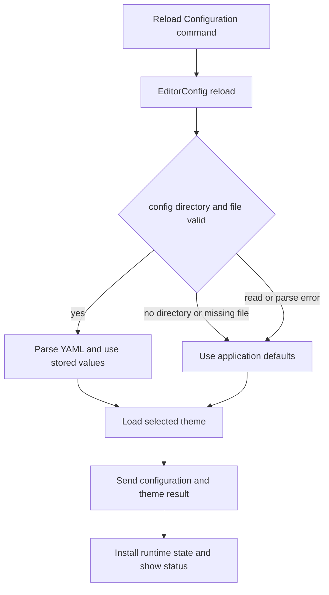
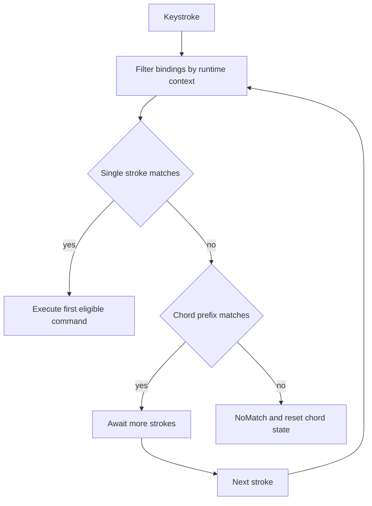
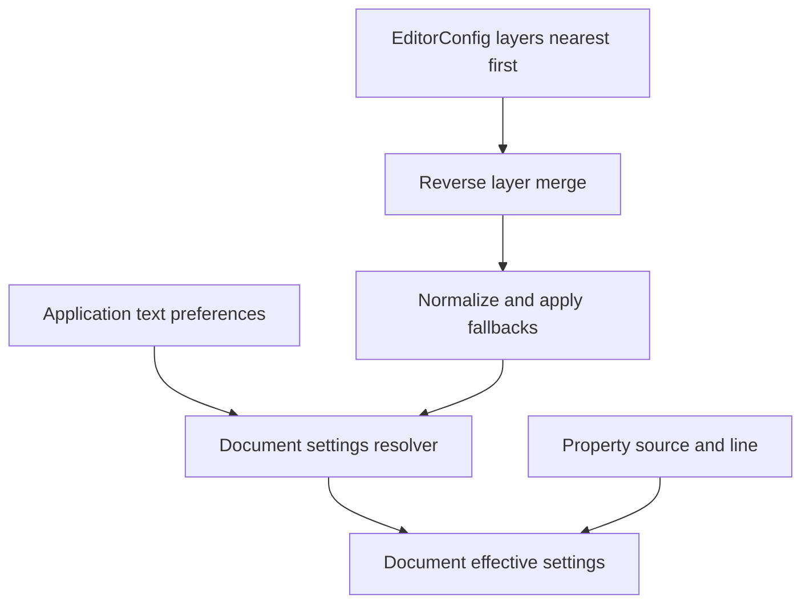

# Configuration, Keymaps, Themes, and EditorConfig

Token Editor has several deliberately separate configuration layers:

- **Persistent application configuration** is YAML at `config.yaml`.
- **Keymap configuration** is a separate YAML file at `keymap.yaml`.
- **Themes** are YAML files, either embedded in the binary or installed under the user configuration directory.
- **EditorConfig** is per-project/per-file policy and overrides the application’s text preferences for matching documents.
- **Runtime state** (the active theme, resolved document policy, pending chord, and open-session state) is not itself a second persistent configuration file.

Keeping these layers distinct matters: application defaults seed a missing field, but a deliberately saved empty catalog or formatter map remains empty; EditorConfig changes document behavior without rewriting the user defaults; and a reload replaces runtime configuration rather than merging arbitrary transient state into it.

## Where files are found

`src/config_paths.rs` is the single path authority:

| Item | Unix/macOS | Windows |
|---|---|---|
| Base directory | `$XDG_CONFIG_HOME/token-editor`, or `~/.config/token-editor` | `%APPDATA%\\token-editor` |
| Application config | `config.yaml` below the base directory | same |
| Keymap | `keymap.yaml` below the base directory | same |
| User themes | `themes/` below the base directory | same |

The directory is not required to exist at startup. Saving creates it (and theme installation creates `themes/`); if no home/config location can be determined, loading falls back to defaults and saving reports that no configuration directory is available.

## Application configuration

The top-level `EditorConfig` contains persistent text fallbacks, `editorconfig` enablement, session restore/save-on-exit, `theme`, `editor_font`, `ui_font`, cursor and editing display options, `lsp`, `formatters`, `completion`, `format_on_save`, and `auto_save` (`src/config.rs`). A minimal useful example is:

```yaml
theme: default-dark
editor_font: JetBrains Mono
ui_font: Inter
editorconfig: true
format_on_save: false
auto_save:
  mode: off
  delay_ms: 1000
  format_on_save: false
completion:
  enabled: true
  menu:
    enabled: true
    min_word_length: 3
    words: fallback
```

### Defaults are user-facing, not runtime overrides

`EditorConfig::default()` supplies the documented baseline: `default-dark`, `JetBrains Mono`, `Inter`, a 600 ms cursor blink, bracket matching/auto-surround/scrollbars/indent guides/automatic reload/explorer reveal enabled, 12 px status text, mouse hover enabled with a 300 ms delay, LSP enabled, and format-on-save/autosave disabled. Completion’s master switch and menu are enabled, while inline suggestions are off until a provider is configured. Autosave supports `off`, `on_focus_loss`, `after_delay`, and `on_focus_loss_and_delay`; its effective delay is clamped to 100 ms through 24 hours. Status-bar font size is clamped to 8–24 logical pixels at use time (`src/config.rs#L457-L518`).

These are defaults only. They are applied when a field is absent during deserialization. They do not silently repopulate an explicitly empty `lsp.servers` or `formatters` map. Formatter entries are stdin/stdout commands invoked without a shell; `enabled`, `command`, and `args` are the operational fields, while `preset_id` is installation guidance rather than inheritance (`src/config/formatters.rs#L8-L35`).

The LSP catalog is versioned: saves include `catalog_version: 1`. A legacy unversioned server map is migrated once at the input boundary; version 1 is authoritative, and an unsupported catalog version is a parse error. Missing server arguments, languages, or root markers mean empty/absent values rather than implicit preset values (`src/config/language_servers.rs#L10-L49`, `src/config/language_servers.rs#L58-L109`). See [LSP integrations](/openwiki/integrations/lsp.md) for server routing and process behavior.

### Read, parse, and save failures

`EditorConfig::load()` and `reload()` read `config.yaml` as UTF-8 YAML. The outcomes are intentionally distinguishable for reload feedback:

- no config directory: `NoConfigDir`;
- missing file: `FileNotFound`;
- unreadable file: `ReadError`;
- invalid YAML/schema: `ParseError`;
- valid file: `Loaded`.

The first four return a fresh `EditorConfig::default()` rather than partially applying a broken file (`src/config.rs#L520-L571`). A normal save creates parent directories, preserves unknown YAML keys, and refuses to overwrite a malformed existing document; comments and YAML formatting are not preserved by serialization (`src/config.rs#L573-L627`). This lets newer builds retain forward-compatible metadata while preventing a settings save from destroying an invalid file.

### Reload control flow

Use the application’s **Reload Configuration** command after changing `config.yaml`; it is not an automatic file watcher for the application config. The runtime reloads the typed config, loads the selected theme, and sends one result message for installation and user feedback. A failed theme load uses the theme loader’s error fallback while the configuration result still reports the config read/parse status.



Caption: Application configuration reload distinguishes load failures, then reloads the selected theme before the runtime installs the result (`src/runtime/app.rs#L2721-L2745`).

## Keymaps: public commands, YAML, resolution, and focus contexts

The built-in keymap is embedded at compile time from `keymap.yaml`; a user file at the configuration path is parsed and installed as the effective keymap. The file is a `bindings` list, with optional `platform` and `when` fields. Settings can also persist `base: token` or `base: conventional`; the base supplies bindings first, then the file's entries replace matching keystroke-and-condition pairs, add new entries, or use `Unbound` to remove a sequence. The parser itself accepts the binding list and rejects malformed keys, commands, and conditions rather than installing a partial map (`src/keymap/defaults.rs#L10-L52`, `src/keymap/preferences.rs#L29-L63`, `src/keymap/preferences.rs#L79-L120`, `src/keymap/config.rs#L15-L35`, `src/keymap/config.rs#L56-L84`).

```yaml
base: token
bindings:
  - key: ctrl+shift+s
    command: SaveFile
    when: [editor_focused, no_selection]
  - key: ctrl+k ctrl+f
    command: FormatDocument
```

Keys use whitespace-separated strokes for chords. Modifiers include `cmd`, `ctrl`, `shift`, `alt`/`option`, and `meta`/`super`/`win`; named keys, numpad keys, and `f1`–`f24` are supported. `cmd` means the platform command modifier. Entries for another platform are skipped during parsing. `Command` is the compatibility surface: the declaration macro creates the enum, canonical YAML spelling (`stringify!`), `FromStr` parsing, and the complete `Command::all()` registry together. There is no second hand-written command-name table; changing a variant name changes the persisted spelling. The macro test parses every variant name through YAML, so a new bindable command cannot silently become unavailable (`src/keymap/command.rs#L14-L51`, `src/keymap/config.rs#L86-L145`).

The resolver first considers a matching single-stroke binding, then a chord prefix. It returns `Execute`, `AwaitMore`, or `NoMatch`; chord state advances only on `AwaitMore` and resets after execution or a miss. Among matching bindings, conditional bindings are considered before unconditional ones, and declaration order otherwise decides the first eligible binding. Runtime filtering occurs before matching, so a command unavailable in the current focus mode cannot claim a key or chord prefix (`src/keymap/keymap.rs#L86-L128`, `src/keymap/keymap.rs#L142-L183`).



Caption: Context filtering precedes single-stroke and chord resolution; execution or a miss resets pending chord state (`src/keymap/keymap.rs#L86-L183`).

`when` conditions are ANDed. The current `KeyContext` distinguishes selection, cursor count, modal state, editor or sidebar focus, overlay key routing, and inline-suggestion visibility. An overlay is not treated as a modal: it can route only the keys it owns. This makes default behavior deliberately context-sensitive: Tab accepts visible ghost text, indents a selection, or inserts a tab; Escape collapses multiple cursors, clears a selection, or performs smart clear. The default line-moving bindings are `alt+shift+up` → `MoveLinesUp` and `alt+shift+down` → `MoveLinesDown`; `cmd+shift+up/down` are intentionally unbound, so they do not become an accidental alternative. These defaults and their context behavior are asserted in `src/keymap/tests.rs#L188-L234`, `src/keymap/tests.rs#L255-L333`, and `src/keymap/tests.rs#L395-L462` (`src/keymap/context.rs#L8-L59`, `src/keymap/context.rs#L88-L136`).

The published references must be kept in sync with this surface: `docs/KEYBINDINGS.md` is the complete human-readable shortcut reference, while `website/src/data/keybindings.ts` is the website's categorized public subset. Both use enum spellings such as `MoveLinesUp`, not YAML snake_case aliases. When a command, default shortcut, or context condition changes, update `keymap.yaml`, the reference data, and the focused tests together; the embedded-YAML parse test and the move-line assertions catch drift (`keymap.yaml#L277-L305`, `docs/KEYBINDINGS.md#L194-L208`, `website/src/data/keybindings.ts#L32-L51`, `src/keymap/tests.rs#L8-L23`, `src/keymap/tests.rs#L207-L234`).

The Settings keymap editor bounds reads to 1 MiB, bounds captured rebinding sequences to four strokes, detects conflicts, and preserves unknown metadata. Saves use a lock, compare the bytes observed when Settings opened with the current file, and atomically install a new file; stale, busy, non-regular/symlink, hard-linked, read-only, oversized, or invalid files are refused without clobbering the original (`src/keymap/preferences.rs#L10-L20`, `src/keymap/preferences.rs#L79-L120`, `src/runtime/keymap_settings.rs#L14-L77`, `src/runtime/keymap_settings.rs#L87-L149`).

This is also why a keymap save is not a generic config save: `keymap.yaml` has its own concurrency and file-identity safeguards. Re-open Settings when it says the keymap changed on disk.

## Themes and fonts

`theme` stores a stable theme id, not the theme contents. Built-in themes are compiled into the binary (including `default-dark`, `fleet-dark`, GitHub, Dracula, Mocha, Nord, Tokyo Night, Gruvbox, Liseth, Jake, Sema, Glue, and FEdit). A user file named `themes/{id}.yaml` has priority over the embedded theme with the same id. Listing themes de-duplicates by id with user themes winning; a user file can therefore intentionally replace a built-in theme (`src/theme.rs#L14-L25`, `src/theme.rs#L38-L96`, `src/theme.rs#L138-L211`).

The separate `editor_font` applies to code, terminal grids, explorer, tabs, and inputs. `ui_font` applies to application chrome and labels. Choose a theme from Settings or edit `theme:` and invoke reload. A missing or malformed selected theme is handled by the theme-loading path rather than making the YAML configuration itself valid; inspect the status message and correct the theme file/id.

## EditorConfig precedence, provenance, and lifecycle

When enabled, EditorConfig is resolved for each file. The resolver receives candidate layers nearest-first, then applies them in reverse so the nearest matching file wins while enclosing/workspace layers continue to participate; a workspace boundary is not a stopping point. Standard values are normalized case-insensitively. `tab_width`, `indent_size`, `indent_style`, `end_of_line`, `trim_trailing_whitespace`, and `insert_final_newline` become document policy, while the application `text` section remains the fallback/user layer (`src/editorconfig.rs#L82-L115`, `src/editorconfig.rs#L213-L229`).



Caption: EditorConfig values override application text fallbacks, while each resolved property retains its source where available (`src/editorconfig.rs#L105-L143`).

`tab_width` and `indent_size` accept bounded widths from 1 to 256. `indent_size: tab` means indentation size follows the resolved tab width. Invalid values generate diagnostics and fall back to the user default; non-UTF-8 `charset` is diagnosed because conversion is unsupported, while UTF-8 and an existing BOM are preserved (`src/editorconfig.rs#L144-L210`). The resolved property list carries `(path, line)` provenance, useful when a surprising setting comes from a parent `.editorconfig`.

Resolution is asynchronous and generation-checked. Opening/changing a path or an EditorConfig dependency invalidates the document policy and queues a `ResolveFilePolicy` request. Replies are ignored if the document path, setting enablement, or generation no longer matches. A successful policy is installed and document text settings are recomputed. If a read/parse failure occurs during reload, the previous successful preferences, properties, and dependencies are retained and the diagnostic is shown; a Save As cannot proceed with an incomplete destination policy (`src/editorconfig.rs#L18-L79`, `src/update/file_policy.rs#L103-L126`, `src/update/file_policy.rs#L189-L237`). Disable `editorconfig` when you need only the application `text` defaults.

## Formatting, completion, and autosave operations

- **Formatters:** configure `formatters` by language with an executable `command` and argument array. `format_on_save: true` formats manual saves using the configured command or LSP; if formatting fails, the file is still saved unformatted and a warning is displayed. Formatter defaults are seeded only when the entire field is absent; `formatters: {}` is an intentional empty catalog.
- **LSP:** `lsp.enabled`, `inlay_hints`, and the versioned `servers` catalog control language-server integration. Per-server `initialization_options` and `settings` are passed through without the editor interpreting server-specific keys. Keep server lifecycle and root selection details in [LSP integrations](/openwiki/integrations/lsp.md).
- **Completion:** `completion.enabled` is the master switch, including explicit requests. `completion.menu.enabled` controls automatic dropdown opening, not the explicit completion shortcut; `min_word_length` has an effective floor of one. Inline ghost-text suggestions have their own configuration and named providers.
- **Autosave:** it is off by default and is independent of cursor movement. Select a mode and delay under `auto_save`; autosave can have its own `format_on_save` choice. The delay is bounded before deadlines are scheduled.

## Focused verification

The behavior above is covered by focused tests rather than only UI snapshots. Use `tests/config.rs` and the unit tests in `src/config.rs` for defaults, round trips, unknown-key preservation, malformed-file handling, and LSP/formatter compatibility; `tests/keymap_preferences.rs` and `tests/settings_keymap.rs` for precedence, contexts, chords, stale saves, and bounded/atomic keymap writes; `tests/editorconfig.rs` for nearest-layer precedence, fallback values, provenance, invalid values, and failed reload retention; and `tests/theme.rs` for built-in/user priority and theme discovery. For the public keybinding contract, `src/keymap/command.rs` tests every declared command through `FromStr` and YAML parsing, while `src/keymap/tests.rs` verifies embedded defaults, move-lines shortcuts, context-sensitive Tab/Escape behavior, and inline-suggestion precedence. When changing a command name, YAML spelling, default shortcut, or published website entry, update the compatibility surface and these tests together. When changing schema, update both the deserializer compatibility path and the corresponding save/reload tests—otherwise a seemingly harmless default can resurrect removed user settings or turn a previously valid file into a fallback.
