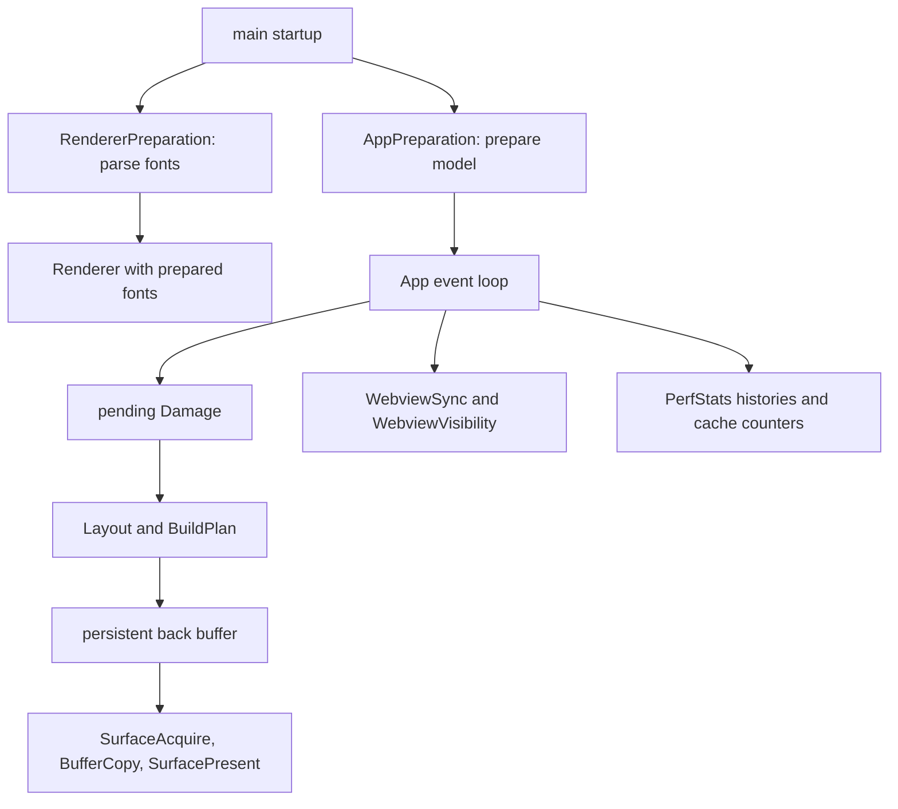

# Performance, Profiling, and Rendering Diagnostics

This page describes how to measure the Token editor without accidentally changing the workload. The important distinction is between the production path and diagnostic paths: ordinary release builds compile out timing and overlay bookkeeping, while debug assertions, profiling features, and diagnostic overlays deliberately add observability (and sometimes work of their own).

## A useful mental model

Startup and rendering have separate ownership boundaries. `src/main.rs` starts font parsing and application preparation before it builds the event loop; `App` owns the resulting `PerfStats`, pending damage, renderer, and deferred startup work; `Renderer` owns the persistent back buffer and the render-stage calls; `tracing` owns subscribers and output files.



*The startup overlap and per-frame ownership flow, from preparation through presentation and diagnostics.*

## Startup: overlap preparation, then establish real metrics

`RendererPreparation::start()` launches a named `token-font-loader` thread that parses the bundled `JetBrains Mono` and `Inter` fonts. `AppPreparation::start()` runs alongside it. If either thread cannot be started, startup logs a warning and falls back to synchronous construction; if font preparation panics, finishing it returns an error. This overlap reduces time spent waiting on font parsing during platform/window initialization, but it does not make font loading optional.

When the first window is ready, `App::init_renderer` consumes the preparation handle via `Renderer::new_prepared` (or calls `Renderer::new` on fallback), configures fonts, and writes the renderer’s measured character width, scale factor, line height, tab-bar height, and status-bar height into the model. It then resizes the model to the actual window. Performance comparisons involving layout or text should therefore use the same font configuration, scale factor, and window dimensions.

## PerfStats and the frame lifecycle

`PerfStats` is the owner of frame timing, stage timing, rolling histories, glyph-cache counters, and the debug overlay switch. `PerfStage::ALL` currently contains 30 stages, covering planning/layout, editor content and chrome, overlays, surface operations, and webview synchronization. Stage timings accumulate during a frame; `record_render_history` retains the most recent 60 frame values for the overlay and snapshots.

The runtime starts a frame before calling the renderer. A damaged frame is rendered, webviews are synchronized and visibility is updated, then the frame is closed and history recorded. A `Damage::None` render exits before resetting or presenting anything, so a no-damage event does not become a measured surface frame.

```mermaid
sequenceDiagram
    participant Loop as App render loop
    participant Perf as PerfStats
    participant Ren as Renderer
    participant View as View phases
    participant Surface as softbuffer surface
    Loop->>Perf: start_frame()
    Loop->>Ren: render(model, perf, damage)
    Ren->>Perf: Layout and BuildPlan
    Ren->>View: render full or cursor-lines fast path
    View->>Perf: measure named stages
    Ren->>Surface: acquire, copy back buffer, present
    Loop->>Perf: WebviewSync and WebviewVisibility
    Loop->>Perf: record_frame_time()
    Loop->>Perf: record_render_history()
```

*The measured runtime path for a damaged frame.*

In debug builds, `time_stage` returns an RAII `TimerGuard` that records elapsed time on drop; `measure_stage` measures a closure and records it afterward. `tracked_time` sums stage durations, while `untracked_time` is the frame duration minus tracked time (saturating at zero). `PerfSnapshot` exposes frame count, average and last frame milliseconds, and per-stage averages/last values. Throughput is the reciprocal of average frame time, and cache hit rate is total hits divided by total hits plus misses.

In non-debug builds, timing methods are inline no-ops, snapshots are default/empty, and the overlay can never be shown. With `profile-tracing`, however, the release implementation still creates `frame` and `render_stage` spans; this is the intentional exception to the zero-cost normal release path.

## Rendering control flow and damage

`Renderer::render` skips `Damage::None`, resizes its persistent back buffer and softbuffer surface when the window changes, computes a shared chrome/layout snapshot, and builds a render plan. A full render clears the back buffer and executes editor, sidebar, dock, status, modal, cursor/drop, drag-ghost, and debug phases as applicable. It then copies the complete back buffer to the surface and presents it.

Cursor-line damage uses a fast path: it redraws only dirty cursor lines, the focused find bar, and (when enabled) the focused group’s scrollbar. The scrollbar redraw is required because cursor-line painting spans the group width and can overwrite the scrollbar’s overlaid pixels in the persistent buffer. `damage-debug` adds colored outlines for full, editor-area, status-bar, and cursor-line damage. Treat that feature as visualization, not a benchmark configuration.

The F2 performance overlay is debug-only. It reports frame and average render time, throughput, tracked versus untracked time, a stacked phase bar, glyph-cache size/hits/misses, and per-stage microsecond sparklines. Showing it causes the app to force full redraws, so overlay-visible measurements are self-perturbing; capture baseline timings with F2 off, then use F2 to locate a suspect stage.

## Tracing and Chrome export

`src/tracing.rs` initializes a console layer and a daily-rotating file layer. The default filter is `warn`; `RUST_LOG` controls console filtering (for example, `RUST_LOG=token=debug`), and `TOKEN_FILE_LOG` controls the file layer, falling back to `RUST_LOG`. Logs normally go under `~/.config/token-editor/logs/token.log`. Keep the returned `TraceGuard` alive until process exit so feature-enabled trace output can flush.

`profile-tracing` makes `PerfStats` stage calls emit `tracing::info_span!` spans named `render_stage` with a `stage` argument, and opens a `frame` span around each frame. `profile-chrome` implies `profile-tracing` and installs `tracing-chrome`, writing `token-trace.json` with span arguments. Four text sub-stages (`TextBackground`, `TextDecorations`, `TextGlyphs`, and `TextCursors`) use manual elapsed-time recording in `editor_text.rs`; they appear in debug overlay timing but do not currently emit spans.

Recommended Chrome workflow:

```bash
just profile-chrome
# interact with the editor, then quit
# open token-trace.json in https://ui.perfetto.dev
```

For a controlled target, build with `cargo build --release --features profile-chrome --bin token` and run `./target/release/token path/to/project/`. In Perfetto, inspect `frame` spans, zoom into a frame, and search for names such as `text_glyphs`, `build_plan`, `sidebar`, or `status_bar`. For CPU stacks plus named stages, use the profiling profile and samply:

```bash
cargo build --profile profiling --features profile-chrome --bin token
samply record ./target/profiling/token samples/large.txt
```

A future subscriber such as Tracy can reuse `profile-tracing` spans without changing render call sites. Keep `profile-chrome` off for normal builds: it adds a subscriber and writes a trace file.

## Profiling and benchmark workflows

Use the `profiling` Cargo profile for CPU profilers: it inherits release optimization, keeps debug symbols, disables LTO, and does not strip symbols. The `dist` profile is unsuitable for symbol-oriented profiling because it enables maximum optimization and strips symbols. `debugging` has full debug info and is useful when source-level diagnosis matters; debug assertions also enable `PerfStats` histories and the F2 overlay.

A practical sequence is:

1. **Isolate rendering.** Build the profiling binary and run the headless renderer, for example `./target/profiling/profile_render --frames 500 --splits 3 --lines 5000 --stats`. It renders without windowing or event handling. If this is fast while the live app is slow, investigate event handling, input, windowing, or presentation rather than text rendering.
2. **Capture CPU stacks.** Prefer `just profile-samply` for a Firefox Profiler recording, or use `just flamegraph`. On macOS, SIP can make `cargo flamegraph`/dtrace fail; samply or Instruments is the safer alternative.
3. **Capture named stages.** Use `just profile-chrome` when the question is which render stage costs time across frames. Combine it with samply when both call stacks and stage boundaries are needed.
4. **Investigate memory.** `just profile-memory` enables `dhat-heap` and produces `dhat-heap.json`; open it in the DHAT viewer. Instruments Allocations is an alternative on macOS. Heap results should be compared over a repeatable workload, not inferred from a single startup allocation burst.
5. **Run focused benchmarks.** Divan benchmarks use allocation tracking via `divan::AllocProfiler`. Useful targets include `just bench-render`, `just bench-glyph`, `just bench-loop`, `just bench-layout`, `just bench-search`, `just bench-syntax`, and `just bench-rope`; `cargo bench --bench hot_paths` runs a specific benchmark binary. `just profile-workloads` exercises optimized editor workloads, while `just profile-workloads-debug` deliberately uses the debug profile for diagnosis.

The `profile_render` binary is headless and deterministic in structure rather than a full app benchmark: it creates multiple splits, pre-warms ASCII glyphs, supports synthetic or supplied UTF-8/CSV fixtures, and can simulate coarse scrolling, pixel scrolling, or eased scrolling. Its reported CPU editor-area render excludes windowing and surface presentation. Record command-line dimensions, split count, fixture, scroll mode, and indentation-guide setting with every result; otherwise artifacts are not comparable.

## Interpreting artifacts safely

- High `mach_msg2_trap` in an idle macOS CPU profile generally means the app is waiting, not burning CPU. Low idle wait time with high CPU suggests a spinning event loop or unnecessary redraws; inspect redraw requests and event-loop behavior before optimizing render code.
- A large `untracked` component means work occurred outside named render stages. It can include runtime coordination or other frame work; do not attribute it to the largest visible stage automatically.
- A low glyph-cache hit rate or growing glyph cache can explain text-rendering changes, but compare warm-cache and cold-cache runs separately. The headless benchmark explicitly pre-warms ASCII characters.
- A memory graph that grows over time is more actionable than a one-time startup peak: look for per-frame allocations and retained buffers, then verify with DHAT or Allocations.
- Missing symbols or empty Instruments stacks usually indicate the wrong Cargo profile or stripped binary. Rebuild with `just build-prof`/`--profile profiling`; do not use `dist` for symbol analysis.
- On Apple Silicon, ASan/LSan support can be limited; use Instruments or DHAT when sanitizer runs are unreliable.

Safe diagnostic practice is to establish an uninstrumented release baseline, change one feature or workload dimension at a time, and retain the exact command and artifact. Use debug overlay and `damage-debug` to explain behavior, then repeat the measurement with those perturbing features disabled. Never treat a flamegraph, Perfetto trace, or `profile_render` number as an absolute frame-rate guarantee: they answer different questions and omit different parts of the live runtime.
