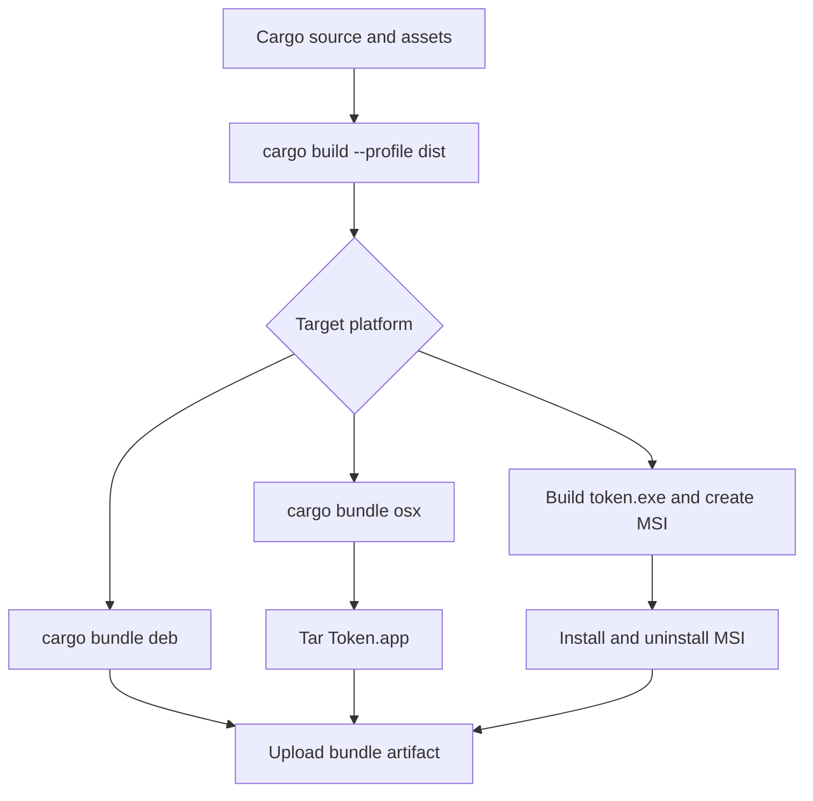

# Build, Packaging, and Platform Operations

Token is a Rust desktop application whose normal package binary is `token`. The repository also defines auxiliary binaries for screenshots, rendering profiles, a fake LSP server, and the optional `ui-gallery`. Cargo has `autobins = false`, so only the binaries explicitly listed in `Cargo.toml` are built; `token` is the default run target. The supported distribution targets are `aarch64-apple-darwin`, `x86_64-apple-darwin`, `x86_64-unknown-linux-gnu`, and `x86_64-pc-windows-msvc`.

## Build entrypoints and profiles

The `just` recipes are the convenient local interface:

```sh
just build                 # cargo build
just release               # cargo build --release
just dist                  # cargo build --profile dist
just debugging             # cargo build --profile debugging
just build-prof            # cargo build --profile profiling
just dev                   # build and open representative sample files
just workspace             # build and open the repository
```

The profiles have distinct operational purposes. `dev` keeps Token debuggable and incremental, while optimizing `fontdue` and `ttf-parser` for startup. `debugging` inherits `dev` with full debug information. `release` uses level-3 optimization, thin LTO, and aborting panics. `dist` maximizes distribution optimization with fat LTO, one codegen unit, and stripped output. `profiling` inherits release speed but keeps debug symbols, disables LTO, and does not strip.

### Binaries and features

The always-available binaries are:

| Binary | Cargo declaration | Use |
| --- | --- | --- |
| `token` | `src/main.rs` | Desktop editor and packaged application |
| `screenshot` | `src/bin/screenshot.rs` | Screenshot generation (`just screenshots`) |
| `profile_render` | `src/bin/profile_render.rs` | Render profiling (`just profile-render`) |
| `fake-lsp-server` | `src/bin/fake_lsp_server.rs` | LSP-oriented development and tests |
| `ui-gallery` | `src/bin/ui_gallery.rs` | Native component catalog; requires `ui-gallery` |

The feature flags are deliberately opt-in: `ui-gallery` enables the gallery binary, `damage-debug` enables colored damage-region visualization, `dhat-heap` enables heap profiling, `profile-tracing` adds `PerfStats` tracing spans, and `profile-chrome` additionally enables Chrome trace export through `tracing-chrome`. Examples:

```sh
just ui-gallery
cargo run --release --bin token --features damage-debug -- ./src
just profile-chrome
just profile-memory
```

`profile-chrome` writes `token-trace.json`; open it in `https://ui.perfetto.dev`. The trace guard must remain alive until shutdown so the trace output is flushed. `dhat-heap` writes `dhat-heap.json`, which can be inspected with `https://nnethercote.github.io/dh_view/dh_view.html`.

## What the build script generates

`build.rs` is part of every Cargo build. It compiles the retained C Tree-sitter grammars and external scanners with `cc`, and emits `cargo:rerun-if-changed` entries for those source files. It also sets `TOKEN_VERSION` from `git describe --tags --always`, removing a leading `v`; if Git is unavailable or the command fails, it falls back to the Cargo package version.

On Windows, the build script creates `token.ico` in Cargo's `OUT_DIR` by resizing the embedded `assets/icon.png` to at most 256×256, then uses `winres` to embed icon, product, company, copyright, and version resources. A failure is reported as a Cargo warning rather than an immediate build-script panic, so Windows packaging must still be smoke-tested for missing resources.

The packaging icon source is `assets/icon-packaging.png` in Cargo bundle metadata. For local icon generation, `just generate-icon` requires Python Pillow and `assets/JetBrainsMono.ttf`; `just icons` uses macOS `sips` and `iconutil` to make `assets/icon.icns`, and optionally ImageMagick (`magick` or `convert`) to make `assets/icon.ico`. `just clean` removes these generated icon files and bundle output.

## Native dependencies and platform assumptions

Linux builds in CI and cargo-dist install these development packages: `libxkbcommon-dev`, `libwayland-dev`, `libgtk-3-dev`, `libwebkit2gtk-4.1-dev`, `libayatana-appindicator3-dev`, and `librsvg2-dev`. They cover the windowing, WebView/Markdown preview, tray/integration, and rendering stack. A local Linux build that fails while compiling `winit`, `wry`, or GTK/WebKit dependencies should first verify this set is installed.

The macOS target has native Objective-C bindings (`objc2`, `objc2-app-kit`, and `objc2-foundation`) and compiles a macOS menu module only on `target_os = "macos"`. Cargo bundle metadata requires macOS 11.0 or newer, identifies the app as `no.helgesverre.token`, and includes the icon, `Credits.rtf`, the Inter font license, and Markdown dependency licenses.

Windows packaging assumes Windows/MSVC, PowerShell 7, and WiX Toolset 3.14. The MSI script locates `candle.exe` and `light.exe` through `$WIX/bin` when `$WIX` is set, otherwise through `PATH`. The supported MSI target is only `x86_64-pc-windows-msvc`.

## Cross-build and packaging flow

For local cross builds, use the repository recipes (and install the tools named by the recipe comments):

```sh
just compile-macos-x86
just compile-macos-arm
just compile-linux
just compile-windows
just bundle-macos
just bundle-linux
just bundle-windows
```

`compile-linux` uses `cross`, while `compile-windows` uses `cargo xwin`; the macOS recipes use Cargo targets directly. `just bundle` creates the default bundle after a `dist` build and icon preparation. `dist-workspace.toml` configures cargo-dist to generate shell, PowerShell, and Homebrew installers for the four supported targets, publishing Homebrew through `helgesverre/homebrew-tap`.



This flow shows the platform-specific distribution and verification paths used by the repository's build automation.

### macOS packaging and opening

`scripts/package-macos-app.sh` accepts exactly `aarch64-apple-darwin` or `x86_64-apple-darwin`; unsupported targets exit with status 2. It reads the package version from `Cargo.toml`, runs `cargo bundle --release --target ... --format osx --bin token`, requires `Token.app` to exist, and creates `target/distrib/Token-VERSION-TARGET.app.tar.gz` with `COPYFILE_DISABLE=1`.

On macOS, `just app` validates the host architecture, runs that script, and opens `target/$target/release/bundle/osx/Token.app` with the system `open` command. It intentionally fails on non-macOS hosts. External web links from preview and terminal paths pass through a URL safety check and then `open::that` on a background thread; browser-launch failures are logged as warnings rather than crashing the editor.

### Windows MSI packaging and verification

`scripts/package-windows-msi.ps1` first builds with Cargo JSON messages and takes the exact build-script `out_dir` from those messages to find the generated ICO. It converts `LICENSE.md` to RTF for the installer dialog, compiles `scripts/windows-installer.wxs` with WiX, and emits `target/$Target/release/bundle/msi/Token.msi`.

The CI build does not treat MSI generation as sufficient: `scripts/smoke-windows-msi.ps1` silently installs the MSI, hashes the installed executable and resource payload against their sources, checks the installed executable's `ProductName` and `ProductVersion`, uninstalls it, and fails if `token.exe` remains. Installer logs are retained under `target/verification/windows-msi` when CI uploads them.

## Release checks and focused tests

The CI build matrix covers both macOS architectures, Linux GNU, and Windows MSVC. Linux setup installs the native packages above; non-Windows jobs install `cargo-bundle`; macOS runs the app packaging script; Linux creates a Debian bundle; and Windows runs the MSI smoke test. Artifacts are collected from target bundle directories and `target/distrib`.

For a broad local gate:

```sh
just fmt-check
just lint
just test                 # cargo nextest run plus cargo test --doc
just check                # format, lint, test, build, and release
```

Use `just test-one NAME` for a focused nextest selection, `just test-verbose` when `--nocapture` is needed, and `just smoke-input` for synthetic native-handler smoke checks on macOS/Linux. Packaging-specific checks should use `just app` on macOS and `just bundle-windows` followed by `scripts/smoke-windows-msi.ps1` on Windows. Coverage is available with `just coverage` when `cargo-llvm-cov` and `llvm-tools-preview` are installed; the recipe verifies that the HTML report was actually generated.

## Logging and troubleshooting

`src/tracing.rs` initializes console and daily rotating file layers. Console filtering follows `RUST_LOG`; invalid filter values fall back to `warn`. File logging follows `TOKEN_FILE_LOG` when set, otherwise `RUST_LOG`, and writes non-ANSI logs to `~/.config/token-editor/logs/token.log`. If the log directory cannot be created, Token warns on stderr and continues without file logging.

Useful diagnostics include:

```sh
RUST_LOG=debug ./target/debug/token samples/sample_code.rs
RUST_LOG=cursor=trace,selection=debug ./target/debug/token samples/sample_code.rs
TOKEN_FILE_LOG=token::update=debug ./target/debug/token samples/sample_code.rs
```

For build failures, distinguish missing host prerequisites from source failures: install the Linux WebKit/GTK/Wayland packages before changing Rust code; on Windows confirm MSVC, PowerShell, and WiX discovery; on macOS confirm the target is one of the two accepted triples and that `sips`/`iconutil` are available for icon generation. If a Windows executable builds but packaging fails, inspect the JSON-derived `OUT_DIR`/ICO path and run the MSI smoke test rather than trusting the Cargo warning. If a trace is empty, ensure the process reaches shutdown and retains the profiling guard; if browser opening fails, use the warning in the log and open the URL manually.
