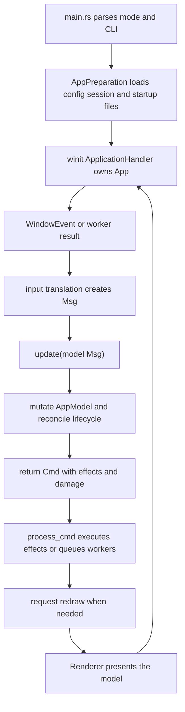
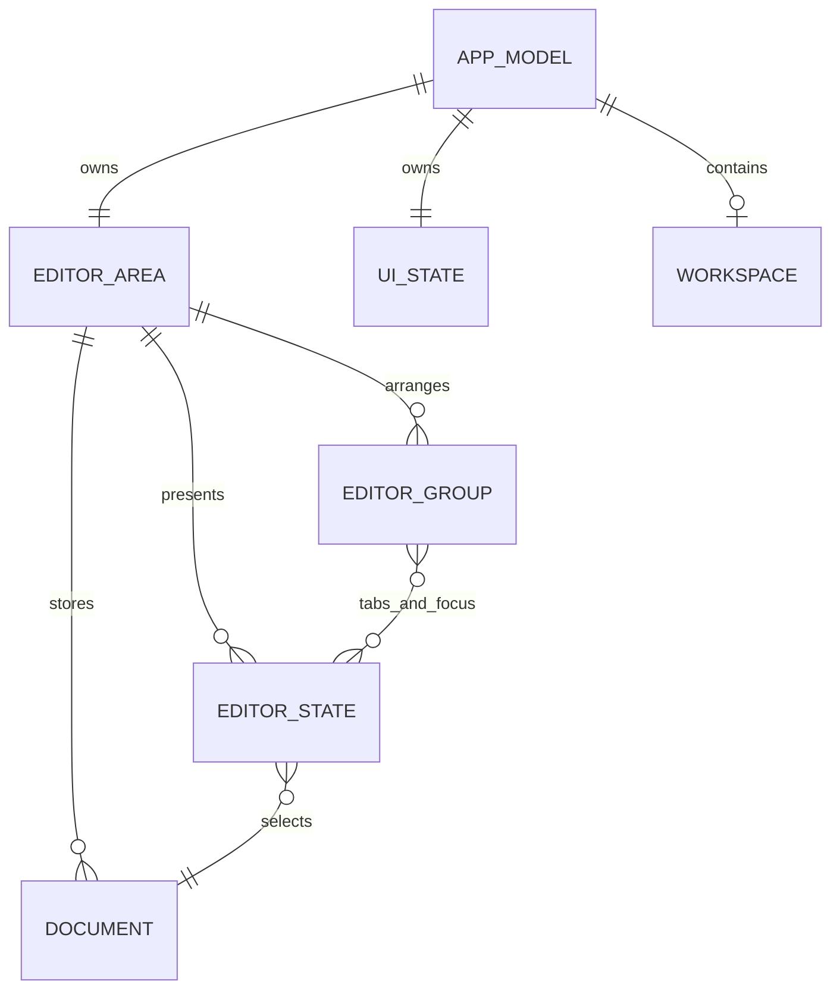

# Token Editor Wiki Quickstart

Token is a Rust desktop editor. The most useful mental model is an Elm-style loop: platform input and worker results become `Msg` values, `update` mutates the authoritative `AppModel` and returns optional `Cmd` effects, and the runtime executes those effects and schedules redraws. Start with this page, then follow the task-routing map below rather than treating `OVERVIEW.md` as a complete source inventory.

## Where execution starts

`src/main.rs` is the binary entrypoint. It initializes tracing, handles the `automate` and `mcp` subcommands, parses `CliArgs`, performs running-instance handoff, and starts font and application preparation in parallel. It then builds the winit event loop, creates `App`, and calls `run_app`. The reusable editor types and modules are exported by `src/lib.rs`; `AppModel::new` deliberately creates deterministic in-memory defaults and does not perform configuration or file I/O.

Normal invocation examples:

```bash
just dev
cargo test
cargo run -- path/to/file.rs
cargo run -- path/to/project/
```

For user-facing command-line behavior, including `-w`, stdin, `--new-window`, and completions, consult the [README Quick Start](../README.md#quick-start). For build and platform prerequisites, use [Build, Packaging, and Platform Operations](architecture/runtime.md) only for runtime questions and the planned operations page for build changes.

## The control-flow spine



*Caption: The normal event, message, update, command, and redraw cycle.*

The runtime boundary is `src/runtime/app.rs`: `window_event` passes relevant winit events through `handle_event`, merges command damage, processes the command, and requests a redraw when `Cmd::needs_redraw()` is true. `about_to_wait` drains automation and asynchronous messages, polls file watching and worker deadlines, reconciles syntax/LSP/auto-save work, advances scroll animation, and ticks cursor/status timers. Shutdown drains selected file replies, optionally saves the session, answers `--wait` clients, and stops workers.

### State and update ownership

`AppModel` is the authoritative UI/application state. Its central `editor_area` owns documents, editor states, groups, tabs, and the split layout; the model also owns `UiState`, configuration, theme, workspace, docks, terminal, language-service mirrors, recent files, and navigation history. Documents own text and file-related state; editor states own cursors, selections, viewport and view mode. Rendering should read this state, not become a second state store.

`src/update/mod.rs` exposes `update(&mut AppModel, Msg) -> Option<Cmd>` as the public mutation boundary. The dispatcher performs cross-cutting reconciliation before and after specialized handlers: file policy, closing, auto-save, status synchronization, completion cleanup, folding, workspace symbols, hover, and viewport/redraw consequences. Specialized modules handle editor/document/layout/UI/app/syntax/workspace and feature messages. Do not call private handlers directly in production code: the module documentation explicitly reserves `update` for routing and shared lifecycle synchronization.



*Caption: The state ownership boundaries an agent should preserve when changing editor behavior.*

A handler may return no command, one command, or a batch. Commands represent effects such as file load/save, redraw, worker scheduling, quit, and damage regions; the runtime, not the model, performs those effects. Asynchronous replies re-enter through `Msg` and must be checked against the relevant document/revision or pending request state before they change visible state.

## Startup and safe change workflow

Startup has two phases. `prepare_app` builds a keymap and empty model, loads startup configuration, opens a workspace if requested, restores session state when enabled, prepares startup files through the normal file-open path, applies demo mode and an initial cursor position, and returns the prepared model/session. `App` later creates the native window and rendering context in `resumed`; worker and deferred startup work is integrated through the same message/command machinery. This separation is important: adding filesystem work to `AppModel::new` or bypassing message installation can make tests and startup behavior diverge.

Before changing a subsystem:

1. Read this page and identify the owning model field, `Msg` variant, update handler, command/effect boundary, and renderer or integration consumer.
2. Read the domain page in the routing map below, then follow its cited source and focused tests.
3. Preserve invariants at the state owner, not in a view workaround. For async work, preserve revision/request identity and stale-result rejection.
4. Add or update a focused regression test, then run the narrow test target before the broader suite (`cargo test`; feature-gated or native tests may require the project task commands).
5. If the change crosses save, external files, session restore, LSP, or platform handoff, validate the end-to-end workflow rather than only a pure model test.

## Task-routing map

| Change or question | Consult first |
|---|---|
| Event loop, input translation, messages, commands, workers, redraw scheduling | [Runtime, Event Loop, and Message Updates](architecture/runtime.md) |
| Documents, cursors, selections, undo/redo, tabs, panes, authoritative state | [Editor Model, Documents, Cursors, and Undo](concepts/editor-state.md) |
| Painting, layout geometry, hit testing, scrolling, damage | [Rendering, Layout, Hit Testing, and Damage](architecture/rendering-layout.md) |
| Tree-sitter, language detection, completion, diagnostics, LSP state | [Syntax, Parsing, Completion, and LSP State](concepts/syntax-and-language-services.md) |
| LSP server configuration, transport, formatter integration | [Language Server and Formatter Integration](integrations/lsp.md) |
| Terminal, Markdown preview, clipboard, dialogs, browser/OS bridges | [Embedded Terminal, Markdown Preview, and OS Bridges](integrations/terminal-preview-clipboard.md) |
| Config files, keymaps, themes, EditorConfig, defaults | [Configuration, Keymaps, Themes, and EditorConfig](operations/configuration.md) |
| Profiling, performance, tracing, damage diagnostics | [Performance, Profiling, and Rendering Diagnostics](operations/performance.md) |
| Cargo builds, packaging, native dependencies, platform operations | [Build, Packaging, and Platform Operations](operations/platform-builds.md) |
| Edit/save, auto-save, external changes, close protection | [Editing, Save, Auto-Save, and External Changes](workflows/edit-save.md) |
| Startup modes, CLI handoff, `--wait`, session restore | [Startup, CLI Handoff, and Session Restore](workflows/startup-session.md) |
| Workspaces, watchers, tabs, panes, file navigation | [Workspaces, File Watching, Tabs, and Navigation](workflows/workspace-files.md) |
| Invariant or persistence regression | [Editor and Persistence Invariants](testing/editor-invariants.md) |
| Language-service or async regression | [Language-Service and Async Regression Coverage](testing/language-services.md) |
| Test selection and validation workflow | [Testing Strategy and Safe Change Workflow](testing/test-strategy.md) |
| Layout, input, geometry, visual/UI regression | [UI, Layout, Input, and Visual Regression Coverage](testing/ui-layout.md) |

The source-level orientation is also summarized in [`OVERVIEW.md`](../OVERVIEW.md), while [`docs/README.md`](../docs/README.md) indexes user guides, architecture material, behavior contracts, and feature documents. Those are navigation aids; use the owning subsystem page and source/tests as the change authority.
