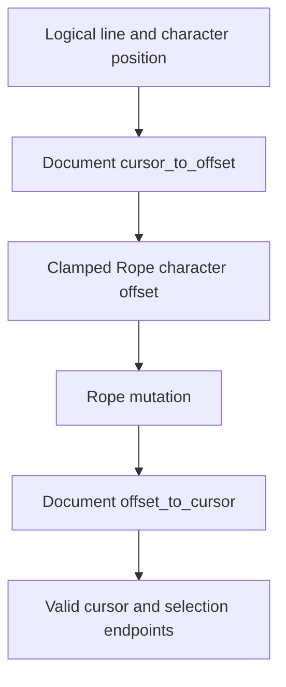
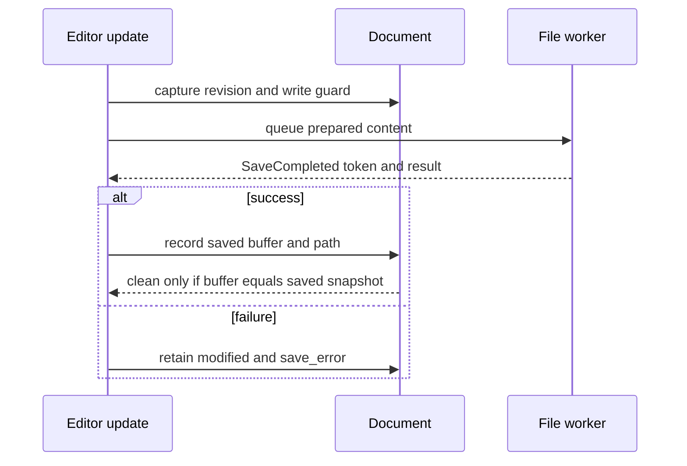
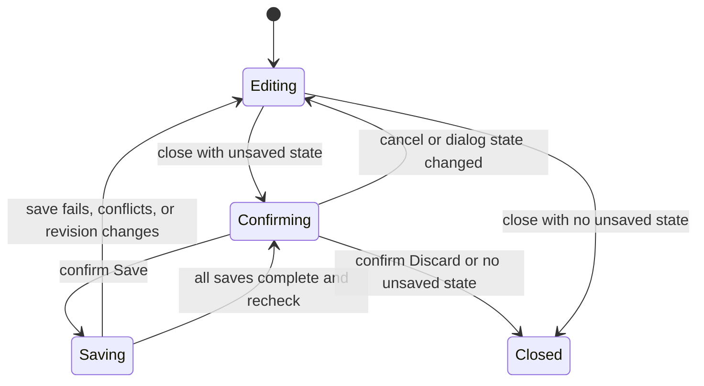

# Editor and Persistence Invariants

This page is a behavioral test reference, not a source-file inventory. The central rule is that user-visible positions are logical text positions while mutation and persistence use explicit snapshots and revisions. Focused tests should preserve these contracts when changing edit planning, pane synchronization, file I/O, or close handling.

## Coordinate and buffer invariants

- `Position.line` and `Position.column` are zero-based logical line and **Unicode scalar-value character** coordinates. `Cursor` adds `desired_column`, which preserves the intended vertical column across short lines and is cleared by horizontal movement. `Position` ordering is lexicographic by line then column (`src/editable/cursor.rs#L3-L8`, `src/editable/cursor.rs#L20-L67`).
- `Document` stores text in a `ropey::Rope`; `(line, column)` converts to a character offset, never a byte offset. `cursor_to_offset` clamps an out-of-range line to the buffer end and a column to the rendered line length; `offset_to_cursor` clamps offsets to `buffer.len_chars()`. Line length excludes CRLF, LF, or CR endings (`src/model/document.rs#L360-L455`).
- A cursor written by navigation, outline jumps, or stale external callers must be valid for the current document: the line is bounded by the last line and the column by that line's content length. This is exercised for wild coordinates and stale outline ranges by `tests/cursor_clamping.rs#L19-L94`.
- Newline handling is consistent across display, coordinate conversion, and editing. CRLF counts as one logical line ending for line length, and lone CR is also recognized; insertion/deletion therefore must not leave a cursor in a phantom ending column (`tests/save_cleanup.rs#L109-L123`).

Caption: Editor-facing coordinates cross the rope boundary only through clamped character-offset conversions.

## Planning and applying edits

`plan_text_edits` resolves every LSP range against the pristine buffer, converts LSP UTF-16 positions to editor character coordinates, drops ranges that vanished, and sorts edits in descending start order. Equal starts use stable ordering so replacement and insertion preserve the protocol's text order. Overlapping ranges are dropped rather than applied against shifting text: malformed server input cannot silently corrupt the buffer (`src/update/text_edits.rs#L46-L109`).

`apply_planned_edits` applies the resulting non-overlapping replacements in that order and records one `EditOperation::Batch` per document. It captures every pane showing the document, maps cursor/anchor/head offsets through the same edit map, updates folds before and after mutation, restores feature-owned carets where required, deduplicates placed carets, and only then pushes history and schedules syntax/LSP resynchronization (`src/update/text_edits.rs#L388-L535`).

The offset map gives insertions right affinity for ordinary caret mapping, while `map_left` supplies the left boundary needed by ranges such as folds. A replacement maps interior positions into the inserted text, clamped to its inserted length; positions after the removed span shift by the net character-count delta (`src/update/text_edits.rs#L111-L195`). These rules are covered by Unicode, newline, sibling, overlap, and pristine-source regressions in `tests/ordinary_edit_positions.rs#L8-L110` and `tests/ordinary_edit_positions.rs#L205-L260`. The broader multi-cursor suite also checks cursor expansion, edge handling, and multi-cursor line commands (`tests/multi_cursor.rs#L1-L170`, `tests/multi_cursor.rs#L325-L400`).

Important edit invariants:

1. All multi-cursor ranges are interpreted against the same pre-edit buffer; each physical overlapping deletion removes shared text once, while clipboard payloads retain selection order (`tests/ordinary_edit_positions.rs#L60-L83`).
2. Newline joins, CRLF deletion, line deletion, duplicate, indent, and unindent map every surviving endpoint rather than just the focused caret (`tests/ordinary_edit_positions.rs#L86-L183`).
3. An empty edit batch is a no-op: it does not dirty the document or create undo history (`tests/ordinary_edit_positions.rs#L113-L120`).
4. Duplicate sources are captured before any mutation, so later copies cannot observe earlier insertions (`tests/ordinary_edit_positions.rs#L139-L153`).
5. Every accepted edit increments the wrapping `Document.revision`, clears redo, and marks the document modified; syntax results are accepted only when their revision/language still match (`src/model/document.rs#L479-L488`, `src/model/document.rs#L501-L510`).

## Moving lines without losing logical positions

`MoveLinesUp` and `MoveLinesDown` use the same planner as ordinary edits, but first turn the lines covered by all cursors into contiguous runs. A run at the document boundary is left in place; movable runs are rebuilt by rotating the affected line contents while preserving each original line ending, including CRLF and an unterminated final line. The focused editor's complete state is then line-mapped with `moved_line`, while peer panes are mapped through the planned character edits (`src/update/document.rs#L624-L705`). This makes a line move one undoable batch, preserves the cursor column, and keeps a reversed selection's anchor/head orientation rather than normalizing it.

The focused tests cover the behavioral boundary rather than the implementation shape: a single line moves down and back up without changing its column, a reversed selected block survives undo and redo, CRLF and an unterminated final line remain lossless, and a boundary move creates no history (`tests/text_editing.rs#L444-L505`). Disjoint multi-cursor blocks move atomically, while a block touching the top or bottom edge is not moved (`tests/multi_cursor.rs#L325-L360`). The cross-pane history regression additionally proves that both the author pane and peer pane return to their exact before/after states (`tests/undo_pane_state.rs#L98-L125`).

## Selections, panes, and history

A selection is extracted by ordering its anchor and head, converting both endpoints through the document's character-coordinate mapping, and slicing the rope. Empty selections produce empty text (`src/model/editor.rs#L23-L37`). Edit mapping treats cursor, anchor, and head as independent endpoints, then reconstructs selections in the current rope; it clears occurrence state and selection history only for a changed transaction, not for an empty batch (`src/update/text_edits.rs#L206-L369`).

Undo metadata is intentionally broader than the focused editor. A batch stores lossless cursor, selection, and active-cursor-index snapshots for every existing pane, but not layout, caches, or the buffer. Undo applies operations in reverse and redo in forward order, restoring the snapshots so focus changes, clipped Unicode positions, reversed selections, desired columns, and deduplication are reversible (`src/model/document.rs#L10-L80`).

The regression contract is:

- one logical multi-cursor operation has one undo entry;
- undo restores the pre-edit buffer and every still-open pane's exact selection state, including active index and desired column;
- redo restores the post-edit state; and
- a new edit after undo clears redo, while closing or opening panes does not resurrect a closed pane merely because old history mentions it (`tests/undo_pane_state.rs#L16-L96`, `tests/undo_pane_state.rs#L98-L179`).

## Folding and viewport state

Folds are view state, not text edits: collapsing or revealing a fold must not dirty the document or add history (`tests/folding.rs#L153-L172`). Viewport rows may represent wrapped visual rows and folded projections, but document-facing lookups convert explicitly through the wrap/fold map; hidden body lines have no visible row (`src/model/editor.rs#L83-L109`, `src/model/editor.rs#L263-L292`).

Before a text transaction, collapsed regions in all panes and document fold candidates are offset-mapped. A touched region is discarded/expanded; an untouched region follows the edit map, with insertion immediately before a fold header handled as a non-touching case. After mutation, invalid or no-longer-structural regions are removed and surviving headers/end lines are recomputed (`src/update/folding.rs#L169-L253`). `tests/folding.rs#L92-L151` checks projection across wrapping, tabs, nesting, and hidden positions; `tests/folding.rs#L174-L181` begins the all-pane edit-preservation regression.

## File identity and persistence safety

A loaded document keeps both its source path and resolved `FileIdentity`. Identity is usable only while the document's current path still equals the identity's source. The saved snapshot is paired with `saved_path`; changing a document path cannot transfer overwrite permission or compare the buffer with an unrelated file (`src/model/document.rs#L83-L114`, `src/model/document.rs#L229-L259`, `src/model/document.rs#L313-L343`).

Opening a known path or symlink alias reuses the existing document instead of rereading it, preserving unsaved content and shared diagnostics even when the original disk names are moved. The focused group wins when the same known path is visible in multiple groups (`src/model/file_io.rs#L76-L93`, `tests/file_identity.rs#L9-L60`, `tests/file_identity.rs#L62-L80`).

A file request captures document id, revision, source path/identity, and a write guard. Replies must therefore be matched to the initiating document and revision rather than current focus; a queued prior write is included in the guard because its reply may not yet have updated the saved snapshot (`src/model/file_io.rs#L182-L213`).

Save cleanup is an editor transaction: configured line-ending conversion, trailing-whitespace trimming, and final-newline policy produce the exact write content, update the in-memory buffer, and add at most one undoable cleanup operation. A successful save records the saved snapshot and clears dirty state; a failed write retains dirty state and records the error, so undo cannot falsely claim the disk is clean. A no-op save adds no history (`src/model/document.rs#L313-L343`, `tests/save_cleanup.rs#L30-L107`).

Caption: Save completion changes persistence state only for the matching request and result.

## Close behavior and regression entrypoints

Close computes unique unsaved documents, including CSV cell edits that are local to an editor view. If none need attention it finishes immediately; otherwise it opens an unsaved-changes modal. Repeated OS close events cannot reset an in-progress confirmation (`src/update/closing.rs#L26-L88`).

Save-to-close is a guarded lifecycle: the prompt records document ids, revisions, and paths; confirmation rechecks that nothing changed while the dialog was open; saves are serialized and waited on; and any busy operation, save error, external conflict, failed CSV commit, or new edit cancels closing while leaving tabs open. Only a live modal that still owns the save intent may complete the close (`src/update/closing.rs#L98-L125`, `src/update/closing.rs#L130-L241`).

Caption: Closing is permitted only after the final recheck proves that all targeted state is saved or explicitly discarded.

The primary regression entrypoints are `tests/cursor_clamping.rs` for bounds, `tests/ordinary_edit_positions.rs` for character-offset and multi-cursor mapping, `tests/undo_pane_state.rs` for atomic history across panes, `tests/folding.rs` for projection and fold preservation, `tests/file_identity.rs` for alias identity, `tests/save_cleanup.rs` for persistence snapshots and newline policy, and `tests/closing.rs` for confirmation, asynchronous save, conflict, and cancellation behavior. Changes to any edit or persistence boundary should add or update one of these focused tests rather than relying only on broad UI coverage.
