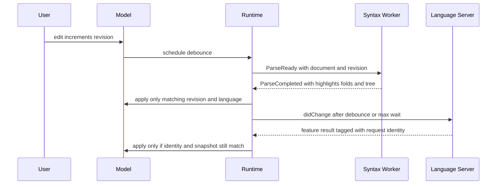
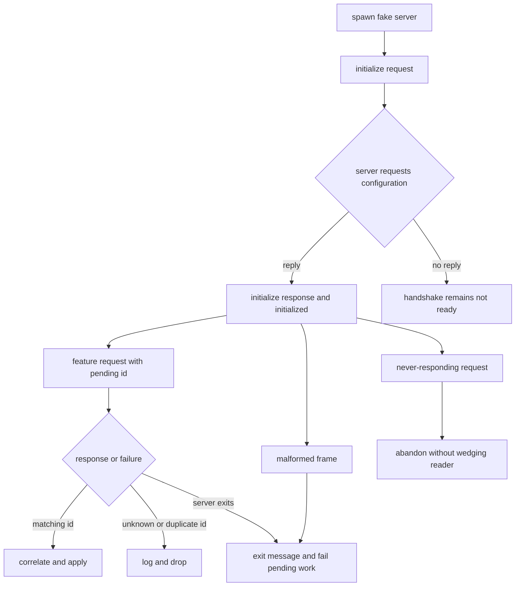

# Language-Service and Async Regression Coverage

This test surface is organized around observable contracts rather than source files. Pure conversion, framing, capability, deadline, and correlation logic is tested in isolation; update/model tests exercise revision ownership and UI behavior; and `tests/lsp_fake_server_scenarios.rs` runs the production client against a real child process speaking framed JSON-RPC. That combination catches both deterministic edge cases and failures that only appear at process and pipe boundaries.

## The asynchronous contract

An edit is identified by a document id and monotonically advancing `revision`. Syntax scheduling debounces for 30 ms, snapshots the current text, and runs parsing/highlighting/folding/outline work away from the model. LSP `didChange` uses the same debounce class but has a 300 ms maximum wait, so continuous typing cannot leave the server indefinitely behind. A deadline is discarded when the document is closed or its current revision no longer equals the scheduled revision.

This diagram shows the shared revision-and-identity discipline across syntax and LSP work.

`update_syntax` tests both gates: a `ParseReady` for a missing document or older revision produces no parse command, and `ParseCompleted` is dropped when the document revision or language differs. Valid results update highlights, the syntax tree, outline, and policy-compatible folds. These assertions are more important than asserting that a worker thread ran: they prove an old result cannot repaint new text. The runtime also reuses a syntax snapshot for a coincident `didChange`, avoiding a second rope-to-string conversion.

The focused scheduling tests assert that repeated edits do not fire before the trailing 30 ms debounce, that the 300 ms cap fires under continuous typing, that a flush returns even an unexpired revision, and that revisions observed across a burst strictly increase. Tests should preserve these assertions when changing timer code; otherwise server state can lag or an older edit can be sent after a newer one.

## Tree-sitter parsing, highlighting, folding, and positions

`ParserState` caches the language, source, and Tree-sitter tree. When possible it computes an `InputEdit` and incrementally reuses the prior tree; full, incremental, and unchanged paths feed highlighting and injected-language discovery. Markdown fenced blocks, HTML script/style regions, component files, and other language injections are therefore part of the syntax contract, not merely parser implementation details. The parser also converts byte columns to character columns at UTF-8 boundaries before exposing editor positions.

Folding tests cover both syntax-derived and indentation-derived regions. `tests/folding.rs` checks balanced S-expression forms, nested indentation with tabs, siblings, blank lines, CR/CRLF, EOF, and multiple language profiles. Projection tests compare every folded/visible row and cursor mapping against a reference for nested fold masks, soft wrapping, widths, and tab stops. Model assertions verify that navigation skips hidden bodies, explicit cursor targets reveal them, edits preserve unaffected fold anchors, touched regions expand, selection blocks collapse, and fold operations do not create an undo edit. These tests protect the relationship between parse output, fold stamps, hidden lines, and display coordinates.

Syntax results are also checked at the UTF-8/UTF-16 boundary used by LSP. `src/lsp/position.rs` tests ASCII and BMP round trips, astral emoji as two UTF-16 code units, CRLF, line-end and out-of-range clamping, surrogate-pair interior positions, and vanished diagnostic lines. A diagnostic whose start line disappeared is skipped rather than clamped onto an unrelated line. Keep these cases when changing Tree-sitter byte offsets, editor character columns, or diagnostic rendering.

## LSP framing, lifecycle, and correlation

The transport unit tests exercise the protocol at the byte-stream boundary: writing adds `Content-Length` and flushes; reading accepts extra headers case-insensitively, preserves multiple back-to-back frames, reassembles partial reads, and handles large payloads. Missing or non-numeric lengths, malformed header lines, truncated bodies, and invalid JSON return errors. The client integration contract then treats a framing failure as server exit rather than a panic.

The client has separate writer, reader, and stderr-drain responsibilities. The writer serializes all outbound frames and sends `initialized` only after the initialize response; the reader parses responses and notifications, resolves pending ids, and generates replies to server requests; the stderr drain prevents a verbose server from blocking on a full pipe. `PendingRequests` allocates ids from one table, marks superseded or timed-out requests abandoned without deleting them, removes entries only when the response arrives or the server dies, and drops unknown or duplicate ids safely. A late abandoned response is observable but must not be applied as current work.

This lifecycle shows the fake-server branches that must remain non-blocking and non-panicking.

`tests/lsp_fake_server_scenarios.rs` drives `spawn_server` and asserts on messages from the production reader thread, not a mocked client. The scenarios cover configuration requested during initialization (the client must reply or readiness deadlocks), a server that never answers (it never reports Ready and remains killable), exit during a request, malformed raw frames, duplicate and unknown ids followed by a valid notification, and stderr flooding. The tests use bounded receive timeouts, so a deadlock is a failed assertion or harness timeout rather than an indefinitely blocked test.

## Capability-dependent behavior and synchronization

Capability tests should distinguish absence from support. `textDocumentSync` may be absent, a numeric kind, or an options object; only advertised full or incremental modes permit corresponding changes. `save` controls whether `didSave` is sent, while `includeText` independently controls whether it carries text. Definition, hover, references, completion, formatting, range formatting, rename, code actions, signature help, and workspace symbols are each gated by their server capability. Completion resolve and trigger characters are separately checked, as is prepare-rename support.

The client advertises UTF-16 position encoding and the feature code converts editor character columns to UTF-16 code units, including surrogate-pair behavior and defensive clamping. It also advertises only capabilities that the client implements. When changing a feature, test both the advertised capability and the absent-capability path: unsupported servers must not receive requests merely because a UI action exists.

Document synchronization tests cover conventional language ids, custom-server languages, every registered server language, trailing debounce behavior, max-wait behavior, flush-before-request/close, and revision ordering. Together they protect the boundary between generic `DidChangeDeadlines` bookkeeping and the runtime owner that actually sends messages.

## Feature regression slices

### Completion and async suggestions

Completion state captures document id, revision, cursor, and a monotonic request id. A response is usable only when all three document/cursor coordinates still match; newer requests supersede older ones. Tests cover bounded and deduplicated alternatives, UTF-8-safe acceptance at full/word/line granularity, consumed-prefix reconciliation, trigger and resolve capability gating, and explicit recovery after consecutive provider failures. Preserve the invariant that consumed text is never rewritten and that backspacing can make a previously incompatible alternative eligible again. The UTF-16 completion edit tests also verify suffix preservation, import edits, and snippet caret placement.

### Formatting

`tests/formatting.rs` exercises provider selection: an enabled external formatter wins when applicable, LSP handles selection formatting and missing/disabled commands, and untitled buffers omit a file path. Successful changed output is one undo step; unchanged output and formatter failure create no undo entry. A formatter result is dropped after a buffer revision or language change. Save-on-format tests cover manual and automatic saves, preserving original text and warning while continuing the save when the formatter fails; line-ending, empty-document, Unicode, destination-extension, and undo cases prevent normalization regressions.

### Diagnostics and semantic features

Diagnostics are intentionally version-aware: a publish older than the last accepted version for a URI is stale, while a publish without a version is not rejected solely for lacking one. Server exit clears stale diagnostic ownership so a replacement server cannot inherit old rows. Position tests additionally ensure vanished lines are skipped and ranges are clamped safely where clamping is appropriate. Semantic-token tests cover UTF-16 decoding and builtin modifiers; these are useful sentinels when changing shared position conversion.

### Workspace symbols, usages, and refactoring

Workspace-symbol model tests assert query ownership: an older reply cannot win an ABA sequence after close and reopen, a provider generation restart creates a new request, and closing the palette cancels pending work. They cover the 256-character query limit, tab/prefix navigation, selection stability while scrolling, workspace root filtering, per-server enablement, and no-provider behavior. The real fake-server test additionally verifies request-id correlation, generation/root routing, Unicode symbol names, complete locations, and propagated server errors.

Navigation tests exercise usage and refactoring results through the same stale-request discipline. When a selected symbol opens an unopened file, the deferred open retains history and converts an LSP UTF-16 location into the correct editor character column even for an astral character. Keep tests for failed or unavailable providers alongside successful results: failure is a result state to surface, not permission to apply an older response.

## How to extend this coverage

For a pure parser, position, transport, capability, deadline, or correlation rule, add a focused unit test close to the owner and include boundary values plus malformed input. For an asynchronous update rule, construct the model at revision *n*, enqueue or complete work tagged with *n*, mutate to *n+1*, and assert that state, undo history, and UI remain unchanged. For process behavior, add a scriptable fake-server scenario with a bounded timeout and clean child teardown; assert both the expected message and the absence of hangs.

A useful change checklist is: revision mismatch, ordering of two in-flight results, UTF-16 with BMP and astral text, missing capability, process exit, malformed frame, never-responding request, and the success path. This matrix complements the broader testing guidance in [/openwiki/testing/test-strategy.md](/openwiki/testing/test-strategy.md), while the service contracts are described in [/openwiki/concepts/syntax-and-language-services.md](/openwiki/concepts/syntax-and-language-services.md) and [/openwiki/integrations/lsp.md](/openwiki/integrations/lsp.md).
