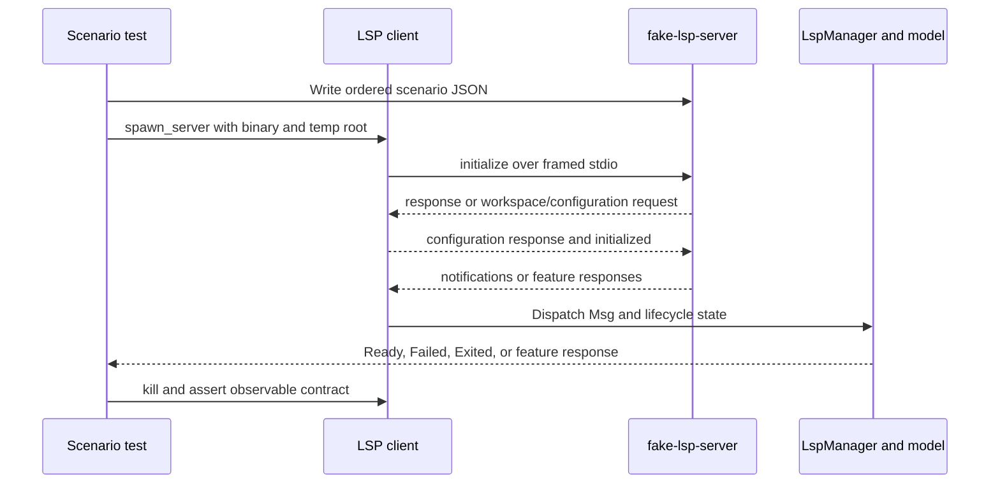

# Testing Strategy and Safe Change Workflow

Token's tests are organized around behavior and boundaries rather than a one-to-one mirror of `src/`. The most useful test seam is the pure model/update/layout code; the next is the real process boundary used by language servers; the outermost checks exercise binaries, native input, and the rendering path. This lets a change prove the narrowest invariant first and then progressively validate integration risk.

## What each layer can prove

| Layer | Best for | What it does not prove |
| --- | --- | --- |
| Rust unit tests | Deterministic transformations, parsing, URI/position conversion, transport framing, configuration and state invariants | A real child process, window system, or end-to-end runtime session |
| `tests/` integration tests | Cross-module update behavior, document/file policy, cursor and selection semantics, undo, search, workspace behavior, and persisted configuration | Platform-specific window-manager behavior unless a dedicated smoke test is used |
| Layout and geometry tests | Rectangles, sizing, wrapping, dock allocation, scrolling, split/tab bounds, and coordinate consistency | Actual glyph rasterization or compositor output |
| Fake-LSP scenarios | The client handshake, JSON-RPC correlation, lifecycle failures, capability-gated requests, and sync ordering over real pipes | Compatibility with every external language server |
| Feature/binary and smoke checks | Feature-gated compilation, binary entrypoints, native input and production rendering paths | Exhaustive semantic coverage; these are deliberately small outer checks |

The normal test harness builds all declared binaries, including `fake-lsp-server`; the optional `ui-gallery` binary is compiled and run through its feature explicitly. `Cargo.toml` declares `token`, `screenshot`, `profile_render`, `fake-lsp-server`, and the feature-gated `ui-gallery` binary, while `main.rs` is the production event-loop entrypoint.

## Test fixture and model conventions

`tests/common/mod.rs` provides the shared `AppModel` builders used by integration tests. `test_model` creates a single document and cursor with a fixed `Viewport::new(25, 80)`, default theme/configuration, 800 by 600 window metrics, and initialized editor, panel, terminal, history, and LSP state. Variants construct an explicit selection or multiple cursor/selection pairs. `buffer_to_string` makes assertions compare the resulting document rather than implementation details.

This shared setup is important when adding a regression: start with the smallest builder that expresses the behavior, then change only the relevant message or operation. Tests should assert observable invariants such as buffer text, cursor/selection positions, active-tab validity, generated layout rectangles, emitted messages, or a recorded protocol transcript. Temporary directories and explicit fixture files keep file and LSP tests isolated; avoid depending on a developer's home directory, installed server, wall-clock ordering, or a live network.

## Unit and model-behavior coverage

Pure modules carry focused `#[test]` suites for protocol utilities and domain rules. Representative seams include LSP URI and position conversion, document synchronization, markdown handling, workspace-symbol parsing, configuration/language-server resolution, dock layout, terminal translation, and recent-file behavior. The `src/lsp/mod.rs` boundary intentionally keeps protocol/client code independent of `winit` and `App`; runtime ownership remains with `LspManager`, so protocol tests can stay deterministic and cheap.

Integration tests in `tests/` exercise behavior across the model and update loop. The broad groups are:

- editing semantics: `text_editing.rs`, `ordinary_edit_positions.rs`, `selection.rs`, `multi_cursor.rs`, `expand_shrink_selection.rs`, `cursor_movement.rs`, `cursor_clamping.rs`, `document_cursor.rs`, `undo_pane_state.rs`, and `edge_cases.rs`;
- file and workspace boundaries: `file_io.rs`, `file_open.rs`, `file_change.rs`, `file_identity.rs`, `file_policy.rs`, `save_cleanup.rs`, `auto_save.rs`, `workspace.rs`, and `file_path_commands.rs`;
- user-facing services and configuration: `find_bar.rs`, `find_replacements.rs`, `formatting.rs`, `config.rs`, `editorconfig.rs`, `keymap_preferences.rs`, `settings_keymap.rs`, `theme.rs`, `text_settings.rs`, `usages.rs`, and `workspace_symbols.rs`;
- application messages and UI state: `app_messages.rs`, `modal.rs`, `overlay.rs`, `status_bar.rs`, `closing.rs`, and `monkey_tests.rs`.

These names are useful behavioral entrypoints, not a requirement to add a new file for every feature. Prefer extending the nearest scenario and keeping one assertion focused on one invariant. For example, `geometry.rs` drives `update` through split, move-tab, focus, switch, and close operations, then verifies that every group's `active_tab_index` remains within `tabs`; this catches state corruption without launching a window.

## UI, layout, scrolling, and geometry

Layout is tested as a solver contract. `tests/layout_engine.rs` builds `UiTree` declarations and solves them against fixed measurements, checking fit sizing, gaps, padding, grow/shrink distribution, wrapping, clipping, row lists, and floats. `tests/layout.rs` covers higher-level editor layout behavior; `chrome_layout.rs` checks the surrounding chrome; `editor_area.rs`, `scrolling.rs`, and `soft_wrap.rs` cover viewport and text-coordinate behavior. Geometry tests cover the model/update side of the same contract, so a layout change should normally run both solver and editor-area suites.

Keep test dimensions and cell metrics explicit. Pixel-level rendering is sensitive to fonts and platform backends; use the native `ui-gallery` recipe when a change is specifically about production painters or component appearance, and use `screenshot` only when an image artifact is the intended output. Do not turn a screenshot comparison into the only proof of a coordinate or state invariant.

## Fake LSP: real transport, scripted failure modes

The fake server is a real `fake-lsp-server` binary, not an in-process mock. It speaks Content-Length-framed JSON-RPC through stdio using the same transport implementation as the client. A scenario is a JSON array of ordered steps: `expect_request` can answer or intentionally leave a request pending; `notify`, `request`, `respond_raw`, and `write_raw` create server traffic; `sleep_ms`, `flood_stderr`, and `exit` model operational hazards; `record_until_exit` captures a transcript and automatically answers requests for session tests.

*The scenario test drives the real client/server process boundary and observes messages emitted by the reader and runtime.*

`tests/lsp_fake_server_scenarios.rs` uses `env!("CARGO_BIN_EXE_fake-lsp-server")`, a `tempfile` root, and `recv_timeout`-based `recv_until` helpers. The tests cover a complete initialize/initialized/ready lifecycle including a mid-handshake `workspace/configuration` request; request IDs, generations, roots, Unicode locations, and server errors; signature help, rename, code actions, and workspace symbols; never-responding requests; process exit; malformed frames; duplicate/unknown response IDs; and stderr flooding. Each child is killed after observation, including before detailed assertions where appropriate, so a failed contract cannot orphan a fixture. Timeouts are bounded and generous enough for CI while preserving deterministic step order.

Protocol and runtime lifecycle expectations should be tested at the lowest useful boundary: framing errors belong in transport unit tests, client parsing/correlation belongs in fake-server scenarios, and model/UI state transitions belong in message/update tests. The ignored `real_rust_analyzer_completes_the_handshake` test is an optional compatibility check only; run it with `cargo test -- --ignored` on a machine with `rust-analyzer` on `PATH`, never as the deterministic default gate.

## Session and regression tests

When a bug crosses several messages or threads, add a regression at the boundary where it becomes observable. The fake server's `record_until_exit` mode is suited to edit-heavy LSP sessions: it records request/notification order, URI, document version, and saved text while replying to requests so the client cannot hang. Assert ordering and monotonic versions from the transcript rather than matching incidental JSON formatting. For local model bugs, use a shared fixture and a minimal message sequence; for layout bugs, assert solved rectangles and boundary conditions; for file bugs, use a temporary directory and assert both content and cleanup.

A regression should preserve the failure's invariant: server failure must not look ready, an exited or malformed process must surface as exited rather than panic, an unanswered request must not wedge unrelated reader traffic, active tabs must remain valid, and cursor/selection positions must remain clamped to the document. Keep tests deterministic by controlling inputs, roots, dimensions, scenarios, and message ordering; use retries only for diagnosing known flakes, not to hide a race.

## Safe change workflow and commands

1. Read the nearest behavioral tests and identify the owning boundary: pure function, model/update message, layout solver, file boundary, LSP client, or runtime/native shell.
2. Add or adjust the smallest deterministic test and fixture first. For LSP work, encode the server behavior in a scenario JSON file and assert emitted `Msg` values; for UI work, fix metrics and assert geometry before using a gallery or screenshot.
3. Run the focused test while iterating, for example `just test-one lsp_fake_server_scenarios`, `cargo nextest run layout_engine`, or a specific test filter. Use `just test-verbose` when diagnosing output.
4. Run the repository gate: `just test` runs `cargo nextest run` followed by doctests. `just fmt` and `just lint` apply the formatting and Clippy checks; `just fmt-check` checks formatting without rewriting.
5. For a broad change, run `just check`, which combines formatting check, `cargo clippy --all-targets --all-features -- -D warnings`, tests, debug build, and release build. Explicitly exercise `cargo run --features ui-gallery --bin ui-gallery -- ...` when touching the optional gallery, and use `just smoke-input` for native-handler changes on supported macOS/Linux hosts.
6. Before merging, review failures for environmental assumptions: platform builds and native window behavior belong with the platform-build guidance, while ignored external-server tests require their documented dependency. Keep the final diff focused and include the regression test with the behavior change.

The canonical contributor shortcuts are in `docs/CONTRIBUTING.md`: `just setup`, `just test`, `just test-verbose`, `just test-retry`, `just fmt`, and `just lint`. `just test-retry` permits two nextest retries for diagnosing flaky behavior, but a passing retry does not replace making the test deterministic.
