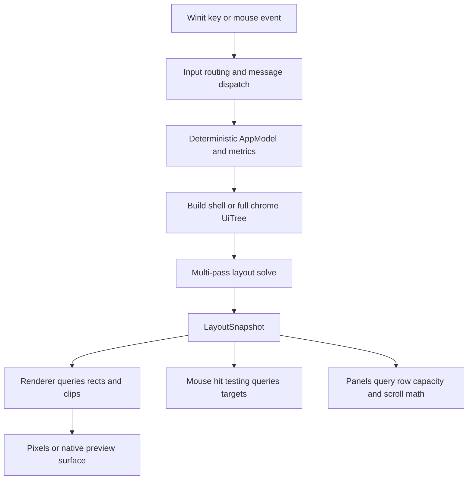

# UI, Layout, Input, and Visual Regression Coverage

This page is the test map for UI behavior whose correctness depends on geometry, focus, or ordering. It complements [rendering and layout architecture](/openwiki/architecture/rendering-layout.md) and [runtime architecture](/openwiki/architecture/runtime.md): tests should first prove model and layout invariants without a window, then use renderer/native integration only for pixels, fonts, composition, and platform input.

## The central test contract

The layout engine builds a declarative tree and solves it into a queryable `LayoutSnapshot`. The snapshot contains border and content rectangles, ancestor clip intersections, z-order, wrapped text lines, and virtualized row-list data. Rendering, hit testing, and update-layer capacity/scroll queries consume that same solved geometry rather than independently re-deriving it. `LayoutSnapshot::hit` searches reverse draw order, honors clipping, and walks from an unkeyed node to its nearest keyed ancestor; this makes overlap and popup priority testable as data.



*The test boundary from deterministic model state through solved geometry, message routing, and final rendering.*

A useful invariant is: for a fixed model, window size, scale, metrics, and text-measure implementation, repeated solves have identical snapped rectangles. `tests/chrome_layout.rs` checks this directly and also checks that the cheap shell solve agrees with the full chrome solve for outer rectangles. Run these assertions whenever changing sizing, dock allocation, scaling, or element declaration order.

## Deterministic setup and coordinate invariants

Prefer `tests/common::test_model` for editor tests. It creates a document, cursor and matching collapsed `Selection`, a fixed `Viewport::new(25, 80)`, default theme/config/metrics, an 800×600 window, and no workspace or docks. This avoids filesystem, font-loader, timer, and native-window variability. When a test changes a cursor directly, update its selection too; the layout tests’ `set_cursor_at` helper demonstrates the invariant. Use explicit `AppModel::new` dimensions and `tempfile` workspaces when testing sidebar or dock geometry.

Coordinates in layout and mouse tests are physical-pixel window coordinates. Keep the following relationships explicit:

- The status bar occupies the bottom of the window; open right and bottom docks tile the remaining content area, and the sidebar spans content height above the status bar. The shell tests assert exact rectangles at known sizes.
- An editor group’s content begins below its tab bar. A find bar consumes vertical editor space while open and `CloseFind` restores the viewport; it does not mutate document text.
- Cursor-to-pixel and pixel-to-cursor tests must use the same `char_width`, `line_height`, scale, content origin, and scroll offset. Test both logical line/column and visual column when wrapping is enabled.
- Active tab indices remain less than `tabs.len()` after split, move, switch, and close operations. Closing the last group is rejected; closing a group collapses the layout and moves focus to the remaining group.

For fractional geometry, assert `layout::snapshot::snap` results or exact relationships, not accidental floating-point representations. Adjacent rectangles should remain gap-free because edges are rounded independently.

## Layout, panels, scrolling, and wrapping

### Split views, tabs, and chrome

`tests/layout.rs` is the model-level suite for horizontal/vertical splits, repeated splits, group focus, close behavior, tabs, and moving/reordering tabs. A split creates another editor view of the same document rather than copying the document; the test checks editor count increases while document count remains one. `tests/editor_area.rs` focuses on pure `Rect` containment, group placement, and splitter hit geometry. `tests/geometry.rs` adds active-tab bounds and cursor bounds after layout mutations.

`tests/chrome_layout.rs` is the strongest regression suite for the newer solved chrome. Cover:

- status bar, sidebar, editor area, right dock, and bottom dock tiling;
- panel content beginning exactly after the dock tab header;
- panel row geometry following the dock that actually hosts the active panel;
- inactive panels having no row-list geometry (callers interpret this as not visible);
- tab positions advancing from solved widths;
- sidebar render, hit, and scroll paths sharing one viewport;
- a partial final row being drawable and clickable while full-row capacity still floors; and
- row count matching the materialized Problems ordering.

The row-list contract is especially important. `RowListView` is the authority for content height, maximum pixel scroll, visible capacity, drawn range, reveal behavior, and row-at-y mapping. A row-snapped panel must not accept a click on a row that painting omitted, while a partially intersecting row must remain clickable. Exercise both ordinary rows and pixel offsets.

`tests/scrolling.rs` validates editor vertical and horizontal scrolling at boundaries, wheel input, cursor reveal, page movement, configurable scroll padding, insertion/newline snap-back, and preservation of logical cursor position and desired column. `tests/soft_wrap.rs` checks that visual rows, tab stops, caret placement, movement, selection, page/home/end behavior, resize/toggle, and split-pane cache refresh agree. Keep logical positions stable while changing visual wrapping or viewport size.

### Find bar, modals, overlays, and focus

The input focus order is intentional: settings key capture first, splitter Escape cancellation, modal capture, find-bar capture, cursor overlay handling, then ordinary editor/keymap handling. `src/runtime/input.rs` is the routing authority; modal and find actions are messages, so tests should assert state transitions and returned commands rather than synthesize platform events for every case.

`tests/modal.rs` covers open/close and switching modal kinds, command-palette filtering and selection wrap, goto-line parsing and clamping, find/replace editing, theme selection, row activation, and persistence-related actions. `tests/find_bar.rs` covers the focus contract: opening focuses the find field, editor focus remains usable, a modal temporarily coexists without losing query state, replace-all and undo affect the document correctly, and closing restores the editor viewport. It also checks selection-only scope is reset when moving to another document, pointer selection edits only the selected field, and controls hit correctly at widths 220–1000 and scales 1.0–2.0.

Cursor-anchored completion/documentation overlays are non-blocking outside their own bounds but consume clicks inside; completion has priority over signature-help Escape handling. Test both inside and outside clicks, selectable rows, hover changes, clipping, edge clamping, and the above/below caret flip. `tests/overlay.rs` covers pure anchoring and alpha blending; overlay surface tests should remain pure until testing actual font rasterization or native composition.

Mouse tests should call the centralized `hit_test_ui` and then dispatch the resulting target. Its priority is cursor overlay, modal, status bar, sidebar resize/tree, docks, splitters, previews, and finally editor groups. This order prevents an editor beneath a modal or dock from receiving the event. `ClickRegion` also makes double/triple-click state target-sensitive, so unrelated rapid clicks cannot be mistaken for a double click. Verify focus changes, hover state, click count, and `EventResult` consumption separately from the resulting command.

## Themes, image surfaces, and native boundaries

Theme tests should validate color parsing, optional button-state overrides, and contrast-related calculations without a display server. `tests/theme.rs` is the focused suite. For image/preview behavior, keep fit-scale, zero-dimension, no-upscale, file-size, zoom, auto-fit, and “user zoom is not overwritten” assertions in `tests/image_viewer.rs`. These are deterministic model/math tests and should not require decoding a real window surface.

The renderer’s `RenderPlan` owns the per-frame chrome snapshot; render phases and dock/editor painters query it. Preview rendering has an explicit `WebviewChromeOnly` mode, where the webview owns content, and `NativeMarkdown` for headless or screenshot-oriented rendering. Therefore:

1. Assert layout keys, rectangles, clips, z-order, hit targets, viewport extents, focus, and messages in unit/integration tests first.
2. Use native-window tests only to validate winit event conversion, actual font measurement/rasterization, IME behavior, webview embedding, scale-factor changes, and compositor/device pixels.
3. Use screenshot/visual regression tests for stable rendered surfaces (chrome, modal/find bar, themes, image/native preview), with fixed window size, scale factor, font availability, theme, and fixture data. Mask caret blink, timestamps, transient messages, and other intentionally time-varying regions; compare the remaining pixels with a documented tolerance.
4. If a screenshot fails, reproduce with the corresponding deterministic geometry test and inspect the solved snapshot before changing rendering code. A pixel mismatch caused by a changed rectangle is a layout regression; a mismatch with identical snapshot geometry is a renderer/font/native integration issue.

There is no substitute for testing platform input at the boundary: `KeyModifiers` and winit `Key` values are translated before message dispatch, while normal keybindings remain in the keymap system. Test special routing with model calls, then add a small native test for modifier semantics, IME multi-character commits, Option double-tap timing, Escape cancellation, and platform-reserved shortcuts. Avoid timer sleeps in the pure suite; inject or isolate time-dependent gesture tests where possible.

## Focused commands and change checklist

Run the narrow suite first, then the broader Rust tests:

```text
cargo test --test chrome_layout --test editor_area --test geometry --test layout
cargo test --test find_bar --test modal --test overlay --test scrolling --test soft_wrap
cargo test --test status_bar --test theme --test image_viewer
cargo test
```

When changing a UI surface, check the applicable layers:

- **Layout algorithm or sizing:** deterministic repeated solve, fractional snapping, clips, z-order, and shell/full-chrome agreement.
- **Hit testing or mouse dispatch:** overlap priority, coordinate conversion, target context, focus, hover, click count, and consumption.
- **Editor viewport:** vertical/horizontal boundaries, cursor reveal, padding, soft-wrap visual rows, resize, and logical-position preservation.
- **Modal/find/overlay:** capture precedence, outside dismissal, field-only editing, selection scope, popup clipping/anchoring, and redraw commands.
- **Dock/sidebar/panel:** active-panel ownership, virtualized row count, partial rows, scroll clamp, and render/hit/scroll viewport identity.
- **Theme/image/preview:** pure math and state first, then fixed-environment native or screenshot coverage.

Record fixture dimensions, scale, font setup, and any masks with visual baselines. This keeps visual regressions actionable instead of turning platform-specific antialiasing or caret timing into false failures.
