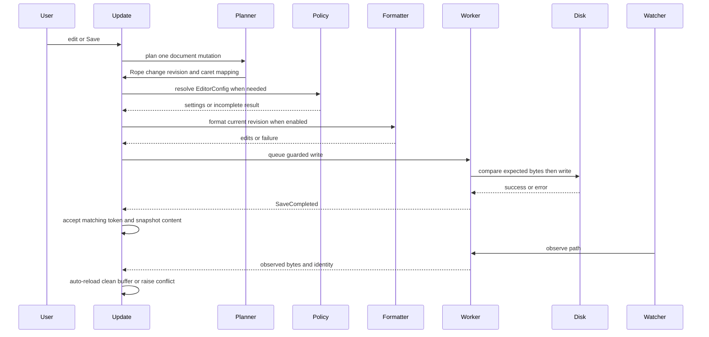
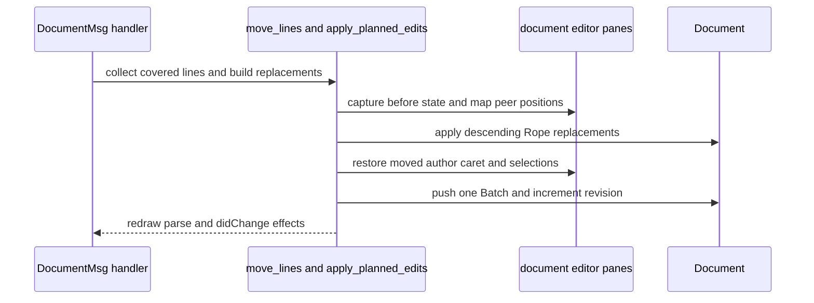

# Editing, Save, Auto-Save, and External Changes

The editor separates the **working buffer** from the **last successfully written snapshot**. An edit changes the `Rope`, increments `Document.revision`, and makes the document modified; it does not write synchronously. A successful write records the exact content sent to the worker as `saved_buffer` and associates it with `saved_path`. Dirty state is therefore content-based, not undo-stack-depth-based: undoing back to the saved bytes clears the dirty flag, while an undo/new-edit branch cannot accidentally reuse an old history position as “saved.”

This page covers text documents. Image and binary-placeholder tabs cannot be saved; the attempted operation leaves a visible status message rather than issuing a write (`src/update/app.rs`).

## Lifecycle at a glance

This shows the asynchronous save and observation paths. Text commands first complete the synchronous planned-edit transaction; save preparation and disk I/O are later stages. Each asynchronous reply is accepted only if its document, path, revision/token, and file-operation sequence still match.

## Editing enters the normal pipeline

`DocumentMsg` is the entrypoint for text commands in `update_document_inner`. `MoveLinesUp` and `MoveLinesDown` use the same `apply_planned_edits` path as insertion, deletion, indentation, duplication, and paste—not a view-only cursor shortcut (`src/update/document.rs#L707-L789`). The planner applies character-offset replacements in descending order, maps every cursor and selection endpoint in every pane showing the document, mutates the shared `Rope`, restores the initiating pane’s requested caret state, and records one `EditOperation::Batch`. It then schedules redraw, syntax parsing, and debounced `didChange` effects (`src/update/text_edits.rs#L388-L535`).

### Selected-line movement

`move_lines` starts from the focused document and editor, collects all lines covered by all cursors, merges adjacent covered lines into runs, and removes only runs already at the requested document boundary. Each remaining run is exchanged with its neighboring line as one planned replacement. The planner preserves each line’s actual ending, including CRLF and an unterminated final line (`src/update/document.rs#L594-L705`).

The initiating pane is captured as an `EditorEditState`; `moved_line` maps every cursor and both endpoints of every selection in that state before it is restored after the Rope mutation. Peer panes are mapped through the same planned edits. Thus a reversed selection, active-cursor choice, and columns move with the selected lines rather than being recomputed from focus. Multiple disjoint runs still belong to one batch; a boundary run can remain stationary while other runs move (`src/update/document.rs#L600-L705`, `tests/text_editing.rs#L460-L505`).

This sequence shows line movement as one shared-document edit, before any save preparation begins.

A move at the boundary is a deliberate no-op: it resets visibility/blink and redraws, but does not push history or advance the document revision (`src/update/document.rs#L624-L642`, `tests/text_editing.rs#L496-L505`). A real move calls `push_edit`, which clears redo, marks the document modified, and increments `revision` (`src/model/document.rs#L479-L488`). Therefore selected-line movement participates in dirty state and can trigger the same auto-save eligibility as any other edit; it does not write to disk itself.

## Editing and saved-snapshot semantics

`Document` owns the buffer, path, physical `FileIdentity`, revision, and snapshots. `saved_buffer` is a cheap immutable copy of the bytes last written successfully; it is deliberately paired with `saved_path`, so changing a document’s path does not grant overwrite permission based on an unrelated file. A newly requested nonexistent path starts modified with no saved snapshot. `record_saved_buffer` clears save errors and external-change state, installs the snapshot/path, and recalculates `is_modified`.

A write captures the document ID, current revision, source path and identity in a `FileRequest`. The request targets the originating document rather than the focused tab, so focus changes do not redirect a dialog or completion. Replies for stale reads, duplicate completions, replaced paths, or consumed operation tokens are ignored. Edits made while a write is in flight—including line movement—remain in the live buffer and remain dirty; the completion snapshots only the content captured by that write. This ordering is exercised by `tests/file_io.rs`.

Undo pops the document undo stack, applies a batch in reverse atom order, restores `editors_before`, and refreshes modified state; redo uses forward order and `editors_after`. A new edit clears redo. Batch snapshots are keyed by `EditorId`, so restoration is independent of current focus and preserves multi-pane selections and active indices (`src/update/document.rs#L798-L922`, `tests/undo_pane_state.rs#L16-L179`).

## What Save does before disk I/O

`AppMsg::SaveFile` saves the current path, or opens Save As for an untitled document. Automatic saves use the same preparation chain but never open a native dialog. `Save As` records the selected destination only after the dialog returns.

1. **Eligibility and conflict gate.** A document with an unresolved external change is not silently overwritten by normal Manual, Idle, or FocusLoss saves. The user must resolve it, overwrite explicitly, or choose Save As. Unsupported image/binary tabs are rejected.
2. **EditorConfig resolution.** When enabled, the destination/source path is resolved asynchronously. The save intent remains attached to the document while policy work is pending. Policy generations and the intent token discard stale results. A failed or incomplete destination policy cancels that save and records a user-visible error; it does not guess at formatting settings. Changes to relevant `.editorconfig` files invalidate cached policy and can restart a waiting save (`src/update/file_policy.rs`).
3. **Formatter-before-save.** If `format_on_save` is enabled and the language/path qualifies, the system sends the captured revision to an external formatter or LSP formatting service. Returned text edits are applied only when the intent, revision, language, text-policy generation, and policy resolution still match. If formatting fails or is unavailable, the save proceeds with the unformatted buffer and reports `Formatting failed, saved unformatted: ...` (or `Formatter unavailable, saved unformatted`). It is a fallback, not a reason to lose the user’s save request. A newer edit or changed settings prevents stale formatter output from being applied.
4. **Text cleanup.** Immediately before queuing the write, `save_cleanup` applies resolved text settings in plain-text mode: optional trailing space/tab trimming, selected `end_of_line`, and optional final-newline insertion/removal. Cleanup is planned as non-overlapping edits and is idempotent. Absent/false settings preserve existing whitespace and blank lines; non-breaking whitespace is not treated as removable trailing ASCII whitespace. Cleanup itself is an edit, so revision and dirty semantics remain coherent.
5. **Asynchronous write.** The update layer marks saving, shows `Saving...`, clones the current buffer, captures the write guard, and sends `Cmd::SaveFile` to the ordered file worker. The UI thread does not block on file I/O.

The worker writes through a single ordered queue. It flushes buffered bytes, returns a `SaveCompleted` result, and resolves the post-write file identity on success. Worker shutdown drops the sender and joins the worker so queued writes drain rather than being abandoned.

## File identity and overwrite safety

A normal write opens the destination without truncating first, then compares its complete bytes against the saved snapshot or an earlier write still queued. It uses exact bounded-chunk comparison rather than mtime/size fingerprints, catching same-length outside edits. Only after a match does it seek, truncate, and write. If the file was deleted after it was saved, the write fails while preserving the buffer and directs the user to Save As. Creation of an expected-new file uses exclusive creation to close the absent-file check/create race.

Save As to a genuinely different destination may create/replace that destination. However, a destination that resolves to the original path or physical alias still receives the original guard; Save As cannot bypass an external-change check merely by spelling the same file differently. The document changes path and identity only after a successful write. A successful rename-like save may re-detect language (unless `language_pinned`), clear diagnostics, and reopen LSP routing; an ordinary save sends `LspDidSave`.

A write error stores `(revision, error)` in `Document.save_error`, keeps the buffer dirty, clears the saving indicator when no other write is pending, and displays `Error saving <path>: <error>`. Automatic retry is intentionally conservative: a failed revision waits for a new edit rather than retrying continuously. The worker’s ordered `queued` guard allows a later request to validate against bytes from a preceding write whose reply has not yet reached the model.

## Auto-save triggers and deferral

`AutoSaveConfig` has `mode`, `delay_ms`, and `format_on_save`; the default is `Off`, one second is the default delay, and delays are clamped to 100 ms through 24 hours. Modes are `Off`, `OnFocusLoss`, `AfterDelay`, and `OnFocusLossAndDelay`.

The runtime scheduler tracks pending work per document and revision, not globally. A new modified revision with a file path starts (or replaces) that document’s idle deadline. Repeated notifications for the same revision/path do not postpone the deadline. Losing application focus marks eligible pending documents for a `FocusLoss` save; an idle deadline produces an `Idle` save. Requests are suppressed while IME composition is active or the document is otherwise ineligible, and pending writes remain deferred without a busy loop. Automatic requests are sorted by document ID for deterministic dispatch. Auto-save is never used for an untitled document because it has no destination path and cannot invoke Save As.

## External file changes

Filesystem notifications set `check_again`; reconciliation schedules bounded worker observations only when no read, write, dialog, or observation is already pending. Observation compares disk content with the saved disk snapshot:

- If bytes still equal the saved snapshot, any obsolete external-change marker is cleared.
- If disk bytes equal the current buffer, the snapshot/identity is refreshed without replacing the buffer.
- If the buffer is clean and `auto_reload` is enabled, the observed text is reloaded asynchronously.
- Otherwise, the change is stored as an `ExternalFileChange` and the UI offers a conflict modal.

The observation also tracks physical identity. A symlink retarget can require LSP/subscription refresh even when bytes are unchanged. Unsupported binary/image views are excluded from this observation workflow.

The conflict choices are deliberately explicit:

- **Keep Editing (leave disk unchanged):** retain local state and the marker.
- **Reload from Disk (discard local edits):** load the observed file, clear undo/redo, replace the buffer, install a new saved snapshot, increment revision, and retain each pane’s view/scroll/cursor as far as the new content permits.
- **Overwrite Disk with My Version** (or recreate a missing file): write with the observed disk bytes as the precondition, so the user’s explicit choice is still protected against a second outside change.
- **Save My Version As…:** use the native dialog and a new destination policy/identity.

If the disk becomes different again while the modal is open, the selected action is rejected and the user must review the current versions. An open CSV cell editor is treated as pending dirty input: automatic resolution waits, while an explicit command tells the user to finish or cancel the cell edit first.

## Operational guidance and focused tests

For a failed save, preserve the buffer, read the status bar error, correct permissions/path/disk conditions, and use Save As if the original file was deleted or identity-conflicted. Do not interpret a successful formatter response as a completed save: formatting and disk completion are separate asynchronous stages. When changing save behavior, test both edits during an in-flight write and duplicate/stale replies, plus identity aliases and same-length outside edits. When changing an edit command, verify that it reaches `apply_planned_edits`, updates revision/dirty state exactly once, maps peer panes, and does not create history for a boundary no-op.

The focused coverage is in `tests/text_editing.rs` for selected-line movement, reversed selections, undo/redo, CRLF, unterminated final lines, and boundary no-ops; `tests/undo_pane_state.rs` for exact pane restoration and branch semantics; `tests/file_io.rs` for snapshot/revision ordering, Save As identity, stale reloads, failures and busy state; `tests/file_change.rs` for observation/conflict/reload behavior; `tests/file_policy.rs` for policy invalidation and continuation; `tests/save_cleanup.rs` for line endings, whitespace, EOF and idempotence; and `tests/auto_save.rs` for independent deadlines, focus/idle deduplication, composition and pending-write deferral. Related state and configuration context is documented in `/openwiki/concepts/editor-state.md`, `/openwiki/operations/configuration.md`, and `/openwiki/workflows/workspace-files.md`.
