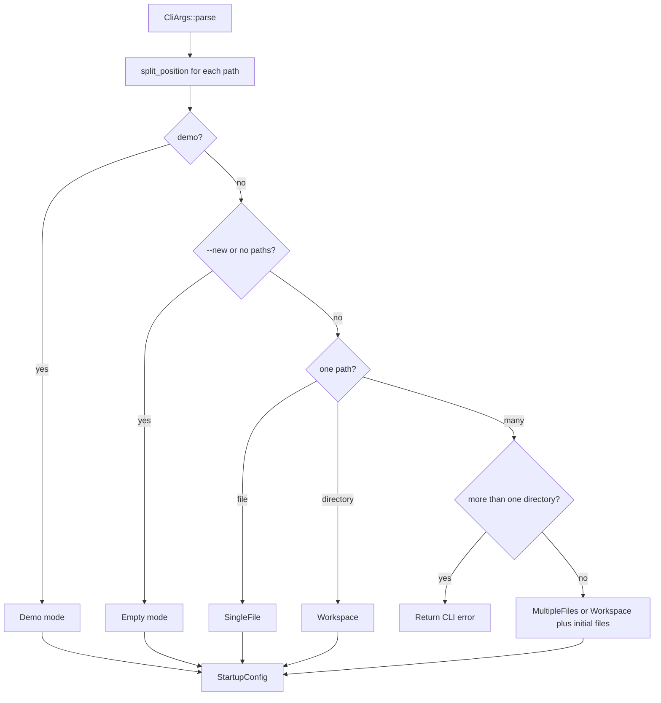
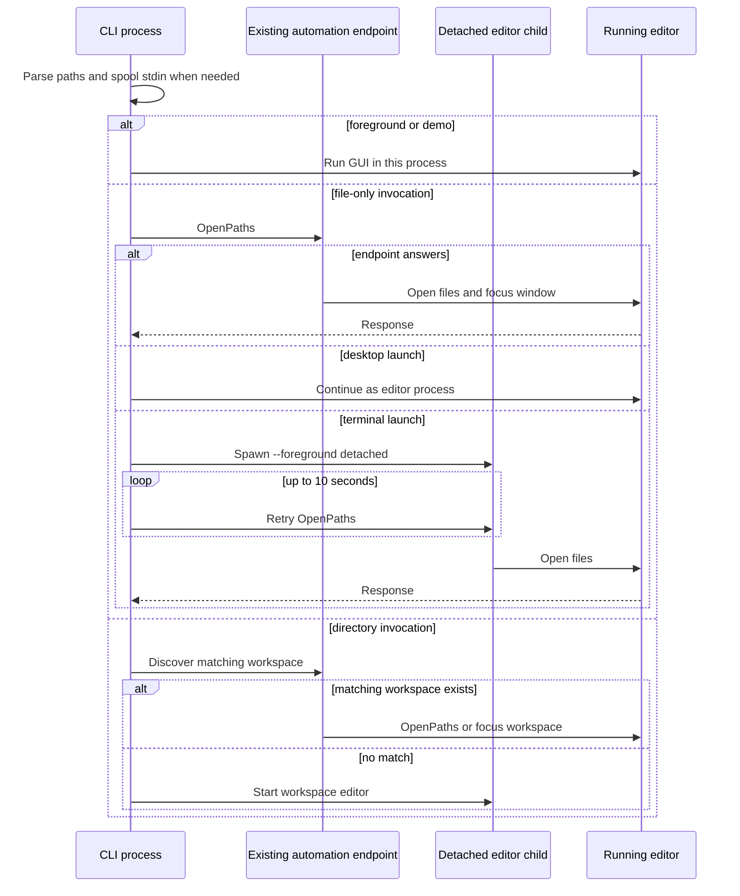
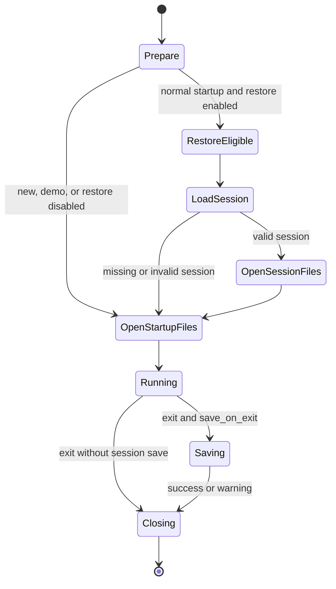

# Startup, CLI Handoff, and Session Restore

`token` has two startup layers. The shell-facing launcher decides whether this invocation should contact an existing editor, start another process, or run the GUI in the current process. The runtime then turns the parsed arguments into a model, optionally restores session metadata, and opens the requested files. This separation is important: a command-line client can return without owning the GUI, while `--foreground` bypasses handoff for the actual editor process.

## From arguments to startup mode

`CliArgs::into_config` parses each positional argument with `split_position` before classifying paths. An existing filesystem path is never split, so a real file named `notes:1` wins over position syntax. For a non-existing UTF-8 argument, a trailing `:line` means that line and a trailing `:line:column` means both coordinates; typed coordinates are 1-indexed and become 0-indexed internally. `--line` and `--column` apply to the first file and override a position suffix there. A column without `--line` has no independent effect.

The resulting modes are:

- `--demo`: deterministic in-memory demo content for automation and screenshots.
- `--new`, or no paths: an empty buffer. `--new` also disables session restoration; no-path startup still restores the default session.
- One file: `SingleFile`.
- Several files: `MultipleFiles`, opened as tabs.
- One directory: `Workspace`; a directory plus files opens the workspace and those initial files. More than one directory is rejected.

`StartupConfig` carries the mode, the optional zero-based initial position, `wait_mode`, and the independent `restore_session` decision. In the normal runtime, workspace opening happens before session lookup; explicit startup files are prepared after restoration, so command-line files can supplement or take focus after recovered state.

*Argument classification and the resulting startup configuration.*

At the runtime boundary, `AppPreparation` loads configuration and keymap, opens a workspace when requested, creates a session store for non-demo modes, restores when both CLI policy and `config.session.restore` allow it, and then calls the same file-preparation path used by later opens. The initial cursor is clamped to the loaded document's last line and line length, so an out-of-range request does not fail startup. Demo mode replaces the initial document with fixed Rust content and does not create or save a session.

File preparation uses `CreateOrOpen` for CLI startup. It preserves an existing untitled/clean starter tab until at least one requested file opens, skips failed files rather than aborting all startup, focuses the first successful file, and reports counts and the first error in the status bar. A session restore uses `Existing` instead: missing or unreadable saved files are omitted rather than created. If preparation or the preparation thread fails, the application falls back to synchronous preparation; a panicking preparation thread is logged and retried rather than leaving an uninitialized model.

## CLI handoff and process ownership

The launcher uses the automation instance endpoint as its single-instance rendezvous. It first spools `echo text | token -` to a per-process temporary file, unless stdin is a terminal or the invocation is already `--foreground`; the request then carries a real path. Files are converted to absolute `OpenPath` values so a receiving editor's working directory cannot change their meaning.

Regular file-only invocations try `Target::ForPath` for the first file, falling back to the default/recently focused instance. A successful connection sends `OpenPaths`. If no editor is running and the command came from a terminal, the launcher starts the current executable with hidden `--foreground` arguments, detached from the terminal (`setsid` on Unix and detached process flags on Windows), and polls for its endpoint for up to ten seconds. A desktop-launched invocation does not spawn a second child: it proceeds as the editor process.

Directories are deliberately different because a window owns exactly one workspace. A directory invocation normally starts a new process, except that one directory can reuse an already-running instance whose canonical workspace root matches. `--new-window` disables that reuse. With multiple directories, the child receives all arguments and the CLI-level configuration rejects multiple directories when it is converted to a startup mode.

*The launcher’s file handoff, child startup, and workspace-specific directory path.*

Without `--wait`, a handoff has a bounded 30-second request timeout and the CLI returns after the request response; a stdin spool is intentionally left for the receiver to consume. With `--wait`, the connection remains open until the opened documents close or the editor exits, and the spool is removed once this process has completed. An `Eof` racing with editor shutdown is treated as successful completion for a waiting client. Starting a new directory process with `--wait` is synchronous and waits for that editor process/window to terminate; without it, the child is detached and the launcher returns immediately. Spawn, request, and startup-timeout failures print an error and return status 1.

The receiver registers a document waiter before executing open commands. It tracks opening requests and then document identities, so `--wait` is not released merely because disk preparation finished: every opened document must be released, or the editor must exit. Unsaved-change confirmation still applies to a normal close, so a waiter can remain pending until the user resolves that close.

## Session metadata and recovery

Sessions live below the platform config directory: `$XDG_CONFIG_HOME/token-editor` or `~/.config/token-editor` on Unix/macOS, and `%APPDATA%\\token-editor` on Windows, specifically in `sessions/`. The default session is `default.json`; workspace sessions use a stable hash of the workspace path. The store checks the recorded workspace on both read and write, preventing a colliding filename from mixing workspaces.

The serialized session is metadata, not recovery of buffer contents. It records versioned layout and tabs, relative paths for workspace files where possible, active tab/focus, selections and cursors, viewport positions and fractional scroll, soft-wrap, CSV view metadata, and recent folds. It does not serialize document text, undo history, or unsaved buffer contents. On restore, normal file loading reads current disk content, then `Session::install` rebuilds panes and independent per-tab editors, collapses branches whose files are missing, restores focus and viewport state, and reports skipped tabs. If no tabs can be restored, the model keeps its usable layout and shows a status message.

Validation precedes installation. It rejects unsupported versions, invalid fold metadata, unsafe relative paths in a non-workspace session, malformed layout, oversized files, invalid JSON, and workspace mismatches. Restore failures are contained: the runtime logs a warning and sets `Session not restored: ...` rather than preventing the editor from starting. Corrupt or invalid session bytes are left intact. A valid session can likewise be refused on save if ownership changed, validation fails, serialization exceeds the 4 MiB limit, or atomic replacement cannot complete.

On event-loop exit, the app first drops the file worker and applies relevant queued save/load replies, then saves the session only when `config.session.save_on_exit` is enabled. It writes pretty JSON through a temporary file, calls `sync_all`, and persists it over the target. Save errors are warnings, not a shutdown failure. Waiters are answered before the automation endpoint is removed, ensuring a waiting CLI can receive its final response.

*Startup recovery and exit-time session lifecycle; a failed restore falls back to ordinary startup.*

## Configuration and tests that define the contract

The session behavior is controlled by `config.session.restore` and `config.session.save_on_exit`; the CLI `--new` and `--demo` are stronger startup exclusions. Useful focused coverage includes CLI mode and coordinate conversion tests in `src/cli.rs`, handoff planning and wait behavior in `src/launcher.rs`, startup/open failure and workspace/file semantics in `tests/file_open.rs` and `tests/workspace.rs`, and session round trips, missing-file collapse, workspace isolation, malformed-data preservation, and viewport restoration in `src/runtime/session.rs`. These tests are especially important when changing path parsing, endpoint targeting, asynchronous preparation, or the serialized session schema.
