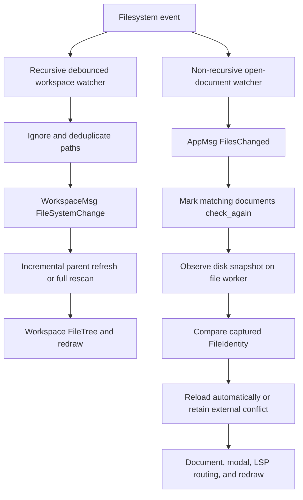

# Workspaces, File Watching, Tabs, and Navigation

A workspace is a canonical directory plus a cached explorer tree. Open documents and editor tabs are separate state: the editor area owns documents, editor instances, groups, previews, and the layout tree, while the workspace owns sidebar selection, expansion, scrolling, and the `FileTree`. This separation matters when a disk event changes both the explorer and an already-open buffer: the workspace refreshes its tree, but document conflict policy decides whether bytes are reloaded or presented for review.

## Opening a workspace and building the explorer

`Workspace::new` canonicalizes the supplied root, scans it into a `FileTree`, and initially expands the root folder. A tree node retains its display name, full `PathBuf`, directory flag, children, and cached `FileExtension`; extension classification drives file icons and recognizes common Rust, JavaScript/TypeScript, Python, Go, C/C++, data, markup, shell, lock, text, binary, and unknown files. Directories sort before files, and each group is case-insensitively alphabetical.

The scan is recursive (bounded at depth 20). It omits VCS and generated/IDE material such as `.git`, `.svn`, `.hg`, `target`, `node_modules`, `__pycache__`, `.idea`, `.vscode`, `.DS_Store`, `Thumbs.db`, `.env`, and matching bytecode patterns. `.gitignore`, `.gitattributes`, and `.editorconfig` remain visible. A non-directory root produces an empty tree rather than a file-root workspace.

The workspace model owns folder expansion and selection. Collapsing a folder removes expansion state for the entire subtree; revealing a file expands every ancestor under the workspace root and selects the file. `update::workspace` translates sidebar messages into model mutations and redraws: open-or-toggle expands a directory or delegates a file to `LayoutMsg::OpenFileInNewTab`, while keyboard selection and scrolling use the same visible-row traversal as rendering and clamp the sidebar offset after tree or expansion changes.

## Filesystem events and tree updates

`FileSystemWatcher` is the broad workspace watcher. It recursively watches the canonical root through `notify_debouncer_mini`, coalescing rapid activity with a 500 ms debounce. Polling drains its channel without blocking, skips continuous-event spam, ignores the same hidden/generated paths as the explorer (except `.gitignore`), and deduplicates repeated `Changed` events for the same path. Watcher errors are logged rather than turned into model mutations. The workspace handler performs a full rescan for an empty event set; otherwise it refreshes changed paths' parent directories. More than ten distinct parents, an invalid/out-of-root set, or a directory absent from the cached tree falls back to a full rescan.

The open-document watcher is deliberately different. It is created lazily inside the ordered `file-io` worker when a `FileJob::Watch` arrives, and is owned by that worker rather than by model update code. It watches at most two existing ancestors of every open path, non-recursively: the containing directory catches ordinary and atomic file replacement, while its parent catches containing-directory deletion and recreation. `sync` computes the desired set, un-watches removed roots, and avoids duplicate subscriptions; `rearm_parent` re-establishes a subscription after a containing directory has been replaced. Non-access notify events have their paths sorted and deduplicated before becoming `AppMsg::FilesChanged`; an optional wake callback makes the UI process the message promptly.

*The two watcher paths share filesystem notifications but have different ownership and policies: explorer freshness versus open-document safety.*

## Document identity, observation, and conflict policy

A `FileIdentity` is captured at an I/O boundary and preserves the originally supplied spelling, the resolved path, and the LSP URI. UI lookup does not resolve the filesystem. Known source or resolved paths can therefore identify an existing document even when a symlink alias is involved or the path later disappears; unknown aliases require the worker. When an observation resolves to a different identity, the document updates its identity, clears diagnostics, and closes/reopens its LSP document even if the text bytes did not change, keeping subscriptions, URI routing, and language diagnostics aligned with the actual file.

`update::file_change::changed` does not read disk. It marks every open document whose source path or captured identity is under one of the changed paths (or all documents when paths are empty) with `check_again`. Reconciliation ignores unsupported image/binary tabs, waits for pending read/write/observe/save-dialog requests, then schedules an ordered `ObserveFile` request. The file worker performs the read and returns an immutable `ObservedFile`; the update layer verifies the request and source path still match before applying it.

The observation decision is intentionally conservative:

- If disk content equals the document's saved snapshot, the transient external-change marker is cleared.
- If text bytes equal the current buffer, the saved snapshot is advanced without replacing the buffer (including the special CSV cell-edit case).
- If the buffer is clean, the revision is unchanged, `auto_reload` is enabled, and the disk result is usable text, an external reload is issued.
- Otherwise the observation is stored as `external_change` and the document is marked for user review rather than silently overwritten. The conflict modal offers Keep Editing, Reload, Overwrite, and Save As. It refuses stale dialog decisions when the path, revision, or observed snapshot no longer matches, and blocks overwrite while file settings are still loading.

A focused editor can surface the conflict automatically; modal visibility and editor focus gate that notification. Explicit resolution is allowed to report that a CSV cell edit must first be finished or canceled. This keeps filesystem I/O in the runtime worker and conflict/UI state in the model/update layer, rather than letting panels or the watcher mutate document contents directly.

## Tabs, panes, and file reuse

`EditorArea` is the owner of the tab/pane graph. It stores shared `Document` objects, `EditorState` objects that reference documents, `EditorGroup` tab lists, preview panes, and a `LayoutNode` tree containing groups, splits, and previews. A tab title is resolved through tab → editor → document, so external-change and save-error indicators are consistent between layout and painting. Multiple editors or tabs can reference the same document; path opening first checks known identity/path mappings and can reuse the existing buffer, preserving its original display path and document identity instead of loading a duplicate.

Workspace file opening delegates to the layout update pipeline, and path-based startup/open commands use the same preparation and special-tab loading path for text, images, binaries, and missing files. The current workspace implementation opens explorer files as permanent tabs; preview behavior is not yet implemented in `update::workspace`. Splitting changes groups and focus while keeping document ownership in `EditorArea`, which is why opening a known file in another group can select the existing document without a `PrepareFileOpen` command.

## Recent files

`RecentFiles` is a persistent MRU list of up to 50 entries. Each entry stores an absolute/boundary-resolved path, open timestamp, optional workspace root, open count, and a pinned flag. Opening an existing entry touches its timestamp/count and moves it to the front; pinning affects the modal's ordering without changing recency. The UI groups entries into Pinned, Today, Yesterday, and Earlier (UTC calendar-day buckets), and displays paths relative to their recorded workspace when possible.

The list loads from the configured recent-files location, defaults safely on missing or malformed data, prunes paths that no longer exist, and saves JSON after ensuring configuration directories. Tests run isolated from a developer's real recent list. Callers with an open document should use its captured `FileIdentity` path, avoiding a new filesystem lookup and preventing symlink or replacement races.

## Navigation panels and path commands

The Outline panel is a cached syntax-derived tree attached to the focused document. When the panel is active and the focused document's outline is absent or at an older revision, the update layer schedules an immediate syntax parse—even if the document was focused after the panel opened. Collapse state drives one shared visible-row traversal for counts, scrolling, hit testing, and selection. Jumping to a symbol pushes navigation history, clamps the stale outline position to the current document, moves the cursor, centers it, and returns focus to the editor.

Problems is a diagnostic navigation view backed by the LSP diagnostic mirror. Its single row authority emits path-sorted file groups and diagnostics in publish order; collapsed groups contribute only a header. In current-file mode (the default), only the focused saved document's diagnostics appear; workspace-wide mode puts the focused file first and then the remaining paths. Activation uses the row's path/index, so selection, rendering, capacity, and clicks cannot drift apart. A diagnostic path is matched through document identity-aware path handling, not only the currently existing spelling.

Find Usages requires a saved plain-text file. A request captures document ID, revision, path, cursor, and LSP position, clears the existing panel, activates the Usages dock, and runs through the references worker. A token rejects late results from superseded searches; a revision check cancels a query when its source changes or closes. Results are sorted by path and position, deduplicated, and capped at `MAX_REFERENCE_LOCATIONS`. Selecting a result follows the normal navigation pipeline and can open/reveal the target file.

The command palette exposes `RevealInFinder`, `CopyAbsolutePath`, and `CopyRelativePath`. They operate on the focused document's path, report an unsaved-file status when no path exists, and copy commands fall back to the absolute path when no workspace root is available. Reveal produces `RevealFileInFinder` for saved files; all three return a status-bar redraw path so failure or confirmation is visible.

## Focused tests and safe changes

- `tests/workspace.rs` and `tests/workspace_symbols.rs` cover workspace creation, tree behavior, and symbol navigation; `src/model/workspace.rs` tests classification, sorting, ignores, and expansion semantics.
- `src/fs_watcher.rs` tests hidden/generated filtering and debounced event behavior. `src/runtime/file_watch.rs` tests atomic file replacement, containing-directory replacement, rearming, and subscription removal.
- `tests/file_identity.rs` is the regression boundary for symlink identity across tabs, LSP diagnostics, Problems, and buffer reuse without disk availability.
- `tests/usages.rs` covers stale/superseded references and navigation results; `src/update/outline.rs` and `src/update/problems.rs` enforce shared row/count authorities.
- `tests/file_path_commands.rs` covers palette registration, saved versus unsaved behavior, workspace-relative fallback, and exact Finder paths.

When extending this area, keep broad explorer watching separate from open-document watching, do filesystem resolution only in runtime/I/O boundaries, preserve revision and identity guards around asynchronous replies, and update the shared row traversal rather than adding panel-specific indexing logic.
