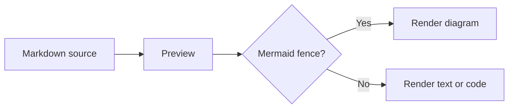
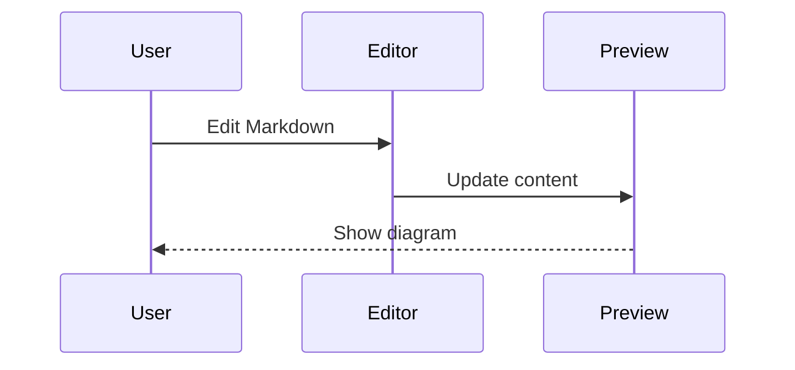
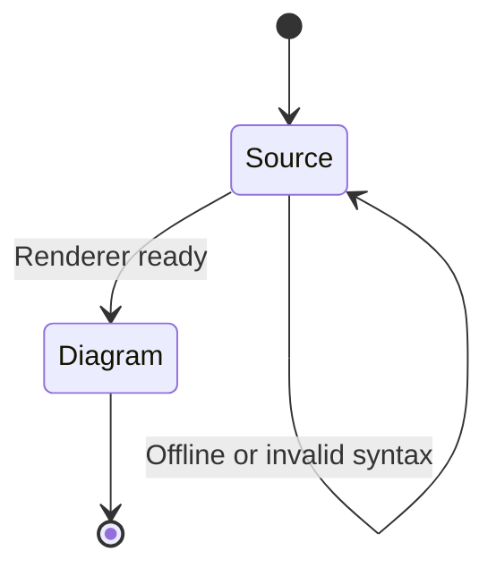

# Mermaid preview

Open the Markdown preview to render these diagrams. The renderer loads on demand
from a pinned CDN version; without a connection the source remains readable.

## Flowchart

## Sequence

## State transitions

This self-loop needs extra rank spacing to keep its transition label clear of the
outgoing edge label. Diagram-local configuration leaves other diagrams unchanged.

